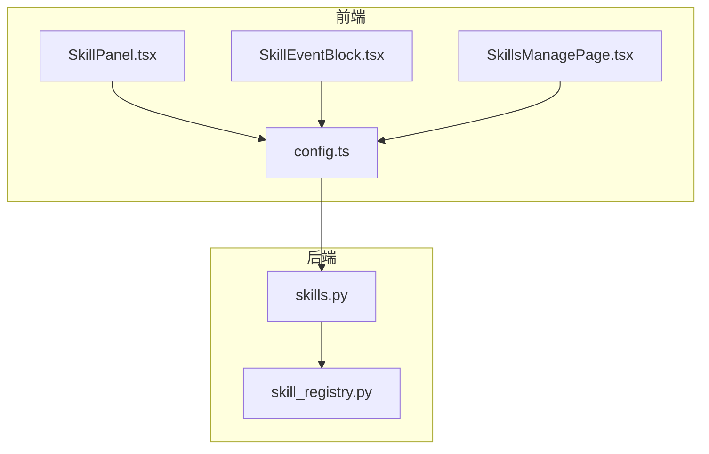
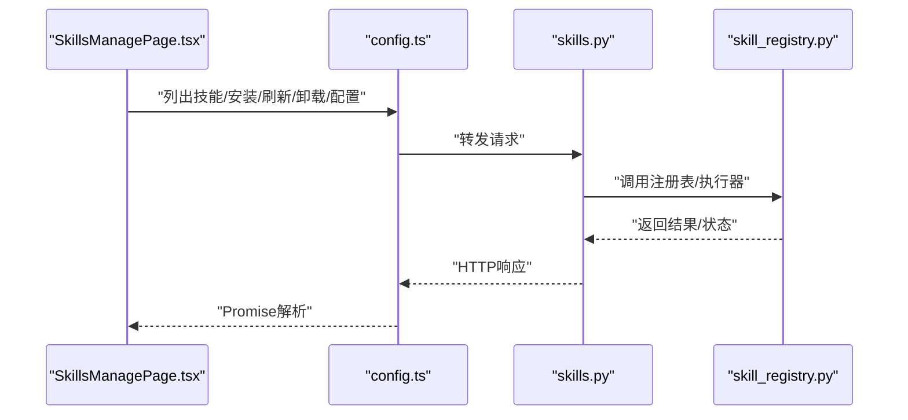
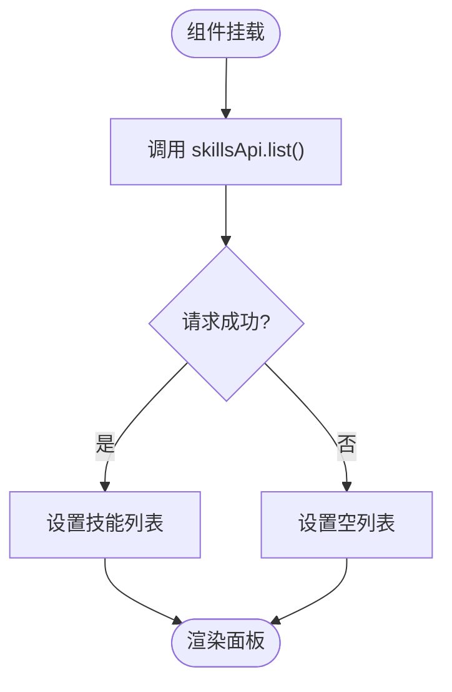
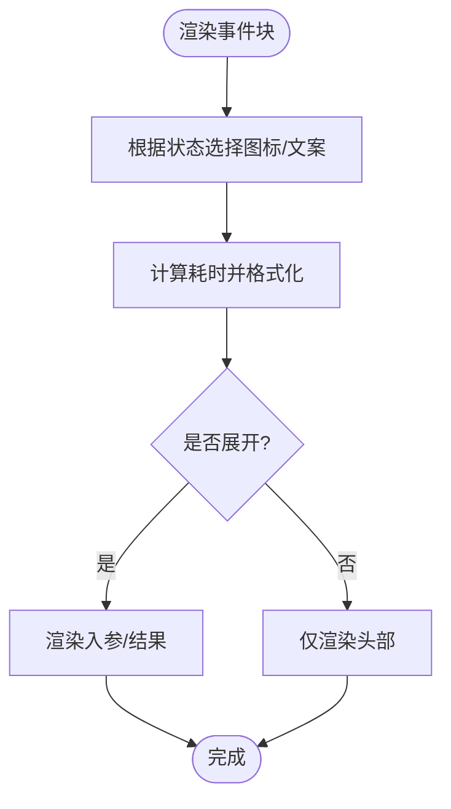
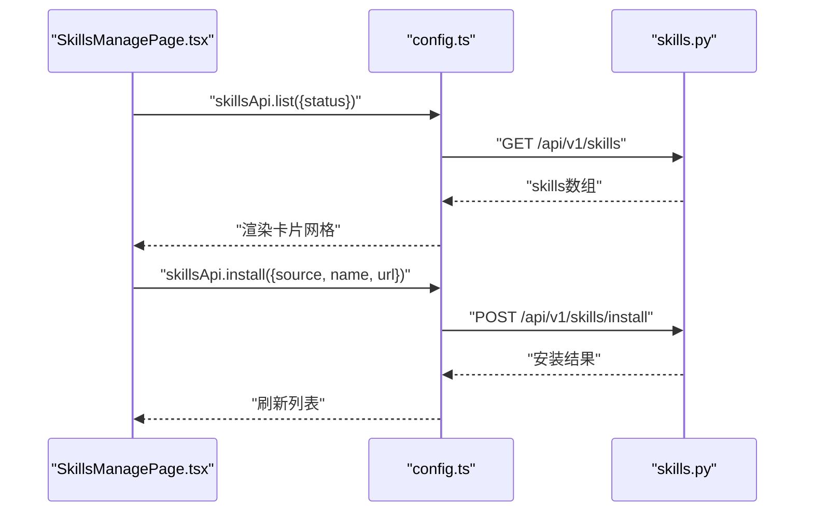
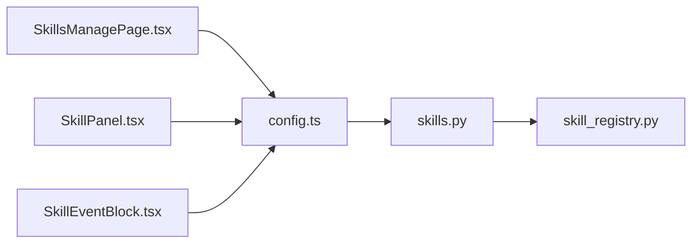

# 技能管理组件

<cite>
**本文引用的文件**
- [SkillPanel.tsx](file://frontend/src/components/SkillPanel.tsx)
- [SkillEventBlock.tsx](file://frontend/src/components/SkillEventBlock.tsx)
- [SkillsManagePage.tsx](file://frontend/src/pages/config/SkillsManagePage.tsx)
- [config.ts](file://frontend/src/api/config.ts)
- [后端api.md](file://后端api.md)
- [skills.py](file://backend/app/api/skills.py)
- [skill_registry.py](file://backend/app/core/skill_registry.py)
</cite>

## 目录
1. [简介](#简介)
2. [项目结构](#项目结构)
3. [核心组件](#核心组件)
4. [架构总览](#架构总览)
5. [详细组件分析](#详细组件分析)
6. [依赖分析](#依赖分析)
7. [性能考虑](#性能考虑)
8. [故障排除指南](#故障排除指南)
9. [结论](#结论)
10. [附录](#附录)

## 简介
本文件面向避风港平台的“技能管理组件”，围绕前端技能面板、技能事件块与技能管理页面展开，系统性梳理技能列表展示、技能配置界面、执行状态监控与事件日志查看等能力，并补充技能导入导出、参数配置、执行历史与性能统计、技能推荐、版本管理与依赖关系展示、状态同步与错误恢复机制，以及与AI代理系统的集成与实时通信实现。

## 项目结构
技能管理相关的核心文件分布如下：
- 前端组件与页面
  - 技能面板：SkillPanel.tsx
  - 技能事件块：SkillEventBlock.tsx
  - 技能管理页面：SkillsManagePage.tsx
  - API封装与类型定义：config.ts
- 后端接口与核心能力
  - Skills API：skills.py
  - 技能注册表与执行器：skill_registry.py
  - 后端API文档：后端api.md

图表来源
- [SkillPanel.tsx:1-74](file://frontend/src/components/SkillPanel.tsx#L1-L74)
- [SkillEventBlock.tsx:1-69](file://frontend/src/components/SkillEventBlock.tsx#L1-L69)
- [SkillsManagePage.tsx:1-140](file://frontend/src/pages/config/SkillsManagePage.tsx#L1-L140)
- [config.ts:138-179](file://frontend/src/api/config.ts#L138-L179)
- [skills.py:1-162](file://backend/app/api/skills.py#L1-L162)
- [skill_registry.py:239-408](file://backend/app/core/skill_registry.py#L239-L408)

章节来源
- [SkillPanel.tsx:1-74](file://frontend/src/components/SkillPanel.tsx#L1-L74)
- [SkillEventBlock.tsx:1-69](file://frontend/src/components/SkillEventBlock.tsx#L1-L69)
- [SkillsManagePage.tsx:1-140](file://frontend/src/pages/config/SkillsManagePage.tsx#L1-L140)
- [config.ts:138-179](file://frontend/src/api/config.ts#L138-L179)
- [skills.py:1-162](file://backend/app/api/skills.py#L1-L162)
- [skill_registry.py:239-408](file://backend/app/core/skill_registry.py#L239-L408)

## 核心组件
- 技能面板（SkillPanel）
  - 展示当前已启用技能数量与技能总数，支持展开/收起查看技能列表，点击切换技能启用状态。
- 技能事件块（SkillEventBlock）
  - 展示单次技能执行的入参、结果与耗时，支持展开查看详情，运行中显示进度指示。
- 技能管理页面（SkillsManagePage）
  - 提供技能列表、状态筛选、导入/刷新/卸载、编辑配置、执行历史查看等功能入口。

章节来源
- [SkillPanel.tsx:5-73](file://frontend/src/components/SkillPanel.tsx#L5-L73)
- [SkillEventBlock.tsx:11-68](file://frontend/src/components/SkillEventBlock.tsx#L11-L68)
- [SkillsManagePage.tsx:15-139](file://frontend/src/pages/config/SkillsManagePage.tsx#L15-L139)

## 架构总览
从前端到后端的调用链路如下：
- 前端通过统一API客户端封装调用后端Skills API。
- 后端Skills API路由至技能注册表与执行器，完成技能的安装、查询、执行、配置与推荐等操作。
- 执行器负责安全检查、超时控制与统计更新，并持久化执行记录。

图表来源
- [SkillsManagePage.tsx:22-32](file://frontend/src/pages/config/SkillsManagePage.tsx#L22-L32)
- [config.ts:153-179](file://frontend/src/api/config.ts#L153-L179)
- [skills.py:42-161](file://backend/app/api/skills.py#L42-L161)
- [skill_registry.py:296-408](file://backend/app/core/skill_registry.py#L296-L408)

## 详细组件分析

### 技能面板（SkillPanel）
- 功能要点
  - 加载技能列表并展示启用/总数。
  - 展开面板后逐项显示技能名称与描述，点击切换启用状态。
  - 使用全局状态管理维护已启用技能集合。
- 数据与状态
  - 通过skillsApi.list获取技能列表。
  - 通过AppStore中的toggleSkill切换技能启用状态。
- 错误与边界
  - 加载失败时回退为空列表，最终关闭加载态。

图表来源
- [SkillPanel.tsx:12-24](file://frontend/src/components/SkillPanel.tsx#L12-L24)
- [config.ts:153-160](file://frontend/src/api/config.ts#L153-L160)

章节来源
- [SkillPanel.tsx:5-73](file://frontend/src/components/SkillPanel.tsx#L5-L73)
- [config.ts:153-160](file://frontend/src/api/config.ts#L153-L160)

### 技能事件块（SkillEventBlock）
- 功能要点
  - 展示技能名称、执行状态（运行中/完成/失败）、耗时。
  - 可展开查看入参与结果；运行中显示进度条动画。
- 数据与状态
  - 通过传入的开始/结束事件对象渲染参数与结果。
  - 根据状态动态选择图标与文案。

图表来源
- [SkillEventBlock.tsx:11-68](file://frontend/src/components/SkillEventBlock.tsx#L11-L68)

章节来源
- [SkillEventBlock.tsx:11-68](file://frontend/src/components/SkillEventBlock.tsx#L11-L68)

### 技能管理页面（SkillsManagePage）
- 功能要点
  - 技能列表展示与状态筛选（全部/已安装/未安装）。
  - 导入技能（支持GitHub/压缩包/手动输入）。
  - 刷新、卸载、编辑配置。
  - 打开配置页签与导入弹窗。
- 数据与流程
  - 使用skillsApi.list按状态过滤加载技能。
  - 导入时构造安装请求并调用skillsApi.install。
  - 刷新/卸载分别调用对应API。
  - 编辑打开编辑弹窗并回调刷新列表。

图表来源
- [SkillsManagePage.tsx:22-32](file://frontend/src/pages/config/SkillsManagePage.tsx#L22-L32)
- [SkillsManagePage.tsx:57-69](file://frontend/src/pages/config/SkillsManagePage.tsx#L57-L69)
- [config.ts:153-179](file://frontend/src/api/config.ts#L153-L179)
- [skills.py:42-86](file://backend/app/api/skills.py#L42-L86)

章节来源
- [SkillsManagePage.tsx:15-139](file://frontend/src/pages/config/SkillsManagePage.tsx#L15-L139)
- [config.ts:153-179](file://frontend/src/api/config.ts#L153-L179)
- [skills.py:42-86](file://backend/app/api/skills.py#L42-L86)

### 技能推荐、版本管理与依赖关系
- 技能推荐
  - 后端提供推荐接口，支持按业务阶段、事件类别、产品类型上下文推荐。
- 版本管理
  - 技能信息包含版本字段；安装时可携带配置，更新配置通过API完成。
- 依赖关系
  - 注册表中记录依赖列表，可用于展示与后续依赖解析。

章节来源
- [skills.py:136-147](file://backend/app/api/skills.py#L136-L147)
- [skill_registry.py:41-78](file://backend/app/core/skill_registry.py#L41-L78)

### 执行历史与性能统计
- 执行历史
  - 后端提供执行历史查询接口，支持按技能名与限制条数查询。
- 性能统计
  - 执行器记录每次执行的开始/结束时间、耗时、状态，并更新技能成功率与平均耗时等指标。

章节来源
- [skills.py:157-161](file://backend/app/api/skills.py#L157-L161)
- [skill_registry.py:81-96](file://backend/app/core/skill_registry.py#L81-L96)
- [skill_registry.py:458-478](file://backend/app/core/skill_registry.py#L458-L478)

### 状态同步与错误恢复
- 状态同步
  - 前端通过轮询或事件订阅（如SSE）获取执行状态与日志，保持UI与后端一致。
- 错误恢复
  - 执行器对超时、异常进行捕获并记录；推荐在前端重试或提示用户检查配置。

章节来源
- [skills.py:88-104](file://backend/app/api/skills.py#L88-L104)
- [skill_registry.py:467-478](file://backend/app/core/skill_registry.py#L467-L478)

### 与AI代理系统的集成与实时通信
- 集成点
  - 技能作为代理可调用的原子能力，通过统一API暴露给代理编排。
- 实时通信
  - 建议采用SSE或WebSocket推送执行事件（开始/结束/错误），前端以SkillEventBlock渲染。

章节来源
- [后端api.md:209-255](file://后端api.md#L209-L255)
- [SkillEventBlock.tsx:11-16](file://frontend/src/components/SkillEventBlock.tsx#L11-L16)

## 依赖分析
- 前端
  - 技能面板依赖全局状态与skillsApi。
  - 技能事件块依赖传入的事件对象与状态。
  - 技能管理页面依赖多个子组件与API封装。
- 后端
  - Skills API依赖技能注册表与执行器。
  - 注册表维护技能元数据、安装计数、成功率、平均耗时等统计。

图表来源
- [config.ts:153-179](file://frontend/src/api/config.ts#L153-L179)
- [skills.py:42-161](file://backend/app/api/skills.py#L42-L161)
- [skill_registry.py:239-408](file://backend/app/core/skill_registry.py#L239-L408)

章节来源
- [config.ts:153-179](file://frontend/src/api/config.ts#L153-L179)
- [skills.py:42-161](file://backend/app/api/skills.py#L42-L161)
- [skill_registry.py:239-408](file://backend/app/core/skill_registry.py#L239-L408)

## 性能考虑
- 前端
  - 列表渲染采用虚拟滚动与懒加载，减少DOM压力。
  - 事件块默认折叠，仅在需要时展开详情。
- 后端
  - 执行器设置默认超时阈值，避免长时间阻塞。
  - 统一的安全沙箱检查，降低高危调用风险。

## 故障排除指南
- 技能安装失败
  - 检查源类型与URL是否正确；查看后端返回的错误信息。
- 执行超时或失败
  - 增加超时时间或优化上游服务；查看执行历史定位问题。
- 配置无法更新
  - 确认技能ID有效且存在；检查权限与必填字段。

章节来源
- [skills.py:56-57](file://backend/app/api/skills.py#L56-L57)
- [skills.py:121-124](file://backend/app/api/skills.py#L121-L124)

## 结论
技能管理组件通过清晰的前后端职责划分，实现了从技能列表、配置、执行到推荐与统计的完整闭环。前端以组件化方式提供直观的交互体验，后端以注册表与执行器为核心保障安全性与可观测性。建议在后续迭代中完善实时事件推送、批量操作与依赖可视化能力，进一步提升平台的可运维性与可扩展性。

## 附录
- API一览（节选）
  - 列表与详情：GET /api/v1/skills, GET /api/v1/skills/{id}
  - 安装/刷新/卸载：POST /api/v1/skills/install, POST /api/v1/skills/{id}/refresh, DELETE /api/v1/skills/{id}
  - 执行与状态：POST /api/v1/skills/{id}/execute, GET /api/v1/skills/{id}/status
  - 配置：GET /api/v1/skills/{id}/config, PUT /api/v1/skills/{id}/config
  - 推荐与矩阵：POST /api/v1/skills/recommend, GET /api/v1/skills/matrix/stages
  - 执行历史：GET /api/v1/skills/executions/history

章节来源
- [后端api.md:209-255](file://后端api.md#L209-L255)
- [skills.py:42-161](file://backend/app/api/skills.py#L42-L161)