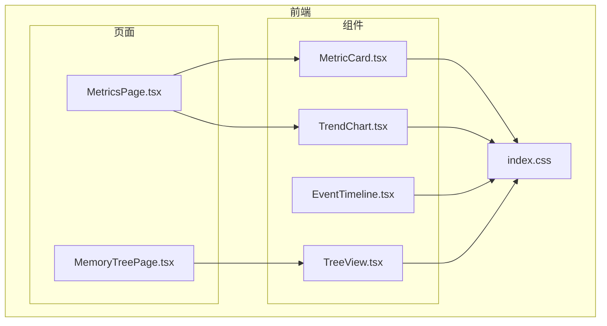
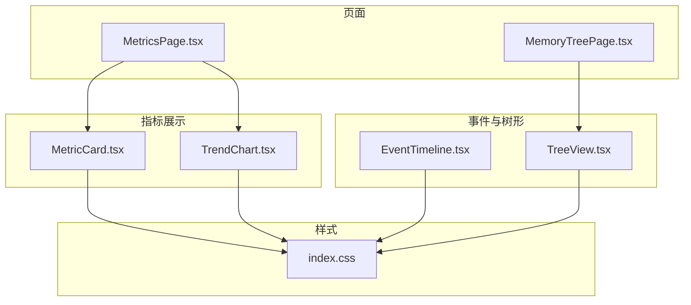
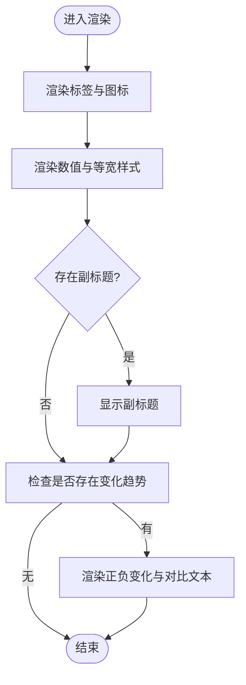
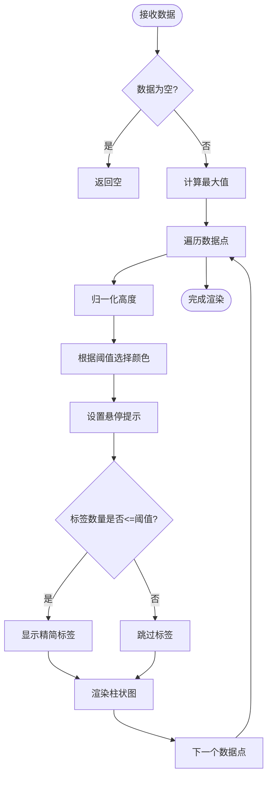
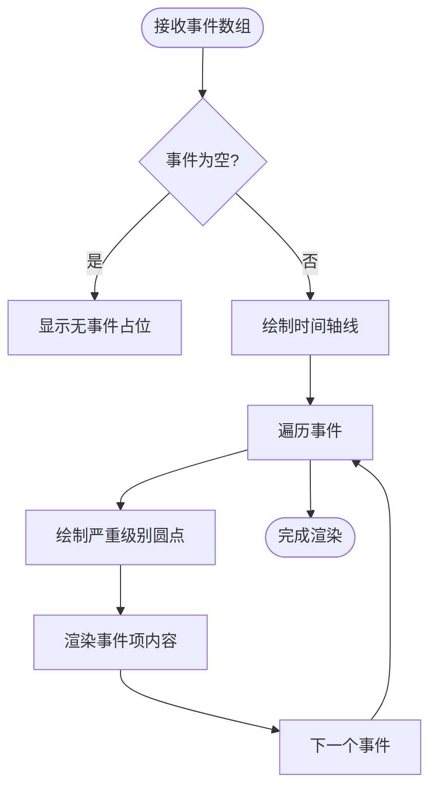
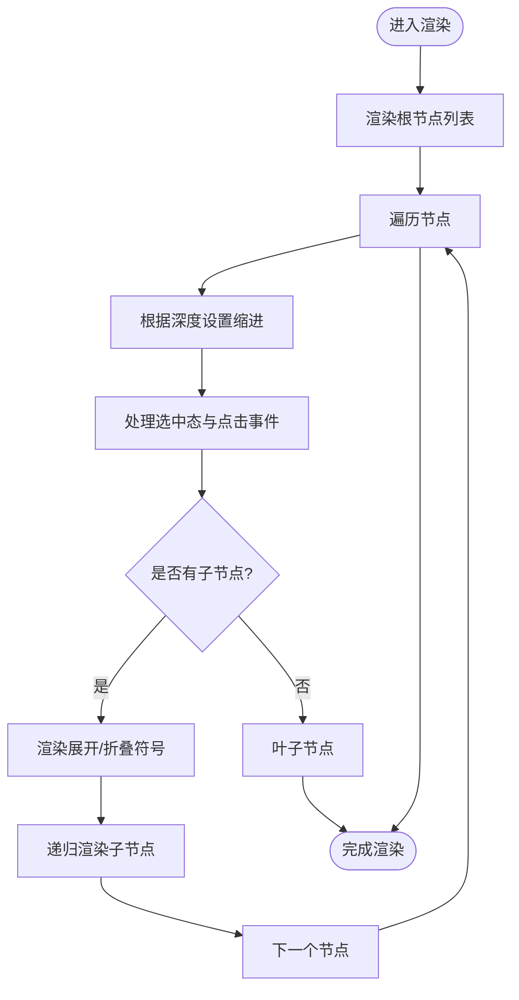
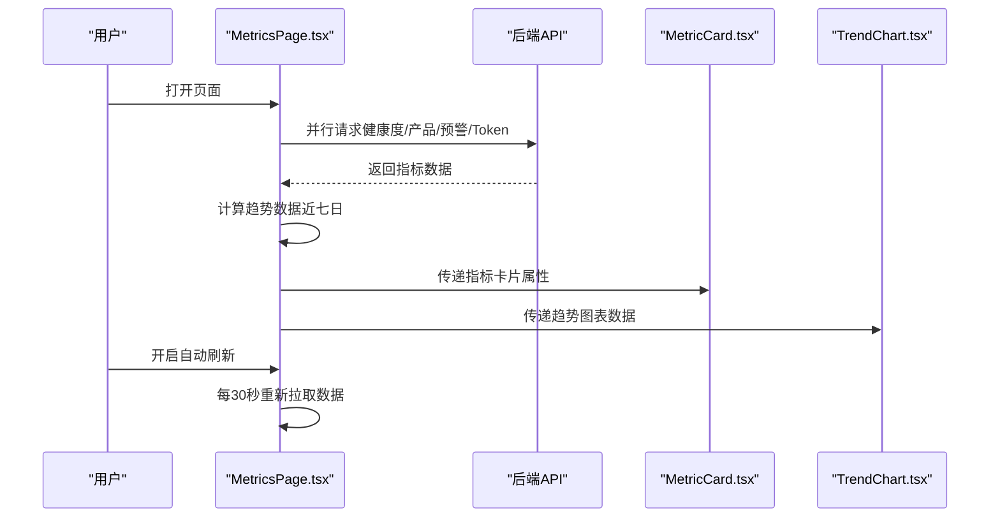
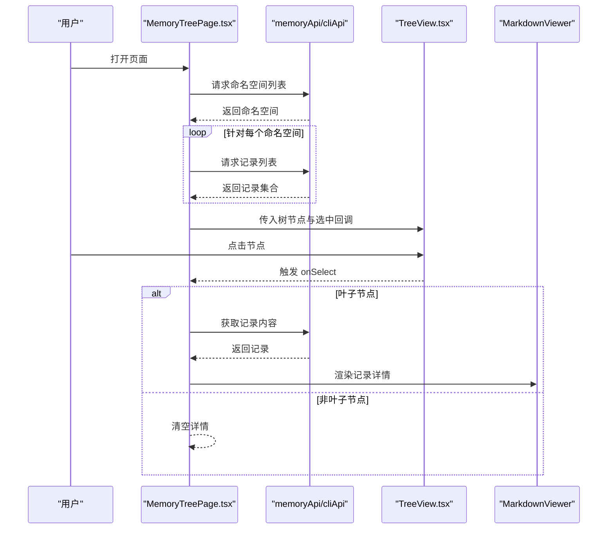
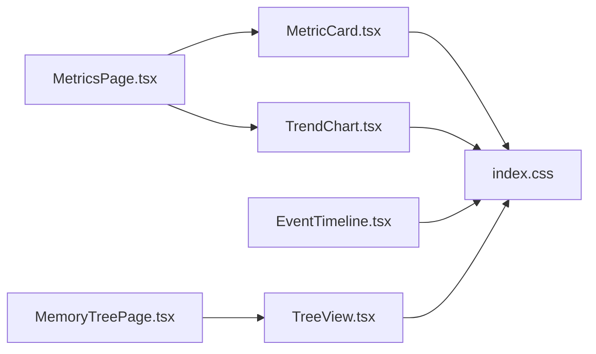

# 数据展示组件

<cite>
**本文引用的文件**
- [MetricCard.tsx](file://frontend/src/components/metrics/MetricCard.tsx)
- [TrendChart.tsx](file://frontend/src/components/metrics/TrendChart.tsx)
- [EventTimeline.tsx](file://frontend/src/components/EventTimeline.tsx)
- [TreeView.tsx](file://frontend/src/components/memory/TreeView.tsx)
- [MetricsPage.tsx](file://frontend/src/pages/MetricsPage.tsx)
- [MemoryTreePage.tsx](file://frontend/src/pages/MemoryTreePage.tsx)
- [index.css](file://frontend/src/index.css)
</cite>

## 目录
1. [简介](#简介)
2. [项目结构](#项目结构)
3. [核心组件](#核心组件)
4. [架构概览](#架构概览)
5. [详细组件分析](#详细组件分析)
6. [依赖关系分析](#依赖关系分析)
7. [性能考虑](#性能考虑)
8. [故障排查指南](#故障排查指南)
9. [结论](#结论)
10. [附录](#附录)

## 简介
本文件面向避风港平台的数据展示组件，聚焦以下四个组件的实现与使用：
- 指标卡片：MetricCard
- 趋势图表：TrendChart
- 事件时间线：EventTimeline
- 树形视图：TreeView

内容涵盖数据可视化、图表渲染、时间序列展示、层级数据组织、动态数据更新、交互式缩放、数据过滤与导出能力、多图表类型支持、主题定制与响应式布局，并针对大数据量渲染与内存优化提出实践建议。同时记录与数据源的连接与实时数据同步机制。

## 项目结构
前端采用按功能分层的目录组织，数据展示组件位于 components 子目录，页面级容器位于 pages 子目录，全局样式与品牌色变量位于 src/index.css。

**图表来源**
- [MetricsPage.tsx](file://frontend/src/pages/MetricsPage.tsx)
- [MemoryTreePage.tsx](file://frontend/src/pages/MemoryTreePage.tsx)
- [MetricCard.tsx](file://frontend/src/components/metrics/MetricCard.tsx)
- [TrendChart.tsx](file://frontend/src/components/metrics/TrendChart.tsx)
- [EventTimeline.tsx](file://frontend/src/components/EventTimeline.tsx)
- [TreeView.tsx](file://frontend/src/components/memory/TreeView.tsx)
- [index.css](file://frontend/src/index.css)

**章节来源**
- [MetricsPage.tsx](file://frontend/src/pages/MetricsPage.tsx)
- [MemoryTreePage.tsx](file://frontend/src/pages/MemoryTreePage.tsx)
- [index.css](file://frontend/src/index.css)

## 核心组件
本节对四个组件进行要点梳理，包括职责、输入输出、渲染策略与交互行为。

- 指标卡片 MetricCard
  - 职责：以卡片形式展示单一指标数值、标签、图标、副标题与同比变化。
  - 关键特性：支持正负向增减标识、百分比数值、可选副标题；基于 Tailwind 类名实现主题色与间距。
  - 适用场景：系统健康度、产品数量、预警数、Token 消耗等关键指标。

- 趋势图表 TrendChart
  - 职责：以柱状图展示时间序列或分类数据的趋势。
  - 关键特性：支持阈值配色（优秀/警告/危险）、悬停提示、自适应高度、短标签显示控制；根据最大值归一化高度。
  - 适用场景：阶段通过率、近七日健康度趋势、模型用量占比等。

- 事件时间线 EventTimeline
  - 职责：垂直时间线展示事件列表，支持严重级别与事件类型图标。
  - 关键特性：左侧时间轴线与圆点、事件类型图标映射、严重级别着色、时间戳与可选描述。
  - 适用场景：合规事件、证书变更、法规更新、风险预警等时序事件。

- 树形视图 TreeView
  - 职责：展示层级数据结构，支持展开/折叠与节点选择。
  - 关键特性：递归渲染子节点、深度缩进、选中态高亮、元信息展示、可搜索过滤。
  - 适用场景：命名空间与记忆记录的导航浏览。

**章节来源**
- [MetricCard.tsx](file://frontend/src/components/metrics/MetricCard.tsx)
- [TrendChart.tsx](file://frontend/src/components/metrics/TrendChart.tsx)
- [EventTimeline.tsx](file://frontend/src/components/EventTimeline.tsx)
- [TreeView.tsx](file://frontend/src/components/memory/TreeView.tsx)

## 架构概览
下图展示了页面与组件之间的调用关系及数据流向。

**图表来源**
- [MetricsPage.tsx](file://frontend/src/pages/MetricsPage.tsx)
- [MemoryTreePage.tsx](file://frontend/src/pages/MemoryTreePage.tsx)
- [MetricCard.tsx](file://frontend/src/components/metrics/MetricCard.tsx)
- [TrendChart.tsx](file://frontend/src/components/metrics/TrendChart.tsx)
- [EventTimeline.tsx](file://frontend/src/components/EventTimeline.tsx)
- [TreeView.tsx](file://frontend/src/components/memory/TreeView.tsx)
- [index.css](file://frontend/src/index.css)

## 详细组件分析

### 指标卡片 MetricCard
- 设计模式：函数组件 + Props 接口定义，无内部状态。
- 渲染逻辑：
  - 头部：标签与图标水平排列。
  - 数值区：强调字体与等宽数字，提升可读性。
  - 副标题：可选显示。
  - 变化趋势：可选 delta 对象，正负方向以不同颜色与上/下降箭头表示。
- 主题与样式：依赖全局 CSS 变量与 Tailwind 类名，确保一致的品牌色与对比度。
- 性能：纯渲染，无副作用，开销极低。

**图表来源**
- [MetricCard.tsx](file://frontend/src/components/metrics/MetricCard.tsx)

**章节来源**
- [MetricCard.tsx](file://frontend/src/components/metrics/MetricCard.tsx)

### 趋势图表 TrendChart
- 设计模式：函数组件 + 内部阈值配色函数；接收数据点数组与可选标题、高度、阈值。
- 渲染逻辑：
  - 计算最大值并归一化高度，保证视觉比例一致。
  - 每个数据点渲染为竖向柱，悬停显示详情气泡。
  - 当数据点数量不超过一定阈值时显示精简标签。
  - 颜色由阈值决定：优秀/警告/危险三档。
- 交互行为：鼠标悬停显示提示框；柱体悬停透明度变化。
- 主题与样式：颜色与排版统一使用全局样式。

**图表来源**
- [TrendChart.tsx](file://frontend/src/components/metrics/TrendChart.tsx)

**章节来源**
- [TrendChart.tsx](file://frontend/src/components/metrics/TrendChart.tsx)

### 事件时间线 EventTimeline
- 设计模式：函数组件 + 事件类型到图标的映射表；支持严重级别与可选描述。
- 渲染逻辑：
  - 左侧垂直线与圆点构成时间轴。
  - 每个事件项包含类型图标、标题、可选描述与时间戳。
  - 严重级别对应不同背景色与描边效果。
- 交互行为：无交互，纯展示。
- 主题与样式：统一使用全局色板与字号体系。

**图表来源**
- [EventTimeline.tsx](file://frontend/src/components/EventTimeline.tsx)

**章节来源**
- [EventTimeline.tsx](file://frontend/src/components/EventTimeline.tsx)

### 树形视图 TreeView
- 设计模式：函数组件 + 递归子节点渲染；内部维护展开状态与选中态。
- 渲染逻辑：
  - 根据深度动态缩进，支持展开/折叠符号。
  - 选中节点高亮，非选中节点悬停高亮。
  - 支持元信息（如记录数量、更新时间）展示。
- 交互行为：点击节点切换展开/折叠（若有子节点），并触发外部 onSelect 回调。
- 过滤：页面层面对树进行搜索过滤后再传入组件。

**图表来源**
- [TreeView.tsx](file://frontend/src/components/memory/TreeView.tsx)

**章节来源**
- [TreeView.tsx](file://frontend/src/components/memory/TreeView.tsx)

### 页面集成与数据流（以指标页为例）
- 数据来源：通过 API 并行拉取健康度、产品数、预警数、Token 使用等指标。
- 实时更新：支持定时器自动刷新与手动刷新按钮。
- 趋势数据：从简报历史接口获取近七日数据，结合实时健康度动态填充最后一天。
- 组件组合：指标卡片与趋势图表在同一网格布局中展示，辅以模型用量分解与系统总结。

**图表来源**
- [MetricsPage.tsx](file://frontend/src/pages/MetricsPage.tsx)
- [MetricCard.tsx](file://frontend/src/components/metrics/MetricCard.tsx)
- [TrendChart.tsx](file://frontend/src/components/metrics/TrendChart.tsx)

**章节来源**
- [MetricsPage.tsx](file://frontend/src/pages/MetricsPage.tsx)

### 页面集成与数据流（以记忆树页为例）
- 数据来源：命名空间列表与各命名空间下的记录列表；特殊“CLI 历史”作为命名空间加载。
- 过滤：页面层面对树进行关键词过滤，再传入 TreeView。
- 选择行为：选中叶子节点时异步加载记录内容，右侧展示 Markdown 查看器。
- 组件组合：左侧树导航 + 右侧内容区域，支持搜索与占位提示。

**图表来源**
- [MemoryTreePage.tsx](file://frontend/src/pages/MemoryTreePage.tsx)
- [TreeView.tsx](file://frontend/src/components/memory/TreeView.tsx)

**章节来源**
- [MemoryTreePage.tsx](file://frontend/src/pages/MemoryTreePage.tsx)

## 依赖关系分析
- 组件间依赖：
  - 页面组件负责数据获取与状态管理，向子组件传递 props。
  - 组件之间无直接相互依赖，耦合度低，内聚性强。
- 外部依赖：
  - 样式依赖：Tailwind 类名与全局 CSS 变量。
  - 交互依赖：React 状态与回调（如 onSelect）。
- 可能的循环依赖：未发现文件间循环导入。

**图表来源**
- [MetricsPage.tsx](file://frontend/src/pages/MetricsPage.tsx)
- [MemoryTreePage.tsx](file://frontend/src/pages/MemoryTreePage.tsx)
- [MetricCard.tsx](file://frontend/src/components/metrics/MetricCard.tsx)
- [TrendChart.tsx](file://frontend/src/components/metrics/TrendChart.tsx)
- [EventTimeline.tsx](file://frontend/src/components/EventTimeline.tsx)
- [TreeView.tsx](file://frontend/src/components/memory/TreeView.tsx)
- [index.css](file://frontend/src/index.css)

**章节来源**
- [index.css](file://frontend/src/index.css)

## 性能考虑
- 渲染性能
  - TrendChart：按数据点数量线性渲染，建议限制单次渲染数据点数量（例如超过阈值时降采样或分页）。
  - TreeView：递归渲染，建议对深层节点延迟渲染或虚拟滚动（仅渲染可视区域）。
  - EventTimeline：事件数量较多时，建议分页或懒加载。
- 内存优化
  - 页面组件中使用定时器自动刷新，离开页面时应清理定时器，避免内存泄漏。
  - 异步请求失败时应避免重复重试，使用防抖或指数退避策略。
- 主题与样式
  - 统一使用 CSS 变量与 Tailwind 类名，减少内联样式的重复计算。
- 大数据量建议
  - 使用 React.memo 或 useMemo 缓存 props 与计算结果。
  - 图表组件可引入 Canvas 或 WebGL 渲染替代 DOM，显著降低大量元素的 DOM 成本。
  - 对时间序列数据采用滑动窗口与增量更新，避免全量重绘。

[本节为通用性能指导，不直接分析具体文件，故无“章节来源”]

## 故障排查指南
- 指标卡片无数据显示
  - 检查父组件是否正确传递 label/value/icon 等 props。
  - 确认全局样式是否生效。
- 趋势图表不显示
  - 确认 data 非空且包含有效数值；检查阈值配置是否合理。
  - 检查容器高度是否足够显示柱状图。
- 事件时间线空白
  - 确认 events 数组非空；检查事件字段（类型、严重级别、时间戳）是否完整。
- 树形视图无法展开
  - 确认节点 children 是否存在且非空；检查 onSelect 回调是否正确处理叶子节点。
- 页面自动刷新无效
  - 检查定时器是否被清理；确认网络请求成功且数据已更新。

**章节来源**
- [MetricsPage.tsx](file://frontend/src/pages/MetricsPage.tsx)
- [MemoryTreePage.tsx](file://frontend/src/pages/MemoryTreePage.tsx)
- [TrendChart.tsx](file://frontend/src/components/metrics/TrendChart.tsx)
- [EventTimeline.tsx](file://frontend/src/components/EventTimeline.tsx)
- [TreeView.tsx](file://frontend/src/components/memory/TreeView.tsx)

## 结论
避风港平台的数据展示组件以简洁、可复用为核心设计原则，通过页面容器聚合数据与状态，组件专注渲染与交互，形成清晰的职责分离。MetricCard、TrendChart、EventTimeline、TreeView 分别覆盖指标、趋势、事件与层级数据的典型场景。配合全局样式与主题变量，组件具备良好的一致性与可扩展性。对于大规模数据与复杂交互，建议引入虚拟化、Canvas 渲染与增量更新等优化手段，持续提升性能与用户体验。

[本节为总结性内容，不直接分析具体文件，故无“章节来源”]

## 附录
- 主题定制
  - 通过修改 CSS 变量可快速调整主色、语义色与背景色。
  - 组件颜色使用语义类名，便于统一替换。
- 响应式布局
  - 页面采用网格布局，组件内部使用相对单位与弹性布局，适配不同屏幕尺寸。
- 导出功能
  - 当前组件未内置导出能力，可在页面层面对图表进行截图或生成 PDF（需额外实现）。

**章节来源**
- [index.css](file://frontend/src/index.css)
- [MetricsPage.tsx](file://frontend/src/pages/MetricsPage.tsx)
- [MemoryTreePage.tsx](file://frontend/src/pages/MemoryTreePage.tsx)