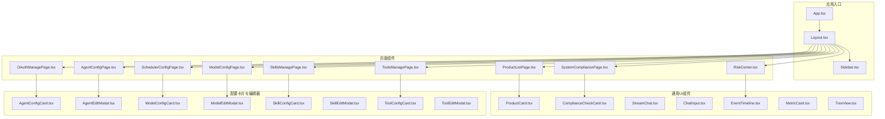
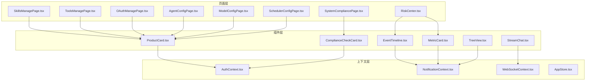
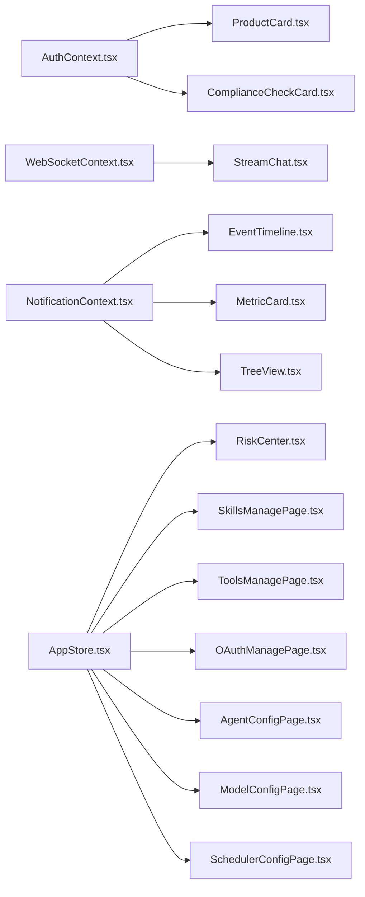

# 用户界面组件

<cite>
**本文引用的文件**
- [App.tsx](file://frontend/src/App.tsx)
- [Layout.tsx](file://frontend/src/components/Layout.tsx)
- [Sidebar.tsx](file://frontend/src/components/Sidebar.tsx)
- [ProductCard.tsx](file://frontend/src/components/ProductCard.tsx)
- [ComplianceCheckCard.tsx](file://frontend/src/components/ComplianceCheckCard.tsx)
- [RiskCenter.tsx](file://frontend/src/pages/RiskCenter.tsx)
- [SystemCompliancePage.tsx](file://frontend/src/pages/SystemCompliancePage.tsx)
- [SkillsManagePage.tsx](file://frontend/src/pages/config/SkillsManagePage.tsx)
- [ToolsManagePage.tsx](file://frontend/src/pages/config/ToolsManagePage.tsx)
- [OAuthManagePage.tsx](file://frontend/src/pages/config/OAuthManagePage.tsx)
- [AgentConfigPage.tsx](file://frontend/src/pages/config/AgentConfigPage.tsx)
- [ModelConfigPage.tsx](file://frontend/src/pages/config/ModelConfigPage.tsx)
- [SchedulerConfigPage.tsx](file://frontend/src/pages/config/SchedulerConfigPage.tsx)
- [index.css](file://frontend/src/index.css)
- [types/index.ts](file://frontend/src/types/index.ts)
- [AuthContext.tsx](file://frontend/src/context/AuthContext.tsx)
- [NotificationContext.tsx](file://frontend/src/context/NotificationContext.tsx)
- [WebSocketContext.tsx](file://frontend/src/context/WebSocketContext.tsx)
- [AppStore.tsx](file://frontend/src/context/AppStore.tsx)
- [useSSEChat.ts](file://frontend/src/hooks/useSSEChat.ts)
- [ActionSuggestionCard.tsx](file://frontend/src/components/ActionSuggestionCard.tsx)
- [ChatInput.tsx](file://frontend/src/components/ChatInput.tsx)
- [StreamChat.tsx](file://frontend/src/components/StreamChat.tsx)
- [StreamMessageRenderer.tsx](file://frontend/src/components/StreamMessageRenderer.tsx)
- [ThinkingBlock.tsx](file://frontend/src/components/ThinkingBlock.tsx)
- [PlanBlock.tsx](file://frontend/src/components/PlanBlock.tsx)
- [SkillEventBlock.tsx](file://frontend/src/components/SkillEventBlock.tsx)
- [EventTimeline.tsx](file://frontend/src/components/EventTimeline.tsx)
- [DailyBrief.tsx](file://frontend/src/components/DailyBrief.tsx)
- [ToastNotification.tsx](file://frontend/src/components/ToastNotification.tsx)
- [NotificationCenter.tsx](file://frontend/src/components/NotificationCenter.tsx)
- [PipelineNav.tsx](file://frontend/src/components/PipelineNav.tsx)
- [ToolPanel.tsx](file://frontend/src/components/ToolPanel.tsx)
- [AgentSelector.tsx](file://frontend/src/components/AgentSelector.tsx)
- [CLICommandInput.tsx](file://frontend/src/components/CLICommandInput.tsx)
- [CLICommandResult.tsx](file://frontend/src/components/CLICommandResult.tsx)
- [ExecutionResult.tsx](file://frontend/src/components/ExecutionResult.tsx)
- [config/AgentConfigCard.tsx](file://frontend/src/components/config/AgentConfigCard.tsx)
- [config/AgentEditModal.tsx](file://frontend/src/components/config/AgentEditModal.tsx)
- [config/ConfigSelector.tsx](file://frontend/src/components/config/ConfigSelector.tsx)
- [config/ConfigTabs.tsx](file://frontend/src/components/config/ConfigTabs.tsx)
- [config/FileImportModal.tsx](file://frontend/src/components/config/FileImportModal.tsx)
- [config/ModelConfigCard.tsx](file://frontend/src/components/config/ModelConfigCard.tsx)
- [config/ModelEditModal.tsx](file://frontend/src/components/config/ModelEditModal.tsx)
- [config/OAuthConfigCard.tsx](file://frontend/src/components/config/OAuthConfigCard.tsx)
- [config/OAuthEditModal.tsx](file://frontend/src/components/config/OAuthEditModal.tsx)
- [config/SkillConfigCard.tsx](file://frontend/src/components/config/SkillConfigCard.tsx)
- [config/SkillEditModal.tsx](file://frontend/src/components/config/SkillEditModal.tsx)
- [config/ToolConfigCard.tsx](file://frontend/src/components/config/ToolConfigCard.tsx)
- [config/ToolEditModal.tsx](file://frontend/src/components/config/ToolEditModal.tsx)
- [metrics/MetricCard.tsx](file://frontend/src/components/metrics/MetricCard.tsx)
- [metrics/TrendChart.tsx](file://frontend/src/components/metrics/TrendChart.tsx)
- [memory/MarkdownViewer.tsx](file://frontend/src/components/memory/MarkdownViewer.tsx)
- [memory/TreeView.tsx](file://frontend/src/components/memory/TreeView.tsx)
</cite>

## 目录
1. [简介](#简介)
2. [项目结构](#项目结构)
3. [核心组件](#核心组件)
4. [架构总览](#架构总览)
5. [详细组件分析](#详细组件分析)
6. [依赖关系分析](#依赖关系分析)
7. [性能考虑](#性能考虑)
8. [故障排查指南](#故障排查指南)
9. [结论](#结论)
10. [附录](#附录)

## 简介
本文件面向避风港平台的用户界面组件，聚焦于产品管理、合规检查、风险监控、技能与工具配置等模块的组件化实现。文档从视觉外观、行为与交互、属性/事件/插槽/自定义选项、使用示例、响应式与无障碍、状态与动画、样式与主题、跨浏览器与性能、组件组合与集成等方面进行系统化梳理，并提供可追溯的源码路径以便进一步查阅。

## 项目结构
前端采用基于功能域的组件组织方式，页面级组件位于 pages 目录，通用 UI 组件位于 components 目录，配置类卡片与编辑模态位于 components/config 子目录，指标与内存相关组件分别位于 metrics 与 memory 子目录；上下文与类型定义位于 context 与 types 目录；入口应用与全局样式位于 src 根目录。

图表来源
- [App.tsx](file://frontend/src/App.tsx)
- [Layout.tsx](file://frontend/src/components/Layout.tsx)
- [Sidebar.tsx](file://frontend/src/components/Sidebar.tsx)
- [ProductListPage.tsx](file://frontend/src/pages/ProductListPage.tsx)
- [SystemCompliancePage.tsx](file://frontend/src/pages/SystemCompliancePage.tsx)
- [RiskCenter.tsx](file://frontend/src/pages/RiskCenter.tsx)
- [SkillsManagePage.tsx](file://frontend/src/pages/config/SkillsManagePage.tsx)
- [ToolsManagePage.tsx](file://frontend/src/pages/config/ToolsManagePage.tsx)
- [OAuthManagePage.tsx](file://frontend/src/pages/config/OAuthManagePage.tsx)
- [AgentConfigPage.tsx](file://frontend/src/pages/config/AgentConfigPage.tsx)
- [ModelConfigPage.tsx](file://frontend/src/pages/config/ModelConfigPage.tsx)
- [SchedulerConfigPage.tsx](file://frontend/src/pages/config/SchedulerConfigPage.tsx)
- [ProductCard.tsx](file://frontend/src/components/ProductCard.tsx)
- [ComplianceCheckCard.tsx](file://frontend/src/components/ComplianceCheckCard.tsx)
- [EventTimeline.tsx](file://frontend/src/components/EventTimeline.tsx)
- [MetricCard.tsx](file://frontend/src/components/metrics/MetricCard.tsx)
- [TreeView.tsx](file://frontend/src/components/memory/TreeView.tsx)
- [AgentConfigCard.tsx](file://frontend/src/components/config/AgentConfigCard.tsx)
- [AgentEditModal.tsx](file://frontend/src/components/config/AgentEditModal.tsx)
- [ModelConfigCard.tsx](file://frontend/src/components/config/ModelConfigCard.tsx)
- [ModelEditModal.tsx](file://frontend/src/components/config/ModelEditModal.tsx)
- [SkillConfigCard.tsx](file://frontend/src/components/config/SkillConfigCard.tsx)
- [SkillEditModal.tsx](file://frontend/src/components/config/SkillEditModal.tsx)
- [ToolConfigCard.tsx](file://frontend/src/components/config/ToolConfigCard.tsx)
- [ToolEditModal.tsx](file://frontend/src/components/config/ToolEditModal.tsx)

章节来源
- [App.tsx](file://frontend/src/App.tsx)
- [Layout.tsx](file://frontend/src/components/Layout.tsx)
- [Sidebar.tsx](file://frontend/src/components/Sidebar.tsx)

## 核心组件
本节概述与目标相关的重点组件及其职责：
- 布局与导航：Layout、Sidebar 提供统一布局与侧边导航，承载页面容器与路由切换。
- 产品管理：ProductCard 展示产品信息，配合列表页实现浏览与操作。
- 合规检查：ComplianceCheckCard 展示合规状态与建议，驱动合规流程。
- 风险监控：RiskCenter 页面集中展示风险事件与趋势。
- 技能与工具配置：SkillsManagePage、ToolsManagePage、OAuthManagePage 等页面管理技能、工具与认证配置。
- 代理与模型配置：AgentConfigPage、ModelConfigPage、SchedulerConfigPage 管理代理、模型与调度配置。
- 实时交互：StreamChat、ChatInput、StreamMessageRenderer 支持流式对话与消息渲染。
- 事件与度量：EventTimeline、MetricCard、TreeView 提供事件时间线与指标可视化。
- 上下文与状态：AuthContext、NotificationContext、WebSocketContext、AppStore 提供认证、通知、实时通信与全局状态。

章节来源
- [Layout.tsx](file://frontend/src/components/Layout.tsx)
- [Sidebar.tsx](file://frontend/src/components/Sidebar.tsx)
- [ProductCard.tsx](file://frontend/src/components/ProductCard.tsx)
- [ComplianceCheckCard.tsx](file://frontend/src/components/ComplianceCheckCard.tsx)
- [RiskCenter.tsx](file://frontend/src/pages/RiskCenter.tsx)
- [SystemCompliancePage.tsx](file://frontend/src/pages/SystemCompliancePage.tsx)
- [SkillsManagePage.tsx](file://frontend/src/pages/config/SkillsManagePage.tsx)
- [ToolsManagePage.tsx](file://frontend/src/pages/config/ToolsManagePage.tsx)
- [OAuthManagePage.tsx](file://frontend/src/pages/config/OAuthManagePage.tsx)
- [AgentConfigPage.tsx](file://frontend/src/pages/config/AgentConfigPage.tsx)
- [ModelConfigPage.tsx](file://frontend/src/pages/config/ModelConfigPage.tsx)
- [SchedulerConfigPage.tsx](file://frontend/src/pages/config/SchedulerConfigPage.tsx)
- [StreamChat.tsx](file://frontend/src/components/StreamChat.tsx)
- [ChatInput.tsx](file://frontend/src/components/ChatInput.tsx)
- [StreamMessageRenderer.tsx](file://frontend/src/components/StreamMessageRenderer.tsx)
- [EventTimeline.tsx](file://frontend/src/components/EventTimeline.tsx)
- [metrics/MetricCard.tsx](file://frontend/src/components/metrics/MetricCard.tsx)
- [memory/TreeView.tsx](file://frontend/src/components/memory/TreeView.tsx)
- [AuthContext.tsx](file://frontend/src/context/AuthContext.tsx)
- [NotificationContext.tsx](file://frontend/src/context/NotificationContext.tsx)
- [WebSocketContext.tsx](file://frontend/src/context/WebSocketContext.tsx)
- [AppStore.tsx](file://frontend/src/context/AppStore.tsx)

## 架构总览
避风港前端采用“页面-组件-上下文”三层结构：
- 页面层：负责业务场景编排与数据拉取（如 RiskCenter、SystemCompliancePage）。
- 组件层：封装可复用 UI 与交互逻辑（如 ProductCard、ComplianceCheckCard、StreamChat）。
- 上下文层：提供认证、通知、WebSocket 与全局状态共享（如 AuthContext、NotificationContext、WebSocketContext、AppStore）。

图表来源
- [RiskCenter.tsx](file://frontend/src/pages/RiskCenter.tsx)
- [SystemCompliancePage.tsx](file://frontend/src/pages/SystemCompliancePage.tsx)
- [SkillsManagePage.tsx](file://frontend/src/pages/config/SkillsManagePage.tsx)
- [ToolsManagePage.tsx](file://frontend/src/pages/config/ToolsManagePage.tsx)
- [OAuthManagePage.tsx](file://frontend/src/pages/config/OAuthManagePage.tsx)
- [AgentConfigPage.tsx](file://frontend/src/pages/config/AgentConfigPage.tsx)
- [ModelConfigPage.tsx](file://frontend/src/pages/config/ModelConfigPage.tsx)
- [SchedulerConfigPage.tsx](file://frontend/src/pages/config/SchedulerConfigPage.tsx)
- [ProductCard.tsx](file://frontend/src/components/ProductCard.tsx)
- [ComplianceCheckCard.tsx](file://frontend/src/components/ComplianceCheckCard.tsx)
- [StreamChat.tsx](file://frontend/src/components/StreamChat.tsx)
- [EventTimeline.tsx](file://frontend/src/components/EventTimeline.tsx)
- [metrics/MetricCard.tsx](file://frontend/src/components/metrics/MetricCard.tsx)
- [memory/TreeView.tsx](file://frontend/src/components/memory/TreeView.tsx)
- [AuthContext.tsx](file://frontend/src/context/AuthContext.tsx)
- [NotificationContext.tsx](file://frontend/src/context/NotificationContext.tsx)
- [WebSocketContext.tsx](file://frontend/src/context/WebSocketContext.tsx)
- [AppStore.tsx](file://frontend/src/context/AppStore.tsx)

## 详细组件分析

### 布局与导航组件
- Layout：作为应用根容器，负责页面区域划分与路由占位。
- Sidebar：提供导航菜单与跳转能力，结合路由实现页面切换。

章节来源
- [Layout.tsx](file://frontend/src/components/Layout.tsx)
- [Sidebar.tsx](file://frontend/src/components/Sidebar.tsx)

### 产品管理组件
- ProductCard：展示产品基本信息、状态与操作按钮，支持点击进入详情或触发动作。
- 使用场景：在产品列表页中批量渲染，支持筛选、排序与批量操作。
- 关键交互：点击卡片、点击操作按钮、加载状态指示。
- 可扩展点：支持自定义操作区插槽、状态徽标与标签。

章节来源
- [ProductCard.tsx](file://frontend/src/components/ProductCard.tsx)

### 合规检查组件
- ComplianceCheckCard：展示合规项、状态、建议与操作按钮，支持一键执行检查或查看详情。
- 使用场景：在系统合规页面中按规则或产品维度展示检查结果。
- 关键交互：点击“执行检查”、“查看详情”、“标记通过/不通过”。
- 可扩展点：支持自定义状态徽章、建议气泡提示、批量处理。

章节来源
- [ComplianceCheckCard.tsx](file://frontend/src/components/ComplianceCheckCard.tsx)
- [SystemCompliancePage.tsx](file://frontend/src/pages/SystemCompliancePage.tsx)

### 风险监控组件
- RiskCenter：集中展示风险事件、趋势与处置建议。
- EventTimeline：以时间线形式展示事件序列，支持展开/收起与过滤。
- MetricCard：展示关键指标卡片，支持数值变化与趋势箭头。
- 使用场景：运营人员监控风险态势，辅助决策与处置。
- 关键交互：点击事件条目、切换时间范围、导出报告。
- 可扩展点：支持多维度筛选、自定义指标与告警阈值。

章节来源
- [RiskCenter.tsx](file://frontend/src/pages/RiskCenter.tsx)
- [EventTimeline.tsx](file://frontend/src/components/EventTimeline.tsx)
- [metrics/MetricCard.tsx](file://frontend/src/components/metrics/MetricCard.tsx)

### 技能管理组件
- SkillsManagePage：技能配置与管理页面，支持新增、编辑、删除与启用/禁用。
- SkillConfigCard：展示技能配置摘要，支持快速编辑与导入导出。
- SkillEditModal：编辑技能参数与规则的弹窗，支持表单校验与预览。
- 使用场景：管理员维护技能注册表，配置技能参数与权限。
- 关键交互：打开编辑弹窗、提交表单、导入配置文件、批量操作。
- 可扩展点：支持模板导入、分组管理、版本对比。

章节来源
- [SkillsManagePage.tsx](file://frontend/src/pages/config/SkillsManagePage.tsx)
- [config/SkillConfigCard.tsx](file://frontend/src/components/config/SkillConfigCard.tsx)
- [config/SkillEditModal.tsx](file://frontend/src/components/config/SkillEditModal.tsx)

### 工具管理组件
- ToolsManagePage：工具配置与管理页面，支持工具注册、参数配置与启用控制。
- ToolConfigCard：展示工具配置摘要，支持快速编辑与复制链接。
- ToolEditModal：编辑工具参数与调用方式的弹窗，支持示例与测试。
- 使用场景：管理员维护工具清单，配置调用参数与鉴权信息。
- 关键交互：打开编辑弹窗、测试连接、保存配置、导出配置。
- 可扩展点：支持工具模板、批量导入、健康检查。

章节来源
- [ToolsManagePage.tsx](file://frontend/src/pages/config/ToolsManagePage.tsx)
- [config/ToolConfigCard.tsx](file://frontend/src/components/config/ToolConfigCard.tsx)
- [config/ToolEditModal.tsx](file://frontend/src/components/config/ToolEditModal.tsx)

### 认证与代理配置组件
- OAuthManagePage：第三方认证配置页面，支持添加、编辑与删除 OAuth 连接。
- AgentConfigPage：代理配置页面，支持代理选择、参数设置与测试。
- ModelConfigPage：模型配置页面，支持模型选择、参数调整与版本管理。
- SchedulerConfigPage：调度配置页面，支持任务绑定与周期设置。
- 使用场景：系统管理员配置外部服务与内部工作流。
- 关键交互：打开编辑弹窗、测试连接、保存配置、切换状态。
- 可扩展点：支持配置导入导出、模板管理、审计日志。

章节来源
- [OAuthManagePage.tsx](file://frontend/src/pages/config/OAuthManagePage.tsx)
- [AgentConfigPage.tsx](file://frontend/src/pages/config/AgentConfigPage.tsx)
- [ModelConfigPage.tsx](file://frontend/src/pages/config/ModelConfigPage.tsx)
- [SchedulerConfigPage.tsx](file://frontend/src/pages/config/SchedulerConfigPage.tsx)
- [config/OAuthConfigCard.tsx](file://frontend/src/components/config/OAuthConfigCard.tsx)
- [config/AgentConfigCard.tsx](file://frontend/src/components/config/AgentConfigCard.tsx)
- [config/ModelConfigCard.tsx](file://frontend/src/components/config/ModelConfigCard.tsx)
- [config/ConfigTabs.tsx](file://frontend/src/components/config/ConfigTabs.tsx)
- [config/ConfigSelector.tsx](file://frontend/src/components/config/ConfigSelector.tsx)
- [config/FileImportModal.tsx](file://frontend/src/components/config/FileImportModal.tsx)

### 实时交互组件
- StreamChat：流式聊天容器，负责接收与展示实时消息。
- ChatInput：输入框组件，支持发送消息、快捷命令与粘贴上传。
- StreamMessageRenderer：消息渲染器，支持文本、富文本与附件展示。
- ThinkingBlock、PlanBlock、SkillEventBlock：展示思考过程、计划与技能事件。
- 使用场景：与后端流式接口交互，实时展示处理过程与结果。
- 关键交互：输入消息、发送、滚动到底部、错误重试。
- 可扩展点：支持文件上传、表情包、快捷回复、消息撤回。

章节来源
- [StreamChat.tsx](file://frontend/src/components/StreamChat.tsx)
- [ChatInput.tsx](file://frontend/src/components/ChatInput.tsx)
- [StreamMessageRenderer.tsx](file://frontend/src/components/StreamMessageRenderer.tsx)
- [ThinkingBlock.tsx](file://frontend/src/components/ThinkingBlock.tsx)
- [PlanBlock.tsx](file://frontend/src/components/PlanBlock.tsx)
- [SkillEventBlock.tsx](file://frontend/src/components/SkillEventBlock.tsx)
- [useSSEChat.ts](file://frontend/src/hooks/useSSEChat.ts)

### 通知与提醒组件
- ToastNotification：轻提示组件，支持成功、警告、错误与信息类型。
- NotificationCenter：通知中心，聚合系统消息与告警，支持分类与已读标记。
- 使用场景：向用户反馈操作结果与系统状态。
- 关键交互：自动消失、手动关闭、跳转详情、批量标记已读。
- 可扩展点：支持自定义图标、定时刷新、深色主题适配。

章节来源
- [ToastNotification.tsx](file://frontend/src/components/ToastNotification.tsx)
- [NotificationCenter.tsx](file://frontend/src/components/NotificationCenter.tsx)
- [NotificationContext.tsx](file://frontend/src/context/NotificationContext.tsx)

### 辅助与工具组件
- ActionSuggestionCard：展示可执行的操作建议，支持一键点击。
- PipelineNav：流水线导航，支持步骤高亮与进度指示。
- ToolPanel：工具面板，支持快速调用常用工具。
- AgentSelector：代理选择器，支持动态切换代理。
- CLICommandInput/CLICommandResult：命令行输入与结果展示。
- ExecutionResult：执行结果展示，支持复制与下载。
- 使用场景：提升操作效率与用户体验。
- 关键交互：点击建议、切换代理、执行命令、查看结果。
- 可扩展点：支持快捷键、历史记录、结果缓存。

章节来源
- [ActionSuggestionCard.tsx](file://frontend/src/components/ActionSuggestionCard.tsx)
- [PipelineNav.tsx](file://frontend/src/components/PipelineNav.tsx)
- [ToolPanel.tsx](file://frontend/src/components/ToolPanel.tsx)
- [AgentSelector.tsx](file://frontend/src/components/AgentSelector.tsx)
- [CLICommandInput.tsx](file://frontend/src/components/CLICommandInput.tsx)
- [CLICommandResult.tsx](file://frontend/src/components/CLICommandResult.tsx)
- [ExecutionResult.tsx](file://frontend/src/components/ExecutionResult.tsx)

### 内存与知识组件
- memory/MarkdownViewer：Markdown 文档渲染器，支持主题与代码高亮。
- memory/TreeView：树形视图，支持节点展开/折叠与搜索。
- 使用场景：展示产品知识、记忆树与文档。
- 关键交互：点击节点、搜索匹配、展开全部。
- 可扩展点：支持懒加载、自定义节点图标、右键菜单。

章节来源
- [memory/MarkdownViewer.tsx](file://frontend/src/components/memory/MarkdownViewer.tsx)
- [memory/TreeView.tsx](file://frontend/src/components/memory/TreeView.tsx)

## 依赖关系分析
- 组件耦合：页面组件依赖通用组件与上下文；通用组件尽量保持无状态或低耦合；配置卡片与编辑器形成“卡片-弹窗”协作模式。
- 上下文依赖：认证与通知上下文被多个页面与组件共享；WebSocket 上下文服务于实时交互组件。
- 外部依赖：通过 hooks/useSSEChat.ts 封装 SSE 通信；通过 types/index.ts 定义全局类型。

图表来源
- [AuthContext.tsx](file://frontend/src/context/AuthContext.tsx)
- [NotificationContext.tsx](file://frontend/src/context/NotificationContext.tsx)
- [WebSocketContext.tsx](file://frontend/src/context/WebSocketContext.tsx)
- [AppStore.tsx](file://frontend/src/context/AppStore.tsx)
- [ProductCard.tsx](file://frontend/src/components/ProductCard.tsx)
- [ComplianceCheckCard.tsx](file://frontend/src/components/ComplianceCheckCard.tsx)
- [StreamChat.tsx](file://frontend/src/components/StreamChat.tsx)
- [EventTimeline.tsx](file://frontend/src/components/EventTimeline.tsx)
- [metrics/MetricCard.tsx](file://frontend/src/components/metrics/MetricCard.tsx)
- [memory/TreeView.tsx](file://frontend/src/components/memory/TreeView.tsx)
- [RiskCenter.tsx](file://frontend/src/pages/RiskCenter.tsx)
- [SkillsManagePage.tsx](file://frontend/src/pages/config/SkillsManagePage.tsx)
- [ToolsManagePage.tsx](file://frontend/src/pages/config/ToolsManagePage.tsx)
- [OAuthManagePage.tsx](file://frontend/src/pages/config/OAuthManagePage.tsx)
- [AgentConfigPage.tsx](file://frontend/src/pages/config/AgentConfigPage.tsx)
- [ModelConfigPage.tsx](file://frontend/src/pages/config/ModelConfigPage.tsx)
- [SchedulerConfigPage.tsx](file://frontend/src/pages/config/SchedulerConfigPage.tsx)

## 性能考虑
- 渲染优化：对长列表（如事件时间线、指标卡片）采用虚拟滚动或分页；对频繁更新的数据使用浅比较与 memo 化。
- 资源加载：图片与文档采用懒加载；大文件上传使用分片与断点续传。
- 实时通信：合理设置 SSE 心跳与重连策略；避免重复订阅；在组件卸载时清理连接。
- 样式与主题：CSS 变量与主题切换应避免全量重绘；优先使用 transform 与 opacity 动画。
- 缓存策略：对配置与静态资源使用浏览器缓存；对查询结果使用内存缓存与失效策略。

## 故障排查指南
- 认证失败：检查 AuthContext 的登录状态与令牌刷新机制；确认后端返回的会话状态。
- 通知异常：检查 NotificationContext 的消息队列与去重逻辑；确认浏览器通知权限。
- 实时消息丢失：检查 WebSocketContext 的连接状态与重连次数；确认 useSSEChat 的事件监听是否正确绑定。
- 列表渲染卡顿：检查事件时间线与指标卡片的渲染函数；确认 key 唯一性与数据不可变更新。
- 主题切换闪烁：检查 CSS 变量注入时机与组件重绘策略；避免在切换时强制同步布局。

章节来源
- [AuthContext.tsx](file://frontend/src/context/AuthContext.tsx)
- [NotificationContext.tsx](file://frontend/src/context/NotificationContext.tsx)
- [WebSocketContext.tsx](file://frontend/src/context/WebSocketContext.tsx)
- [useSSEChat.ts](file://frontend/src/hooks/useSSEChat.ts)
- [EventTimeline.tsx](file://frontend/src/components/EventTimeline.tsx)
- [metrics/MetricCard.tsx](file://frontend/src/components/metrics/MetricCard.tsx)

## 结论
避风港平台的用户界面组件围绕“页面-组件-上下文”的清晰分层构建，覆盖产品管理、合规检查、风险监控与配置管理等核心领域。通过卡片-弹窗、流式交互、通知中心与主题体系，实现了高效、一致且可扩展的用户体验。后续可在虚拟化渲染、缓存策略与无障碍增强方面持续优化。

## 附录

### 响应式设计与无障碍合规指南
- 响应式设计：采用断点与弹性布局，确保在桌面、平板与移动端的一致体验；对窄屏设备收缩侧边栏与压缩卡片密度。
- 无障碍：为交互元素提供语义化标签与键盘可达性；为图片与图标提供替代文本；为颜色对比度与字体大小提供可调整选项；为屏幕阅读器提供隐藏文本与状态提示。
- 可访问性测试：定期使用自动化工具与人工测试验证键盘导航、焦点顺序与色彩无关标识。

### 样式自定义与主题支持
- 全局样式：通过 index.css 定义基础变量、字体与间距；为组件提供默认样式与覆盖钩子。
- 主题切换：通过 CSS 变量与类名切换实现明暗主题；在组件内部使用主题变量而非硬编码颜色。
- 组件样式：为关键组件提供 className 与 style 透传，允许父级覆盖局部样式。

章节来源
- [index.css](file://frontend/src/index.css)
- [types/index.ts](file://frontend/src/types/index.ts)

### 跨浏览器兼容性
- 语法与 API：使用 Babel 与 Polyfill 保证旧版浏览器支持；对现代特性提供降级方案。
- 实时通信：SSE 在部分浏览器中的兼容性问题需通过重试与降级策略处理。
- 样式：对 flexbox、grid 与 CSS 变量进行前缀与回退处理。

### 组件组合与集成模式
- 卡片-弹窗模式：配置卡片用于概览，编辑弹窗用于深度修改；通过受控与非受控结合实现数据一致性。
- 流水线导航：PipelineNav 与页面内容联动，通过状态同步实现步骤高亮与进度指示。
- 通知中心：NotificationCenter 与各页面解耦，通过上下文统一管理消息聚合与展示。