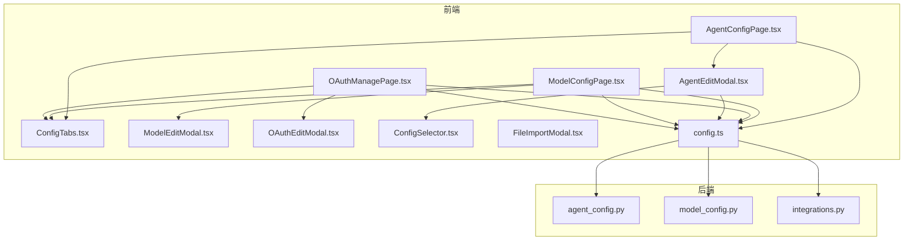
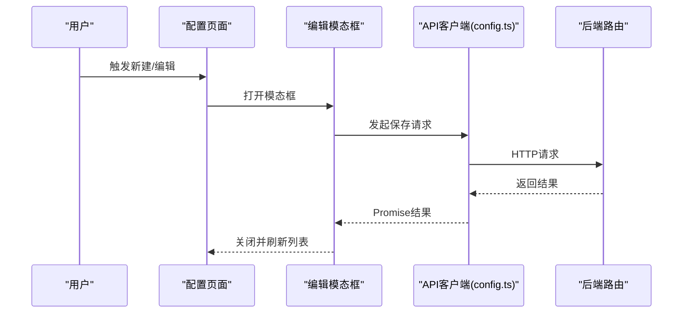
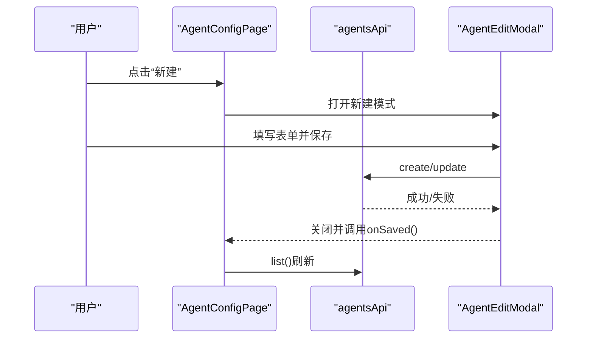
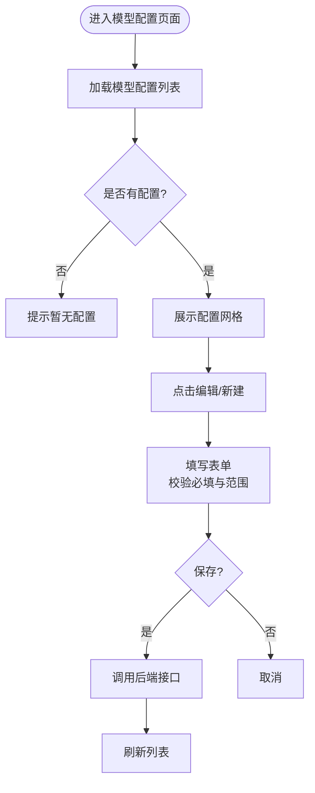
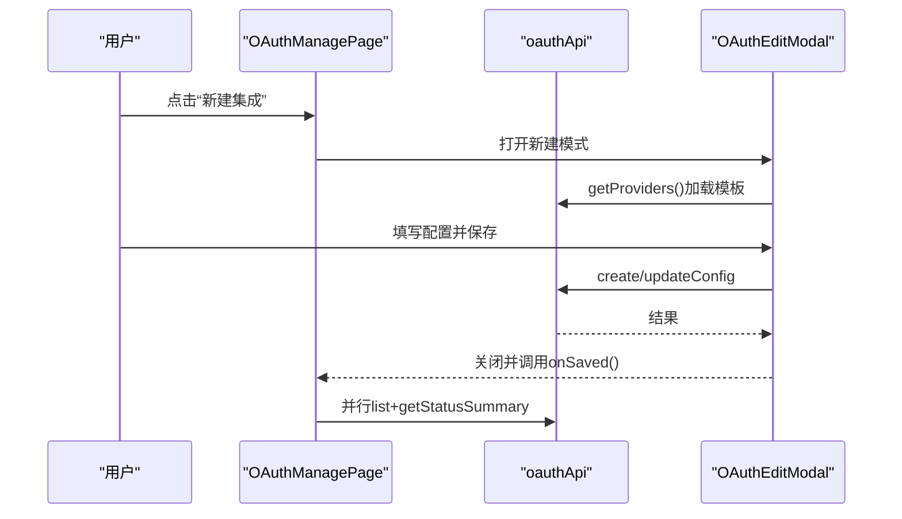
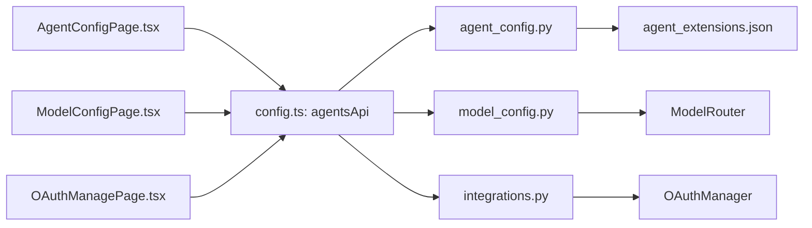

# 配置管理组件

<cite>
**本文引用的文件**
- [AgentConfigPage.tsx](file://frontend/src/pages/config/AgentConfigPage.tsx)
- [ModelConfigPage.tsx](file://frontend/src/pages/config/ModelConfigPage.tsx)
- [OAuthManagePage.tsx](file://frontend/src/pages/config/OAuthManagePage.tsx)
- [ConfigTabs.tsx](file://frontend/src/components/config/ConfigTabs.tsx)
- [AgentEditModal.tsx](file://frontend/src/components/config/AgentEditModal.tsx)
- [ModelEditModal.tsx](file://frontend/src/components/config/ModelEditModal.tsx)
- [OAuthEditModal.tsx](file://frontend/src/components/config/OAuthEditModal.tsx)
- [ConfigSelector.tsx](file://frontend/src/components/config/ConfigSelector.tsx)
- [FileImportModal.tsx](file://frontend/src/components/config/FileImportModal.tsx)
- [config.ts](file://frontend/src/api/config.ts)
- [agent_config.py](file://backend/app/api/agent_config.py)
- [model_config.py](file://backend/app/api/model_config.py)
- [integrations.py](file://backend/app/api/integrations.py)
</cite>

## 目录
1. [简介](#简介)
2. [项目结构](#项目结构)
3. [核心组件](#核心组件)
4. [架构总览](#架构总览)
5. [详细组件分析](#详细组件分析)
6. [依赖关系分析](#依赖关系分析)
7. [性能考量](#性能考量)
8. [故障排查指南](#故障排查指南)
9. [结论](#结论)
10. [附录](#附录)

## 简介
本文件面向避风港平台的配置管理组件，聚焦于前端配置页面与后端API的协同实现，覆盖以下主题：
- 代理配置页面（AgentConfigPage）、模型配置页面（ModelConfigPage）、OAuth/集成管理页面（OAuthManagePage）的实现与交互流程
- 配置项编辑、参数校验、导入导出与版本管理
- 配置标签页切换（ConfigTabs）、配置模板管理与批量配置应用
- 配置预览、变更历史与回滚机制
- 冲突处理与权限控制
- 配置数据的持久化与同步策略

## 项目结构
配置管理由“前端页面 + 组件 + API客户端 + 后端路由”四层构成：
- 前端页面：负责用户交互与状态管理
- 组件：封装卡片、模态框、选择器等复用UI
- API客户端：统一封装HTTP请求与错误处理
- 后端路由：提供REST接口，实现权限控制与业务逻辑

**图表来源**
- [AgentConfigPage.tsx:1-105](file://frontend/src/pages/config/AgentConfigPage.tsx#L1-L105)
- [ModelConfigPage.tsx:1-86](file://frontend/src/pages/config/ModelConfigPage.tsx#L1-L86)
- [OAuthManagePage.tsx:1-146](file://frontend/src/pages/config/OAuthManagePage.tsx#L1-L146)
- [ConfigTabs.tsx:1-33](file://frontend/src/components/config/ConfigTabs.tsx#L1-L33)
- [AgentEditModal.tsx:1-191](file://frontend/src/components/config/AgentEditModal.tsx#L1-L191)
- [ModelEditModal.tsx:1-201](file://frontend/src/components/config/ModelEditModal.tsx#L1-L201)
- [OAuthEditModal.tsx:1-307](file://frontend/src/components/config/OAuthEditModal.tsx#L1-L307)
- [ConfigSelector.tsx:1-113](file://frontend/src/components/config/ConfigSelector.tsx#L1-L113)
- [FileImportModal.tsx:1-127](file://frontend/src/components/config/FileImportModal.tsx#L1-L127)
- [config.ts:1-635](file://frontend/src/api/config.ts#L1-L635)
- [agent_config.py:1-423](file://backend/app/api/agent_config.py#L1-L423)
- [model_config.py:1-125](file://backend/app/api/model_config.py#L1-L125)
- [integrations.py:1-264](file://backend/app/api/integrations.py#L1-L264)

**章节来源**
- [AgentConfigPage.tsx:1-105](file://frontend/src/pages/config/AgentConfigPage.tsx#L1-L105)
- [ModelConfigPage.tsx:1-86](file://frontend/src/pages/config/ModelConfigPage.tsx#L1-L86)
- [OAuthManagePage.tsx:1-146](file://frontend/src/pages/config/OAuthManagePage.tsx#L1-L146)
- [ConfigTabs.tsx:1-33](file://frontend/src/components/config/ConfigTabs.tsx#L1-L33)
- [config.ts:1-635](file://frontend/src/api/config.ts#L1-L635)

## 核心组件
- 页面组件：负责加载数据、处理用户操作（新建、编辑、删除、启用/禁用），并驱动模态框展示
- 编辑模态框：封装具体配置项的表单与校验，支持新建与编辑两种模式
- 选择器组件：统一管理技能、工具、OAuth连接的批量勾选与提交
- 标签页组件：提供配置导航，基于路由高亮当前页
- 导入模态框：支持从GitHub、ZIP、手动三种方式导入配置

**章节来源**
- [AgentConfigPage.tsx:8-104](file://frontend/src/pages/config/AgentConfigPage.tsx#L8-L104)
- [ModelConfigPage.tsx:8-85](file://frontend/src/pages/config/ModelConfigPage.tsx#L8-L85)
- [OAuthManagePage.tsx:22-145](file://frontend/src/pages/config/OAuthManagePage.tsx#L22-L145)
- [AgentEditModal.tsx:12-190](file://frontend/src/components/config/AgentEditModal.tsx#L12-L190)
- [ModelEditModal.tsx:14-200](file://frontend/src/components/config/ModelEditModal.tsx#L14-L200)
- [OAuthEditModal.tsx:20-306](file://frontend/src/components/config/OAuthEditModal.tsx#L20-L306)
- [ConfigSelector.tsx:14-112](file://frontend/src/components/config/ConfigSelector.tsx#L14-L112)
- [ConfigTabs.tsx:12-32](file://frontend/src/components/config/ConfigTabs.tsx#L12-L32)
- [FileImportModal.tsx:9-126](file://frontend/src/components/config/FileImportModal.tsx#L9-L126)

## 架构总览
前端通过API客户端封装HTTP请求，后端路由提供REST接口，并在必要处引入权限控制（管理员/只读）。Agent关联配置采用独立扩展文件存储，模型配置通过模型路由器集中管理，OAuth集成通过统一的OAuth管理器协调。

**图表来源**
- [AgentEditModal.tsx:49-75](file://frontend/src/components/config/AgentEditModal.tsx#L49-L75)
- [ModelEditModal.tsx:41-67](file://frontend/src/components/config/ModelEditModal.tsx#L41-L67)
- [OAuthEditModal.tsx:98-128](file://frontend/src/components/config/OAuthEditModal.tsx#L98-L128)
- [config.ts:20-30](file://frontend/src/api/config.ts#L20-L30)
- [agent_config.py:155-208](file://backend/app/api/agent_config.py#L155-L208)
- [model_config.py:70-103](file://backend/app/api/model_config.py#L70-L103)
- [integrations.py:36-134](file://backend/app/api/integrations.py#L36-L134)

## 详细组件分析

### AgentConfigPage 代理配置页面
- 数据加载：通过agentsApi.list()获取代理列表；支持加载失败降级为空列表
- 操作入口：新建、编辑、删除、启用/禁用
- 编辑流程：agentsApi.get()获取详情，打开AgentEditModal；保存后刷新列表
- 权限控制：编辑/删除/启用/禁用均受后端require_admin保护

**图表来源**
- [AgentConfigPage.tsx:14-55](file://frontend/src/pages/config/AgentConfigPage.tsx#L14-L55)
- [AgentEditModal.tsx:49-75](file://frontend/src/components/config/AgentEditModal.tsx#L49-L75)
- [config.ts:73-136](file://frontend/src/api/config.ts#L73-L136)
- [agent_config.py:155-208](file://backend/app/api/agent_config.py#L155-L208)

**章节来源**
- [AgentConfigPage.tsx:8-104](file://frontend/src/pages/config/AgentConfigPage.tsx#L8-L104)
- [config.ts:73-136](file://frontend/src/api/config.ts#L73-L136)
- [agent_config.py:72-208](file://backend/app/api/agent_config.py#L72-L208)

### ModelConfigPage 模型配置页面
- 数据加载：modelConfigsApi.list()获取模型路由配置
- 操作入口：新建、编辑、删除
- 编辑流程：ModelEditModal收集表单，调用modelConfigsApi.create/update
- 参数校验：模型名称必填；数值字段有上下限约束

**图表来源**
- [ModelConfigPage.tsx:14-40](file://frontend/src/pages/config/ModelConfigPage.tsx#L14-L40)
- [ModelEditModal.tsx:41-67](file://frontend/src/components/config/ModelEditModal.tsx#L41-L67)
- [config.ts:293-333](file://frontend/src/api/config.ts#L293-L333)
- [model_config.py:48-103](file://backend/app/api/model_config.py#L48-L103)

**章节来源**
- [ModelConfigPage.tsx:8-85](file://frontend/src/pages/config/ModelConfigPage.tsx#L8-L85)
- [ModelEditModal.tsx:14-200](file://frontend/src/components/config/ModelEditModal.tsx#L14-L200)
- [config.ts:293-333](file://frontend/src/api/config.ts#L293-L333)
- [model_config.py:48-103](file://backend/app/api/model_config.py#L48-L103)

### OAuthManagePage OAuth/集成管理页面
- 数据加载：并行获取连接列表与状态汇总
- 操作入口：新建、编辑、断开、测试连接
- 状态概览：按Provider聚合连接数量与状态
- Provider模板：动态加载并渲染配置字段，区分敏感字段

**图表来源**
- [OAuthManagePage.tsx:31-47](file://frontend/src/pages/config/OAuthManagePage.tsx#L31-L47)
- [OAuthEditModal.tsx:35-70](file://frontend/src/components/config/OAuthEditModal.tsx#L35-L70)
- [config.ts:241-278](file://frontend/src/api/config.ts#L241-L278)
- [integrations.py:29-57](file://backend/app/api/integrations.py#L29-L57)

**章节来源**
- [OAuthManagePage.tsx:22-145](file://frontend/src/pages/config/OAuthManagePage.tsx#L22-L145)
- [OAuthEditModal.tsx:20-306](file://frontend/src/components/config/OAuthEditModal.tsx#L20-L306)
- [config.ts:241-278](file://frontend/src/api/config.ts#L241-L278)
- [integrations.py:29-134](file://backend/app/api/integrations.py#L29-L134)

### ConfigTabs 配置标签页
- 提供导航至Agent、Skills、Tools、OAuth、集成、模型六个配置域
- 使用NavLink实现激活态样式与路由跳转

**章节来源**
- [ConfigTabs.tsx:12-32](file://frontend/src/components/config/ConfigTabs.tsx#L12-L32)

### AgentEditModal 代理配置编辑
- 表单字段：名称、类型、描述、System Prompt、启用、排序
- 关联配置：通过ConfigSelector选择技能、工具、OAuth连接
- 保存流程：新建时先创建再设置关联；编辑时更新主配置并同步关联

**章节来源**
- [AgentEditModal.tsx:12-190](file://frontend/src/components/config/AgentEditModal.tsx#L12-L190)
- [ConfigSelector.tsx:14-112](file://frontend/src/components/config/ConfigSelector.tsx#L14-L112)

### ModelEditModal 模型配置编辑
- 表单字段：Role、Provider、模型、API Key环境变量、Base URL、Max Tokens、Temperature、Top P
- 校验规则：模型名称必填；数值字段限制范围
- 保存流程：调用create或update接口

**章节来源**
- [ModelEditModal.tsx:14-200](file://frontend/src/components/config/ModelEditModal.tsx#L14-L200)

### OAuthEditModal OAuth/集成编辑
- Provider模板：动态加载并渲染配置字段
- 敏感字段识别：根据字段名判断是否加锁显示
- 保存流程：新建时create，编辑时updateConfig
- 测试连接：调用test接口并展示结果

**章节来源**
- [OAuthEditModal.tsx:20-306](file://frontend/src/components/config/OAuthEditModal.tsx#L20-L306)

### ConfigSelector 批量配置选择器
- 技能、工具、OAuth三类配置的勾选面板
- 异步加载全部可选项，支持实时勾选与反勾选

**章节来源**
- [ConfigSelector.tsx:14-112](file://frontend/src/components/config/ConfigSelector.tsx#L14-L112)

### FileImportModal 配置导入
- 支持三种导入方式：GitHub链接、ZIP上传、手动撰写
- 导入后回调上层处理后续逻辑

**章节来源**
- [FileImportModal.tsx:9-126](file://frontend/src/components/config/FileImportModal.tsx#L9-L126)

## 依赖关系分析
- 前端页面依赖API客户端封装的agentsApi、modelConfigsApi、oauthApi
- 后端路由分别对应代理配置、模型配置、集成与OAuth管理
- 权限控制：代理配置的增删改启受require_admin保护；其他接口按需保护

**图表来源**
- [config.ts:73-278](file://frontend/src/api/config.ts#L73-L278)
- [agent_config.py:213-230](file://backend/app/api/agent_config.py#L213-L230)
- [model_config.py:18-21](file://backend/app/api/model_config.py#L18-L21)
- [integrations.py:14-16](file://backend/app/api/integrations.py#L14-L16)

**章节来源**
- [config.ts:1-635](file://frontend/src/api/config.ts#L1-L635)
- [agent_config.py:1-423](file://backend/app/api/agent_config.py#L1-L423)
- [model_config.py:1-125](file://backend/app/api/model_config.py#L1-L125)
- [integrations.py:1-264](file://backend/app/api/integrations.py#L1-L264)

## 性能考量
- 列表加载：页面组件使用useCallback缓存加载函数，避免重复请求
- 并行请求：OAuth页面并行获取连接列表与状态汇总，减少等待时间
- 滚动优化：编辑模态框内容区域设置最大高度并开启滚动，避免页面抖动
- 校验前置：表单在保存前进行必填与范围校验，降低无效网络请求

[本节为通用指导，无需特定文件引用]

## 故障排查指南
- HTTP错误：API客户端统一抛出HTTP异常，包含状态码与响应体摘要
- 删除确认：删除操作前弹窗确认，避免误操作
- 测试连接：OAuth页面提供测试连接能力，便于快速定位配置问题
- 后端权限：非管理员用户无法执行编辑/删除/启用/禁用等操作

**章节来源**
- [config.ts:20-30](file://frontend/src/api/config.ts#L20-L30)
- [AgentConfigPage.tsx:38-55](file://frontend/src/pages/config/AgentConfigPage.tsx#L38-L55)
- [OAuthManagePage.tsx:51-73](file://frontend/src/pages/config/OAuthManagePage.tsx#L51-L73)
- [agent_config.py:155-208](file://backend/app/api/agent_config.py#L155-L208)

## 结论
配置管理组件通过清晰的页面-组件-API-后端分层设计，实现了代理、模型与OAuth集成的可视化配置与管理。前端提供完善的表单校验与批量选择能力，后端通过权限控制与扩展文件/模型路由器保障配置一致性与安全性。建议后续增强：
- 配置模板与批量应用的标准化流程
- 配置变更历史与回滚机制
- 冲突检测与合并策略
- 配置导入导出的版本化与审计

[本节为总结性内容，无需特定文件引用]

## 附录

### API定义与权限对照
- 代理配置
  - 列表/详情/创建/更新/删除/启用/关联查询与设置
  - 权限：管理员
- 模型配置
  - 列表/创建/更新/删除/使用统计
  - 权限：公开（受业务逻辑约束）
- OAuth/集成
  - 列表/创建/Provider模板/状态汇总/测试/断开/同步
  - 权限：公开（部分操作受OAuth流程约束）

**章节来源**
- [config.ts:73-278](file://frontend/src/api/config.ts#L73-L278)
- [agent_config.py:72-316](file://backend/app/api/agent_config.py#L72-L316)
- [model_config.py:48-124](file://backend/app/api/model_config.py#L48-L124)
- [integrations.py:29-134](file://backend/app/api/integrations.py#L29-L134)