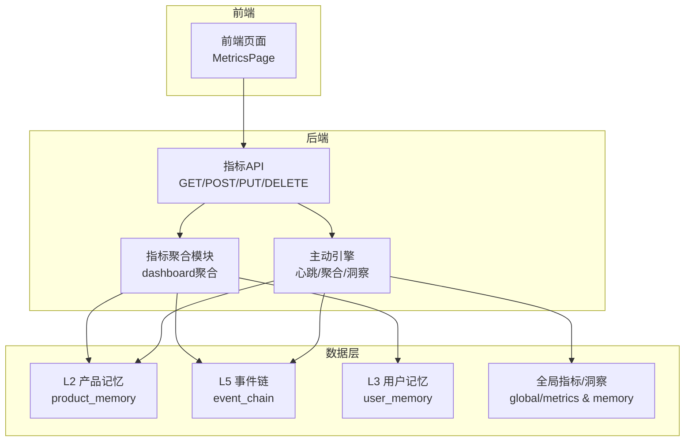
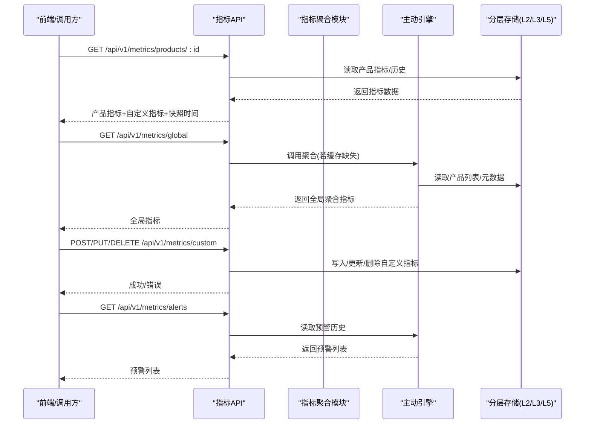
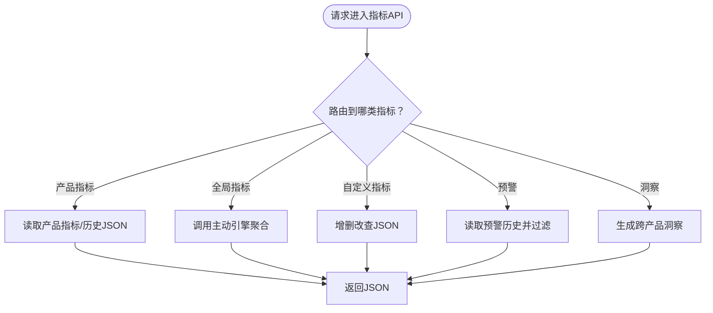
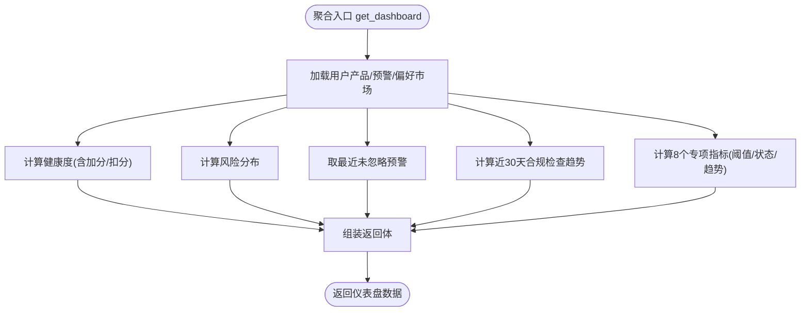
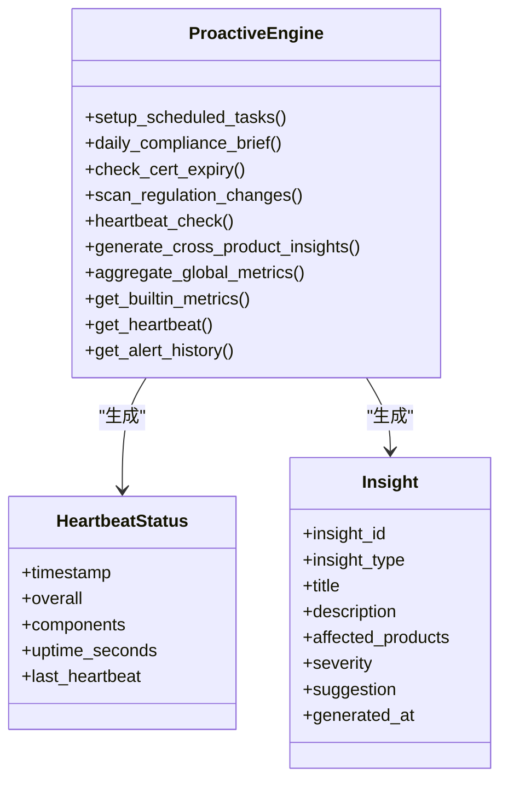
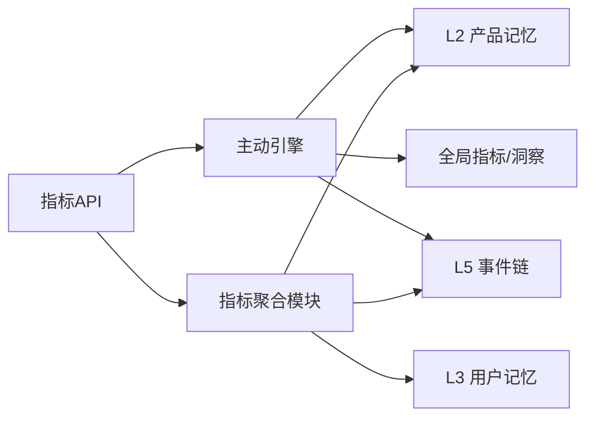

# 性能监控

<cite>
**本文引用的文件**
- [后端指标API metrics.py](file://backend/app/api/metrics.py)
- [指标聚合模块 metrics.py](file://backend/app/core/metrics.py)
- [主动引擎 proactive_engine.py](file://backend/app/core/proactive_engine.py)
- [指标API测试 test_comprehensive_flow.py](file://backend/tests/test_comprehensive_flow.py)
- [测试规范 测试规范.md](file://backend/tests/测试规范.md)
- [后端变更路线图.md](file://后端变更路线图.md)
</cite>

## 目录
1. [简介](#简介)
2. [项目结构](#项目结构)
3. [核心组件](#核心组件)
4. [架构总览](#架构总览)
5. [详细组件分析](#详细组件分析)
6. [依赖分析](#依赖分析)
7. [性能考虑](#性能考虑)
8. [故障排除指南](#故障排除指南)
9. [结论](#结论)
10. [附录](#附录)

## 简介
本文件面向避风港平台的性能监控体系，围绕“响应时间、吞吐量、资源利用率、并发处理能力”四大维度，系统梳理指标定义、采集与展示方式，并给出基准测试（负载/压力/稳定性）、瓶颈识别（慢查询/内存/CPU）、优化策略（缓存/数据库/代码重构）与仪表板设计建议。文档同时结合现有代码实现，提供可落地的调优案例与排障方法。

## 项目结构
避风港平台采用“事件驱动 + 多Agent + 分层存储”的架构，性能监控贯穿产品级与全局级两个层面：
- 产品级：指标池（通用+自定义）+ 历史趋势
- 全局级：系统健康度、风险分布、预警统计、跨产品洞察
- 数据来源：L2产品记忆、L5事件存储、L3用户记忆、L1/L0知识与规则

图表来源
- [后端指标API metrics.py:1-260](file://backend/app/api/metrics.py#L1-L260)
- [指标聚合模块 metrics.py:1-276](file://backend/app/core/metrics.py#L1-L276)
- [主动引擎 proactive_engine.py:1-978](file://backend/app/core/proactive_engine.py#L1-L978)

章节来源
- [后端指标API metrics.py:1-260](file://backend/app/api/metrics.py#L1-L260)
- [指标聚合模块 metrics.py:1-276](file://backend/app/core/metrics.py#L1-L276)
- [主动引擎 proactive_engine.py:1-978](file://backend/app/core/proactive_engine.py#L1-L978)

## 核心组件
- 指标API：提供产品级指标、全局指标、自定义指标、预警、跨产品洞察等REST接口，支持历史趋势查询与模板管理。
- 指标聚合模块：从产品记忆、事件链、用户记忆等数据源聚合用户级仪表盘数据，计算健康度、风险分布、趋势等。
- 主动引擎：定时任务（每日简报、认证到期预警、法规扫描、心跳自检）、跨产品洞察、全局指标聚合，输出系统健康状态与预警历史。

章节来源
- [后端指标API metrics.py:1-260](file://backend/app/api/metrics.py#L1-L260)
- [指标聚合模块 metrics.py:1-276](file://backend/app/core/metrics.py#L1-L276)
- [主动引擎 proactive_engine.py:1-978](file://backend/app/core/proactive_engine.py#L1-L978)

## 架构总览
性能监控的端到端流程如下：

图表来源
- [后端指标API metrics.py:47-260](file://backend/app/api/metrics.py#L47-L260)
- [指标聚合模块 metrics.py:20-276](file://backend/app/core/metrics.py#L20-L276)
- [主动引擎 proactive_engine.py:719-796](file://backend/app/core/proactive_engine.py#L719-L796)

## 详细组件分析

### 指标API组件
- 产品指标：读取产品目录下的指标与历史，支持历史天数裁剪。
- 全局指标：首次访问触发主动引擎聚合，随后从缓存返回。
- 自定义指标：增删改查，校验key唯一性，支持阈值与通知通道配置。
- 预警：按严重级别过滤，限制返回条数。
- 跨产品洞察：按市场/品类/风险等维度聚合洞察。

图表来源
- [后端指标API metrics.py:47-260](file://backend/app/api/metrics.py#L47-L260)

章节来源
- [后端指标API metrics.py:1-260](file://backend/app/api/metrics.py#L1-L260)

### 指标聚合模块
- 用户级仪表盘聚合：汇总产品数、风险分布、最近预警、活跃市场、健康度、趋势、专项指标。
- 健康度计算：基础100分，扣分项包括高风险产品、无HS编码、待处理高危预警；加分项为近7天合规检查次数。
- 专项指标：健康分、风险产品比率、证书到期密度、订单一致性率、平均检查响应时间、拒付率、退货率、DSAR响应时效，含阈值与趋势。

图表来源
- [指标聚合模块 metrics.py:20-276](file://backend/app/core/metrics.py#L20-L276)

章节来源
- [指标聚合模块 metrics.py:1-276](file://backend/app/core/metrics.py#L1-L276)

### 主动引擎组件
- 定时任务：每日合规简报、认证到期预警、法规变更扫描、心跳自检、跨产品洞察、全局指标聚合。
- 心跳自检：检查事件总线、产品存储、Worker注册表、通知引擎、调度器等组件健康，异常时发送告警。
- 全局指标聚合：计算总产品数、系统健康度、高风险产品占比、待处理预警、认证到期分布、平均退货/拒付率、市场覆盖率。
- 内置指标模板：健康度、认证到期密度、风险产品占比、订单一致性率、平均检查响应时间、拒付率、退货率、DSAR响应时效，含阈值与时效刷新策略。

图表来源
- [主动引擎 proactive_engine.py:84-978](file://backend/app/core/proactive_engine.py#L84-L978)

章节来源
- [主动引擎 proactive_engine.py:1-978](file://backend/app/core/proactive_engine.py#L1-L978)

### 指标定义与阈值
- 健康度：通过产品数/总产品数×100%，阈值预警/严重分别设定。
- 风险产品占比：高风险产品/总在售产品，阈值预警/严重。
- 证书到期密度：30天内到期的认证数，阈值预警/严重。
- 订单一致性率：三单匹配订单/总订单，阈值预警/严重。
- 平均检查响应时间：合规检查平均耗时(ms)，阈值预警/严重。
- 拒付率：拒付订单/总订单，阈值预警/严重。
- 退货率：退货订单/总订单，阈值预警/严重。
- DSAR响应时效：DSAR请求平均响应时间(小时)，阈值预警/严重。

章节来源
- [主动引擎 proactive_engine.py:800-857](file://backend/app/core/proactive_engine.py#L800-L857)

## 依赖分析
- 指标API依赖主动引擎进行全局指标聚合与预警历史查询。
- 指标聚合模块依赖分层存储（L2/L3/L5）读取产品、事件与用户偏好。
- 主动引擎依赖调度器、事件总线、通知引擎、市场监控等组件。

图表来源
- [后端指标API metrics.py:92-133](file://backend/app/api/metrics.py#L92-L133)
- [指标聚合模块 metrics.py:53-96](file://backend/app/core/metrics.py#L53-L96)
- [主动引擎 proactive_engine.py:127-192](file://backend/app/core/proactive_engine.py#L127-L192)

章节来源
- [后端指标API metrics.py:1-260](file://backend/app/api/metrics.py#L1-L260)
- [指标聚合模块 metrics.py:1-276](file://backend/app/core/metrics.py#L1-L276)
- [主动引擎 proactive_engine.py:1-978](file://backend/app/core/proactive_engine.py#L1-L978)

## 性能考虑
- 响应时间
  - 指标API：产品指标与历史读取为本地文件系统I/O，建议开启HTTP缓存头与ETag；全局指标聚合涉及多次读取与计算，建议在高频访问场景下增加缓存层与预聚合。
  - 主动引擎：心跳自检每5分钟一次，聚合每12小时一次，扫描每小时一次，建议在低峰时段执行重计算任务。
- 吞吐量
  - 指标API为读多写少，建议使用反向代理缓存与CDN加速静态指标数据；写入自定义指标为小对象JSON写入，注意磁盘I/O与锁竞争。
  - 指标聚合模块：健康度与专项指标计算复杂度较低，主要瓶颈在文件系统读取；可通过批量读取与内存缓存优化。
- 资源利用率
  - 心跳自检检查多个组件状态，建议避免重复初始化与阻塞调用；聚合与洞察生成可异步化，减少主线程阻塞。
  - 数据路由：根据事件类型自动选择存储层，有助于降低热点写入与查询路径长度。
- 并发处理能力
  - 指标API使用FastAPI异步路由，建议配合限流与熔断策略；对主动引擎的定时任务，确保幂等与去重。
  - 测试框架支持异步客户端与标记化测试，便于压测与稳定性验证。

章节来源
- [后端指标API metrics.py:1-260](file://backend/app/api/metrics.py#L1-L260)
- [指标聚合模块 metrics.py:1-276](file://backend/app/core/metrics.py#L1-L276)
- [主动引擎 proactive_engine.py:127-192](file://backend/app/core/proactive_engine.py#L127-L192)
- [后端变更路线图.md:1820-1841](file://后端变更路线图.md#L1820-L1841)

## 故障排除指南
- 指标为空或缺失
  - 产品指标：检查产品目录下metrics.json与history.json是否存在；若不存在，API会返回空数据与历史可用标识。
  - 全局指标：首次访问会触发聚合，若聚合失败，API返回空；检查主动引擎日志与存储权限。
- 自定义指标冲突
  - key唯一性校验失败会返回409；修改key或删除旧指标后再创建。
- 预警过滤无效
  - 严重级别过滤仅对警告与过期两类集合生效；确认输入参数与数据结构。
- 心跳异常
  - 心跳自检会根据组件状态发送健康告警；逐项排查事件总线、产品存储、通知引擎、调度器状态。
- 跨产品洞察为空
  - 产品数量不足或认证元数据缺失会导致洞察为空；检查产品元数据与认证信息。

章节来源
- [后端指标API metrics.py:47-260](file://backend/app/api/metrics.py#L47-L260)
- [主动引擎 proactive_engine.py:526-621](file://backend/app/core/proactive_engine.py#L526-L621)

## 结论
避风港平台的性能监控体系以“产品+全局”双维度为核心，结合事件驱动与分层存储，实现了从指标采集、聚合、预警到洞察的闭环。通过明确的指标阈值与时效策略、合理的缓存与异步化设计，可在保证实时性的前提下提升系统吞吐与资源利用率。建议在生产环境中引入更细粒度的埋点与APM工具，持续迭代优化。

## 附录

### 性能基准测试实施方法
- 负载测试
  - 使用测试框架提供的异步客户端与标记化测试，构造不同规模的产品与事件数据集，逐步提升并发与请求速率，观察指标API与聚合模块的响应时间与错误率。
  - 关键步骤：准备Mock数据工厂、构造大量产品与事件、并发调用指标端点、记录延迟与吞吐。
- 压力测试
  - 在稳定负载基础上逐步放大并发，直至系统出现明显延迟或错误；记录拐点与错误类型，定位瓶颈。
- 稳定性测试
  - 长时间运行（如24小时），监控心跳状态、全局指标聚合与预警历史增长情况，确保无内存泄漏与资源泄露。

章节来源
- [指标API测试 test_comprehensive_flow.py:1-800](file://backend/tests/test_comprehensive_flow.py#L1-L800)
- [测试规范 测试规范.md:108-161](file://backend/tests/测试规范.md#L108-L161)

### 指标仪表板设计与关键指标含义
- 仪表板布局建议
  - 顶部：系统健康度、待处理预警数、认证到期密度
  - 中部：产品健康度趋势、风险分布、专项指标（退货率/拒付率/平均检查响应时间）
  - 底部：跨产品洞察摘要、最近预警列表
- 关键指标含义
  - 健康度：合规健康度，反映产品整体合规水平
  - 风险产品占比：高风险产品比例，预警阈值提醒
  - 证书到期密度：短期内到期认证数量，提示续期风险
  - 订单一致性率：三单匹配程度，反映运营质量
  - 平均检查响应时间：合规检查耗时，影响用户体验
  - 拒付率/退货率：售后风险指标
  - DSAR响应时效：隐私合规响应效率

章节来源
- [指标聚合模块 metrics.py:116-276](file://backend/app/core/metrics.py#L116-L276)
- [主动引擎 proactive_engine.py:800-857](file://backend/app/core/proactive_engine.py#L800-L857)

### 性能优化策略与最佳实践
- 缓存策略
  - 指标API：对产品指标与历史数据设置短期缓存与ETag；全局指标聚合结果缓存至TTL。
  - 主动引擎：心跳与聚合结果写入全局记忆，供其他模块复用。
- 数据库/存储优化
  - 分层存储路由：根据事件类型选择最优写入层，降低热点写入。
  - 文件系统：合并小文件写入、批量读取、索引优化（如按日期切分历史）。
- 代码重构建议
  - 将热点计算逻辑异步化与去重化；对JSON读写进行异常捕获与回退。
  - 指标模板与阈值集中管理，便于统一调整与审计。
- 监控与告警
  - 心跳自检异常自动告警；对关键端点增加熔断与限流保护。

章节来源
- [后端变更路线图.md:1820-1841](file://后端变更路线图.md#L1820-L1841)
- [主动引擎 proactive_engine.py:127-192](file://backend/app/core/proactive_engine.py#L127-L192)

### 实际调优案例与故障排除
- 案例1：产品健康度波动大
  - 排查：检查合规检查频率与评分规则；确认高风险产品与预警状态变化。
  - 优化：提高合规检查频率，完善评分规则权重。
- 案例2：全局指标聚合耗时上升
  - 排查：检查产品数量增长与元数据读取路径；确认磁盘I/O与网络延迟。
  - 优化：引入增量聚合与缓存，错峰执行重计算任务。
- 案例3：认证到期预警误报
  - 排查：核对产品元数据中的认证有效期；检查解析时区与格式。
  - 优化：标准化元数据格式与解析逻辑，增加边界条件校验。

章节来源
- [指标API测试 test_comprehensive_flow.py:889-918](file://backend/tests/test_comprehensive_flow.py#L889-L918)
- [主动引擎 proactive_engine.py:313-449](file://backend/app/core/proactive_engine.py#L313-L449)