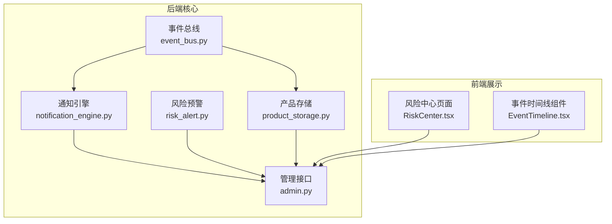
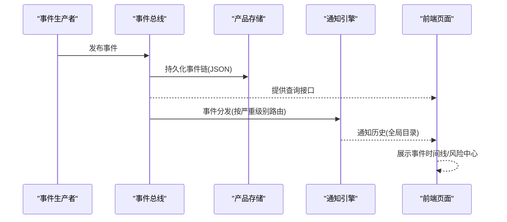
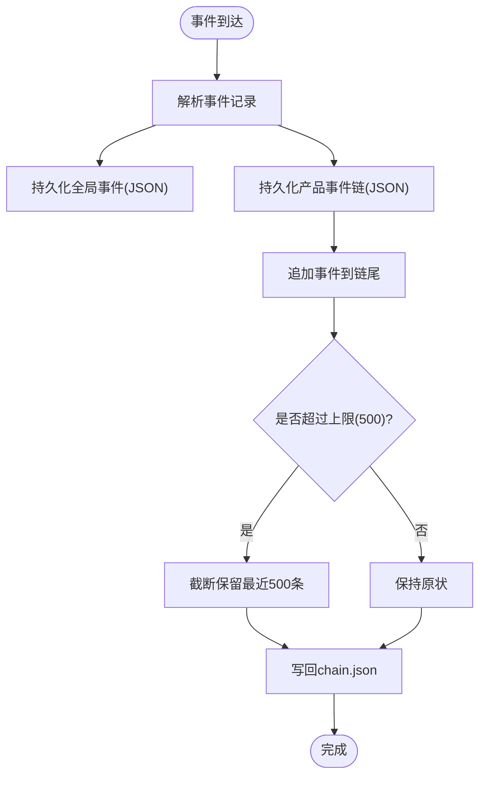
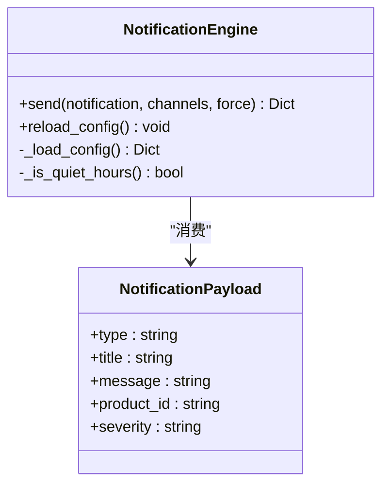
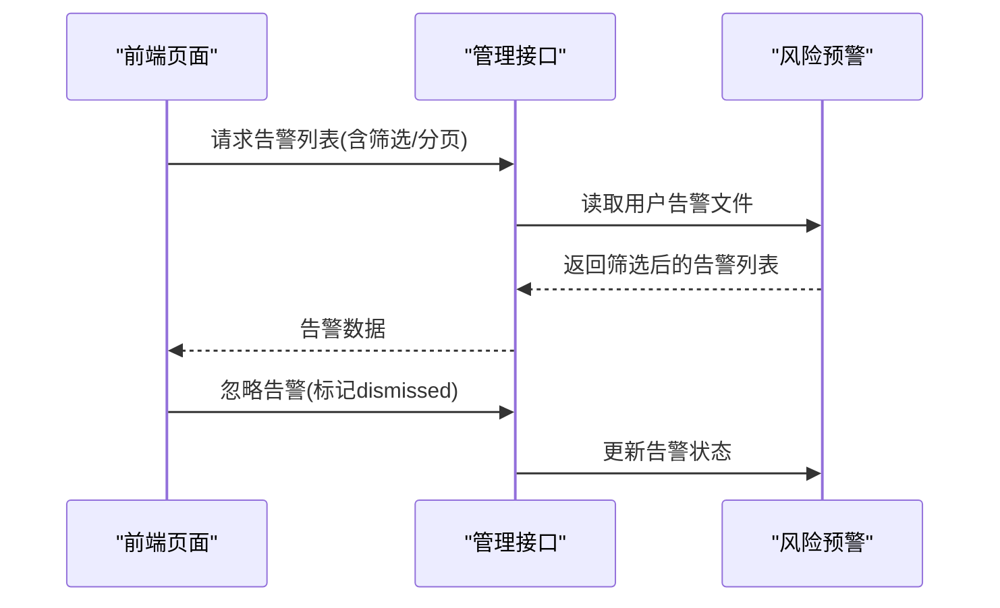
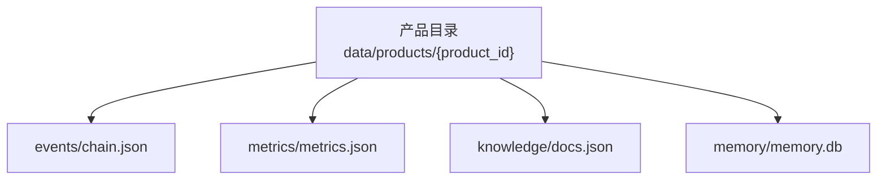
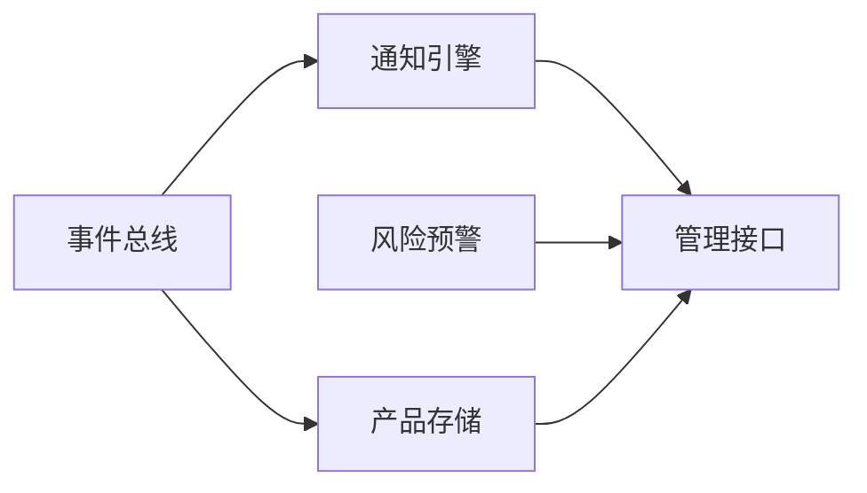

# 日志管理

<cite>
**本文引用的文件**
- [backend/app/core/event_bus.py](file://backend/app/core/event_bus.py)
- [backend/app/core/notification_engine.py](file://backend/app/core/notification_engine.py)
- [backend/app/core/risk_alert.py](file://backend/app/core/risk_alert.py)
- [backend/app/core/product_storage.py](file://backend/app/core/product_storage.py)
- [backend/app/api/admin.py](file://backend/app/api/admin.py)
- [backend/后端变更路线图.md](file://backend/后端变更路线图.md)
- [frontend/src/pages/RiskCenter.tsx](file://frontend/src/pages/RiskCenter.tsx)
- [frontend/src/components/EventTimeline.tsx](file://frontend/src/components/EventTimeline.tsx)
</cite>

## 目录
1. [简介](#简介)
2. [项目结构](#项目结构)
3. [核心组件](#核心组件)
4. [架构总览](#架构总览)
5. [组件详解](#组件详解)
6. [依赖关系分析](#依赖关系分析)
7. [性能考量](#性能考量)
8. [故障排查指南](#故障排查指南)
9. [结论](#结论)
10. [附录](#附录)

## 简介
本文件面向避风港平台的日志管理，聚焦于日志配置、输出格式、存储策略与分析工具的使用指南，并结合代码库中的事件总线、通知引擎、风险预警与产品存储等模块，给出可落地的日志规范与运维最佳实践。文档同时覆盖日志文件的组织结构与命名规则（按日期、用户ID、组件分类），以及日志轮转与归档策略建议，帮助在生产环境中高效管理日志。

## 项目结构
围绕日志管理的关键代码分布在后端核心模块与前端展示组件中：
- 事件总线：负责事件的发布、持久化与查询，是日志数据的主要来源之一。
- 通知引擎：负责多渠道通知的路由与持久化，可作为日志事件的下游消费与归档。
- 风险预警：对告警进行持久化与查询，支持按严重级别筛选，便于日志分析。
- 产品存储：提供产品级隔离存储，事件链与指标等以JSON形式落盘，便于按产品维度检索。
- 管理接口：提供健康检查与功能开关等能力，有助于定位系统状态与问题根因。
- 前端页面：风险中心与事件时间线组件，用于可视化展示与辅助排查。

**图表来源**
- [backend/app/core/event_bus.py:115-290](file://backend/app/core/event_bus.py#L115-L290)
- [backend/app/core/notification_engine.py:33-118](file://backend/app/core/notification_engine.py#L33-L118)
- [backend/app/core/risk_alert.py:84-129](file://backend/app/core/risk_alert.py#L84-L129)
- [backend/app/core/product_storage.py:45-82](file://backend/app/core/product_storage.py#L45-L82)
- [backend/app/api/admin.py:175-240](file://backend/app/api/admin.py#L175-L240)
- [frontend/src/pages/RiskCenter.tsx:221-250](file://frontend/src/pages/RiskCenter.tsx#L221-L250)
- [frontend/src/components/EventTimeline.tsx:51-76](file://frontend/src/components/EventTimeline.tsx#L51-L76)

**章节来源**
- [backend/app/core/event_bus.py:115-290](file://backend/app/core/event_bus.py#L115-L290)
- [backend/app/core/notification_engine.py:33-118](file://backend/app/core/notification_engine.py#L33-L118)
- [backend/app/core/risk_alert.py:84-129](file://backend/app/core/risk_alert.py#L84-L129)
- [backend/app/core/product_storage.py:45-82](file://backend/app/core/product_storage.py#L45-L82)
- [backend/app/api/admin.py:175-240](file://backend/app/api/admin.py#L175-L240)
- [frontend/src/pages/RiskCenter.tsx:221-250](file://frontend/src/pages/RiskCenter.tsx#L221-L250)
- [frontend/src/components/EventTimeline.tsx:51-76](file://frontend/src/components/EventTimeline.tsx#L51-L76)

## 核心组件
- 事件总线：提供事件发布、持久化与查询能力；事件链以JSON形式存储，支持按严重级别、类别与产品ID过滤。
- 通知引擎：基于严重级别进行渠道路由，支持静默时段与延迟发送；通知历史持久化至全局目录。
- 风险预警：告警列表按用户维度持久化，支持按类型与严重级别筛选。
- 产品存储：产品级隔离存储，事件链与指标等以JSON文件落盘，便于按产品维度检索。
- 管理接口：提供健康检查与功能开关查询，辅助定位系统状态与问题根因。

**章节来源**
- [backend/app/core/event_bus.py:115-290](file://backend/app/core/event_bus.py#L115-L290)
- [backend/app/core/notification_engine.py:33-118](file://backend/app/core/notification_engine.py#L33-L118)
- [backend/app/core/risk_alert.py:84-129](file://backend/app/core/risk_alert.py#L84-L129)
- [backend/app/core/product_storage.py:45-82](file://backend/app/core/product_storage.py#L45-L82)
- [backend/app/api/admin.py:175-240](file://backend/app/api/admin.py#L175-L240)

## 架构总览
事件从总线产生，经由持久化与查询接口，最终在前端页面呈现。通知引擎与风险预警作为下游消费者参与事件处理与告警归档。

**图表来源**
- [backend/app/core/event_bus.py:294-373](file://backend/app/core/event_bus.py#L294-L373)
- [backend/app/core/notification_engine.py:91-118](file://backend/app/core/notification_engine.py#L91-L118)
- [frontend/src/pages/RiskCenter.tsx:221-250](file://frontend/src/pages/RiskCenter.tsx#L221-L250)
- [frontend/src/components/EventTimeline.tsx:51-76](file://frontend/src/components/EventTimeline.tsx#L51-L76)

## 组件详解

### 事件总线与事件链持久化
- 事件记录包含类型、严重级别、产品ID、时间戳等字段，支持按严重级别与类别过滤。
- 事件链以JSON文件形式持久化，包含事件数组与时间线，限制最近500条以控制体积。
- 支持全局事件与产品级事件的持久化，便于跨产品与按产品维度检索。

**图表来源**
- [backend/app/core/event_bus.py:322-373](file://backend/app/core/event_bus.py#L322-L373)

**章节来源**
- [backend/app/core/event_bus.py:247-290](file://backend/app/core/event_bus.py#L247-L290)
- [backend/app/core/event_bus.py:322-373](file://backend/app/core/event_bus.py#L322-L373)

### 通知引擎与通知历史
- 通知按严重级别路由至不同渠道（仪表盘、WebSocket、邮件、Webhook），支持静默时段延迟发送。
- 通知历史持久化至全局目录，便于审计与回溯。

**图表来源**
- [backend/app/core/notification_engine.py:33-118](file://backend/app/core/notification_engine.py#L33-L118)

**章节来源**
- [backend/app/core/notification_engine.py:33-118](file://backend/app/core/notification_engine.py#L33-L118)

### 风险预警与告警查询
- 告警按用户维度持久化，支持按类型与严重级别筛选，并按时间倒序分页。
- 提供忽略告警操作，便于在界面中进行处置与归档。

**图表来源**
- [backend/app/core/risk_alert.py:84-129](file://backend/app/core/risk_alert.py#L84-L129)
- [backend/app/api/admin.py:175-240](file://backend/app/api/admin.py#L175-L240)
- [frontend/src/pages/RiskCenter.tsx:221-250](file://frontend/src/pages/RiskCenter.tsx#L221-L250)

**章节来源**
- [backend/app/core/risk_alert.py:84-129](file://backend/app/core/risk_alert.py#L84-L129)
- [backend/app/api/admin.py:175-240](file://backend/app/api/admin.py#L175-L240)
- [frontend/src/pages/RiskCenter.tsx:221-250](file://frontend/src/pages/RiskCenter.tsx#L221-L250)

### 产品存储与事件链组织
- 产品级隔离存储，事件链与指标等以JSON文件落盘，便于按产品维度检索。
- 事件链文件包含事件数组与时间线，支持查询与统计。

**图表来源**
- [backend/app/core/product_storage.py:10-24](file://backend/app/core/product_storage.py#L10-L24)

**章节来源**
- [backend/app/core/product_storage.py:45-82](file://backend/app/core/product_storage.py#L45-L82)

### 日志配置与输出规范
- 日志级别：事件总线与通知引擎均使用结构化日志输出，便于后续检索与统计。
- 输出格式：事件记录包含类型、严重级别、产品ID、时间戳、来源等字段；通知历史与告警列表采用JSON格式。
- 存储策略：事件链与通知历史分别落盘至全局与用户维度目录，便于按严重级别、类别与产品ID进行过滤与查询。

**章节来源**
- [backend/app/core/event_bus.py:247-290](file://backend/app/core/event_bus.py#L247-L290)
- [backend/app/core/notification_engine.py:91-118](file://backend/app/core/notification_engine.py#L91-L118)
- [backend/app/core/risk_alert.py:104-129](file://backend/app/core/risk_alert.py#L104-L129)

### 日志文件组织与命名规则
- 按产品维度：事件链文件位于产品目录下，文件名为chain.json，便于按产品ID检索。
- 按严重级别与类别：事件总线提供按严重级别与类别的过滤接口，便于在查询时进行筛选。
- 按时间维度：事件记录包含时间戳字段，可在查询时按时间范围过滤。
- 按用户维度：风险预警按用户维度存储，便于按用户ID检索与归档。

**章节来源**
- [backend/app/core/event_bus.py:247-290](file://backend/app/core/event_bus.py#L247-L290)
- [backend/app/core/product_storage.py:10-24](file://backend/app/core/product_storage.py#L10-L24)
- [backend/app/core/risk_alert.py:104-129](file://backend/app/core/risk_alert.py#L104-L129)

### 日志分析工具使用指南
- 查询语法与过滤条件：事件总线提供按严重级别、类别与产品ID的过滤接口；风险预警支持按类型与严重级别筛选。
- 统计分析：事件总线提供事件统计接口，可用于生成各类别与严重级别的统计报表。
- 可视化展示：前端风险中心与事件时间线组件提供告警与事件的可视化展示，辅助快速定位问题。

**章节来源**
- [backend/app/core/event_bus.py:247-290](file://backend/app/core/event_bus.py#L247-L290)
- [frontend/src/pages/RiskCenter.tsx:221-250](file://frontend/src/pages/RiskCenter.tsx#L221-L250)
- [frontend/src/components/EventTimeline.tsx:51-76](file://frontend/src/components/EventTimeline.tsx#L51-L76)

### 日志轮转与归档策略
- 事件链限制：事件总线对事件链长度进行限制，避免无限增长导致磁盘占用过大。
- 归档机制：事件注册表支持将事件定义归档至专用目录，便于版本演进与审计。
- 建议策略：结合业务量与存储成本，定期清理过期事件链与通知历史；对高严重级别事件单独备份或保留更长时间。

**章节来源**
- [backend/app/core/event_bus.py:365-373](file://backend/app/core/event_bus.py#L365-L373)
- [backend/后端变更路线图.md:657-678](file://backend/后端变更路线图.md#L657-L678)

## 依赖关系分析
- 事件总线依赖产品存储进行事件链持久化，同时向通知引擎分发事件。
- 通知引擎依赖全局配置进行渠道路由与静默时段判断。
- 风险预警依赖用户维度的告警文件进行查询与更新。
- 管理接口提供健康检查与功能开关查询，辅助定位系统状态。

**图表来源**
- [backend/app/core/event_bus.py:115-290](file://backend/app/core/event_bus.py#L115-L290)
- [backend/app/core/notification_engine.py:33-118](file://backend/app/core/notification_engine.py#L33-L118)
- [backend/app/core/risk_alert.py:84-129](file://backend/app/core/risk_alert.py#L84-L129)
- [backend/app/core/product_storage.py:45-82](file://backend/app/core/product_storage.py#L45-L82)
- [backend/app/api/admin.py:175-240](file://backend/app/api/admin.py#L175-L240)

**章节来源**
- [backend/app/core/event_bus.py:115-290](file://backend/app/core/event_bus.py#L115-L290)
- [backend/app/core/notification_engine.py:33-118](file://backend/app/core/notification_engine.py#L33-L118)
- [backend/app/core/risk_alert.py:84-129](file://backend/app/core/risk_alert.py#L84-L129)
- [backend/app/core/product_storage.py:45-82](file://backend/app/core/product_storage.py#L45-L82)
- [backend/app/api/admin.py:175-240](file://backend/app/api/admin.py#L175-L240)

## 性能考量
- 事件链长度限制：事件总线对事件链进行截断，避免无限增长影响IO性能。
- JSON序列化与写入：事件与通知历史采用JSON格式写入，注意批量写入与编码一致性。
- 查询优化：前端与后端均提供过滤与分页能力，建议在高频查询场景下增加索引或缓存。

## 故障排查指南
- 健康检查：通过管理接口的健康检查端点，快速评估核心组件运行状态。
- 事件查询：利用事件总线的查询接口，按严重级别、类别与产品ID进行过滤，缩小问题范围。
- 告警处理：在风险中心页面查看告警列表，按严重级别与类型筛选，必要时忽略告警并记录处置结果。
- 日志定位：结合事件链与通知历史，定位问题发生的时间点与涉及的产品ID，辅助进一步排查。

**章节来源**
- [backend/app/api/admin.py:225-240](file://backend/app/api/admin.py#L225-L240)
- [backend/app/core/event_bus.py:247-290](file://backend/app/core/event_bus.py#L247-L290)
- [frontend/src/pages/RiskCenter.tsx:221-250](file://frontend/src/pages/RiskCenter.tsx#L221-L250)

## 结论
避风港平台的日志管理以事件总线为核心，结合通知引擎与风险预警，形成“事件产生—持久化—路由—可视化”的完整闭环。通过严格的存储结构与查询接口，能够实现按严重级别、类别、产品ID与用户维度的高效检索与分析。建议在生产环境中配合日志轮转与归档策略，确保长期稳定运行。

## 附录
- 事件注册表：支持事件定义的增删改查与归档，便于版本演进与审计。
- 前端组件：风险中心与事件时间线组件提供直观的可视化展示，辅助快速定位问题。

**章节来源**
- [backend/后端变更路线图.md:551-691](file://backend/后端变更路线图.md#L551-L691)
- [frontend/src/pages/RiskCenter.tsx:221-250](file://frontend/src/pages/RiskCenter.tsx#L221-L250)
- [frontend/src/components/EventTimeline.tsx:51-76](file://frontend/src/components/EventTimeline.tsx#L51-L76)