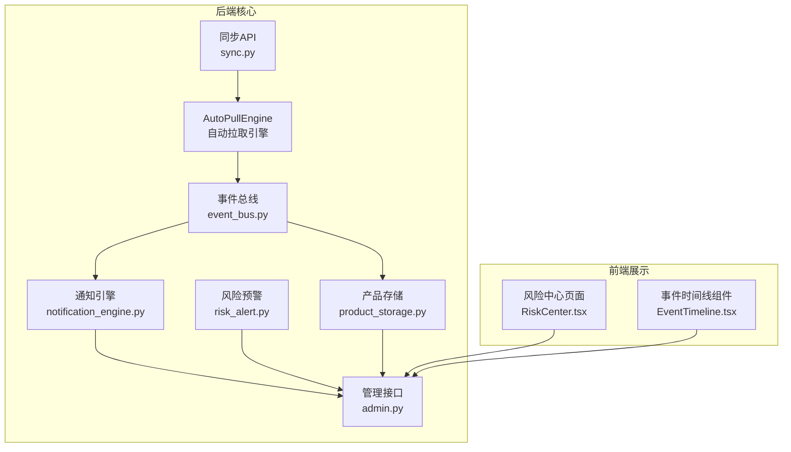
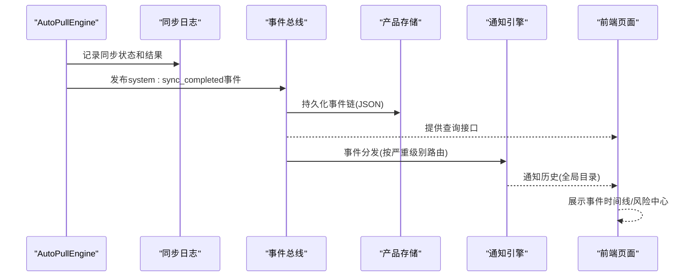
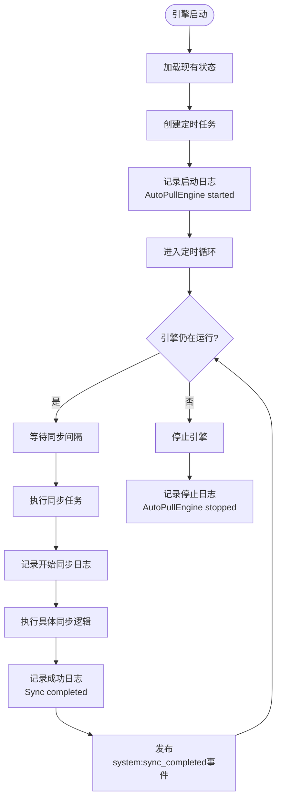
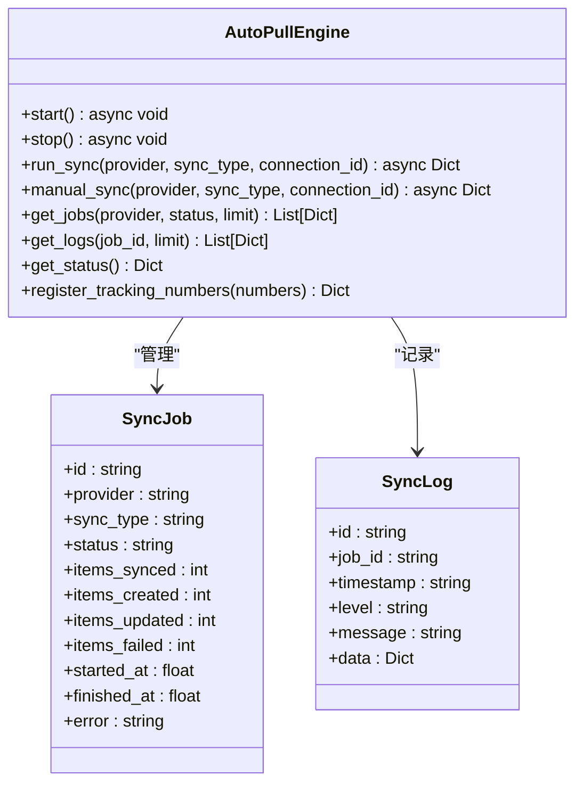
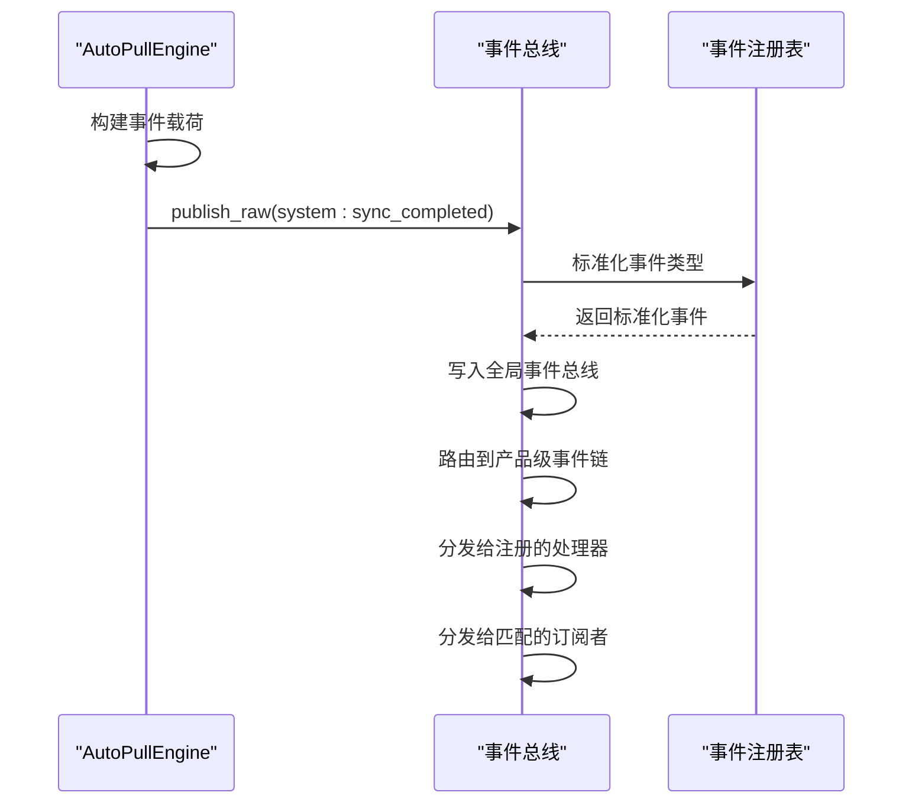
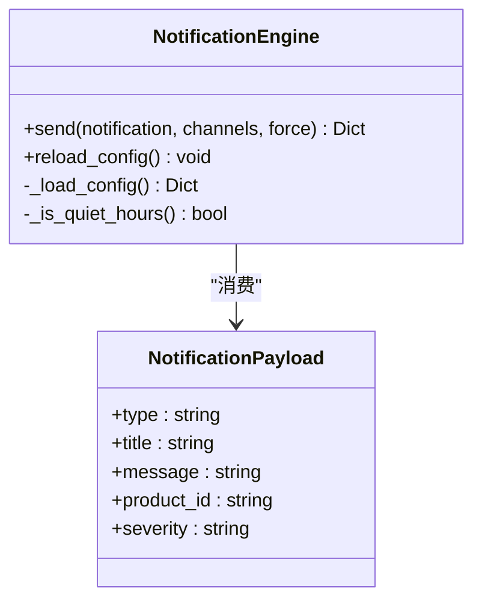
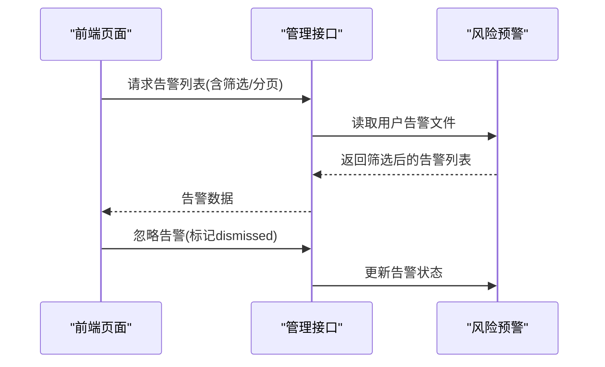
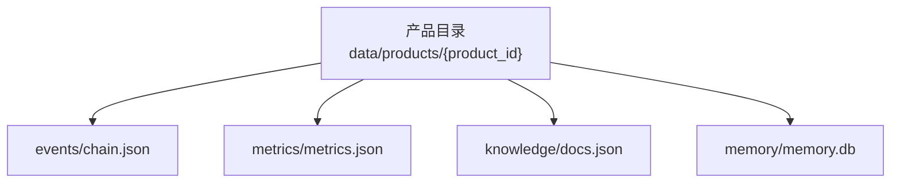
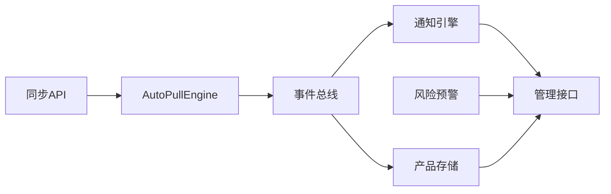

# 日志管理

<cite>
**本文引用的文件**
- [backend/app/core/auto_pull_engine.py](file://backend/app/core/auto_pull_engine.py)
- [backend/app/api/sync.py](file://backend/app/api/sync.py)
- [backend/data/sync/jobs.json](file://backend/data/sync/jobs.json)
- [backend/data/sync/logs.json](file://backend/data/sync/logs.json)
- [backend/app/core/event_bus.py](file://backend/app/core/event_bus.py)
- [backend/app/api/events.py](file://backend/app/api/events.py)
- [backend/data/events/builtin/system_events.md](file://backend/data/events/builtin/system_events.md)
- [backend/app/core/notification_engine.py](file://backend/app/core/notification_engine.py)
- [backend/app/core/risk_alert.py](file://backend/app/core/risk_alert.py)
- [backend/app/core/product_storage.py](file://backend/app/core/product_storage.py)
- [backend/app/api/admin.py](file://backend/app/api/admin.py)
- [frontend/src/pages/RiskCenter.tsx](file://frontend/src/pages/RiskCenter.tsx)
- [frontend/src/components/EventTimeline.tsx](file://frontend/src/components/EventTimeline.tsx)
</cite>

## 更新摘要
**所做更改**
- 新增AutoPullEngine启动日志和同步进程日志记录机制
- 新增系统级同步完成事件记录（system:sync_completed）
- 新增同步任务状态管理和实时日志查询接口
- 新增物流追踪号注册和管理功能
- 更新日志文件组织结构和命名规则
- 增强日志轮转和归档策略

## 目录
1. [简介](#简介)
2. [项目结构](#项目结构)
3. [核心组件](#核心组件)
4. [架构总览](#架构总览)
5. [组件详解](#组件详解)
6. [依赖关系分析](#依赖关系分析)
7. [性能考量](#性能考量)
8. [故障排查指南](#故障排查指南)
9. [结论](#结论)
10. [附录](#附录)

## 简介
本文件面向避风港平台的日志管理，聚焦于日志配置、输出格式、存储策略与分析工具的使用指南，并结合代码库中的事件总线、通知引擎、风险预警、产品存储和AutoPullEngine同步引擎等模块，给出可落地的日志规范与运维最佳实践。文档同时覆盖日志文件的组织结构与命名规则（按日期、用户ID、组件分类），以及日志轮转与归档策略建议，帮助在生产环境中高效管理日志。

**更新重点**：本次更新重点关注AutoPullEngine启动日志、同步进程日志和新的系统事件记录机制，为平台的自动化数据同步提供完整的日志跟踪能力。

## 项目结构
围绕日志管理的关键代码分布在后端核心模块与前端展示组件中：
- AutoPullEngine：自动拉取引擎，负责定时同步第三方数据源，包含完整的日志记录和事件发布机制
- 事件总线：负责事件的发布、持久化与查询，是日志数据的主要来源之一
- 通知引擎：负责多渠道通知的路由与持久化，可作为日志事件的下游消费与归档
- 风险预警：对告警进行持久化与查询，支持按严重级别筛选，便于日志分析
- 产品存储：提供产品级隔离存储，事件链与指标等以JSON形式落盘，便于按产品维度检索
- 管理接口：提供健康检查与功能开关等能力，有助于定位系统状态与问题根因
- 前端页面：风险中心与事件时间线组件，用于可视化展示与辅助排查

**图表来源**
- [backend/app/core/auto_pull_engine.py:153-175](file://backend/app/core/auto_pull_engine.py#L153-L175)
- [backend/app/api/sync.py:18-50](file://backend/app/api/sync.py#L18-L50)
- [backend/app/core/event_bus.py:156-194](file://backend/app/core/event_bus.py#L156-L194)
- [backend/app/core/notification_engine.py:33-118](file://backend/app/core/notification_engine.py#L33-L118)
- [backend/app/core/risk_alert.py:84-129](file://backend/app/core/risk_alert.py#L84-L129)
- [backend/app/core/product_storage.py:45-82](file://backend/app/core/product_storage.py#L45-L82)
- [backend/app/api/admin.py:175-240](file://backend/app/api/admin.py#L175-L240)
- [frontend/src/pages/RiskCenter.tsx:221-250](file://frontend/src/pages/RiskCenter.tsx#L221-L250)
- [frontend/src/components/EventTimeline.tsx:51-76](file://frontend/src/components/EventTimeline.tsx#L51-L76)

**章节来源**
- [backend/app/core/auto_pull_engine.py:153-175](file://backend/app/core/auto_pull_engine.py#L153-L175)
- [backend/app/api/sync.py:18-50](file://backend/app/api/sync.py#L18-L50)
- [backend/app/core/event_bus.py:156-194](file://backend/app/core/event_bus.py#L156-L194)
- [backend/app/core/notification_engine.py:33-118](file://backend/app/core/notification_engine.py#L33-L118)
- [backend/app/core/risk_alert.py:84-129](file://backend/app/core/risk_alert.py#L84-L129)
- [backend/app/core/product_storage.py:45-82](file://backend/app/core/product_storage.py#L45-L82)
- [backend/app/api/admin.py:175-240](file://backend/app/api/admin.py#L175-L240)
- [frontend/src/pages/RiskCenter.tsx:221-250](file://frontend/src/pages/RiskCenter.tsx#L221-L250)
- [frontend/src/components/EventTimeline.tsx:51-76](file://frontend/src/components/EventTimeline.tsx#L51-L76)

## 核心组件
- AutoPullEngine：自动拉取引擎，提供定时同步第三方数据源的能力，包含完整的日志记录、状态管理和事件发布机制
- 事件总线：提供事件发布、持久化与查询能力；事件链以JSON形式存储，支持按严重级别、类别与产品ID过滤
- 通知引擎：基于严重级别进行渠道路由，支持静默时段与延迟发送；通知历史持久化至全局目录
- 风险预警：告警列表按用户维度持久化，支持按类型与严重级别筛选
- 产品存储：产品级隔离存储，事件链与指标等以JSON文件落盘，便于按产品维度检索
- 管理接口：提供健康检查与功能开关查询，辅助定位系统状态与问题根因

**章节来源**
- [backend/app/core/auto_pull_engine.py:101-128](file://backend/app/core/auto_pull_engine.py#L101-L128)
- [backend/app/core/event_bus.py:156-194](file://backend/app/core/event_bus.py#L156-L194)
- [backend/app/core/notification_engine.py:33-118](file://backend/app/core/notification_engine.py#L33-L118)
- [backend/app/core/risk_alert.py:84-129](file://backend/app/core/risk_alert.py#L84-L129)
- [backend/app/core/product_storage.py:45-82](file://backend/app/core/product_storage.py#L45-L82)
- [backend/app/api/admin.py:175-240](file://backend/app/api/admin.py#L175-L240)

## 架构总览
事件从AutoPullEngine产生，经过日志记录、事件发布和持久化，最终在前端页面呈现。通知引擎与风险预警作为下游消费者参与事件处理与告警归档。

**图表来源**
- [backend/app/core/auto_pull_engine.py:218-246](file://backend/app/core/auto_pull_engine.py#L218-L246)
- [backend/app/core/event_bus.py:156-194](file://backend/app/core/event_bus.py#L156-L194)
- [backend/app/core/notification_engine.py:91-118](file://backend/app/core/notification_engine.py#L91-L118)
- [frontend/src/pages/RiskCenter.tsx:221-250](file://frontend/src/pages/RiskCenter.tsx#L221-L250)
- [frontend/src/components/EventTimeline.tsx:51-76](file://frontend/src/components/EventTimeline.tsx#L51-L76)

## 组件详解

### AutoPullEngine启动日志和同步进程日志
- AutoPullEngine启动时记录"AutoPullEngine started"日志，包含任务数量信息
- 同步任务执行过程中记录详细的进度信息，包括开始同步、完成同步和错误信息
- 支持按任务ID过滤日志，便于定位具体同步任务的问题

**图表来源**
- [backend/app/core/auto_pull_engine.py:153-175](file://backend/app/core/auto_pull_engine.py#L153-L175)
- [backend/app/core/auto_pull_engine.py:192-248](file://backend/app/core/auto_pull_engine.py#L192-L248)

**章节来源**
- [backend/app/core/auto_pull_engine.py:153-175](file://backend/app/core/auto_pull_engine.py#L153-L175)
- [backend/app/core/auto_pull_engine.py:192-248](file://backend/app/core/auto_pull_engine.py#L192-L248)

### 同步任务状态管理和日志查询
- 提供完整的同步任务生命周期管理，包括任务创建、执行、完成和失败状态
- 支持按提供商、状态和限制条件查询同步任务
- 实时日志查询接口，支持按任务ID过滤和限制返回数量

**图表来源**
- [backend/app/core/auto_pull_engine.py:33-73](file://backend/app/core/auto_pull_engine.py#L33-L73)
- [backend/app/core/auto_pull_engine.py:479-517](file://backend/app/core/auto_pull_engine.py#L479-L517)

**章节来源**
- [backend/app/core/auto_pull_engine.py:479-517](file://backend/app/core/auto_pull_engine.py#L479-L517)
- [backend/app/api/sync.py:32-43](file://backend/app/api/sync.py#L32-L43)

### 系统事件记录和发布
- AutoPullEngine在同步完成后发布"system:sync_completed"事件
- 事件包含提供商、同步类型、同步数量和执行时长等关键信息
- 事件通过事件总线持久化到全局事件存储和产品事件链

**图表来源**
- [backend/app/core/auto_pull_engine.py:222-239](file://backend/app/core/auto_pull_engine.py#L222-L239)
- [backend/app/core/event_bus.py:190-194](file://backend/app/core/event_bus.py#L190-L194)

**章节来源**
- [backend/app/core/auto_pull_engine.py:222-239](file://backend/app/core/auto_pull_engine.py#L222-L239)
- [backend/app/core/event_bus.py:156-194](file://backend/app/core/event_bus.py#L156-L194)
- [backend/data/events/builtin/system_events.md:4-13](file://backend/data/events/builtin/system_events.md#L4-L13)

### 通知引擎与通知历史
- 通知按严重级别路由至不同渠道（仪表盘、WebSocket、邮件、Webhook），支持静默时段延迟发送
- 通知历史持久化至全局目录，便于审计与回溯

**图表来源**
- [backend/app/core/notification_engine.py:33-118](file://backend/app/core/notification_engine.py#L33-L118)

**章节来源**
- [backend/app/core/notification_engine.py:33-118](file://backend/app/core/notification_engine.py#L33-L118)

### 风险预警与告警查询
- 告警按用户维度持久化，支持按类型与严重级别筛选，并按时间倒序分页
- 提供忽略告警操作，便于在界面中进行处置与归档

**图表来源**
- [backend/app/core/risk_alert.py:84-129](file://backend/app/core/risk_alert.py#L84-L129)
- [backend/app/api/admin.py:175-240](file://backend/app/api/admin.py#L175-L240)
- [frontend/src/pages/RiskCenter.tsx:221-250](file://frontend/src/pages/RiskCenter.tsx#L221-L250)

**章节来源**
- [backend/app/core/risk_alert.py:84-129](file://backend/app/core/risk_alert.py#L84-L129)
- [backend/app/api/admin.py:175-240](file://backend/app/api/admin.py#L175-L240)
- [frontend/src/pages/RiskCenter.tsx:221-250](file://frontend/src/pages/RiskCenter.tsx#L221-L250)

### 产品存储与事件链组织
- 产品级隔离存储，事件链与指标等以JSON文件落盘，便于按产品维度检索
- 事件链文件包含事件数组与时间线，支持查询与统计

**图表来源**
- [backend/app/core/product_storage.py:10-24](file://backend/app/core/product_storage.py#L10-L24)

**章节来源**
- [backend/app/core/product_storage.py:45-82](file://backend/app/core/product_storage.py#L45-L82)

### 日志配置与输出规范
- AutoPullEngine日志级别：使用info、warning、error三个级别，分别对应正常状态、警告和错误
- 日志格式：包含时间戳、级别、消息和附加数据，支持JSON序列化
- 事件记录：系统事件包含类型、严重级别、产品ID、时间戳、来源等字段
- 存储策略：同步日志和任务状态分别落盘至独立的JSON文件，便于查询和维护

**章节来源**
- [backend/app/core/auto_pull_engine.py:62-73](file://backend/app/core/auto_pull_engine.py#L62-L73)
- [backend/app/core/event_bus.py:106-118](file://backend/app/core/event_bus.py#L106-L118)
- [backend/app/core/notification_engine.py:91-118](file://backend/app/core/notification_engine.py#L91-L118)
- [backend/app/core/risk_alert.py:104-129](file://backend/app/core/risk_alert.py#L104-L129)

### 日志文件组织与命名规则
- AutoPullEngine专用目录：data/sync/目录下包含jobs.json和logs.json两个主要文件
- 按产品维度：事件链文件位于产品目录下，文件名为chain.json，便于按产品ID检索
- 按严重级别与类别：事件总线提供按严重级别与类别的过滤接口，便于在查询时进行筛选
- 按时间维度：事件记录包含时间戳字段，可在查询时按时间范围过滤
- 按用户维度：风险预警按用户维度存储，便于按用户ID检索与归档

**章节来源**
- [backend/app/core/auto_pull_engine.py:77-80](file://backend/app/core/auto_pull_engine.py#L77-L80)
- [backend/app/core/event_bus.py:247-290](file://backend/app/core/event_bus.py#L247-L290)
- [backend/app/core/product_storage.py:10-24](file://backend/app/core/product_storage.py#L10-L24)
- [backend/app/core/risk_alert.py:104-129](file://backend/app/core/risk_alert.py#L104-L129)

### 日志分析工具使用指南
- AutoPullEngine日志查询：通过同步API的/logs端点查询指定任务ID的日志，支持限制返回数量
- 事件总线查询：事件总线提供按严重级别、类别与产品ID的过滤接口；风险预警支持按类型与严重级别筛选
- 统计分析：事件总线提供事件统计接口，可用于生成各类别与严重级别的统计报表
- 可视化展示：前端风险中心与事件时间线组件提供告警与事件的可视化展示，辅助快速定位问题

**章节来源**
- [backend/app/api/sync.py:39-43](file://backend/app/api/sync.py#L39-L43)
- [backend/app/core/event_bus.py:247-290](file://backend/app/core/event_bus.py#L247-L290)
- [frontend/src/pages/RiskCenter.tsx:221-250](file://frontend/src/pages/RiskCenter.tsx#L221-L250)
- [frontend/src/components/EventTimeline.tsx:51-76](file://frontend/src/components/EventTimeline.tsx#L51-L76)

### 日志轮转与归档策略
- AutoPullEngine日志限制：同步日志最多保留500条，超过限制时自动截断保留最近记录
- 任务状态管理：同步任务状态最多保留1000条，超过限制时自动截断
- 事件链限制：事件总线对事件链长度进行限制，避免无限增长导致磁盘占用过大
- 归档机制：事件注册表支持将事件定义归档至专用目录，便于版本演进与审计
- 建议策略：结合业务量与存储成本，定期清理过期同步日志和任务状态；对高严重级别事件单独备份或保留更长时间

**章节来源**
- [backend/app/core/auto_pull_engine.py:143-149](file://backend/app/core/auto_pull_engine.py#L143-L149)
- [backend/app/core/event_bus.py:371-375](file://backend/app/core/event_bus.py#L371-L375)
- [backend/后端变更路线图.md:657-678](file://backend/后端变更路线图.md#L657-L678)

## 依赖关系分析
- AutoPullEngine依赖事件总线进行事件发布，同时管理本地的日志和任务状态
- 事件总线依赖产品存储进行事件链持久化，同时向通知引擎分发事件
- 通知引擎依赖全局配置进行渠道路由与静默时段判断
- 风险预警依赖用户维度的告警文件进行查询与更新
- 管理接口提供健康检查与功能开关查询，辅助定位系统状态

**图表来源**
- [backend/app/core/auto_pull_engine.py:222-239](file://backend/app/core/auto_pull_engine.py#L222-L239)
- [backend/app/core/event_bus.py:156-194](file://backend/app/core/event_bus.py#L156-L194)
- [backend/app/core/notification_engine.py:33-118](file://backend/app/core/notification_engine.py#L33-L118)
- [backend/app/core/risk_alert.py:84-129](file://backend/app/core/risk_alert.py#L84-L129)
- [backend/app/core/product_storage.py:45-82](file://backend/app/core/product_storage.py#L45-L82)
- [backend/app/api/admin.py:175-240](file://backend/app/api/admin.py#L175-L240)
- [backend/app/api/sync.py:18-50](file://backend/app/api/sync.py#L18-L50)

**章节来源**
- [backend/app/core/auto_pull_engine.py:222-239](file://backend/app/core/auto_pull_engine.py#L222-L239)
- [backend/app/core/event_bus.py:156-194](file://backend/app/core/event_bus.py#L156-L194)
- [backend/app/core/notification_engine.py:33-118](file://backend/app/core/notification_engine.py#L33-L118)
- [backend/app/core/risk_alert.py:84-129](file://backend/app/core/risk_alert.py#L84-L129)
- [backend/app/core/product_storage.py:45-82](file://backend/app/core/product_storage.py#L45-L82)
- [backend/app/api/admin.py:175-240](file://backend/app/api/admin.py#L175-L240)
- [backend/app/api/sync.py:18-50](file://backend/app/api/sync.py#L18-L50)

## 性能考量
- AutoPullEngine日志管理：同步日志和任务状态采用内存管理，超过限制时自动截断，避免无限增长影响性能
- 事件链长度限制：事件总线对事件链进行截断，避免无限增长影响IO性能
- JSON序列化与写入：事件与通知历史采用JSON格式写入，注意批量写入与编码一致性
- 查询优化：前端与后端均提供过滤与分页能力，建议在高频查询场景下增加索引或缓存

## 故障排查指南
- AutoPullEngine健康检查：通过同步API的状态端点，快速评估引擎运行状态和任务数量
- 同步日志查询：利用同步API的日志查询接口，按任务ID进行过滤，缩小问题范围
- 事件查询：利用事件总线的查询接口，按严重级别、类别与产品ID进行过滤，缩小问题范围
- 告警处理：在风险中心页面查看告警列表，按严重级别与类型筛选，必要时忽略告警并记录处置结果
- 日志定位：结合AutoPullEngine日志、事件链与通知历史，定位问题发生的时间点与涉及的产品ID，辅助进一步排查

**章节来源**
- [backend/app/api/sync.py:18-22](file://backend/app/api/sync.py#L18-L22)
- [backend/app/core/auto_pull_engine.py:494-517](file://backend/app/core/auto_pull_engine.py#L494-L517)
- [backend/app/core/event_bus.py:247-290](file://backend/app/core/event_bus.py#L247-L290)
- [frontend/src/pages/RiskCenter.tsx:221-250](file://frontend/src/pages/RiskCenter.tsx#L221-L250)

## 结论
避风港平台的日志管理以AutoPullEngine为核心，结合事件总线、通知引擎与风险预警，形成"事件产生—持久化—路由—可视化"的完整闭环。AutoPullEngine提供了完整的同步日志记录和事件发布机制，支持按任务ID精确查询和分析。通过严格的存储结构与查询接口，能够实现按严重级别、类别、产品ID与用户维度的高效检索与分析。建议在生产环境中配合日志轮转与归档策略，确保长期稳定运行。

## 附录
- AutoPullEngine事件类型：system:sync_completed和system:sync_failed两种系统事件
- 事件注册表：支持事件定义的增删改查与归档，便于版本演进与审计
- 前端组件：风险中心与事件时间线组件提供直观的可视化展示，辅助快速定位问题

**章节来源**
- [backend/data/events/builtin/system_events.md:4-23](file://backend/data/events/builtin/system_events.md#L4-L23)
- [backend/后端变更路线图.md:551-691](file://backend/后端变更路线图.md#L551-L691)
- [frontend/src/pages/RiskCenter.tsx:221-250](file://frontend/src/pages/RiskCenter.tsx#L221-L250)
- [frontend/src/components/EventTimeline.tsx:51-76](file://frontend/src/components/EventTimeline.tsx#L51-L76)