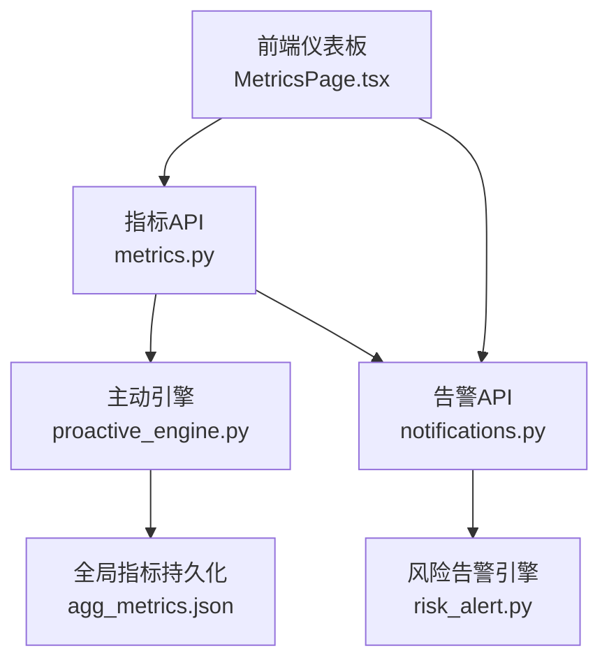
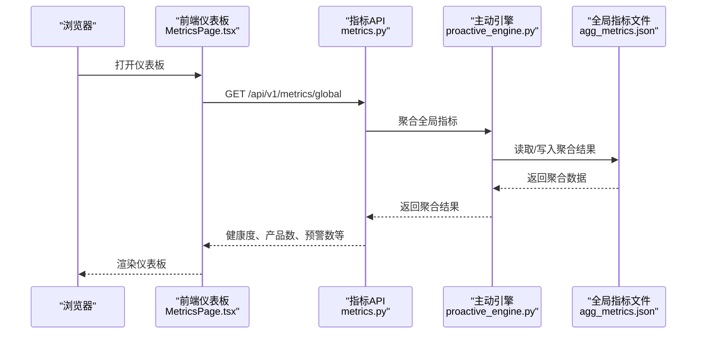
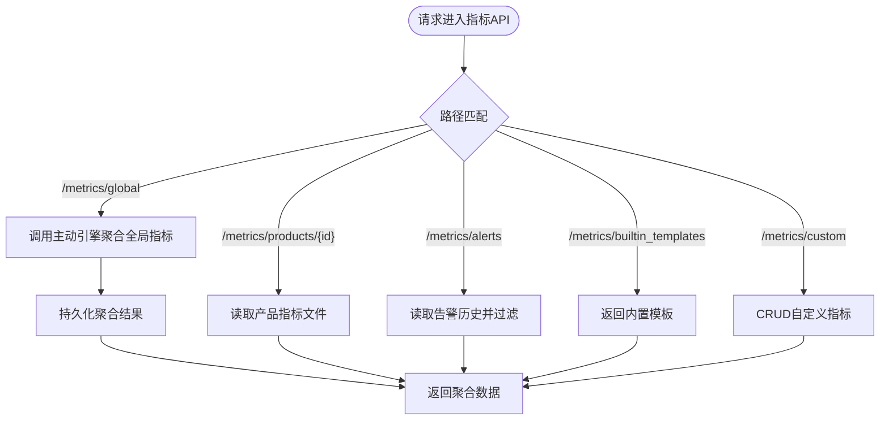
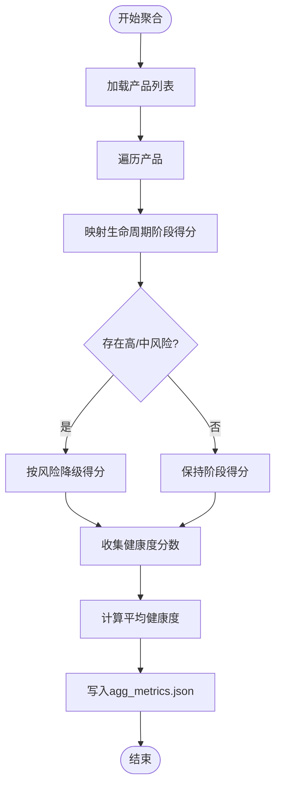
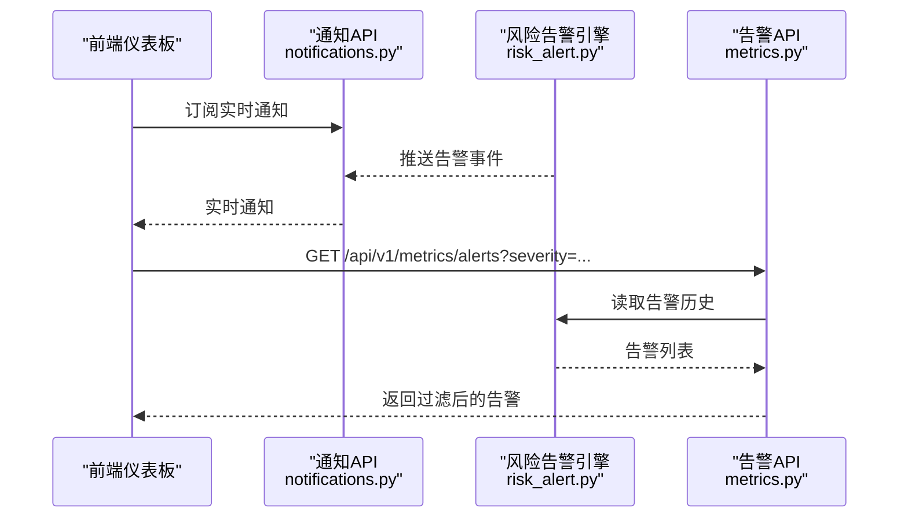
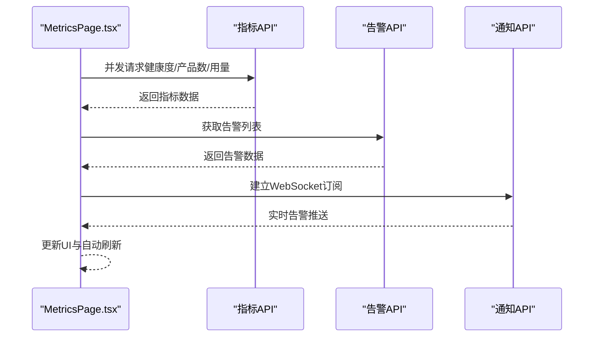
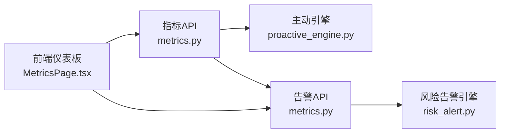

# 监控与运维

<cite>
**本文引用的文件**   
- [metrics.py](file://backend/app/api/metrics.py)
- [proactive_engine.py](file://backend/app/core/proactive_engine.py)
- [metrics.py](file://backend/app/core/metrics.py)
- [risk_alert.py](file://backend/app/core/risk_alert.py)
- [notifications.py](file://backend/app/api/notifications.py)
- [MetricsPage.tsx](file://frontend/src/pages/MetricsPage.tsx)
- [后端变更路线图.md](file://后端变更路线图.md)
- [test_comprehensive_flow.py](file://backend/tests/test_comprehensive_flow.py)
</cite>

## 目录
1. [简介](#简介)
2. [项目结构](#项目结构)
3. [核心组件](#核心组件)
4. [架构总览](#架构总览)
5. [详细组件分析](#详细组件分析)
6. [依赖分析](#依赖分析)
7. [性能考虑](#性能考虑)
8. [故障排查指南](#故障排查指南)
9. [结论](#结论)
10. [附录](#附录)

## 简介
本文件面向避风港平台的监控与运维团队，系统化梳理健康检查、指标采集、告警机制、日志管理、性能监控、错误追踪、自动化脚本与部署流程，并给出监控仪表板设计与关键指标定义。内容以代码库实际实现为依据，兼顾工程实践与可操作性，帮助读者快速建立从基础监控到高级运维的完整方案。

## 项目结构
监控与运维相关的关键位置集中在后端 API 层与核心引擎层：
- API 层提供指标查询、告警列表、内置模板、自定义指标 CRUD 等接口
- 核心引擎负责全局指标聚合、健康度评分、风险预警与持久化
- 前端页面消费指标数据，展示健康度、产品数、预警数、模型用量等
- 测试用例覆盖指标聚合、产品指标与自定义指标创建流程

图表来源
- [MetricsPage.tsx:1-33](file://frontend/src/pages/MetricsPage.tsx#L1-L33)
- [metrics.py:1-139](file://backend/app/api/metrics.py#L1-L139)
- [proactive_engine.py:730-796](file://backend/app/core/proactive_engine.py#L730-L796)
- [risk_alert.py](file://backend/app/core/risk_alert.py)
- [notifications.py](file://backend/app/api/notifications.py)

章节来源
- [metrics.py:1-139](file://backend/app/api/metrics.py#L1-L139)
- [proactive_engine.py:730-796](file://backend/app/core/proactive_engine.py#L730-L796)
- [metrics.py:1-50](file://backend/app/core/metrics.py#L1-L50)
- [risk_alert.py](file://backend/app/core/risk_alert.py)
- [notifications.py](file://backend/app/api/notifications.py)
- [MetricsPage.tsx:1-33](file://frontend/src/pages/MetricsPage.tsx#L1-L33)

## 核心组件
- 指标API：提供产品级指标、全局指标、告警列表、内置模板、自定义指标 CRUD、跨产品洞察等接口
- 主动引擎：聚合全局指标、计算系统健康度、持久化聚合结果
- 风险告警引擎：生成与管理风险预警，供前端与通知服务消费
- 通知API：提供通知列表与实时通知通道，支撑告警分发
- 前端仪表板：拉取健康度、产品数、预警数、模型用量等数据，支持自动刷新

章节来源
- [metrics.py:1-139](file://backend/app/api/metrics.py#L1-L139)
- [proactive_engine.py:730-796](file://backend/app/core/proactive_engine.py#L730-L796)
- [risk_alert.py](file://backend/app/core/risk_alert.py)
- [notifications.py](file://backend/app/api/notifications.py)
- [MetricsPage.tsx:1-33](file://frontend/src/pages/MetricsPage.tsx#L1-L33)

## 架构总览
下图展示了监控与运维系统的端到端数据流：前端请求指标与告警，API 层调用核心引擎进行聚合或查询，引擎访问持久化数据并返回结果，同时支持实时通知通道。

图表来源
- [metrics.py:90-108](file://backend/app/api/metrics.py#L90-L108)
- [proactive_engine.py:730-796](file://backend/app/core/proactive_engine.py#L730-L796)

章节来源
- [metrics.py:90-108](file://backend/app/api/metrics.py#L90-L108)
- [proactive_engine.py:730-796](file://backend/app/core/proactive_engine.py#L730-L796)

## 详细组件分析

### 指标API与数据模型
- 产品指标：支持查询指定产品的指标池与历史趋势，包含快照时间与历史可用性标记
- 全局指标：支持触发聚合或直接读取聚合结果，聚合由主动引擎完成
- 告警列表：支持按严重级别过滤与限制数量，返回历史告警集合
- 内置模板：提供内置指标模板，便于统一阈值与计算口径
- 自定义指标：支持创建、更新、删除与查询，具备阈值与通知渠道配置

图表来源
- [metrics.py:47-139](file://backend/app/api/metrics.py#L47-L139)

章节来源
- [metrics.py:1-139](file://backend/app/api/metrics.py#L1-L139)

### 主动引擎与健康度计算
- 聚合逻辑：统计总产品数、市场覆盖、按生命周期阶段与风险等级计算健康度得分，最终写入全局指标文件
- 健康度评分：基于产品生命周期阶段与风险等级进行降级调整，取平均值得到系统健康度
- 持久化：聚合结果以 JSON 文件形式保存，便于 API 直接读取

图表来源
- [proactive_engine.py:730-796](file://backend/app/core/proactive_engine.py#L730-L796)

章节来源
- [proactive_engine.py:730-796](file://backend/app/core/proactive_engine.py#L730-L796)

### 风险告警与通知
- 风险告警引擎：负责生成与维护风险预警，支持历史查询与严重级别过滤
- 通知API：提供通知列表与实时通知通道，前端可通过 WebSocket 订阅
- 告警API：支持按严重级别过滤与数量限制，返回历史告警集合

图表来源
- [notifications.py](file://backend/app/api/notifications.py)
- [risk_alert.py](file://backend/app/core/risk_alert.py)
- [metrics.py:111-134](file://backend/app/api/metrics.py#L111-L134)

章节来源
- [notifications.py](file://backend/app/api/notifications.py)
- [risk_alert.py](file://backend/app/core/risk_alert.py)
- [metrics.py:111-134](file://backend/app/api/metrics.py#L111-L134)

### 前端仪表板与数据消费
- 自动刷新：支持定时轮询，拉取健康度、产品数、预警数、模型用量等关键指标
- 并行加载：使用并发请求聚合多个数据源，提升首屏渲染效率
- 实时通知：通过 WebSocket 订阅实时告警，及时提醒

图表来源
- [MetricsPage.tsx:24-33](file://frontend/src/pages/MetricsPage.tsx#L24-L33)
- [metrics.py:111-134](file://backend/app/api/metrics.py#L111-L134)
- [notifications.py](file://backend/app/api/notifications.py)

章节来源
- [MetricsPage.tsx:1-33](file://frontend/src/pages/MetricsPage.tsx#L1-L33)
- [metrics.py:111-134](file://backend/app/api/metrics.py#L111-L134)
- [notifications.py](file://backend/app/api/notifications.py)

### 关键指标定义与阈值建议
- 系统健康度：按产品生命周期阶段与风险等级计算的平均得分，建议阈值：正常≥80，预警[60,80)，告警<60
- 高风险产品比率：建议阈值：正常<5%，预警<10%，告警≥10%
- 证书到期密度：建议阈值：正常≤2，预警≤5，告警>5
- 订单一致性率：建议阈值：正常≥95%，持续下降需关注
- 拒付率：建议阈值：正常≤1%，超过阈值触发预警
- 模型用量与令牌消耗：建议按模型维度设置配额与阈值，超阈值触发告警

章节来源
- [proactive_engine.py:798-804](file://backend/app/core/proactive_engine.py#L798-L804)
- [metrics.py:200-240](file://backend/app/core/metrics.py#L200-L240)

### 监控仪表板设计
- 仪表板布局建议：顶部健康度卡片、中间产品数与预警数双卡、下方趋势图与告警列表、右侧模型用量
- 数据刷新策略：健康度与产品数每分钟刷新，告警列表每5分钟刷新，趋势图支持手动/自动切换
- 告警联动：点击告警跳转至风险中心，显示详细上下文与处置建议

章节来源
- [MetricsPage.tsx:11-33](file://frontend/src/pages/MetricsPage.tsx#L11-L33)

### 运维自动化与部署流程
- 变更路线图明确了指标监控API、SSE流式对话、Pipeline合规流水线等模块的开发计划与接口定义，可据此制定迭代节奏与验收标准
- 建议将指标聚合与告警持久化纳入定时任务，结合容器化部署与日志采集，形成闭环运维

章节来源
- [后端变更路线图.md:2055-2074](file://后端变更路线图.md#L2055-L2074)
- [后端变更路线图.md:2088-2120](file://后端变更路线图.md#L2088-L2120)

## 依赖分析
- API 层依赖核心引擎进行全局指标聚合
- 前端依赖 API 提供的指标与通知接口
- 告警模块与通知模块相互配合，形成从生成到推送的链路

图表来源
- [metrics.py:1-139](file://backend/app/api/metrics.py#L1-L139)
- [proactive_engine.py:730-796](file://backend/app/core/proactive_engine.py#L730-L796)
- [risk_alert.py](file://backend/app/core/risk_alert.py)
- [MetricsPage.tsx:1-33](file://frontend/src/pages/MetricsPage.tsx#L1-L33)

章节来源
- [metrics.py:1-139](file://backend/app/api/metrics.py#L1-L139)
- [proactive_engine.py:730-796](file://backend/app/core/proactive_engine.py#L730-L796)
- [risk_alert.py](file://backend/app/core/risk_alert.py)
- [MetricsPage.tsx:1-33](file://frontend/src/pages/MetricsPage.tsx#L1-L33)

## 性能考虑
- 指标聚合：建议将聚合结果缓存于内存或本地文件，避免每次请求都进行复杂计算
- 前端并发：使用并发请求减少等待时间，合理设置刷新频率，避免过度刷新造成压力
- 告警过滤：在 API 层进行严重级别与数量过滤，降低前端渲染与网络传输负担
- 存储访问：聚合结果写入本地文件，读取时采用异步与流式处理，提高吞吐

## 故障排查指南
- 全局指标为空：检查主动引擎是否成功写入聚合文件，确认产品存储可用性与权限
- 告警列表异常：核对告警历史文件是否存在，确认过滤参数与严重级别配置
- 自定义指标无效：检查指标阈值与通知渠道配置，确认模板与公式正确
- 前端无数据：确认指标API与通知API可达，检查浏览器控制台与网络面板
- 测试用例验证：通过测试用例覆盖产品指标、全局指标与自定义指标创建流程，定位回归问题

章节来源
- [metrics.py:90-108](file://backend/app/api/metrics.py#L90-L108)
- [metrics.py:111-134](file://backend/app/api/metrics.py#L111-L134)
- [test_comprehensive_flow.py:889-918](file://backend/tests/test_comprehensive_flow.py#L889-L918)

## 结论
避风港平台的监控与运维体系以“指标API + 主动引擎 + 告警与通知”为核心，结合前端仪表板实现可视化与实时告警。通过明确的关键指标与阈值、合理的刷新策略与持久化设计，能够有效支撑从基础监控到高级运维的全栈需求。建议后续完善自动化脚本、部署流程与环境管理，形成可复制的运维最佳实践。

## 附录
- 指标API端点概览
  - GET /api/v1/metrics/products/{product_id}：产品指标
  - GET /api/v1/metrics/global：全局指标
  - GET /api/v1/metrics/alerts：告警列表（支持严重级别过滤与数量限制）
  - GET /api/v1/metrics/builtin_templates：内置指标模板
  - GET /api/v1/metrics/custom：自定义指标列表
  - POST /api/v1/metrics/custom：创建自定义指标
  - PUT /api/v1/metrics/custom/{metric_id}：更新自定义指标
  - DELETE /api/v1/metrics/custom/{metric_id}：删除自定义指标
  - GET /api/v1/metrics/products/{product_id}/history：产品指标历史（支持天数限制）
- 前端仪表板关键数据
  - 健康度、产品总数、预警数、模型用量与趋势图、自动刷新开关

章节来源
- [metrics.py:1-139](file://backend/app/api/metrics.py#L1-L139)
- [MetricsPage.tsx:11-33](file://frontend/src/pages/MetricsPage.tsx#L11-L33)