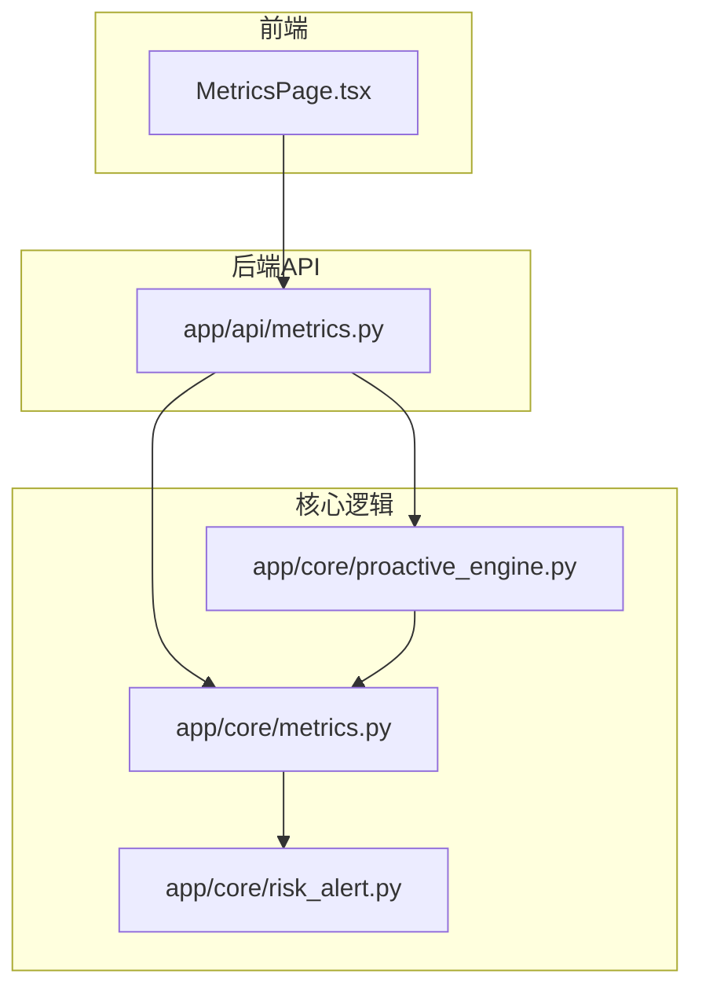
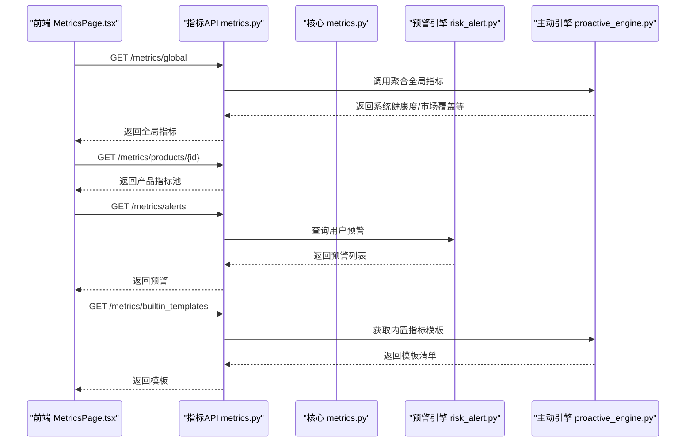
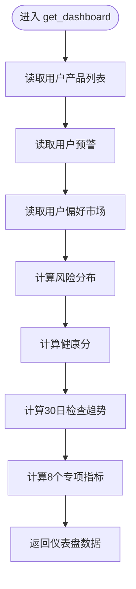
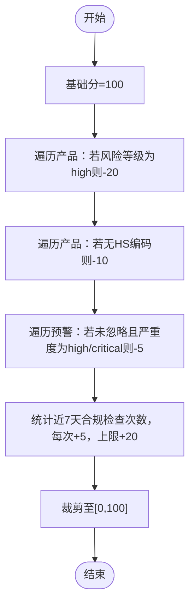
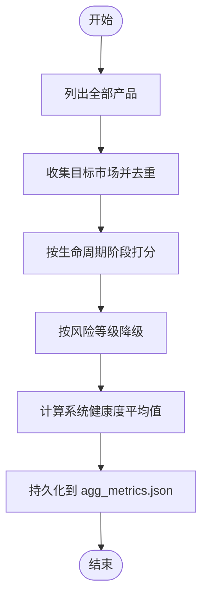
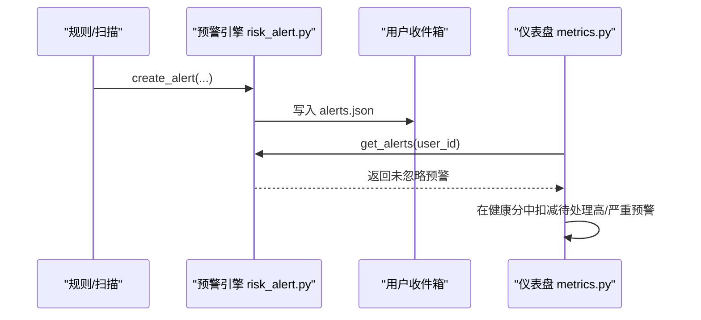
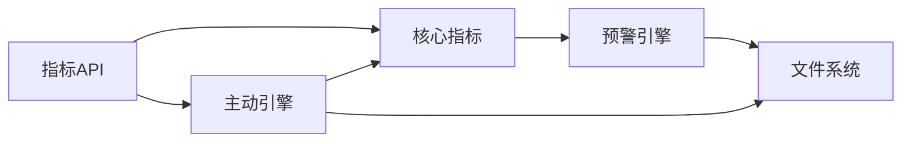

# 系统健康监控

<cite>
**本文引用的文件**
- [metrics.py](file://backend/app/core/metrics.py)
- [proactive_engine.py](file://backend/app/core/proactive_engine.py)
- [risk_alert.py](file://backend/app/core/risk_alert.py)
- [metrics.py](file://backend/app/api/metrics.py)
- [MetricsPage.tsx](file://frontend/src/pages/MetricsPage.tsx)
- [后端变更路线图.md](file://后端变更路线图.md)
</cite>

## 目录
1. [简介](#简介)
2. [项目结构](#项目结构)
3. [核心组件](#核心组件)
4. [架构总览](#架构总览)
5. [详细组件分析](#详细组件分析)
6. [依赖分析](#依赖分析)
7. [性能考虑](#性能考虑)
8. [故障排查指南](#故障排查指南)
9. [结论](#结论)
10. [附录](#附录)

## 简介
本文件面向避风港平台的系统健康监控模块，围绕健康评分算法、风险分布与合规状态分析、专项指标与趋势预测机制展开，系统性说明仪表盘数据聚合（用户级）、全局指标聚合（系统级）、阈值与状态判断逻辑，并给出可扩展的配置参数与实现路径，帮助开发者快速理解与迭代监控能力。

## 项目结构
健康监控涉及的核心模块与文件如下：
- 后端核心
  - 用户级仪表盘聚合：backend/app/core/metrics.py
  - 全局指标聚合与内置模板：backend/app/core/proactive_engine.py
  - 预警引擎与持久化：backend/app/core/risk_alert.py
  - 指标API入口：backend/app/api/metrics.py
- 前端展示
  - 指标页面与图表：frontend/src/pages/MetricsPage.tsx
- 文档与规范
  - 后端变更路线图（内置指标模板与刷新频率）：后端变更路线图.md

**图表来源**
- [metrics.py:1-276](file://backend/app/core/metrics.py#L1-L276)
- [proactive_engine.py:1-978](file://backend/app/core/proactive_engine.py#L1-L978)
- [risk_alert.py:1-181](file://backend/app/core/risk_alert.py#L1-L181)
- [metrics.py:1-260](file://backend/app/api/metrics.py#L1-L260)
- [MetricsPage.tsx:1-205](file://frontend/src/pages/MetricsPage.tsx#L1-L205)

**章节来源**
- [metrics.py:1-276](file://backend/app/core/metrics.py#L1-L276)
- [proactive_engine.py:1-978](file://backend/app/core/proactive_engine.py#L1-L978)
- [risk_alert.py:1-181](file://backend/app/core/risk_alert.py#L1-L181)
- [metrics.py:1-260](file://backend/app/api/metrics.py#L1-L260)
- [MetricsPage.tsx:1-205](file://frontend/src/pages/MetricsPage.tsx#L1-L205)

## 核心组件
- 用户级仪表盘聚合
  - 聚合来源：用户产品列表、用户偏好市场、用户预警
  - 输出：总产品数、风险分布、近期预警、活跃市场、健康分、趋势、专项指标
- 全局指标聚合
  - 聚合来源：产品存储（系统全量产品）
  - 输出：系统健康度、高风险产品占比、待处理预警、认证到期分布、平均退货/拒付率、市场覆盖率
- 预警引擎
  - 生成、持久化、查询、忽略、统计未读数
- 指标API
  - 提供产品指标、全局指标、内置模板、自定义指标、跨产品洞察等接口
- 前端展示
  - 指标卡片、趋势图表、自动刷新与加载状态

**章节来源**
- [metrics.py:20-50](file://backend/app/core/metrics.py#L20-L50)
- [proactive_engine.py:719-796](file://backend/app/core/proactive_engine.py#L719-L796)
- [risk_alert.py:32-135](file://backend/app/core/risk_alert.py#L32-L135)
- [metrics.py:47-260](file://backend/app/api/metrics.py#L47-L260)
- [MetricsPage.tsx:11-33](file://frontend/src/pages/MetricsPage.tsx#L11-L33)

## 架构总览
健康监控采用“只读聚合 + 定时聚合 + 预警驱动”的架构：
- 用户级：按用户维度读取本地数据，实时计算健康分与专项指标
- 全局级：定时任务聚合系统全量产品，产出系统健康度与市场覆盖
- 预警：规则/扫描生成预警，持久化并参与用户级健康分与专项指标
- 展示：前端通过API拉取数据，渲染指标卡片与趋势图

**图表来源**
- [metrics.py:92-144](file://backend/app/api/metrics.py#L92-L144)
- [metrics.py:20-50](file://backend/app/core/metrics.py#L20-L50)
- [risk_alert.py:97-135](file://backend/app/core/risk_alert.py#L97-L135)
- [proactive_engine.py:859-861](file://backend/app/core/proactive_engine.py#L859-L861)

## 详细组件分析

### 用户级仪表盘数据聚合
- 数据来源
  - 用户产品：遍历项目内存目录，读取每个产品目录下的产品信息文件
  - 用户偏好市场：读取用户内存中的偏好市场
  - 用户预警：读取用户预警文件，忽略已忽略项
- 计算流程
  - 风险分布：按未忽略预警的严重度统计低/中/高/严重
  - 健康分：基础100分，扣分项与加分项见下节“健康评分计算公式”
  - 趋势：近30天每日合规检查次数
  - 专项指标：8个内置指标（含阈值与趋势）
- 输出结构
  - total_products、risk_distribution、recent_alerts、active_markets、health_score、trend、metrics

**图表来源**
- [metrics.py:20-50](file://backend/app/core/metrics.py#L20-L50)
- [metrics.py:98-164](file://backend/app/core/metrics.py#L98-L164)
- [metrics.py:182-268](file://backend/app/core/metrics.py#L182-L268)

**章节来源**
- [metrics.py:20-164](file://backend/app/core/metrics.py#L20-L164)
- [metrics.py:182-276](file://backend/app/core/metrics.py#L182-L276)

### 健康评分算法与阈值
- 健康分范围：0–100
- 扣分项
  - 高风险产品：每件扣20分（以产品风险等级为准）
  - 无HS编码产品：每件扣10分
  - 待处理高/严重预警：每条扣5分
- 加分项
  - 近7天有合规检查：每次加5分，上限20分
- 最终裁剪：最小0，最大100

**图表来源**
- [metrics.py:116-147](file://backend/app/core/metrics.py#L116-L147)

**章节来源**
- [metrics.py:116-147](file://backend/app/core/metrics.py#L116-L147)

### 专项指标与阈值、状态、趋势
- 指标清单（内置模板，来自主动引擎）
  - 合规健康度：通过产品数/总产品数×100%，阈值：警告80、严重60
  - 风险产品占比：高风险产品/在售产品，阈值：警告10%、严重25%
  - 证书到期密度：30天内到期的认证数，阈值：警告3、严重5
  - 三单一致率：三单匹配订单/总订单，阈值：警告95%、严重90%
  - 平均检查响应时间：合规检查平均耗时(ms)，阈值：警告5000、严重10000
  - 拒付率：拒付订单/总订单，阈值：警告0.8%、严重1.5%
  - 退货率：退货订单/总订单，阈值：警告5%、严重10%
  - DSAR响应时效：DSAR请求平均响应时间(小时)，阈值：警告24、严重48
- 状态判断
  - 正常/预警/严重，依据阈值与当前值比较
- 趋势判断
  - 单项指标趋势：高于阈值80%为上升/下降，高于50%为稳定；更高/更坏视场景而定

**图表来源**
- [metrics.py:271-275](file://backend/app/core/metrics.py#L271-L275)
- [proactive_engine.py:800-857](file://backend/app/core/proactive_engine.py#L800-L857)

**章节来源**
- [metrics.py:182-268](file://backend/app/core/metrics.py#L182-L268)
- [proactive_engine.py:800-857](file://backend/app/core/proactive_engine.py#L800-L857)

### 全局指标聚合与趋势分析
- 聚合内容
  - 纳管产品总数、系统健康度、高风险产品占比、待处理预警、认证到期分布、平均退货/拒付率、市场覆盖率
- 系统健康度计算
  - 基于生命周期阶段打分（如active=100、review=70、pending=50等），并根据风险等级降级（high/critical降30，medium降10），最后取平均
- 市场覆盖率
  - 收集所有产品目标市场的并集并排序
- 定时任务
  - 每12小时执行一次全局指标聚合，结果持久化到全局指标文件

**图表来源**
- [proactive_engine.py:719-796](file://backend/app/core/proactive_engine.py#L719-L796)

**章节来源**
- [proactive_engine.py:719-796](file://backend/app/core/proactive_engine.py#L719-L796)

### 预警引擎与用户级健康分联动
- 预警生成与持久化
  - 支持按用户推送，写入用户预警文件
- 用户级健康分
  - 待处理高/严重预警会直接扣分
- 未读统计
  - 统计未忽略的预警数量

**图表来源**
- [risk_alert.py:32-81](file://backend/app/core/risk_alert.py#L32-L81)
- [risk_alert.py:97-135](file://backend/app/core/risk_alert.py#L97-L135)
- [metrics.py:138-141](file://backend/app/core/metrics.py#L138-L141)

**章节来源**
- [risk_alert.py:32-135](file://backend/app/core/risk_alert.py#L32-L135)
- [metrics.py:138-141](file://backend/app/core/metrics.py#L138-L141)

### 前端展示与自动刷新
- 页面加载
  - 并行拉取健康度、产品列表、预警、模型用量等
- 图表
  - 各阶段通过率、近7日系统健康度趋势
- 自动刷新
  - 支持定时轮询，更新时间戳与加载状态

**章节来源**
- [MetricsPage.tsx:24-33](file://frontend/src/pages/MetricsPage.tsx#L24-L33)
- [MetricsPage.tsx:172-205](file://frontend/src/pages/MetricsPage.tsx#L172-L205)

## 依赖分析
- 模块耦合
  - 指标API依赖核心聚合与主动引擎
  - 用户级仪表盘依赖预警引擎与本地数据
  - 主动引擎负责全局聚合与内置模板
- 外部依赖
  - 文件系统（项目内存、用户内存、全局指标）
  - 事件总线（用于预警发布）
  - 通知引擎（用于系统健康告警）

**图表来源**
- [metrics.py:92-144](file://backend/app/api/metrics.py#L92-L144)
- [metrics.py:20-50](file://backend/app/core/metrics.py#L20-L50)
- [proactive_engine.py:719-796](file://backend/app/core/proactive_engine.py#L719-L796)
- [risk_alert.py:32-81](file://backend/app/core/risk_alert.py#L32-L81)

**章节来源**
- [metrics.py:92-144](file://backend/app/api/metrics.py#L92-L144)
- [metrics.py:20-50](file://backend/app/core/metrics.py#L20-L50)
- [proactive_engine.py:719-796](file://backend/app/core/proactive_engine.py#L719-L796)
- [risk_alert.py:32-81](file://backend/app/core/risk_alert.py#L32-L81)

## 性能考虑
- I/O热点
  - 用户级仪表盘遍历项目内存目录读取产品信息，建议限制产品规模或引入缓存
- 时间复杂度
  - 用户级：O(N)（N为产品数），主要为线性扫描与简单统计
  - 全局聚合：O(M)（M为系统产品数），同样线性扫描
- 存储与持久化
  - 全局指标聚合结果定期写入文件，避免频繁I/O
- 前端轮询
  - 自动刷新应设置合理间隔，避免过度请求

[本节为通用指导，无需特定文件引用]

## 故障排查指南
- 仪表盘为空或数据异常
  - 检查项目内存目录是否存在、产品信息文件是否可读
  - 检查用户内存中的偏好市场文件是否存在
  - 检查用户预警文件格式与权限
- 健康分与预期不符
  - 确认产品是否标注风险等级、是否包含HS编码
  - 检查近期合规检查时间字段格式与时区
  - 核对未忽略预警是否正确统计
- 全局指标未更新
  - 检查定时任务是否注册成功
  - 查看全局指标文件写入权限与磁盘空间
- 前端图表无数据
  - 检查API返回状态与错误信息
  - 确认自动刷新定时器是否运行

**章节来源**
- [metrics.py:53-95](file://backend/app/core/metrics.py#L53-L95)
- [metrics.py:167-179](file://backend/app/core/metrics.py#L167-L179)
- [proactive_engine.py:127-192](file://backend/app/core/proactive_engine.py#L127-L192)
- [MetricsPage.tsx:24-33](file://frontend/src/pages/MetricsPage.tsx#L24-L33)

## 结论
避风港平台的健康监控体系以“用户级只读聚合 + 全局定时聚合 + 预警驱动”为核心，结合8个内置专项指标与阈值/趋势判断，形成可读性强、可扩展的监控方案。通过清晰的数据流与模块边界，开发者可在不破坏现有结构的前提下，新增指标、调整阈值与趋势算法，持续优化系统的可观测性与可维护性。

[本节为总结，无需特定文件引用]

## 附录

### 内置指标模板与刷新频率（摘自变更路线图）
- 合规健康度：通过产品数/总产品数×100%，实时
- 认证到期密度：7天到期的认证数/7天，每日
- 风险分布：按risk_level聚合的产品数，实时
- 阶段通过率：该阶段通过数/该阶段总产品数，实时
- 事件活跃度：过去24h事件总数/24，每小时
- 响应时效：(通知时间→确认时间)的平均值，每日
- 法规变更影响面：受新法规影响的产品数，法规变更时
- 审批积压：待审批数（超过24h未处理），每小时

**章节来源**
- [后端变更路线图.md:2139-2150](file://后端变更路线图.md#L2139-L2150)