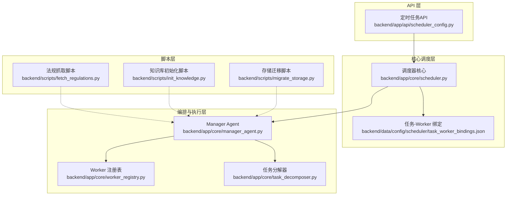
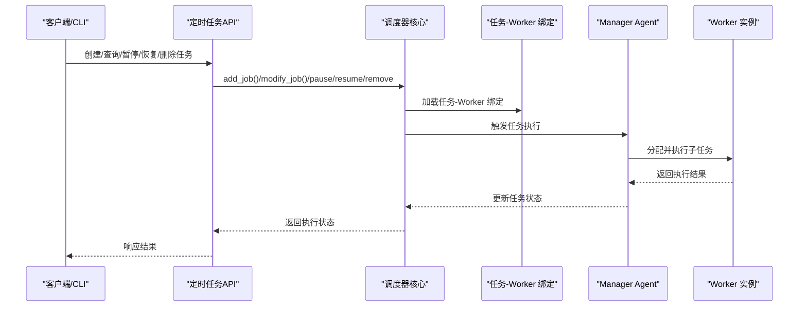
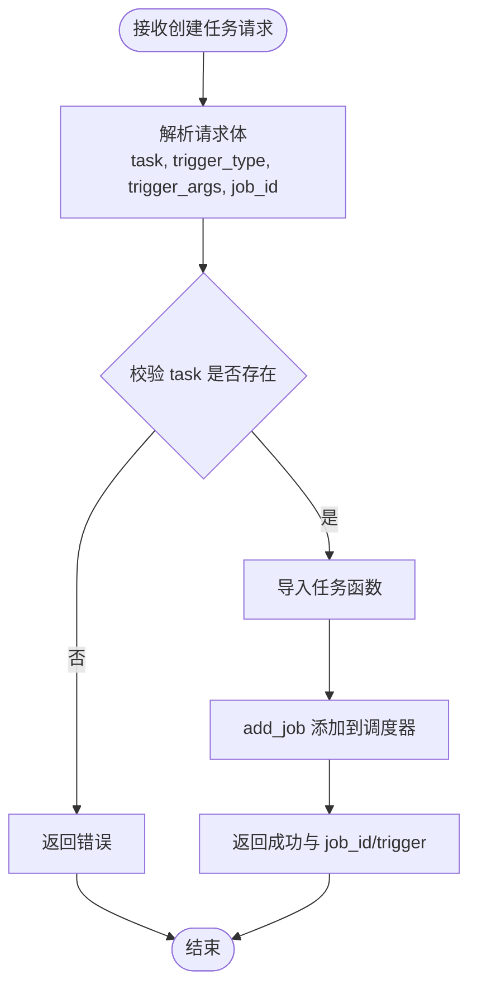
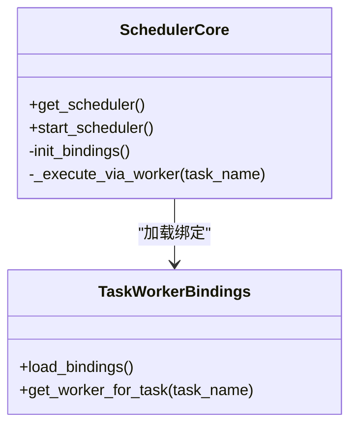
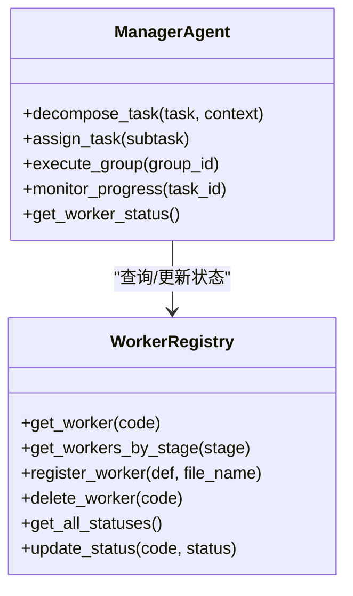
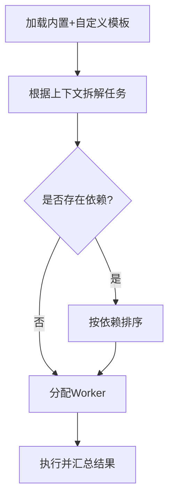
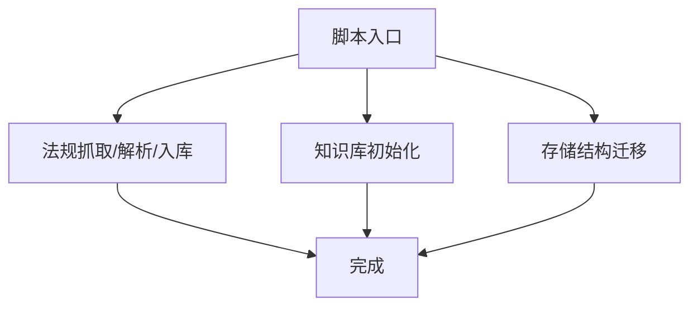
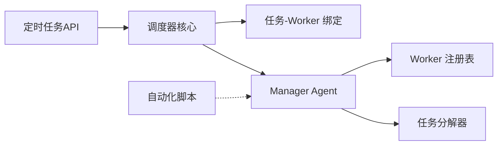

# 运维自动化

<cite>
**本文引用的文件**
- [backend/app/api/scheduler_config.py](file://backend/app/api/scheduler_config.py)
- [backend/app/core/scheduler.py](file://backend/app/core/scheduler.py)
- [backend/app/core/manager_agent.py](file://backend/app/core/manager_agent.py)
- [backend/app/core/worker_registry.py](file://backend/app/core/worker_registry.py)
- [backend/app/core/task_decomposer.py](file://backend/app/core/task_decomposer.py)
- [backend/scripts/fetch_regulations.py](file://backend/scripts/fetch_regulations.py)
- [backend/scripts/init_knowledge.py](file://backend/scripts/init_knowledge.py)
- [backend/scripts/migrate_storage.py](file://backend/scripts/migrate_storage.py)
- [backend/data/config/scheduler/task_worker_bindings.json](file://backend/data/config/scheduler/task_worker_bindings.json)
- [backend/data/config/workers/custom_workers.md](file://backend/data/config/workers/custom_workers.md)
- [后端变更路线图.md](file://后端变更路线图.md)
</cite>

## 目录
1. [引言](#引言)
2. [项目结构](#项目结构)
3. [核心组件](#核心组件)
4. [架构总览](#架构总览)
5. [详细组件分析](#详细组件分析)
6. [依赖分析](#依赖分析)
7. [性能考量](#性能考量)
8. [故障排查指南](#故障排查指南)
9. [结论](#结论)
10. [附录](#附录)

## 引言
本文件面向避风港平台的运维与自动化团队，系统化梳理平台的运维自动化体系：定时任务调度（APScheduler）、自动化脚本（法规抓取、知识库初始化、系统维护）、部署与运行时编排（Worker与任务分派）、以及运维工具链（CLI、API、Web界面）。文档以代码为依据，辅以可视化图示，帮助读者快速理解并安全高效地使用与扩展自动化能力。

## 项目结构
运维自动化相关的关键位置集中在后端模块与脚本目录：
- API 层：提供定时任务的增删改查、立即触发、暂停/恢复等管理接口
- 核心调度层：APScheduler 初始化、任务导入与执行分发
- 编排与执行层：Worker 注册表、任务分解器、Manager Agent 协调
- 脚本层：独立的自动化脚本（法规抓取、知识库初始化、存储迁移）
- 配置层：任务-Worker 绑定、Worker 定义、事件与技能注册等

图表来源
- [backend/app/api/scheduler_config.py:45-250](file://backend/app/api/scheduler_config.py#L45-L250)
- [backend/app/core/scheduler.py:219-241](file://backend/app/core/scheduler.py#L219-L241)
- [backend/data/config/scheduler/task_worker_bindings.json](file://backend/data/config/scheduler/task_worker_bindings.json)
- [backend/app/core/manager_agent.py:255-605](file://backend/app/core/manager_agent.py#L255-L605)
- [backend/app/core/worker_registry.py:1-433](file://backend/app/core/worker_registry.py#L1-L433)
- [backend/app/core/task_decomposer.py:68-357](file://backend/app/core/task_decomposer.py#L68-L357)
- [backend/scripts/fetch_regulations.py](file://backend/scripts/fetch_regulations.py)
- [backend/scripts/init_knowledge.py](file://backend/scripts/init_knowledge.py)
- [backend/scripts/migrate_storage.py](file://backend/scripts/migrate_storage.py)

章节来源
- [backend/app/api/scheduler_config.py:45-250](file://backend/app/api/scheduler_config.py#L45-L250)
- [backend/app/core/scheduler.py:219-241](file://backend/app/core/scheduler.py#L219-L241)
- [backend/app/core/manager_agent.py:255-605](file://backend/app/core/manager_agent.py#L255-L605)
- [backend/app/core/worker_registry.py:1-433](file://backend/app/core/worker_registry.py#L1-L433)
- [backend/app/core/task_decomposer.py:68-357](file://backend/app/core/task_decomposer.py#L68-L357)
- [backend/scripts/fetch_regulations.py](file://backend/scripts/fetch_regulations.py)
- [backend/scripts/init_knowledge.py](file://backend/scripts/init_knowledge.py)
- [backend/scripts/migrate_storage.py](file://backend/scripts/migrate_storage.py)

## 核心组件
- 定时任务API：提供列出任务模板、创建任务、暂停/恢复/删除任务、立即触发等接口
- 调度器核心：负责初始化APScheduler、加载任务-Worker绑定、统一通过Worker执行任务
- Manager Agent：根据业务阶段与优先级选择Worker，执行任务组并进行状态监控
- Worker 注册表：从配置文件加载Worker定义，支持动态注册/删除与状态追踪
- 任务分解器：内置与自定义模板，将复杂任务拆分为子任务序列
- 自动化脚本：独立脚本用于法规抓取、知识库初始化、存储迁移

章节来源
- [backend/app/api/scheduler_config.py:45-250](file://backend/app/api/scheduler_config.py#L45-L250)
- [backend/app/core/scheduler.py:219-241](file://backend/app/core/scheduler.py#L219-L241)
- [backend/app/core/manager_agent.py:255-605](file://backend/app/core/manager_agent.py#L255-L605)
- [backend/app/core/worker_registry.py:1-433](file://backend/app/core/worker_registry.py#L1-L433)
- [backend/app/core/task_decomposer.py:68-357](file://backend/app/core/task_decomposer.py#L68-L357)

## 架构总览
下图展示运维自动化的端到端流程：API 接收任务请求，调度器加载绑定并通过 Worker 执行；Manager Agent 负责任务分派与状态管理；脚本作为独立自动化单元可被调度或手动执行。

图表来源
- [backend/app/api/scheduler_config.py:210-250](file://backend/app/api/scheduler_config.py#L210-L250)
- [backend/app/core/scheduler.py:224-241](file://backend/app/core/scheduler.py#L224-L241)
- [backend/data/config/scheduler/task_worker_bindings.json](file://backend/data/config/scheduler/task_worker_bindings.json)
- [backend/app/core/manager_agent.py:292-605](file://backend/app/core/manager_agent.py#L292-L605)

## 详细组件分析

### 定时任务调度与API
- 任务模板与导入：API 提供列出可用任务的接口，内部通过任务名导入对应函数
- 触发器类型：支持 interval 与 cron 两种触发器，参数通过 trigger_args 传递
- 生命周期管理：支持创建、暂停、恢复、删除、立即触发
- 序列化与展示：对 APScheduler 的 Job 进行序列化，便于前端展示

图表来源
- [backend/app/api/scheduler_config.py:210-250](file://backend/app/api/scheduler_config.py#L210-L250)

章节来源
- [backend/app/api/scheduler_config.py:45-250](file://backend/app/api/scheduler_config.py#L45-L250)

### 调度器核心与任务-Worker 绑定
- 初始化：在应用启动时初始化绑定、创建 AsyncIOScheduler 并启动
- 绑定加载：从配置文件加载任务到 Worker 的映射，决定任务执行路径
- 执行分发：所有任务通过统一入口分发到 Worker，Worker 使用 SDK 执行

图表来源
- [backend/app/core/scheduler.py:219-241](file://backend/app/core/scheduler.py#L219-L241)
- [backend/data/config/scheduler/task_worker_bindings.json](file://backend/data/config/scheduler/task_worker_bindings.json)

章节来源
- [backend/app/core/scheduler.py:219-241](file://backend/app/core/scheduler.py#L219-L241)
- [backend/data/config/scheduler/task_worker_bindings.json](file://backend/data/config/scheduler/task_worker_bindings.json)

### Manager Agent 与 Worker 注册表
- Worker 选择策略：按业务阶段匹配，优先级排序，结合当前负载选择最优 Worker
- 任务组执行：支持按依赖顺序执行任务组，并提供状态查询与用户干预接口
- Worker 注册表：从配置文件加载 Worker 定义，支持动态注册/删除与运行时状态追踪

图表来源
- [backend/app/core/manager_agent.py:255-605](file://backend/app/core/manager_agent.py#L255-L605)
- [backend/app/core/worker_registry.py:1-433](file://backend/app/core/worker_registry.py#L1-L433)

章节来源
- [backend/app/core/manager_agent.py:255-605](file://backend/app/core/manager_agent.py#L255-L605)
- [backend/app/core/worker_registry.py:1-433](file://backend/app/core/worker_registry.py#L1-L433)

### 任务分解器与模板
- 内置模板：基于业务阶段与优先级的内置分解模板
- 自定义模板：从配置目录加载 YAML 模板，支持扩展
- 拆解与依赖：支持子任务依赖关系与优先级排序

图表来源
- [backend/app/core/task_decomposer.py:68-357](file://backend/app/core/task_decomposer.py#L68-L357)

章节来源
- [backend/app/core/task_decomposer.py:68-357](file://backend/app/core/task_decomposer.py#L68-L357)

### 自动化脚本设计与实现
- 法规数据抓取脚本：独立脚本，用于周期性抓取法规数据并入库
- 知识库初始化脚本：用于首次或重置后初始化知识库
- 存储迁移脚本：用于数据库或存储结构变更后的迁移

图表来源
- [backend/scripts/fetch_regulations.py](file://backend/scripts/fetch_regulations.py)
- [backend/scripts/init_knowledge.py](file://backend/scripts/init_knowledge.py)
- [backend/scripts/migrate_storage.py](file://backend/scripts/migrate_storage.py)

章节来源
- [backend/scripts/fetch_regulations.py](file://backend/scripts/fetch_regulations.py)
- [backend/scripts/init_knowledge.py](file://backend/scripts/init_knowledge.py)
- [backend/scripts/migrate_storage.py](file://backend/scripts/migrate_storage.py)

## 依赖分析
- API 对调度器核心的依赖：通过调度器提供的统一入口创建/管理任务
- 调度器对绑定与 Worker 的依赖：任务执行必须通过 Worker 执行
- Manager Agent 对 Worker 注册表与任务分解器的依赖：用于任务分派与状态管理
- 脚本对编排层的依赖：脚本可直接调用编排层能力，也可独立运行

图表来源
- [backend/app/api/scheduler_config.py:45-250](file://backend/app/api/scheduler_config.py#L45-L250)
- [backend/app/core/scheduler.py:219-241](file://backend/app/core/scheduler.py#L219-L241)
- [backend/app/core/manager_agent.py:255-605](file://backend/app/core/manager_agent.py#L255-L605)
- [backend/app/core/worker_registry.py:1-433](file://backend/app/core/worker_registry.py#L1-L433)
- [backend/app/core/task_decomposer.py:68-357](file://backend/app/core/task_decomposer.py#L68-L357)
- [backend/scripts/fetch_regulations.py](file://backend/scripts/fetch_regulations.py)
- [backend/scripts/init_knowledge.py](file://backend/scripts/init_knowledge.py)
- [backend/scripts/migrate_storage.py](file://backend/scripts/migrate_storage.py)

章节来源
- [backend/app/api/scheduler_config.py:45-250](file://backend/app/api/scheduler_config.py#L45-L250)
- [backend/app/core/scheduler.py:219-241](file://backend/app/core/scheduler.py#L219-L241)
- [backend/app/core/manager_agent.py:255-605](file://backend/app/core/manager_agent.py#L255-L605)
- [backend/app/core/worker_registry.py:1-433](file://backend/app/core/worker_registry.py#L1-L433)
- [backend/app/core/task_decomposer.py:68-357](file://backend/app/core/task_decomposer.py#L68-L357)
- [backend/scripts/fetch_regulations.py](file://backend/scripts/fetch_regulations.py)
- [backend/scripts/init_knowledge.py](file://backend/scripts/init_knowledge.py)
- [backend/scripts/migrate_storage.py](file://backend/scripts/migrate_storage.py)

## 性能考量
- 调度器并发：APScheduler 在异步事件循环中运行，避免阻塞；建议合理设置任务数量与触发频率
- Worker 负载均衡：Manager Agent 会根据 Worker 当前任务数选择负载更低的实例，降低热点
- 绑定优化：任务-Worker 绑定应尽量明确，减少跨阶段执行带来的额外开销
- 脚本批处理：脚本执行涉及网络与IO，建议分批与限速，避免对上游系统造成冲击

## 故障排查指南
- 调度器未运行：检查调度器启动逻辑与配置开关，确认已初始化绑定
- 任务导入失败：确认任务名存在于可用任务列表，且导入函数存在
- Worker 执行异常：查看 Worker 注册表的运行时状态与错误统计，定位具体失败原因
- 任务状态异常：通过 API 查询任务状态，必要时暂停/恢复或删除重建

章节来源
- [backend/app/core/scheduler.py:224-241](file://backend/app/core/scheduler.py#L224-L241)
- [backend/app/api/scheduler_config.py:210-250](file://backend/app/api/scheduler_config.py#L210-L250)
- [backend/app/core/worker_registry.py:396-421](file://backend/app/core/worker_registry.py#L396-L421)

## 结论
避风港平台的运维自动化以 APscheduler 为核心，结合配置驱动的 Worker 注册表与任务分解器，实现了从任务编排到执行落地的完整闭环。通过 API 与脚本双通道，既满足日常运维的可视化管理，也支持离线脚本的批量处理。建议在生产环境中严格控制任务并发、完善监控告警与回滚策略，确保自动化系统的稳定性与安全性。

## 附录

### 运维自动化工具使用指南
- 命令行工具
  - 法规抓取：通过独立脚本执行，支持参数化配置与日志输出
  - 知识库初始化：用于首次部署或重置后初始化
  - 存储迁移：用于结构变更后的数据迁移
- API 接口
  - 列出任务模板：获取可用任务清单
  - 创建任务：指定触发器类型与参数，创建定时任务
  - 立即触发：临时绕过计划时间，立即执行一次
  - 暂停/恢复/删除：对任务生命周期进行管理
- Web 界面
  - 基于前端页面与后端 API 的交互，提供任务编排与状态监控界面

章节来源
- [backend/scripts/fetch_regulations.py](file://backend/scripts/fetch_regulations.py)
- [backend/scripts/init_knowledge.py](file://backend/scripts/init_knowledge.py)
- [backend/scripts/migrate_storage.py](file://backend/scripts/migrate_storage.py)
- [backend/app/api/scheduler_config.py:45-250](file://backend/app/api/scheduler_config.py#L45-L250)

### 部署流程自动化建议
- 环境配置：通过配置文件集中管理任务-Worker 绑定与 Worker 定义
- 依赖安装：在容器或虚拟环境中统一安装依赖，保证一致性
- 服务启动：应用启动时自动初始化调度器与绑定，确保系统就绪
- 监控与告警：结合 Worker 注册表的状态统计与任务执行日志，建立健康检查与告警

章节来源
- [backend/data/config/scheduler/task_worker_bindings.json](file://backend/data/config/scheduler/task_worker_bindings.json)
- [backend/data/config/workers/custom_workers.md](file://backend/data/config/workers/custom_workers.md)
- [后端变更路线图.md:795-1029](file://后端变更路线图.md#L795-L1029)