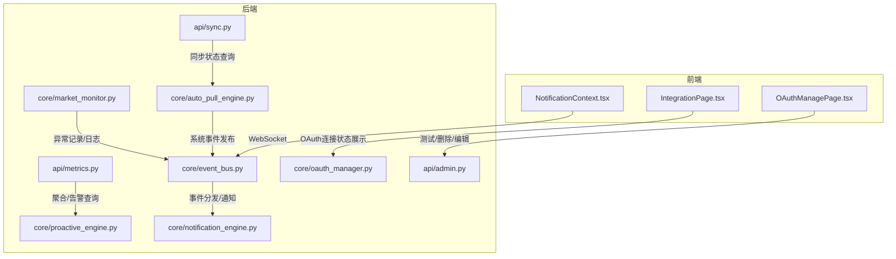
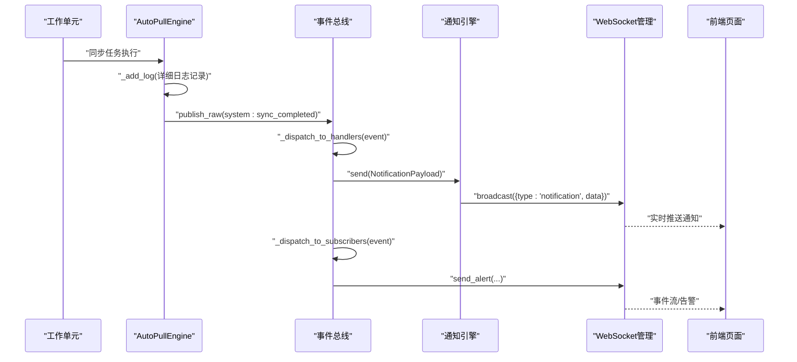
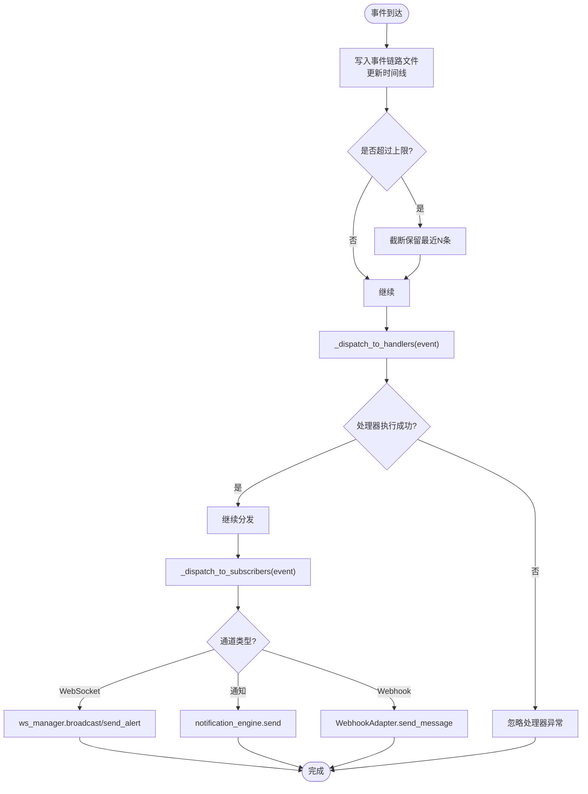
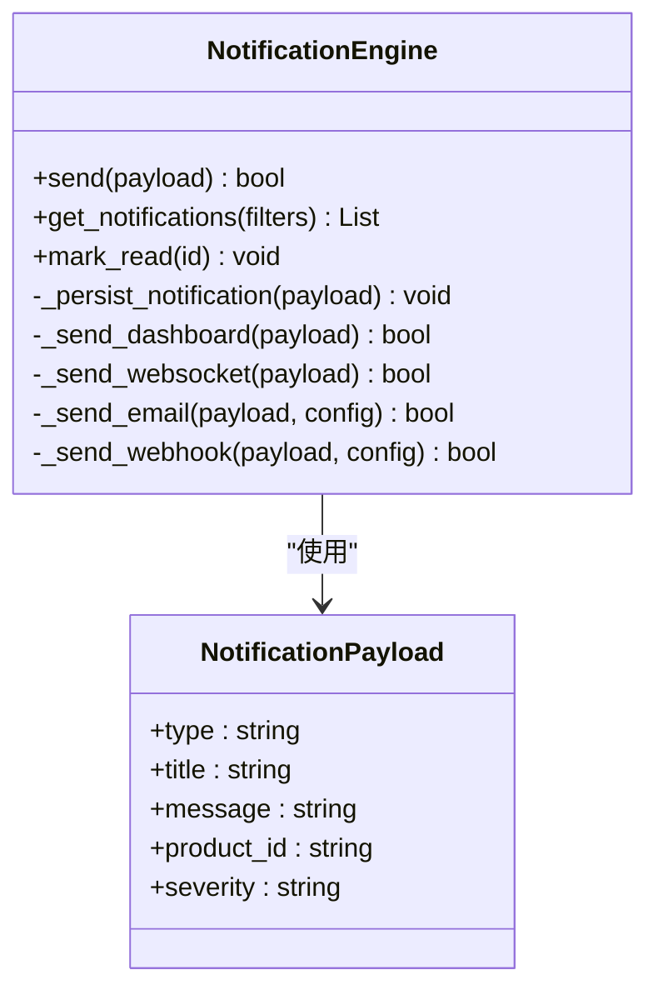
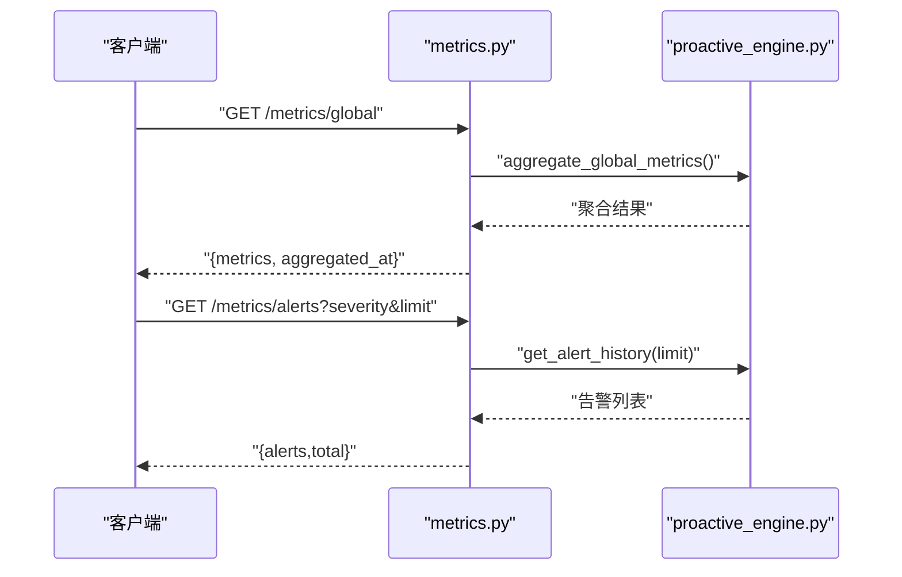
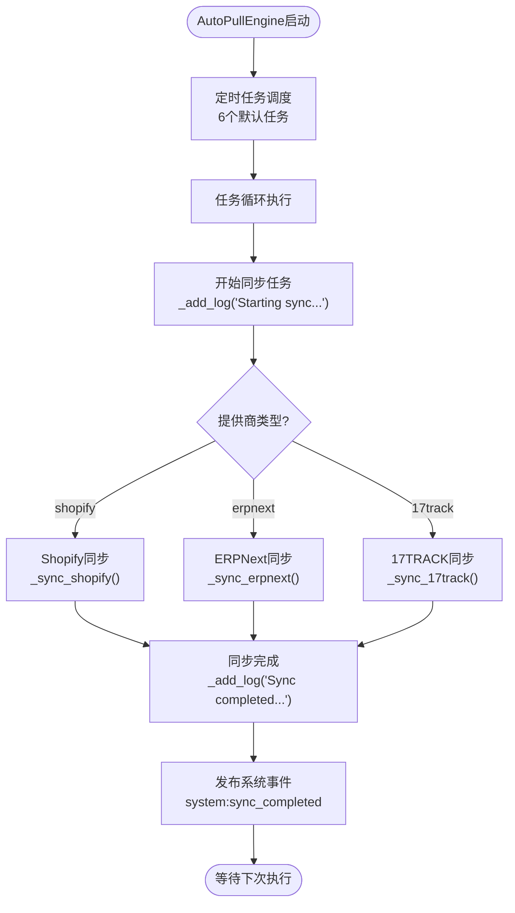
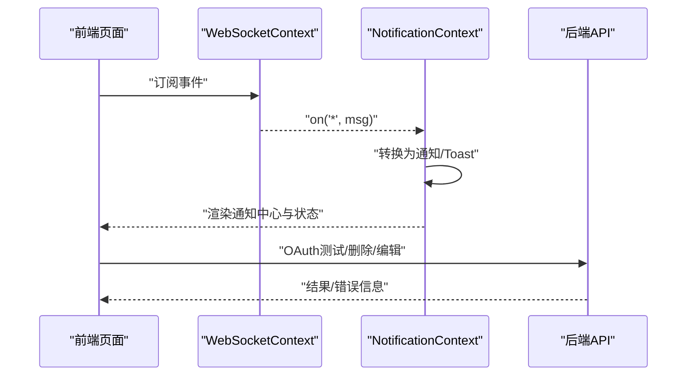
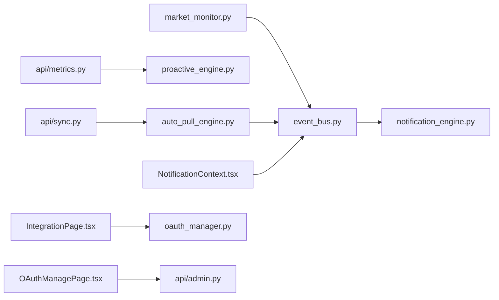

# 错误追踪与调试

<cite>
**本文引用的文件**
- [event_bus.py](file://backend/app/core/event_bus.py)
- [notification_engine.py](file://backend/app/core/notification_engine.py)
- [metrics.py](file://backend/app/api/metrics.py)
- [proactive_engine.py](file://backend/app/core/proactive_engine.py)
- [market_monitor.py](file://backend/app/core/market_monitor.py)
- [admin.py](file://backend/app/api/admin.py)
- [oauth_manager.py](file://backend/app/core/oauth_manager.py)
- [kill_server.py](file://backend/tests/archived/kill_server.py)
- [IntegrationPage.tsx](file://frontend/src/pages/IntegrationPage.tsx)
- [OAuthManagePage.tsx](file://frontend/src/pages/config/OAuthManagePage.tsx)
- [NotificationContext.tsx](file://frontend/src/context/NotificationContext.tsx)
- [auto_pull_engine.py](file://backend/app/core/auto_pull_engine.py)
- [sync.py](file://backend/app/api/sync.py)
- [logs.json](file://backend/data/sync/logs.json)
- [bus.json](file://backend/data/global/events/bus.json)
- [前后端api交互.md](file://前后端api交互.md)
</cite>

## 更新摘要
**所做更改**
- 新增AutoPullEngine同步引擎的详细错误追踪机制
- 添加系统事件发布机制，支持更精细的问题诊断
- 增强同步过程的日志记录和状态监控能力
- 完善同步API的调试接口和状态查询功能

## 目录
1. [简介](#简介)
2. [项目结构](#项目结构)
3. [核心组件](#核心组件)
4. [架构总览](#架构总览)
5. [组件详解](#组件详解)
6. [依赖关系分析](#依赖关系分析)
7. [性能考量](#性能考量)
8. [故障排查指南](#故障排查指南)
9. [结论](#结论)
10. [附录](#附录)

## 简介
本文件面向避风港平台的开发与运维团队，系统化梳理错误追踪与调试体系，覆盖异常捕获、错误分类与处理流程、错误日志记录规范、调试工具使用方法、常见错误诊断与解决、错误监控与告警配置，以及最佳实践与故障排除方法。特别针对增强的同步过程错误追踪能力，新增AutoPullEngine详细日志记录和系统事件发布机制，支持更精细的问题诊断。

## 项目结构
后端采用FastAPI应用，核心错误与事件处理集中在core子模块；前端通过WebSocket与后端进行实时事件与通知联动；测试脚本提供进程级调试辅助能力。新增的AutoPullEngine同步引擎提供专门的错误追踪和调试能力。

**图表来源**
- [event_bus.py](file://backend/app/core/event_bus.py)
- [notification_engine.py](file://backend/app/core/notification_engine.py)
- [metrics.py](file://backend/app/api/metrics.py)
- [proactive_engine.py](file://backend/app/core/proactive_engine.py)
- [market_monitor.py](file://backend/app/core/market_monitor.py)
- [oauth_manager.py](file://backend/app/core/oauth_manager.py)
- [admin.py](file://backend/app/api/admin.py)
- [auto_pull_engine.py](file://backend/app/core/auto_pull_engine.py)
- [sync.py](file://backend/app/api/sync.py)
- [NotificationContext.tsx](file://frontend/src/context/NotificationContext.tsx)
- [IntegrationPage.tsx](file://frontend/src/pages/IntegrationPage.tsx)
- [OAuthManagePage.tsx](file://frontend/src/pages/config/OAuthManagePage.tsx)

**章节来源**
- [event_bus.py](file://backend/app/core/event_bus.py)
- [notification_engine.py](file://backend/app/core/notification_engine.py)
- [metrics.py](file://backend/app/api/metrics.py)
- [proactive_engine.py](file://backend/app/core/proactive_engine.py)
- [market_monitor.py](file://backend/app/core/market_monitor.py)
- [oauth_manager.py](file://backend/app/core/oauth_manager.py)
- [admin.py](file://backend/app/api/admin.py)
- [auto_pull_engine.py](file://backend/app/core/auto_pull_engine.py)
- [sync.py](file://backend/app/api/sync.py)
- [NotificationContext.tsx](file://frontend/src/context/NotificationContext.tsx)
- [IntegrationPage.tsx](file://frontend/src/pages/IntegrationPage.tsx)
- [OAuthManagePage.tsx](file://frontend/src/pages/config/OAuthManagePage.tsx)

## 核心组件
- 事件总线与错误分发：负责事件接收、分类、分发与订阅者通知，支持WebSocket、站内通知与Webhook。
- 通知引擎：统一管理多渠道通知（仪表盘、WebSocket、邮件、Webhook），并维护通知历史。
- 主动引擎与指标：提供全局指标聚合与预警历史查询，支撑错误趋势与异常检测。
- 市场监控与日志：对轮询与分析过程中的异常进行日志记录与事件上报。
- **AutoPullEngine同步引擎**：专门的同步过程错误追踪系统，提供详细的日志记录和系统事件发布机制。
- 前端通知与状态展示：通过WebSocket实时接收事件，展示连接状态与异常计数。

**章节来源**
- [event_bus.py](file://backend/app/core/event_bus.py)
- [notification_engine.py](file://backend/app/core/notification_engine.py)
- [metrics.py](file://backend/app/api/metrics.py)
- [proactive_engine.py](file://backend/app/core/proactive_engine.py)
- [market_monitor.py](file://backend/app/core/market_monitor.py)
- [auto_pull_engine.py](file://backend/app/core/auto_pull_engine.py)

## 架构总览
后端通过事件总线收集系统运行中的各类事件（含错误），按严重级别路由至不同通知渠道；前端通过WebSocket订阅事件，实时展示异常状态与告警。新增的AutoPullEngine提供专门的同步过程监控和调试能力。

**图表来源**
- [event_bus.py](file://backend/app/core/event_bus.py)
- [notification_engine.py](file://backend/app/core/notification_engine.py)
- [auto_pull_engine.py](file://backend/app/core/auto_pull_engine.py)

## 组件详解

### 事件总线与错误分发
- 事件接收与持久化：将事件追加到链路数据文件，维护时间线与事件总数，限制保留数量以控制体积。
- 事件分发：按订阅规则匹配处理器与通道，分别通过WebSocket、站内通知与Webhook推送。
- 处理器容错：单个处理器异常不会影响其他处理器继续执行。
- 事件定义：内置多种事件类型（如系统同步失败、风险阈值突破等），并设定严重级别与通知策略。

**图表来源**
- [event_bus.py](file://backend/app/core/event_bus.py)

**章节来源**
- [event_bus.py](file://backend/app/core/event_bus.py)

### 通知引擎与多渠道告警
- 渠道配置：支持仪表盘、WebSocket、邮件、Webhook四类渠道，可按严重级别路由。
- 通知历史：持久化通知记录，便于审计与回溯。
- 发送流程：根据配置选择渠道异步发送；WebSocket发送失败会静默降级，避免阻塞主流程。

**图表来源**
- [notification_engine.py](file://backend/app/core/notification_engine.py)

**章节来源**
- [notification_engine.py](file://backend/app/core/notification_engine.py)

### 主动引擎与指标告警
- 指标聚合：提供全局指标聚合接口，异常时返回空结果以保证稳定性。
- 告警历史：支持按严重级别过滤与分页查询，便于问题定位与复盘。

**图表来源**
- [metrics.py](file://backend/app/api/metrics.py)
- [proactive_engine.py](file://backend/app/core/proactive_engine.py)

**章节来源**
- [metrics.py](file://backend/app/api/metrics.py)
- [proactive_engine.py](file://backend/app/core/proactive_engine.py)

### AutoPullEngine同步引擎与错误追踪
- **详细日志记录**：每个同步任务都有独立的日志记录，包含开始、进度和完成状态。
- **系统事件发布**：同步完成后自动发布`system:sync_completed`事件，包含提供商、同步类型和统计数据。
- **状态监控**：提供完整的同步状态查询接口，包括运行中、失败和已完成的任务统计。
- **错误分类**：对不同提供商的同步错误进行分类记录，便于针对性诊断。

**图表来源**
- [auto_pull_engine.py](file://backend/app/core/auto_pull_engine.py)

**章节来源**
- [auto_pull_engine.py](file://backend/app/core/auto_pull_engine.py)
- [sync.py](file://backend/app/api/sync.py)

### 市场监控与日志记录
- 日志规范：对轮询与分析过程中的异常进行日志记录，包含错误详情与堆栈信息，便于定位。
- 事件上报：异常时通过事件总线发布"同步失败"等事件，触发通知与告警。

**章节来源**
- [market_monitor.py](file://backend/app/core/market_monitor.py)
- [event_bus.py](file://backend/app/core/event_bus.py)

### 前端通知与状态展示
- WebSocket订阅：从通知上下文中订阅事件，转换为通知与Toast。
- 连接状态展示：集成页面统计连接状态与异常数量，便于快速发现异常。
- OAuth管理：提供测试连接能力，异常时弹窗提示，支持删除与编辑操作。

**图表来源**
- [NotificationContext.tsx](file://frontend/src/context/NotificationContext.tsx)
- [IntegrationPage.tsx](file://frontend/src/pages/IntegrationPage.tsx)
- [OAuthManagePage.tsx](file://frontend/src/pages/config/OAuthManagePage.tsx)

**章节来源**
- [NotificationContext.tsx](file://frontend/src/context/NotificationContext.tsx)
- [IntegrationPage.tsx](file://frontend/src/pages/IntegrationPage.tsx)
- [OAuthManagePage.tsx](file://frontend/src/pages/config/OAuthManagePage.tsx)

## 依赖关系分析
- 事件总线依赖通知引擎与通道适配器，实现多渠道分发。
- 指标API依赖主动引擎进行数据聚合与告警历史查询。
- 市场监控模块在异常时通过事件总线上报，形成闭环。
- **AutoPullEngine依赖事件总线发布系统事件，并通过API提供状态查询**。
- 前端通过WebSocket与后端保持实时通信，实现通知与事件的即时展示。

**图表来源**
- [market_monitor.py](file://backend/app/core/market_monitor.py)
- [event_bus.py](file://backend/app/core/event_bus.py)
- [notification_engine.py](file://backend/app/core/notification_engine.py)
- [metrics.py](file://backend/app/api/metrics.py)
- [proactive_engine.py](file://backend/app/core/proactive_engine.py)
- [auto_pull_engine.py](file://backend/app/core/auto_pull_engine.py)
- [sync.py](file://backend/app/api/sync.py)
- [NotificationContext.tsx](file://frontend/src/context/NotificationContext.tsx)
- [IntegrationPage.tsx](file://frontend/src/pages/IntegrationPage.tsx)
- [OAuthManagePage.tsx](file://frontend/src/pages/config/OAuthManagePage.tsx)
- [oauth_manager.py](file://backend/app/core/oauth_manager.py)
- [admin.py](file://backend/app/api/admin.py)

**章节来源**
- [market_monitor.py](file://backend/app/core/market_monitor.py)
- [event_bus.py](file://backend/app/core/event_bus.py)
- [notification_engine.py](file://backend/app/core/notification_engine.py)
- [metrics.py](file://backend/app/api/metrics.py)
- [proactive_engine.py](file://backend/app/core/proactive_engine.py)
- [auto_pull_engine.py](file://backend/app/core/auto_pull_engine.py)
- [sync.py](file://backend/app/api/sync.py)
- [NotificationContext.tsx](file://frontend/src/context/NotificationContext.tsx)
- [IntegrationPage.tsx](file://frontend/src/pages/IntegrationPage.tsx)
- [OAuthManagePage.tsx](file://frontend/src/pages/config/OAuthManagePage.tsx)
- [oauth_manager.py](file://backend/app/core/oauth_manager.py)
- [admin.py](file://backend/app/api/admin.py)

## 性能考量
- 事件链路文件写入与截断：限制事件数量，避免磁盘膨胀与读写压力。
- 处理器异常隔离：单点异常不影响整体分发，提升鲁棒性。
- 通知渠道异步化：WebSocket广播与持久化写入异步执行，降低主流程阻塞风险。
- 指标聚合降级：异常时返回空结果，避免级联失败。
- **AutoPullEngine日志管理**：同步日志限制在1000条以内，自动截断保留最近500条，避免内存泄漏。

## 故障排查指南

### 本地调试
- 进程清理：使用测试脚本终止占用uvicorn或包含main:app的Python进程，释放端口。
- 日志查看：关注市场监控模块的日志输出，定位轮询与分析阶段的异常。
- 前端联调：通过通知上下文确认WebSocket是否正常接收事件，检查通知中心渲染。
- **同步引擎调试**：使用`/api/v1/sync/status`接口查看AutoPullEngine状态，使用`/api/v1/sync/logs`查看详细日志。

**章节来源**
- [kill_server.py](file://backend/tests/archived/kill_server.py)
- [market_monitor.py](file://backend/app/core/market_monitor.py)
- [NotificationContext.tsx](file://frontend/src/context/NotificationContext.tsx)
- [sync.py](file://backend/app/api/sync.py)

### 远程调试
- 事件溯源：通过事件总线的事件链路文件与时间线，回溯异常发生的时间点与上下文。
- 通知验证：确认通知引擎的各渠道配置与可用性，优先验证WebSocket广播是否可达。
- 指标核验：使用指标API查询聚合结果与告警历史，判断是否存在异常趋势。
- **同步状态检查**：通过事件总线中的`system:sync_completed`事件验证同步过程是否正常完成。

**章节来源**
- [event_bus.py](file://backend/app/core/event_bus.py)
- [notification_engine.py](file://backend/app/core/notification_engine.py)
- [metrics.py](file://backend/app/api/metrics.py)
- [bus.json](file://backend/data/global/events/bus.json)

### 生产环境调试
- 事件与日志：结合事件总线与后端日志，定位错误发生的具体模块与调用路径。
- 前端状态：通过集成页面的连接状态与异常计数，快速识别受影响的产品或连接。
- OAuth测试：使用OAuth管理页面的测试功能，验证第三方连接的可用性与错误原因。
- **同步过程监控**：通过`/api/v1/sync/jobs`接口查看当前运行的同步任务，识别长时间运行或失败的任务。

**章节来源**
- [event_bus.py](file://backend/app/core/event_bus.py)
- [IntegrationPage.tsx](file://frontend/src/pages/IntegrationPage.tsx)
- [OAuthManagePage.tsx](file://frontend/src/pages/config/OAuthManagePage.tsx)
- [sync.py](file://backend/app/api/sync.py)

### 常见错误类型与诊断
- 数据库连接失败
  - 现象：指标聚合或事件写入异常。
  - 诊断：检查后端日志中的数据库相关错误；确认连接字符串与凭据；验证网络连通性。
  - 解决：修正配置、恢复网络、重试连接。
- API调用超时
  - 现象：市场监控轮询或外部系统同步超时。
  - 诊断：查看超时堆栈与请求参数；评估上游服务健康度与限流策略。
  - 解决：增加超时重试、优化上游接口、调整并发策略。
- 内存溢出
  - 现象：服务进程崩溃或频繁重启。
  - 诊断：采集内存与GC日志；定位大对象与长生命周期缓存。
  - 解决：优化数据结构、引入分页与压缩、设置资源上限与告警。
- **同步引擎错误**
  - 现象：AutoPullEngine无法启动或同步任务失败。
  - 诊断：检查`/api/v1/sync/status`返回的状态；查看`/api/v1/sync/logs`中的详细错误日志；验证提供商连接配置。
  - 解决：修正配置、检查网络连通性、增加重试机制。

**章节来源**
- [market_monitor.py](file://backend/app/core/market_monitor.py)
- [event_bus.py](file://backend/app/core/event_bus.py)
- [auto_pull_engine.py](file://backend/app/core/auto_pull_engine.py)
- [sync.py](file://backend/app/api/sync.py)

### 错误监控与告警配置
- 事件定义：在事件总线中维护事件类型、严重级别与通知策略，确保关键异常被正确识别。
- 通知路由：依据严重级别配置渠道，Critical/High优先走WebSocket与邮件，Medium走仪表盘。
- 指标告警：通过指标API查询告警历史，结合业务阈值进行二次告警。
- **同步事件监控**：利用`system:sync_completed`事件监控同步过程的完整性，设置同步失败告警。

**章节来源**
- [event_bus.py](file://backend/app/core/event_bus.py)
- [notification_engine.py](file://backend/app/core/notification_engine.py)
- [metrics.py](file://backend/app/api/metrics.py)
- [bus.json](file://backend/data/global/events/bus.json)

### 调试最佳实践
- 统一日志格式：统一记录时间戳、模块名、严重级别、上下文与堆栈摘要。
- 事件化思维：将异常与状态变更抽象为事件，便于回放与复盘。
- 前后端协同：前端通过WebSocket实时反馈异常状态，后端通过事件总线与通知引擎闭环处理。
- 降级与容错：在异常分支采用降级策略，保证核心功能可用。
- **同步过程可视化**：利用AutoPullEngine提供的详细日志和系统事件，建立同步过程的可视化监控面板。

**章节来源**
- [前后端api交互.md](file://前后端api交互.md)
- [event_bus.py](file://backend/app/core/event_bus.py)
- [notification_engine.py](file://backend/app/core/notification_engine.py)
- [auto_pull_engine.py](file://backend/app/core/auto_pull_engine.py)

## 结论
避风港平台通过事件总线、通知引擎与前端实时联动，构建了覆盖异常捕获、分类、分发与可视化的完整调试体系。新增的AutoPullEngine同步引擎进一步增强了同步过程的错误追踪能力，通过详细的日志记录和系统事件发布机制，支持更精细的问题诊断。配合日志规范、指标告警与最佳实践，团队可在本地、远程与生产环境中快速定位与解决问题，持续提升系统的稳定性与可观测性。

## 附录
- 前后端错误分层与常见场景处理参见交互文档。
- OAuth管理页面提供测试、删除与编辑能力，便于快速验证与修复。
- **AutoPullEngine提供完整的同步过程监控接口，包括状态查询、日志查看和手动触发功能**。

**章节来源**
- [前后端api交互.md](file://前后端api交互.md)
- [OAuthManagePage.tsx](file://frontend/src/pages/config/OAuthManagePage.tsx)
- [sync.py](file://backend/app/api/sync.py)
- [auto_pull_engine.py](file://backend/app/core/auto_pull_engine.py)