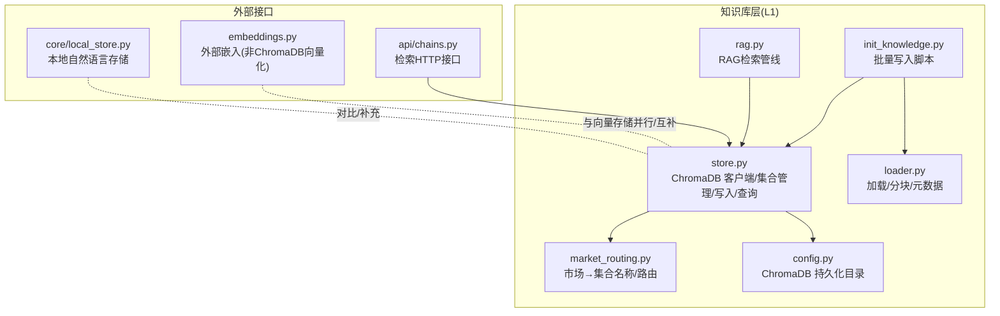
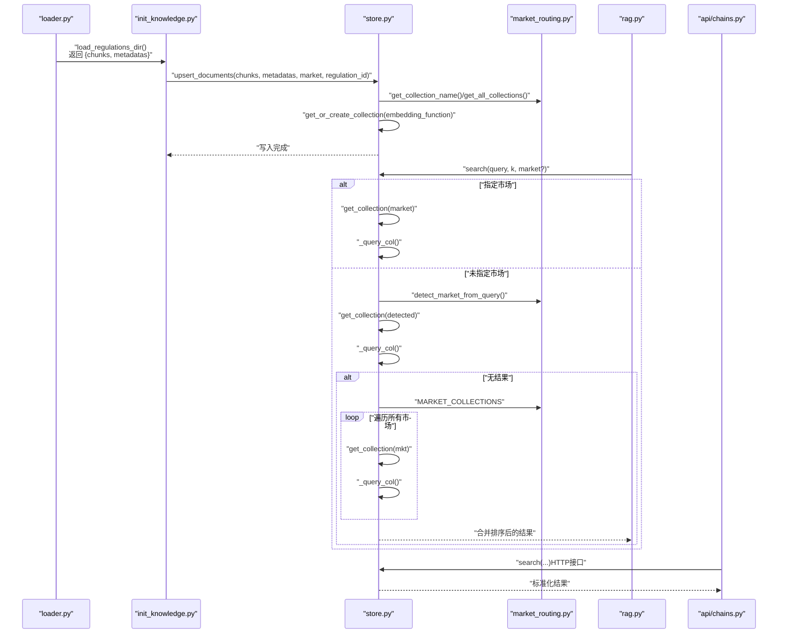
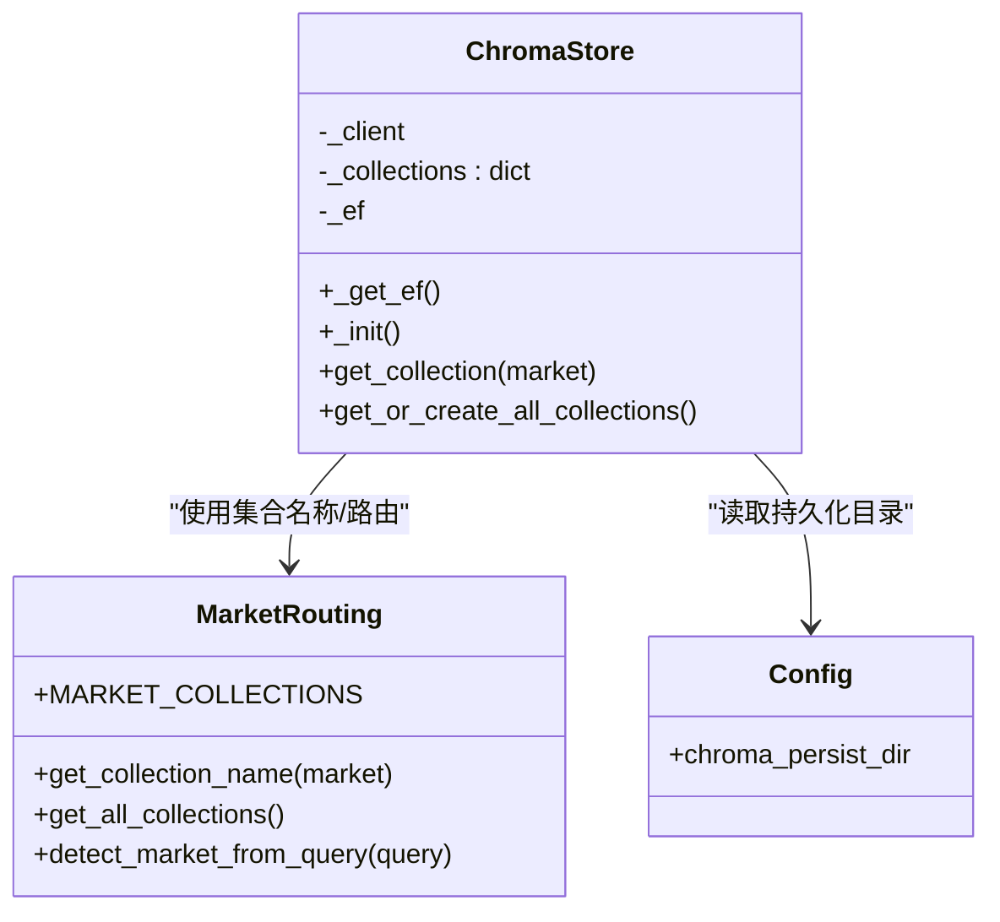
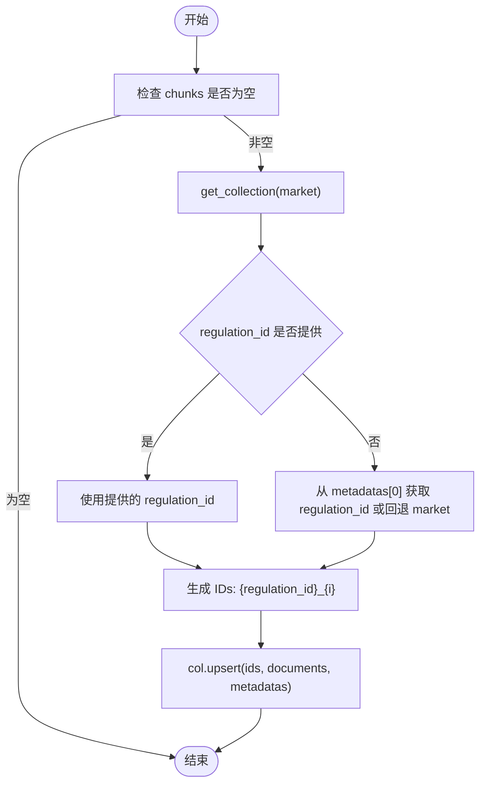
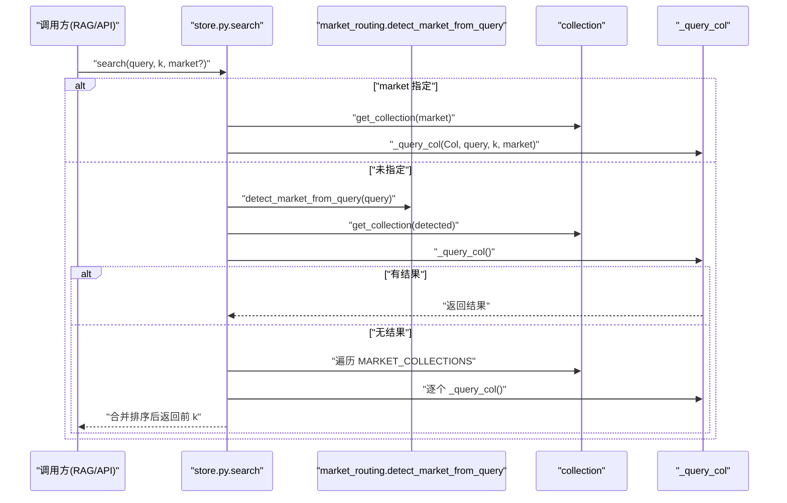
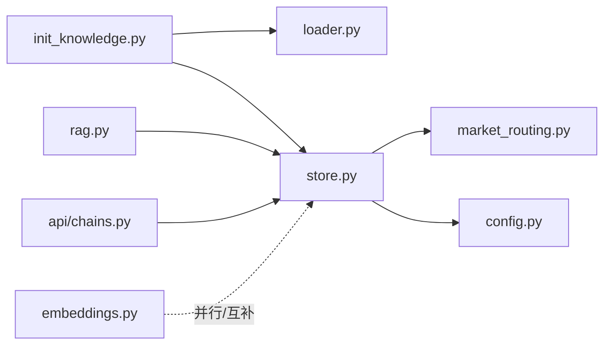
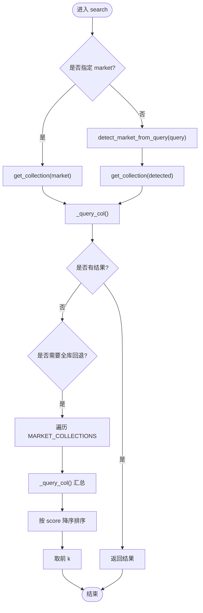

# 向量存储管理

<cite>
**本文引用的文件**
- [backend/app/knowledge/store.py](file://backend/app/knowledge/store.py)
- [backend/app/knowledge/market_routing.py](file://backend/app/knowledge/market_routing.py)
- [backend/app/knowledge/loader.py](file://backend/app/knowledge/loader.py)
- [backend/app/core/rag.py](file://backend/app/core/rag.py)
- [backend/scripts/init_knowledge.py](file://backend/scripts/init_knowledge.py)
- [backend/app/config.py](file://backend/app/config.py)
- [backend/app/knowledge/embeddings.py](file://backend/app/knowledge/embeddings.py)
- [backend/app/api/chains.py](file://backend/app/api/chains.py)
- [backend/app/core/local_store.py](file://backend/app/core/local_store.py)
</cite>

## 目录
1. [简介](#简介)
2. [项目结构](#项目结构)
3. [核心组件](#核心组件)
4. [架构总览](#架构总览)
5. [详细组件分析](#详细组件分析)
6. [依赖分析](#依赖分析)
7. [性能考虑](#性能考虑)
8. [故障排除指南](#故障排除指南)
9. [结论](#结论)
10. [附录](#附录)

## 简介
本文件面向向量存储管理，聚焦 ChromaDB 本地持久化向量数据库在合规知识库中的应用，系统性阐述多市场 collection 管理（eu_knowledge、us_knowledge、jp_knowledge、kr_knowledge）、懒加载初始化与 embedding function 延迟加载策略、内存中的 collection 缓存管理、upsert_documents 与 add_documents 的差异与使用场景、search 函数的语义搜索与回退查询机制、文档 ID 生成与元数据管理、查询结果处理、性能优化建议与故障排除，并提供实际使用示例与最佳实践。

## 项目结构
向量存储相关代码主要位于 backend/app/knowledge 目录，配合脚本与配置共同构成完整的知识库写入、路由与检索体系：
- store.py：ChromaDB 客户端、collection 管理、写入与查询接口
- market_routing.py：市场到 collection 名称映射与查询路由
- loader.py：法规文档加载与分块，生成带元数据的文本块
- rag.py：RAG 管道调用向量存储检索
- init_knowledge.py：批量写入脚本，驱动 upsert_documents
- config.py：ChromaDB 持久化目录等配置
- embeddings.py：OpenRouter 兼容的外部嵌入生成（与 ChromaDB 内嵌不同路径）
- api/chains.py：对外暴露的检索接口（与向量存储交互）
- core/local_store.py：本地自然语言存储（对比理解向量存储）

图表来源
- [backend/app/knowledge/store.py:1-227](file://backend/app/knowledge/store.py#L1-L227)
- [backend/app/knowledge/market_routing.py:1-77](file://backend/app/knowledge/market_routing.py#L1-L77)
- [backend/app/knowledge/loader.py:1-142](file://backend/app/knowledge/loader.py#L1-L142)
- [backend/app/core/rag.py:1-59](file://backend/app/core/rag.py#L1-L59)
- [backend/scripts/init_knowledge.py:1-129](file://backend/scripts/init_knowledge.py#L1-L129)
- [backend/app/config.py:1-75](file://backend/app/config.py#L1-L75)
- [backend/app/knowledge/embeddings.py:1-35](file://backend/app/knowledge/embeddings.py#L1-L35)
- [backend/app/api/chains.py:170-282](file://backend/app/api/chains.py#L170-L282)
- [backend/app/core/local_store.py:90-289](file://backend/app/core/local_store.py#L90-L289)

章节来源
- [backend/app/knowledge/store.py:1-227](file://backend/app/knowledge/store.py#L1-L227)
- [backend/app/knowledge/market_routing.py:1-77](file://backend/app/knowledge/market_routing.py#L1-L77)
- [backend/app/knowledge/loader.py:1-142](file://backend/app/knowledge/loader.py#L1-L142)
- [backend/app/core/rag.py:1-59](file://backend/app/core/rag.py#L1-L59)
- [backend/scripts/init_knowledge.py:1-129](file://backend/scripts/init_knowledge.py#L1-L129)
- [backend/app/config.py:1-75](file://backend/app/config.py#L1-L75)
- [backend/app/knowledge/embeddings.py:1-35](file://backend/app/knowledge/embeddings.py#L1-L35)
- [backend/app/api/chains.py:170-282](file://backend/app/api/chains.py#L170-L282)
- [backend/app/core/local_store.py:90-289](file://backend/app/core/local_store.py#L90-L289)

## 核心组件
- ChromaDB 客户端与集合管理
  - 单例客户端懒加载初始化，避免启动时 IO 开销
  - 按市场创建/获取 collection，内置 embedding function
  - 内存字典缓存 collection 实例，减少重复创建
- 写入接口
  - upsert_documents：幂等写入，ID 由 regulation_id 与索引组合，适合批量导入
  - add_documents：向后兼容接口，内部仍走 upsert，忽略外部传入的 embeddings
- 查询接口
  - search：支持指定市场或自动路由；若单市场无结果，自动回退全库查询
  - _query_col：内部执行查询，透传元数据，标准化输出字段
- 元数据与 ID 策略
  - 元数据包含市场、法规 ID、名称、来源链接、生效日期、标签等
  - ID 采用 {regulation_id}_{chunk_index}，保证重复运行不产生重复
- 配置与路由
  - chroma_persist_dir：ChromaDB 持久化目录
  - 市场到集合名称映射，查询关键词路由

章节来源
- [backend/app/knowledge/store.py:31-227](file://backend/app/knowledge/store.py#L31-L227)
- [backend/app/knowledge/market_routing.py:17-77](file://backend/app/knowledge/market_routing.py#L17-L77)
- [backend/app/config.py:39-41](file://backend/app/config.py#L39-L41)

## 架构总览
下图展示从“法规文档加载”到“向量检索”的端到端流程，强调多市场 collection 的隔离与路由策略。

图表来源
- [backend/scripts/init_knowledge.py:28-67](file://backend/scripts/init_knowledge.py#L28-L67)
- [backend/app/knowledge/store.py:80-158](file://backend/app/knowledge/store.py#L80-L158)
- [backend/app/knowledge/market_routing.py:31-77](file://backend/app/knowledge/market_routing.py#L31-L77)
- [backend/app/core/rag.py:10-18](file://backend/app/core/rag.py#L10-L18)
- [backend/app/api/chains.py:176-183](file://backend/app/api/chains.py#L176-L183)

## 详细组件分析

### ChromaDB 客户端与集合管理
- 懒加载客户端
  - 首次使用时创建 PersistentClient，指向 settings.chroma_persist_dir
  - 禁用遥测，避免网络请求
- 懒加载 embedding function
  - 首次使用时创建 SentenceTransformerEmbeddingFunction，local_files_only=True
  - 避免启动时下载模型，提升冷启动性能
- 集合缓存
  - 内存字典缓存 {collection_name: collection}，避免重复 get_or_create
- 集合元数据
  - 设置 hnsw:space 为 cosine，市场标记便于检索与运维

图表来源
- [backend/app/knowledge/store.py:31-78](file://backend/app/knowledge/store.py#L31-L78)
- [backend/app/knowledge/market_routing.py:17-77](file://backend/app/knowledge/market_routing.py#L17-L77)
- [backend/app/config.py:39-41](file://backend/app/config.py#L39-L41)

章节来源
- [backend/app/knowledge/store.py:31-78](file://backend/app/knowledge/store.py#L31-L78)
- [backend/app/knowledge/market_routing.py:17-46](file://backend/app/knowledge/market_routing.py#L17-L46)
- [backend/app/config.py:39-41](file://backend/app/config.py#L39-L41)

### 写入接口：upsert_documents 与 add_documents
- upsert_documents
  - 幂等写入，ID 采用 {regulation_id}_{chunk_index}
  - 自动触发 embedding function，无需外部向量化
  - 适合批量导入，由 init_knowledge.py 驱动
- add_documents（向后兼容）
  - 忽略外部 embeddings 参数，内部仍使用 upsert
  - 生成基于 market 的 ID 前缀，便于识别来源
- 使用场景
  - upsert_documents：标准批量导入，推荐
  - add_documents：兼容旧脚本或遗留调用

图表来源
- [backend/app/knowledge/store.py:80-104](file://backend/app/knowledge/store.py#L80-L104)

章节来源
- [backend/app/knowledge/store.py:80-125](file://backend/app/knowledge/store.py#L80-L125)
- [backend/scripts/init_knowledge.py:56-63](file://backend/scripts/init_knowledge.py#L56-L63)

### 查询接口：search 与 _query_col
- search
  - 支持指定市场或自动路由
  - 若单市场无结果，自动回退全库查询（遍历 MARKET_COLLECTIONS）
  - 异常降级：ChromaDB 查询失败返回空结果，不阻断主流程
- _query_col
  - 执行 collection.query，include documents/distances/metadatas
  - 将距离转换为相似度 score，标准化输出字段
  - 透传元数据，包含 market/regulation_id/regulation_name/source_url/effective_date/tags 等

图表来源
- [backend/app/knowledge/store.py:127-192](file://backend/app/knowledge/store.py#L127-L192)
- [backend/app/knowledge/market_routing.py:48-77](file://backend/app/knowledge/market_routing.py#L48-L77)

章节来源
- [backend/app/knowledge/store.py:127-192](file://backend/app/knowledge/store.py#L127-L192)
- [backend/app/core/rag.py:10-18](file://backend/app/core/rag.py#L10-L18)
- [backend/app/api/chains.py:176-183](file://backend/app/api/chains.py#L176-L183)

### 文档 ID 生成策略与元数据管理
- ID 策略
  - upsert_documents：{regulation_id}_{chunk_index}
  - add_documents：{market}_chunk_{index_start + i}
- 元数据
  - 字段：market、regulation_id、regulation_name、source_url、effective_date、tags、chunk_index 等
  - 由 loader 在分块时将 frontmatter 附加到每个 chunk 的元数据中
- 查询结果处理
  - 输出字段：text、score、market、regulation_id、regulation_name、source_url、effective_date、tags
  - score 由距离转换而来，数值越大越相关

章节来源
- [backend/app/knowledge/store.py:98-103](file://backend/app/knowledge/store.py#L98-L103)
- [backend/app/knowledge/store.py:182-191](file://backend/app/knowledge/store.py#L182-L191)
- [backend/app/knowledge/loader.py:98-116](file://backend/app/knowledge/loader.py#L98-L116)

### 外部嵌入与向量存储的关系
- embeddings.py
  - 通过 OpenRouter 兼容 API 生成外部嵌入（如 text-embedding-3-small）
  - 与 ChromaDB 内嵌（SentenceTransformer）并行存在，用途不同
- 向量存储
  - ChromaDB 使用 SentenceTransformer 自动向量化，无需外部 embeddings
  - 二者可互补：外部嵌入用于其他场景（如外部检索），ChromaDB 用于本地多市场向量检索

章节来源
- [backend/app/knowledge/embeddings.py:19-35](file://backend/app/knowledge/embeddings.py#L19-L35)
- [backend/app/knowledge/store.py:107-125](file://backend/app/knowledge/store.py#L107-L125)

## 依赖分析
- 组件耦合
  - store.py 依赖 market_routing.py（集合名称与路由）与 config.py（持久化目录）
  - init_knowledge.py 依赖 loader.py 与 store.py
  - rag.py 依赖 store.py 的 search 与计数接口
  - api/chains.py 依赖 store.py 的 search
- 外部依赖
  - chromadb、chromadb.utils.embedding_functions.SentenceTransformerEmbeddingFunction
  - langchain.text_splitter.RecursiveCharacterTextSplitter（loader.py）
  - openai.OpenAI（embeddings.py）

图表来源
- [backend/scripts/init_knowledge.py:23-25](file://backend/scripts/init_knowledge.py#L23-L25)
- [backend/app/knowledge/store.py:18-19](file://backend/app/knowledge/store.py#L18-L19)
- [backend/app/core/rag.py:7](file://backend/app/core/rag.py#L7)
- [backend/app/api/chains.py:176-183](file://backend/app/api/chains.py#L176-L183)
- [backend/app/knowledge/embeddings.py:3-4](file://backend/app/knowledge/embeddings.py#L3-L4)

章节来源
- [backend/scripts/init_knowledge.py:23-25](file://backend/scripts/init_knowledge.py#L23-L25)
- [backend/app/knowledge/store.py:18-19](file://backend/app/knowledge/store.py#L18-L19)
- [backend/app/core/rag.py:7](file://backend/app/core/rag.py#L7)
- [backend/app/api/chains.py:176-183](file://backend/app/api/chains.py#L176-L183)
- [backend/app/knowledge/embeddings.py:3-4](file://backend/app/knowledge/embeddings.py#L3-L4)

## 性能考虑
- 启动与冷启动
  - 懒加载客户端与 embedding function，避免启动时 IO 与网络检查
  - 首次查询会触发模型下载（local_files_only=True），后续复用
- 内存缓存
  - 集合实例缓存于内存，减少重复 get_or_create
- 查询性能
  - 单市场查询优先；若无结果自动回退全库，注意 k 值与集合规模
  - 距离转相似度在内存中完成，开销较小
- 写入性能
  - upsert_documents 批量写入，ID 幂等，避免重复
  - 分块大小与重叠设置影响召回质量与存储体积
- I/O 与磁盘
  - 持久化目录位于 settings.chroma_persist_dir，建议挂载高性能磁盘
- 模型与资源
  - SentenceTransformer 模型占用约 120MB，建议在 CI/CD 中预热镜像
  - 外部嵌入（embeddings.py）与向量存储解耦，按需启用

[本节为通用性能建议，不直接分析具体文件，故无章节来源]

## 故障排除指南
- ChromaDB 不可用
  - 现象：search 返回空结果，日志出现警告
  - 处理：确认持久化目录可写、磁盘空间充足；重启服务后重试
- 查询无结果
  - 现象：指定市场或自动路由均无结果
  - 处理：确认集合中已有文档（get_document_count），检查分块与写入是否成功
- 模型下载失败
  - 现象：首次加载 embedding function 报错
  - 处理：确保 local_files_only=True 生效，离线环境需提前准备模型文件
- 写入重复
  - 现象：重复运行 init_knowledge 导致重复文档
  - 处理：使用 upsert_documents 的幂等 ID 策略；必要时先 clear_collection
- 元数据缺失
  - 现象：查询结果缺少 regulation_name/source_url 等字段
  - 处理：确认 loader 在分块时正确附加 frontmatter 元数据

章节来源
- [backend/app/knowledge/store.py:163-173](file://backend/app/knowledge/store.py#L163-L173)
- [backend/app/knowledge/store.py:213-227](file://backend/app/knowledge/store.py#L213-L227)
- [backend/app/knowledge/loader.py:98-116](file://backend/app/knowledge/loader.py#L98-L116)

## 结论
本向量存储方案通过“多市场 collection 隔离 + 懒加载 + 内存缓存 + 自动路由 + 回退查询”，实现了稳定、可扩展且性能友好的合规知识检索能力。upsert_documents 作为标准写入入口，结合 init_knowledge 的批量导入流程，确保数据一致性与可维护性。search 的单市场优先与全库回退策略兼顾准确性与覆盖率。建议在生产环境中关注持久化目录的可靠性、模型文件的离线可用性与分块参数的平衡，以获得最佳效果。

[本节为总结性内容，不直接分析具体文件，故无章节来源]

## 附录

### 实际使用示例与最佳实践
- 初始化知识库（批量导入）
  - 步骤：加载分块与元数据 → 调用 upsert_documents → 校验 get_document_count
  - 参考路径：[backend/scripts/init_knowledge.py:28-67](file://backend/scripts/init_knowledge.py#L28-L67)
- 检索相关法规
  - 单市场查询：search(query, k, market="eu/us/jp/kr")
  - 自动路由：search(query, k) → 自动检测市场
  - 全库回退：无结果时自动遍历所有市场
  - 参考路径：[backend/app/knowledge/store.py:127-158](file://backend/app/knowledge/store.py#L127-L158)
- 清空与维护
  - 清空指定市场：clear_collection(market="eu")
  - 清空全部：clear_collection()
  - 参考路径：[backend/app/knowledge/store.py:213-227](file://backend/app/knowledge/store.py#L213-L227)
- 元数据与 ID
  - 元数据字段：market、regulation_id、regulation_name、source_url、effective_date、tags、chunk_index
  - ID 策略：{regulation_id}_{chunk_index}
  - 参考路径：[backend/app/knowledge/store.py:98-103](file://backend/app/knowledge/store.py#L98-L103)、[backend/app/knowledge/loader.py:98-116](file://backend/app/knowledge/loader.py#L98-L116)
- 对外接口
  - HTTP 搜索接口：/api/v1/nl-store/search（自然语言存储）；向量检索由 RAG 管线调用
  - 参考路径：[backend/app/api/chains.py:176-183](file://backend/app/api/chains.py#L176-L183)

### 关键流程图：search 内部实现

图表来源
- [backend/app/knowledge/store.py:127-158](file://backend/app/knowledge/store.py#L127-L158)
- [backend/app/knowledge/market_routing.py:48-77](file://backend/app/knowledge/market_routing.py#L48-L77)