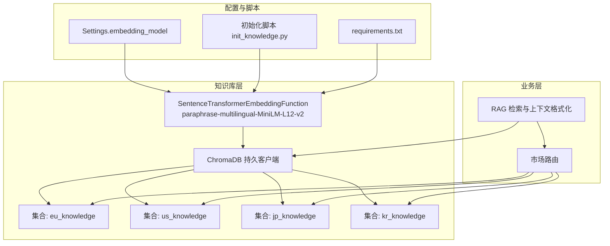
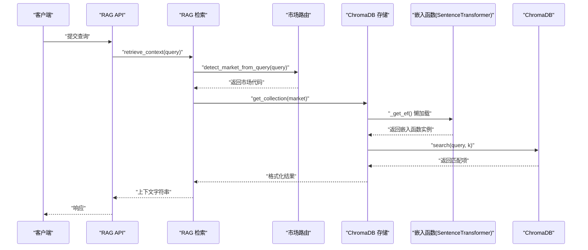
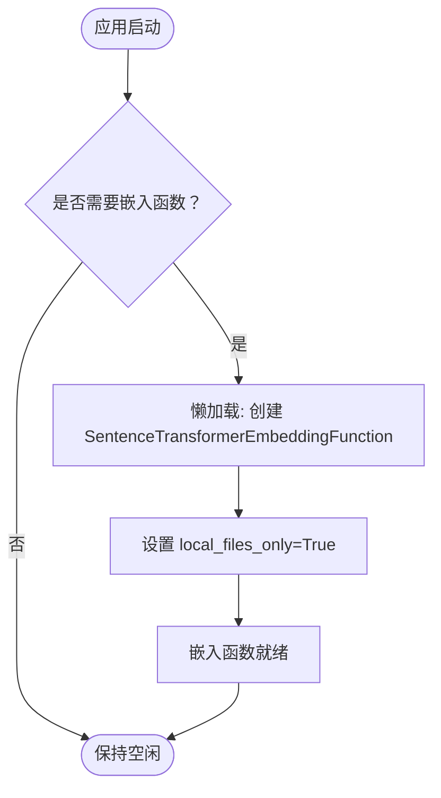
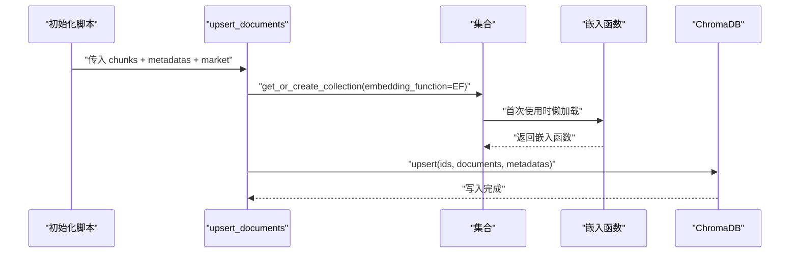
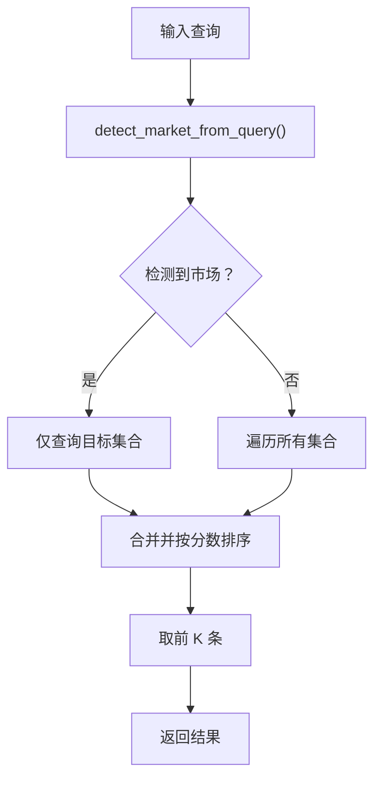
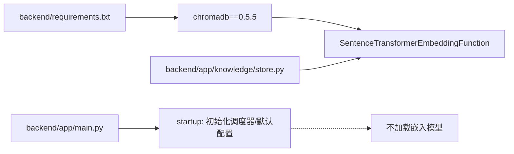

# 嵌入模型配置

<cite>
**本文引用的文件**
- [backend/app/knowledge/store.py](file://backend/app/knowledge/store.py)
- [backend/app/knowledge/embeddings.py](file://backend/app/knowledge/embeddings.py)
- [backend/app/knowledge/market_routing.py](file://backend/app/knowledge/market_routing.py)
- [backend/app/core/rag.py](file://backend/app/core/rag.py)
- [backend/app/config.py](file://backend/app/config.py)
- [backend/scripts/init_knowledge.py](file://backend/scripts/init_knowledge.py)
- [backend/requirements.txt](file://backend/requirements.txt)
- [backend/app/main.py](file://backend/app/main.py)
</cite>

## 目录
1. [简介](#简介)
2. [项目结构](#项目结构)
3. [核心组件](#核心组件)
4. [架构总览](#架构总览)
5. [详细组件分析](#详细组件分析)
6. [依赖关系分析](#依赖关系分析)
7. [性能考量](#性能考量)
8. [故障排除指南](#故障排除指南)
9. [结论](#结论)
10. [附录](#附录)

## 简介
本文件聚焦于嵌入模型的配置与使用，围绕“paraphrase-multilingual-MiniLM-L12-v2”多语言嵌入模型展开，系统阐述其在本项目中的选择依据、离线部署策略、懒加载机制、相似度计算方式、性能特征，并提供与云端 OpenAI 文档嵌入模型的对比与选型建议。同时，结合多语言合规查询场景，给出优化策略、最佳实践与故障排除指引。

## 项目结构
与嵌入模型相关的后端模块主要分布在以下位置：
- 向量存储与嵌入函数：backend/app/knowledge/store.py
- 多语言嵌入函数封装：backend/app/knowledge/embeddings.py
- 市场路由与集合管理：backend/app/knowledge/market_routing.py
- RAG 检索与上下文格式化：backend/app/core/rag.py
- 应用配置与默认嵌入模型：backend/app/config.py
- 知识库初始化脚本：backend/scripts/init_knowledge.py
- 依赖清单：backend/requirements.txt
- 应用入口与生命周期：backend/app/main.py

图表来源
- [backend/app/knowledge/store.py:1-227](file://backend/app/knowledge/store.py#L1-L227)
- [backend/app/knowledge/market_routing.py:1-77](file://backend/app/knowledge/market_routing.py#L1-L77)
- [backend/app/core/rag.py:1-59](file://backend/app/core/rag.py#L1-L59)
- [backend/app/config.py:29](file://backend/app/config.py#L29)
- [backend/scripts/init_knowledge.py:109-110](file://backend/scripts/init_knowledge.py#L109-L110)
- [backend/requirements.txt:7](file://backend/requirements.txt#L7)

章节来源
- [backend/app/knowledge/store.py:1-227](file://backend/app/knowledge/store.py#L1-L227)
- [backend/app/knowledge/market_routing.py:1-77](file://backend/app/knowledge/market_routing.py#L1-L77)
- [backend/app/core/rag.py:1-59](file://backend/app/core/rag.py#L1-L59)
- [backend/app/config.py:29](file://backend/app/config.py#L29)
- [backend/scripts/init_knowledge.py:109-110](file://backend/scripts/init_knowledge.py#L109-L110)
- [backend/requirements.txt:7](file://backend/requirements.txt#L7)

## 核心组件
- 多语言嵌入函数封装：封装了 SentenceTransformerEmbeddingFunction，采用本地离线模式，避免启动时网络下载。
- ChromaDB 向量存储：按市场划分集合，统一使用上述嵌入函数进行向量化。
- 市场路由：根据查询内容自动选择目标集合，提升检索准确性。
- RAG 管道：检索相关法规片段并格式化为提示上下文。
- 配置中心：集中管理嵌入模型名称等参数。

章节来源
- [backend/app/knowledge/store.py:23-40](file://backend/app/knowledge/store.py#L23-L40)
- [backend/app/knowledge/market_routing.py:48-76](file://backend/app/knowledge/market_routing.py#L48-L76)
- [backend/app/core/rag.py:10-58](file://backend/app/core/rag.py#L10-L58)
- [backend/app/config.py:29](file://backend/app/config.py#L29)

## 架构总览
下图展示了嵌入模型在系统中的角色与调用路径：应用启动时不加载模型，首次使用时才懒加载；查询时按市场路由选择集合，执行语义检索并格式化上下文。

图表来源
- [backend/app/core/rag.py:10-18](file://backend/app/core/rag.py#L10-L18)
- [backend/app/knowledge/market_routing.py:48-76](file://backend/app/knowledge/market_routing.py#L48-L76)
- [backend/app/knowledge/store.py:54-78](file://backend/app/knowledge/store.py#L54-L78)
- [backend/app/knowledge/store.py:127-158](file://backend/app/knowledge/store.py#L127-L158)

## 详细组件分析

### 组件一：SentenceTransformerEmbeddingFunction 配置与懒加载
- 模型名称：paraphrase-multilingual-MiniLM-L12-v2
- 本地离线模式：local_files_only=True，避免启动时访问 HuggingFace 网络，降低启动时延与失败风险
- 懒加载策略：首次使用时才创建嵌入函数实例，避免应用启动时的网络下载与模型加载开销
- 相似度空间：集合元数据中指定余弦距离空间，适合语义检索
- 中文支持：该模型为多语言模型，支持中文查询

图表来源
- [backend/app/knowledge/store.py:31-40](file://backend/app/knowledge/store.py#L31-L40)

章节来源
- [backend/app/knowledge/store.py:23-40](file://backend/app/knowledge/store.py#L23-L40)
- [backend/app/knowledge/store.py:54-78](file://backend/app/knowledge/store.py#L54-L78)

### 组件二：ChromaDB 向量存储与集合管理
- 按市场分集合：eu_knowledge、us_knowledge、jp_knowledge、kr_knowledge
- 集合元数据：指定余弦距离空间，提升相似度计算一致性
- 写入流程：文档分块后自动向量化并 upsert 到对应集合
- 查询流程：优先按检测到的市场查询；若无结果则全库聚合排序返回

图表来源
- [backend/scripts/init_knowledge.py:56-63](file://backend/scripts/init_knowledge.py#L56-L63)
- [backend/app/knowledge/store.py:81-104](file://backend/app/knowledge/store.py#L81-L104)
- [backend/app/knowledge/store.py:54-78](file://backend/app/knowledge/store.py#L54-L78)

章节来源
- [backend/scripts/init_knowledge.py:56-63](file://backend/scripts/init_knowledge.py#L56-L63)
- [backend/app/knowledge/store.py:81-104](file://backend/app/knowledge/store.py#L81-L104)
- [backend/app/knowledge/store.py:127-158](file://backend/app/knowledge/store.py#L127-L158)

### 组件三：市场路由与查询优化
- 市场路由：根据查询关键词自动判断目标市场，优先处理特定本地法关键词
- 查询降级：若按市场路由无结果，则遍历所有集合并合并排序，保证召回率
- 结果评分：将距离转换为相似度分数，便于前端展示与排序

图表来源
- [backend/app/knowledge/market_routing.py:48-76](file://backend/app/knowledge/market_routing.py#L48-L76)
- [backend/app/knowledge/store.py:127-158](file://backend/app/knowledge/store.py#L127-L158)

章节来源
- [backend/app/knowledge/market_routing.py:48-76](file://backend/app/knowledge/market_routing.py#L48-L76)
- [backend/app/knowledge/store.py:127-158](file://backend/app/knowledge/store.py#L127-L158)

### 组件四：RAG 管道与上下文格式化
- 检索：根据查询检索相关法规片段，返回文本、相似度、来源等信息
- 格式化：将检索结果格式化为带来源标注的上下文字符串，便于 LLM 使用

章节来源
- [backend/app/core/rag.py:10-58](file://backend/app/core/rag.py#L10-L58)

### 组件五：云端 OpenAI 文档嵌入（对比参考）
- 当前系统默认使用云端 OpenAI 文档嵌入模型，返回高维向量
- 与本地多语言模型对比要点：
  - 网络依赖：云端模型需要网络访问，本地模型可离线
  - 维度差异：云端模型通常更高维，本地模型维度较低
  - 中文支持：本地模型为多语言，云端模型也支持中文
  - 性能：本地模型启动更快、无需网络抖动影响

章节来源
- [backend/app/knowledge/embeddings.py:19-34](file://backend/app/knowledge/embeddings.py#L19-L34)
- [backend/app/config.py:29](file://backend/app/config.py#L29)

## 依赖关系分析
- ChromaDB 版本：0.5.5，提供本地持久化与嵌入函数集成
- SentenceTransformerEmbeddingFunction：来自 chromadb.utils.embedding_functions
- 懒加载依赖 logging：记录首次加载日志
- 应用入口：FastAPI 启动时仅初始化调度器与默认配置，不加载嵌入模型

图表来源
- [backend/requirements.txt:7](file://backend/requirements.txt#L7)
- [backend/app/knowledge/store.py:16](file://backend/app/knowledge/store.py#L16)
- [backend/app/main.py:60-69](file://backend/app/main.py#L60-L69)

章节来源
- [backend/requirements.txt:7](file://backend/requirements.txt#L7)
- [backend/app/knowledge/store.py:16](file://backend/app/knowledge/store.py#L16)
- [backend/app/main.py:60-69](file://backend/app/main.py#L60-L69)

## 性能考量
- 启动时延：通过懒加载避免首次启动时的网络下载与模型加载，显著降低冷启动时间
- 相似度计算：集合元数据指定余弦距离空间，相似度由距离转换而来，适合多语言语义检索
- 查询吞吐：按市场路由减少无效扫描，提高检索效率；全库兜底策略保证召回
- 维度与内存：本地多语言模型维度较低，适合大规模文档与多集合部署
- 云端对比：云端模型维度更高，但存在网络依赖与延迟不确定性

章节来源
- [backend/app/knowledge/store.py:31-40](file://backend/app/knowledge/store.py#L31-L40)
- [backend/app/knowledge/store.py:184](file://backend/app/knowledge/store.py#L184)
- [backend/app/knowledge/market_routing.py:48-76](file://backend/app/knowledge/market_routing.py#L48-L76)

## 故障排除指南
- 首次运行需网络下载模型
  - 现象：首次使用时日志显示加载模型，耗时较长
  - 解决：确保首次启动时具备网络访问权限，或提前离线准备模型文件
  - 参考：初始化脚本输出提示首次运行会自动下载模型
- 离线环境无法加载模型
  - 现象：local_files_only=True 时若本地无模型文件，将报错
  - 解决：在离线环境中预先准备好模型文件，或将设置调整为允许网络下载（不推荐）
- ChromaDB 不可用
  - 现象：查询异常或返回空结果
  - 解决：系统已降级为返回空结果，不影响主流程；检查持久化目录与磁盘空间
- 相似度异常
  - 现象：检索结果相关度不高
  - 解决：检查查询关键词是否包含目标市场特征词；必要时增加关键词或调整集合数量
- 健康检查
  - 现象：前端无法连接后端
  - 解决：调用健康检查端点确认服务状态

章节来源
- [backend/scripts/init_knowledge.py:109-110](file://backend/scripts/init_knowledge.py#L109-L110)
- [backend/app/knowledge/store.py:36-39](file://backend/app/knowledge/store.py#L36-L39)
- [backend/app/knowledge/store.py:171-173](file://backend/app/knowledge/store.py#L171-L173)
- [backend/app/knowledge/market_routing.py:48-76](file://backend/app/knowledge/market_routing.py#L48-L76)
- [backend/app/main.py:33-35](file://backend/app/main.py#L33-L35)

## 结论
本项目采用“paraphrase-multilingual-MiniLM-L12-v2”作为本地多语言嵌入模型，结合懒加载与按市场路由的检索策略，在保证中文查询支持的同时，显著降低了启动时延与网络依赖。对于需要更高精度或特定场景的用户，可考虑云端高维嵌入模型作为对比参考，但需权衡网络与延迟成本。建议在生产环境中优先使用本地模型，并配合合理的集合划分与关键词路由策略，以获得稳定且高效的合规查询体验。

## 附录

### 嵌入模型配置要点
- 模型名称：paraphrase-multilingual-MiniLM-L12-v2
- 离线模式：local_files_only=True
- 相似度空间：余弦距离
- 中文支持：多语言模型，支持中文查询
- 默认维度：本地模型维度较低，适合大规模部署

章节来源
- [backend/app/knowledge/store.py:23-40](file://backend/app/knowledge/store.py#L23-L40)
- [backend/app/knowledge/store.py:59-62](file://backend/app/knowledge/store.py#L59-L62)
- [backend/app/knowledge/store.py:184](file://backend/app/knowledge/store.py#L184)

### 不同嵌入模型对比与选型建议
- 本地多语言模型（本项目默认）
  - 优点：离线部署、启动快、中文支持好
  - 缺点：维度相对较低
  - 适用：多语言合规检索、大规模文档、离线环境
- 云端高维嵌入模型（对比参考）
  - 优点：维度高、语义表征强
  - 缺点：依赖网络、启动慢、存在延迟不确定性
  - 适用：对精度要求极高且可接受网络依赖的场景

章节来源
- [backend/app/knowledge/embeddings.py:19-34](file://backend/app/knowledge/embeddings.py#L19-L34)
- [backend/app/config.py:29](file://backend/app/config.py#L29)

### 最佳实践
- 首次运行前准备：确保具备网络访问权限以完成模型下载
- 离线部署：将模型文件置于本地，确保 local_files_only=True 生效
- 集合划分：按市场独立集合，提升检索准确度
- 查询优化：在问题中包含目标市场关键词，提高路由命中率
- 监控与告警：关注 ChromaDB 健康状态与磁盘空间

章节来源
- [backend/scripts/init_knowledge.py:109-110](file://backend/scripts/init_knowledge.py#L109-L110)
- [backend/app/knowledge/store.py:36-39](file://backend/app/knowledge/store.py#L36-L39)
- [backend/app/knowledge/market_routing.py:48-76](file://backend/app/knowledge/market_routing.py#L48-L76)
- [backend/app/main.py:33-35](file://backend/app/main.py#L33-L35)