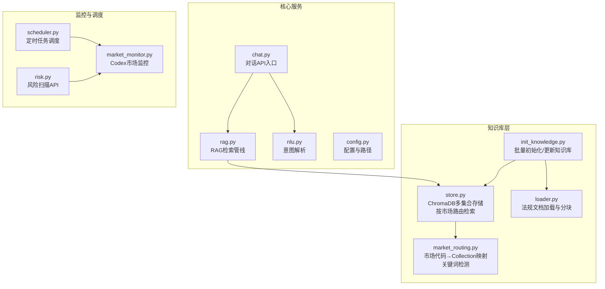
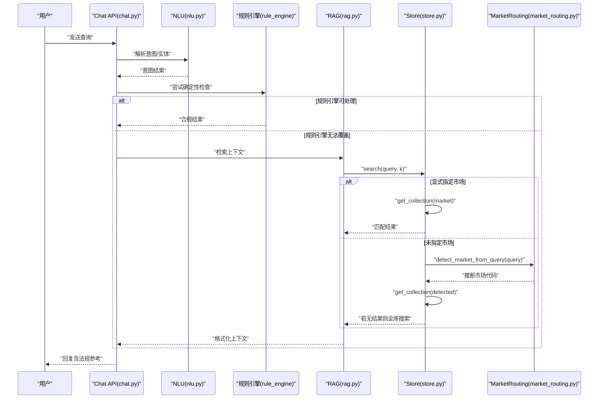
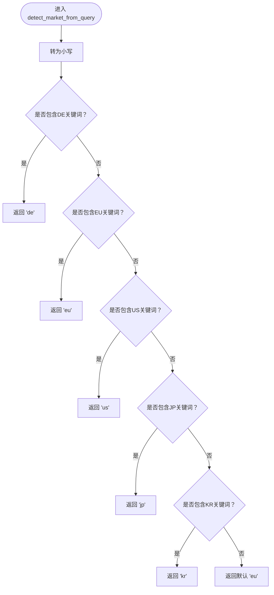
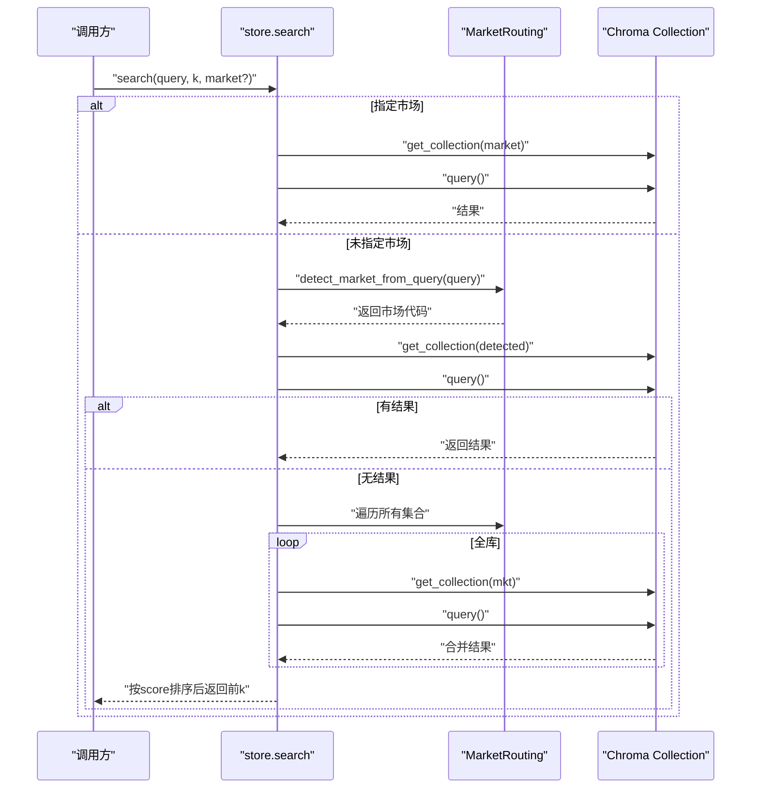
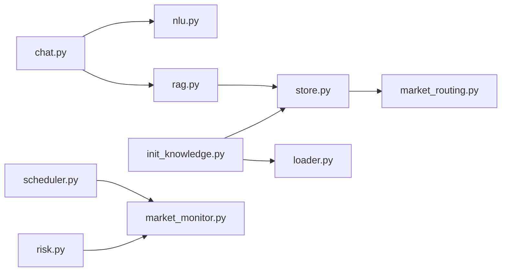

# 市场路由机制

<cite>
**本文引用的文件**
- [market_routing.py](file://backend/app/knowledge/market_routing.py)
- [store.py](file://backend/app/knowledge/store.py)
- [rag.py](file://backend/app/core/rag.py)
- [chat.py](file://backend/app/api/chat.py)
- [init_knowledge.py](file://backend/scripts/init_knowledge.py)
- [loader.py](file://backend/app/knowledge/loader.py)
- [config.py](file://backend/app/config.py)
- [nlu_fallback.yaml](file://backend/data/prompts/nlu_fallback.yaml)
- [market_monitor.py](file://backend/app/core/market_monitor.py)
- [scheduler.py](file://backend/app/core/scheduler.py)
- [nlu.py](file://backend/app/core/nlu.py)
- [risk.py](file://backend/app/api/risk.py)
</cite>

## 目录
1. [简介](#简介)
2. [项目结构](#项目结构)
3. [核心组件](#核心组件)
4. [架构概览](#架构概览)
5. [详细组件分析](#详细组件分析)
6. [依赖分析](#依赖分析)
7. [性能考虑](#性能考虑)
8. [故障排查指南](#故障排查指南)
9. [结论](#结论)
10. [附录](#附录)

## 简介
本文件系统性阐述多市场知识库的路由机制，重点覆盖以下方面：
- 市场代码与 collection 名称的映射关系（eu→eu_knowledge 等）
- 自动市场检测算法（关键词识别、查询分析与市场推断）
- 路由决策优先级与回退策略（单市场查询失败后的全库搜索）
- 市场路由在知识检索中的作用与性能影响
- 新市场的添加流程与路由配置方法
- 调试与监控方法
- 实际应用场景与优化建议

## 项目结构
围绕“市场路由”这一主题，相关代码主要分布在以下模块：
- 路由与检索：market_routing.py、store.py、rag.py
- 初始化与加载：init_knowledge.py、loader.py
- 配置与环境：config.py
- 对话与意图：chat.py、nlu.py、nlu_fallback.yaml
- 市场监控与调度：market_monitor.py、scheduler.py、risk.py

图表来源
- [market_routing.py:1-77](file://backend/app/knowledge/market_routing.py#L1-L77)
- [store.py:1-227](file://backend/app/knowledge/store.py#L1-L227)
- [rag.py:1-59](file://backend/app/core/rag.py#L1-L59)
- [chat.py:1-200](file://backend/app/api/chat.py#L1-L200)
- [init_knowledge.py:1-129](file://backend/scripts/init_knowledge.py#L1-L129)
- [loader.py:1-142](file://backend/app/knowledge/loader.py#L1-L142)
- [config.py:1-75](file://backend/app/config.py#L1-L75)
- [market_monitor.py:1-156](file://backend/app/core/market_monitor.py#L1-L156)
- [scheduler.py:1-125](file://backend/app/core/scheduler.py#L1-L125)
- [risk.py:70-98](file://backend/app/api/risk.py#L70-L98)

章节来源
- [market_routing.py:1-77](file://backend/app/knowledge/market_routing.py#L1-L77)
- [store.py:1-227](file://backend/app/knowledge/store.py#L1-L227)
- [rag.py:1-59](file://backend/app/core/rag.py#L1-L59)
- [chat.py:1-200](file://backend/app/api/chat.py#L1-L200)
- [init_knowledge.py:1-129](file://backend/scripts/init_knowledge.py#L1-L129)
- [loader.py:1-142](file://backend/app/knowledge/loader.py#L1-L142)
- [config.py:1-75](file://backend/app/config.py#L1-L75)
- [market_monitor.py:1-156](file://backend/app/core/market_monitor.py#L1-L156)
- [scheduler.py:1-125](file://backend/app/core/scheduler.py#L1-L125)
- [risk.py:70-98](file://backend/app/api/risk.py#L70-L98)

## 核心组件
- 市场路由映射与检测
  - MARKET_COLLECTIONS 将市场代码映射到 ChromaDB collection 名称
  - detect_market_from_query 基于关键词进行市场推断
- 向量存储与检索
  - store.search 支持显式市场或自动检测；失败时回退至全库搜索
  - get_collection 按需懒加载并缓存 collection
- RAG 管线
  - retrieve_context → format_context_for_llm → enrich_with_rag
- 初始化与加载
  - loader.load_regulations_dir 读取并分块法规文档
  - init_knowledge 批量写入 ChromaDB 并支持重置/预览

章节来源
- [market_routing.py:19-76](file://backend/app/knowledge/market_routing.py#L19-L76)
- [store.py:54-158](file://backend/app/knowledge/store.py#L54-L158)
- [rag.py:10-58](file://backend/app/core/rag.py#L10-L58)
- [loader.py:57-118](file://backend/app/knowledge/loader.py#L57-L118)
- [init_knowledge.py:28-67](file://backend/scripts/init_knowledge.py#L28-L67)

## 架构概览
市场路由贯穿“意图解析→规则引擎→RAG检索→格式化输出”的对话流程。当规则引擎无法覆盖时，RAG 通过 store.search 进行语义检索；若未显式指定市场，将基于查询内容自动推断市场代码，优先命中对应 collection；若该集合无结果，则回退到全库搜索，综合排序后返回最佳结果。

图表来源
- [chat.py:93-101](file://backend/app/api/chat.py#L93-L101)
- [nlu.py:59-99](file://backend/app/core/nlu.py#L59-L99)
- [rag.py:10-18](file://backend/app/core/rag.py#L10-L18)
- [store.py:127-158](file://backend/app/knowledge/store.py#L127-L158)
- [market_routing.py:48-76](file://backend/app/knowledge/market_routing.py#L48-L76)

## 详细组件分析

### 组件A：市场路由与检测
- 市场代码到 collection 的映射
  - eu → eu_knowledge
  - de → de_knowledge（德国本地法优先）
  - us → us_knowledge
  - jp → jp_knowledge
  - kr → kr_knowledge
  - 默认集合 eu_knowledge 用于兼容旧数据
- 自动检测算法
  - 关键词优先级：DE > EU > US > JP > KR
  - DE 关键词涵盖包装法、电子法、特定组织名称等
  - EU 关键词涵盖地缘政治与指令缩写
  - US 关键词涵盖标准与监管机构
  - JP/KR 关键词涵盖认证标识
  - 默认返回 eu，保证保守性
- 性能与稳定性
  - O(n) 关键词匹配，常数开销极小
  - 与 store.search 的懒加载配合，避免冷启动抖动

图表来源
- [market_routing.py:48-76](file://backend/app/knowledge/market_routing.py#L48-L76)

章节来源
- [market_routing.py:19-76](file://backend/app/knowledge/market_routing.py#L19-L76)

### 组件B：向量存储与检索
- Collection 管理
  - get_collection 按需懒加载，首次使用时初始化客户端与 embedding function
  - get_or_create_all_collections 确保所有市场集合存在
- 检索流程
  - 显式市场：直接定位集合并查询
  - 自动检测：先按推断市场查询，若无结果则遍历所有集合进行全库搜索
  - 结果合并与排序：按相似度分数降序，截取前 k
- 错误处理
  - ChromaDB 异常记录日志并返回空结果，不影响主流程
  - 空集合直接返回空结果
- 元数据保留
  - 返回字段包含 text、score、market、regulation_id、regulation_name、source_url、effective_date、tags 等

图表来源
- [store.py:127-158](file://backend/app/knowledge/store.py#L127-L158)
- [market_routing.py:48-76](file://backend/app/knowledge/market_routing.py#L48-L76)

章节来源
- [store.py:54-192](file://backend/app/knowledge/store.py#L54-L192)

### 组件C：RAG 管线
- retrieve_context
  - 若知识库为空则直接返回空列表
  - 否则调用 store.search 获取上下文
- format_context_for_llm
  - 将检索结果格式化为带来源链接与生效日期的引用文本
- enrich_with_rag
  - 完整的 RAG 增强流程：检索→格式化→返回上下文字符串

章节来源
- [rag.py:10-58](file://backend/app/core/rag.py#L10-L58)

### 组件D：初始化与加载
- loader.load_regulations_dir
  - 递归分块器将 Markdown 正文拆分为多个文本块
  - 提取 YAML frontmatter 并附加到每个块的元数据中
  - 支持按市场或全部市场扫描
- init_knowledge
  - 支持 --all-markets、--market、--reset、--dry-run、--fetch 等参数
  - 逐文档写入 ChromaDB，幂等 upsert
  - 输出统计信息与进度提示

章节来源
- [loader.py:57-118](file://backend/app/knowledge/loader.py#L57-L118)
- [init_knowledge.py:28-67](file://backend/scripts/init_knowledge.py#L28-L67)

### 组件E：对话与意图解析
- chat.py
  - _keyword_extract 提供无 LLM 时的关键词提取兜底
  - _parse_intent_safe 优先使用 NLU，失败回退关键词提取
- nlu.py
  - 通过渲染 nlu_fallback.yaml 或 Agent 配置中的 system prompt，解析用户输入为结构化意图
- nlu_fallback.yaml
  - 定义 NLU 的 system prompt 与字段约束，便于热加载与策略调整

章节来源
- [chat.py:58-101](file://backend/app/api/chat.py#L58-L101)
- [nlu.py:59-99](file://backend/app/core/nlu.py#L59-L99)
- [nlu_fallback.yaml:1-20](file://backend/data/prompts/nlu_fallback.yaml#L1-L20)

### 组件F：市场监控与调度
- market_monitor.py
  - 通过 Codex Agent 轮询市场，解析为标准化事件
  - analyze_impact 将事件与用户产品关联，生成影响分析
- scheduler.py
  - 定时任务：周期性轮询市场、收集指标
  - 可配置轮询间隔
- risk.py
  - API 触发市场扫描，推送 WebSocket 预警

章节来源
- [market_monitor.py:35-104](file://backend/app/core/market_monitor.py#L35-L104)
- [scheduler.py:24-54](file://backend/app/core/scheduler.py#L24-L54)
- [risk.py:70-98](file://backend/app/api/risk.py#L70-L98)

## 依赖分析
- 组件耦合
  - store.search 依赖 market_routing.detect_market_from_query 与 get_collection
  - rag.retrieve_context 依赖 store.search
  - chat.api 依赖 nlu.parse_intent 与 rule_engine.check_compliance，最终在规则引擎无法覆盖时调用 rag
- 外部依赖
  - ChromaDB 持久化客户端与 SentenceTransformer 嵌入函数
  - OpenAI 兼容接口（用于嵌入与 LLM）
- 潜在循环依赖
  - 未发现直接循环依赖；模块间通过函数调用解耦

图表来源
- [chat.py:17-25](file://backend/app/api/chat.py#L17-L25)
- [nlu.py:16-25](file://backend/app/core/nlu.py#L16-L25)
- [rag.py:7-8](file://backend/app/core/rag.py#L7-L8)
- [store.py:18-19](file://backend/app/knowledge/store.py#L18-L19)
- [market_routing.py:14-14](file://backend/app/knowledge/market_routing.py#L14-L14)
- [init_knowledge.py:23-25](file://backend/scripts/init_knowledge.py#L23-L25)
- [loader.py:17-17](file://backend/app/knowledge/loader.py#L17-L17)
- [scheduler.py:16-17](file://backend/app/core/scheduler.py#L16-L17)
- [market_monitor.py:19-19](file://backend/app/core/market_monitor.py#L19-L19)
- [risk.py:70-70](file://backend/app/api/risk.py#L70-L70)

章节来源
- [chat.py:17-25](file://backend/app/api/chat.py#L17-L25)
- [rag.py:7-8](file://backend/app/core/rag.py#L7-L8)
- [store.py:18-19](file://backend/app/knowledge/store.py#L18-L19)
- [market_routing.py:14-14](file://backend/app/knowledge/market_routing.py#L14-L14)
- [init_knowledge.py:23-25](file://backend/scripts/init_knowledge.py#L23-L25)
- [loader.py:17-17](file://backend/app/knowledge/loader.py#L17-L17)
- [scheduler.py:16-17](file://backend/app/core/scheduler.py#L16-L17)
- [market_monitor.py:19-19](file://backend/app/core/market_monitor.py#L19-L19)
- [risk.py:70-70](file://backend/app/api/risk.py#L70-L70)

## 性能考虑
- 检索性能
  - 单集合查询：O(log n) 检索（基于 HNSW cosine 距离），n 为集合内向量数
  - 全库回退：最多遍历 5 个集合，整体仍为 O(k log n)，k 为集合数量
- 冷启动与懒加载
  - 首次使用时才初始化 ChromaDB 客户端与嵌入函数，避免启动时阻塞
- 嵌入模型
  - 使用本地 SentenceTransformer 模型，避免网络依赖，但首次加载需下载模型
- 日志与降级
  - ChromaDB 异常仅记录警告并返回空结果，不阻塞主流程

[本节为通用性能讨论，不直接分析具体文件]

## 故障排查指南
- ChromaDB 查询异常
  - 现象：检索返回空结果且日志出现警告
  - 排查：确认 persist 目录权限、磁盘空间；检查 settings.chroma_persist_dir 配置
- 检索无结果
  - 现象：自动检测后无匹配结果
  - 排查：确认查询中是否包含关键词；检查 init_knowledge 是否已成功写入对应市场集合
- 初始化失败
  - 现象：init_knowledge 报告无文件或写入失败
  - 排查：确认 data/regulations/{market} 下存在 .md 文件；使用 --dry-run 预览分块；必要时 --reset 清空后重建
- NLU 解析失败
  - 现象：意图解析回退到关键词提取
  - 排查：检查 settings.active_llm_api_key 是否配置；查看 nlu_fallback.yaml 是否存在

章节来源
- [store.py:171-173](file://backend/app/knowledge/store.py#L171-L173)
- [init_knowledge.py:34-38](file://backend/scripts/init_knowledge.py#L34-L38)
- [config.py:39-40](file://backend/app/config.py#L39-L40)
- [nlu.py:96-98](file://backend/app/core/nlu.py#L96-L98)

## 结论
市场路由机制通过“关键词检测 + 多集合检索 + 全库回退”的组合，在保证准确性的同时兼顾了性能与稳定性。其设计遵循“规则引擎优先、RAG 作为兜底”的原则，既满足高频确定性场景，又能在模糊查询中提供高质量的知识辅助。配合定时监控与初始化脚本，系统实现了从数据采集到知识检索的闭环。

[本节为总结性内容，不直接分析具体文件]

## 附录

### 新市场添加流程与路由配置
- 添加步骤
  1) 在 data/regulations/{new_market} 下准备法规 Markdown 文件（含 YAML frontmatter）
  2) 在 market_routing.MARKET_COLLECTIONS 中新增映射
  3) 运行 init_knowledge --market {new_market} 完成初始化
  4) 如需全量更新，可使用 --reset 或 --all-markets
- 路由配置
  - detect_market_from_query 可扩展关键词列表，提升检测精度
  - 若新增本地法（如 DE），可优先匹配以提高准确性

章节来源
- [market_routing.py:19-25](file://backend/app/knowledge/market_routing.py#L19-L25)
- [market_routing.py:48-76](file://backend/app/knowledge/market_routing.py#L48-L76)
- [init_knowledge.py:94-101](file://backend/scripts/init_knowledge.py#L94-L101)

### 调试与监控方法
- 调试
  - 使用 --dry-run 预览分块与元数据
  - 通过日志级别观察 ChromaDB 初始化与查询过程
- 监控
  - 启用 scheduler 定时轮询市场事件
  - 通过 risk.py API 触发扫描并接收 WebSocket 推送
  - 使用 store.get_document_count 检查各集合文档数

章节来源
- [init_knowledge.py:84-87](file://backend/scripts/init_knowledge.py#L84-L87)
- [scheduler.py:24-54](file://backend/app/core/scheduler.py#L24-L54)
- [risk.py:70-98](file://backend/app/api/risk.py#L70-L98)
- [store.py:195-210](file://backend/app/knowledge/store.py#L195-L210)

### 实际应用场景与优化建议
- 场景
  - 出口合规咨询：自动识别目标市场并检索相应法规
  - 产品变更影响评估：结合市场监控事件与产品记忆进行影响分析
- 优化建议
  - 为高频关键词建立更细粒度的检测分支
  - 在 store.search 中增加缓存策略（如按 query hash 缓存最近结果）
  - 对嵌入模型进行批量化处理以减少调用次数

[本节为概念性内容，不直接分析具体文件]