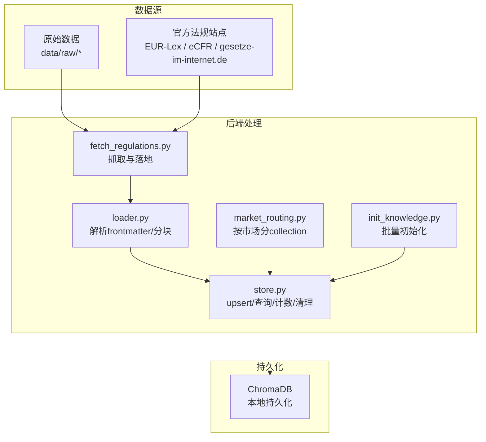
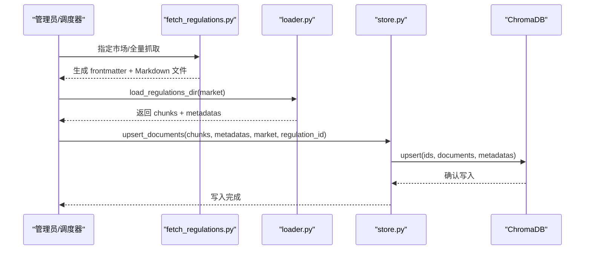
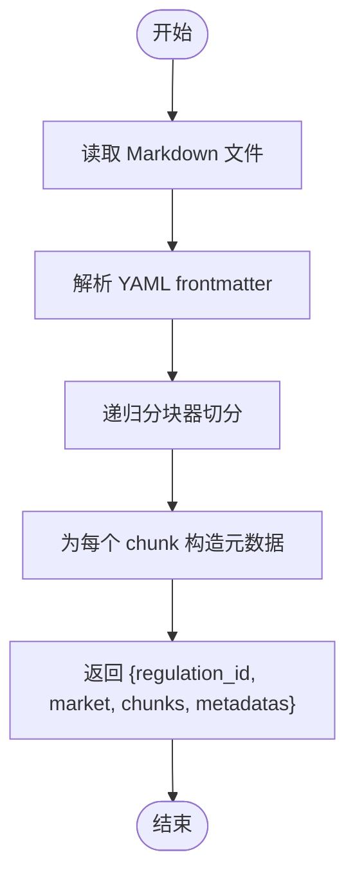
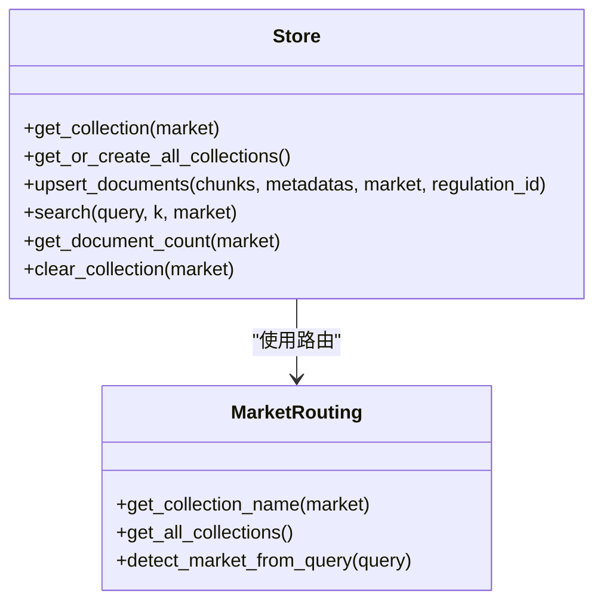
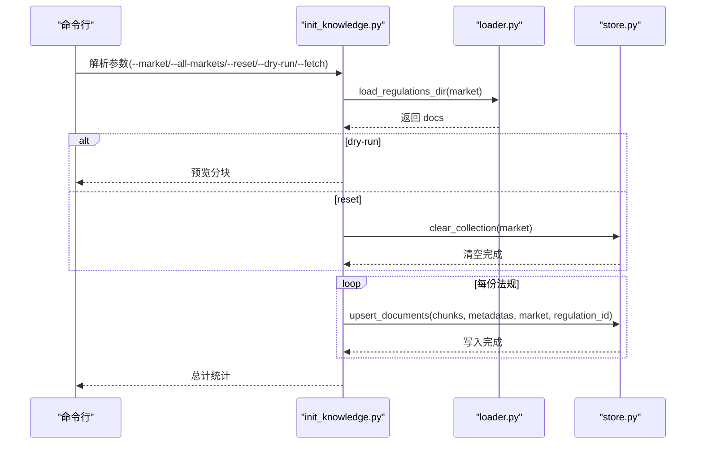
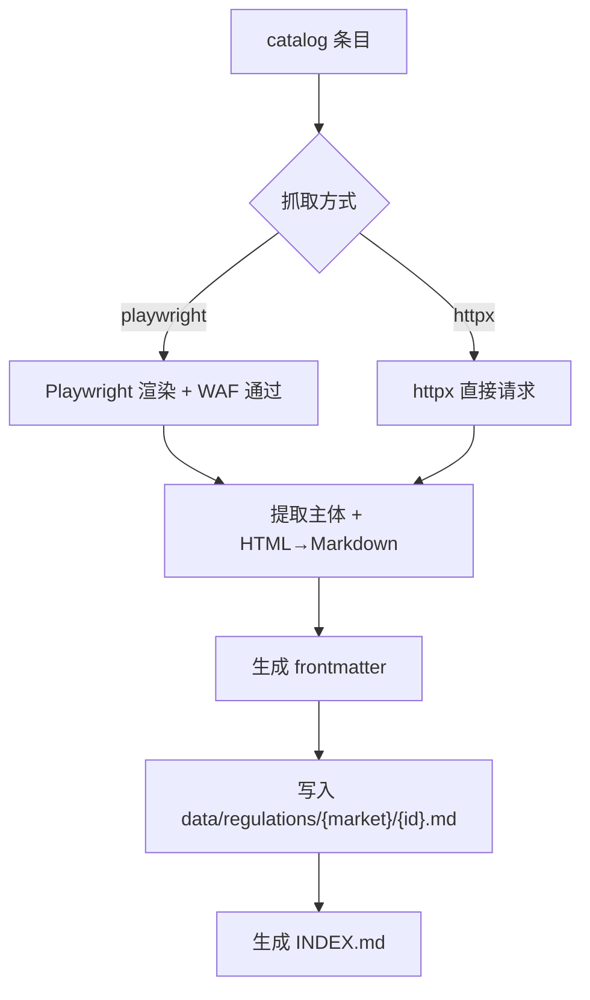
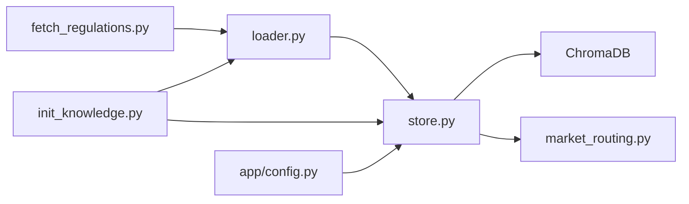

# 文档处理与索引

<cite>
**本文引用的文件**   
- [backend/app/knowledge/loader.py](file://backend/app/knowledge/loader.py)
- [backend/app/knowledge/store.py](file://backend/app/knowledge/store.py)
- [backend/app/knowledge/market_routing.py](file://backend/app/knowledge/market_routing.py)
- [backend/scripts/init_knowledge.py](file://backend/scripts/init_knowledge.py)
- [backend/scripts/fetch_regulations.py](file://backend/scripts/fetch_regulations.py)
- [backend/data/raw/regulations/eu/_all.md](file://backend/data/raw/regulations/eu/_all.md)
- [backend/data/raw/vat_rates/_all.json](file://backend/data/raw/vat_rates/_all.json)
- [backend/data/raw/certifications/cert_matrix.json](file://backend/data/raw/certifications/cert_matrix.json)
- [backend/app/config.py](file://backend/app/config.py)
- [backend/data/regulations.md](file://backend/data/regulations.md)
- [backend/data/vat_rates.json](file://backend/data/vat_rates.json)
</cite>

## 目录
1. [简介](#简介)
2. [项目结构](#项目结构)
3. [核心组件](#核心组件)
4. [架构总览](#架构总览)
5. [详细组件分析](#详细组件分析)
6. [依赖关系分析](#依赖关系分析)
7. [性能考量](#性能考量)
8. [故障排查指南](#故障排查指南)
9. [结论](#结论)
10. [附录](#附录)

## 简介
本文件面向“文档处理与索引”的实现与运维，系统性梳理法规文档的加载、预处理与分块策略，索引构建流程（向量化、ID生成、批量写入），以及不同法规类型的处理差异（法规文本、认证要求、VAT税率等结构化数据）。同时给出版本管理与增量更新策略、质量控制与错误处理机制、性能优化建议与批量处理最佳实践，并提供数据导入示例与常见问题解决方案。

## 项目结构
围绕知识库的文档处理与索引，后端主要涉及以下模块：
- 文档加载与分块：loader.py
- 向量数据库写入与查询：store.py
- 市场路由与集合隔离：market_routing.py
- 初始化与批量导入：scripts/init_knowledge.py
- 官方文档抓取：scripts/fetch_regulations.py
- 结构化数据样例：vat_rates.json、cert_matrix.json、_all.md
- 配置中心：app/config.py

图表来源
- [backend/scripts/fetch_regulations.py:1-434](file://backend/scripts/fetch_regulations.py#L1-L434)
- [backend/app/knowledge/loader.py:1-142](file://backend/app/knowledge/loader.py#L1-L142)
- [backend/app/knowledge/store.py:1-227](file://backend/app/knowledge/store.py#L1-L227)
- [backend/app/knowledge/market_routing.py:1-77](file://backend/app/knowledge/market_routing.py#L1-L77)
- [backend/scripts/init_knowledge.py:1-129](file://backend/scripts/init_knowledge.py#L1-L129)

章节来源
- [backend/app/knowledge/loader.py:1-142](file://backend/app/knowledge/loader.py#L1-L142)
- [backend/app/knowledge/store.py:1-227](file://backend/app/knowledge/store.py#L1-L227)
- [backend/app/knowledge/market_routing.py:1-77](file://backend/app/knowledge/market_routing.py#L1-L77)
- [backend/scripts/init_knowledge.py:1-129](file://backend/scripts/init_knowledge.py#L1-L129)
- [backend/scripts/fetch_regulations.py:1-434](file://backend/scripts/fetch_regulations.py#L1-L434)
- [backend/app/config.py:1-75](file://backend/app/config.py#L1-L75)

## 核心组件
- 文档加载与分块（loader.py）
  - 支持 YAML frontmatter 解析，提取 regulation_id、name、source_url、effective_date、tags 等元数据
  - 使用递归分块器按标题层级与段落进行分块，保留分隔符以保持上下文连贯
  - 输出结构化结果：regulation_id、market、chunks、metadatas
- 向量数据库写入与查询（store.py）
  - 按市场分 collection（eu_knowledge、de_knowledge、us_knowledge、jp_knowledge、kr_knowledge）
  - 使用 sentence-transformer 模型进行本地向量化，自动嵌入
  - upsert_documents 幂等写入，ID 采用 {regulation_id}_{chunk_index}，避免重复
  - search 支持按市场或自动路由到全库查询，透传元数据
- 市场路由（market_routing.py）
  - 将查询关键词映射到市场代码，实现按市场检索与集合隔离
- 初始化与批量导入（init_knowledge.py）
  - 读取 loader 的分块结果，逐法规批量 upsert，支持重置、干跑、全市场
- 官方文档抓取（fetch_regulations.py）
  - 统一 catalog 管理，按市场与抓取方式（httpx / playwright）下载并转换为 Markdown，生成 frontmatter
- 结构化数据样例
  - VAT 税率：vat_rates.json
  - 认证矩阵：cert_matrix.json
  - 示例法规：_all.md

章节来源
- [backend/app/knowledge/loader.py:20-118](file://backend/app/knowledge/loader.py#L20-L118)
- [backend/app/knowledge/store.py:54-125](file://backend/app/knowledge/store.py#L54-L125)
- [backend/app/knowledge/market_routing.py:19-76](file://backend/app/knowledge/market_routing.py#L19-L76)
- [backend/scripts/init_knowledge.py:28-67](file://backend/scripts/init_knowledge.py#L28-L67)
- [backend/scripts/fetch_regulations.py:40-186](file://backend/scripts/fetch_regulations.py#L40-L186)

## 架构总览
文档处理与索引的端到端流程如下：

图表来源
- [backend/scripts/fetch_regulations.py:325-356](file://backend/scripts/fetch_regulations.py#L325-L356)
- [backend/app/knowledge/loader.py:57-118](file://backend/app/knowledge/loader.py#L57-L118)
- [backend/app/knowledge/store.py:81-103](file://backend/app/knowledge/store.py#L81-L103)

## 详细组件分析

### 文档加载与分块（loader.py）
- 文本清洗与元数据提取
  - 使用正则解析 frontmatter，支持 key: "value" 简单格式，避免额外依赖
  - 从 frontmatter 中提取 regulation_id、name、source_url、effective_date、tags 等
- 分块策略
  - 递归字符分块器，优先按“二级/三级标题”“水平分割线”“段落换行”“单词”切分
  - chunk_size=600，chunk_overlap=100，兼顾语义完整性与检索精度
- 输出结构
  - 每份法规返回 regulation_id、market、chunks、metadatas（与 chunks 等长）
- 兼容接口
  - load_regulations_dir 支持按市场扫描，load_regulations 提供向后兼容的单文件分块接口

图表来源
- [backend/app/knowledge/loader.py:29-118](file://backend/app/knowledge/loader.py#L29-L118)

章节来源
- [backend/app/knowledge/loader.py:20-118](file://backend/app/knowledge/loader.py#L20-L118)

### 向量数据库写入与查询（store.py）
- 集合与路由
  - 按市场创建独立 collection，名称规则：{region}_knowledge
  - 默认集合兼容旧数据，detect_market_from_query 基于关键词路由
- 向量化与嵌入
  - 使用 sentence-transformer 模型（paraphrase-multilingual-MiniLM-L12-v2），本地离线加载
  - 懒加载 embedding function，首次使用时初始化，避免启动时下载
- 写入与幂等
  - upsert_documents 使用 {regulation_id}_{index} 作为 ID，保证重复执行不产生重复
  - 支持批量 upsert，自动触发向量化
- 查询与降级
  - search 支持指定市场或自动路由；若单集合查询无结果，则遍历全库并合并排序
  - ChromaDB 异常时返回空结果，不阻断主流程
- 辅助能力
  - get_document_count、clear_collection 支持统计与清理

图表来源
- [backend/app/knowledge/store.py:54-125](file://backend/app/knowledge/store.py#L54-L125)
- [backend/app/knowledge/market_routing.py:31-76](file://backend/app/knowledge/market_routing.py#L31-L76)

章节来源
- [backend/app/knowledge/store.py:43-227](file://backend/app/knowledge/store.py#L43-L227)
- [backend/app/knowledge/market_routing.py:19-76](file://backend/app/knowledge/market_routing.py#L19-L76)

### 初始化与批量导入（init_knowledge.py）
- 功能
  - 读取 loader 的分块结果，逐法规批量 upsert
  - 支持 --all-markets、--market、--reset、--dry-run、--fetch 等参数
- 流程
  - 可选先执行 fetch_regulations.py 下载官方文档
  - 对每个市场：统计 chunks 数量、可选干跑预览、可选清空后重建、批量写入、统计入库数量

图表来源
- [backend/scripts/init_knowledge.py:28-67](file://backend/scripts/init_knowledge.py#L28-L67)
- [backend/app/knowledge/loader.py:57-118](file://backend/app/knowledge/loader.py#L57-L118)
- [backend/app/knowledge/store.py:81-103](file://backend/app/knowledge/store.py#L81-L103)

章节来源
- [backend/scripts/init_knowledge.py:70-125](file://backend/scripts/init_knowledge.py#L70-L125)

### 官方文档抓取（fetch_regulations.py）
- catalog 管理
  - EU（Playwright）、DE（httpx）、US（httpx）等不同站点与抓取方式
  - 每条法规包含 id、name、market、url、effective_date、tags、note 等
- 抓取与转换
  - Playwright 绕过 EUR-Lex 的 AWS WAF 挑战
  - httpx 直接请求，统一转为 Markdown，去除导航/页眉/页脚
  - 生成 frontmatter，写入 data/regulations/{market}/{id}.md
- 增量与索引
  - 支持 --force、--dry-run、--list
  - 完成后生成 INDEX.md 索引文件

图表来源
- [backend/scripts/fetch_regulations.py:40-186](file://backend/scripts/fetch_regulations.py#L40-L186)
- [backend/scripts/fetch_regulations.py:325-356](file://backend/scripts/fetch_regulations.py#L325-L356)
- [backend/scripts/fetch_regulations.py:396-411](file://backend/scripts/fetch_regulations.py#L396-L411)

章节来源
- [backend/scripts/fetch_regulations.py:1-434](file://backend/scripts/fetch_regulations.py#L1-L434)

### 结构化数据处理差异
- 法规文本（Markdown + frontmatter）
  - frontmatter 提供 regulation_id、name、source_url、effective_date、tags 等
  - loader 将正文按层级与段落切分为 chunks，并将元数据附加到每个 chunk
- 认证要求（JSON）
  - cert_matrix.json：按国家/地区列出所需认证清单，便于合规检查与风险提示
- VAT 税率（JSON）
  - vat_rates.json：按国家提供标准/Reduced 税率与货币，便于报价与税务计算

章节来源
- [backend/app/knowledge/loader.py:29-52](file://backend/app/knowledge/loader.py#L29-L52)
- [backend/data/raw/certifications/cert_matrix.json:1-14](file://backend/data/raw/certifications/cert_matrix.json#L1-L14)
- [backend/data/raw/vat_rates/_all.json:1-13](file://backend/data/raw/vat_rates/_all.json#L1-L13)

## 依赖关系分析
- 组件耦合
  - init_knowledge.py 依赖 loader.py 与 store.py
  - store.py 依赖 market_routing.py 与配置 settings
  - fetch_regulations.py 产出数据供 loader 使用
- 外部依赖
  - ChromaDB（本地持久化）
  - sentence-transformers（本地向量化）
  - httpx / playwright（抓取）

图表来源
- [backend/scripts/init_knowledge.py:23-25](file://backend/scripts/init_knowledge.py#L23-L25)
- [backend/app/knowledge/store.py:18-19](file://backend/app/knowledge/store.py#L18-L19)
- [backend/app/config.py:39-43](file://backend/app/config.py#L39-L43)

章节来源
- [backend/scripts/init_knowledge.py:23-25](file://backend/scripts/init_knowledge.py#L23-L25)
- [backend/app/knowledge/store.py:18-19](file://backend/app/knowledge/store.py#L18-L19)
- [backend/app/config.py:39-43](file://backend/app/config.py#L39-L43)

## 性能考量
- 分块参数
  - chunk_size 与 overlap 需在召回与性能间权衡；较大块提升语义完整性，但向量维度与网络传输成本上升
- 向量化与嵌入
  - 使用本地 sentence-transformer，避免网络依赖；首次加载模型需注意磁盘与内存占用
- 批量写入
  - upsert_documents 逐法规批量写入，减少多次往返；建议控制单次写入规模，结合磁盘与内存压力评估
- 查询路由
  - detect_market_from_query 提升检索准确性；若无结果再回退全库，避免误判
- 抓取并发
  - httpx 客户端限制最大连接数，Playwright 浏览器复用实例，减少资源消耗

章节来源
- [backend/app/knowledge/loader.py:20-24](file://backend/app/knowledge/loader.py#L20-L24)
- [backend/app/knowledge/store.py:31-40](file://backend/app/knowledge/store.py#L31-L40)
- [backend/scripts/fetch_regulations.py:380-388](file://backend/scripts/fetch_regulations.py#L380-L388)

## 故障排查指南
- ChromaDB 查询异常
  - 现象：search 返回空结果或警告日志
  - 处理：确认 collection 是否存在且非空；检查 embedding function 初始化；必要时清空后重建
- 模型加载失败
  - 现象：首次启动时模型下载或校验失败
  - 处理：确保 local_files_only=True 的前提下，模型已缓存；检查网络代理与磁盘空间
- 抓取被 WAF 挑战
  - 现象：返回页面仍包含 challenge 或内容过短
  - 处理：确认使用 Playwright 并等待挑战完成；调整 UA 与重试策略
- 重复写入导致重复
  - 现象：ID 冲突或重复文档
  - 处理：使用 upsert_documents 的幂等 ID 规则；必要时先 clear_collection 再重建
- frontmatter 解析失败
  - 现象：regulation_id/name 等缺失
  - 处理：检查 frontmatter 格式；loader 仅支持 key: "value" 简单格式

章节来源
- [backend/app/knowledge/store.py:163-173](file://backend/app/knowledge/store.py#L163-L173)
- [backend/scripts/fetch_regulations.py:291-310](file://backend/scripts/fetch_regulations.py#L291-L310)
- [backend/app/knowledge/loader.py:29-52](file://backend/app/knowledge/loader.py#L29-L52)

## 结论
本系统通过“抓取→解析frontmatter→分块→向量化→upsert”的流水线，实现了法规知识的结构化入库与高效检索。按市场分 collection 的设计提升了检索准确性与维护便利性；本地向量化与懒加载降低了部署复杂度。配合结构化数据（VAT、认证矩阵）与初始化脚本，可快速完成知识库的构建与增量更新。

## 附录

### 版本管理与增量更新策略
- 版本标识
  - frontmatter 中的 effective_date 与 regulation_id 作为版本依据
- 增量更新
  - 使用 upsert_documents 的幂等 ID（{regulation_id}_{chunk_index}）避免重复
  - init_knowledge.py 支持 --reset 重置或 --dry-run 预览，保障可控更新
- 官方源变更
  - fetch_regulations.py 通过 catalog 管理，支持 --force 覆盖与 --list 列表核对

章节来源
- [backend/app/knowledge/loader.py:88-109](file://backend/app/knowledge/loader.py#L88-L109)
- [backend/app/knowledge/store.py:81-103](file://backend/app/knowledge/store.py#L81-L103)
- [backend/scripts/init_knowledge.py:70-125](file://backend/scripts/init_knowledge.py#L70-L125)
- [backend/scripts/fetch_regulations.py:359-392](file://backend/scripts/fetch_regulations.py#L359-L392)

### 数据导入示例与最佳实践
- 官方文档导入
  - 步骤：python scripts/fetch_regulations.py --market eu（或 --all-markets）→ python scripts/init_knowledge.py --market eu --reset
  - 建议：先 --dry-run 预览分块，再 --reset 清空后重建
- 结构化数据导入
  - VAT 税率：将 vat_rates.json 放入 data/raw/vat_rates/_all.json，结合业务逻辑在检索结果中拼装
  - 认证矩阵：将 cert_matrix.json 放入 data/raw/certifications/cert_matrix.json，用于风险提示与检查清单生成
- 最佳实践
  - 控制分块大小与重叠比例，平衡召回与性能
  - 使用本地 embedding，避免网络抖动影响
  - 定期清理无效/过期文档，保持索引新鲜度

章节来源
- [backend/scripts/fetch_regulations.py:359-392](file://backend/scripts/fetch_regulations.py#L359-L392)
- [backend/scripts/init_knowledge.py:70-125](file://backend/scripts/init_knowledge.py#L70-L125)
- [backend/data/raw/vat_rates/_all.json:1-13](file://backend/data/raw/vat_rates/_all.json#L1-L13)
- [backend/data/raw/certifications/cert_matrix.json:1-14](file://backend/data/raw/certifications/cert_matrix.json#L1-L14)