# 知识库系统

<cite>
**本文档引用的文件**
- [backend/app/knowledge/embeddings.py](file://backend/app/knowledge/embeddings.py)
- [backend/app/knowledge/loader.py](file://backend/app/knowledge/loader.py)
- [backend/app/knowledge/market_routing.py](file://backend/app/knowledge/market_routing.py)
- [backend/app/knowledge/store.py](file://backend/app/knowledge/store.py)
- [backend/app/core/rag.py](file://backend/app/core/rag.py)
- [backend/scripts/init_knowledge.py](file://backend/scripts/init_knowledge.py)
- [backend/scripts/fetch_regulations.py](file://backend/scripts/fetch_regulations.py)
- [backend/app/config.py](file://backend/app/config.py)
- [backend/data/raw/regulations/eu/_all.md](file://backend/data/raw/regulations/eu/_all.md)
- [backend/requirements.txt](file://backend/requirements.txt)
- [backend/app/api/chat.py](file://backend/app/api/chat.py)
- [backend/app/main.py](file://backend/app/main.py)
- [backend/docker-compose.yml](file://backend/docker-compose.yml)
- [backend/data/数据流转.md](file://backend/data/数据流转.md)
</cite>

## 目录
1. [简介](#简介)
2. [项目结构](#项目结构)
3. [核心组件](#核心组件)
4. [架构总览](#架构总览)
5. [详细组件分析](#详细组件分析)
6. [依赖分析](#依赖分析)
7. [性能考虑](#性能考虑)
8. [故障排查指南](#故障排查指南)
9. [结论](#结论)
10. [附录](#附录)

## 简介
本文件面向“知识库系统”的使用者与维护者，系统性阐述基于 ChromaDB 的向量知识库在多市场（EU/US/JP/KR）下的配置与使用，涵盖以下主题：
- 多市场 collection 管理与路由策略
- 向量化嵌入模型的选择与配置（text-embedding-3-small 与 paraphrase-multilingual-MiniLM-L12-v2）
- 文档加载与分块策略（含法规文本的预处理与索引构建）
- 市场路由机制（按目标市场选择相应知识库 collection）
- 知识库的维护与更新流程（数据导入、版本管理、性能优化）
- 知识检索算法实现细节与优化策略
- 知识库扩展与自定义指导原则
- 实际使用案例与最佳实践

## 项目结构
知识库系统位于后端子目录 backend/app/knowledge 与 scripts 目录中，配合后端 API、配置与容器编排共同构成完整的知识库生命周期管理。

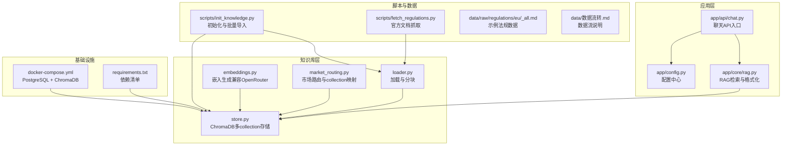

**图表来源**
- [backend/app/knowledge/loader.py:1-142](file://backend/app/knowledge/loader.py#L1-L142)
- [backend/app/knowledge/embeddings.py:1-35](file://backend/app/knowledge/embeddings.py#L1-L35)
- [backend/app/knowledge/store.py:1-227](file://backend/app/knowledge/store.py#L1-L227)
- [backend/app/knowledge/market_routing.py:1-77](file://backend/app/knowledge/market_routing.py#L1-L77)
- [backend/app/core/rag.py:1-59](file://backend/app/core/rag.py#L1-L59)
- [backend/app/api/chat.py:1-541](file://backend/app/api/chat.py#L1-L541)
- [backend/scripts/init_knowledge.py:1-129](file://backend/scripts/init_knowledge.py#L1-L129)
- [backend/scripts/fetch_regulations.py:1-434](file://backend/scripts/fetch_regulations.py#L1-L434)
- [backend/app/config.py:1-75](file://backend/app/config.py#L1-L75)
- [backend/docker-compose.yml:1-31](file://backend/docker-compose.yml#L1-L31)
- [backend/requirements.txt:1-27](file://backend/requirements.txt#L1-L27)
- [backend/data/数据流转.md:270-310](file://backend/data/数据流转.md#L270-L310)

**章节来源**
- [backend/app/knowledge/loader.py:1-142](file://backend/app/knowledge/loader.py#L1-L142)
- [backend/app/knowledge/store.py:1-227](file://backend/app/knowledge/store.py#L1-L227)
- [backend/app/knowledge/market_routing.py:1-77](file://backend/app/knowledge/market_routing.py#L1-L77)
- [backend/app/core/rag.py:1-59](file://backend/app/core/rag.py#L1-L59)
- [backend/app/api/chat.py:1-541](file://backend/app/api/chat.py#L1-L541)
- [backend/scripts/init_knowledge.py:1-129](file://backend/scripts/init_knowledge.py#L1-L129)
- [backend/scripts/fetch_regulations.py:1-434](file://backend/scripts/fetch_regulations.py#L1-L434)
- [backend/app/config.py:1-75](file://backend/app/config.py#L1-L75)
- [backend/docker-compose.yml:1-31](file://backend/docker-compose.yml#L1-L31)
- [backend/requirements.txt:1-27](file://backend/requirements.txt#L1-L27)
- [backend/data/数据流转.md:270-310](file://backend/data/数据流转.md#L270-L310)

## 核心组件
- 文档加载与分块（loader.py）
  - 支持从 data/regulations/{market}/*.md 递归扫描加载
  - 使用递归字符分块器，保留标题层级与段落边界
  - 提取 YAML frontmatter 作为元数据，随每个 chunk 一起写入向量库
- 向量化嵌入（embeddings.py）
  - 通过 OpenRouter 兼容 API 使用 text-embedding-3-small
  - 也可结合本地 SentenceTransformer 模型进行离线嵌入（见 store.py）
- 多市场 collection 存储（store.py）
  - 按市场拆分 collection：eu_knowledge / us_knowledge / jp_knowledge / kr_knowledge
  - 默认回退到 eu_knowledge，兼容旧数据
  - 支持 upsert 写入、查询、统计与清理
- 市场路由（market_routing.py）
  - 提供 market → collection 名称映射
  - 提供查询关键词检测，自动推断目标市场
- RAG 检索与格式化（core/rag.py）
  - 从向量库检索相关 chunk
  - 将检索结果格式化为带来源引用的上下文字符串
- 初始化与更新（scripts/init_knowledge.py）
  - 批量导入指定市场的法规数据
  - 支持重置、干跑预览、先抓取后导入
- 官方文档抓取（scripts/fetch_regulations.py）
  - 按目录清单抓取 EUR-Lex、德国防务网站、美国 eCFR 等
  - 自动转换为 Markdown 并写入 frontmatter 元数据
- 配置中心（app/config.py）
  - 统一管理 ChromaDB 持久化目录、嵌入模型、LLM API 等
- API 入口（app/api/chat.py）
  - 聊天 API 将 RAG 结果注入最终报告
- 容器编排（docker-compose.yml）
  - 提供 PostgreSQL 与 ChromaDB 的本地运行环境

**章节来源**
- [backend/app/knowledge/loader.py:1-142](file://backend/app/knowledge/loader.py#L1-L142)
- [backend/app/knowledge/embeddings.py:1-35](file://backend/app/knowledge/embeddings.py#L1-L35)
- [backend/app/knowledge/store.py:1-227](file://backend/app/knowledge/store.py#L1-L227)
- [backend/app/knowledge/market_routing.py:1-77](file://backend/app/knowledge/market_routing.py#L1-L77)
- [backend/app/core/rag.py:1-59](file://backend/app/core/rag.py#L1-L59)
- [backend/scripts/init_knowledge.py:1-129](file://backend/scripts/init_knowledge.py#L1-L129)
- [backend/scripts/fetch_regulations.py:1-434](file://backend/scripts/fetch_regulations.py#L1-L434)
- [backend/app/config.py:1-75](file://backend/app/config.py#L1-L75)
- [backend/app/api/chat.py:1-541](file://backend/app/api/chat.py#L1-L541)
- [backend/docker-compose.yml:1-31](file://backend/docker-compose.yml#L1-L31)

## 架构总览
知识库系统采用“数据采集 → 文档加载与分块 → 向量化嵌入 → 多市场collection存储 → 检索与格式化”的闭环流程。API 层在聊天接口中串联规则引擎与 RAG，实现“确定性规则优先、不确定性时借助知识库”的混合合规决策。

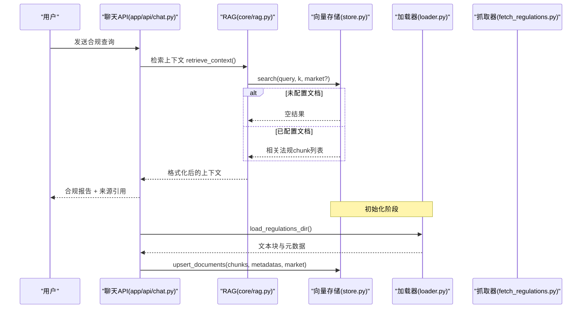

**图表来源**
- [backend/app/api/chat.py:228-376](file://backend/app/api/chat.py#L228-L376)
- [backend/app/core/rag.py:10-18](file://backend/app/core/rag.py#L10-L18)
- [backend/app/knowledge/store.py:127-158](file://backend/app/knowledge/store.py#L127-L158)
- [backend/app/knowledge/loader.py:57-118](file://backend/app/knowledge/loader.py#L57-L118)
- [backend/scripts/fetch_regulations.py:325-356](file://backend/scripts/fetch_regulations.py#L325-L356)

## 详细组件分析

### 文档加载与分块策略（loader.py）
- 目录扫描与市场限定
  - 支持按市场目录扫描，或全量扫描
  - 若指定市场且目录不存在，返回空结果
- Frontmatter 解析
  - 从 YAML frontmatter 提取 regulation_id、name、source_url、effective_date、tags 等
  - 仅解析简单键值对，避免额外依赖
- 分块策略
  - 使用递归字符分块器，优先按标题层级、分隔线与段落分隔
  - chunk_size=600，chunk_overlap=100，兼顾语义完整性与检索精度
- 输出结构
  - 返回每个法规的 chunks 与其等长的 metadatas，便于后续写入向量库并溯源

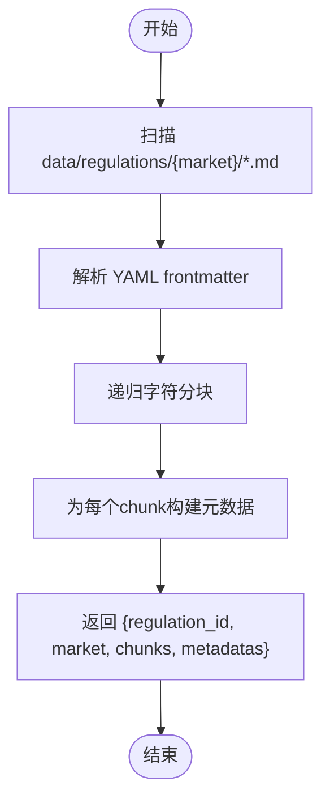

**图表来源**
- [backend/app/knowledge/loader.py:57-118](file://backend/app/knowledge/loader.py#L57-L118)

**章节来源**
- [backend/app/knowledge/loader.py:1-142](file://backend/app/knowledge/loader.py#L1-L142)
- [backend/data/raw/regulations/eu/_all.md:1-111](file://backend/data/raw/regulations/eu/_all.md#L1-L111)

### 向量化嵌入模型选择与配置
- OpenRouter 兼容 API（embeddings.py）
  - 使用 settings.embedding_model（默认 text-embedding-3-small）
  - 适合云端 API 场景，便于统一管理密钥与成本
- 本地 SentenceTransformer（store.py）
  - 使用 paraphrase-multilingual-MiniLM-L12-v2，支持中文查询
  - 首次使用懒加载，local_files_only=True，避免网络下载
  - ChromaDB 自动为每个文档生成向量，无需外部调用

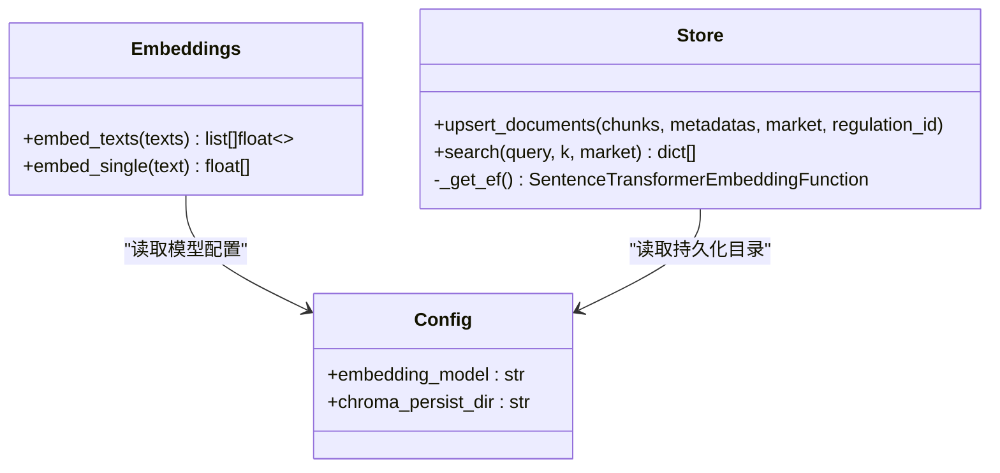

**图表来源**
- [backend/app/knowledge/embeddings.py:19-34](file://backend/app/knowledge/embeddings.py#L19-L34)
- [backend/app/knowledge/store.py:31-40](file://backend/app/knowledge/store.py#L31-L40)
- [backend/app/config.py:29-40](file://backend/app/config.py#L29-L40)

**章节来源**
- [backend/app/knowledge/embeddings.py:1-35](file://backend/app/knowledge/embeddings.py#L1-L35)
- [backend/app/knowledge/store.py:23-40](file://backend/app/knowledge/store.py#L23-L40)
- [backend/app/config.py:29-40](file://backend/app/config.py#L29-L40)

### 多市场 collection 管理与路由（market_routing.py）
- Collection 映射
  - eu → eu_knowledge
  - de → de_knowledge（德国本地法优先）
  - us → us_knowledge
  - jp → jp_knowledge
  - kr → kr_knowledge
  - 默认回退 eu_knowledge
- 市场检测
  - 从查询文本中提取关键词，自动判断目标市场
  - 优先识别德国本地法关键词，其次 EU、US、JP、KR
- 全量 collection 确保
  - 提供 get_all_collections 与 get_or_create_all_collections，保证多市场集合存在

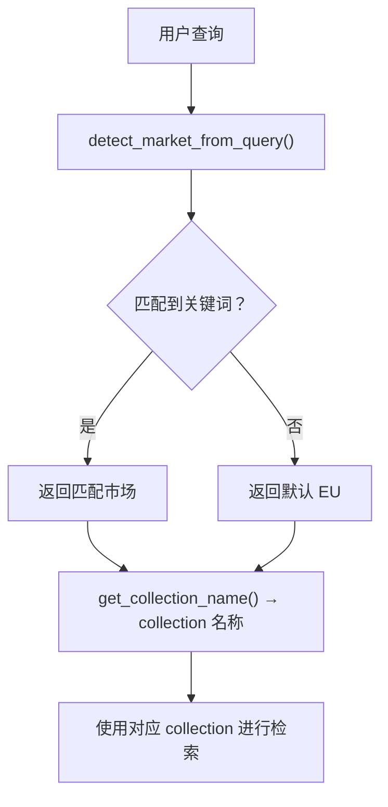

**图表来源**
- [backend/app/knowledge/market_routing.py:48-76](file://backend/app/knowledge/market_routing.py#L48-L76)
- [backend/app/knowledge/market_routing.py:31-45](file://backend/app/knowledge/market_routing.py#L31-L45)

**章节来源**
- [backend/app/knowledge/market_routing.py:1-77](file://backend/app/knowledge/market_routing.py#L1-L77)

### ChromaDB 向量存储（store.py）
- 多 collection 设计
  - 按市场创建独立 collection，实现租户/市场隔离
  - metadata 中设置 HNSW 搜索空间为 cosine
- 写入与幂等
  - upsert_documents 使用 {regulation_id}_{chunk_index} 作为 ID，重复导入不产生重复
  - 自动嵌入由 ChromaDB 的 SentenceTransformer 生成
- 查询与降级
  - search 支持显式 market 或自动推断
  - 若推断无结果，遍历全库并按分数排序返回
  - 查询异常时记录警告并返回空结果，不阻塞主流程
- 统计与清理
  - get_document_count 支持按市场或全库统计
  - clear_collection 支持按市场或全库清理

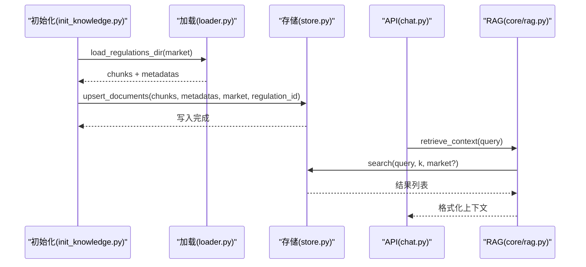

**图表来源**
- [backend/scripts/init_knowledge.py:28-67](file://backend/scripts/init_knowledge.py#L28-L67)
- [backend/app/knowledge/loader.py:57-118](file://backend/app/knowledge/loader.py#L57-L118)
- [backend/app/knowledge/store.py:81-104](file://backend/app/knowledge/store.py#L81-L104)
- [backend/app/core/rag.py:10-18](file://backend/app/core/rag.py#L10-L18)

**章节来源**
- [backend/app/knowledge/store.py:1-227](file://backend/app/knowledge/store.py#L1-L227)

### RAG 检索与格式化（core/rag.py）
- 检索
  - retrieve_context 仅在知识库存在文档时执行检索
  - search 由 store.search 提供，支持自动市场路由与全库兜底
- 上下文格式化
  - format_context_for_llm 将检索结果格式化为带来源、生效日期与文本的上下文块
  - 若无匹配，返回提示语句
- 集成
  - enrich_with_rag 将检索与格式化封装为一次性调用

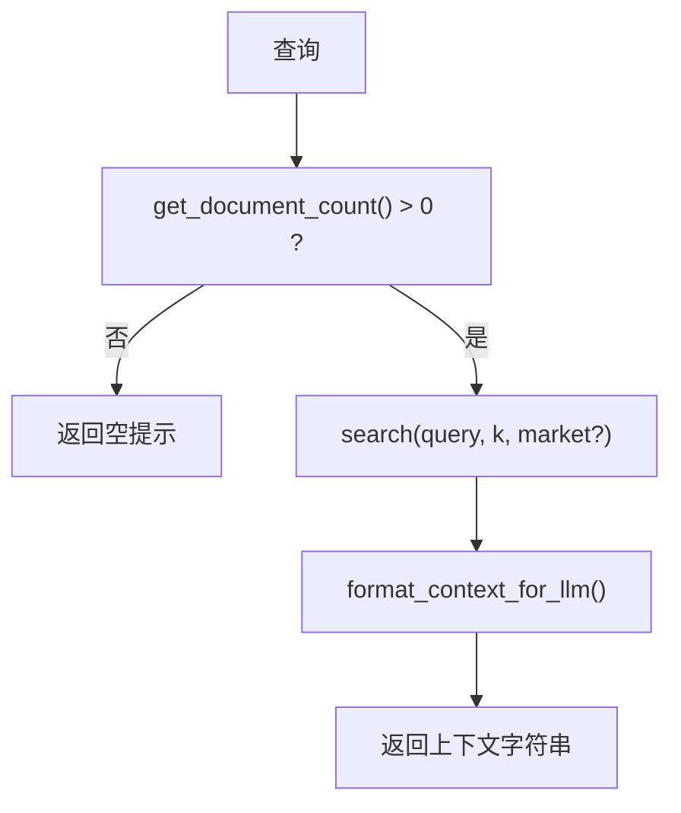

**图表来源**
- [backend/app/core/rag.py:10-18](file://backend/app/core/rag.py#L10-L18)
- [backend/app/core/rag.py:21-52](file://backend/app/core/rag.py#L21-L52)
- [backend/app/knowledge/store.py:127-158](file://backend/app/knowledge/store.py#L127-L158)

**章节来源**
- [backend/app/core/rag.py:1-59](file://backend/app/core/rag.py#L1-L59)
- [backend/app/knowledge/store.py:127-192](file://backend/app/knowledge/store.py#L127-L192)

### 知识库初始化与更新（scripts/init_knowledge.py）
- 功能
  - 支持指定市场或全量初始化
  - 支持重置后重建、干跑预览、先抓取后导入
  - 批量写入并统计入库数量
- 流程
  - 解析命令行参数 → 加载文档 → upsert 写入 → 统计总数

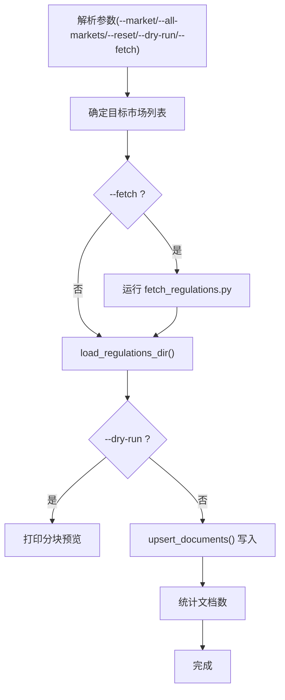

**图表来源**
- [backend/scripts/init_knowledge.py:70-124](file://backend/scripts/init_knowledge.py#L70-L124)

**章节来源**
- [backend/scripts/init_knowledge.py:1-129](file://backend/scripts/init_knowledge.py#L1-L129)

### 官方文档抓取（scripts/fetch_regulations.py）
- 目录与来源
  - 欧盟：EUR-Lex（Playwright 无头浏览器绕过 WAF）
  - 德国：gesetze-im-internet.de（httpx）
  - 美国：eCFR（httpx）
- 抓取流程
  - 逐条下载 → HTML 提取主体 → 转换为 Markdown → 写入 frontmatter 元数据
  - 支持强制覆盖、干跑预览、生成索引文件

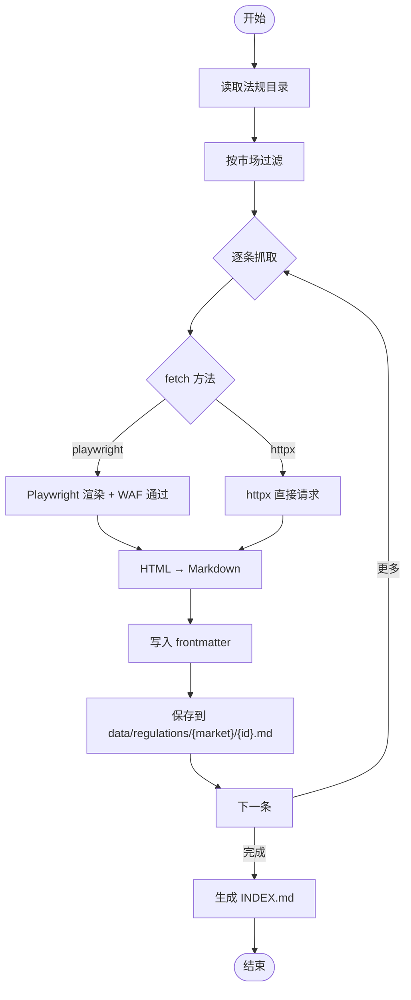

**图表来源**
- [backend/scripts/fetch_regulations.py:39-186](file://backend/scripts/fetch_regulations.py#L39-L186)
- [backend/scripts/fetch_regulations.py:325-356](file://backend/scripts/fetch_regulations.py#L325-L356)
- [backend/scripts/fetch_regulations.py:396-411](file://backend/scripts/fetch_regulations.py#L396-L411)

**章节来源**
- [backend/scripts/fetch_regulations.py:1-434](file://backend/scripts/fetch_regulations.py#L1-L434)

### API 集成与聊天流程（app/api/chat.py）
- 主流程
  - Codex Agent 优先路径：技能 + MCP 工具 + 联网搜索
  - 降级路径：NLU → 规则引擎 → RAG
- RAG 集成
  - retrieve_context 与 format_context_for_llm 组合，将检索结果注入最终报告
  - 会话存储与项目记忆持久化，便于回溯与复用

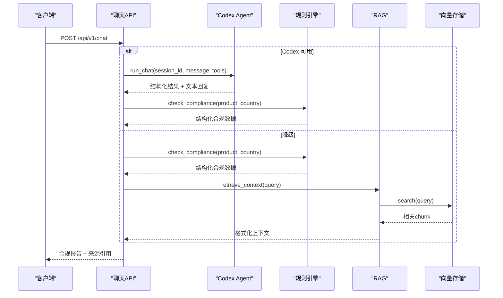

**图表来源**
- [backend/app/api/chat.py:228-376](file://backend/app/api/chat.py#L228-L376)
- [backend/app/api/chat.py:415-540](file://backend/app/api/chat.py#L415-L540)
- [backend/app/core/rag.py:10-18](file://backend/app/core/rag.py#L10-L18)
- [backend/app/knowledge/store.py:127-158](file://backend/app/knowledge/store.py#L127-L158)

**章节来源**
- [backend/app/api/chat.py:1-541](file://backend/app/api/chat.py#L1-L541)
- [backend/app/core/rag.py:1-59](file://backend/app/core/rag.py#L1-L59)

## 依赖分析
- 第三方依赖
  - chromadb、langchain、openai、httpx、playwright 等
  - ChromaDB 本地持久化，SentenceTransformer 本地嵌入
- 配置耦合
  - settings.embedding_model 控制云端嵌入模型
  - settings.chroma_persist_dir 控制 ChromaDB 持久化路径
- 运行环境
  - docker-compose 提供 PostgreSQL 与 ChromaDB 容器
  - requirements.txt 明确版本约束

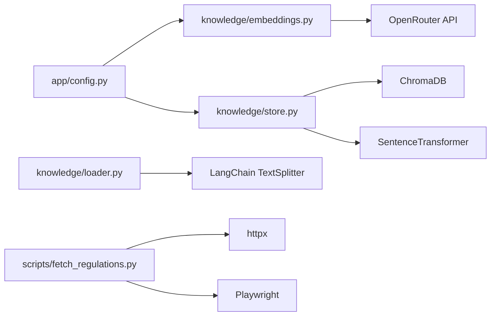

**图表来源**
- [backend/app/config.py:29-40](file://backend/app/config.py#L29-L40)
- [backend/app/knowledge/embeddings.py:3-16](file://backend/app/knowledge/embeddings.py#L3-L16)
- [backend/app/knowledge/store.py:14-16](file://backend/app/knowledge/store.py#L14-L16)
- [backend/scripts/fetch_regulations.py:24-26](file://backend/scripts/fetch_regulations.py#L24-L26)
- [backend/requirements.txt:7-10](file://backend/requirements.txt#L7-L10)

**章节来源**
- [backend/requirements.txt:1-27](file://backend/requirements.txt#L1-L27)
- [backend/app/config.py:1-75](file://backend/app/config.py#L1-L75)
- [backend/app/knowledge/store.py:1-227](file://backend/app/knowledge/store.py#L1-L227)
- [backend/app/knowledge/embeddings.py:1-35](file://backend/app/knowledge/embeddings.py#L1-L35)
- [backend/scripts/fetch_regulations.py:1-434](file://backend/scripts/fetch_regulations.py#L1-L434)

## 性能考虑
- 分块参数
  - chunk_size=600，chunk_overlap=100，在语义完整性与检索效率间取得平衡
- 搜索空间
  - HNSW cosine 空间提升相似度计算效率
- 懒加载
  - SentenceTransformer 模型与 ChromaDB 客户端懒加载，减少启动时资源占用
- 查询降级
  - 自动推断失败时遍历全库并排序，保证召回但需注意性能
- 建议
  - 在高并发场景下，可考虑增加 ChromaDB 实例或使用远程向量服务
  - 对超大文档分块时，适当增大 chunk_size 并减少 overlap 以降低向量维度

[本节为通用性能讨论，不直接分析具体文件]

## 故障排查指南
- ChromaDB 查询异常
  - 现象：日志出现警告并返回空结果
  - 处理：检查持久化目录权限、磁盘空间与集合状态
- 无文档可检索
  - 现象：retrieve_context 返回空
  - 处理：确认 init_knowledge 已执行并写入数据；检查 market 参数与 frontmatter
- 嵌入模型加载失败
  - 现象：SentenceTransformer 首次加载卡住或失败
  - 处理：确保 local_files_only=True，离线可用；检查网络代理与磁盘空间
- Playwright 下载失败
  - 现象：EUR-Lex 页面仍被 WAF 挑战
  - 处理：确认浏览器实例正常启动；适当增加等待时间或更换网络环境
- API 返回空上下文
  - 现象：聊天接口未显示法规来源
  - 处理：确认知识库已初始化；检查 frontmatter 是否包含 source_url 与 regulation_name

**章节来源**
- [backend/app/knowledge/store.py:163-173](file://backend/app/knowledge/store.py#L163-L173)
- [backend/app/knowledge/store.py:195-210](file://backend/app/knowledge/store.py#L195-L210)
- [backend/scripts/fetch_regulations.py:291-310](file://backend/scripts/fetch_regulations.py#L291-L310)
- [backend/app/api/chat.py:349-355](file://backend/app/api/chat.py#L349-L355)

## 结论
本知识库系统通过“多市场 collection + 本地嵌入 + 自动路由 + RAG 检索”的组合，实现了跨区域合规知识的高效组织与检索。系统具备良好的扩展性与可维护性，既支持云端嵌入 API，也支持本地离线部署；既支持自动市场路由，也支持手动指定市场。通过脚本化的初始化与更新流程，能够稳定地维护知识库数据，满足跨境合规业务的持续演进需求。

[本节为总结性内容，不直接分析具体文件]

## 附录

### 使用案例与最佳实践
- 初始化 EU 市场知识库
  - 步骤：运行初始化脚本，默认 EU；或指定 --all-markets 全量初始化
  - 建议：首次运行会自动下载本地嵌入模型，耗时约 120MB
- 先抓取后导入
  - 步骤：添加 --fetch 参数，先下载官方法规，再执行初始化
  - 适用：需要最新法规或网络受限环境
- 指定市场导入
  - 步骤：--market eu us 指定多个市场；--reset 清空后重建
- 干跑预览
  - 步骤：--dry-run 预览分块数量与首块内容，不写入数据库
- API 集成
  - 步骤：调用 /api/v1/chat，系统自动选择 Codex 或降级路径；RAG 结果将作为上下文注入报告

**章节来源**
- [backend/scripts/init_knowledge.py:8-16](file://backend/scripts/init_knowledge.py#L8-L16)
- [backend/app/api/chat.py:228-264](file://backend/app/api/chat.py#L228-L264)

### 数据流与生命周期
- 完整数据流
  - 用户输入 → NLU/规则引擎/RAG → 结构化报告 + 来源引用
- 更新事件流
  - 定时器或 Webhook 触发 → 外部数据源 → 知识库增量更新 → 事件记录

**章节来源**
- [backend/data/数据流转.md:270-310](file://backend/data/数据流转.md#L270-L310)