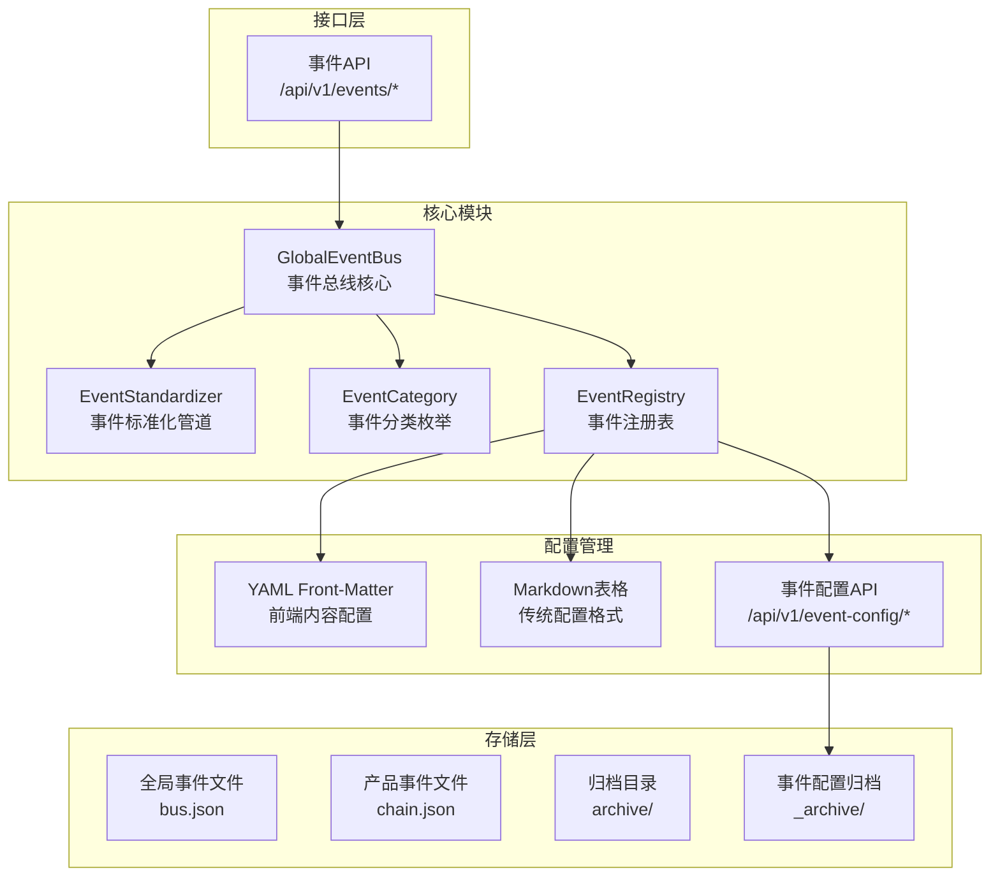
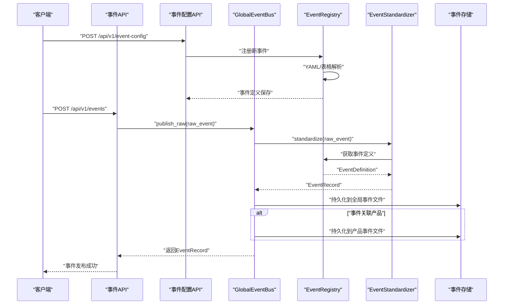
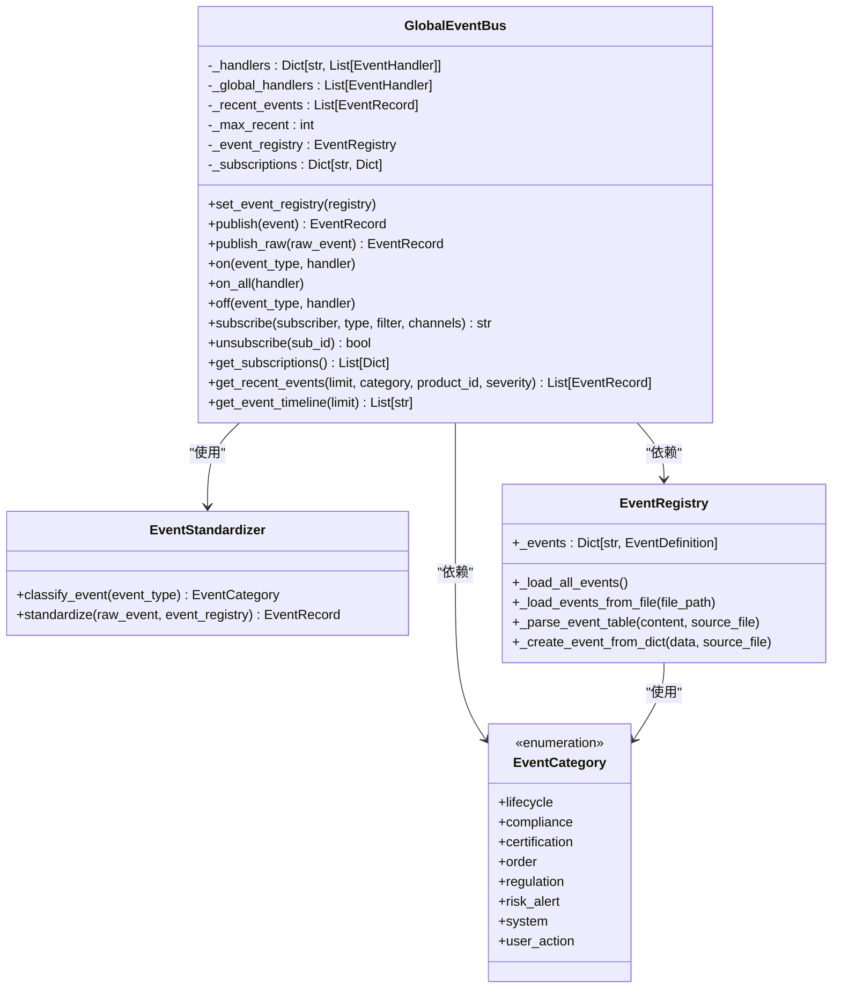
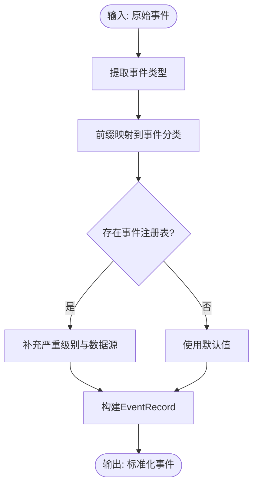
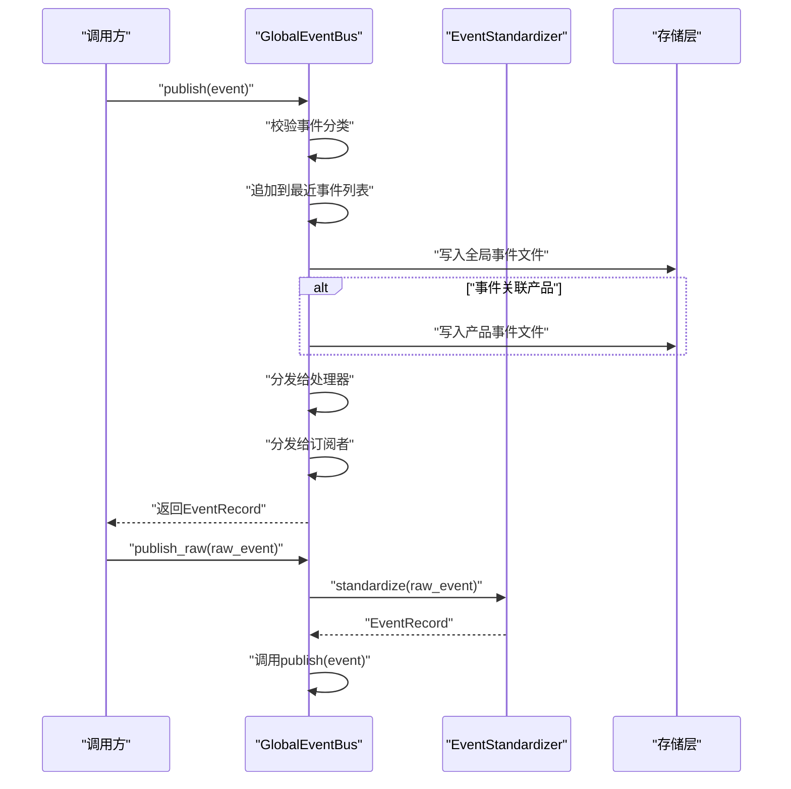
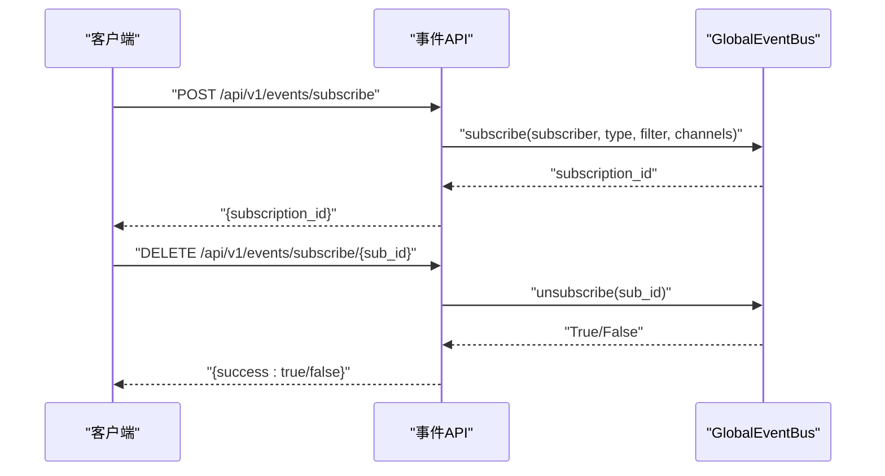
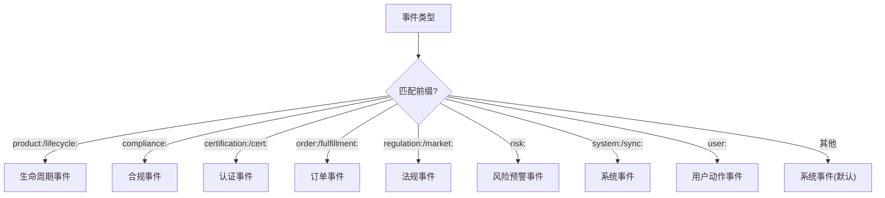
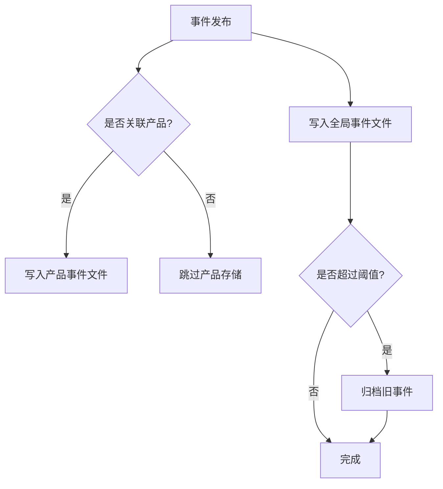
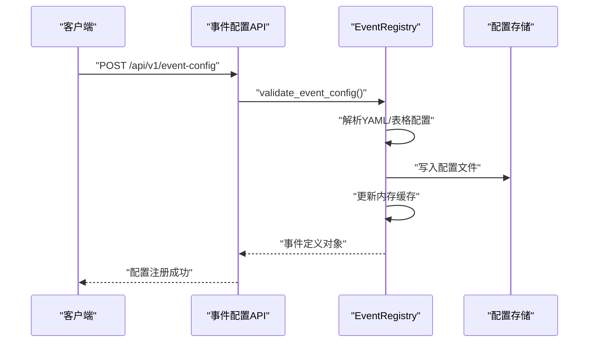
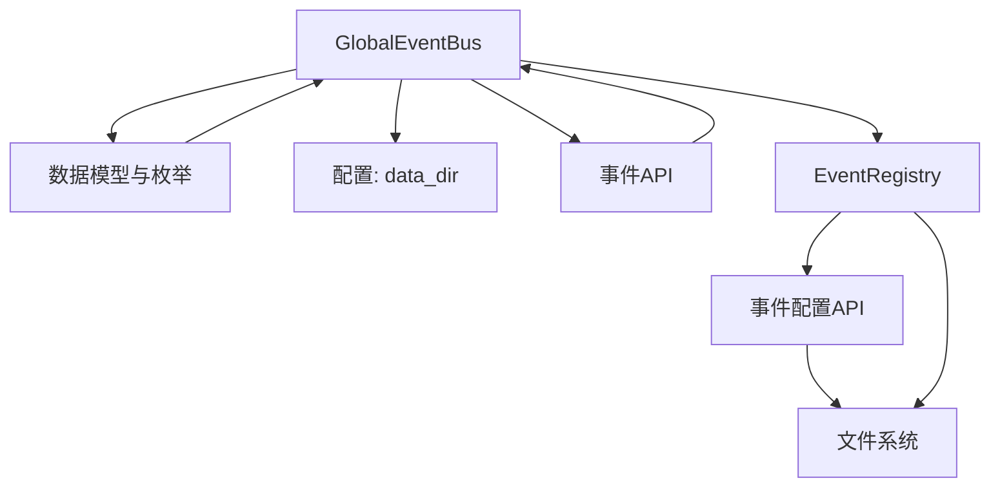

# 事件总线核心

<cite>
**本文引用的文件**
- [event_bus.py](file://backend/app/core/event_bus.py)
- [event_config.py](file://backend/app/api/event_config.py)
- [events.py](file://backend/app/api/events.py)
- [schemas.py](file://backend/app/models/schemas.py)
- [bus.json](file://backend/data/global/events/bus.json)
- [README.md](file://backend/data/数据流转.md)
</cite>

## 更新摘要
**所做更改**
- 新增事件配置管理章节，详细介绍YAML前端内容配置支持
- 更新事件注册表加载机制，支持YAML front-matter和Markdown表格双重格式
- 增强事件配置API文档，包含完整的REST接口说明
- 更新事件配置文件结构和管理流程

## 目录
1. [简介](#简介)
2. [项目结构](#项目结构)
3. [核心组件](#核心组件)
4. [架构概览](#架构概览)
5. [详细组件分析](#详细组件分析)
6. [事件配置管理](#事件配置管理)
7. [依赖关系分析](#依赖关系分析)
8. [性能考虑](#性能考虑)
9. [故障排除指南](#故障排除指南)
10. [结论](#结论)
11. [附录](#附录)

## 简介
本文件面向避风港平台的事件总线核心组件，重点解析 GlobalEventBus 的设计架构与实现原理，涵盖事件标准化管道、事件发布机制、事件处理器注册与订阅管理、事件分类系统、事件持久化策略等关键要素。**新增**支持YAML前端内容配置的事件配置管理系统，提供灵活的事件定义和管理能力。

## 项目结构
事件总线相关代码主要分布在以下位置：
- 核心实现：backend/app/core/event_bus.py
- 事件配置API：backend/app/api/event_config.py
- 事件运行时API：backend/app/api/events.py
- 数据模型与枚举：backend/app/models/schemas.py
- 全局事件存储：backend/data/global/events/bus.json
- 事件配置管理：backend/data/events/builtin/ 目录下的Markdown文件
- 数据流文档：backend/data/数据流转.md



**图表来源**
- [event_bus.py:1-50](file://backend/app/core/event_bus.py#L1-L50)
- [event_config.py:1-93](file://backend/app/api/event_config.py#L1-L93)
- [schemas.py:294-311](file://backend/app/models/schemas.py#L294-L311)

**章节来源**
- [event_bus.py:1-50](file://backend/app/core/event_bus.py#L1-L50)
- [event_config.py:1-93](file://backend/app/api/event_config.py#L1-L93)
- [schemas.py:294-311](file://backend/app/models/schemas.py#L294-L311)

## 核心组件
本节概述事件总线的关键组件及其职责：
- GlobalEventBus：全局事件总线，负责事件发布、订阅管理、处理器注册、事件持久化与分发。
- EventStandardizer：事件标准化管道，负责事件类型归类、元数据提取与格式化。
- EventCategory：事件分类枚举，定义八类事件体系。
- EventRegistry：事件注册表，支持YAML前端内容配置和Markdown表格两种格式的事件定义加载。
- 事件存储：全局事件存储与产品级事件存储，支持归档机制。

**章节来源**
- [event_bus.py:1-50](file://backend/app/core/event_bus.py#L1-L50)
- [event_config.py:1-93](file://backend/app/api/event_config.py#L1-L93)
- [schemas.py:294-311](file://backend/app/models/schemas.py#L294-L311)

## 架构概览
事件总线采用"标准化-路由-分发-持久化"的流水线架构。事件从发布入口进入，经过标准化分类，再根据产品归属路由到全局与产品级存储，并分发给已注册的处理器与订阅者。**新增**事件配置管理模块，支持YAML前端内容配置和传统Markdown表格格式的双重兼容。



**图表来源**
- [event_bus.py:150-187](file://backend/app/core/event_bus.py#L150-L187)
- [event_config.py:25-60](file://backend/app/api/event_config.py#L25-L60)
- [events.py:74-108](file://backend/app/api/events.py#L74-L108)

## 详细组件分析

### GlobalEventBus 设计与实现
GlobalEventBus 是事件总线的核心，承担以下职责：
- 事件发布：支持标准化发布与原始事件发布两种模式。
- 处理器注册：支持按事件类型与全局处理器注册。
- 订阅管理：支持四种订阅类型（精准、批量、全局、条件），并提供订阅创建、取消与查询。
- 事件查询：支持按分类、产品、严重级别等维度查询最近事件。
- 事件持久化：将事件写入全局事件文件与产品级事件文件，并支持归档。



**图表来源**
- [event_bus.py:138-267](file://backend/app/core/event_bus.py#L138-L267)
- [event_bus.py:520-622](file://backend/app/core/event_bus.py#L520-L622)
- [schemas.py:294-311](file://backend/app/models/schemas.py#L294-L311)

**章节来源**
- [event_bus.py:138-267](file://backend/app/core/event_bus.py#L138-L267)
- [event_bus.py:520-622](file://backend/app/core/event_bus.py#L520-L622)
- [schemas.py:294-311](file://backend/app/models/schemas.py#L294-L311)

### 事件标准化管道（EventStandardizer）
EventStandardizer 提供事件标准化能力，核心流程如下：
- 事件类型前缀映射：根据事件类型前缀自动归类到八类事件体系。
- 元数据补充：从事件注册表补充严重级别与数据源信息。
- 格式化输出：生成标准化的 EventRecord。



**图表来源**
- [event_bus.py:44-103](file://backend/app/core/event_bus.py#L44-L103)

**章节来源**
- [event_bus.py:44-103](file://backend/app/core/event_bus.py#L44-L103)

### 事件发布机制（publish / publish_raw）
事件发布包含两条路径：
- publish：直接发布已标准化事件，执行分类校验、内存缓存、持久化、路由与分发。
- publish_raw：先通过 EventStandardizer 标准化，再执行上述流程。



**图表来源**
- [event_bus.py:150-187](file://backend/app/core/event_bus.py#L150-L187)

**章节来源**
- [event_bus.py:150-187](file://backend/app/core/event_bus.py#L150-L187)

### 事件处理器注册与订阅管理
- 处理器注册：支持按事件类型注册处理器（on）与全局处理器注册（on_all），并提供移除处理器（off）。
- 订阅管理：支持四种订阅类型（精准、批量、全局、条件），提供订阅创建、取消与查询接口。



**图表来源**
- [events.py:81-108](file://backend/app/api/events.py#L81-L108)
- [event_bus.py:206-243](file://backend/app/core/event_bus.py#L206-L243)

**章节来源**
- [events.py:81-108](file://backend/app/api/events.py#L81-L108)
- [event_bus.py:206-243](file://backend/app/core/event_bus.py#L206-L243)

### 事件分类系统（EventCategory）与前缀映射
事件分类采用八类体系，前缀映射关系如下：
- lifecycle：product:, lifecycle:
- compliance：compliance:
- certification：certification:, cert:
- order：order:, fulfillment:
- regulation：regulation:, market:
- risk_alert：risk:
- system：system:, sync:
- user_action：user:



**图表来源**
- [event_bus.py:47-70](file://backend/app/core/event_bus.py#L47-L70)
- [schemas.py:294-305](file://backend/app/models/schemas.py#L294-L305)

**章节来源**
- [event_bus.py:47-70](file://backend/app/core/event_bus.py#L47-L70)
- [schemas.py:294-305](file://backend/app/models/schemas.py#L294-L305)

### 事件持久化策略
事件持久化分为三层：
- 全局事件存储：data/global/events/bus.json，记录所有全局事件。
- 产品级事件存储：data/products/{product_id}/events/chain.json，记录产品专属事件。
- 归档机制：当事件数量超过阈值时，将旧事件归档至 data/global/events/_archive/。



**图表来源**
- [event_bus.py:314-332](file://backend/app/core/event_bus.py#L314-L332)
- [event_bus.py:333-367](file://backend/app/core/event_bus.py#L333-L367)

**章节来源**
- [event_bus.py:314-332](file://backend/app/core/event_bus.py#L314-L332)
- [event_bus.py:333-367](file://backend/app/core/event_bus.py#L333-L367)

## 事件配置管理

### YAML前端内容配置支持
事件配置管理系统现已支持YAML前端内容配置，提供更灵活的事件定义方式：

#### YAML Front-Matter 格式
```yaml
---
events:
  - event_code: compliance:trade_sanctions
    name: 贸易制裁合规检查
    description: 货物是否涉及贸易制裁名单
    severity: high
    category: compliance
    stage: pre_export
    data_schema:
      product_id: string
      sanction_list: array
    trigger_conditions:
      - product.has_sanction_risks
---
```

#### Markdown表格格式（传统兼容）
```markdown
# 合规事件定义

| 事件代码 | 事件名称 | 描述 | 严重级别 | 分类 | 业务阶段 | 数据模式 |
|----------|----------|------|----------|------|----------|----------|
| compliance:trade_sanctions | 贸易制裁检查 | 检查货物是否涉及制裁名单 | high | compliance | pre_export | {"product_id":"string","sanction_list":"array"} |
```

#### 双格式兼容解析
EventRegistry 支持两种格式的自动识别和解析：
- **优先解析YAML front-matter**：当检测到 `---` 开头的YAML块时，优先使用YAML格式
- **回退到Markdown表格**：YAML解析失败时自动尝试表格解析
- **混合使用**：同一文件中可同时包含YAML配置和表格内容

**章节来源**
- [event_bus.py:546-562](file://backend/app/core/event_bus.py#L546-L562)
- [event_bus.py:588-622](file://backend/app/core/event_bus.py#L588-L622)

### 事件配置API
提供完整的REST API用于事件配置管理：

#### 基础API端点
- `GET /api/v1/event-config` - 获取事件配置列表
- `GET /api/v1/event-config/{code}` - 获取事件配置详情
- `POST /api/v1/event-config` - 注册新事件配置
- `PUT /api/v1/event-config/{code}` - 更新事件配置
- `DELETE /api/v1/event-config/{code}` - 删除事件配置

#### API功能特性
- **动态事件注册**：支持运行时添加新的事件类型定义
- **配置热更新**：修改配置后自动重新加载
- **事件定义归档**：删除事件时自动归档到 `_archive` 目录
- **配置验证**：自动验证事件定义的完整性和有效性



**图表来源**
- [event_config.py:25-60](file://backend/app/api/event_config.py#L25-L60)
- [event_bus.py:700-734](file://backend/app/core/event_bus.py#L700-L734)

**章节来源**
- [event_config.py:1-93](file://backend/app/api/event_config.py#L1-L93)
- [event_bus.py:700-734](file://backend/app/core/event_bus.py#L700-L734)

### 事件配置文件结构
事件配置文件采用Markdown格式，支持YAML前端内容配置：

#### 文件组织结构
```
backend/data/events/builtin/
├── _template.md          # 事件配置模板
├── compliance_events.md  # 合规事件配置
├── system_events.md      # 系统事件配置
└── _archive/             # 归档目录
    └── deleted_event.md  # 已删除事件归档
```

#### 配置字段说明
- `event_code`：事件唯一标识符（必需）
- `name`：事件显示名称（必需）
- `description`：事件描述信息（推荐）
- `severity`：事件严重级别（必需：low/medium/high/critical）
- `category`：事件分类（必需：compliance/system/risk_alert等）
- `stage`：业务阶段（推荐：pre_export/post_import等）
- `data_schema`：事件数据结构定义（JSON Schema格式）
- `trigger_conditions`：触发条件表达式（安全的Python表达式）

**章节来源**
- [event_bus.py:588-622](file://backend/app/core/event_bus.py#L588-L622)
- [event_bus.py:700-734](file://backend/app/core/event_bus.py#L700-L734)

## 依赖关系分析
事件总线的依赖关系清晰，核心依赖包括：
- 数据模型：EventRecord、EventCategory、DataSourceInfo、EventDefinition、SubscriptionFilter。
- 配置与存储：settings.data_dir 决定存储根目录，全局与产品事件文件位于 data/global/events 与 data/products/{product_id}/events。
- API 层：/api/v1/events/... 提供事件发布和查询接口，/api/v1/event-config/... 提供事件配置管理接口。
- **新增**：事件配置API与EventRegistry的集成，支持动态事件定义管理。



**图表来源**
- [event_bus.py:29-33](file://backend/app/core/event_bus.py#L29-L33)
- [events.py:81-108](file://backend/app/api/events.py#L81-L108)
- [event_config.py:1-93](file://backend/app/api/event_config.py#L1-L93)

**章节来源**
- [event_bus.py:29-33](file://backend/app/core/event_bus.py#L29-L33)
- [events.py:81-108](file://backend/app/api/events.py#L81-L108)
- [event_config.py:1-93](file://backend/app/api/event_config.py#L1-L93)

## 性能考虑
- 内存限制：最近事件列表最大容量为 500，超出部分采用切片保留最新记录，避免内存膨胀。
- 异步处理：事件发布与分发采用异步协程，提升并发吞吐。
- 存储优化：全局事件文件与产品事件文件采用 JSON 追加写入，归档机制减少单文件体积。
- 查询优化：事件查询支持多维过滤，建议在高频查询场景下结合索引或缓存策略。
- **新增**：事件配置缓存：EventRegistry 缓存已加载的事件定义，避免重复解析配置文件。

**章节来源**
- [event_bus.py:138-142](file://backend/app/core/event_bus.py#L138-L142)
- [event_bus.py:247-264](file://backend/app/core/event_bus.py#L247-L264)
- [event_bus.py:520-531](file://backend/app/core/event_bus.py#L520-L531)

## 故障排除指南
- 事件未分类：若事件类型前缀未匹配任何分类，默认归类为系统事件。可通过标准化管道补充事件注册表信息以获得更准确的分类。
- 订阅无效：确认订阅 ID 是否存在，以及订阅类型与过滤器配置是否正确。
- 存储异常：持久化失败不会影响事件分发，但需检查 data_dir 权限与磁盘空间。
- 查询无结果：检查查询参数（分类、产品、严重级别）是否与事件实际值一致。
- **新增**：事件配置解析错误：检查YAML front-matter格式是否正确，或回退到Markdown表格格式。
- **新增**：配置文件损坏：EventRegistry会自动捕获解析异常并提供详细的错误信息。

**章节来源**
- [event_bus.py:160-162](file://backend/app/core/event_bus.py#L160-L162)
- [event_bus.py:234-239](file://backend/app/core/event_bus.py#L234-L239)
- [event_bus.py:314-332](file://backend/app/core/event_bus.py#L314-L332)
- [event_bus.py:247-264](file://backend/app/core/event_bus.py#L247-L264)
- [event_bus.py:546-562](file://backend/app/core/event_bus.py#L546-L562)

## 结论
避风港平台的事件总线通过标准化管道、多层存储与灵活的订阅机制，实现了跨产品、跨用户的事件统一管理。**新增**的YAML前端内容配置支持进一步增强了事件定义的灵活性和可维护性。其设计兼顾了扩展性与性能，适合在复杂的合规与监管场景中稳定运行。建议在生产环境中结合事件注册表与归档策略，持续优化事件查询与存储效率。

## 附录

### 使用示例与最佳实践
- 发布事件：通过 API 或直接调用 GlobalEventBus.publish/publish_raw 完成事件发布。
- 注册处理器：使用 on/on_all/off 管理事件处理器，确保事件处理逻辑解耦。
- 订阅事件：根据业务需求选择精准、批量、全局或条件订阅，合理配置过滤器与通知渠道。
- 事件查询：利用 get_recent_events 按需筛选最近事件，支持 Dashboard 展示。
- **新增**：事件配置管理：使用事件配置API动态管理事件定义，支持YAML和Markdown两种格式。

**章节来源**
- [events.py:81-108](file://backend/app/api/events.py#L81-L108)
- [event_bus.py:191-203](file://backend/app/core/event_bus.py#L191-L203)
- [event_bus.py:247-264](file://backend/app/core/event_bus.py#L247-L264)
- [event_config.py:25-60](file://backend/app/api/event_config.py#L25-L60)

### 事件配置参考
- **YAML格式示例**：使用YAML front-matter定义多个事件，支持复杂的数据结构和触发条件
- **Markdown表格**：传统格式，适合简单的事件定义和快速编辑
- **混合使用**：在同一文件中结合两种格式的优势
- **配置归档**：删除事件时自动归档，便于审计和恢复

**章节来源**
- [README.md](file://backend/data/数据流转.md)
- [event_bus.py:546-562](file://backend/app/core/event_bus.py#L546-L562)
- [event_bus.py:700-734](file://backend/app/core/event_bus.py#L700-L734)

### 数据流与API参考
- **事件发布流程**：raw_event → GlobalEventBus.publish() → 标准化 → 路由分发 → 产品级+全局存储
- **事件配置流程**：YAML/Markdown → EventRegistry → 内存缓存 → API服务
- **订阅管理**：支持WebSocket、Webhook等多种通知渠道

**章节来源**
- [README.md](file://backend/data/数据流转.md)
- [event_bus.py:150-187](file://backend/app/core/event_bus.py#L150-L187)
- [event_config.py:1-93](file://backend/app/api/event_config.py#L1-L93)