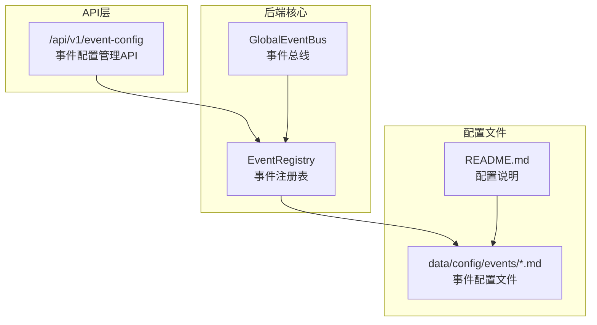
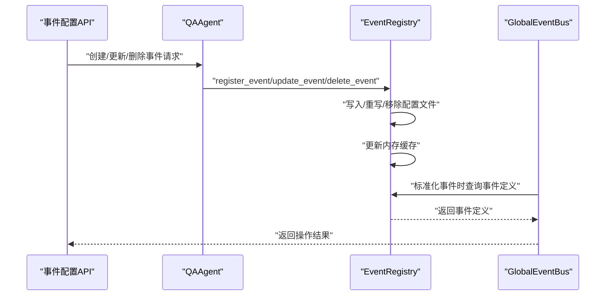
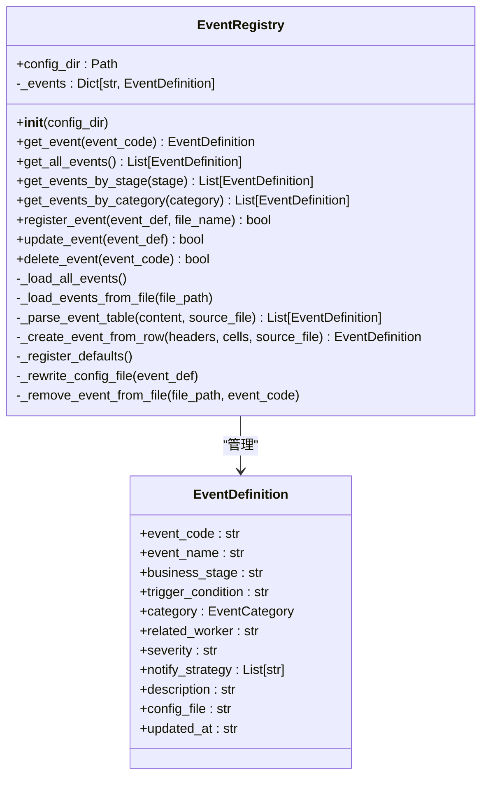
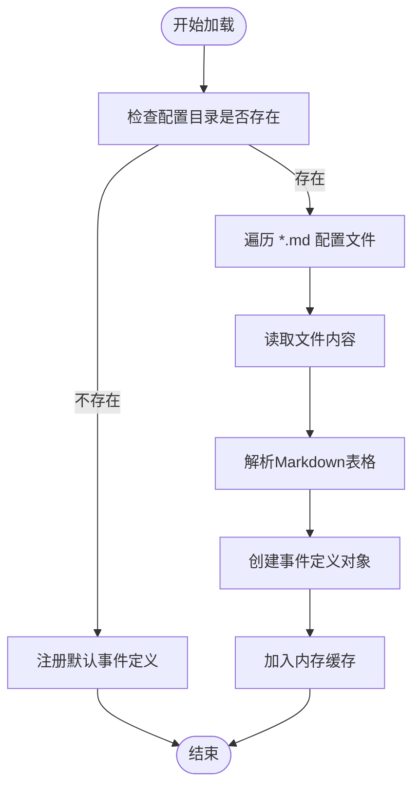
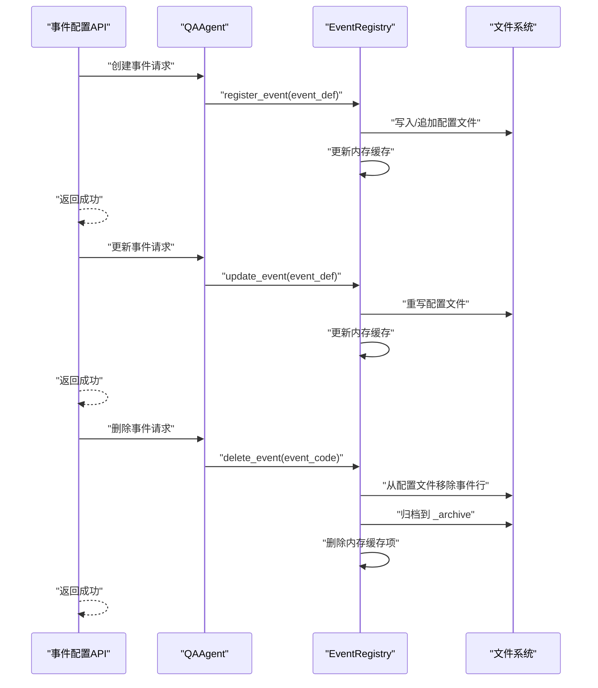
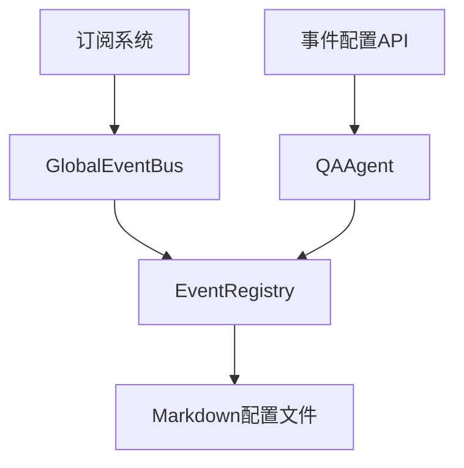

# 事件注册表管理

<cite>
**本文引用的文件**
- [event_bus.py](file://backend/app/core/event_bus.py)
- [event_config.py](file://backend/app/api/event_config.py)
- [README.md](file://backend/data/config/events/README.md)
- [custom_events.md](file://backend/data/config/events/custom_events.md)
- [test_phase1.py](file://backend/tests/test_phase1.py)
</cite>

## 目录
1. [简介](#简介)
2. [项目结构](#项目结构)
3. [核心组件](#核心组件)
4. [架构总览](#架构总览)
5. [详细组件分析](#详细组件分析)
6. [依赖分析](#依赖分析)
7. [性能考虑](#性能考虑)
8. [故障排查指南](#故障排查指南)
9. [结论](#结论)
10. [附录](#附录)

## 简介
本文件面向避风港平台的事件注册表管理，系统性阐述 EventRegistry 的事件定义管理机制与动态管理能力。重点覆盖：
- 从 Markdown 配置文件加载事件定义
- 事件分类自动推断与事件元数据管理
- 事件定义的数据结构与字段语义
- 动态管理能力：注册(register_event)、更新(update_event)、删除(delete_event)
- 事件配置文件格式规范、Markdown 表格解析与配置文件归档机制
- 最佳实践、自定义事件开发指南与配置文件维护策略

## 项目结构
事件注册表位于后端核心模块，配合 API 层提供对外配置管理能力；事件配置文件集中于 data/config/events 目录，采用 Markdown 表格形式维护。

图表来源
- [event_bus.py:518-816](file://backend/app/core/event_bus.py#L518-L816)
- [event_config.py:1-93](file://backend/app/api/event_config.py#L1-L93)
- [README.md:1-33](file://backend/data/config/events/README.md#L1-L33)

章节来源
- [event_bus.py:518-816](file://backend/app/core/event_bus.py#L518-L816)
- [event_config.py:1-93](file://backend/app/api/event_config.py#L1-L93)
- [README.md:1-33](file://backend/data/config/events/README.md#L1-L33)

## 核心组件
- EventRegistry：负责从 Markdown 配置文件加载事件定义、动态注册/更新/删除事件、维护事件元数据与配置文件同步。
- GlobalEventBus：负责事件标准化、路由、持久化与订阅分发，并在标准化时依赖 EventRegistry 补充事件定义信息。
- 事件配置 API：提供事件配置的查询、创建、更新、删除接口，供 QAAgent 与前端使用。

章节来源
- [event_bus.py:518-816](file://backend/app/core/event_bus.py#L518-L816)
- [event_config.py:1-93](file://backend/app/api/event_config.py#L1-L93)

## 架构总览
事件注册表管理的整体流程如下：
- 启动时 EventRegistry 加载 data/config/events 下的 Markdown 配置文件，解析表格生成事件定义并缓存。
- 事件标准化时，GlobalEventBus 使用 EventRegistry 提供的事件定义补充分类、严重级别与数据源等元信息。
- 通过 API 层进行事件定义的动态管理：注册新事件写入配置文件并更新内存；更新事件重写配置文件；删除事件从配置文件移除并归档。
- 事件订阅与分发：基于订阅过滤器对事件进行条件匹配与多通道通知。

图表来源
- [event_config.py:36-92](file://backend/app/api/event_config.py#L36-L92)
- [event_bus.py:144-187](file://backend/app/core/event_bus.py#L144-L187)
- [event_bus.py:675-735](file://backend/app/core/event_bus.py#L675-L735)

## 详细组件分析

### EventRegistry 组件
EventRegistry 是事件注册表的核心，负责：
- 从 data/config/events 目录加载 Markdown 配置文件，解析表格生成事件定义
- 事件分类自动推断（基于事件编码前缀）
- 事件元数据管理（事件编码、事件名称、业务阶段、触发条件、关联Worker、严重级别、通知策略、描述、配置文件路径等）
- 动态管理：注册、更新、删除事件并同步到配置文件
- 默认事件定义注册（当配置目录不存在时）

图表来源
- [event_bus.py:518-816](file://backend/app/core/event_bus.py#L518-L816)

章节来源
- [event_bus.py:518-816](file://backend/app/core/event_bus.py#L518-L816)

### 事件定义数据结构与字段语义
事件定义包含以下字段（以配置文件字段名为准，中文列名亦可识别）：
- 事件编码（event_code）：唯一标识，格式为“分类:名称”，用于事件类型匹配与分类推断
- 事件名称（event_name）：人类可读的事件名称
- 业务阶段（business_stage）：所属业务阶段（如“阶段1-10”或“全阶段”）
- 触发条件（trigger_condition）：事件触发的条件描述
- 关联Worker（related_worker）：可选，与事件处理相关的Worker编码
- 严重级别（severity）：可选，默认“low”，支持“low/medium/high/critical”
- 通知策略（notify_strategy）：可选，默认“dashboard”，支持“dashboard/websocket/email”等，逗号分隔
- 描述（description）：可选，事件的详细说明
- 配置文件路径（config_file）：事件定义来源的配置文件路径
- 更新时间（updated_at）：事件定义的最后更新时间

章节来源
- [README.md:20-33](file://backend/data/config/events/README.md#L20-L33)
- [event_bus.py:575-612](file://backend/app/core/event_bus.py#L575-L612)

### 事件分类自动推断
EventRegistry 在创建事件定义时，会基于事件编码前缀自动推断事件分类。该逻辑由 EventStandardizer 提供，支持的前缀与分类映射包括：
- product:/lifecycle: → lifecycle
- compliance: → compliance
- certification:/cert: → certification
- order:/fulfillment: → order
- regulation:/market: → regulation
- risk: → risk_alert
- system:/sync: → system
- user: → user_action

章节来源
- [event_bus.py:44-74](file://backend/app/core/event_bus.py#L44-L74)
- [event_bus.py:593-597](file://backend/app/core/event_bus.py#L593-L597)

### 从 Markdown 配置文件加载事件定义
EventRegistry 从 data/config/events 目录加载所有非隐藏的 Markdown 文件，逐个解析其中的事件定义表格。解析流程：
- 读取文件内容
- 识别表格头部与行数据
- 将行数据映射到事件定义字段（支持中英文列名）
- 创建 EventDefinition 并加入内存缓存

图表来源
- [event_bus.py:530-573](file://backend/app/core/event_bus.py#L530-L573)

章节来源
- [event_bus.py:530-573](file://backend/app/core/event_bus.py#L530-L573)

### 动态管理：注册、更新、删除
- 注册事件（register_event）：向指定配置文件追加一行事件定义，并更新内存缓存
- 更新事件（update_event）：更新内存缓存中的事件定义，并重写对应配置文件
- 删除事件（delete_event）：从所有配置文件中移除该事件行，并将原始定义归档至 _archive 目录

图表来源
- [event_config.py:36-92](file://backend/app/api/event_config.py#L36-L92)
- [event_bus.py:675-735](file://backend/app/core/event_bus.py#L675-L735)

章节来源
- [event_config.py:36-92](file://backend/app/api/event_config.py#L36-L92)
- [event_bus.py:675-735](file://backend/app/core/event_bus.py#L675-L735)

### 事件配置文件格式规范与解析
- 文件命名：每个事件类别一个 Markdown 文件，例如 lifecycle_events.md、compliance_events.md 等
- 表头：必须包含“事件编码、事件名称、业务阶段、触发条件、关联Worker、严重级别、通知策略”
- 列名支持中英文：事件编码/event_code、事件名称/event_name、业务阶段/business_stage、触发条件/trigger_condition、关联Worker/related_worker、严重级别/severity、通知策略/notify_strategy
- 解析规则：EventRegistry 逐行扫描，识别表格行并映射到事件定义字段；若缺少必要字段则忽略该行
- 默认文件：custom_events.md 作为自定义事件的默认写入目标

章节来源
- [README.md:6-33](file://backend/data/config/events/README.md#L6-L33)
- [custom_events.md:1-8](file://backend/data/config/events/custom_events.md#L1-L8)
- [event_bus.py:550-573](file://backend/app/core/event_bus.py#L550-L573)

### 配置文件归档机制
删除事件时，EventRegistry 会：
- 从所有配置文件中移除该事件行
- 在配置目录下的 _archive 子目录创建归档文件，记录归档时间与原始事件定义
- 从内存缓存中删除该事件

章节来源
- [event_bus.py:711-735](file://backend/app/core/event_bus.py#L711-L735)

### 事件订阅与条件过滤（与注册表的关系）
虽然订阅逻辑主要在 GlobalEventBus 中实现，但订阅过滤器可依赖事件定义中的元数据进行匹配，例如：
- 事件类型过滤
- 严重级别过滤
- 条件表达式（基于事件字段的安全求值）

章节来源
- [event_bus.py:206-243](file://backend/app/core/event_bus.py#L206-L243)
- [event_bus.py:445-482](file://backend/app/core/event_bus.py#L445-L482)
- [test_phase1.py:283-311](file://backend/tests/test_phase1.py#L283-L311)

## 依赖分析
- EventRegistry 依赖 data/config/events 目录中的 Markdown 配置文件
- GlobalEventBus 在事件标准化时依赖 EventRegistry 提供的事件定义
- 事件配置 API 通过 QAAgent 调用 EventRegistry 的动态管理方法
- 订阅系统依赖事件定义中的分类、严重级别等元数据进行过滤与分发

图表来源
- [event_bus.py:518-816](file://backend/app/core/event_bus.py#L518-L816)
- [event_config.py:1-93](file://backend/app/api/event_config.py#L1-L93)

章节来源
- [event_bus.py:518-816](file://backend/app/core/event_bus.py#L518-L816)
- [event_config.py:1-93](file://backend/app/api/event_config.py#L1-L93)

## 性能考虑
- 内存缓存：EventRegistry 将事件定义缓存在内存中，避免频繁读取文件带来的 I/O 开销
- 文件写入：注册/更新/删除操作均涉及文件写入，建议批量操作或在低峰时段执行
- 归档策略：删除事件时进行归档，避免丢失历史定义；归档文件按事件编码命名，便于检索
- 事件标准化：标准化过程依赖 EventRegistry 查询事件定义，确保事件分类与元数据正确填充

## 故障排查指南
- 事件未被识别：检查配置文件中是否存在“事件编码/事件名称/业务阶段/触发条件”等必填字段
- 事件分类错误：确认事件编码前缀是否符合预期，EventRegistry 会基于前缀自动推断分类
- 通知策略无效：确认通知策略字段是否为逗号分隔的有效值（如 dashboard/websocket/email）
- 删除事件后仍可见：确认是否正确归档至 _archive 目录，以及内存缓存是否已更新
- 订阅条件不生效：检查条件表达式的语法与可用变量（如 severity、category、product_id 等）

章节来源
- [event_bus.py:575-612](file://backend/app/core/event_bus.py#L575-L612)
- [event_bus.py:711-735](file://backend/app/core/event_bus.py#L711-L735)
- [test_phase1.py:283-311](file://backend/tests/test_phase1.py#L283-L311)

## 结论
EventRegistry 通过配置文件驱动的方式实现了事件定义的集中管理与动态维护，结合 EventStandardizer 的分类推断与 GlobalEventBus 的标准化流程，形成了完整的事件生命周期管理体系。配合事件配置 API，平台可在运行时灵活扩展事件类型，满足业务演进需求。

## 附录

### 事件配置文件维护策略
- 严格遵循表头规范，确保字段完整
- 使用清晰的事件编码命名规范，避免冲突
- 定期审查与归档不再使用的事件定义
- 对关键事件定义进行版本化管理，便于回溯

### 自定义事件开发指南
- 在前端或通过 QAAgent 提交事件定义，EventRegistry 会自动写入 custom_events.md
- 明确定义业务阶段与触发条件，便于后续订阅与告警
- 合理设置严重级别与通知策略，确保告警及时触达相关人员

### API 使用示例（参考）
- 获取事件配置：GET /api/v1/event-config
- 获取单个事件：GET /api/v1/event-config/{event_code}
- 创建事件：POST /api/v1/event-config
- 更新事件：PUT /api/v1/event-config/{event_code}
- 删除事件：DELETE /api/v1/event-config/{event_code}

章节来源
- [event_config.py:13-92](file://backend/app/api/event_config.py#L13-L92)