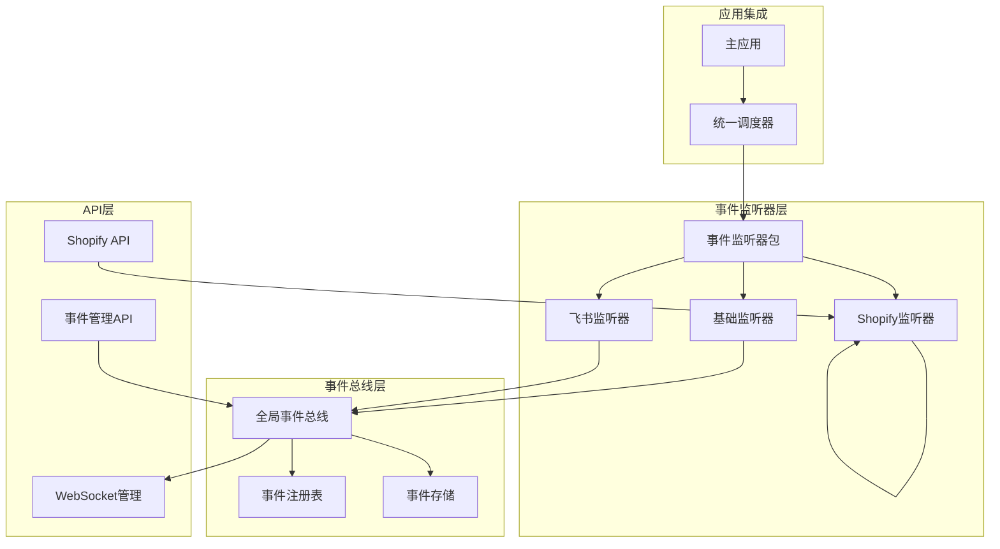
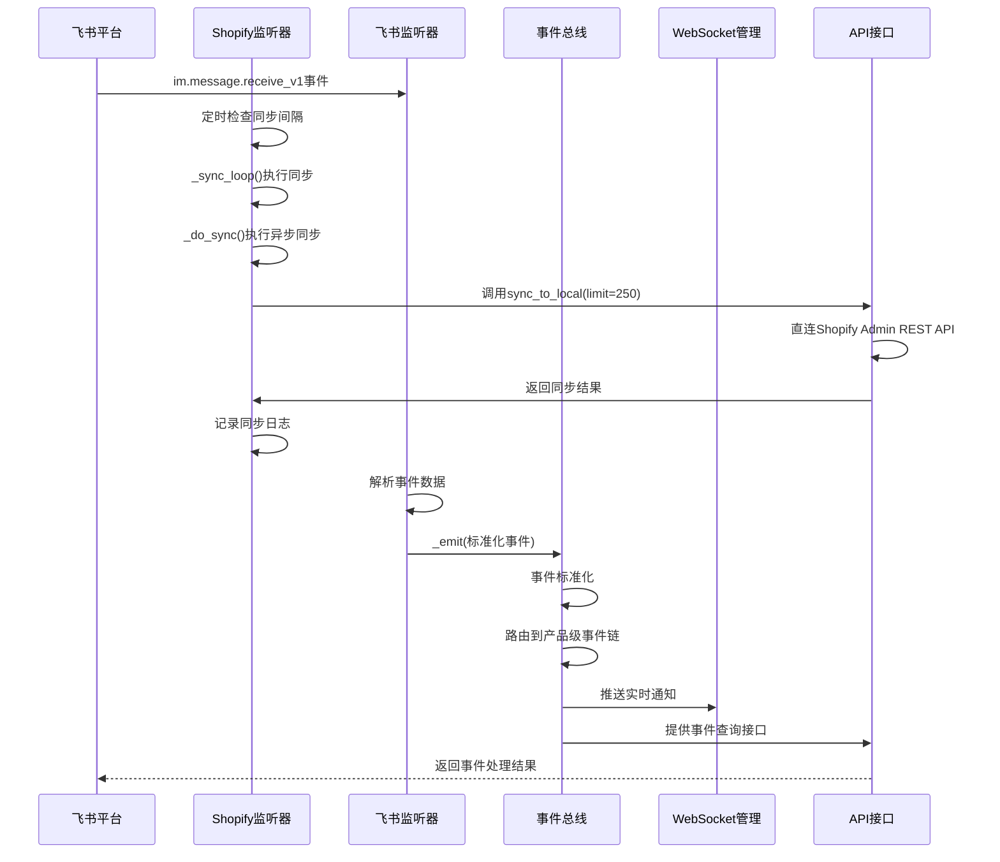
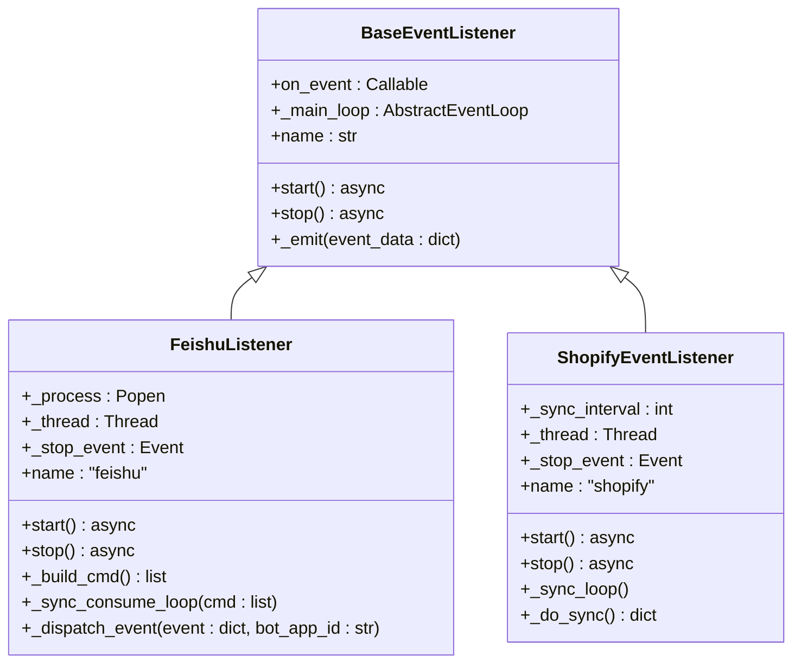
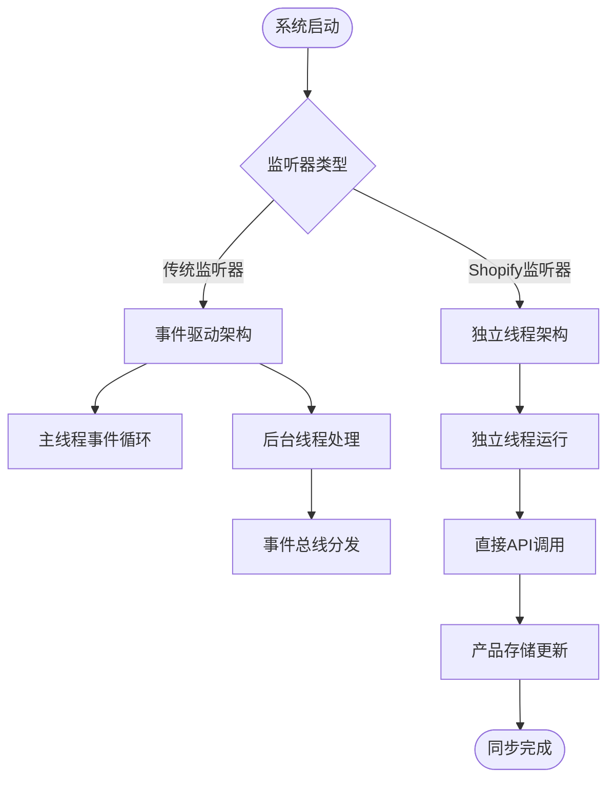
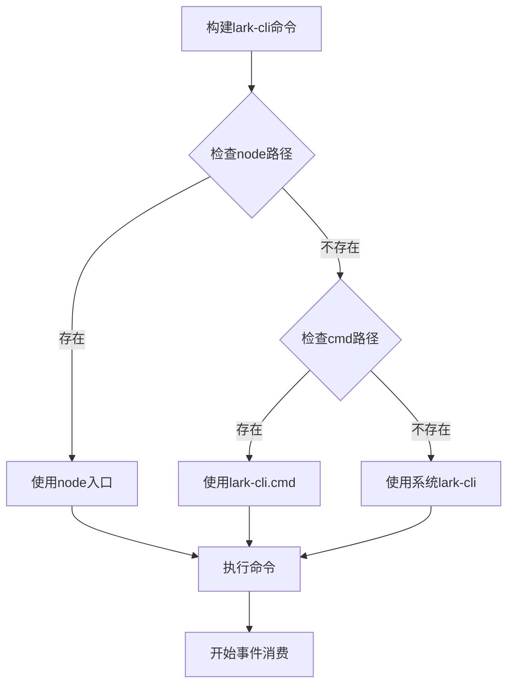
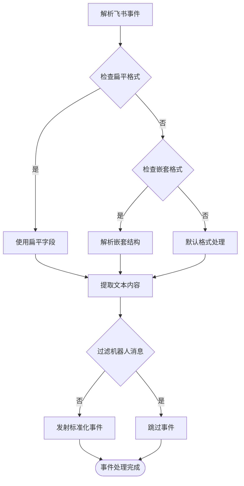
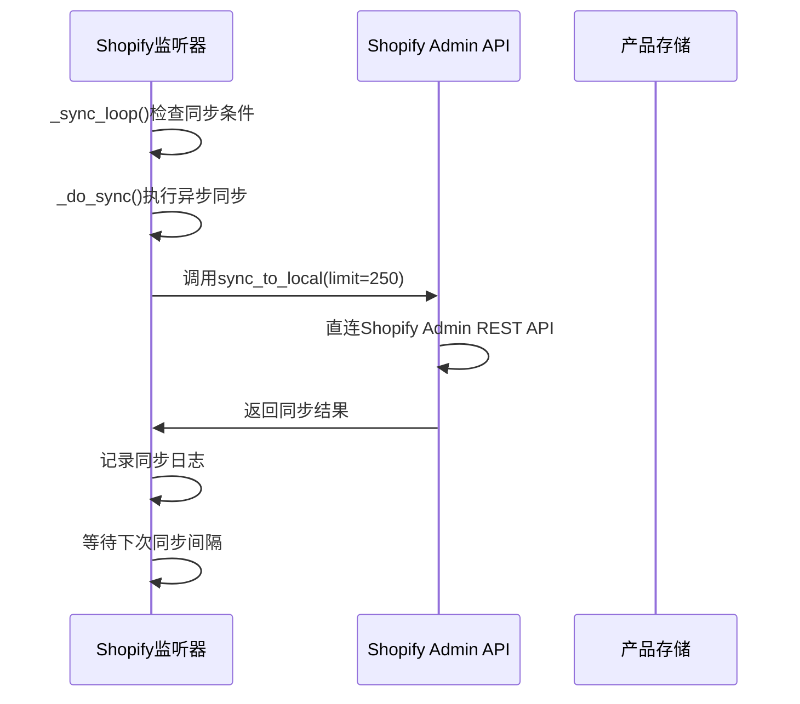
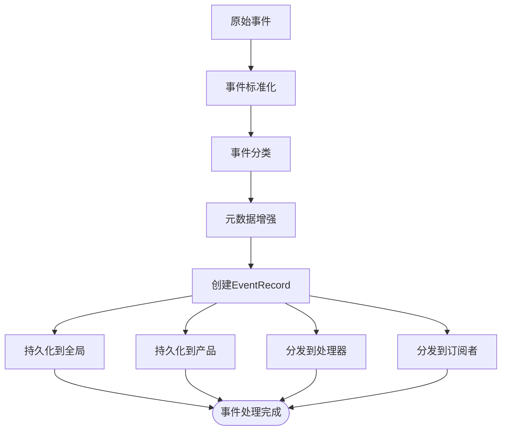
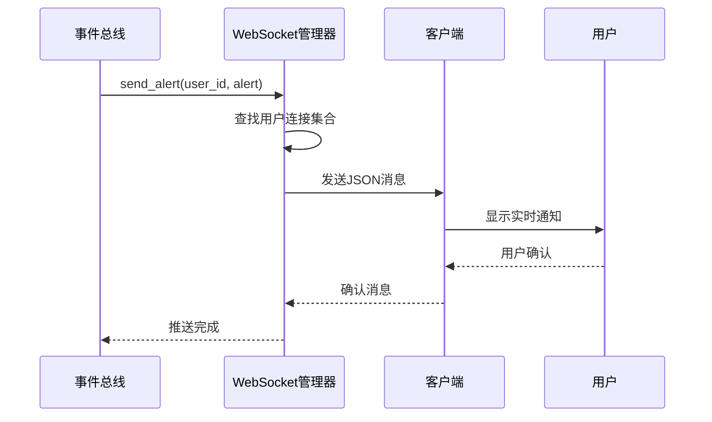
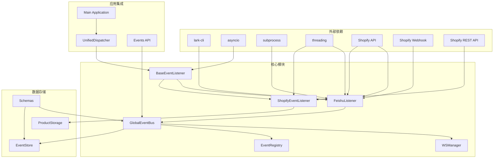

# 事件监听器架构

<cite>
**本文档引用的文件**
- [backend/app/core/event_listeners/base.py](file://backend/app/core/event_listeners/base.py)
- [backend/app/core/event_listeners/feishu_listener.py](file://backend/app/core/event_listeners/feishu_listener.py)
- [backend/app/core/event_listeners/shopify_listener.py](file://backend/app/core/event_listeners/shopify_listener.py)
- [backend/app/core/event_bus.py](file://backend/app/core/event_bus.py)
- [backend/app/api/events.py](file://backend/app/api/events.py)
- [backend/app/api/shopify.py](file://backend/app/api/shopify.py)
- [backend/app/services/ws_manager.py](file://backend/app/services/ws_manager.py)
- [backend/app/storage/event_store.py](file://backend/app/storage/event_store.py)
- [backend/app/models/schemas.py](file://backend/app/models/schemas.py)
- [backend/app/main.py](file://backend/app/main.py)
- [backend/app/core/unified_dispatcher.py](file://backend/app/core/unified_dispatcher.py)
- [backend/data/events/builtin/shopify_events.md](file://backend/data/events/builtin/shopify_events.md)
- [backend/data/context/shopify_reference.md](file://backend/data/context/shopify_reference.md)
</cite>

## 更新摘要
**所做更改**
- 新增ShopifyEventListener定时同步监听器架构分析
- 更新事件监听器系统为多线程独立运行模式
- 添加可配置同步间隔和错误处理机制
- 扩展事件源支持至Shopify平台
- 更新架构图为包含Shopify监听器的完整系统
- 新增独立线程架构与事件驱动架构的对比分析

## 目录
1. [简介](#简介)
2. [项目结构](#项目结构)
3. [核心组件](#核心组件)
4. [架构概览](#架构概览)
5. [详细组件分析](#详细组件分析)
6. [依赖关系分析](#依赖关系分析)
7. [性能考虑](#性能考虑)
8. [故障排除指南](#故障排除指南)
9. [结论](#结论)

## 简介

事件监听器架构是Astra合规智能体系统的核心基础设施，负责处理来自外部系统的实时事件流。该架构采用模块化设计，现已支持多种事件源（飞书消息、Shopify商品同步、Webhook事件），提供统一的事件标准化、路由分发和订阅管理功能。

**重大架构改进**：从背景线程方式迁移到独立的事件监听器系统，每个监听器作为单独线程运行，支持可配置的同步间隔和错误处理机制。新增的ShopifyEventListener采用独立线程架构，每30分钟直接调用Shopify Admin REST API进行商品同步，替代了原有的事件驱动架构。

该系统的主要特点包括：
- **异步事件处理**：基于asyncio实现高效的并发事件处理
- **多事件源支持**：可扩展的事件监听器基类设计，支持飞书和Shopify
- **事件标准化**：统一的事件格式和分类体系
- **订阅分发机制**：支持多种通知渠道和订阅模式
- **持久化存储**：事件的持久化和历史查询能力
- **独立线程架构**：每个监听器作为独立线程运行，提高系统稳定性
- **定时同步机制**：Shopify监听器支持可配置的定时同步间隔

## 项目结构

事件监听器架构在后端应用中的组织结构如下：



**图表来源**
- [backend/app/core/event_listeners/base.py:15-61](file://backend/app/core/event_listeners/base.py#L15-L61)
- [backend/app/core/event_listeners/feishu_listener.py:27-263](file://backend/app/core/event_listeners/feishu_listener.py#L27-L263)
- [backend/app/core/event_listeners/shopify_listener.py:1-87](file://backend/app/core/event_listeners/shopify_listener.py#L1-L87)
- [backend/app/core/event_bus.py:121-820](file://backend/app/core/event_bus.py#L121-L820)
- [backend/app/core/unified_dispatcher.py:1-65](file://backend/app/core/unified_dispatcher.py#L1-L65)

**章节来源**
- [backend/app/core/event_listeners/base.py:1-61](file://backend/app/core/event_listeners/base.py#L1-L61)
- [backend/app/core/event_listeners/shopify_listener.py:1-87](file://backend/app/core/event_listeners/shopify_listener.py#L1-L87)
- [backend/app/core/event_bus.py:1-820](file://backend/app/core/event_bus.py#L1-L820)

## 核心组件

### 事件监听器抽象基类

BaseEventListener提供了所有外部事件监听器的基础框架，定义了统一的接口规范和生命周期管理。

**关键特性：**
- 抽象基类设计，强制实现标准接口
- 支持异步启动和停止
- 内置事件回调机制
- 跨线程事件分发支持

### 飞书事件监听器

FeishuListener专门处理飞书平台的消息事件，实现了完整的事件消费和解析流程。

**核心功能：**
- 基于lark-cli的实时事件消费
- 多平台兼容的命令构建
- 后台线程守护机制
- 事件内容解析和标准化

### Shopify事件监听器

ShopifyEventListener是新引入的独立事件监听器，专门处理Shopify平台的商品同步事件。

**核心特性：**
- **独立线程架构**：作为单独线程运行，不依赖事件驱动架构
- **定时同步机制**：支持可配置的同步间隔（默认30分钟）
- **直接API调用**：不经过事件总线，直接调用Shopify Admin REST API
- **错误处理机制**：完善的异常捕获和日志记录
- **线程安全设计**：使用Event对象控制线程停止
- **优雅停机机制**：支持5秒超时的安全停止

**章节来源**
- [backend/app/core/event_listeners/base.py:15-61](file://backend/app/core/event_listeners/base.py#L15-L61)
- [backend/app/core/event_listeners/feishu_listener.py:27-263](file://backend/app/core/event_listeners/feishu_listener.py#L27-L263)
- [backend/app/core/event_listeners/shopify_listener.py:26-87](file://backend/app/core/event_listeners/shopify_listener.py#L26-L87)

## 架构概览

事件监听器架构采用分层设计，从底层的事件监听到上层的业务处理形成了完整的事件处理流水线。新增的Shopify监听器作为独立线程运行，提供定时同步功能。



**图表来源**
- [backend/app/core/event_listeners/feishu_listener.py:176-263](file://backend/app/core/event_listeners/feishu_listener.py#L176-L263)
- [backend/app/core/event_listeners/shopify_listener.py:61-87](file://backend/app/core/event_listeners/shopify_listener.py#L61-L87)
- [backend/app/core/event_bus.py:156-188](file://backend/app/core/event_bus.py#L156-L188)
- [backend/app/services/ws_manager.py:48-84](file://backend/app/services/ws_manager.py#L48-L84)

## 详细组件分析

### 事件监听器基类设计



**图表来源**
- [backend/app/core/event_listeners/base.py:15-61](file://backend/app/core/event_listeners/base.py#L15-L61)
- [backend/app/core/event_listeners/feishu_listener.py:27-263](file://backend/app/core/event_listeners/feishu_listener.py#L27-L263)
- [backend/app/core/event_listeners/shopify_listener.py:26-87](file://backend/app/core/event_listeners/shopify_listener.py#L26-L87)

#### 独立线程架构设计

Shopify监听器采用了全新的独立线程架构，与传统的事件驱动架构形成对比：



**图表来源**
- [backend/app/core/event_listeners/shopify_listener.py:61-87](file://backend/app/core/event_listeners/shopify_listener.py#L61-L87)
- [backend/app/core/event_listeners/base.py:38-61](file://backend/app/core/event_listeners/base.py#L38-L61)

**章节来源**
- [backend/app/core/event_listeners/base.py:15-61](file://backend/app/core/event_listeners/base.py#L15-L61)
- [backend/app/core/event_listeners/shopify_listener.py:26-87](file://backend/app/core/event_listeners/shopify_listener.py#L26-L87)

### 飞书事件监听器实现

飞书监听器实现了完整的事件消费和解析流程，具有以下关键特性：

#### 多平台兼容的命令构建



**图表来源**
- [backend/app/core/event_listeners/feishu_listener.py:65-75](file://backend/app/core/event_listeners/feishu_listener.py#L65-L75)

#### 事件解析和标准化流程

飞书监听器支持多种事件格式的解析：



**图表来源**
- [backend/app/core/event_listeners/feishu_listener.py:176-263](file://backend/app/core/event_listeners/feishu_listener.py#L176-L263)

**章节来源**
- [backend/app/core/event_listeners/feishu_listener.py:27-263](file://backend/app/core/event_listeners/feishu_listener.py#L27-L263)

### Shopify事件监听器实现

Shopify监听器实现了定时同步机制，具有以下关键特性：

#### 定时同步机制

```mermaid
flowchart TD
StartSync[开始同步循环] --> DelayInit[延迟30秒初始化]
DelayInit --> CheckInterval{检查同步间隔}
CheckInterval --> |达到间隔| SyncProducts[同步商品数据]
CheckInterval --> |未达到间隔| WaitInterval[等待剩余时间]
WaitInterval --> CheckStop{检查停止信号}
CheckStop --> |未停止| CheckInterval
CheckStop --> |已停止| StopThread[停止线程]
SyncProducts --> ExecuteAsync[在主事件循环中执行异步同步]
ExecuteAsync --> CallAPI[调用sync_to_local(limit=250)]
CallAPI --> LogResult[记录同步结果]
LogResult --> WaitInterval
StopThread --> End([同步完成])
```

**图表来源**
- [backend/app/core/event_listeners/shopify_listener.py:61-87](file://backend/app/core/event_listeners/shopify_listener.py#L61-L87)

#### 直接API调用流程

Shopify监听器绕过事件总线，直接调用Shopify API进行数据同步：



**图表来源**
- [backend/app/core/event_listeners/shopify_listener.py:84-87](file://backend/app/core/event_listeners/shopify_listener.py#L84-L87)

**章节来源**
- [backend/app/core/event_listeners/shopify_listener.py:1-87](file://backend/app/core/event_listeners/shopify_listener.py#L1-L87)

### 全局事件总线设计

事件总线系统提供了完整的事件生命周期管理：

#### 事件标准化管道



**图表来源**
- [backend/app/core/event_bus.py:82-118](file://backend/app/core/event_bus.py#L82-L118)

#### 订阅分发机制

事件总线支持四种订阅模式：

| 订阅类型 | 描述 | 过滤条件 |
|---------|------|----------|
| 精准订阅 | 按产品ID精确匹配 | `product_ids`列表 |
| 批量订阅 | 按标签匹配 | `tags`列表 |
| 全局订阅 | 接收所有事件 | 无过滤 |
| 条件订阅 | 基于表达式的动态过滤 | `condition_expr` |

**章节来源**
- [backend/app/core/event_bus.py:121-820](file://backend/app/core/event_bus.py#L121-L820)

### WebSocket实时推送

WebSocket管理器提供了统一的实时消息推送服务：



**图表来源**
- [backend/app/core/event_bus.py:422-427](file://backend/app/core/event_bus.py#L422-L427)
- [backend/app/services/ws_manager.py:48-84](file://backend/app/services/ws_manager.py#L48-L84)

**章节来源**
- [backend/app/services/ws_manager.py:20-99](file://backend/app/services/ws_manager.py#L20-L99)

## 依赖关系分析

事件监听器架构的依赖关系呈现清晰的层次化结构，新增了Shopify监听器的独立依赖关系：



**图表来源**
- [backend/app/core/event_listeners/base.py:6-12](file://backend/app/core/event_listeners/base.py#L6-L12)
- [backend/app/core/event_listeners/feishu_listener.py:14-24](file://backend/app/core/event_listeners/feishu_listener.py#L14-L24)
- [backend/app/core/event_listeners/shopify_listener.py:10-16](file://backend/app/core/event_listeners/shopify_listener.py#L10-L16)
- [backend/app/core/event_bus.py:21-38](file://backend/app/core/event_bus.py#L21-L38)

**章节来源**
- [backend/app/core/unified_dispatcher.py:1-65](file://backend/app/core/unified_dispatcher.py#L1-L65)
- [backend/app/main.py:144-156](file://backend/app/main.py#L144-L156)

## 性能考虑

事件监听器架构在设计时充分考虑了性能优化，新增的Shopify监听器采用了独立线程架构以提高系统稳定性：

### 异步I/O优化
- 使用asyncio实现非阻塞事件处理
- 后台线程与事件循环分离，避免阻塞
- 事件分发采用任务队列机制

### 独立线程架构优势
- **隔离性**：Shopify监听器独立运行，不影响其他监听器
- **稳定性**：线程停止信号控制，避免资源泄漏
- **可配置性**：支持自定义同步间隔，适应不同业务需求
- **错误隔离**：API调用异常不会影响事件总线系统
- **优雅停机**：支持5秒超时的安全停止机制

### 内存管理
- 事件总线限制最近事件数量（默认500条）
- 全局事件文件自动归档机制
- 产品事件链长度限制（默认500条）
- Shopify监听器使用轻量级线程模型

### 并发控制
- 多线程事件消费避免Windows SelectorEventLoop限制
- 线程安全的事件回调机制
- 异常隔离防止事件处理中断
- 独立线程的优雅停机机制

## 故障排除指南

### 常见问题及解决方案

#### 飞书事件监听器问题
- **问题**：lark-cli命令无法找到
  - **解决方案**：检查Node.js环境和lark-cli安装路径
  - **诊断**：查看命令构建函数的返回值

- **问题**：事件消费不稳定
  - **解决方案**：检查网络连接和飞书机器人权限
  - **诊断**：监控stderr输出和进程退出码

#### Shopify事件监听器问题
- **问题**：API调用失败
  - **解决方案**：检查Shopify访问令牌和API配额限制
  - **诊断**：查看同步日志和错误堆栈

- **问题**：同步间隔不生效
  - **解决方案**：验证SYNC_INTERVAL配置参数
  - **诊断**：检查线程停止事件和时间计算

- **问题**：线程无法停止
  - **解决方案**：确保stop()方法正确调用
  - **诊断**：检查_stop_event状态和线程生命周期

- **问题**：异步同步执行超时
  - **解决方案**：增加120秒超时时间或优化API响应
  - **诊断**：监控asyncio.run_coroutine_threadsafe的执行结果

#### 事件分发问题
- **问题**：WebSocket推送失败
  - **解决方案**：检查客户端连接状态和网络状况
  - **诊断**：查看连接池状态和异常日志

- **问题**：事件处理超时
  - **解决方案**：优化事件处理器性能或增加超时时间
  - **诊断**：监控事件处理时长和资源使用情况

**章节来源**
- [backend/app/core/event_listeners/feishu_listener.py:85-95](file://backend/app/core/event_listeners/feishu_listener.py#L85-L95)
- [backend/app/core/event_listeners/shopify_listener.py:61-87](file://backend/app/core/event_listeners/shopify_listener.py#L61-L87)
- [backend/app/services/ws_manager.py:58-66](file://backend/app/services/ws_manager.py#L58-L66)

## 结论

事件监听器架构展现了现代事件驱动系统的设计精髓，通过模块化、异步化和标准化的设计原则，实现了高效、可扩展的事件处理能力。**重大架构改进**使得系统能够同时支持多种事件源，包括传统的飞书事件和新增的Shopify商品同步事件。

### 主要优势
- **高度模块化**：清晰的组件边界和职责分离
- **异步高性能**：充分利用asyncio实现高并发处理
- **可扩展性强**：易于添加新的事件源和处理逻辑
- **生产就绪**：完善的错误处理和监控机制
- **架构多样化**：支持事件驱动和独立线程两种架构模式
- **定时同步能力**：Shopify监听器提供可靠的定时同步机制

### 技术亮点
- 统一的事件标准化管道
- 灵活的订阅分发机制  
- 多层次的事件存储策略
- 完善的WebSocket实时推送
- **新增**：独立线程架构支持定时同步
- **新增**：可配置的同步间隔机制
- **新增**：直接API调用的Shopify集成
- **新增**：优雅停机和错误隔离机制

### 架构演进
该架构为Astra合规智能体系统提供了坚实的基础，能够支持复杂的业务场景和未来的功能扩展需求。**新增的Shopify监听器**展示了系统向更复杂的企业级集成能力的发展方向，通过独立线程架构实现了与传统事件驱动架构的互补。

**架构对比总结**：
- **传统事件驱动架构**（飞书监听器）：事件消费→事件标准化→总线分发→订阅通知
- **独立线程架构**（Shopify监听器）：定时同步→直接API调用→本地存储更新→日志记录

两种架构模式各有优势，共同构成了完整的事件处理生态系统。