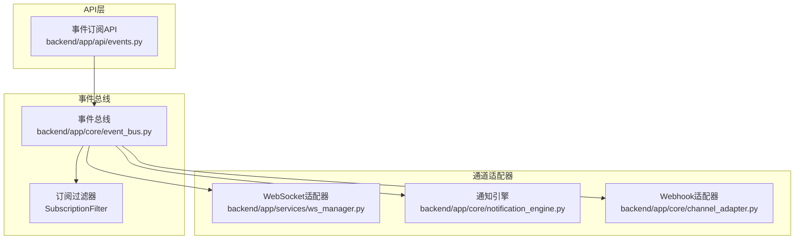
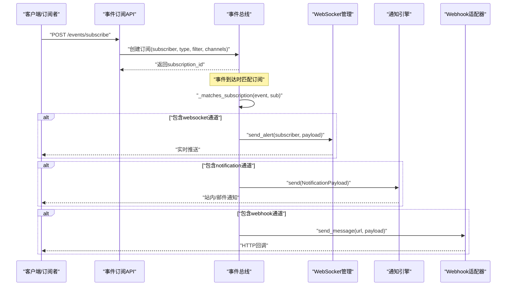
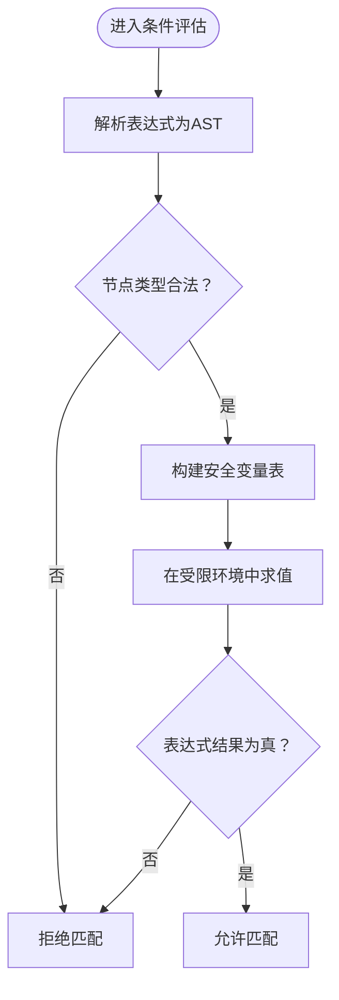
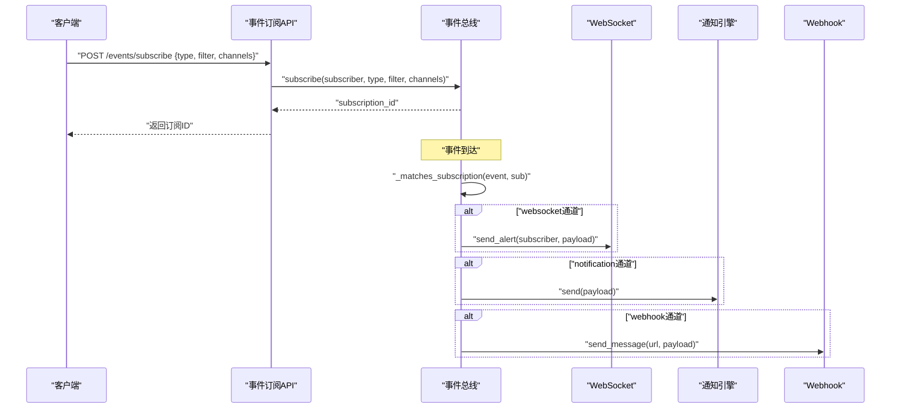
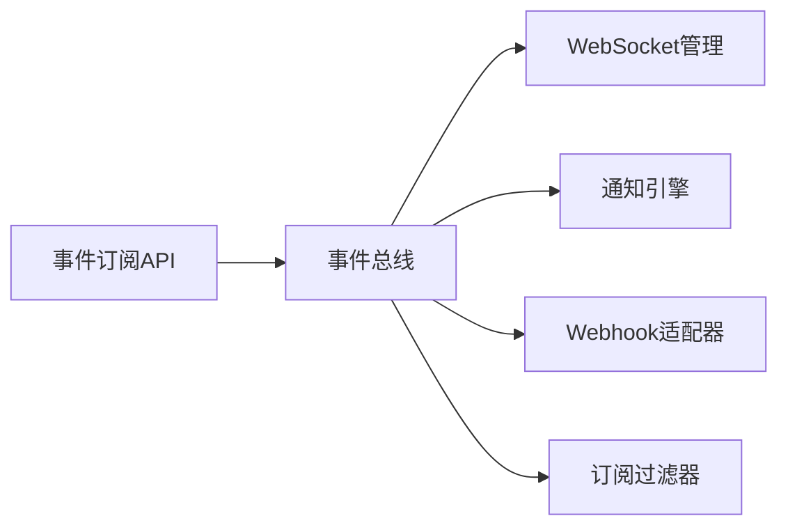

# 事件订阅系统

<cite>
**本文引用的文件**
- [backend/app/api/events.py](file://backend/app/api/events.py)
- [backend/app/core/event_bus.py](file://backend/app/core/event_bus.py)
- [backend/app/core/channel_adapter.py](file://backend/app/core/channel_adapter.py)
- [backend/app/services/ws_manager.py](file://backend/app/services/ws_manager.py)
- [backend/app/core/notification_engine.py](file://backend/app/core/notification_engine.py)
- [backend/app/models/schemas.py](file://backend/app/models/schemas.py)
- [backend/tests/test_phase1.py](file://backend/tests/test_phase1.py)
- [backend/tests/test_all_phases.py](file://backend/tests/test_all_phases.py)
- [前后端api交互.md](file://前后端api交互.md)
</cite>

## 目录
1. [简介](#简介)
2. [项目结构](#项目结构)
3. [核心组件](#核心组件)
4. [架构总览](#架构总览)
5. [详细组件分析](#详细组件分析)
6. [依赖关系分析](#依赖关系分析)
7. [性能考虑](#性能考虑)
8. [故障排查指南](#故障排查指南)
9. [结论](#结论)
10. [附录](#附录)

## 简介
本文件面向避风港平台的事件订阅系统，系统支持四种订阅模式：精准订阅(precise)、批量订阅(batch)、全局订阅(global)与条件订阅(conditional)，并通过订阅过滤器(SubscriptionFilter)对产品ID、标签、事件类型与严重级别进行筛选。订阅通道(channel)包含WebSocket推送、通知引擎集成与Webhook适配器。系统采用AST白名单替代eval的方式对条件表达式进行安全评估，防止沙箱逃逸。本文提供架构图、序列图、流程图与最佳实践，帮助开发者与运维人员快速理解与部署。

## 项目结构
事件订阅系统主要由以下模块构成：
- API层：对外提供订阅接口，负责请求解析与响应封装
- 事件总线：管理订阅、匹配事件与分发到各通道
- 通道适配器：统一处理WebSocket、通知引擎与Webhook
- WebSocket管理：负责实时推送
- 通知引擎：负责站内/邮件等通知路由
- 测试用例：覆盖四种订阅模式与典型场景

图表来源
- [backend/app/api/events.py](file://backend/app/api/events.py)
- [backend/app/core/event_bus.py](file://backend/app/core/event_bus.py)
- [backend/app/services/ws_manager.py](file://backend/app/services/ws_manager.py)
- [backend/app/core/notification_engine.py](file://backend/app/core/notification_engine.py)
- [backend/app/core/channel_adapter.py](file://backend/app/core/channel_adapter.py)

章节来源
- [backend/app/api/events.py](file://backend/app/api/events.py)
- [backend/app/core/event_bus.py](file://backend/app/core/event_bus.py)

## 核心组件
- 事件总线(EventBus)
  - 提供订阅创建、事件分发与订阅匹配逻辑
  - 支持多通道分发：WebSocket、通知引擎、Webhook
- 订阅过滤器(SubscriptionFilter)
  - 支持产品ID过滤、标签匹配、事件类型过滤、严重级别过滤
- 通道适配器
  - WebSocket推送：通过ws_manager向指定连接推送
  - 通知引擎：根据严重级别路由到dashboard/websocket/email
  - Webhook适配器：调用订阅者的回调URL
- 条件表达式安全评估
  - 使用AST白名单替代eval，限制节点类型与变量范围，防止沙箱逃逸

章节来源
- [backend/app/core/event_bus.py](file://backend/app/core/event_bus.py)
- [backend/app/core/notification_engine.py](file://backend/app/core/notification_engine.py)
- [backend/app/core/channel_adapter.py](file://backend/app/core/channel_adapter.py)
- [backend/app/services/ws_manager.py](file://backend/app/services/ws_manager.py)

## 架构总览
事件从生产者产生后，经事件总线匹配订阅并按通道分发至客户端或下游系统。WebSocket用于实时推送，通知引擎负责站内与邮件通知，Webhook用于第三方系统集成。

图表来源
- [backend/app/core/event_bus.py](file://backend/app/core/event_bus.py)
- [backend/app/services/ws_manager.py](file://backend/app/services/ws_manager.py)
- [backend/app/core/notification_engine.py](file://backend/app/core/notification_engine.py)
- [backend/app/core/channel_adapter.py](file://backend/app/core/channel_adapter.py)

## 详细组件分析

### 订阅模式与过滤器
- 精准订阅(precise)
  - 通过产品ID精确匹配事件，适用于单产品事件推送
- 批量订阅(batch)
  - 通过标签集合匹配事件，适用于多产品聚合场景
- 全局订阅(global)
  - 不设置过滤器或仅设置事件类型通配，适用于全量事件订阅
- 条件订阅(conditional)
  - 通过表达式动态过滤事件，表达式在安全沙箱中评估

订阅过滤器(SubscriptionFilter)支持的配置项：
- 产品ID过滤：product_ids
- 标签匹配：tags
- 事件类型过滤：event_types
- 严重级别过滤：severity
- 条件表达式：condition_expr

章节来源
- [backend/app/core/event_bus.py](file://backend/app/core/event_bus.py)
- [backend/tests/test_phase1.py](file://backend/tests/test_phase1.py)
- [backend/tests/test_all_phases.py](file://backend/tests/test_all_phases.py)

### 通道实现
- WebSocket推送
  - 事件匹配后通过ws_manager向订阅者连接推送
  - 适用于前端实时展示与交互
- 通知引擎集成
  - 根据事件严重级别路由到dashboard、websocket或email
  - 适用于站内消息与邮件告警
- Webhook适配器
  - 将事件以JSON格式发送到订阅者提供的URL
  - 适用于第三方系统集成

章节来源
- [backend/app/core/event_bus.py](file://backend/app/core/event_bus.py)
- [backend/app/services/ws_manager.py](file://backend/app/services/ws_manager.py)
- [backend/app/core/notification_engine.py](file://backend/app/core/notification_engine.py)
- [backend/app/core/channel_adapter.py](file://backend/app/core/channel_adapter.py)

### 条件表达式安全评估
系统采用AST白名单替代eval，仅允许有限的节点类型与变量，避免任意代码执行与沙箱逃逸：
- 允许节点类型：布尔运算、比较、算术运算、常量与变量
- 允许变量：事件类型、严重级别、类别、产品ID、来源与事件数据中的基本类型字段
- 异常处理：表达式解析或求值异常将导致订阅不匹配

图表来源
- [backend/app/core/event_bus.py](file://backend/app/core/event_bus.py)

章节来源
- [backend/app/core/event_bus.py](file://backend/app/core/event_bus.py)

### API工作流
- 订阅创建
  - 客户端调用订阅接口，传入subscriber、subscription_type、filter与channels
  - 事件总线生成订阅ID并持久化订阅信息
- 事件分发
  - 事件到达时，总线遍历订阅并调用匹配函数
  - 对每个匹配订阅，按channels逐个分发
- WebSocket实时推送
  - 通过ws_manager向订阅者连接发送消息
- 通知与Webhook
  - 通知引擎按严重级别路由
  - Webhook适配器调用订阅者URL

图表来源
- [backend/app/api/events.py](file://backend/app/api/events.py)
- [backend/app/core/event_bus.py](file://backend/app/core/event_bus.py)
- [backend/app/services/ws_manager.py](file://backend/app/services/ws_manager.py)
- [backend/app/core/notification_engine.py](file://backend/app/core/notification_engine.py)
- [backend/app/core/channel_adapter.py](file://backend/app/core/channel_adapter.py)

章节来源
- [backend/app/api/events.py](file://backend/app/api/events.py)
- [backend/app/core/event_bus.py](file://backend/app/core/event_bus.py)

## 依赖关系分析
- API层依赖事件总线进行订阅管理
- 事件总线依赖通道适配器进行分发
- WebSocket推送依赖ws_manager
- 通知引擎依赖notification_engine
- Webhook适配器依赖channel_adapter
- 订阅过滤器作为事件总线内部的数据结构参与匹配

图表来源
- [backend/app/api/events.py](file://backend/app/api/events.py)
- [backend/app/core/event_bus.py](file://backend/app/core/event_bus.py)
- [backend/app/services/ws_manager.py](file://backend/app/services/ws_manager.py)
- [backend/app/core/notification_engine.py](file://backend/app/core/notification_engine.py)
- [backend/app/core/channel_adapter.py](file://backend/app/core/channel_adapter.py)

章节来源
- [backend/app/api/events.py](file://backend/app/api/events.py)
- [backend/app/core/event_bus.py](file://backend/app/core/event_bus.py)

## 性能考虑
- 订阅匹配复杂度
  - 精准与批量订阅：O(n)匹配产品ID或标签
  - 条件订阅：每次评估表达式，建议控制表达式复杂度与字段数量
- 通道分发
  - 分发为串行遍历订阅并逐通道发送，单通道失败不影响其他通道
- WebSocket推送
  - 建议合理设置心跳与重连策略，避免频繁断连
- 通知路由
  - 根据严重级别选择通道，避免高频通知冲击
- Webhook调用
  - 建议设置超时与重试策略，避免阻塞事件总线

## 故障排查指南
- 订阅未收到事件
  - 检查订阅类型与过滤器配置是否正确
  - 确认事件类型与严重级别是否匹配
- WebSocket未推送
  - 检查ws_manager连接状态与订阅者ID是否有效
- 通知未送达
  - 检查通知引擎配置与严重级别路由
- Webhook失败
  - 检查URL可达性与响应码，关注单通道失败不影响其他通道
- 条件表达式不生效
  - 检查表达式语法与可用变量，确保在安全白名单范围内

章节来源
- [backend/app/core/event_bus.py](file://backend/app/core/event_bus.py)
- [backend/app/services/ws_manager.py](file://backend/app/services/ws_manager.py)
- [backend/app/core/notification_engine.py](file://backend/app/core/notification_engine.py)
- [backend/app/core/channel_adapter.py](file://backend/app/core/channel_adapter.py)

## 结论
避风港平台的事件订阅系统通过清晰的订阅模式与过滤器，结合多通道分发与安全的条件表达式评估，实现了灵活、可扩展且安全的事件推送能力。建议在生产环境中合理配置通道与路由，严格控制条件表达式复杂度，并完善监控与告警策略。

## 附录

### 订阅模式与使用场景
- 精准订阅(precise)
  - 场景：单产品合规事件实时推送
  - 关键点：仅匹配指定产品ID
- 批量订阅(batch)
  - 场景：多产品聚合监控与告警
  - 关键点：匹配任一标签即命中
- 全局订阅(global)
  - 场景：全量事件收集与审计
  - 关键点：无过滤器或使用通配事件类型
- 条件订阅(conditional)
  - 场景：按严重级别或业务规则触发
  - 关键点：表达式在安全沙箱中评估

章节来源
- [backend/tests/test_phase1.py](file://backend/tests/test_phase1.py)
- [backend/tests/test_all_phases.py](file://backend/tests/test_all_phases.py)

### 订阅过滤器配置示例
- 产品ID过滤：限定事件所属产品
- 标签匹配：按事件数据中的标签集合匹配
- 事件类型过滤：限定事件类型或使用通配
- 严重级别过滤：按严重级别集合过滤
- 条件表达式：使用白名单变量与运算符

章节来源
- [backend/app/core/event_bus.py](file://backend/app/core/event_bus.py)

### 通道配置与集成
- WebSocket
  - 适用：前端实时展示
  - 集成：ws_manager负责连接与推送
- 通知引擎
  - 适用：站内消息与邮件
  - 集成：按严重级别路由
- Webhook
  - 适用：第三方系统集成
  - 集成：channel_adapter调用订阅者URL

章节来源
- [backend/app/services/ws_manager.py](file://backend/app/services/ws_manager.py)
- [backend/app/core/notification_engine.py](file://backend/app/core/notification_engine.py)
- [backend/app/core/channel_adapter.py](file://backend/app/core/channel_adapter.py)

### 安全与监控建议
- 安全
  - 条件表达式必须符合白名单；避免复杂计算与外部依赖
  - Webhook URL应具备鉴权与限流
- 监控
  - 订阅成功率、通道失败率、WebSocket断连率
  - 通知送达率与Webhook响应时间
  - 条件表达式评估耗时与失败次数

章节来源
- [backend/app/core/event_bus.py](file://backend/app/core/event_bus.py)
- [前后端api交互.md](file://前后端api交互.md)