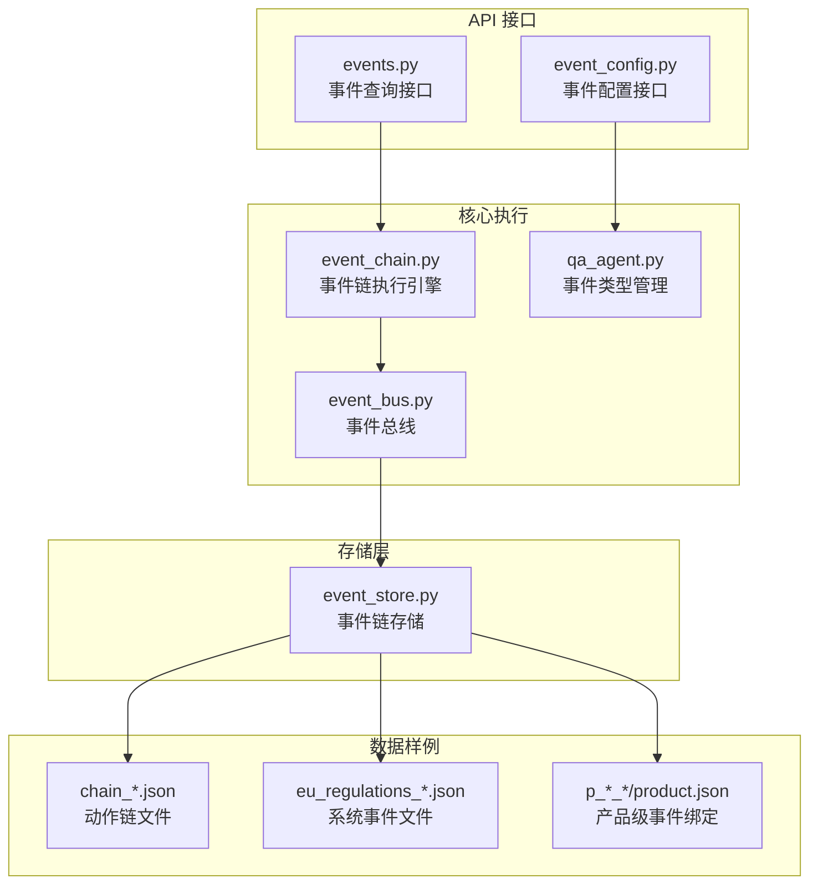
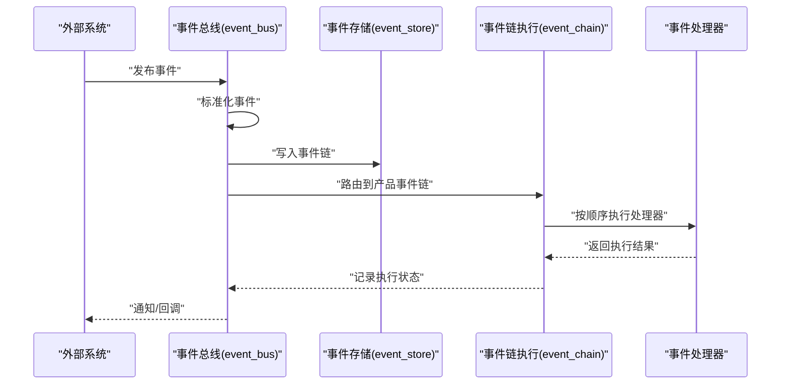
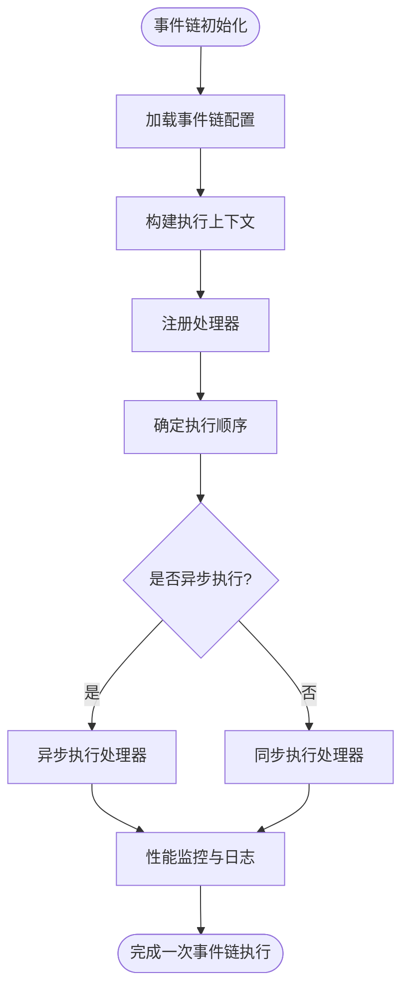
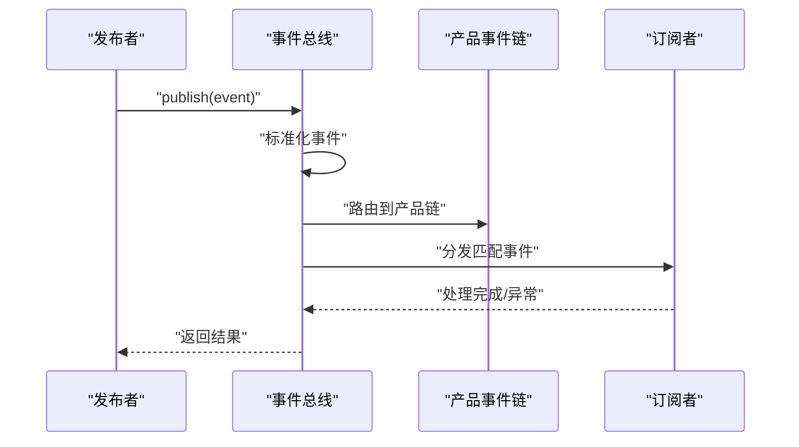
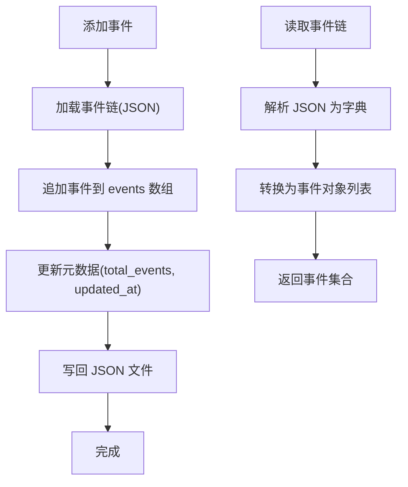
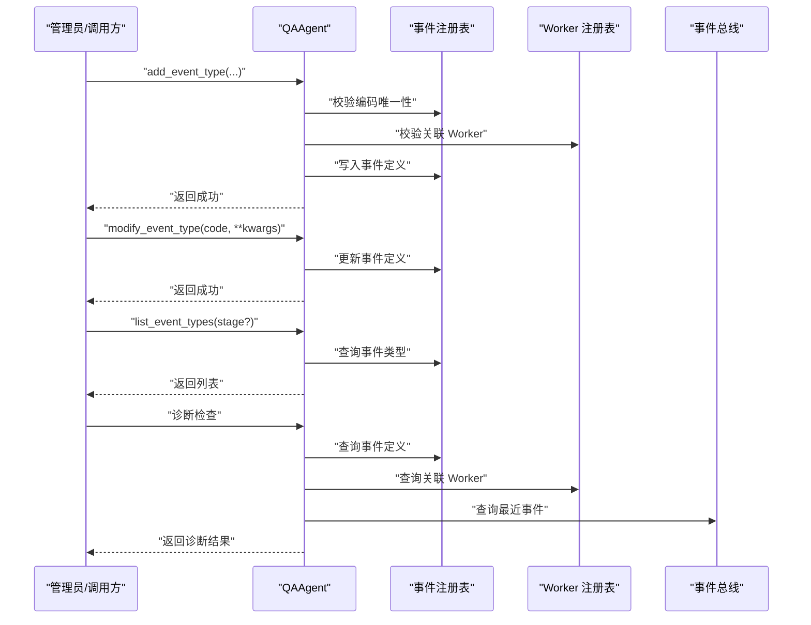
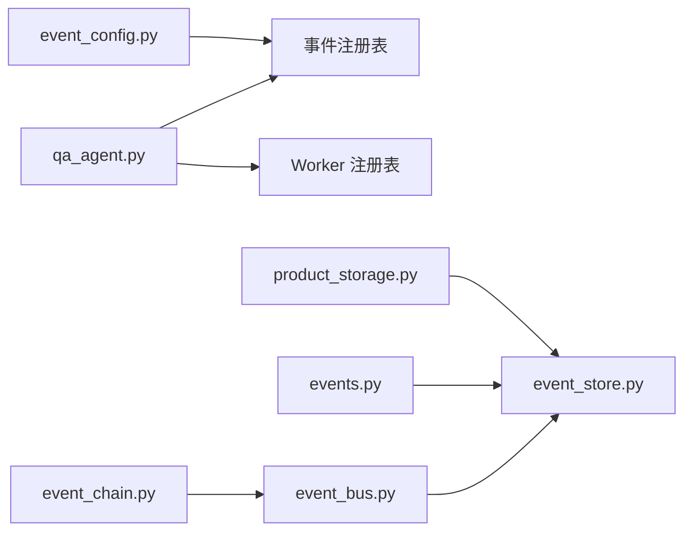

# 事件链执行

<cite>
**本文引用的文件**
- [event_chain.py](file://backend/app/core/event_chain.py)
- [event_bus.py](file://backend/app/core/event_bus.py)
- [event_store.py](file://backend/app/storage/event_store.py)
- [events.py](file://backend/app/api/events.py)
- [event_config.py](file://backend/app/api/event_config.py)
- [qa_agent.py](file://backend/app/core/qa_agent.py)
- [product_storage.py](file://backend/app/core/product_storage.py)
- [chain_2b1e9289634c.json](file://backend/data/chains/actions/chain_2b1e9289634c.json)
- [eu_regulations_2026.json](file://backend/data/global/events/eu_regulations_2026.json)
- [p_LED灯_04f33804.json](file://backend/data/products/p_LED灯_04f33804/product.json)
</cite>

## 目录
1. [引言](#引言)
2. [项目结构](#项目结构)
3. [核心组件](#核心组件)
4. [架构总览](#架构总览)
5. [详细组件分析](#详细组件分析)
6. [依赖关系分析](#依赖关系分析)
7. [性能考虑](#性能考虑)
8. [故障排查指南](#故障排查指南)
9. [结论](#结论)
10. [附录](#附录)

## 引言
本文件面向避风港平台的事件链执行系统，系统性阐述事件链(EventChain)的执行模型与生命周期管理，覆盖事件链初始化、事件处理器注册、事件执行顺序与异步处理机制；详解事件链的存储结构（事件链文件格式、事件序列化与反序列化）；说明事件链的动态扩展能力（运行时事件处理器添加、事件链重组与性能监控）；阐明事件链与产品级存储的关系（事件链与产品生命周期的绑定）；并提供调试工具、性能分析与故障排查指南。

## 项目结构
事件链相关代码主要分布在后端核心模块与存储层：
- 核心执行：event_chain.py（事件链执行引擎）、event_bus.py（事件总线与分发）、qa_agent.py（事件类型管理与诊断）
- API 接口：events.py（事件读取/查询）、event_config.py（事件配置管理）
- 存储层：event_store.py（事件链持久化与检索）
- 数据样例：backend/data/chains/actions 下的动作链 JSON 文件；backend/data/global/events 下的系统事件文件；backend/data/products 下的产品级事件与产品 JSON

**图表来源**
- [event_chain.py](file://backend/app/core/event_chain.py)
- [event_bus.py](file://backend/app/core/event_bus.py)
- [event_store.py](file://backend/app/storage/event_store.py)
- [events.py](file://backend/app/api/events.py)
- [event_config.py](file://backend/app/api/event_config.py)
- [qa_agent.py](file://backend/app/core/qa_agent.py)
- [chain_2b1e9289634c.json](file://backend/data/chains/actions/chain_2b1e9289634c.json)
- [eu_regulations_2026.json](file://backend/data/global/events/eu_regulations_2026.json)
- [p_LED灯_04f33804.json](file://backend/data/products/p_LED灯_04f33804/product.json)

**章节来源**
- [event_chain.py](file://backend/app/core/event_chain.py)
- [event_bus.py](file://backend/app/core/event_bus.py)
- [event_store.py](file://backend/app/storage/event_store.py)
- [events.py](file://backend/app/api/events.py)
- [event_config.py](file://backend/app/api/event_config.py)
- [qa_agent.py](file://backend/app/core/qa_agent.py)

## 核心组件
- 事件链执行引擎（event_chain.py）：负责事件链的初始化、处理器注册、执行顺序控制与异步调度。
- 事件总线（event_bus.py）：统一接收事件、标准化事件、路由至产品级事件链并分发给订阅者。
- 事件存储（event_store.py）：系统与用户事件链的持久化、读取、筛选与更新。
- 事件类型管理（qa_agent.py）：运行时新增/修改/删除事件类型定义，并与工作器（Worker）进行关联。
- 事件查询与配置接口（events.py、event_config.py）：对外暴露事件读取与事件配置管理能力。
- 产品级存储（product_storage.py）：产品生命周期与事件链的绑定关系维护。

**章节来源**
- [event_chain.py](file://backend/app/core/event_chain.py)
- [event_bus.py](file://backend/app/core/event_bus.py)
- [event_store.py](file://backend/app/storage/event_store.py)
- [qa_agent.py](file://backend/app/core/qa_agent.py)
- [events.py](file://backend/app/api/events.py)
- [event_config.py](file://backend/app/api/event_config.py)
- [product_storage.py](file://backend/app/core/product_storage.py)

## 架构总览
事件从产生到执行的关键流程如下：
- 事件产生：外部系统（如法规变更、Shopify Webhook）或内部系统触发事件。
- 事件发布：通过事件总线发布，进行标准化与路由。
- 事件持久化：写入系统事件链或用户事件链。
- 事件分发：根据事件类型与订阅关系分发给处理器。
- 事件链执行：事件链引擎按顺序执行处理器，支持异步与并发策略。
- 结果反馈：执行结果可写回产品级事件链或触发后续事件。

**图表来源**
- [event_bus.py](file://backend/app/core/event_bus.py)
- [event_store.py](file://backend/app/storage/event_store.py)
- [event_chain.py](file://backend/app/core/event_chain.py)

## 详细组件分析

### 事件链执行引擎（event_chain.py）
- 初始化：加载事件链配置，解析处理器列表，建立执行上下文。
- 处理器注册：支持在运行时动态注册处理器，实现事件链重组。
- 执行顺序：基于事件链定义的顺序执行，支持条件分支与并行执行策略。
- 异步处理：对耗时处理器采用异步执行，避免阻塞主流程。
- 性能监控：记录每个处理器的执行耗时、失败次数与重试策略，便于性能分析。

**图表来源**
- [event_chain.py](file://backend/app/core/event_chain.py)

**章节来源**
- [event_chain.py](file://backend/app/core/event_chain.py)

### 事件总线（event_bus.py）
- 事件标准化：根据事件类型自动分类，补充元数据。
- 全局与产品路由：事件进入全局事件总线后，根据产品上下文路由到对应产品事件链。
- 订阅分发：根据订阅过滤器与通道，将事件分发给匹配的处理器。
- 最近事件缓存：维护最近 N 条事件，便于快速查询与诊断。

**图表来源**
- [event_bus.py](file://backend/app/core/event_bus.py)

**章节来源**
- [event_bus.py](file://backend/app/core/event_bus.py)

### 事件存储（event_store.py）
- 存储位置：系统事件链位于 data_dir/event_chain/system_events，用户事件链位于 data_dir/event_chain/action_chains。
- 文件格式：JSON，包含事件链元数据（如 total_events、updated_at）与事件数组。
- 序列化/反序列化：事件对象转字典写入 JSON；读取时将字典还原为事件对象。
- 查询与筛选：支持按事件类型、来源、严重度等条件筛选事件，限制返回数量。

**图表来源**
- [event_store.py](file://backend/app/storage/event_store.py)

**章节来源**
- [event_store.py](file://backend/app/storage/event_store.py)

### 事件类型管理（qa_agent.py）
- 运行时新增事件类型：校验编码唯一性与关联 Worker 的存在，写入事件注册表。
- 修改与删除：支持修改事件定义字段与删除事件类型。
- 诊断查询：查询事件注册表、关联 Worker、事件总线状态，辅助排障。

**图表来源**
- [qa_agent.py](file://backend/app/core/qa_agent.py)

**章节来源**
- [qa_agent.py](file://backend/app/core/qa_agent.py)

### 事件查询与配置接口（events.py、event_config.py）
- 事件查询接口：提供按产品、事件类型、来源、严重度等条件查询事件链。
- 事件配置接口：提供事件类型的增删改查与批量导入导出能力。

**章节来源**
- [events.py](file://backend/app/api/events.py)
- [event_config.py](file://backend/app/api/event_config.py)

### 产品级存储与事件链绑定（product_storage.py）
- 产品生命周期：产品创建、更新、归档等阶段与事件链绑定。
- 事件链选择：根据产品所属市场/品类选择对应的系统事件链与用户事件链。
- 事件聚合：产品事件链汇总系统事件与用户操作事件，形成完整合规轨迹。

**章节来源**
- [product_storage.py](file://backend/app/core/product_storage.py)

## 依赖关系分析
事件链执行系统的核心依赖关系如下：
- 事件总线依赖事件存储进行持久化与读取。
- 事件链执行引擎依赖事件总线提供的标准化事件与路由。
- 事件类型管理依赖事件注册表与工作器注册表，确保事件与处理器正确关联。
- 产品级存储为事件链提供生命周期上下文，决定事件链的组合与展示。

**图表来源**
- [qa_agent.py](file://backend/app/core/qa_agent.py)
- [event_bus.py](file://backend/app/core/event_bus.py)
- [event_store.py](file://backend/app/storage/event_store.py)
- [event_chain.py](file://backend/app/core/event_chain.py)
- [events.py](file://backend/app/api/events.py)
- [event_config.py](file://backend/app/api/event_config.py)
- [product_storage.py](file://backend/app/core/product_storage.py)

**章节来源**
- [event_bus.py](file://backend/app/core/event_bus.py)
- [event_store.py](file://backend/app/storage/event_store.py)
- [event_chain.py](file://backend/app/core/event_chain.py)
- [qa_agent.py](file://backend/app/core/qa_agent.py)
- [events.py](file://backend/app/api/events.py)
- [event_config.py](file://backend/app/api/event_config.py)
- [product_storage.py](file://backend/app/core/product_storage.py)

## 性能考虑
- 异步执行：对 IO 密集型处理器采用异步执行，减少阻塞。
- 并发控制：限制并发度，避免资源争用与抖动。
- 缓存与批处理：最近事件缓存与事件批处理提升查询效率。
- 监控指标：记录处理器耗时、失败率、重试次数，定期生成性能报告。
- 存储优化：事件链文件按产品拆分，避免单文件过大；使用增量更新减少磁盘 IO。

## 故障排查指南
- 事件未到达处理器
  - 检查事件总线订阅过滤器与通道配置。
  - 使用事件总线的最近事件查询接口定位问题。
- 事件类型缺失
  - 通过事件类型管理接口确认事件定义是否存在。
  - 若缺失，使用新增接口注册事件类型并指定关联 Worker。
- 事件链未执行
  - 检查事件链执行引擎的处理器注册情况与执行顺序。
  - 查看性能监控日志，定位失败处理器。
- 产品事件链不完整
  - 核对产品级存储中的事件链绑定关系。
  - 确认系统事件链与用户事件链均已写入。

**章节来源**
- [event_bus.py](file://backend/app/core/event_bus.py)
- [qa_agent.py](file://backend/app/core/qa_agent.py)
- [event_chain.py](file://backend/app/core/event_chain.py)
- [product_storage.py](file://backend/app/core/product_storage.py)

## 结论
事件链执行系统通过“事件总线—事件存储—事件链执行引擎—事件类型管理”的协同，实现了事件的标准化、持久化、有序执行与动态扩展。结合产品级存储，事件链能够与产品生命周期紧密绑定，形成完整的合规与运营轨迹。建议在生产环境中持续完善性能监控与告警机制，确保事件链在高并发场景下的稳定性与可观测性。

## 附录

### 事件链文件格式与示例
- 系统事件链文件：位于 data_dir/event_chain/system_events/<chain_id>.json，包含 events 数组与元数据（如 total_events、updated_at）。
- 用户事件链文件：位于 data_dir/event_chain/action_chains/<user_id>.json，结构同上。
- 产品事件链文件：位于 data_dir/products/<product_id>/events/...，与产品 JSON 绑定。

参考样例路径：
- [chain_2b1e9289634c.json](file://backend/data/chains/actions/chain_2b1e9289634c.json)
- [eu_regulations_2026.json](file://backend/data/global/events/eu_regulations_2026.json)
- [p_LED灯_04f33804.json](file://backend/data/products/p_LED灯_04f33804/product.json)

**章节来源**
- [event_store.py](file://backend/app/storage/event_store.py)
- [chain_2b1e9289634c.json](file://backend/data/chains/actions/chain_2b1e9289634c.json)
- [eu_regulations_2026.json](file://backend/data/global/events/eu_regulations_2026.json)
- [p_LED灯_04f33804.json](file://backend/data/products/p_LED灯_04f33804/product.json)