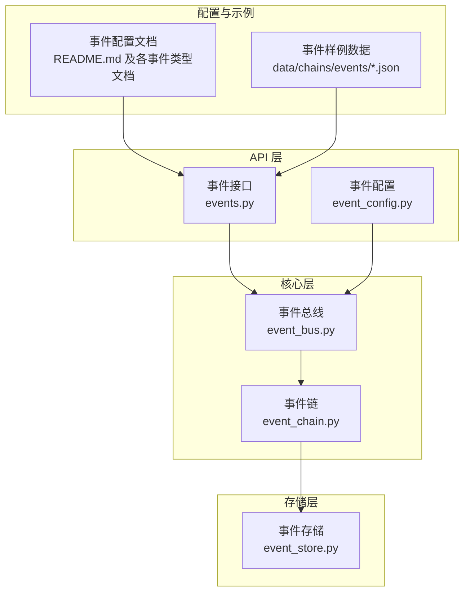
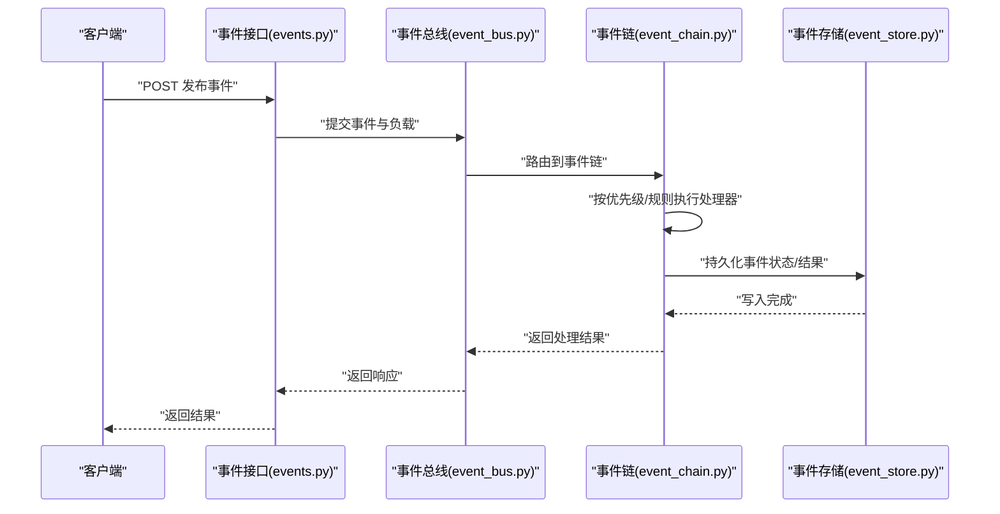
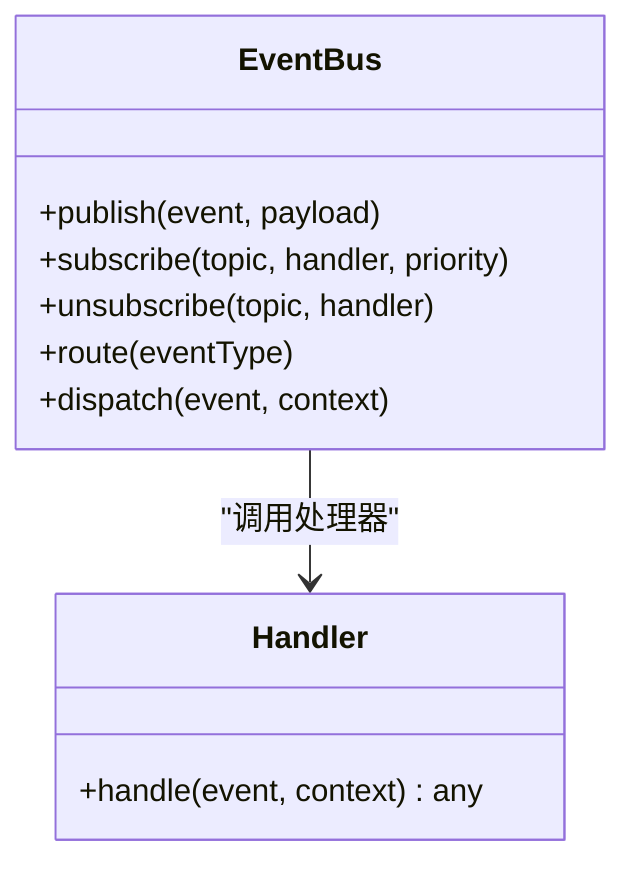
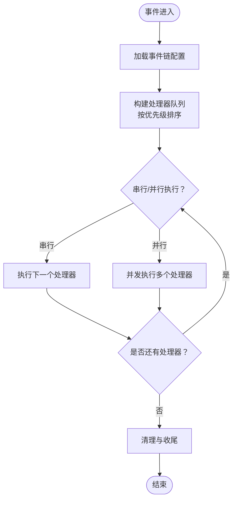
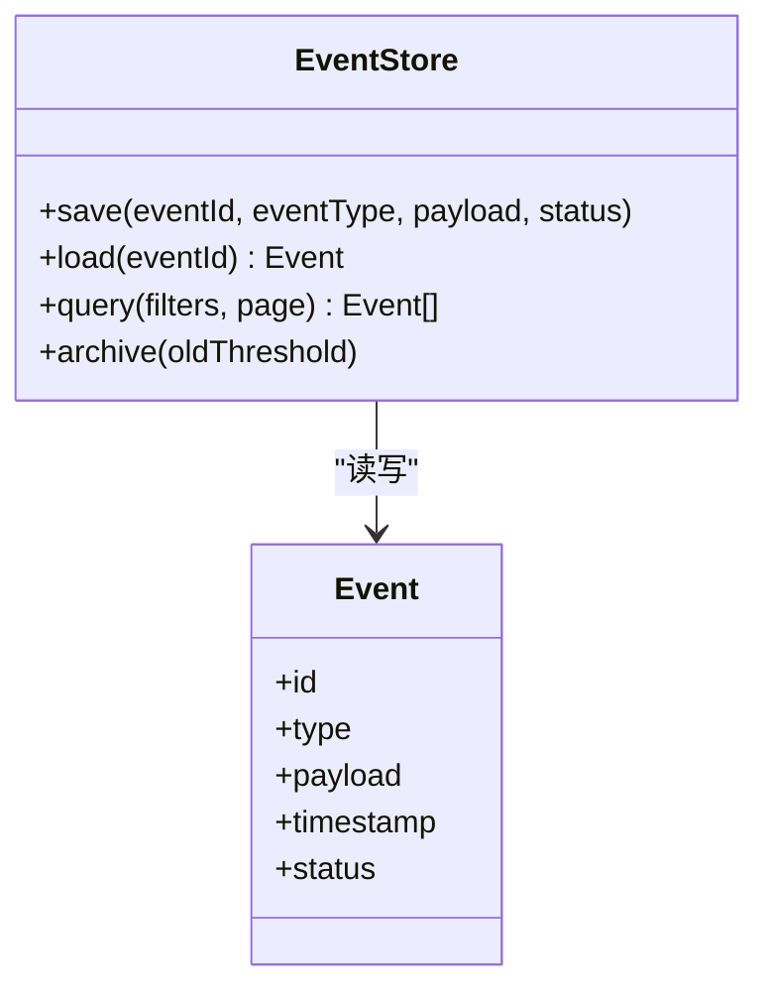
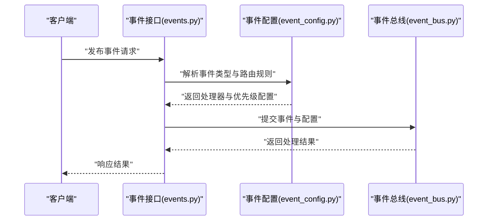
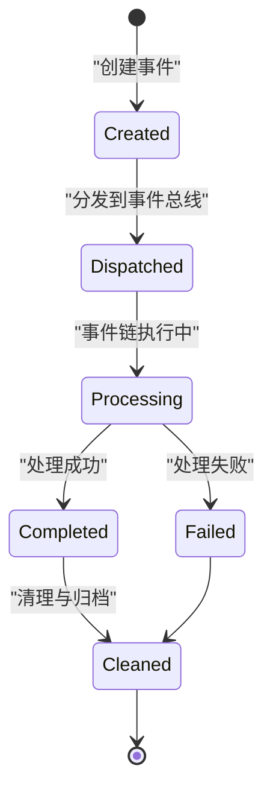
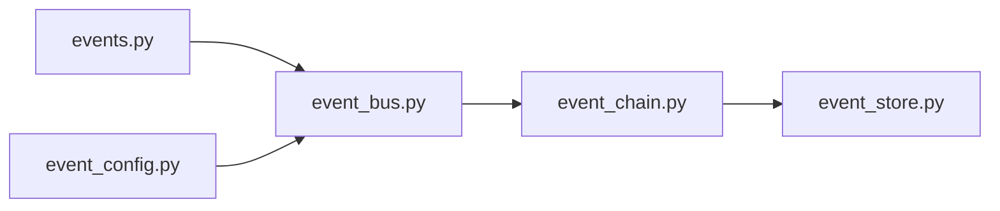

# 事件驱动系统

<cite>
**本文引用的文件**
- [event_bus.py](file://backend/app/core/event_bus.py)
- [event_chain.py](file://backend/app/core/event_chain.py)
- [event_store.py](file://backend/app/storage/event_store.py)
- [events.py](file://backend/app/api/events.py)
- [event_config.py](file://backend/app/api/event_config.py)
- [README.md](file://backend/data/config/events/README.md)
- [certification_events.md](file://backend/data/config/events/certification_events.md)
- [custom_events.md](file://backend/data/config/events/custom_events.md)
- [lifecycle_events.md](file://backend/data/config/events/lifecycle_events.md)
- [order_events.md](file://backend/data/config/events/order_events.md)
- [risk_alert_events.md](file://backend/data/config/events/risk_alert_events.md)
- [system_events.md](file://backend/data/config/events/system_events.md)
- [user_action_events.md](file://backend/data/config/events/user_action_events.md)
- [main.py](file://backend/app/main.py)
</cite>

## 目录
1. [引言](#引言)
2. [项目结构](#项目结构)
3. [核心组件](#核心组件)
4. [架构总览](#架构总览)
5. [详细组件分析](#详细组件分析)
6. [依赖关系分析](#依赖关系分析)
7. [性能考量](#性能考量)
8. [故障排查指南](#故障排查指南)
9. [结论](#结论)
10. [附录](#附录)

## 引言
本文件面向避风港平台的事件驱动系统，系统性阐述事件驱动架构（EDA）的核心理念与实现路径，聚焦于事件总线（Event Bus）的设计模式、事件链（Event Chain）的执行模型、事件生命周期管理以及事件类型与负载规范。文档以仓库中的核心实现文件为依据，结合事件配置与示例数据，帮助开发者快速理解并正确使用事件系统。

## 项目结构
事件驱动系统主要由以下模块构成：
- 核心层：事件总线与事件链的实现
- 存储层：事件持久化与检索
- API 层：事件入口与配置接口
- 配置与示例：事件类型定义与样例数据

图表来源
- [event_bus.py](file://backend/app/core/event_bus.py)
- [event_chain.py](file://backend/app/core/event_chain.py)
- [event_store.py](file://backend/app/storage/event_store.py)
- [events.py](file://backend/app/api/events.py)
- [event_config.py](file://backend/app/api/event_config.py)
- [README.md](file://backend/data/config/events/README.md)

章节来源
- [event_bus.py](file://backend/app/core/event_bus.py)
- [event_chain.py](file://backend/app/core/event_chain.py)
- [event_store.py](file://backend/app/storage/event_store.py)
- [events.py](file://backend/app/api/events.py)
- [event_config.py](file://backend/app/api/event_config.py)
- [README.md](file://backend/data/config/events/README.md)

## 核心组件
- 事件总线（Event Bus）
  - 负责事件的发布、订阅、路由与传播，是事件驱动系统的消息中枢。
  - 提供订阅者注册、事件分发、优先级排序与异步处理能力。
- 事件链（Event Chain）
  - 定义事件的处理序列与执行顺序，支持条件分支、并行与串行组合。
  - 维护处理器注册表、优先级与上下文传递。
- 事件存储（Event Store）
  - 提供事件的持久化、查询与归档，支撑审计与重放。
- 事件接口与配置（Events API / Event Config）
  - 对外暴露事件发布接口与事件配置管理接口，统一事件入口与治理。

章节来源
- [event_bus.py](file://backend/app/core/event_bus.py)
- [event_chain.py](file://backend/app/core/event_chain.py)
- [event_store.py](file://backend/app/storage/event_store.py)
- [events.py](file://backend/app/api/events.py)
- [event_config.py](file://backend/app/api/event_config.py)

## 架构总览
事件从 API 进入，经由事件总线进行路由与分发，再由事件链按序执行处理器，并最终写入事件存储。配置文档与样例数据为事件类型与负载提供参考。

图表来源
- [events.py](file://backend/app/api/events.py)
- [event_bus.py](file://backend/app/core/event_bus.py)
- [event_chain.py](file://backend/app/core/event_chain.py)
- [event_store.py](file://backend/app/storage/event_store.py)

## 详细组件分析

### 事件总线（Event Bus）
- 设计要点
  - 订阅/发布解耦：发布方无需感知订阅方；订阅方通过主题/标签订阅感兴趣事件。
  - 路由与传播：基于事件类型与过滤器进行路由，支持广播与点对点传播。
  - 优先级与并发：支持处理器优先级排序与异步并发执行，避免阻塞。
  - 错误隔离：单个处理器异常不影响整体流程，具备失败重试与降级策略。
- 关键职责
  - 注册订阅者与主题映射
  - 事件分发与上下文注入
  - 并发控制与超时管理
  - 异常捕获与可观测性上报

图表来源
- [event_bus.py](file://backend/app/core/event_bus.py)

章节来源
- [event_bus.py](file://backend/app/core/event_bus.py)

### 事件链（Event Chain）
- 设计要点
  - 处理器注册：动态注册处理器，支持优先级与条件过滤。
  - 执行模型：串行/并行组合，条件分支与回滚策略。
  - 上下文传递：在链内传递事件上下文，确保状态一致。
  - 生命周期：包含初始化、执行、清理阶段，支持幂等与去重。
- 关键职责
  - 解析事件链配置
  - 维护处理器队列与优先级
  - 执行与回滚
  - 清理资源与记录日志

图表来源
- [event_chain.py](file://backend/app/core/event_chain.py)

章节来源
- [event_chain.py](file://backend/app/core/event_chain.py)

### 事件存储（Event Store）
- 设计要点
  - 持久化：事件元数据、负载、时间戳、状态与结果。
  - 查询：按事件类型、时间范围、状态等维度检索。
  - 归档与清理：支持历史归档与过期清理策略。
- 关键职责
  - 写入事件与状态
  - 查询与分页
  - 导出与重放

图表来源
- [event_store.py](file://backend/app/storage/event_store.py)

章节来源
- [event_store.py](file://backend/app/storage/event_store.py)

### 事件接口与配置（Events API / Event Config）
- 事件接口（events.py）
  - 提供对外发布事件的 REST 接口，校验负载格式与权限。
  - 将请求转换为事件对象并交由事件总线处理。
- 事件配置（event_config.py）
  - 管理事件类型、处理器绑定、优先级与路由规则。
  - 支持动态更新与热配置生效。

图表来源
- [events.py](file://backend/app/api/events.py)
- [event_config.py](file://backend/app/api/event_config.py)
- [event_bus.py](file://backend/app/core/event_bus.py)

章节来源
- [events.py](file://backend/app/api/events.py)
- [event_config.py](file://backend/app/api/event_config.py)

### 事件类型定义与负载格式
- 事件类型
  - 系统事件、合规事件、证书事件、用户行为事件、订单事件、风险告警事件、生命周期事件、自定义事件等。
- 负载格式
  - 通用字段：事件标识、类型、时间戳、发起者、上下文扩展。
  - 业务字段：根据事件类型定义，如订单号、用户ID、产品信息、合规状态等。
- 示例与规范
  - 参考事件配置文档与样例数据，确保类型与负载一致性。

章节来源
- [README.md](file://backend/data/config/events/README.md)
- [certification_events.md](file://backend/data/config/events/certification_events.md)
- [custom_events.md](file://backend/data/config/events/custom_events.md)
- [lifecycle_events.md](file://backend/data/config/events/lifecycle_events.md)
- [order_events.md](file://backend/data/config/events/order_events.md)
- [risk_alert_events.md](file://backend/data/config/events/risk_alert_events.md)
- [system_events.md](file://backend/data/config/events/system_events.md)
- [user_action_events.md](file://backend/data/config/events/user_action_events.md)

### 事件生命周期管理
- 创建：接口层接收请求，生成事件对象与负载。
- 分发：事件总线根据配置进行路由与分发。
- 处理：事件链按序执行处理器，支持异步与并发。
- 清理：完成或失败后清理资源，记录状态与审计日志。

图表来源
- [event_bus.py](file://backend/app/core/event_bus.py)
- [event_chain.py](file://backend/app/core/event_chain.py)
- [event_store.py](file://backend/app/storage/event_store.py)

章节来源
- [event_bus.py](file://backend/app/core/event_bus.py)
- [event_chain.py](file://backend/app/core/event_chain.py)
- [event_store.py](file://backend/app/storage/event_store.py)

## 依赖关系分析
- 组件耦合
  - 事件接口依赖事件总线与配置模块。
  - 事件总线依赖事件链与存储模块。
  - 事件链依赖存储模块进行状态持久化。
- 外部依赖
  - 配置文档与样例数据为事件类型与负载提供约束与参考。
- 循环依赖
  - 当前设计避免循环依赖，采用单向数据流。

图表来源
- [events.py](file://backend/app/api/events.py)
- [event_config.py](file://backend/app/api/event_config.py)
- [event_bus.py](file://backend/app/core/event_bus.py)
- [event_chain.py](file://backend/app/core/event_chain.py)
- [event_store.py](file://backend/app/storage/event_store.py)

章节来源
- [events.py](file://backend/app/api/events.py)
- [event_config.py](file://backend/app/api/event_config.py)
- [event_bus.py](file://backend/app/core/event_bus.py)
- [event_chain.py](file://backend/app/core/event_chain.py)
- [event_store.py](file://backend/app/storage/event_store.py)

## 性能考量
- 异步与并发
  - 使用异步处理器与并发执行，降低端到端延迟。
- 背压与限流
  - 在高吞吐场景下引入背压与限流策略，避免资源耗尽。
- 缓存与批处理
  - 对热点事件进行缓存与批处理，减少重复计算与 IO。
- 存储优化
  - 合理分区与索引，提升查询效率；定期归档冷数据。

## 故障排查指南
- 常见问题
  - 事件未被消费：检查订阅者注册与主题匹配。
  - 处理器异常：查看事件链回滚与重试策略，定位失败处理器。
  - 数据不一致：核对事件存储写入与状态同步。
- 排查步骤
  - 从事件接口开始，追踪到事件总线、事件链与存储。
  - 结合配置文档与样例数据，验证事件类型与负载。
  - 查看日志与指标，定位瓶颈与异常点。

章节来源
- [event_bus.py](file://backend/app/core/event_bus.py)
- [event_chain.py](file://backend/app/core/event_chain.py)
- [event_store.py](file://backend/app/storage/event_store.py)
- [events.py](file://backend/app/api/events.py)
- [event_config.py](file://backend/app/api/event_config.py)

## 结论
避风港平台的事件驱动系统以事件总线为核心，结合事件链与事件存储，实现了高内聚、低耦合的事件处理流水线。通过完善的事件类型定义、负载规范与生命周期管理，系统能够稳定支撑多类业务场景。建议在生产环境中进一步完善监控、限流与重试策略，持续优化事件链的执行效率与可靠性。

## 附录
- 快速上手
  - 定义事件类型与负载，参考事件配置文档与样例数据。
  - 通过事件接口发布事件，观察事件总线与事件链的处理结果。
  - 使用事件存储查询与审计事件状态。
- 最佳实践
  - 明确事件边界与职责，避免过度耦合。
  - 为关键事件设置优先级与重试策略。
  - 定期清理与归档历史事件，保持系统健康运行。