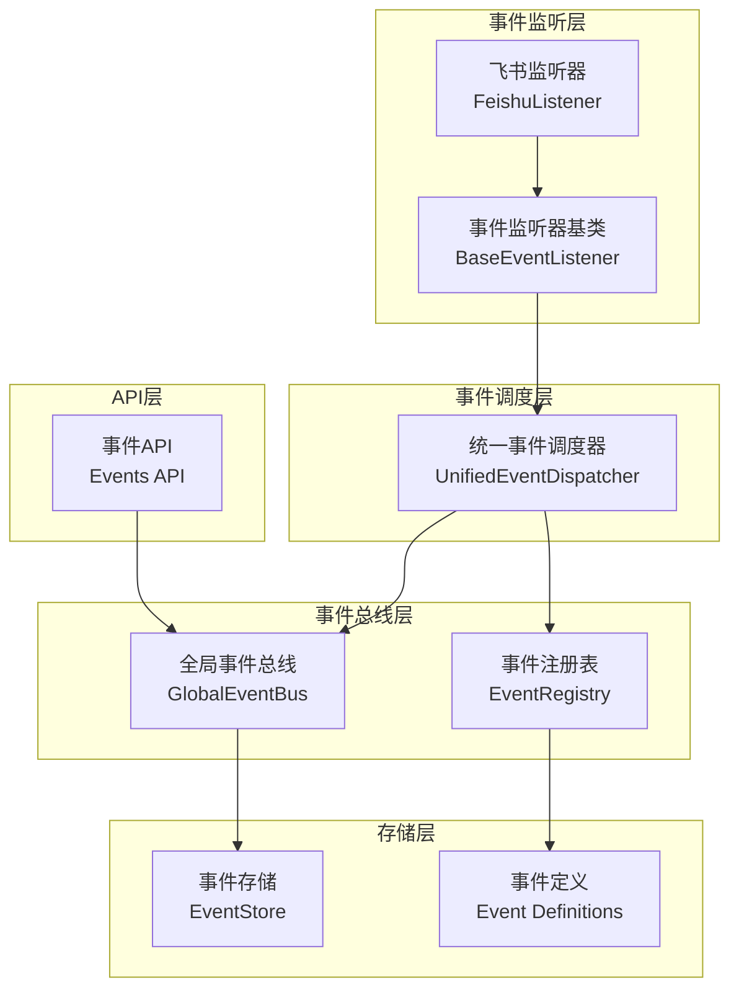
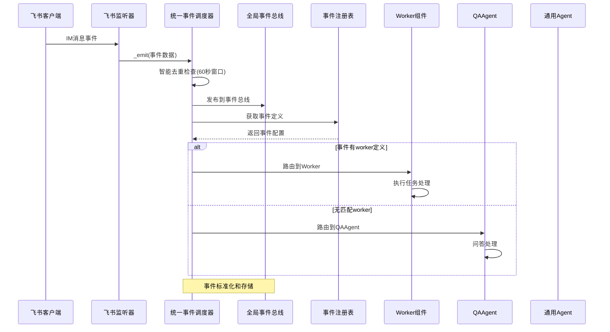
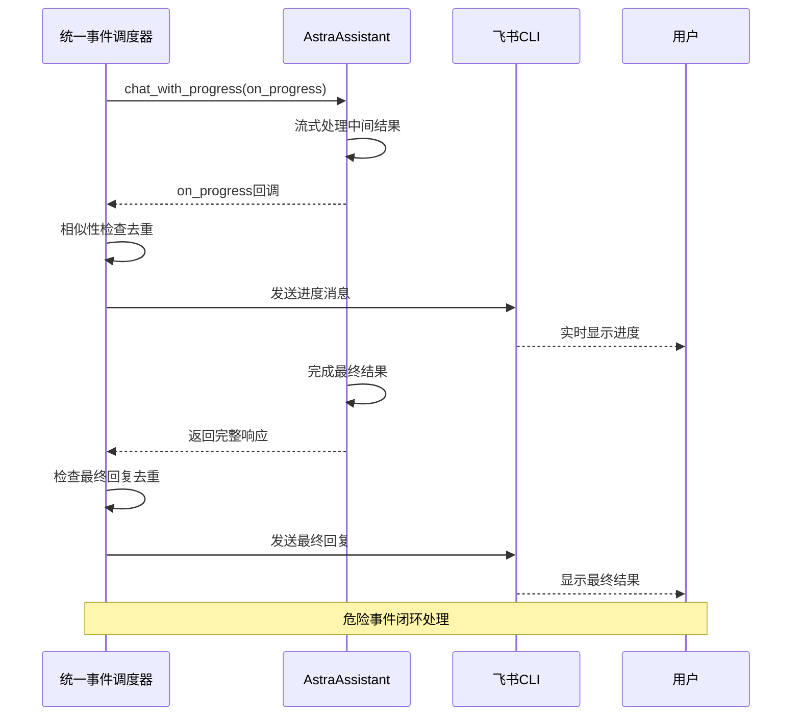
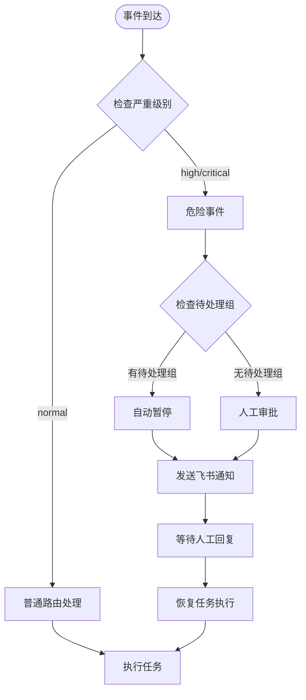
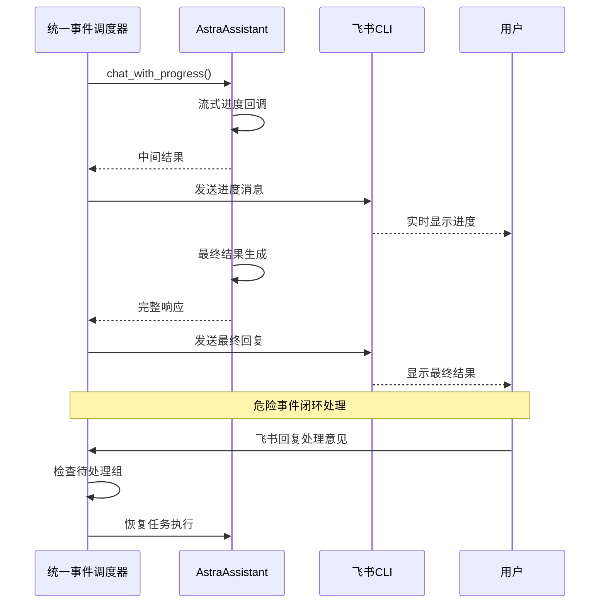
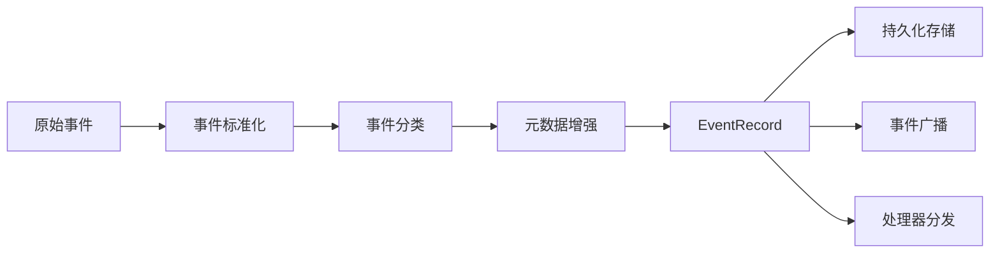
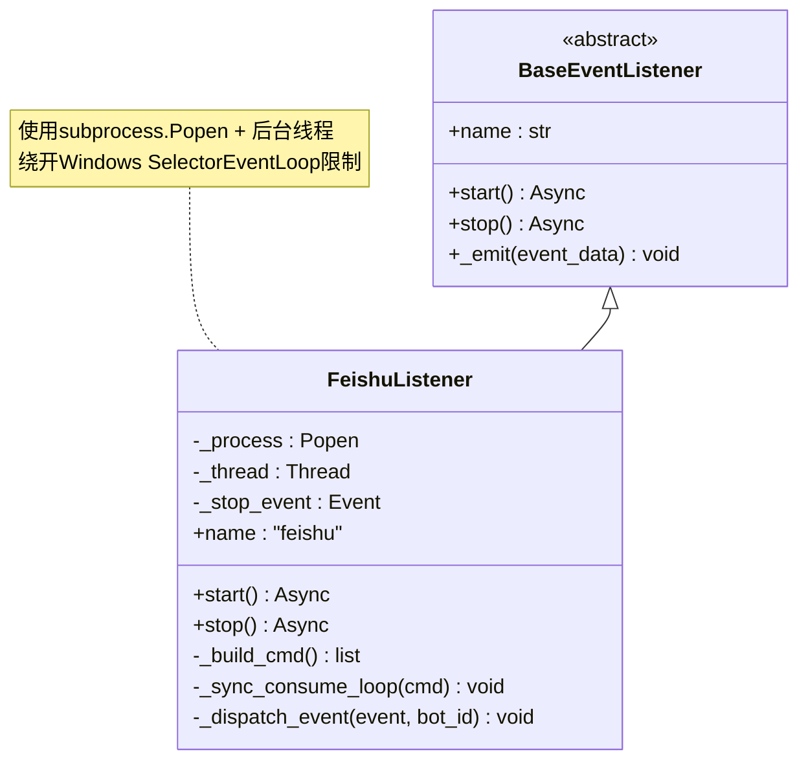
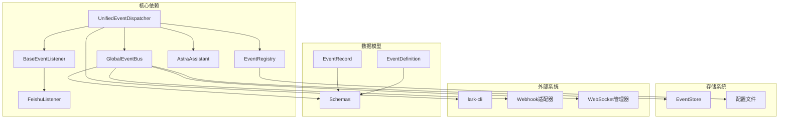

# 统一事件调度器

<cite>
**本文档引用的文件**
- [unified_dispatcher.py](file://backend/app/core/unified_dispatcher.py)
- [event_bus.py](file://backend/app/core/event_bus.py)
- [events.py](file://backend/app/api/events.py)
- [event_store.py](file://backend/app/storage/event_store.py)
- [base.py](file://backend/app/core/event_listeners/base.py)
- [feishu_listener.py](file://backend/app/core/event_listeners/feishu_listener.py)
- [schemas.py](file://backend/app/models/schemas.py)
- [_event_map.yaml](file://backend/data/config/workflows/_event_map.yaml)
- [system_events.md](file://backend/data/events/builtin/system_events.md)
- [compliance_events.md](file://backend/data/events/builtin/compliance_events.md)
- [astra_assistant.py](file://backend/app/services/astra_assistant.py)
</cite>

## 更新摘要
**所做更改**
- 新增智能重复消息检测逻辑的详细分析
- 添加相似性检查算法的技术实现说明
- 更新进度回调监控功能的架构描述
- 增强通用Agent处理流程的实时性保障机制
- 完善危险事件闭环处理的技术细节

## 目录
1. [简介](#简介)
2. [项目结构](#项目结构)
3. [核心组件](#核心组件)
4. [架构概览](#架构概览)
5. [详细组件分析](#详细组件分析)
6. [依赖关系分析](#依赖关系分析)
7. [性能考虑](#性能考虑)
8. [故障排除指南](#故障排除指南)
9. [结论](#结论)

## 简介

统一事件调度器是避风港OS级合规智能体的核心枢纽，负责整合和协调来自不同外部事件源的数据流。该系统实现了"事件驱动的合规流水线"，通过统一的事件处理框架，将飞书、未来钉钉/企微等外部平台的消息转换为标准化的内部事件，并通过配置驱动的方式路由到相应的处理组件。

该调度器采用事件总线模式，支持多种事件类型和处理策略，包括系统运维事件、合规检查事件、法规变更事件等。通过配置文件驱动的事件定义机制，系统能够灵活地扩展新的事件类型和处理逻辑。

**重大改进**：系统现已集成智能重复消息检测逻辑、先进的相似性检查算法和实时进度回调监控功能，显著提升了事件处理的可靠性和用户体验。

## 项目结构



**图表来源**
- [unified_dispatcher.py:1-443](file://backend/app/core/unified_dispatcher.py#L1-L443)
- [event_bus.py:1-820](file://backend/app/core/event_bus.py#L1-L820)
- [feishu_listener.py:1-263](file://backend/app/core/event_listeners/feishu_listener.py#L1-L263)

**章节来源**
- [unified_dispatcher.py:1-443](file://backend/app/core/unified_dispatcher.py#L1-L443)
- [event_bus.py:1-820](file://backend/app/core/event_bus.py#L1-L820)
- [feishu_listener.py:1-263](file://backend/app/core/event_listeners/feishu_listener.py#L1-L263)

## 核心组件

### 统一事件调度器 (UnifiedEventDispatcher)

统一事件调度器是整个事件处理系统的核心控制器，负责：

- **事件入口管理**：接收来自各种外部监听器的事件数据
- **智能消息去重**：基于message_id的60秒去重窗口，防止同一消息的重复处理
- **事件标准化**：将外部事件转换为内部标准格式
- **配置驱动路由**：根据事件定义将事件路由到相应处理组件
- **危险事件管控**：对高风险事件进行人工审批控制
- **实时进度监控**：通过流式回调机制监控处理进度

### 全局事件总线 (GlobalEventBus)

全局事件总线提供事件的标准化处理和分发功能：

- **事件标准化管道**：将原始事件转换为标准的EventRecord格式
- **跨产品事件广播**：支持全局事件和产品级事件的分离处理
- **事件订阅分发**：支持多种订阅方式（精准/批量/全局/条件）
- **事件存储管理**：维护事件的历史记录和统计信息

### 事件监听器基类 (BaseEventListener)

事件监听器基类定义了所有外部事件源的标准接口：

- **异步事件监听**：支持多种外部平台的实时事件监听
- **事件回调机制**：提供统一的事件回调接口
- **线程安全设计**：支持从后台线程安全地调度事件处理

**章节来源**
- [unified_dispatcher.py:33-443](file://backend/app/core/unified_dispatcher.py#L33-L443)
- [event_bus.py:121-820](file://backend/app/core/event_bus.py#L121-L820)
- [base.py:15-61](file://backend/app/core/event_listeners/base.py#L15-L61)

## 架构概览



**图表来源**
- [unified_dispatcher.py:70-134](file://backend/app/core/unified_dispatcher.py#L70-L134)
- [event_bus.py:156-194](file://backend/app/core/event_bus.py#L156-L194)

## 详细组件分析

### 统一事件调度器深度分析

#### 智能重复消息检测逻辑

系统实现了多层次的消息去重机制：

```mermaid
flowchart TD
Start([事件到达]) --> CheckMessageId{检查message_id}
CheckMessageId --> |有message_id| CheckWindow{60秒窗口检查}
CheckMessageId --> |无message_id| ProcessEvent[处理事件]
CheckWindow --> |在窗口内| SkipEvent[跳过重复事件]
CheckWindow --> |超过60秒| UpdateCache[更新去重缓存]
UpdateCache --> ProcessEvent
SkipEvent --> CleanupCache[清理过期记录(120秒)]
ProcessEvent --> PublishBus[发布到事件总线]
CleanupCache --> PublishBus
```

**关键特性**：
- **60秒去重窗口**：防止同一消息在短时间内重复触发
- **120秒缓存清理**：自动清理过期的去重记录，避免内存泄漏
- **智能缓存管理**：动态维护去重状态，支持高并发场景

#### 相似性检查算法

系统采用多维度相似性检测算法，确保消息去重的准确性：

```mermaid
flowchart TD
Input[输入两条消息] --> CheckExact{完全相同?}
CheckExact --> |是| Similar[标记相似]
CheckExact --> |否| CheckFirst100{前100字符相同?}
CheckFirst100 --> |是| Similar
CheckFirst100 --> |否| CheckShort{短消息(<50字)?}
CheckShort --> |否| NotSimilar[标记不相似]
CheckShort --> |是| CheckContains{互相包含?}
CheckContains --> |是| Similar
CheckContains --> |否| NotSimilar
```

**算法策略**：
- **完全匹配**：字符串完全相等
- **前缀匹配**：前100个字符完全相同（处理截断差异）
- **包含关系**：短消息之间的相互包含关系

#### 实时进度回调监控功能

通用Agent处理流程集成了强大的进度监控机制：



**监控机制**：
- **实时进度推送**：通过流式回调实时推送处理进度
- **智能去重保护**：防止重复进度消息的发送
- **工具调用追踪**：记录和追踪工具调用次数
- **最终结果去重**：确保最终回复不会与进度消息重复

#### 危险事件处理机制

系统对危险事件（severity=high/critical）实施特殊处理：



**图表来源**
- [unified_dispatcher.py:145-186](file://backend/app/core/unified_dispatcher.py#L145-L186)

#### 通用Agent处理流程

对于无匹配worker的事件，系统通过通用Agent进行处理：



**图表来源**
- [unified_dispatcher.py:197-332](file://backend/app/core/unified_dispatcher.py#L197-L332)

**章节来源**
- [unified_dispatcher.py:70-332](file://backend/app/core/unified_dispatcher.py#L70-L332)
- [astra_assistant.py:700-899](file://backend/app/services/astra_assistant.py#L700-L899)

### 事件总线系统分析

#### 事件标准化管道

事件总线实现了完整的事件标准化流程：



**图表来源**
- [event_bus.py:82-118](file://backend/app/core/event_bus.py#L82-L118)

#### 订阅管理系统

事件总线支持四种订阅方式：

| 订阅类型 | 描述 | 过滤条件 |
|---------|------|----------|
| 精准订阅 | 按产品ID精确匹配 | product_ids |
| 批量订阅 | 按标签批量匹配 | tags |
| 全局订阅 | 接收所有事件 | 无过滤 |
| 条件订阅 | 基于表达式的动态过滤 | condition_expr |

**章节来源**
- [event_bus.py:121-523](file://backend/app/core/event_bus.py#L121-L523)

### 事件监听器系统

#### 飞书监听器实现

飞书监听器采用独特的实现策略：



**图表来源**
- [base.py:15-61](file://backend/app/core/event_listeners/base.py#L15-L61)
- [feishu_listener.py:27-263](file://backend/app/core/event_listeners/feishu_listener.py#L27-L263)

#### 多平台支持

系统支持多种外部事件源：

- **飞书**：IM消息接收和处理
- **未来钉钉/企微**：通过扩展监听器支持
- **Shopify Webhook**：产品和订单事件
- **系统心跳**：APScheduler定时任务

**章节来源**
- [feishu_listener.py:41-155](file://backend/app/core/event_listeners/feishu_listener.py#L41-L155)
- [base.py:28-36](file://backend/app/core/event_listeners/base.py#L28-L36)

## 依赖关系分析



**图表来源**
- [unified_dispatcher.py:27-443](file://backend/app/core/unified_dispatcher.py#L27-L443)
- [event_bus.py:32-820](file://backend/app/core/event_bus.py#L32-L820)

### 组件耦合度分析

系统采用了松耦合的设计模式：

- **监听器与调度器**：通过BaseEventListener接口解耦
- **事件总线与处理器**：通过事件类型和订阅机制解耦  
- **配置与实现**：通过YAML配置文件实现运行时配置
- **存储层**：独立的事件存储，支持历史追溯
- **SDK集成**：与AstraAssistant的松耦合集成

**章节来源**
- [unified_dispatcher.py:44-66](file://backend/app/core/unified_dispatcher.py#L44-L66)
- [event_bus.py:196-250](file://backend/app/core/event_bus.py#L196-L250)

## 性能考虑

### 异步处理优化

系统采用异步编程模式优化性能：

- **事件处理并发**：多个监听器可以并行处理事件
- **I/O密集型优化**：使用asyncio处理网络I/O操作
- **内存管理**：限制最近事件数量，避免内存泄漏

### 缓存策略

- **智能去重缓存**：60秒消息去重窗口，120秒自动清理
- **配置缓存**：事件定义的内存缓存
- **处理器缓存**：常用处理器的实例缓存
- **进度监控缓存**：实时进度消息的去重缓冲

### 扩展性设计

- **插件化监听器**：支持新增外部事件源
- **动态事件定义**：运行时注册新的事件类型
- **可配置路由**：支持灵活的事件路由策略
- **流式处理**：支持实时进度监控和反馈

## 故障排除指南

### 常见问题及解决方案

#### 事件重复处理

**问题现象**：同一消息被多次处理
**解决方法**：检查消息去重机制，确认message_id字段正确设置

#### 相似性检查误判

**问题现象**：正常不同的消息被判定为相似
**解决方法**：
1. 检查相似性算法参数配置
2. 验证消息内容的编码格式
3. 确认去重缓存状态

#### 进度回调丢失

**问题现象**：用户无法看到实时进度
**解决方法**：
1. 检查AstraAssistant的chat_with_progress方法
2. 验证on_progress回调函数的实现
3. 确认lark-cli的通信状态

#### 飞书集成问题

**问题现象**：飞书消息无法接收或处理
**解决方法**：
1. 检查lark-cli安装和配置
2. 验证bot权限设置
3. 确认事件监听器正常运行

**章节来源**
- [unified_dispatcher.py:82-92](file://backend/app/core/unified_dispatcher.py#L82-L92)
- [feishu_listener.py:176-263](file://backend/app/core/event_listeners/feishu_listener.py#L176-L263)

## 结论

统一事件调度器作为避风港OS级合规智能体的核心基础设施，成功实现了以下目标：

1. **统一事件入口**：整合多种外部事件源，提供一致的事件处理体验
2. **智能去重机制**：通过多层次的去重策略确保事件处理的准确性
3. **实时监控能力**：集成进度回调监控，提升用户体验
4. **配置驱动架构**：通过事件定义文件实现灵活的业务逻辑扩展
5. **事件驱动流水线**：支持复杂的合规检查和风险管控流程
6. **可扩展性设计**：模块化架构支持新功能的快速集成

**重大技术突破**：
- **智能重复消息检测**：60秒去重窗口配合120秒缓存清理机制
- **先进相似性算法**：多维度消息相似性检测，支持完全匹配、前缀匹配和包含关系
- **实时进度监控**：流式回调机制确保用户获得及时的处理反馈

该系统通过事件总线模式实现了高内聚、低耦合的架构设计，为后续的功能扩展和性能优化奠定了坚实基础。其配置驱动的事件定义机制使得业务逻辑的变更更加灵活，减少了代码层面的修改需求。智能去重和实时监控功能的集成，显著提升了系统的可靠性和用户体验。