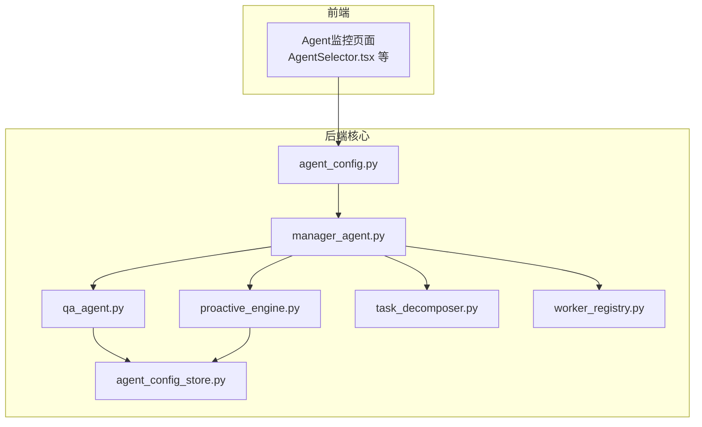
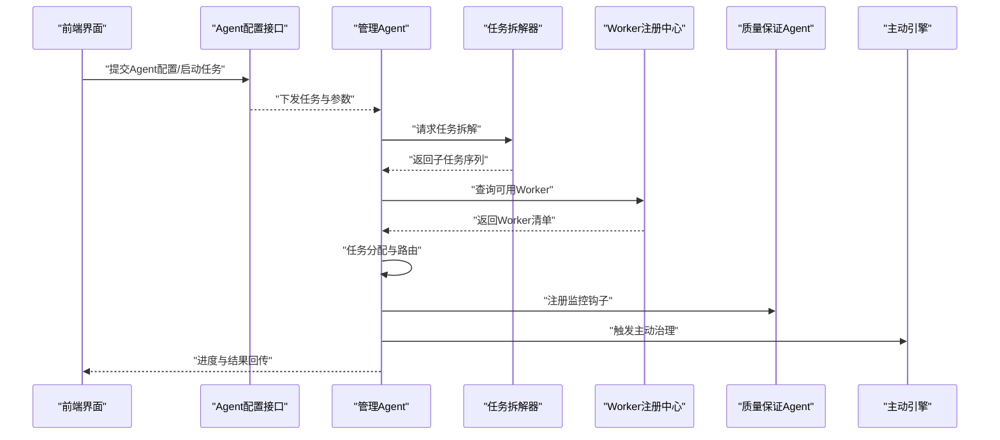
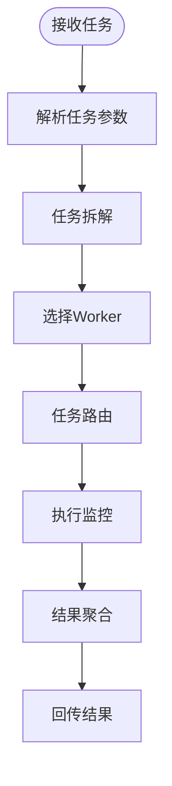
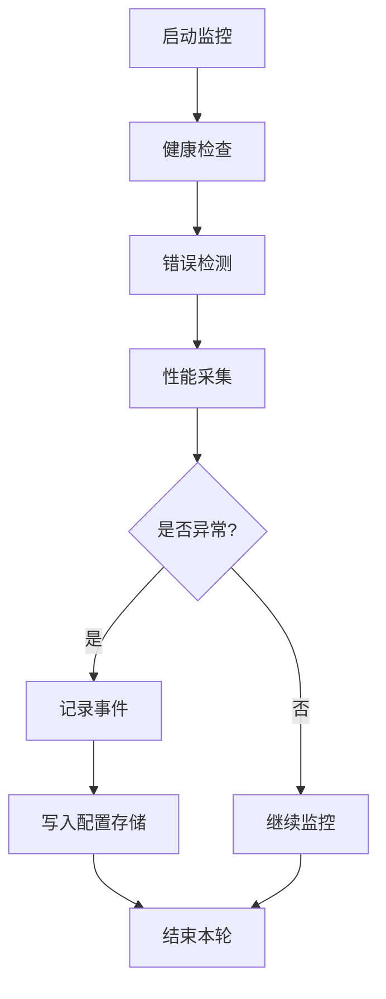
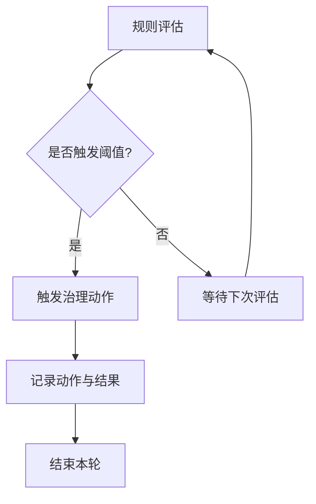
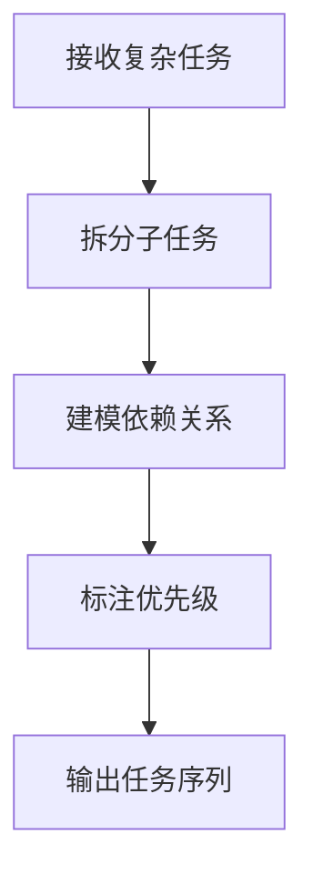
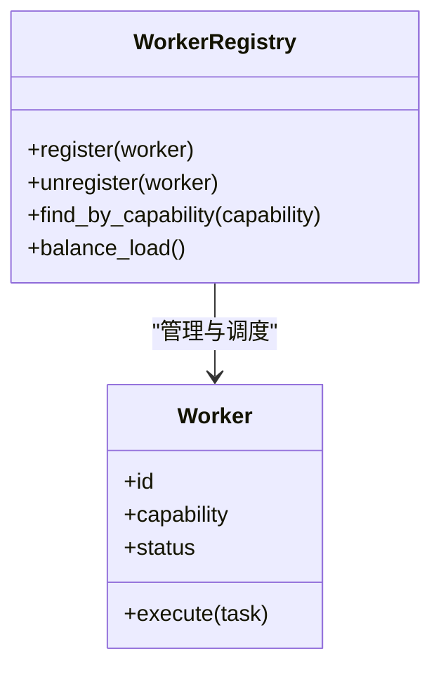
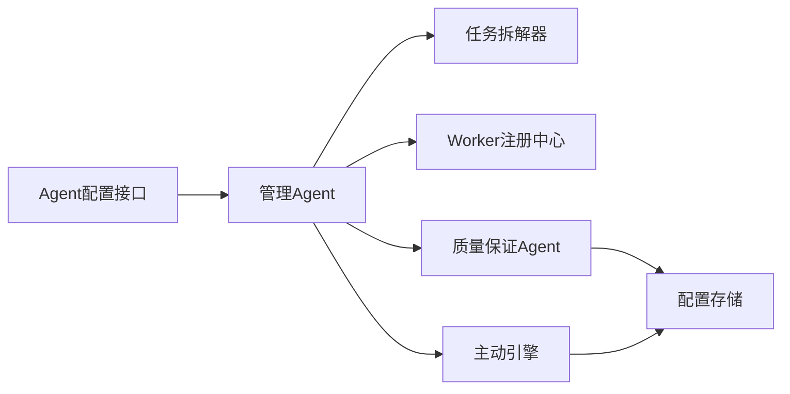

# Agent类型与角色

<cite>
**本文引用的文件**
- [manager_agent.py](file://backend/app/core/manager_agent.py)
- [qa_agent.py](file://backend/app/core/qa_agent.py)
- [proactive_engine.py](file://backend/app/core/proactive_engine.py)
- [task_decomposer.py](file://backend/app/core/task_decomposer.py)
- [agent_config.py](file://backend/app/api/agent_config.py)
- [agent_config_store.py](file://backend/app/storage/agent_config_store.py)
- [worker_registry.py](file://backend/app/core/worker_registry.py)
- [_check_agents.py](file://backend/tests/archived/_check_agents.py)
- [README.md](file://README.md)
</cite>

## 目录
1. [引言](#引言)
2. [项目结构](#项目结构)
3. [核心组件](#核心组件)
4. [架构总览](#架构总览)
5. [详细组件分析](#详细组件分析)
6. [依赖关系分析](#依赖关系分析)
7. [性能考虑](#性能考虑)
8. [故障排查指南](#故障排查指南)
9. [结论](#结论)
10. [附录](#附录)

## 引言
本文件面向避风港平台的多Agent系统，系统性梳理Agent类型与其职责分工，重点阐述管理Agent（Manager Agent）作为协调者的角色：任务接收、拆解、分配与监控；质量保证Agent（QA Agent）在系统诊断、错误检测与性能监控方面的职责；以及Worker Agent、Proactive Engine等其他Agent类型的定位与协作方式。同时给出业务阶段分类与优先级机制、角色选择与配置最佳实践，并结合仓库中现有实现路径提供可参考的应用场景与代码示例。

## 项目结构
围绕Agent体系的核心代码主要位于后端模块 backend/app/core 与 backend/app/api 下，分别承担“运行时编排”“配置与存储”“任务拆解”“质量保障”“主动治理”等职责。前端侧提供Agent监控与配置界面，便于用户进行角色选择与流程可视化。

图表来源
- [manager_agent.py](file://backend/app/core/manager_agent.py)
- [qa_agent.py](file://backend/app/core/qa_agent.py)
- [proactive_engine.py](file://backend/app/core/proactive_engine.py)
- [task_decomposer.py](file://backend/app/core/task_decomposer.py)
- [worker_registry.py](file://backend/app/core/worker_registry.py)
- [agent_config.py](file://backend/app/api/agent_config.py)
- [agent_config_store.py](file://backend/app/storage/agent_config_store.py)

章节来源
- [README.md](file://README.md)

## 核心组件
- 管理Agent（Manager Agent）
  - 职责：接收任务请求，进行任务拆解与分配，协调Worker Agent执行，监控执行状态与结果。
  - 关键实现位置：[manager_agent.py](file://backend/app/core/manager_agent.py)
- 质量保证Agent（QA Agent）
  - 职责：系统诊断、错误检测、性能监控与告警，保障整体流程稳定性。
  - 关键实现位置：[qa_agent.py](file://backend/app/core/qa_agent.py)
- 主动引擎（Proactive Engine）
  - 职责：基于规则或策略主动触发治理动作，预防风险与异常。
  - 关键实现位置：[proactive_engine.py](file://backend/app/core/proactive_engine.py)
- 任务拆解器（Task Decomposer）
  - 职责：将复杂任务拆分为可执行的子任务序列，支持优先级与依赖管理。
  - 关键实现位置：[task_decomposer.py](file://backend/app/core/task_decomposer.py)
- Worker注册中心（Worker Registry）
  - 职责：维护可用Worker Agent清单与能力映射，供管理Agent按需调度。
  - 关键实现位置：[worker_registry.py](file://backend/app/core/worker_registry.py)
- Agent配置与存储
  - 配置接口：[agent_config.py](file://backend/app/api/agent_config.py)
  - 配置存储：[agent_config_store.py](file://backend/app/storage/agent_config_store.py)
- 角色校验与测试
  - 测试脚本：[_check_agents.py](file://backend/tests/archived/_check_agents.py)

章节来源
- [manager_agent.py](file://backend/app/core/manager_agent.py)
- [qa_agent.py](file://backend/app/core/qa_agent.py)
- [proactive_engine.py](file://backend/app/core/proactive_engine.py)
- [task_decomposer.py](file://backend/app/core/task_decomposer.py)
- [worker_registry.py](file://backend/app/core/worker_registry.py)
- [agent_config.py](file://backend/app/api/agent_config.py)
- [agent_config_store.py](file://backend/app/storage/agent_config_store.py)
- [_check_agents.py](file://backend/tests/archived/_check_agents.py)

## 架构总览
下图展示从API入口到各Agent组件的调用链路与数据流，体现管理Agent作为中枢的协调作用。

图表来源
- [agent_config.py](file://backend/app/api/agent_config.py)
- [manager_agent.py](file://backend/app/core/manager_agent.py)
- [task_decomposer.py](file://backend/app/core/task_decomposer.py)
- [worker_registry.py](file://backend/app/core/worker_registry.py)
- [qa_agent.py](file://backend/app/core/qa_agent.py)
- [proactive_engine.py](file://backend/app/core/proactive_engine.py)

## 详细组件分析

### 管理Agent（Manager Agent）
- 角色定位
  - 协调者：统一接收任务，驱动任务拆解、Worker分配、执行监控与结果汇总。
  - 决策中枢：根据业务阶段与优先级策略，动态调整任务路由与资源分配。
- 关键职责
  - 任务接收与解析：从API层接收任务请求，标准化输入格式。
  - 任务拆解：委托任务拆解器生成子任务序列，标注依赖与优先级。
  - Worker分配：通过Worker注册中心选择合适Worker执行子任务。
  - 执行监控：对子任务执行过程进行跟踪，收集指标与异常信息。
  - 结果聚合：汇总子任务结果，输出最终报告或触发后续流程。
- 典型调用链
  - 接收任务 → 拆解 → 分配 → 执行 → 监控 → 聚合 → 回传
- 参考实现路径
  - [manager_agent.py](file://backend/app/core/manager_agent.py)

图表来源
- [manager_agent.py](file://backend/app/core/manager_agent.py)
- [task_decomposer.py](file://backend/app/core/task_decomposer.py)
- [worker_registry.py](file://backend/app/core/worker_registry.py)

章节来源
- [manager_agent.py](file://backend/app/core/manager_agent.py)

### 质量保证Agent（QA Agent）
- 角色定位
  - 系统健康守护者：负责诊断、错误检测与性能监控，确保流程稳定与可观测。
- 关键职责
  - 系统诊断：对Agent链路、Worker状态、任务执行进行健康检查。
  - 错误检测：捕获异常、超时、失败率等指标，识别潜在问题。
  - 性能监控：采集延迟、吞吐、资源占用等指标，形成趋势与告警。
  - 告警与记录：将异常事件写入配置存储，便于追溯与复盘。
- 参考实现路径
  - [qa_agent.py](file://backend/app/core/qa_agent.py)
  - [agent_config_store.py](file://backend/app/storage/agent_config_store.py)

图表来源
- [qa_agent.py](file://backend/app/core/qa_agent.py)
- [agent_config_store.py](file://backend/app/storage/agent_config_store.py)

章节来源
- [qa_agent.py](file://backend/app/core/qa_agent.py)
- [agent_config_store.py](file://backend/app/storage/agent_config_store.py)

### 主动引擎（Proactive Engine）
- 角色定位
  - 预防式治理：基于规则或策略主动干预，降低风险与异常发生的概率。
- 关键职责
  - 规则评估：根据预设规则扫描系统状态与历史事件。
  - 主动触发：在阈值触发时自动发起治理动作（如重试、降级、隔离）。
  - 记录与反馈：将治理动作与结果写入配置存储，形成闭环。
- 参考实现路径
  - [proactive_engine.py](file://backend/app/core/proactive_engine.py)
  - [agent_config_store.py](file://backend/app/storage/agent_config_store.py)

图表来源
- [proactive_engine.py](file://backend/app/core/proactive_engine.py)
- [agent_config_store.py](file://backend/app/storage/agent_config_store.py)

章节来源
- [proactive_engine.py](file://backend/app/core/proactive_engine.py)
- [agent_config_store.py](file://backend/app/storage/agent_config_store.py)

### 任务拆解器（Task Decomposer）
- 角色定位
  - 任务编排上游：将复杂任务拆分为可执行的子任务集合，明确依赖与优先级。
- 关键职责
  - 子任务生成：依据业务规则与上下文生成子任务序列。
  - 依赖建模：标注子任务间的先后关系与并行可能。
  - 优先级标注：为子任务分配执行优先级，指导调度。
- 参考实现路径
  - [task_decomposer.py](file://backend/app/core/task_decomposer.py)

图表来源
- [task_decomposer.py](file://backend/app/core/task_decomposer.py)

章节来源
- [task_decomposer.py](file://backend/app/core/task_decomposer.py)

### Worker注册中心（Worker Registry）
- 角色定位
  - 资源池管理：维护可用Worker Agent的能力清单与负载状态。
- 关键职责
  - 能力匹配：根据任务类型与要求筛选合适Worker。
  - 负载均衡：避免热点Worker过载，提升整体吞吐。
  - 动态更新：支持Worker上下线与能力变更的实时同步。
- 参考实现路径
  - [worker_registry.py](file://backend/app/core/worker_registry.py)

图表来源
- [worker_registry.py](file://backend/app/core/worker_registry.py)

章节来源
- [worker_registry.py](file://backend/app/core/worker_registry.py)

### Agent配置与存储
- Agent配置接口
  - 提供Agent角色选择、任务参数配置、执行策略设置等API。
  - 参考实现路径：[agent_config.py](file://backend/app/api/agent_config.py)
- Agent配置存储
  - 将Agent配置与运行事件持久化，支持查询与审计。
  - 参考实现路径：[agent_config_store.py](file://backend/app/storage/agent_config_store.py)

章节来源
- [agent_config.py](file://backend/app/api/agent_config.py)
- [agent_config_store.py](file://backend/app/storage/agent_config_store.py)

### 角色校验与测试
- 测试脚本用于验证Agent角色与行为是否符合预期，覆盖任务流转、错误处理与监控等关键路径。
- 参考实现路径：[_check_agents.py](file://backend/tests/archived/_check_agents.py)

章节来源
- [_check_agents.py](file://backend/tests/archived/_check_agents.py)

## 依赖关系分析
- 组件耦合
  - 管理Agent是中枢，依赖任务拆解器与Worker注册中心；同时与质量保证Agent、主动引擎存在监控与治理协作。
  - 质量保证Agent与主动引擎均依赖配置存储进行事件记录与回溯。
- 外部依赖
  - API层提供Agent配置与任务下发入口，前端提供可视化界面与监控面板。
- 潜在风险
  - 若Worker注册中心不可用，可能导致任务无法分配；若配置存储异常，会影响监控与审计。

图表来源
- [agent_config.py](file://backend/app/api/agent_config.py)
- [manager_agent.py](file://backend/app/core/manager_agent.py)
- [task_decomposer.py](file://backend/app/core/task_decomposer.py)
- [worker_registry.py](file://backend/app/core/worker_registry.py)
- [qa_agent.py](file://backend/app/core/qa_agent.py)
- [proactive_engine.py](file://backend/app/core/proactive_engine.py)
- [agent_config_store.py](file://backend/app/storage/agent_config_store.py)

章节来源
- [agent_config.py](file://backend/app/api/agent_config.py)
- [manager_agent.py](file://backend/app/core/manager_agent.py)
- [task_decomposer.py](file://backend/app/core/task_decomposer.py)
- [worker_registry.py](file://backend/app/core/worker_registry.py)
- [qa_agent.py](file://backend/app/core/qa_agent.py)
- [proactive_engine.py](file://backend/app/core/proactive_engine.py)
- [agent_config_store.py](file://backend/app/storage/agent_config_store.py)

## 性能考虑
- 并行化与流水线
  - 在满足依赖约束的前提下，尽可能并行执行独立子任务，缩短端到端时延。
- 负载均衡
  - 使用Worker注册中心的负载均衡策略，避免热点Worker成为瓶颈。
- 监控与采样
  - 对关键路径进行采样监控，避免高开销观测影响主流程。
- 资源隔离
  - 将质量保证与主动治理的观测与治理动作与主流程隔离，减少相互干扰。

## 故障排查指南
- 常见问题
  - 任务长时间无响应：检查Worker注册中心是否在线、Worker是否可用。
  - 结果不一致：核查任务拆解器的依赖建模与优先级标注是否正确。
  - 监控缺失：确认质量保证Agent是否正常运行，配置存储是否可写。
- 定位方法
  - 通过Agent配置接口查看当前配置与任务状态。
  - 查看配置存储中的事件记录，定位异常发生时间点与原因。
  - 运行角色校验测试脚本，验证Agent行为是否符合预期。

章节来源
- [agent_config.py](file://backend/app/api/agent_config.py)
- [agent_config_store.py](file://backend/app/storage/agent_config_store.py)
- [_check_agents.py](file://backend/tests/archived/_check_agents.py)

## 结论
避风港平台的多Agent系统以管理Agent为核心，通过任务拆解、Worker分配与监控聚合实现高效编排；质量保证Agent与主动引擎分别承担“诊断—监控—治理”的闭环职责，共同保障系统的稳定性与可观测性。结合业务阶段与优先级机制，可进一步优化任务路由与资源利用。建议在生产环境中完善监控与告警、强化配置存储的可靠性，并持续迭代Worker能力与调度策略。

## 附录
- 业务阶段与优先级机制（建议）
  - 阶段划分：需求分析、设计评审、合规检查、实施执行、验收归档。
  - 优先级策略：紧急（合规强约束）、高（业务关键）、中（常规流程）、低（辅助任务）。
- 角色选择与配置最佳实践
  - 明确职责边界：管理Agent只做编排，具体执行交给Worker。
  - 配置即契约：通过Agent配置接口统一管理角色与策略，避免硬编码。
  - 可观测性优先：默认开启质量保证Agent与主动引擎，确保异常可发现、可追溯。
- 应用场景与代码示例（参考路径）
  - 任务编排与监控：[manager_agent.py](file://backend/app/core/manager_agent.py)
  - 质量保证与存储：[qa_agent.py](file://backend/app/core/qa_agent.py)、[agent_config_store.py](file://backend/app/storage/agent_config_store.py)
  - 主动治理与存储：[proactive_engine.py](file://backend/app/core/proactive_engine.py)、[agent_config_store.py](file://backend/app/storage/agent_config_store.py)
  - 任务拆解与路由：[task_decomposer.py](file://backend/app/core/task_decomposer.py)、[worker_registry.py](file://backend/app/core/worker_registry.py)
  - 角色校验与测试：[_check_agents.py](file://backend/tests/archived/_check_agents.py)