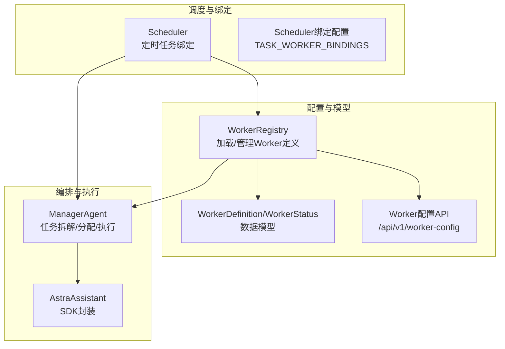
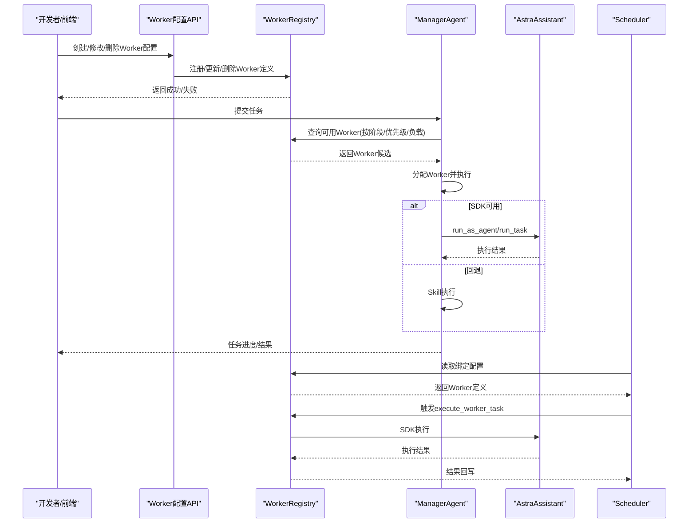
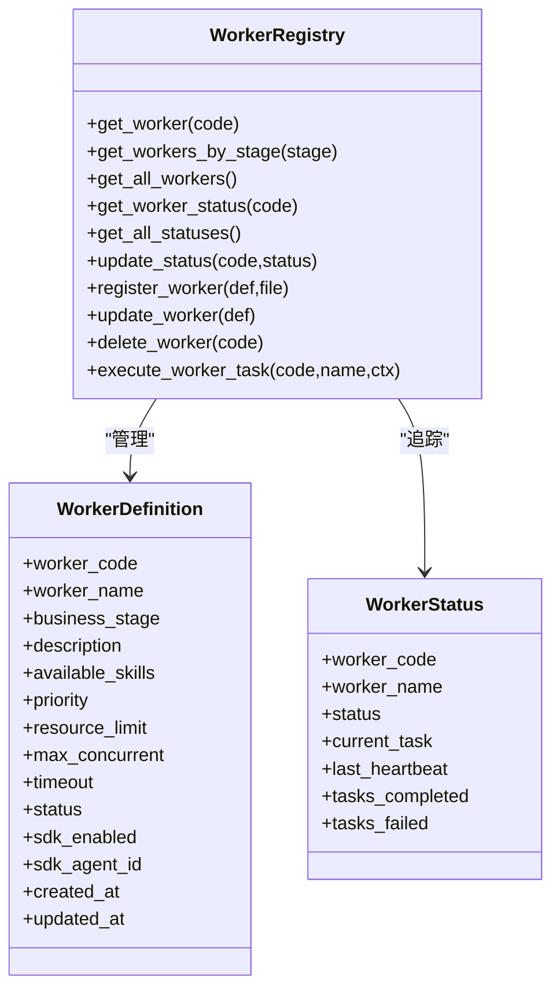
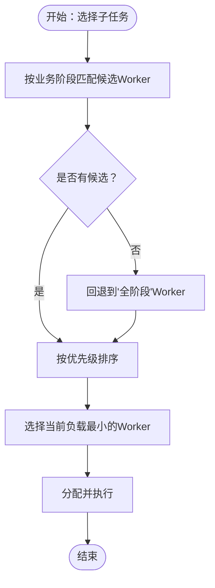
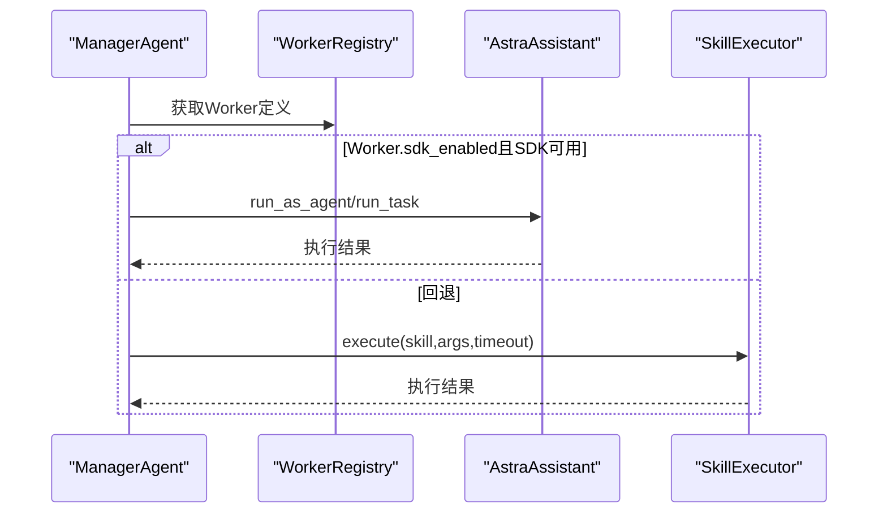
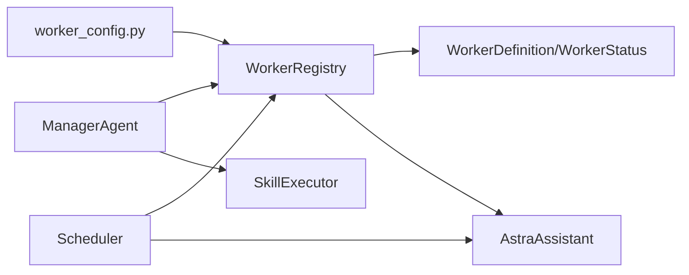

# Worker集成

<cite>
**本文引用的文件**
- [backend/app/core/worker_registry.py](file://backend/app/core/worker_registry.py)
- [backend/app/api/worker_config.py](file://backend/app/api/worker_config.py)
- [backend/app/core/manager_agent.py](file://backend/app/core/manager_agent.py)
- [backend/app/models/schemas.py](file://backend/app/models/schemas.py)
- [backend/data/config/workers/README.md](file://backend/data/config/workers/README.md)
- [backend/data/config/workers/builtin_workers.md](file://backend/data/config/workers/builtin_workers.md)
- [backend/data/config/workers/custom_workers.md](file://backend/data/config/workers/custom_workers.md)
- [backend/app/services/astra_assistant.py](file://backend/app/services/astra_assistant.py)
- [backend/app/core/scheduler.py](file://backend/app/core/scheduler.py)
- [后端api.md](file://后端api.md)
</cite>

## 目录
1. [简介](#简介)
2. [项目结构](#项目结构)
3. [核心组件](#核心组件)
4. [架构总览](#架构总览)
5. [详细组件分析](#详细组件分析)
6. [依赖分析](#依赖分析)
7. [性能考量](#性能考量)
8. [故障排查指南](#故障排查指南)
9. [结论](#结论)
10. [附录](#附录)

## 简介
本文件面向“避风港平台”的开发者与集成者，系统化阐述Worker集成方案。重点包括：
- Worker注册表（WorkerRegistry）的设计与Worker定义结构
- Worker的业务阶段分类、优先级设置与负载管理机制
- SDK执行与Skill执行两种模式的差异与适用场景
- Worker状态监控与负载均衡策略
- Worker与Manager Agent的交互协议与消息传递机制
- Worker配置管理、性能监控与故障恢复的实现方案
- 实际集成示例与最佳实践

## 项目结构
围绕Worker集成的关键文件与职责如下：
- Worker注册与配置：WorkerRegistry负责从配置文件加载Worker定义，支持QAAgent动态注册/修改/删除；Worker配置API提供REST接口
- 任务编排与执行：Manager Agent负责任务拆解、Worker分配、执行与重试、消息记录与用户干预
- 执行载体：AstraAssistant封装Claude Agent SDK，支持run_as_agent与run_task两类执行路径
- 定时任务绑定：Scheduler将定时任务与Worker绑定，触发SDK执行
- 数据模型：WorkerDefinition与WorkerStatus定义Worker的静态配置与运行时状态

图表来源
- [backend/app/core/worker_registry.py:29-434](file://backend/app/core/worker_registry.py#L29-L434)
- [backend/app/api/worker_config.py:1-108](file://backend/app/api/worker_config.py#L1-L108)
- [backend/app/core/manager_agent.py:117-729](file://backend/app/core/manager_agent.py#L117-L729)
- [backend/app/models/schemas.py:360-392](file://backend/app/models/schemas.py#L360-L392)
- [backend/app/services/astra_assistant.py:155-200](file://backend/app/services/astra_assistant.py#L155-L200)
- [backend/app/core/scheduler.py:366-391](file://backend/app/core/scheduler.py#L366-L391)

章节来源
- [backend/app/core/worker_registry.py:29-434](file://backend/app/core/worker_registry.py#L29-L434)
- [backend/app/api/worker_config.py:1-108](file://backend/app/api/worker_config.py#L1-L108)
- [backend/app/core/manager_agent.py:117-729](file://backend/app/core/manager_agent.py#L117-L729)
- [backend/app/models/schemas.py:360-392](file://backend/app/models/schemas.py#L360-L392)
- [backend/app/services/astra_assistant.py:155-200](file://backend/app/services/astra_assistant.py#L155-L200)
- [backend/app/core/scheduler.py:366-391](file://backend/app/core/scheduler.py#L366-L391)

## 核心组件
- Worker注册表（WorkerRegistry）
  - 职责：从配置文件加载Worker定义；支持QAAgent动态注册/修改/删除；按业务阶段查询；追踪运行时状态
  - 存储：配置文件位于data/config/workers/*.md，删除时归档至data/config/workers/_archive/
- Worker定义（WorkerDefinition）
  - 字段：worker_code、worker_name、business_stage、description、available_skills、priority、resource_limit、max_concurrent、timeout、status、sdk_enabled、sdk_agent_id、created_at、updated_at
  - 用途：静态配置与运行时状态（WorkerStatus）共同构成Worker的全生命周期
- Worker状态（WorkerStatus）
  - 字段：worker_code、worker_name、status、current_task、last_heartbeat、tasks_completed、tasks_failed
  - 用途：记录Worker的忙碌/空闲/错误状态、任务计数与心跳
- Worker配置API
  - 提供Worker列表、状态、创建、修改、删除等REST接口，权限由QAAgent校验
- Manager Agent
  - 负责任务拆解、Worker分配（按阶段、优先级、负载）、执行（SDK或Skill回退）、重试、消息记录与用户干预
- AstraAssistant
  - 封装Claude Agent SDK，提供run_as_agent与run_task两类执行路径
- Scheduler
  - 将定时任务与Worker绑定，触发SDK执行或本地回调

章节来源
- [backend/app/core/worker_registry.py:29-434](file://backend/app/core/worker_registry.py#L29-L434)
- [backend/app/models/schemas.py:360-392](file://backend/app/models/schemas.py#L360-L392)
- [backend/app/api/worker_config.py:1-108](file://backend/app/api/worker_config.py#L1-L108)
- [backend/app/core/manager_agent.py:117-729](file://backend/app/core/manager_agent.py#L117-L729)
- [backend/app/services/astra_assistant.py:155-200](file://backend/app/services/astra_assistant.py#L155-L200)
- [backend/app/core/scheduler.py:366-391](file://backend/app/core/scheduler.py#L366-L391)

## 架构总览
下图展示了Worker集成的端到端流程：配置文件驱动的Worker定义、API管理、Manager Agent编排、SDK执行与定时任务绑定。

图表来源
- [backend/app/api/worker_config.py:52-108](file://backend/app/api/worker_config.py#L52-L108)
- [backend/app/core/worker_registry.py:225-421](file://backend/app/core/worker_registry.py#L225-L421)
- [backend/app/core/manager_agent.py:251-546](file://backend/app/core/manager_agent.py#L251-L546)
- [backend/app/services/astra_assistant.py:155-200](file://backend/app/services/astra_assistant.py#L155-L200)
- [backend/app/core/scheduler.py:366-391](file://backend/app/core/scheduler.py#L366-L391)

## 详细组件分析

### Worker注册表（WorkerRegistry）
- 配置加载
  - 从data/config/workers/目录加载*.md文件，解析Markdown表格生成WorkerDefinition集合
  - 若目录不存在或为空，则注册默认Worker集合
- 管理接口
  - register_worker：向custom_workers.md追加一行，同时更新内存缓存
  - update_worker：更新Worker定义（仅允许修改非唯一字段）
  - delete_worker：从配置文件移除并归档至_archive目录
- 查询与状态
  - get_worker/get_workers_by_stage：按业务阶段筛选
  - get_worker_status/get_all_statuses/update_status：运行时状态追踪
- SDK执行
  - execute_worker_task：优先使用AstraAssistant.run_as_agent或run_task执行，支持超时截断、失败统计与状态回写

图表来源
- [backend/app/core/worker_registry.py:29-434](file://backend/app/core/worker_registry.py#L29-L434)
- [backend/app/models/schemas.py:360-392](file://backend/app/models/schemas.py#L360-L392)

章节来源
- [backend/app/core/worker_registry.py:29-434](file://backend/app/core/worker_registry.py#L29-L434)
- [backend/data/config/workers/README.md:1-26](file://backend/data/config/workers/README.md#L1-L26)
- [backend/data/config/workers/builtin_workers.md:1-30](file://backend/data/config/workers/builtin_workers.md#L1-L30)
- [backend/data/config/workers/custom_workers.md:1-8](file://backend/data/config/workers/custom_workers.md#L1-L8)

### Worker定义结构与配置文件
- Worker定义字段
  - 唯一标识：worker_code
  - 名称与职责：worker_name、description
  - 业务阶段：business_stage（支持“全阶段”与阶段区间）
  - 可用Skills：available_skills（逗号分隔）
  - 优先级与超时：priority（1-5，越小越高）、timeout（秒）
  - 资源与并发：resource_limit、max_concurrent
  - SDK执行：sdk_enabled、sdk_agent_id
  - 时间戳：created_at、updated_at
- 配置文件
  - builtin_workers.md：内置Worker集合
  - custom_workers.md：由QAAgent维护的自定义Worker
  - README.md：字段说明与Schema

章节来源
- [backend/data/config/workers/README.md:13-26](file://backend/data/config/workers/README.md#L13-L26)
- [backend/data/config/workers/builtin_workers.md:8-21](file://backend/data/config/workers/builtin_workers.md#L8-L21)
- [backend/data/config/workers/custom_workers.md:5-8](file://backend/data/config/workers/custom_workers.md#L5-L8)
- [backend/app/models/schemas.py:360-380](file://backend/app/models/schemas.py#L360-L380)

### 业务阶段、优先级与负载管理
- 业务阶段匹配
  - Manager Agent在分配Worker时优先匹配子任务的business_stage；若无匹配则回退到“全阶段”Worker
- 优先级排序
  - 按priority升序（数值越小优先级越高）排序候选Worker
- 负载均衡
  - 基于每个Worker当前挂起/运行中的子任务数量，选择最小负载者
- 超时与失败重试
  - 子任务具备timeout与max_retries；失败时可自动重试，不影响其他并行任务

图表来源
- [backend/app/core/manager_agent.py:251-289](file://backend/app/core/manager_agent.py#L251-L289)

章节来源
- [backend/app/core/manager_agent.py:251-289](file://backend/app/core/manager_agent.py#L251-L289)

### SDK执行与Skill执行两种模式
- SDK执行（优先）
  - 通过AstraAssistant.run_as_agent或run_task执行，支持Claude Agent SDK的全部能力（会话、子代理、钩子、MCP工具、技能、沙箱等）
  - 适用于需要复杂推理、联网搜索、文件读写等场景
- Skill执行（回退）
  - 当SDK不可用或失败时，回退到SkillExecutor映射执行
  - 适用于轻量、稳定、无需SDK能力的任务

图表来源
- [backend/app/core/manager_agent.py:448-546](file://backend/app/core/manager_agent.py#L448-L546)
- [backend/app/services/astra_assistant.py:155-200](file://backend/app/services/astra_assistant.py#L155-L200)

章节来源
- [backend/app/core/manager_agent.py:448-546](file://backend/app/core/manager_agent.py#L448-L546)
- [backend/app/services/astra_assistant.py:109-124](file://backend/app/services/astra_assistant.py#L109-L124)

### Worker状态监控与负载均衡策略
- 状态监控
  - WorkerStatus记录状态、当前任务、心跳、完成/失败计数
  - WorkerRegistry.update_status与ManagerAgent.get_worker_status提供统一视图
- 负载均衡
  - ManagerAgent内部以worker_code为键维护任务队列，选择最小负载Worker
  - WorkerRegistry提供get_all_statuses便于集中展示

章节来源
- [backend/app/models/schemas.py:383-392](file://backend/app/models/schemas.py#L383-L392)
- [backend/app/core/worker_registry.py:190-222](file://backend/app/core/worker_registry.py#L190-L222)
- [backend/app/core/manager_agent.py:586-600](file://backend/app/core/manager_agent.py#L586-L600)

### Worker与Manager Agent的交互协议与消息传递
- 消息格式（AgentMessage）
  - message_id、sender、receiver、message_type、payload、timestamp、conversation_id
- 任务组（TaskGroup）
  - group_id、task_description、context、subtasks、status、created_at/started_at/completed_at、created_by、conversation_id、messages、results
- 消息记录与广播
  - ManagerAgent记录消息到全局日志与任务组消息列表，支持群聊式调度
- 用户干预
  - 支持取消任务组/子任务、暂停/恢复、重试等

章节来源
- [backend/app/core/manager_agent.py:34-115](file://backend/app/core/manager_agent.py#L34-L115)
- [backend/app/core/manager_agent.py:671-687](file://backend/app/core/manager_agent.py#L671-L687)
- [backend/app/core/manager_agent.py:604-667](file://backend/app/core/manager_agent.py#L604-L667)

### 定时任务绑定与SDK执行
- 绑定配置
  - Scheduler通过TASK_WORKER_BINDINGS将定时任务与Worker绑定
- 执行流程
  - Scheduler调用WorkerRegistry.execute_worker_task，内部通过AstraAssistant执行
  - 支持超时截断、失败统计与状态回写

章节来源
- [backend/app/core/scheduler.py:366-391](file://backend/app/core/scheduler.py#L366-L391)
- [backend/app/core/worker_registry.py:288-421](file://backend/app/core/worker_registry.py#L288-L421)

## 依赖分析
- WorkerRegistry依赖
  - 配置文件系统：data/config/workers/*.md
  - WorkerDefinition/WorkerStatus：数据模型
  - AstraAssistant：SDK执行
- ManagerAgent依赖
  - WorkerRegistry：查询Worker
  - TaskDecomposer：任务拆解
  - SkillExecutor：回退执行
- API层
  - worker_config.py：暴露Worker配置与状态查询接口
- Scheduler
  - 依赖WorkerRegistry与AstraAssistant执行定时任务

图表来源
- [backend/app/core/worker_registry.py:21-22](file://backend/app/core/worker_registry.py#L21-L22)
- [backend/app/core/manager_agent.py:27-29](file://backend/app/core/manager_agent.py#L27-L29)
- [backend/app/api/worker_config.py:6-8](file://backend/app/api/worker_config.py#L6-L8)
- [backend/app/core/scheduler.py:366-391](file://backend/app/core/scheduler.py#L366-L391)

章节来源
- [backend/app/core/worker_registry.py:21-22](file://backend/app/core/worker_registry.py#L21-L22)
- [backend/app/core/manager_agent.py:27-29](file://backend/app/core/manager_agent.py#L27-L29)
- [backend/app/api/worker_config.py:6-8](file://backend/app/api/worker_config.py#L6-L8)
- [backend/app/core/scheduler.py:366-391](file://backend/app/core/scheduler.py#L366-L391)

## 性能考量
- 优先级与负载
  - 通过priority与最小负载选择降低热点Worker压力
- 超时与熔断
  - 子任务timeout防止长尾任务拖累整体；SDK执行超时截断避免响应膨胀
- 并行度控制
  - 子任务并行执行，失败不影响其他任务；可结合max_concurrent限制Worker并发
- 日志与可观测性
  - WorkerStatus与消息日志提供执行轨迹；建议接入外部监控系统收集指标

## 故障排查指南
- SDK不可用
  - 现象：SDK执行返回“未就绪”
  - 处理：安装claude-agent-sdk并配置API Key；检查AstraAssistant.check_sdk与settings
- Worker不存在
  - 现象：execute_worker_task返回错误
  - 处理：确认配置文件存在且worker_code正确；检查WorkerRegistry缓存
- 执行异常
  - 现象：状态变为error，失败计数增加
  - 处理：查看日志与错误信息；必要时回退到Skill执行；检查网络与工具权限
- 负载不均
  - 现象：部分Worker长时间繁忙
  - 处理：调整priority或增加Worker；优化任务粒度与并行度

章节来源
- [backend/app/services/astra_assistant.py:109-124](file://backend/app/services/astra_assistant.py#L109-L124)
- [backend/app/core/worker_registry.py:334-421](file://backend/app/core/worker_registry.py#L334-L421)
- [backend/app/core/manager_agent.py:417-447](file://backend/app/core/manager_agent.py#L417-L447)

## 结论
本方案以配置文件驱动的Worker注册表为核心，结合Manager Agent的任务编排与AstraAssistant的SDK执行能力，形成“配置即契约、编排即调度、执行即服务”的Worker集成体系。通过业务阶段匹配、优先级与负载均衡、超时与重试、消息与状态监控，实现了高可用、可扩展、可观测的Worker执行闭环。

## 附录

### 配置管理最佳实践
- 使用builtin_workers.md作为基线，custom_workers.md维护自定义Worker
- 为不同阶段的Worker设置合理priority与timeout
- 为需要复杂能力的任务启用sdk_enabled并配置sdk_agent_id
- 定期归档不再使用的Worker定义

章节来源
- [backend/data/config/workers/README.md:1-26](file://backend/data/config/workers/README.md#L1-L26)
- [backend/data/config/workers/builtin_workers.md:22-30](file://backend/data/config/workers/builtin_workers.md#L22-L30)
- [backend/data/config/workers/custom_workers.md:1-8](file://backend/data/config/workers/custom_workers.md#L1-L8)

### API与集成示例
- Worker配置API
  - 列表/状态：GET /api/v1/worker-config、GET /api/v1/worker-config/status
  - 查询单个：GET /api/v1/worker-config/{worker_code}、GET /api/v1/worker-config/{worker_code}/status
  - 管理：POST/PUT/DELETE（需QAAgent权限）
- 定时任务绑定
  - 通过Scheduler绑定配置触发Worker执行，支持本地回退

章节来源
- [backend/app/api/worker_config.py:13-108](file://backend/app/api/worker_config.py#L13-L108)
- [后端api.md:1-200](file://后端api.md#L1-L200)
- [backend/app/core/scheduler.py:366-391](file://backend/app/core/scheduler.py#L366-L391)