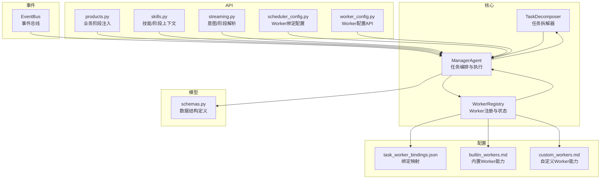
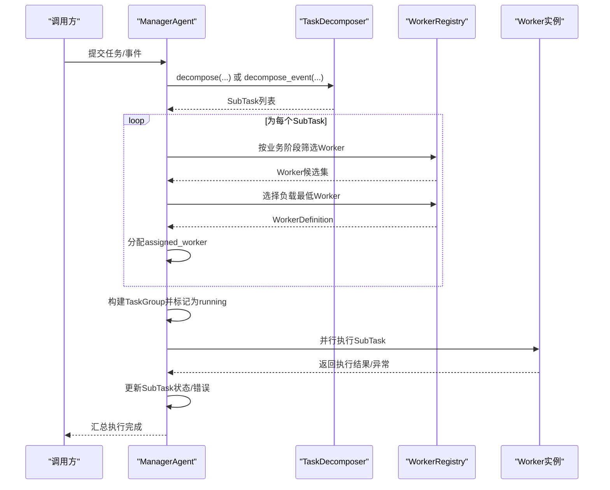
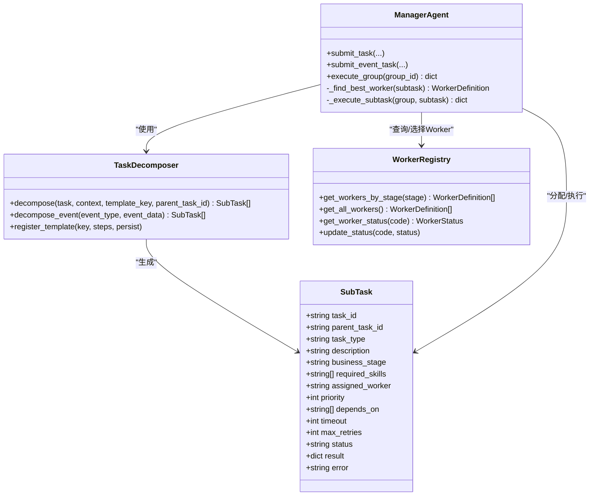
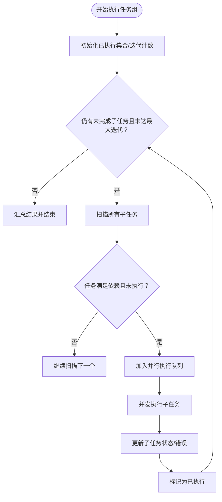
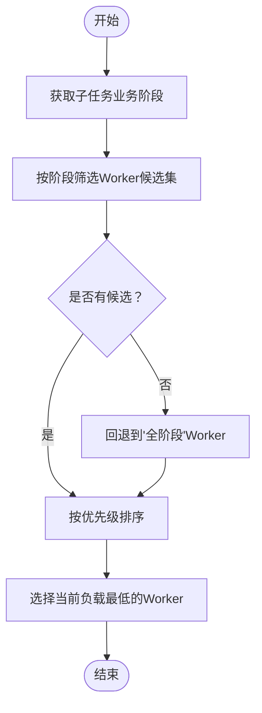
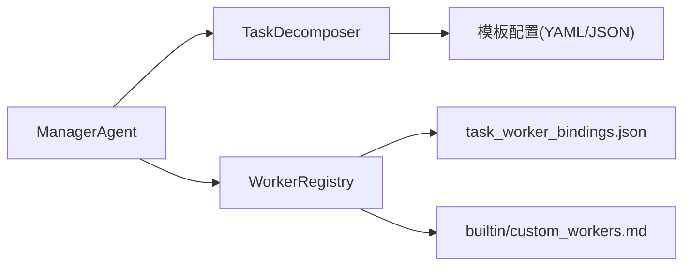

# 任务分解与执行

<cite>
**本文引用的文件**
- [task_decomposer.py](file://backend/app/core/task_decomposer.py)
- [manager_agent.py](file://backend/app/core/manager_agent.py)
- [worker_registry.py](file://backend/app/core/worker_registry.py)
- [event_bus.py](file://backend/app/core/event_bus.py)
- [products.py](file://backend/app/api/products.py)
- [skills.py](file://backend/app/api/skills.py)
- [scheduler_config.py](file://backend/app/api/scheduler_config.py)
- [worker_config.py](file://backend/app/api/worker_config.py)
- [streaming.py](file://backend/app/api/streaming.py)
- [schemas.py](file://backend/app/models/schemas.py)
- [task_worker_bindings.json](file://backend/data/config/scheduler/task_worker_bindings.json)
- [builtin_workers.md](file://backend/data/config/workers/builtin_workers.md)
- [custom_workers.md](file://backend/data/config/workers/custom_workers.md)
</cite>

## 目录
1. [引言](#引言)
2. [项目结构](#项目结构)
3. [核心组件](#核心组件)
4. [架构总览](#架构总览)
5. [详细组件分析](#详细组件分析)
6. [依赖分析](#依赖分析)
7. [性能考虑](#性能考虑)
8. [故障排查指南](#故障排查指南)
9. [结论](#结论)
10. [附录](#附录)

## 引言
本文件面向避风港平台的任务分解与执行体系，围绕TaskDecomposer的任务拆解机制、SubTask数据结构与属性、任务执行策略（并行、依赖、重试）、Worker分配算法（最佳Worker查找与负载均衡）、以及任务状态管理与进度监控进行系统化说明。同时提供性能优化建议与故障处理方案，并通过图示与“章节来源”定位到具体实现文件，便于读者快速定位代码位置。

## 项目结构
避风港平台在后端采用“核心模块 + API层 + 数据配置”的分层组织。与任务分解与执行直接相关的关键模块包括：
- 核心：task_decomposer.py（任务拆解）、manager_agent.py（任务编排与执行）、worker_registry.py（Worker注册与状态）
- 事件：event_bus.py（事件驱动触发任务）
- API：products.py、skills.py、scheduler_config.py、worker_config.py、streaming.py（上下文注入与业务阶段传递）
- 模型：schemas.py（SubTask、WorkerDefinition等数据结构）
- 配置：task_worker_bindings.json、builtin_workers.md、custom_workers.md（Worker绑定与能力声明）

**图表来源**
- [manager_agent.py:171-247](file://backend/app/core/manager_agent.py#L171-L247)
- [task_decomposer.py:362-429](file://backend/app/core/task_decomposer.py#L362-L429)
- [worker_registry.py:182-220](file://backend/app/core/worker_registry.py#L182-L220)
- [event_bus.py:105-105](file://backend/app/core/event_bus.py#L105-L105)
- [products.py:52-52](file://backend/app/api/products.py#L52-L52)
- [skills.py:140-141](file://backend/app/api/skills.py#L140-L141)
- [scheduler_config.py:322-322](file://backend/app/api/scheduler_config.py#L322-L322)
- [worker_config.py:5-5](file://backend/app/api/worker_config.py#L5-L5)
- [streaming.py:382-382](file://backend/app/api/streaming.py#L382-L382)
- [schemas.py:1-200](file://backend/app/models/schemas.py#L1-L200)
- [task_worker_bindings.json:1-200](file://backend/data/config/scheduler/task_worker_bindings.json#L1-L200)
- [builtin_workers.md:1-200](file://backend/data/config/workers/builtin_workers.md#L1-L200)
- [custom_workers.md:1-200](file://backend/data/config/workers/custom_workers.md#L1-L200)

**章节来源**
- [manager_agent.py:171-247](file://backend/app/core/manager_agent.py#L171-L247)
- [task_decomposer.py:362-429](file://backend/app/core/task_decomposer.py#L362-L429)
- [worker_registry.py:182-220](file://backend/app/core/worker_registry.py#L182-L220)

## 核心组件
- TaskDecomposer：负责将高层任务描述拆解为SubTask列表，支持模板匹配、事件驱动拆解、自定义模板注册与持久化。
- ManagerAgent：负责任务组生命周期管理、Worker分配、并行执行与依赖调度、失败重试、状态汇总与进度广播。
- WorkerRegistry：维护Worker注册表、按业务阶段筛选、查询运行时状态、更新Worker状态。
- EventBus：事件驱动触发任务，将事件映射到对应分解模板。
- API层：向任务上下文注入business_stage、技能要求等信息，确保拆解与分配的准确性。
- 模型层：定义SubTask、WorkerDefinition、WorkerStatus等数据结构。

**章节来源**
- [task_decomposer.py:28-522](file://backend/app/core/task_decomposer.py#L28-L522)
- [manager_agent.py:63-363](file://backend/app/core/manager_agent.py#L63-L363)
- [worker_registry.py:28-220](file://backend/app/core/worker_registry.py#L28-L220)
- [event_bus.py:105-105](file://backend/app/core/event_bus.py#L105-L105)
- [schemas.py:1-200](file://backend/app/models/schemas.py#L1-L200)

## 架构总览
下图展示了从任务输入到执行完成的端到端流程：ManagerAgent接收任务或事件，委托TaskDecomposer生成SubTask，再通过WorkerRegistry选择最佳Worker并分配，随后并行执行SubTask，最后汇总状态与结果。

**图表来源**
- [manager_agent.py:171-247](file://backend/app/core/manager_agent.py#L171-L247)
- [task_decomposer.py:362-429](file://backend/app/core/task_decomposer.py#L362-L429)
- [worker_registry.py:182-220](file://backend/app/core/worker_registry.py#L182-L220)

## 详细组件分析

### 任务分解机制与SubTask数据结构
- SubTask数据结构与关键字段
  - task_id：子任务唯一标识
  - parent_task_id：父任务标识
  - task_type：任务类型（如合规检查、证书验证、上架合规等）
  - description：任务描述
  - business_stage：业务阶段（用于Worker阶段匹配）
  - required_skills：所需技能列表
  - assigned_worker：已分配Worker编码
  - priority：优先级（数值越小越高）
  - depends_on：依赖的子任务ID列表
  - timeout/max_retries：超时与最大重试次数（由模板步骤决定）
- TaskDecomposer工作原理
  - 模板匹配：优先精确匹配，否则模糊匹配；若无匹配则返回单任务
  - 事件驱动：基于事件类型映射到预设模板
  - 自定义模板：支持注册并持久化到YAML/JSON文件
- 子任务生成策略
  - 依据模板步骤生成多个SubTask，设置task_type、business_stage、required_skills、timeout、max_retries等
  - 通过depends_on建立依赖关系，保证执行顺序

**图表来源**
- [task_decomposer.py:28-522](file://backend/app/core/task_decomposer.py#L28-L522)
- [manager_agent.py:63-363](file://backend/app/core/manager_agent.py#L63-L363)
- [worker_registry.py:28-220](file://backend/app/core/worker_registry.py#L28-L220)

**章节来源**
- [task_decomposer.py:28-522](file://backend/app/core/task_decomposer.py#L28-L522)
- [schemas.py:1-200](file://backend/app/models/schemas.py#L1-L200)

### 任务执行策略：并行、依赖与重试
- 并行执行
  - 识别无依赖的子任务集合，使用并发机制并行执行
- 依赖关系处理
  - 通过depends_on判断前置任务是否已完成，仅在满足条件时加入可执行队列
- 失败重试机制
  - 每个SubTask具备max_retries配置；执行过程中捕获异常并记录错误，不影响其他并行任务
- 状态汇总
  - 执行完成后根据子任务状态综合判定任务组最终状态

**图表来源**
- [manager_agent.py:292-363](file://backend/app/core/manager_agent.py#L292-L363)

**章节来源**
- [manager_agent.py:292-363](file://backend/app/core/manager_agent.py#L292-L363)

### Worker分配算法：最佳Worker查找与负载均衡
- 匹配策略
  - 先按业务阶段筛选Worker候选集；若无匹配，回退到“全阶段”Worker
- 优先级排序
  - 在候选集中按优先级升序排序（数值越小越优先）
- 负载均衡
  - 选择当前挂起任务数最少的Worker作为最佳Worker
- 运行时状态
  - WorkerRegistry提供运行时状态查询与更新接口，便于监控与决策

**图表来源**
- [manager_agent.py:250-288](file://backend/app/core/manager_agent.py#L250-L288)
- [worker_registry.py:182-220](file://backend/app/core/worker_registry.py#L182-L220)

**章节来源**
- [manager_agent.py:250-288](file://backend/app/core/manager_agent.py#L250-L288)
- [worker_registry.py:182-220](file://backend/app/core/worker_registry.py#L182-L220)

### 任务状态管理与进度监控
- 任务组状态
  - pending/running/paused/done/failed/cancelled，由ManagerAgent统一维护
- 子任务状态
  - status、result、error等字段记录执行结果与错误信息
- 进度广播
  - ManagerAgent在关键节点（创建、开始、完成）向消息通道广播状态消息，便于前端与外部系统感知
- Worker状态
  - WorkerRegistry提供Worker运行时状态查询与更新，支持活跃任务数统计

**章节来源**
- [manager_agent.py:63-120](file://backend/app/core/manager_agent.py#L63-L120)
- [manager_agent.py:586-600](file://backend/app/core/manager_agent.py#L586-L600)
- [worker_registry.py:190-220](file://backend/app/core/worker_registry.py#L190-L220)

### 事件驱动的任务分解
- 事件到模板映射
  - 例如certification:expiring/expired映射到证书到期处理模板，compliance:check_started映射到合规流水线模板等
- 自动拆解
  - ManagerAgent在收到事件后调用TaskDecomposer.decompose_event，生成SubTask并分配Worker

**章节来源**
- [task_decomposer.py:431-489](file://backend/app/core/task_decomposer.py#L431-L489)
- [manager_agent.py:226-247](file://backend/app/core/manager_agent.py#L226-L247)
- [event_bus.py:105-105](file://backend/app/core/event_bus.py#L105-L105)

### 上下文注入与业务阶段传递
- API层在请求中注入business_stage，确保TaskDecomposer能基于业务阶段选择合适模板与Worker
- 示例路径
  - 产品API在响应中携带business_stage
  - 技能API根据请求参数设置context中的business_stage
  - 流式API在意图解析中提取business_stage
  - 调度配置API在Worker绑定中体现business_stage

**章节来源**
- [products.py:52-52](file://backend/app/api/products.py#L52-L52)
- [skills.py:140-141](file://backend/app/api/skills.py#L140-L141)
- [streaming.py:382-382](file://backend/app/api/streaming.py#L382-L382)
- [scheduler_config.py:322-322](file://backend/app/api/scheduler_config.py#L322-L322)

## 依赖分析
- 组件耦合
  - ManagerAgent依赖TaskDecomposer与WorkerRegistry；TaskDecomposer依赖模板配置；WorkerRegistry依赖配置文件与运行时状态
- 外部依赖
  - YAML/JSON序列化（自定义模板持久化）
  - 异步并发执行（asyncio.gather）
- 可能的循环依赖
  - 当前模块间为单向依赖，未见循环

**图表来源**
- [manager_agent.py:171-247](file://backend/app/core/manager_agent.py#L171-L247)
- [task_decomposer.py:498-510](file://backend/app/core/task_decomposer.py#L498-L510)
- [worker_registry.py:182-220](file://backend/app/core/worker_registry.py#L182-L220)
- [task_worker_bindings.json:1-200](file://backend/data/config/scheduler/task_worker_bindings.json#L1-L200)
- [builtin_workers.md:1-200](file://backend/data/config/workers/builtin_workers.md#L1-L200)
- [custom_workers.md:1-200](file://backend/data/config/workers/custom_workers.md#L1-L200)

**章节来源**
- [task_decomposer.py:498-510](file://backend/app/core/task_decomposer.py#L498-L510)
- [worker_registry.py:182-220](file://backend/app/core/worker_registry.py#L182-L220)

## 性能考虑
- 并发粒度控制
  - 并行执行子任务时，建议根据Worker能力与资源限制调整并发度，避免过度竞争
- 依赖深度优化
  - 尽量减少长链式依赖，通过并行化拆分中间环节
- 超时与重试
  - 为高风险子任务设置合理timeout与max_retries，避免长时间阻塞
- 负载均衡
  - 定期评估Worker负载，动态调整优先级与绑定策略
- 缓存与预热
  - 对频繁使用的模板与Worker能力进行缓存，降低冷启动开销

## 故障排查指南
- 任务未被分配Worker
  - 检查Worker注册表是否存在匹配业务阶段的Worker；确认Worker状态正常
- 子任务依赖无法满足
  - 核对depends_on列表与任务ID一致性；确认前置任务是否成功完成
- 执行失败但未重试
  - 检查max_retries配置与异常捕获逻辑；确认异常类型是否被正确识别
- 事件未触发任务
  - 核对事件类型与模板映射；确认EventBus事件解析是否包含business_stage

**章节来源**
- [manager_agent.py:250-363](file://backend/app/core/manager_agent.py#L250-L363)
- [worker_registry.py:182-220](file://backend/app/core/worker_registry.py#L182-L220)
- [event_bus.py:105-105](file://backend/app/core/event_bus.py#L105-L105)

## 结论
避风港平台的任务分解与执行体系以TaskDecomposer为核心，结合ManagerAgent的编排能力与WorkerRegistry的Worker治理，实现了基于业务阶段与事件驱动的任务拆解、并行执行、依赖调度与失败重试。通过清晰的数据结构（SubTask、WorkerDefinition）与状态管理机制，系统在复杂合规场景下具备良好的扩展性与可观测性。建议在生产环境中持续优化并发策略、依赖设计与Worker负载均衡，以获得更优的吞吐与稳定性。

## 附录
- 关键实现路径索引
  - 任务拆解：[decompose/decompose_event/register_template:362-510](file://backend/app/core/task_decomposer.py#L362-L510)
  - 任务执行：[execute_group/_execute_subtask:292-363](file://backend/app/core/manager_agent.py#L292-L363)
  - Worker分配：[_find_best_worker:250-288](file://backend/app/core/manager_agent.py#L250-L288)
  - Worker状态：[get_workers_by_stage/get_all_workers/get_worker_status/update_status:182-220](file://backend/app/core/worker_registry.py#L182-L220)
  - 事件映射：[decompose_event映射表:446-489](file://backend/app/core/task_decomposer.py#L446-L489)
  - 上下文注入：[products/skills/streaming/scheduler_config:52-52](file://backend/app/api/products.py#L52-L52), (file://backend/app/api/skills.py#L140-L141), (file://backend/app/api/streaming.py#L382-L382), (file://backend/app/api/scheduler_config.py#L322-L322)
  - 数据结构：[SubTask/WorkerDefinition/WorkerStatus:1-200](file://backend/app/models/schemas.py#L1-L200)
  - Worker绑定与能力：[task_worker_bindings.json:1-200](file://backend/data/config/scheduler/task_worker_bindings.json#L1-L200), [builtin_workers.md:1-200](file://backend/data/config/workers/builtin_workers.md#L1-L200), [custom_workers.md:1-200](file://backend/data/config/workers/custom_workers.md#L1-L200)