# 多Agent架构

<cite>
**本文引用的文件**
- [backend/app/main.py](file://backend/app/main.py)
- [backend/app/core/manager_agent.py](file://backend/app/core/manager_agent.py)
- [backend/app/core/qa_agent.py](file://backend/app/core/qa_agent.py)
- [backend/app/core/task_decomposer.py](file://backend/app/core/task_decomposer.py)
- [backend/app/core/event_bus.py](file://backend/app/core/event_bus.py)
- [backend/app/core/risk_alert.py](file://backend/app/core/risk_alert.py)
- [backend/app/core/skill_registry.py](file://backend/app/core/skill_registry.py)
- [backend/app/core/model_router.py](file://backend/app/core/model_router.py)
- [backend/app/core/security_sandbox.py](file://backend/app/core/security_sandbox.py)
- [backend/app/storage/agent_config_store.py](file://backend/app/storage/agent_config_store.py)
- [backend/app/api/agent_config.py](file://backend/app/api/agent_config.py)
- [backend/data/config/agent_extensions.json](file://backend/data/config/agent_extensions.json)
- [backend/app/core/metrics.py](file://backend/app/core/metrics.py)
- [backend/app/services/compliance.py](file://backend/app/services/compliance.py)
- [backend/app/core/proactive_engine.py](file://backend/app/core/proactive_engine.py)
- [backend/app/core/channel_adapter.py](file://backend/app/core/channel_adapter.py)
- [backend/app/core/notification_engine.py](file://backend/app/core/notification_engine.py)
- [backend/app/core/token_juice.py](file://backend/app/core/token_juice.py)
- [backend/app/core/worker_registry.py](file://backend/app/core/worker_registry.py)
- [backend/app/core/action_chain.py](file://backend/app/core/action_chain.py)
- [backend/app/core/rule_engine.py](file://backend/app/core/rule_engine.py)
- [backend/app/core/nlu.py](file://backend/app/core/nlu.py)
- [backend/app/core/memory_tree.py](file://backend/app/core/memory_tree.py)
- [backend/app/core/local_store.py](file://backend/app/core/local_store.py)
- [backend/app/core/auto_pull_engine.py](file://backend/app/core/auto_pull_engine.py)
- [backend/app/core/scheduler.py](file://backend/app/core/scheduler.py)
- [backend/app/api/events.py](file://backend/app/api/events.py)
- [backend/app/api/pipeline.py](file://backend/app/api/pipeline.py)
- [backend/app/api/tools.py](file://backend/app/api/tools.py)
- [backend/app/api/skills.py](file://backend/app/api/skills.py)
- [backend/app/api/products.py](file://backend/app/api/products.py)
- [backend/app/api/users.py](file://backend/app/api/users.py)
- [backend/app/api/metrics.py](file://backend/app/api/metrics.py)
- [backend/app/api/notifications.py](file://backend/app/api/notifications.py)
- [backend/app/api/memory.py](file://backend/app/api/memory.py)
- [backend/app/api/knowledge.py](file://backend/app/api/knowledge.py)
- [backend/app/api/risk.py](file://backend/app/api/risk.py)
- [backend/app/api/auth.py](file://backend/app/api/auth.py)
- [backend/app/api/admin.py](file://backend/app/api/admin.py)
- [backend/app/api/shopify.py](file://backend/app/api/shopify.py)
- [backend/app/api/streaming.py](file://backend/app/api/streaming.py)
- [backend/app/api/sdk_sessions.py](file://backend/app/api/sdk_sessions.py)
- [backend/app/api/sessions.py](file://backend/app/api/sessions.py)
- [backend/app/api/integrations.py](file://backend/app/api/integrations.py)
- [backend/app/api/rag.py](file://backend/app/api/rag.py)
- [backend/app/api/code_security.py](file://backend/app/api/code_security.py)
- [backend/app/api/cli.py](file://backend/app/api/cli.py)
- [backend/app/api/worker_config.py](file://backend/app/api/worker_config.py)
- [backend/app/api/scheduler_config.py](file://backend/app/api/scheduler_config.py)
- [backend/app/api/event_config.py](file://backend/app/api/event_config.py)
- [backend/app/api/model_config.py](file://backend/app/api/model_config.py)
- [backend/app/api/chains.py](file://backend/app/api/chains.py)
</cite>

## 更新摘要
**所做更改**
- 移除了原有的合规流程引擎模块相关章节
- 更新了服务导向处理方式的描述
- 增强了错误处理和日志记录的说明
- 更新了架构图以反映新的简化处理流程

## 目录
1. [引言](#引言)
2. [项目结构](#项目结构)
3. [核心组件](#核心组件)
4. [架构总览](#架构总览)
5. [详细组件分析](#详细组件分析)
6. [依赖关系分析](#依赖关系分析)
7. [性能考量](#性能考量)
8. [故障排查指南](#故障排查指南)
9. [结论](#结论)
10. [附录](#附录)

## 引言
本文件面向避风港平台的多Agent系统，系统性梳理其整体设计思路、Agent角色分工与协作机制、通信协议与状态同步、冲突解决策略、学习与自适应能力、生命周期管理、配置与监控、以及典型应用场景与落地实践。文档以仓库中的后端核心模块与API层为依据，结合数据配置与技能扩展，形成可操作的架构说明与实施建议。

**更新** 本次更新反映了合规流程引擎模块的移除，采用更简洁的服务导向处理方式，并改进了错误处理和日志记录机制。

## 项目结构
后端采用分层架构：入口与API层负责对外服务与路由；核心模块层承载Agent编排、事件总线、规则引擎、模型路由、安全沙箱、记忆与指标等基础设施；存储层提供配置、会话、事件与用户/项目记忆持久化；前端提供可视化监控与配置界面。

```mermaid
graph TB
subgraph "入口与API层"
MAIN["app/main.py"]
API_EVENTS["api/events.py"]
API_PIPELINE["api/pipeline.py"]
API_TOOLS["api/tools.py"]
API_SKILLS["api/skills.py"]
API_PRODUCTS["api/products.py"]
API_USERS["api/users.py"]
API_METRICS["api/metrics.py"]
API_NOTIF["api/notifications.py"]
API_MEMORY["api/memory.py"]
API_KNOWLEDGE["api/knowledge.py"]
API_RISK["api/risk.py"]
API_AUTH["api/auth.py"]
API_ADMIN["api/admin.py"]
API_SHOPIFY["api/shopify.py"]
API_STREAMING["api/streaming.py"]
API_SDK["api/sdk_sessions.py"]
API_SESSIONS["api/sessions.py"]
API_INTEGRATIONS["api/integrations.py"]
API_RAG["api/rag.py"]
API_CODESEC["api/code_security.py"]
API_CLI["api/cli.py"]
API_WORKER["api/worker_config.py"]
API_SCHED["api/scheduler_config.py"]
API_EVT_CFG["api/event_config.py"]
API_MODEL["api/model_config.py"]
API_CHAINS["api/chains.py"]
end
subgraph "核心模块层"
CORE_MANAGER["core/manager_agent.py"]
CORE_QA["core/qa_agent.py"]
CORE_DECOMP["core/task_decomposer.py"]
CORE_EVENTBUS["core/event_bus.py"]
CORE_RISKALERT["core/risk_alert.py"]
CORE_SKILLREG["core/skill_registry.py"]
CORE_ROUTER["core/model_router.py"]
CORE_SANDBOX["core/security_sandbox.py"]
CORE_METRICS["core/metrics.py"]
CORE_COMPLIANCE["services/compliance.py"]
CORE_PROACTIVE["core/proactive_engine.py"]
CORE_CHANNEL["core/channel_adapter.py"]
CORE_NOTIF["core/notification_engine.py"]
CORE_TOKEN["core/token_juice.py"]
CORE_WORKER["core/worker_registry.py"]
CORE_ACTIONCHAIN["core/action_chain.py"]
CORE_RULE["core/rule_engine.py"]
CORE_NLU["core/nlu.py"]
CORE_MEMTREE["core/memory_tree.py"]
CORE_LOCALSTORE["core/local_store.py"]
CORE_AUTOPULL["core/auto_pull_engine.py"]
CORE_SCHED["core/scheduler.py"]
end
subgraph "存储层"
STORE_AGENTCFG["storage/agent_config_store.py"]
end
subgraph "数据配置"
CFG_AGENTEXT["data/config/agent_extensions.json"]
end
MAIN --> API_EVENTS
MAIN --> API_PIPELINE
MAIN --> API_TOOLS
MAIN --> API_SKILLS
MAIN --> API_PRODUCTS
MAIN --> API_USERS
MAIN --> API_METRICS
MAIN --> API_NOTIF
MAIN --> API_MEMORY
MAIN --> API_KNOWLEDGE
MAIN --> API_RISK
MAIN --> API_AUTH
MAIN --> API_ADMIN
MAIN --> API_SHOPIFY
MAIN --> API_STREAMING
MAIN --> API_SDK
MAIN --> API_SESSIONS
MAIN --> API_INTEGRATIONS
MAIN --> API_RAG
MAIN --> API_CODESEC
MAIN --> API_CLI
MAIN --> API_WORKER
MAIN --> API_SCHED
MAIN --> API_EVT_CFG
MAIN --> API_MODEL
MAIN --> API_CHAINS
API_EVENTS --> CORE_EVENTBUS
API_PIPELINE --> CORE_ACTIONCHAIN
API_TOOLS --> CORE_SKILLREG
API_SKILLS --> CORE_SKILLREG
API_PRODUCTS --> CORE_COMPLIANCE
API_USERS --> CORE_WORKER
API_METRICS --> CORE_METRICS
API_NOTIF --> CORE_NOTIF
API_MEMORY --> CORE_MEMTREE
API_KNOWLEDGE --> CORE_NLU
API_RISK --> CORE_RISKALERT
API_AUTH --> CORE_CHANNEL
API_ADMIN --> STORE_AGENTCFG
API_SHOPIFY --> CORE_CHANNEL
API_STREAMING --> CORE_CHANNEL
API_SDK --> CORE_CHANNEL
API_SESSIONS --> CORE_CHANNEL
API_INTEGRATIONS --> CORE_CHANNEL
API_RAG --> CORE_NLU
API_CODESEC --> CORE_SANDBOX
API_CLI --> CORE_AUTOPULL
API_WORKER --> CORE_WORKER
API_SCHED --> CORE_SCHED
API_EVT_CFG --> CORE_EVENTBUS
API_MODEL --> CORE_ROUTER
API_CHAINS --> CORE_ACTIONCHAIN
CORE_MANAGER --> CORE_EVENTBUS
CORE_MANAGER --> CORE_DECOMP
CORE_MANAGER --> CORE_QA
CORE_MANAGER --> CORE_WORKER
CORE_MANAGER --> CORE_METRICS
CORE_MANAGER --> CORE_NOTIF
CORE_MANAGER --> CORE_MEMTREE
CORE_MANAGER --> CORE_ROUTER
CORE_MANAGER --> CORE_SANDBOX
STORE_AGENTCFG --> CORE_MANAGER
CFG_AGENTEXT --> CORE_SKILLREG
```

**图表来源**
- [backend/app/main.py](file://backend/app/main.py)
- [backend/app/api/events.py](file://backend/app/api/events.py)
- [backend/app/api/pipeline.py](file://backend/app/api/pipeline.py)
- [backend/app/api/tools.py](file://backend/app/api/tools.py)
- [backend/app/api/skills.py](file://backend/app/api/skills.py)
- [backend/app/api/products.py](file://backend/app/api/products.py)
- [backend/app/api/users.py](file://backend/app/api/users.py)
- [backend/app/api/metrics.py](file://backend/app/api/metrics.py)
- [backend/app/api/notifications.py](file://backend/app/api/notifications.py)
- [backend/app/api/memory.py](file://backend/app/api/memory.py)
- [backend/app/api/knowledge.py](file://backend/app/api/knowledge.py)
- [backend/app/api/risk.py](file://backend/app/api/risk.py)
- [backend/app/api/auth.py](file://backend/app/api/auth.py)
- [backend/app/api/admin.py](file://backend/app/api/admin.py)
- [backend/app/api/shopify.py](file://backend/app/api/shopify.py)
- [backend/app/api/streaming.py](file://backend/app/api/streaming.py)
- [backend/app/api/sdk_sessions.py](file://backend/app/api/sdk_sessions.py)
- [backend/app/api/sessions.py](file://backend/app/api/sessions.py)
- [backend/app/api/integrations.py](file://backend/app/api/integrations.py)
- [backend/app/api/rag.py](file://backend/app/api/rag.py)
- [backend/app/api/code_security.py](file://backend/app/api/code_security.py)
- [backend/app/api/cli.py](file://backend/app/api/cli.py)
- [backend/app/api/worker_config.py](file://backend/app/api/worker_config.py)
- [backend/app/api/scheduler_config.py](file://backend/app/api/scheduler_config.py)
- [backend/app/api/event_config.py](file://backend/app/api/event_config.py)
- [backend/app/api/model_config.py](file://backend/app/api/model_config.py)
- [backend/app/api/chains.py](file://backend/app/api/chains.py)
- [backend/app/core/manager_agent.py](file://backend/app/core/manager_agent.py)
- [backend/app/core/qa_agent.py](file://backend/app/core/qa_agent.py)
- [backend/app/core/task_decomposer.py](file://backend/app/core/task_decomposer.py)
- [backend/app/core/event_bus.py](file://backend/app/core/event_bus.py)
- [backend/app/core/risk_alert.py](file://backend/app/core/risk_alert.py)
- [backend/app/core/skill_registry.py](file://backend/app/core/skill_registry.py)
- [backend/app/core/model_router.py](file://backend/app/core/model_router.py)
- [backend/app/core/security_sandbox.py](file://backend/app/core/security_sandbox.py)
- [backend/app/core/metrics.py](file://backend/app/core/metrics.py)
- [backend/app/services/compliance.py](file://backend/app/services/compliance.py)
- [backend/app/core/proactive_engine.py](file://backend/app/core/proactive_engine.py)
- [backend/app/core/channel_adapter.py](file://backend/app/core/channel_adapter.py)
- [backend/app/core/notification_engine.py](file://backend/app/core/notification_engine.py)
- [backend/app/core/token_juice.py](file://backend/app/core/token_juice.py)
- [backend/app/core/worker_registry.py](file://backend/app/core/worker_registry.py)
- [backend/app/core/action_chain.py](file://backend/app/core/action_chain.py)
- [backend/app/core/rule_engine.py](file://backend/app/core/rule_engine.py)
- [backend/app/core/nlu.py](file://backend/app/core/nlu.py)
- [backend/app/core/memory_tree.py](file://backend/app/core/memory_tree.py)
- [backend/app/core/local_store.py](file://backend/app/core/local_store.py)
- [backend/app/core/auto_pull_engine.py](file://backend/app/core/auto_pull_engine.py)
- [backend/app/core/scheduler.py](file://backend/app/core/scheduler.py)
- [backend/app/storage/agent_config_store.py](file://backend/app/storage/agent_config_store.py)
- [backend/data/config/agent_extensions.json](file://backend/data/config/agent_extensions.json)

**章节来源**
- [backend/app/main.py](file://backend/app/main.py)
- [backend/app/core/manager_agent.py](file://backend/app/core/manager_agent.py)
- [backend/app/core/qa_agent.py](file://backend/app/core/qa_agent.py)
- [backend/app/core/task_decomposer.py](file://backend/app/core/task_decomposer.py)
- [backend/app/core/event_bus.py](file://backend/app/core/event_bus.py)
- [backend/app/core/risk_alert.py](file://backend/app/core/risk_alert.py)
- [backend/app/core/skill_registry.py](file://backend/app/core/skill_registry.py)
- [backend/app/core/model_router.py](file://backend/app/core/model_router.py)
- [backend/app/core/security_sandbox.py](file://backend/app/core/security_sandbox.py)
- [backend/app/storage/agent_config_store.py](file://backend/app/storage/agent_config_store.py)
- [backend/data/config/agent_extensions.json](file://backend/data/config/agent_extensions.json)

## 核心组件
- 管理Agent（Manager Agent）：负责全局编排、任务分解、工作流调度、风险与合规监控、通知与度量、以及与其他Agent的协调。
- 质量保证Agent（QA Agent）：专注于输出质量校验、规则一致性检查、合规性回归与异常检测。
- 任务分解Agent（Task Decomposer）：将复杂业务目标拆解为可执行子任务，定义执行顺序与依赖关系。
- 事件总线（Event Bus）：统一接收、分发与路由事件，支撑跨Agent通信与状态同步。
- 规则引擎（Rule Engine）：基于预设规则进行决策与拦截，保障合规与风控。
- 模型路由（Model Router）：根据任务类型与上下文选择合适的大模型或工具链。
- 安全沙箱（Security Sandbox）：对工具调用与代码生成进行安全隔离与权限控制。
- 记忆树（Memory Tree）：结构化存储与检索对话、产品、知识与历史事件的记忆。
- 技能注册表（Skill Registry）：集中管理可用技能清单与动态扩展。
- 通知引擎（Notification Engine）：将处理结果与告警通过多种渠道推送给用户。
- 自动拉取引擎（Auto Pull Engine）：周期性从外部源同步数据与规则，保持知识新鲜度。
- 工作器注册表（Worker Registry）：管理执行单元与资源分配。
- 行动链（Action Chain）：将多个动作按序组合为流水线，支持回滚与重试。
- NLU与RAG：自然语言理解与检索增强，支撑智能问答与知识检索。
- 指标与度量（Metrics）：采集Agent行为与系统性能指标，驱动优化闭环。
- 配置存储（Agent Config Store）：持久化Agent配置与扩展参数。
- 主动引擎（Proactive Engine）：负责定时任务、心跳自检和洞察挖掘，提供主动式合规管理。

**更新** 移除了原有的合规流程引擎模块，采用更简洁的服务导向处理方式，同时增强了主动引擎的功能。

**章节来源**
- [backend/app/core/manager_agent.py](file://backend/app/core/manager_agent.py)
- [backend/app/core/qa_agent.py](file://backend/app/core/qa_agent.py)
- [backend/app/core/task_decomposer.py](file://backend/app/core/task_decomposer.py)
- [backend/app/core/event_bus.py](file://backend/app/core/event_bus.py)
- [backend/app/core/rule_engine.py](file://backend/app/core/rule_engine.py)
- [backend/app/core/model_router.py](file://backend/app/core/model_router.py)
- [backend/app/core/security_sandbox.py](file://backend/app/core/security_sandbox.py)
- [backend/app/core/memory_tree.py](file://backend/app/core/memory_tree.py)
- [backend/app/core/skill_registry.py](file://backend/app/core/skill_registry.py)
- [backend/app/core/notification_engine.py](file://backend/app/core/notification_engine.py)
- [backend/app/core/auto_pull_engine.py](file://backend/app/core/auto_pull_engine.py)
- [backend/app/core/worker_registry.py](file://backend/app/core/worker_registry.py)
- [backend/app/core/action_chain.py](file://backend/app/core/action_chain.py)
- [backend/app/core/nlu.py](file://backend/app/core/nlu.py)
- [backend/app/core/metrics.py](file://backend/app/core/metrics.py)
- [backend/app/storage/agent_config_store.py](file://backend/app/storage/agent_config_store.py)
- [backend/app/core/proactive_engine.py](file://backend/app/core/proactive_engine.py)

## 架构总览
多Agent系统以"管理Agent为中心"的分层编排架构：管理Agent作为中枢，向上承接API请求与业务意图，向下协调QA Agent、任务分解Agent及其他执行单元；事件总线贯穿各Agent，实现松耦合通信；规则引擎与安全沙箱提供治理与风控；记忆树与NLU/RAG提供上下文与知识支撑；指标与通知引擎提供可观测性与反馈闭环；主动引擎提供定时任务和洞察挖掘功能。

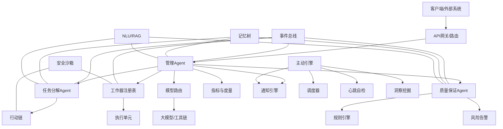

**图表来源**
- [backend/app/core/manager_agent.py](file://backend/app/core/manager_agent.py)
- [backend/app/core/qa_agent.py](file://backend/app/core/qa_agent.py)
- [backend/app/core/task_decomposer.py](file://backend/app/core/task_decomposer.py)
- [backend/app/core/event_bus.py](file://backend/app/core/event_bus.py)
- [backend/app/core/rule_engine.py](file://backend/app/core/rule_engine.py)
- [backend/app/core/model_router.py](file://backend/app/core/model_router.py)
- [backend/app/core/security_sandbox.py](file://backend/app/core/security_sandbox.py)
- [backend/app/core/memory_tree.py](file://backend/app/core/memory_tree.py)
- [backend/app/core/notification_engine.py](file://backend/app/core/notification_engine.py)
- [backend/app/core/action_chain.py](file://backend/app/core/action_chain.py)
- [backend/app/core/nlu.py](file://backend/app/core/nlu.py)
- [backend/app/core/metrics.py](file://backend/app/core/metrics.py)
- [backend/app/core/risk_alert.py](file://backend/app/core/risk_alert.py)
- [backend/app/core/worker_registry.py](file://backend/app/core/worker_registry.py)
- [backend/app/core/proactive_engine.py](file://backend/app/core/proactive_engine.py)

## 详细组件分析

### 管理Agent（Manager Agent）
- 职责
  - 接收业务意图与产品/合规需求，驱动任务分解与执行。
  - 协调工作器注册表与模型路由，确保资源与算力匹配。
  - 统一接入事件总线，实现跨Agent状态同步与冲突仲裁。
  - 调用通知引擎与指标系统，提供可观测性与反馈。
- 关键交互
  - 与事件总线：订阅/发布系统事件与业务事件，驱动状态流转。
  - 与任务分解Agent：下发目标，接收子任务与依赖关系。
  - 与工作器注册表：申请/释放执行资源，跟踪执行进度。
  - 与模型路由：根据上下文选择最优推理路径。
  - 与通知引擎：在关键节点推送结果与告警。
- 生命周期
  - 初始化：加载Agent配置、注册事件监听、启动指标采集。
  - 运行：持续监听事件，编排任务，记录日志与度量。
  - 销毁：清理资源、关闭事件通道、落盘配置快照。

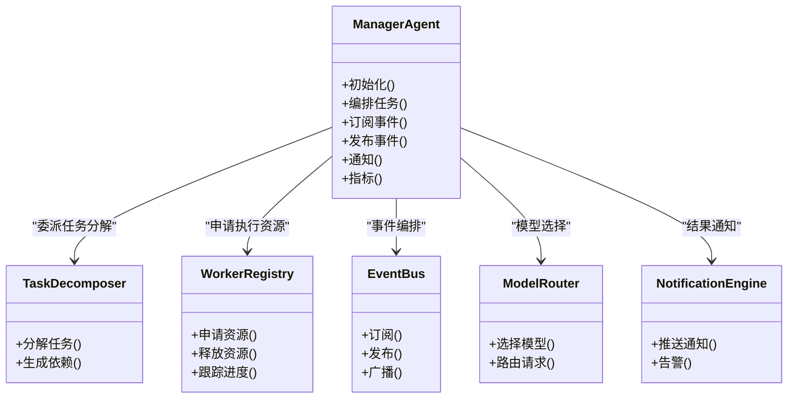

**图表来源**
- [backend/app/core/manager_agent.py](file://backend/app/core/manager_agent.py)
- [backend/app/core/task_decomposer.py](file://backend/app/core/task_decomposer.py)
- [backend/app/core/worker_registry.py](file://backend/app/core/worker_registry.py)
- [backend/app/core/event_bus.py](file://backend/app/core/event_bus.py)
- [backend/app/core/model_router.py](file://backend/app/core/model_router.py)
- [backend/app/core/notification_engine.py](file://backend/app/core/notification_engine.py)

**章节来源**
- [backend/app/core/manager_agent.py](file://backend/app/core/manager_agent.py)
- [backend/app/core/worker_registry.py](file://backend/app/core/worker_registry.py)
- [backend/app/core/event_bus.py](file://backend/app/core/event_bus.py)
- [backend/app/core/model_router.py](file://backend/app/core/model_router.py)
- [backend/app/core/notification_engine.py](file://backend/app/core/notification_engine.py)

### 质量保证Agent（QA Agent）
- 职责
  - 对输出进行规则一致性校验与合规性检查。
  - 结合风险告警与规则引擎，识别异常与潜在违规。
  - 与管理Agent协同，触发回退、重试或人工介入流程。
- 关键交互
  - 与规则引擎：执行静态/动态规则检查。
  - 与风险告警：上报高危项并阻断危险路径。
  - 与管理Agent：反馈校验结果与改进建议。
- 学习与自适应
  - 基于历史校验记录与失败案例，优化规则权重与阈值。
  - 通过指标系统评估校验效率与误报率，迭代规则集。

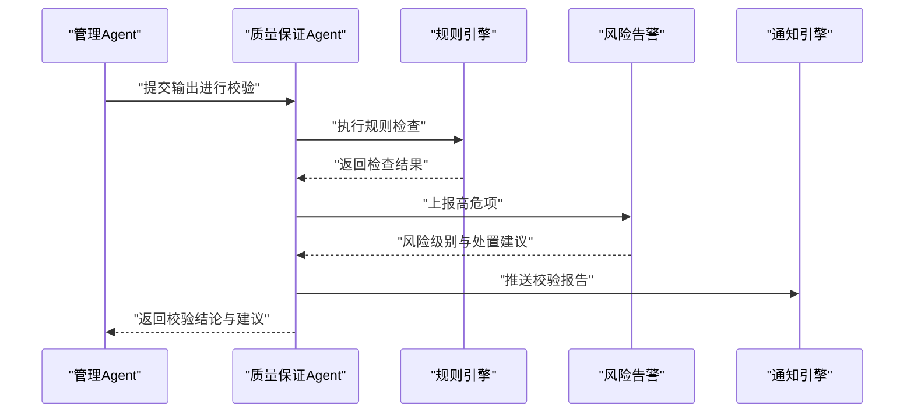

**图表来源**
- [backend/app/core/qa_agent.py](file://backend/app/core/qa_agent.py)
- [backend/app/core/rule_engine.py](file://backend/app/core/rule_engine.py)
- [backend/app/core/risk_alert.py](file://backend/app/core/risk_alert.py)
- [backend/app/core/notification_engine.py](file://backend/app/core/notification_engine.py)

**章节来源**
- [backend/app/core/qa_agent.py](file://backend/app/core/qa_agent.py)
- [backend/app/core/rule_engine.py](file://backend/app/core/rule_engine.py)
- [backend/app/core/risk_alert.py](file://backend/app/core/risk_alert.py)

### 任务分解Agent（Task Decomposer）
- 职责
  - 将高层目标拆解为原子级子任务，明确执行顺序与依赖。
  - 输出可被行动链与工作器注册表直接消费的任务图谱。
- 关键交互
  - 与管理Agent：接收目标，返回任务序列与依赖矩阵。
  - 与行动链：将任务映射为可执行动作序列。
  - 与工作器注册表：为每个子任务绑定执行资源。

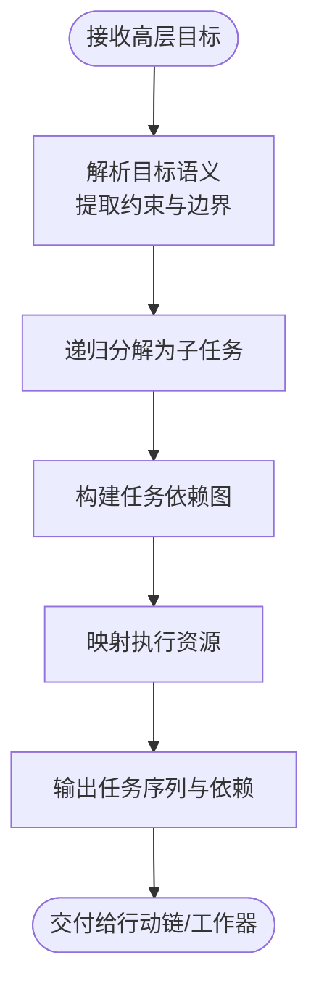

**图表来源**
- [backend/app/core/task_decomposer.py](file://backend/app/core/task_decomposer.py)
- [backend/app/core/action_chain.py](file://backend/app/core/action_chain.py)
- [backend/app/core/worker_registry.py](file://backend/app/core/worker_registry.py)

**章节来源**
- [backend/app/core/task_decomposer.py](file://backend/app/core/task_decomposer.py)
- [backend/app/core/action_chain.py](file://backend/app/core/action_chain.py)
- [backend/app/core/worker_registry.py](file://backend/app/core/worker_registry.py)

### 事件总线（Event Bus）
- 职责
  - 提供统一事件模型与路由机制，支撑跨Agent通信与状态同步。
  - 支持系统事件、业务事件与生命周期事件的订阅/发布。
- 关键交互
  - 与管理Agent：作为中枢事件通道。
  - 与工作器注册表：传递任务状态与资源变更。
  - 与通知引擎：触发告警与结果推送。

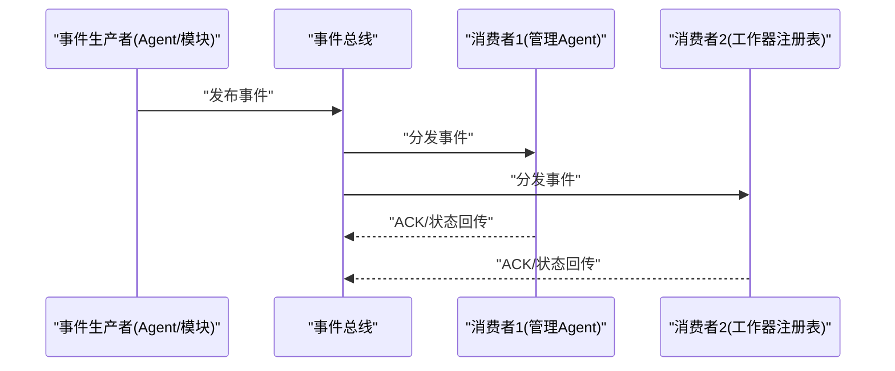

**图表来源**
- [backend/app/core/event_bus.py](file://backend/app/core/event_bus.py)
- [backend/app/api/events.py](file://backend/app/api/events.py)
- [backend/app/api/event_config.py](file://backend/app/api/event_config.py)

**章节来源**
- [backend/app/core/event_bus.py](file://backend/app/core/event_bus.py)
- [backend/app/api/events.py](file://backend/app/api/events.py)
- [backend/app/api/event_config.py](file://backend/app/api/event_config.py)

### 规则引擎与风险告警
- 规则引擎：基于预设规则集进行静态/动态检查，支持规则版本与优先级管理。
- 风险告警：对高危行为与异常模式进行实时监测与阻断，联动通知引擎。

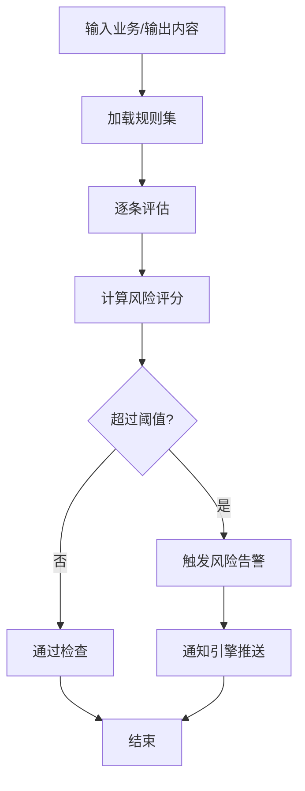

**图表来源**
- [backend/app/core/rule_engine.py](file://backend/app/core/rule_engine.py)
- [backend/app/core/risk_alert.py](file://backend/app/core/risk_alert.py)
- [backend/app/core/notification_engine.py](file://backend/app/core/notification_engine.py)

**章节来源**
- [backend/app/core/rule_engine.py](file://backend/app/core/rule_engine.py)
- [backend/app/core/risk_alert.py](file://backend/app/core/risk_alert.py)

### 模型路由与安全沙箱
- 模型路由：根据任务类型、上下文复杂度与成本预算选择合适模型或工具链。
- 安全沙箱：对工具调用与代码生成进行隔离执行与权限控制，防止越权与副作用。

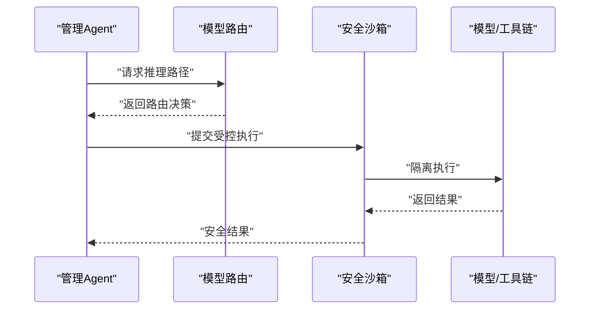

**图表来源**
- [backend/app/core/model_router.py](file://backend/app/core/model_router.py)
- [backend/app/core/security_sandbox.py](file://backend/app/core/security_sandbox.py)

**章节来源**
- [backend/app/core/model_router.py](file://backend/app/core/model_router.py)
- [backend/app/core/security_sandbox.py](file://backend/app/core/security_sandbox.py)

### 记忆树与NLU/RAG
- 记忆树：结构化存储对话、产品、知识与事件，支持快速检索与上下文拼接。
- NLU/RAG：理解用户意图与检索相关知识，提升问答与决策准确性。

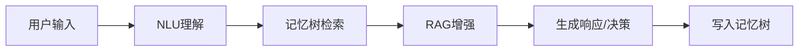

**图表来源**
- [backend/app/core/nlu.py](file://backend/app/core/nlu.py)
- [backend/app/core/memory_tree.py](file://backend/app/core/memory_tree.py)

**章节来源**
- [backend/app/core/nlu.py](file://backend/app/core/nlu.py)
- [backend/app/core/memory_tree.py](file://backend/app/core/memory_tree.py)

### 通知引擎与指标系统
- 通知引擎：将结果、告警与状态变化通过邮件、站内信、IM等渠道推送。
- 指标系统：采集执行时延、吞吐、错误率、规则命中率等，驱动优化闭环。

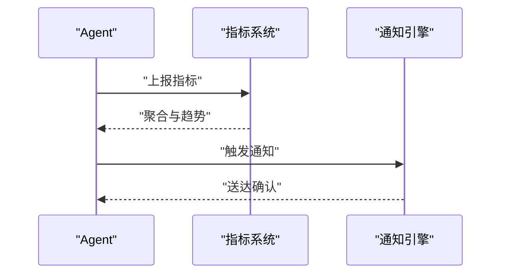

**图表来源**
- [backend/app/core/metrics.py](file://backend/app/core/metrics.py)
- [backend/app/core/notification_engine.py](file://backend/app/core/notification_engine.py)

**章节来源**
- [backend/app/core/metrics.py](file://backend/app/core/metrics.py)
- [backend/app/core/notification_engine.py](file://backend/app/core/notification_engine.py)

### 主动引擎（Proactive Engine）
- 职责
  - 负责定时任务、心跳自检和洞察挖掘，提供主动式合规管理。
  - 基于QwenPaw心跳机制，实现系统健康监控。
  - 从对话和业务数据中挖掘潜在需求和风险。
- 关键交互
  - 与调度器：设置和管理定时任务。
  - 与通知引擎：主动推送洞察和预警信息。
  - 与事件总线：触发系统自检和业务事件。

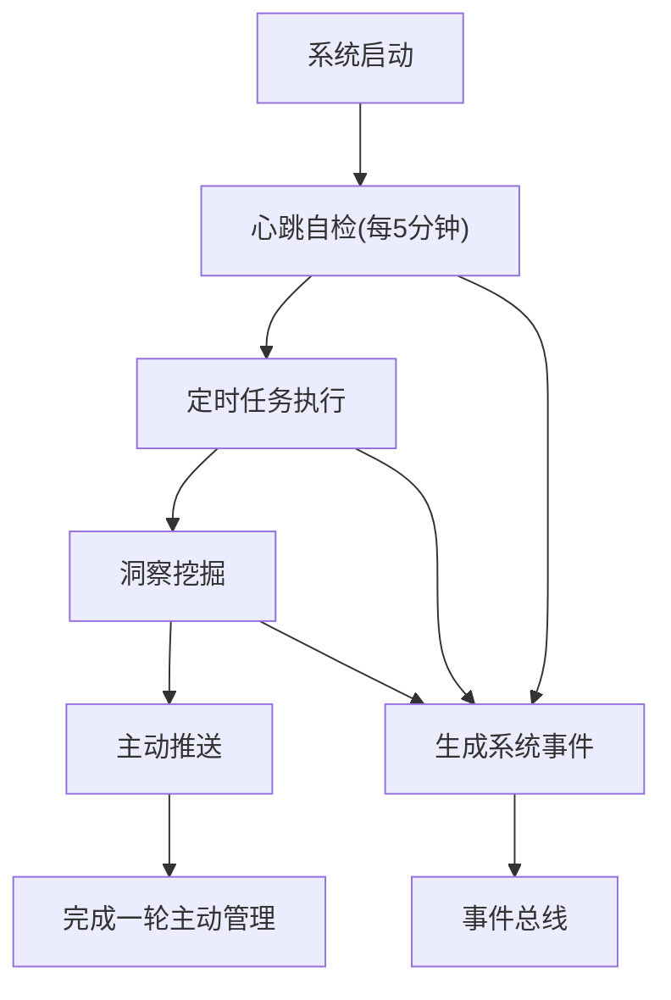

**图表来源**
- [backend/app/core/proactive_engine.py](file://backend/app/core/proactive_engine.py)
- [backend/app/core/scheduler.py](file://backend/app/core/scheduler.py)
- [backend/app/core/notification_engine.py](file://backend/app/core/notification_engine.py)
- [backend/app/core/event_bus.py](file://backend/app/core/event_bus.py)

**章节来源**
- [backend/app/core/proactive_engine.py](file://backend/app/core/proactive_engine.py)
- [backend/app/core/scheduler.py](file://backend/app/core/scheduler.py)

## 依赖关系分析
- 组件耦合
  - 管理Agent是中枢，与任务分解、工作器、事件总线、模型路由、通知与指标均有强耦合。
  - QA Agent与规则引擎、风险告警存在紧密耦合，共同构成质量与合规防线。
  - 记忆树与NLU/RAG为多Agent共享基础设施，降低重复实现与提升一致性。
  - 主动引擎与调度器、通知引擎形成新的耦合关系，提供主动式管理能力。
- 外部依赖
  - API层依赖核心模块提供的能力；存储层与数据配置提供持久化与扩展点。
  - 事件总线与通知引擎为横切关注点，贯穿各Agent，避免重复实现。

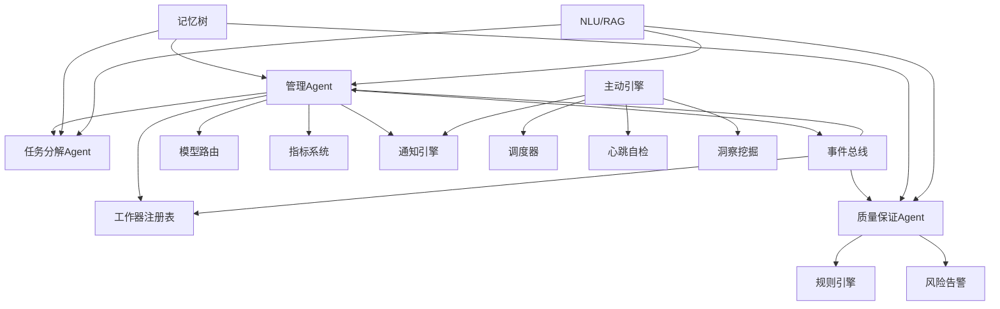

**图表来源**
- [backend/app/core/manager_agent.py](file://backend/app/core/manager_agent.py)
- [backend/app/core/qa_agent.py](file://backend/app/core/qa_agent.py)
- [backend/app/core/task_decomposer.py](file://backend/app/core/task_decomposer.py)
- [backend/app/core/event_bus.py](file://backend/app/core/event_bus.py)
- [backend/app/core/rule_engine.py](file://backend/app/core/rule_engine.py)
- [backend/app/core/risk_alert.py](file://backend/app/core/risk_alert.py)
- [backend/app/core/memory_tree.py](file://backend/app/core/memory_tree.py)
- [backend/app/core/nlu.py](file://backend/app/core/nlu.py)
- [backend/app/core/notification_engine.py](file://backend/app/core/notification_engine.py)
- [backend/app/core/metrics.py](file://backend/app/core/metrics.py)
- [backend/app/core/worker_registry.py](file://backend/app/core/worker_registry.py)
- [backend/app/core/proactive_engine.py](file://backend/app/core/proactive_engine.py)
- [backend/app/core/scheduler.py](file://backend/app/core/scheduler.py)

**章节来源**
- [backend/app/core/manager_agent.py](file://backend/app/core/manager_agent.py)
- [backend/app/core/qa_agent.py](file://backend/app/core/qa_agent.py)
- [backend/app/core/task_decomposer.py](file://backend/app/core/task_decomposer.py)
- [backend/app/core/event_bus.py](file://backend/app/core/event_bus.py)
- [backend/app/core/rule_engine.py](file://backend/app/core/rule_engine.py)
- [backend/app/core/risk_alert.py](file://backend/app/core/risk_alert.py)
- [backend/app/core/memory_tree.py](file://backend/app/core/memory_tree.py)
- [backend/app/core/nlu.py](file://backend/app/core/nlu.py)
- [backend/app/core/notification_engine.py](file://backend/app/core/notification_engine.py)
- [backend/app/core/metrics.py](file://backend/app/core/metrics.py)
- [backend/app/core/worker_registry.py](file://backend/app/core/worker_registry.py)
- [backend/app/core/proactive_engine.py](file://backend/app/core/proactive_engine.py)

## 性能考量
- 并行与流水线
  - 利用行动链与工作器注册表实现任务并行执行，缩短端到端时延。
  - 通过模型路由与安全沙箱的异步化，减少阻塞。
- 缓存与检索
  - 记忆树与NLU/RAG的缓存命中率直接影响响应速度，应定期评估与优化。
- 指标与压测
  - 指标系统应覆盖吞吐、P95/P99、错误率与资源利用率，配合压测验证扩容策略。
- 主动引擎性能
  - 定时任务和心跳自检应合理配置执行频率，避免过度消耗系统资源。

## 故障排查指南
- 事件丢失与延迟
  - 检查事件总线订阅/发布状态与队列积压；核对事件配置与路由规则。
- 执行失败与回滚
  - 审视行动链与工作器注册表的错误码与重试策略；必要时触发回滚。
- 安全拦截与越权
  - 审查安全沙箱日志与模型路由决策；核对规则引擎阈值与白名单。
- 通知失败
  - 检查通知引擎配置与下游渠道可用性；核对告警模板与接收人列表。
- 主动引擎故障
  - 检查调度器配置与定时任务状态；核对心跳自检日志与洞察挖掘结果。

**章节来源**
- [backend/app/core/event_bus.py](file://backend/app/core/event_bus.py)
- [backend/app/core/action_chain.py](file://backend/app/core/action_chain.py)
- [backend/app/core/worker_registry.py](file://backend/app/core/worker_registry.py)
- [backend/app/core/security_sandbox.py](file://backend/app/core/security_sandbox.py)
- [backend/app/core/notification_engine.py](file://backend/app/core/notification_engine.py)
- [backend/app/core/rule_engine.py](file://backend/app/core/rule_engine.py)
- [backend/app/core/proactive_engine.py](file://backend/app/core/proactive_engine.py)

## 结论
避风港平台的多Agent架构以管理Agent为核心，通过事件总线实现松耦合协作，借助规则引擎与安全沙箱保障合规与安全，利用记忆树与NLU/RAG提升智能水平，配合通知与指标系统形成闭环。新增的主动引擎进一步增强了系统的智能化程度，能够主动发现和处理合规风险。该架构具备良好的扩展性与自适应能力，适合在复杂的合规与产品治理场景中演进。

**更新** 本次更新反映了架构的简化和智能化升级，移除了复杂的合规流程引擎，采用更直接的服务导向处理方式，同时增强了主动管理和错误处理能力。

## 附录

### Agent角色分工与协作机制
- 管理Agent：中枢编排、资源协调、状态同步、通知与指标。
- QA Agent：质量与合规守门人，规则与风险联动。
- 任务分解Agent：目标到任务的桥梁，产出可执行图谱。
- 主动引擎：定时任务、心跳自检、洞察挖掘，提供主动式管理。
- 共享基础：事件总线、记忆树、NLU/RAG、通知与指标。

**章节来源**
- [backend/app/core/manager_agent.py](file://backend/app/core/manager_agent.py)
- [backend/app/core/qa_agent.py](file://backend/app/core/qa_agent.py)
- [backend/app/core/task_decomposer.py](file://backend/app/core/task_decomposer.py)
- [backend/app/core/event_bus.py](file://backend/app/core/event_bus.py)
- [backend/app/core/memory_tree.py](file://backend/app/core/memory_tree.py)
- [backend/app/core/nlu.py](file://backend/app/core/nlu.py)
- [backend/app/core/notification_engine.py](file://backend/app/core/notification_engine.py)
- [backend/app/core/metrics.py](file://backend/app/core/metrics.py)
- [backend/app/core/proactive_engine.py](file://backend/app/core/proactive_engine.py)

### 通信协议与状态同步
- 事件协议：统一事件格式与路由键，支持广播与点对点分发。
- 状态同步：通过事件总线发布任务状态变更，消费者本地持久化并回传ACK。
- 冲突解决：基于事件时间戳与幂等键去重，必要时引入仲裁策略。

**章节来源**
- [backend/app/core/event_bus.py](file://backend/app/core/event_bus.py)
- [backend/app/api/events.py](file://backend/app/api/events.py)

### 学习能力与自适应机制
- 规则自适应：基于历史校验与误报统计调整规则权重与阈值。
- 模型路由优化：根据任务类型与成本效果动态调整路由策略。
- 记忆树优化：通过检索命中率与相关性评估改进索引与嵌入策略。
- 主动引擎自适应：基于系统运行状态和业务反馈调整主动检测策略。

**章节来源**
- [backend/app/core/qa_agent.py](file://backend/app/core/qa_agent.py)
- [backend/app/core/rule_engine.py](file://backend/app/core/rule_engine.py)
- [backend/app/core/model_router.py](file://backend/app/core/model_router.py)
- [backend/app/core/memory_tree.py](file://backend/app/core/memory_tree.py)
- [backend/app/core/proactive_engine.py](file://backend/app/core/proactive_engine.py)

### 生命周期管理
- 创建：加载配置、注册事件监听、初始化存储与指标。
- 初始化：建立与事件总线、工作器、模型路由的连接。
- 运行：持续监听事件、编排任务、记录日志与度量。
- 销毁：清理资源、关闭事件通道、落盘配置快照。

**章节来源**
- [backend/app/storage/agent_config_store.py](file://backend/app/storage/agent_config_store.py)
- [backend/app/core/manager_agent.py](file://backend/app/core/manager_agent.py)

### 配置管理、性能监控与故障恢复
- 配置管理：Agent配置存储与扩展清单，支持热更新与灰度。
- 性能监控：指标采集与可视化，支持告警与趋势分析。
- 故障恢复：自动重试、降级策略与手动干预接口。
- 错误处理与日志记录：统一的日志格式和错误分类，支持分布式追踪。

**章节来源**
- [backend/app/storage/agent_config_store.py](file://backend/app/storage/agent_config_store.py)
- [backend/data/config/agent_extensions.json](file://backend/data/config/agent_extensions.json)
- [backend/app/core/metrics.py](file://backend/app/core/metrics.py)
- [backend/app/core/notification_engine.py](file://backend/app/core/notification_engine.py)

### 典型应用场景与落地实践
- 合规扫描与报告生成：管理Agent接收合规目标，任务分解Agent拆解为扫描与生成子任务，QA Agent进行规则校验，最终由通知引擎推送报告。
- 产品信息治理：结合知识与记忆树，NLU理解用户问题，RAG检索相关产品与法规，行动链执行查询与更新，指标系统评估效果。
- 风险阻断与回退：规则引擎与风险告警识别高危行为，安全沙箱隔离执行，必要时回滚并通知管理员。
- 主动合规管理：主动引擎定时检查认证状态、法规变更和系统健康状况，提前发现和处理潜在问题。

**章节来源**
- [backend/app/services/compliance.py](file://backend/app/services/compliance.py)
- [backend/app/core/nlu.py](file://backend/app/core/nlu.py)
- [backend/app/core/memory_tree.py](file://backend/app/core/memory_tree.py)
- [backend/app/core/action_chain.py](file://backend/app/core/action_chain.py)
- [backend/app/core/risk_alert.py](file://backend/app/core/risk_alert.py)
- [backend/app/core/security_sandbox.py](file://backend/app/core/security_sandbox.py)
- [backend/app/core/notification_engine.py](file://backend/app/core/notification_engine.py)
- [backend/app/core/proactive_engine.py](file://backend/app/core/proactive_engine.py)