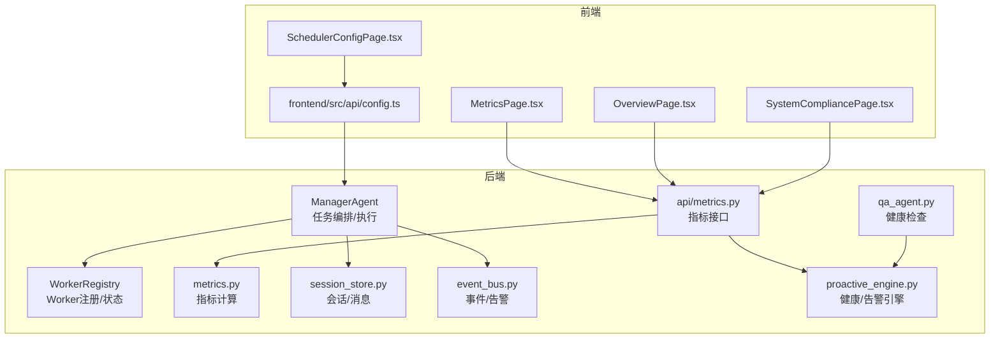
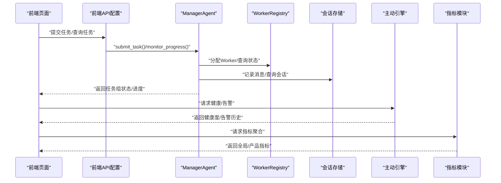
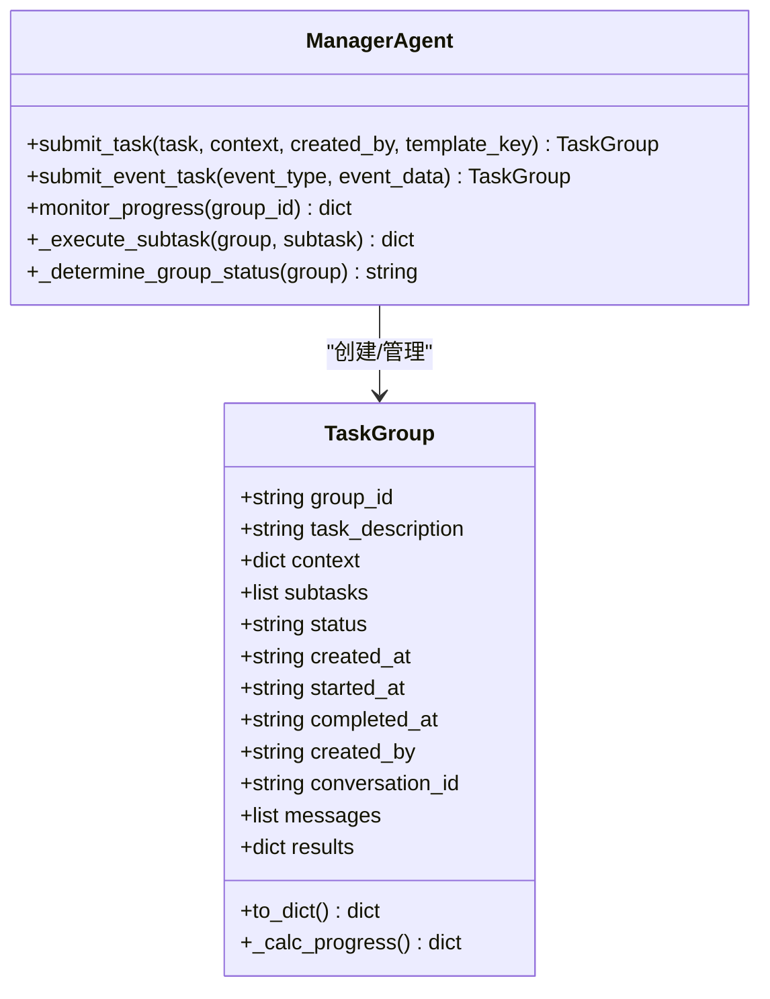
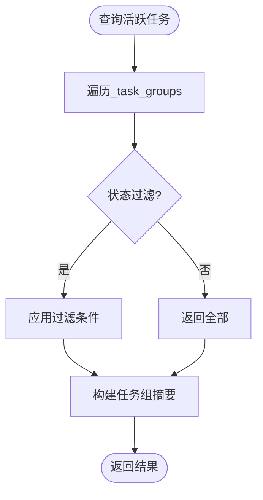
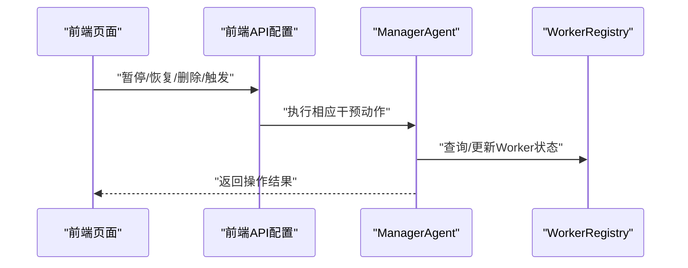
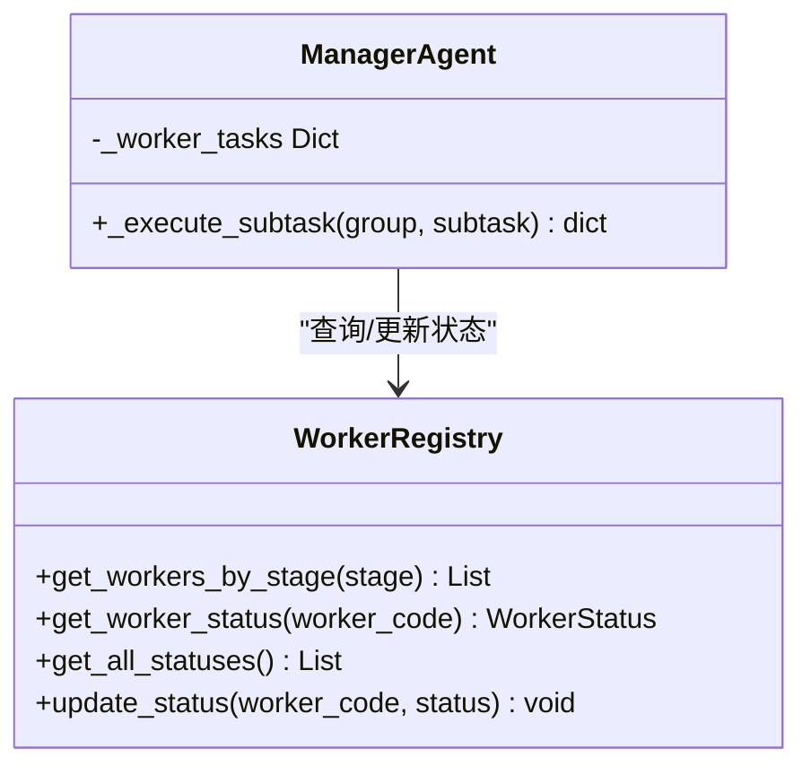
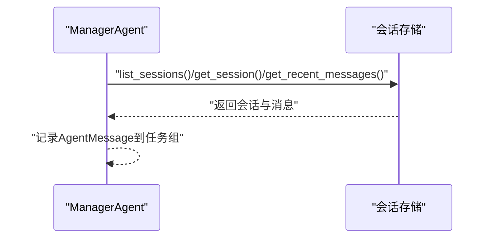
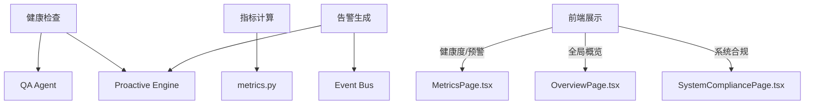
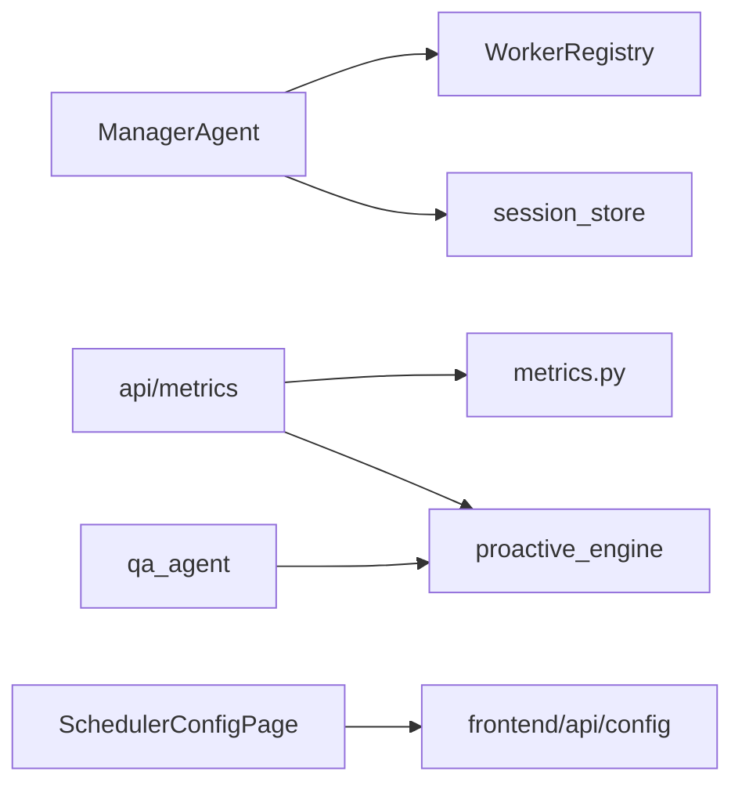

# 监控与控制

<cite>
**本文引用的文件**
- [backend/app/core/manager_agent.py](file://backend/app/core/manager_agent.py)
- [backend/app/core/worker_registry.py](file://backend/app/core/worker_registry.py)
- [backend/app/core/metrics.py](file://backend/app/core/metrics.py)
- [backend/app/api/metrics.py](file://backend/app/api/metrics.py)
- [backend/app/storage/session_store.py](file://backend/app/storage/session_store.py)
- [backend/app/core/event_bus.py](file://backend/app/core/event_bus.py)
- [backend/app/core/proactive_engine.py](file://backend/app/core/proactive_engine.py)
- [backend/app/core/qa_agent.py](file://backend/app/core/qa_agent.py)
- [frontend/src/pages/MetricsPage.tsx](file://frontend/src/pages/MetricsPage.tsx)
- [frontend/src/pages/config/SchedulerConfigPage.tsx](file://frontend/src/pages/config/SchedulerConfigPage.tsx)
- [frontend/src/pages/OverviewPage.tsx](file://frontend/src/pages/OverviewPage.tsx)
- [frontend/src/pages/SystemCompliancePage.tsx](file://frontend/src/pages/SystemCompliancePage.tsx)
- [frontend/src/api/config.ts](file://frontend/src/api/config.ts)
</cite>

## 目录
1. [简介](#简介)
2. [项目结构](#项目结构)
3. [核心组件](#核心组件)
4. [架构总览](#架构总览)
5. [详细组件分析](#详细组件分析)
6. [依赖分析](#依赖分析)
7. [性能考虑](#性能考虑)
8. [故障排查指南](#故障排查指南)
9. [结论](#结论)
10. [附录](#附录)

## 简介
本文件面向避风港平台的监控与控制体系，聚焦于任务组（TaskGroup）的状态管理与进度监控、活跃任务组查询、任务历史与统计、用户干预（取消、暂停/恢复、重试）、Worker状态与负载统计、消息历史与群聊会话管理，以及系统健康检查、性能指标采集与异常告警的实现方案，并给出监控仪表板设计思路与实际监控示例。

## 项目结构
- 后端核心模块负责任务编排、Worker调度、指标聚合与健康检查；前端页面提供可视化监控与操作入口。
- 关键路径概览：
  - 任务编排与执行：backend/app/core/manager_agent.py
  - Worker注册与状态：backend/app/core/worker_registry.py
  - 指标计算与聚合：backend/app/core/metrics.py、backend/app/api/metrics.py
  - 会话与消息：backend/app/storage/session_store.py
  - 事件与告警：backend/app/core/event_bus.py、backend/app/core/proactive_engine.py
  - 健康检查：backend/app/core/qa_agent.py
  - 前端监控页：frontend/src/pages/MetricsPage.tsx、OverviewPage.tsx、SystemCompliancePage.tsx、SchedulerConfigPage.tsx
  - 前端调度API：frontend/src/api/config.ts

图表来源
- [backend/app/core/manager_agent.py:149-224](file://backend/app/core/manager_agent.py#L149-L224)
- [backend/app/core/worker_registry.py:182-220](file://backend/app/core/worker_registry.py#L182-L220)
- [backend/app/core/metrics.py:167-240](file://backend/app/core/metrics.py#L167-L240)
- [backend/app/api/metrics.py:101-139](file://backend/app/api/metrics.py#L101-L139)
- [backend/app/storage/session_store.py:87-183](file://backend/app/storage/session_store.py#L87-L183)
- [backend/app/core/event_bus.py:633-654](file://backend/app/core/event_bus.py#L633-L654)
- [backend/app/core/proactive_engine.py:538-573](file://backend/app/core/proactive_engine.py#L538-L573)
- [backend/app/core/qa_agent.py:322-351](file://backend/app/core/qa_agent.py#L322-L351)
- [frontend/src/pages/MetricsPage.tsx:1-33](file://frontend/src/pages/MetricsPage.tsx#L1-L33)
- [frontend/src/pages/config/SchedulerConfigPage.tsx:126-449](file://frontend/src/pages/config/SchedulerConfigPage.tsx#L126-L449)
- [frontend/src/pages/OverviewPage.tsx:188-219](file://frontend/src/pages/OverviewPage.tsx#L188-L219)
- [frontend/src/pages/SystemCompliancePage.tsx:187-209](file://frontend/src/pages/SystemCompliancePage.tsx#L187-L209)
- [frontend/src/api/config.ts:598-634](file://frontend/src/api/config.ts#L598-L634)

章节来源
- [backend/app/core/manager_agent.py:149-224](file://backend/app/core/manager_agent.py#L149-L224)
- [backend/app/core/worker_registry.py:182-220](file://backend/app/core/worker_registry.py#L182-L220)
- [backend/app/core/metrics.py:167-240](file://backend/app/core/metrics.py#L167-L240)
- [backend/app/api/metrics.py:101-139](file://backend/app/api/metrics.py#L101-L139)
- [backend/app/storage/session_store.py:87-183](file://backend/app/storage/session_store.py#L87-L183)
- [backend/app/core/event_bus.py:633-654](file://backend/app/core/event_bus.py#L633-L654)
- [backend/app/core/proactive_engine.py:538-573](file://backend/app/core/proactive_engine.py#L538-L573)
- [backend/app/core/qa_agent.py:322-351](file://backend/app/core/qa_agent.py#L322-L351)
- [frontend/src/pages/MetricsPage.tsx:1-33](file://frontend/src/pages/MetricsPage.tsx#L1-L33)
- [frontend/src/pages/config/SchedulerConfigPage.tsx:126-449](file://frontend/src/pages/config/SchedulerConfigPage.tsx#L126-L449)
- [frontend/src/pages/OverviewPage.tsx:188-219](file://frontend/src/pages/OverviewPage.tsx#L188-L219)
- [frontend/src/pages/SystemCompliancePage.tsx:187-209](file://frontend/src/pages/SystemCompliancePage.tsx#L187-L209)
- [frontend/src/api/config.ts:598-634](file://frontend/src/api/config.ts#L598-L634)

## 核心组件
- 任务组（TaskGroup）与子任务（SubTask）：封装任务描述、上下文、状态、进度、消息与结果，支持并行执行与失败重试。
- ManagerAgent：负责任务拆解、Worker分配、执行调度、消息记录与状态汇总。
- WorkerRegistry：维护Worker定义与运行时状态，提供按阶段筛选与批量状态查询。
- 指标模块：计算健康度、风险比率、证书到期密度等专项指标，并支持聚合与趋势分析。
- 事件总线与主动引擎：定义事件类型、触发条件与严重级别，生成告警并记录历史。
- 会话存储：提供会话列表、最近消息查询，支撑群聊会话管理。
- 健康检查：QA Agent与Proactive Engine协同进行组件健康度评估。
- 前端监控页：提供全局健康度、预警数量、任务状态概览与调度操作入口。

章节来源
- [backend/app/core/manager_agent.py:64-114](file://backend/app/core/manager_agent.py#L64-L114)
- [backend/app/core/manager_agent.py:166-247](file://backend/app/core/manager_agent.py#L166-L247)
- [backend/app/core/manager_agent.py:372-446](file://backend/app/core/manager_agent.py#L372-L446)
- [backend/app/core/worker_registry.py:182-220](file://backend/app/core/worker_registry.py#L182-L220)
- [backend/app/core/metrics.py:182-240](file://backend/app/core/metrics.py#L182-L240)
- [backend/app/api/metrics.py:101-139](file://backend/app/api/metrics.py#L101-L139)
- [backend/app/core/event_bus.py:633-654](file://backend/app/core/event_bus.py#L633-L654)
- [backend/app/core/proactive_engine.py:538-573](file://backend/app/core/proactive_engine.py#L538-L573)
- [backend/app/storage/session_store.py:87-183](file://backend/app/storage/session_store.py#L87-L183)
- [frontend/src/pages/MetricsPage.tsx:1-33](file://frontend/src/pages/MetricsPage.tsx#L1-L33)
- [frontend/src/pages/config/SchedulerConfigPage.tsx:126-449](file://frontend/src/pages/config/SchedulerConfigPage.tsx#L126-L449)

## 架构总览
下图展示从前端到后端的关键交互路径，涵盖任务提交、执行、状态查询、指标聚合与告警展示。

图表来源
- [frontend/src/api/config.ts:598-634](file://frontend/src/api/config.ts#L598-L634)
- [backend/app/core/manager_agent.py:166-247](file://backend/app/core/manager_agent.py#L166-L247)
- [backend/app/core/worker_registry.py:182-220](file://backend/app/core/worker_registry.py#L182-L220)
- [backend/app/storage/session_store.py:87-183](file://backend/app/storage/session_store.py#L87-L183)
- [backend/app/core/proactive_engine.py:538-573](file://backend/app/core/proactive_engine.py#L538-L573)
- [backend/app/core/metrics.py:167-240](file://backend/app/core/metrics.py#L167-L240)

## 详细组件分析

### 任务组（TaskGroup）状态管理与进度监控
- 状态模型：pending/running/paused/done/failed/cancelled，支持子任务粒度统计与百分比进度。
- 进度计算：统计total/done/failed/running/pending，并计算完成百分比。
- 执行流程：ManagerAgent按依赖关系并行执行子任务，失败自动重试（受子任务max_retries限制），完成后汇总任务组状态。
- 用户干预：通过API触发暂停/恢复/取消等操作（见“用户干预机制”）。

图表来源
- [backend/app/core/manager_agent.py:64-114](file://backend/app/core/manager_agent.py#L64-L114)
- [backend/app/core/manager_agent.py:166-247](file://backend/app/core/manager_agent.py#L166-L247)
- [backend/app/core/manager_agent.py:372-446](file://backend/app/core/manager_agent.py#L372-L446)
- [backend/app/core/manager_agent.py:690-699](file://backend/app/core/manager_agent.py#L690-L699)

章节来源
- [backend/app/core/manager_agent.py:64-114](file://backend/app/core/manager_agent.py#L64-L114)
- [backend/app/core/manager_agent.py:166-247](file://backend/app/core/manager_agent.py#L166-L247)
- [backend/app/core/manager_agent.py:372-446](file://backend/app/core/manager_agent.py#L372-L446)
- [backend/app/core/manager_agent.py:690-699](file://backend/app/core/manager_agent.py#L690-L699)

### 活跃任务组查询、任务历史与统计
- 活跃任务组：ManagerAgent内部维护_task_groups字典，可通过group_id查询状态与进度。
- 任务历史：消息历史通过AgentMessage记录，支持广播与定向消息，便于审计与回溯。
- 统计信息：指标模块计算健康度、风险比率、证书到期密度等专项指标，并支持聚合与趋势分析。

图表来源
- [backend/app/core/manager_agent.py:149-224](file://backend/app/core/manager_agent.py#L149-L224)

章节来源
- [backend/app/core/manager_agent.py:149-224](file://backend/app/core/manager_agent.py#L149-L224)
- [backend/app/core/metrics.py:182-240](file://backend/app/core/metrics.py#L182-L240)
- [backend/app/api/metrics.py:101-139](file://backend/app/api/metrics.py#L101-L139)

### 用户干预机制（取消、暂停/恢复、重试）
- 前端调度API提供暂停、恢复、删除、立即触发等操作，对应后端路由与Worker绑定管理。
- 任务组层面：ManagerAgent支持取消子任务、暂停/恢复任务组（需结合具体实现扩展）。
- Worker层面：WorkerRegistry提供Worker状态查询与批量状态更新，便于负载均衡与故障隔离。

图表来源
- [frontend/src/api/config.ts:598-634](file://frontend/src/api/config.ts#L598-L634)
- [backend/app/core/manager_agent.py:166-247](file://backend/app/core/manager_agent.py#L166-L247)
- [backend/app/core/worker_registry.py:182-220](file://backend/app/core/worker_registry.py#L182-L220)

章节来源
- [frontend/src/api/config.ts:598-634](file://frontend/src/api/config.ts#L598-L634)
- [backend/app/core/worker_registry.py:182-220](file://backend/app/core/worker_registry.py#L182-L220)

### Worker状态监控与负载统计
- Worker注册与状态：WorkerRegistry提供按业务阶段筛选Worker、获取单个Worker运行时状态、批量状态查询与更新。
- 负载统计：ManagerAgent跟踪每个Worker正在执行的任务列表，用于负载评估与再平衡。

图表来源
- [backend/app/core/worker_registry.py:182-220](file://backend/app/core/worker_registry.py#L182-L220)
- [backend/app/core/manager_agent.py:372-446](file://backend/app/core/manager_agent.py#L372-L446)

章节来源
- [backend/app/core/worker_registry.py:182-220](file://backend/app/core/worker_registry.py#L182-L220)
- [backend/app/core/manager_agent.py:372-446](file://backend/app/core/manager_agent.py#L372-L446)

### 消息历史记录与群聊会话管理
- 会话管理：支持列出最近会话、按用户过滤、获取会话详情与最近N条消息，用于上下文传递与回放。
- 群聊会话：任务组关联conversation_id，消息记录支持广播与定向，便于跨Agent协作与审计。

图表来源
- [backend/app/storage/session_store.py:87-183](file://backend/app/storage/session_store.py#L87-L183)
- [backend/app/core/manager_agent.py:308-314](file://backend/app/core/manager_agent.py#L308-L314)

章节来源
- [backend/app/storage/session_store.py:87-183](file://backend/app/storage/session_store.py#L87-L183)
- [backend/app/core/manager_agent.py:308-314](file://backend/app/core/manager_agent.py#L308-L314)

### 系统健康检查、性能指标与异常告警
- 健康检查：QA Agent与Proactive Engine分别对组件进行健康度评估，输出overall与各子系统状态。
- 性能指标：指标模块计算健康度、风险比率、证书到期密度等，支持阈值与趋势分析。
- 异常告警：事件总线定义事件类型与严重级别，主动引擎生成告警并记录历史，前端展示预警列表。

图表来源
- [backend/app/core/qa_agent.py:322-351](file://backend/app/core/qa_agent.py#L322-L351)
- [backend/app/core/proactive_engine.py:538-573](file://backend/app/core/proactive_engine.py#L538-L573)
- [backend/app/core/metrics.py:182-240](file://backend/app/core/metrics.py#L182-L240)
- [backend/app/core/event_bus.py:633-654](file://backend/app/core/event_bus.py#L633-L654)
- [frontend/src/pages/MetricsPage.tsx:1-33](file://frontend/src/pages/MetricsPage.tsx#L1-L33)
- [frontend/src/pages/OverviewPage.tsx:188-219](file://frontend/src/pages/OverviewPage.tsx#L188-L219)
- [frontend/src/pages/SystemCompliancePage.tsx:187-209](file://frontend/src/pages/SystemCompliancePage.tsx#L187-L209)

章节来源
- [backend/app/core/qa_agent.py:322-351](file://backend/app/core/qa_agent.py#L322-L351)
- [backend/app/core/proactive_engine.py:538-573](file://backend/app/core/proactive_engine.py#L538-L573)
- [backend/app/core/metrics.py:182-240](file://backend/app/core/metrics.py#L182-L240)
- [backend/app/core/event_bus.py:633-654](file://backend/app/core/event_bus.py#L633-L654)
- [frontend/src/pages/MetricsPage.tsx:1-33](file://frontend/src/pages/MetricsPage.tsx#L1-L33)
- [frontend/src/pages/OverviewPage.tsx:188-219](file://frontend/src/pages/OverviewPage.tsx#L188-L219)
- [frontend/src/pages/SystemCompliancePage.tsx:187-209](file://frontend/src/pages/SystemCompliancePage.tsx#L187-L209)

## 依赖分析
- 组件耦合：
  - ManagerAgent依赖WorkerRegistry进行Worker分配与状态查询，依赖会话存储记录消息。
  - 指标模块与API层解耦，通过Proactive Engine与Event Bus实现告警与健康检查。
- 外部依赖：
  - 前端通过API配置调用后端任务与指标接口，调度页面直接对接后端Worker绑定与任务操作。

图表来源
- [backend/app/core/manager_agent.py:149-224](file://backend/app/core/manager_agent.py#L149-L224)
- [backend/app/core/worker_registry.py:182-220](file://backend/app/core/worker_registry.py#L182-L220)
- [backend/app/storage/session_store.py:87-183](file://backend/app/storage/session_store.py#L87-L183)
- [backend/app/api/metrics.py:101-139](file://backend/app/api/metrics.py#L101-L139)
- [backend/app/core/metrics.py:167-240](file://backend/app/core/metrics.py#L167-L240)
- [backend/app/core/proactive_engine.py:538-573](file://backend/app/core/proactive_engine.py#L538-L573)
- [backend/app/core/qa_agent.py:322-351](file://backend/app/core/qa_agent.py#L322-L351)
- [frontend/src/pages/config/SchedulerConfigPage.tsx:126-449](file://frontend/src/pages/config/SchedulerConfigPage.tsx#L126-L449)
- [frontend/src/api/config.ts:598-634](file://frontend/src/api/config.ts#L598-L634)

章节来源
- [backend/app/core/manager_agent.py:149-224](file://backend/app/core/manager_agent.py#L149-L224)
- [backend/app/core/worker_registry.py:182-220](file://backend/app/core/worker_registry.py#L182-L220)
- [backend/app/storage/session_store.py:87-183](file://backend/app/storage/session_store.py#L87-L183)
- [backend/app/api/metrics.py:101-139](file://backend/app/api/metrics.py#L101-L139)
- [backend/app/core/metrics.py:167-240](file://backend/app/core/metrics.py#L167-L240)
- [backend/app/core/proactive_engine.py:538-573](file://backend/app/core/proactive_engine.py#L538-L573)
- [backend/app/core/qa_agent.py:322-351](file://backend/app/core/qa_agent.py#L322-L351)
- [frontend/src/pages/config/SchedulerConfigPage.tsx:126-449](file://frontend/src/pages/config/SchedulerConfigPage.tsx#L126-L449)
- [frontend/src/api/config.ts:598-634](file://frontend/src/api/config.ts#L598-L634)

## 性能考虑
- 并行执行：ManagerAgent按依赖关系并行执行子任务，提升吞吐；注意合理设置max_retries避免无限重试。
- 负载均衡：WorkerRegistry按业务阶段筛选Worker，结合_manager的_worker_tasks统计进行再平衡。
- 指标聚合：指标模块采用批量计算与缓存策略，减少重复计算开销。
- 前端刷新：监控页面支持自动刷新与定时器管理，避免频繁请求导致压力。

## 故障排查指南
- 任务卡住或长时间pending：
  - 检查子任务依赖是否满足，确认Worker是否可用。
  - 查看消息历史与错误字段，定位失败原因。
- Worker负载过高：
  - 使用WorkerRegistry批量状态查询，识别繁忙Worker；必要时调整绑定或扩容。
- 健康度下降：
  - 通过QA Agent与Proactive Engine的健康检查接口定位问题组件。
- 告警未显示：
  - 检查事件总线事件定义与严重级别，确认告警历史查询参数。

章节来源
- [backend/app/core/manager_agent.py:372-446](file://backend/app/core/manager_agent.py#L372-L446)
- [backend/app/core/worker_registry.py:182-220](file://backend/app/core/worker_registry.py#L182-L220)
- [backend/app/core/qa_agent.py:322-351](file://backend/app/core/qa_agent.py#L322-L351)
- [backend/app/core/event_bus.py:633-654](file://backend/app/core/event_bus.py#L633-L654)
- [backend/app/core/proactive_engine.py:538-573](file://backend/app/core/proactive_engine.py#L538-L573)

## 结论
避风港平台通过ManagerAgent实现任务组的全生命周期管理，配合WorkerRegistry、会话存储与指标/告警模块，形成完整的监控与控制闭环。前端提供直观的可视化界面与操作入口，支持用户干预与实时观测。建议持续完善用户干预能力（如暂停/恢复）、增强Worker动态扩缩容策略，并优化指标与告警的阈值与趋势分析以提升可观测性。

## 附录
- 监控仪表板设计思路：
  - 全局健康度卡片、待处理预警数量、活跃任务数与Worker负载分布。
  - 产品级健康度与专项指标趋势图，支持按市场/品类筛选。
  - 事件告警时间轴与严重级别分布，支持导出与订阅。
- 实际监控示例：
  - 前端概览页展示整体健康度与高危预警数量；指标页聚合全局健康度、产品数量、告警数与令牌用量；调度页展示任务状态与操作入口。

章节来源
- [frontend/src/pages/OverviewPage.tsx:188-219](file://frontend/src/pages/OverviewPage.tsx#L188-L219)
- [frontend/src/pages/MetricsPage.tsx:1-33](file://frontend/src/pages/MetricsPage.tsx#L1-L33)
- [frontend/src/pages/SystemCompliancePage.tsx:187-209](file://frontend/src/pages/SystemCompliancePage.tsx#L187-L209)
- [frontend/src/pages/config/SchedulerConfigPage.tsx:126-449](file://frontend/src/pages/config/SchedulerConfigPage.tsx#L126-L449)