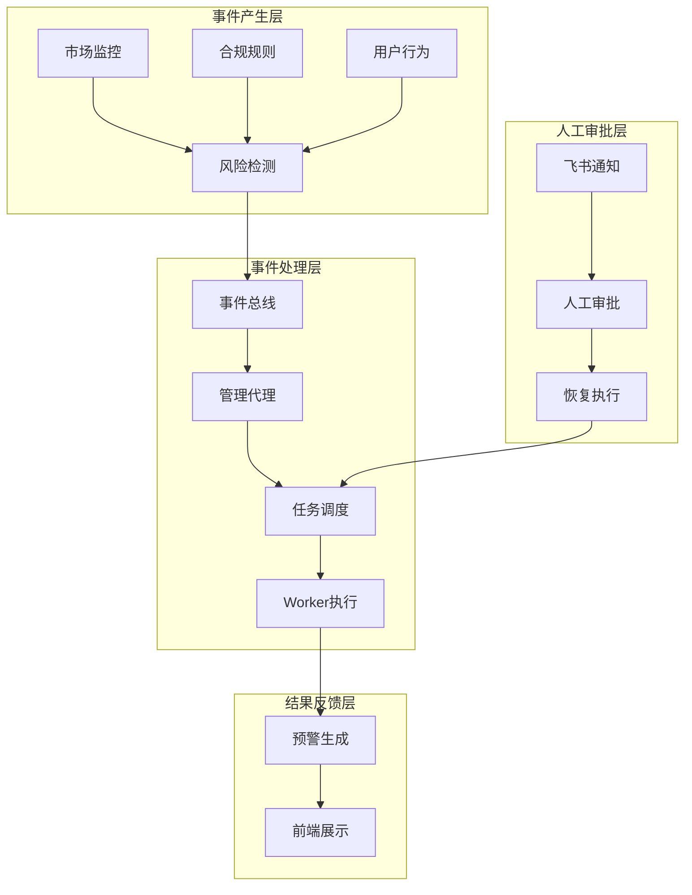
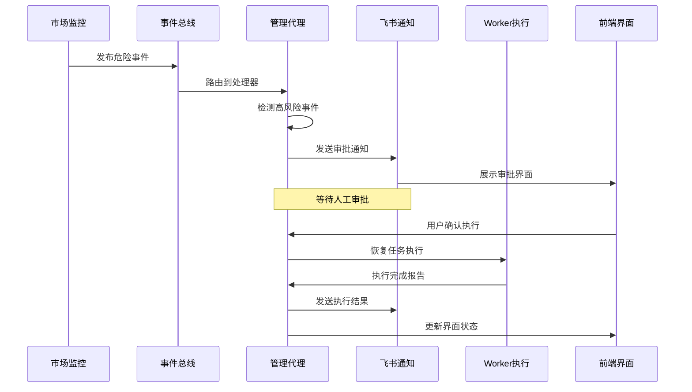
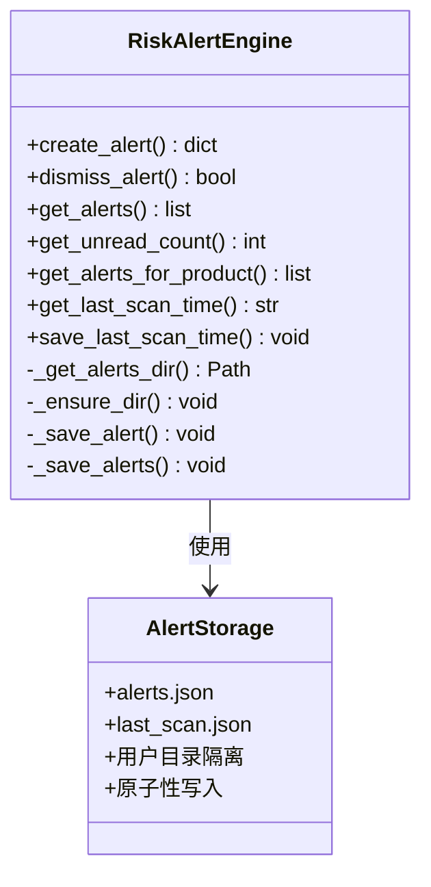
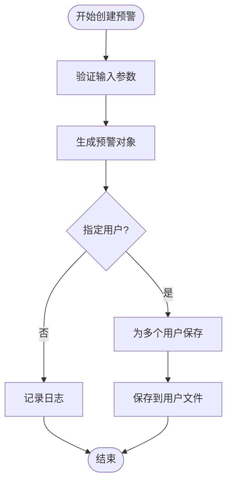
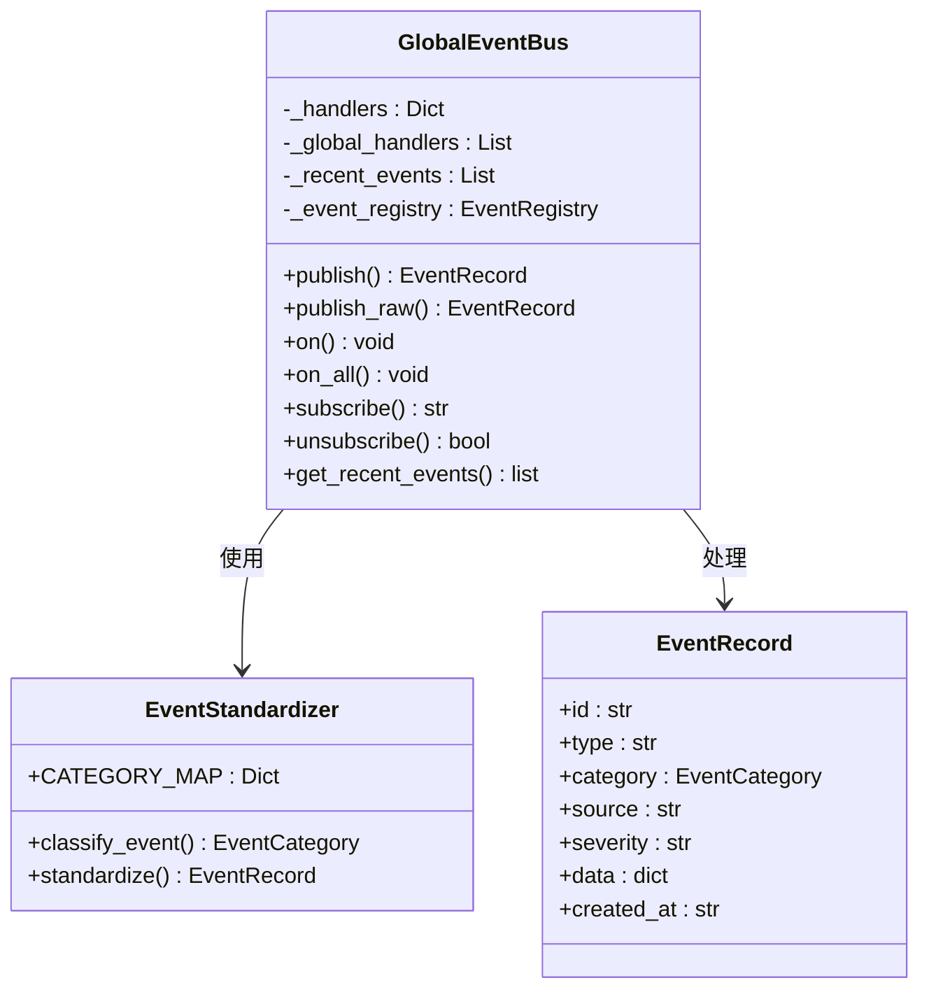
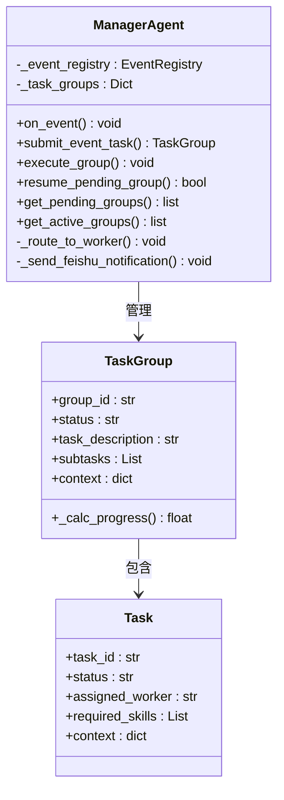
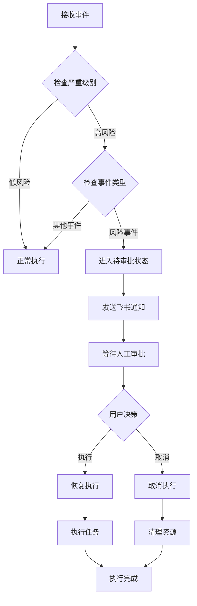
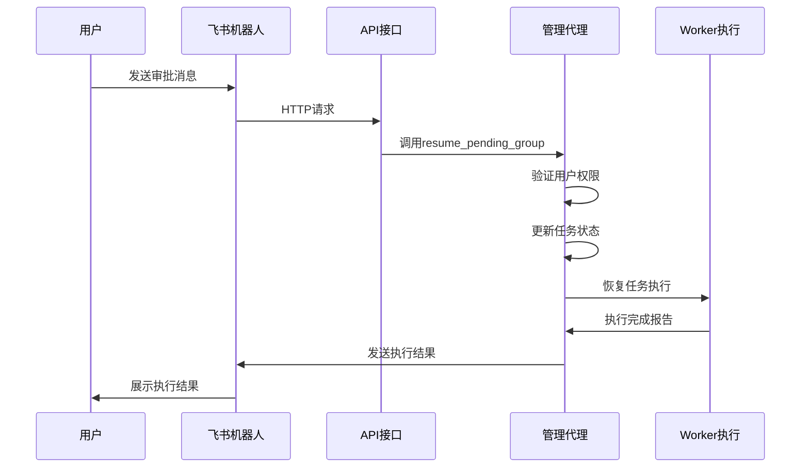
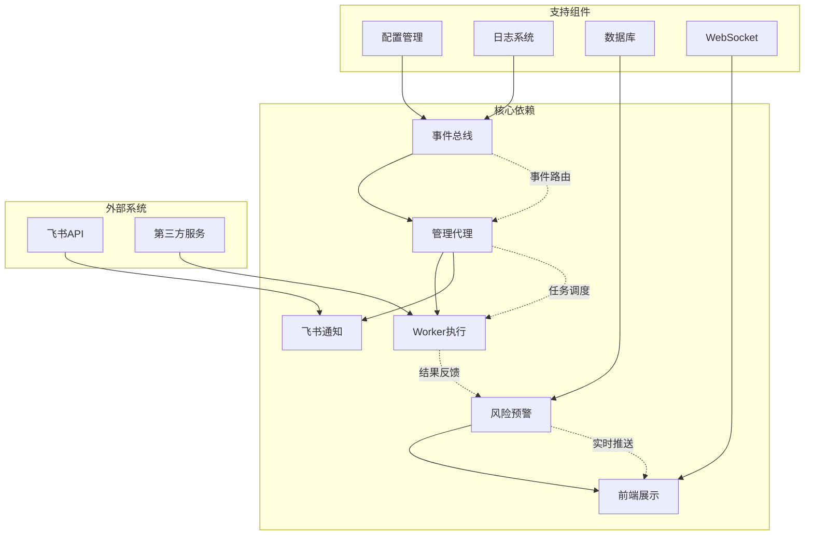

# 危险事件循环机制

<cite>
**本文档引用的文件**
- [backend/app/core/risk_alert.py](file://backend/app/core/risk_alert.py)
- [backend/scripts/test_danger_event.py](file://backend/scripts/test_danger_event.py)
- [backend/app/api/risk.py](file://backend/app/api/risk.py)
- [backend/app/core/event_listeners/base.py](file://backend/app/core/event_listeners/base.py)
- [backend/app/core/manager_agent.py](file://backend/app/core/manager_agent.py)
- [backend/app/api/agent_tasks.py](file://backend/app/api/agent_tasks.py)
- [backend/app/core/event_bus.py](file://backend/app/core/event_bus.py)
</cite>

## 目录
1. [简介](#简介)
2. [项目结构](#项目结构)
3. [核心组件](#核心组件)
4. [架构概览](#架构概览)
5. [详细组件分析](#详细组件分析)
6. [依赖关系分析](#依赖关系分析)
7. [性能考虑](#性能考虑)
8. [故障排除指南](#故障排除指南)
9. [结论](#结论)

## 简介

危险事件循环机制是Astra合规平台的核心安全控制框架，旨在通过自动化事件检测、人工审批和执行的闭环流程，确保高风险事件得到及时处理。该机制通过事件总线系统捕获危险事件，自动暂停执行并触发人工审批流程，用户确认后由Worker执行相应的合规操作。

## 项目结构

危险事件循环机制涉及多个关键模块的协同工作：

**图表来源**
- [backend/app/core/event_bus.py:121-188](file://backend/app/core/event_bus.py#L121-L188)
- [backend/app/core/manager_agent.py:962-1010](file://backend/app/core/manager_agent.py#L962-L1010)

**章节来源**
- [backend/app/core/event_bus.py:60-80](file://backend/app/core/event_bus.py#L60-L80)
- [backend/app/core/manager_agent.py:949-1010](file://backend/app/core/manager_agent.py#L949-L1010)

## 核心组件

### 风险预警引擎
风险预警引擎负责危险事件的检测、分类和持久化存储。它提供完整的预警生命周期管理，包括预警创建、查询、忽略和统计功能。

### 事件总线系统
事件总线系统作为危险事件循环的核心通信枢纽，负责事件的标准化、路由和分发。它支持多种事件类型分类和动态处理器注册。

### 管理代理
管理代理是危险事件循环的协调中心，负责事件路由、任务组管理和人工审批流程控制。它能够自动识别高风险事件并触发相应的保护机制。

### 人工审批机制
通过飞书等即时通讯平台实现的人工审批流程，确保关键决策需要人工确认，防止自动化系统误判造成损失。

**章节来源**
- [backend/app/core/risk_alert.py:32-82](file://backend/app/core/risk_alert.py#L32-L82)
- [backend/app/core/event_bus.py:81-118](file://backend/app/core/event_bus.py#L81-L118)
- [backend/app/core/manager_agent.py:962-1006](file://backend/app/core/manager_agent.py#L962-L1006)

## 架构概览

危险事件循环机制采用分层架构设计，确保系统的可扩展性和可靠性：

**图表来源**
- [backend/scripts/test_danger_event.py:30-94](file://backend/scripts/test_danger_event.py#L30-L94)
- [backend/app/core/manager_agent.py:990-1006](file://backend/app/core/manager_agent.py#L990-L1006)

## 详细组件分析

### 风险预警引擎分析

风险预警引擎提供了完整的预警管理功能，包括预警的创建、查询、忽略和统计分析。

**图表来源**
- [backend/app/core/risk_alert.py:32-82](file://backend/app/core/risk_alert.py#L32-L82)
- [backend/app/core/risk_alert.py:165-181](file://backend/app/core/risk_alert.py#L165-L181)

#### 预警创建流程
预警创建过程包含事件标准化、用户分配和持久化存储三个关键步骤：

**图表来源**
- [backend/app/core/risk_alert.py:32-82](file://backend/app/core/risk_alert.py#L32-L82)

**章节来源**
- [backend/app/core/risk_alert.py:32-181](file://backend/app/core/risk_alert.py#L32-L181)

### 事件总线系统分析

事件总线系统提供统一的事件处理基础设施，支持事件的标准化、路由和分发。

**图表来源**
- [backend/app/core/event_bus.py:121-188](file://backend/app/core/event_bus.py#L121-L188)
- [backend/app/core/event_bus.py:81-118](file://backend/app/core/event_bus.py#L81-L118)

#### 事件分类机制
事件总线系统通过前缀映射实现智能事件分类：

| 事件前缀 | 事件类别 | 描述 |
|---------|---------|------|
| risk: | 风险预警 | 危险事件和风险相关通知 |
| metric: | 风险预警 | 指标异常和阈值超限 |
| regulation: | 法规合规 | 法规变更和合规检查 |
| market: | 法规合规 | 市场变化和热点事件 |
| fulfillment: | 订单履行 | 订单处理相关事件 |
| system: | 系统事件 | 系统运行和维护事件 |
| sync: | 系统事件 | 数据同步和集成事件 |
| user: | 用户行为 | 用户操作和交互事件 |

**章节来源**
- [backend/app/core/event_bus.py:60-80](file://backend/app/core/event_bus.py#L60-L80)

### 管理代理分析

管理代理是危险事件循环的核心协调器，负责事件路由、任务组管理和人工审批流程控制。

**图表来源**
- [backend/app/core/manager_agent.py:962-1010](file://backend/app/core/manager_agent.py#L962-L1010)
- [backend/app/core/manager_agent.py:940-960](file://backend/app/core/manager_agent.py#L940-L960)

#### 危险事件处理流程
管理代理对危险事件的处理遵循严格的审批流程：

**图表来源**
- [backend/app/core/manager_agent.py:989-1006](file://backend/app/core/manager_agent.py#L989-L1006)

**章节来源**
- [backend/app/core/manager_agent.py:949-1010](file://backend/app/core/manager_agent.py#L949-L1010)

### 人工审批机制分析

人工审批机制通过飞书平台实现，确保关键决策需要人工确认。

**图表来源**
- [backend/scripts/test_danger_event.py:96-144](file://backend/scripts/test_danger_event.py#L96-L144)

**章节来源**
- [backend/scripts/test_danger_event.py:30-144](file://backend/scripts/test_danger_event.py#L30-L144)

## 依赖关系分析

危险事件循环机制涉及多个组件间的复杂依赖关系：

**图表来源**
- [backend/app/core/event_bus.py:155-188](file://backend/app/core/event_bus.py#L155-L188)
- [backend/app/core/manager_agent.py:962-1010](file://backend/app/core/manager_agent.py#L962-L1010)

**章节来源**
- [backend/app/api/risk.py:10-21](file://backend/app/api/risk.py#L10-L21)
- [backend/app/core/event_listeners/base.py:38-61](file://backend/app/core/event_listeners/base.py#L38-L61)

## 性能考虑

危险事件循环机制在设计时充分考虑了性能优化：

### 异步事件处理
系统采用异步事件处理模式，避免阻塞主线程：

- **事件监听器**：支持从主事件循环或后台线程调用
- **任务调度**：使用`create_task`和`run_coroutine_threadsafe`确保线程安全
- **内存管理**：限制最近事件数量，避免内存泄漏

### 缓存策略
- **事件缓存**：内存中保留最近500条事件
- **用户状态缓存**：任务组状态的快速查询
- **配置缓存**：事件定义和工作流配置的本地缓存

### 并发控制
- **任务并发**：合理控制同时执行的任务数量
- **资源限制**：防止Worker过度占用系统资源
- **超时机制**：为长时间运行的任务设置超时

## 故障排除指南

### 常见问题及解决方案

#### 事件无法到达管理代理
1. **检查事件总线配置**
   - 验证事件类型前缀是否正确
   - 确认事件处理器已注册

2. **检查网络连接**
   - 验证WebSocket连接状态
   - 检查防火墙设置

#### 人工审批流程中断
1. **检查飞书集成**
   - 验证飞书机器人配置
   - 确认Webhook URL可用

2. **检查用户权限**
   - 验证用户是否有审批权限
   - 检查会话状态

#### Worker执行失败
1. **检查Worker状态**
   - 验证Worker是否在线
   - 检查Worker负载情况

2. **检查任务上下文**
   - 确认必需参数已提供
   - 验证权限配置

**章节来源**
- [backend/app/core/event_listeners/base.py:47-61](file://backend/app/core/event_listeners/base.py#L47-L61)
- [backend/app/api/agent_tasks.py:176-194](file://backend/app/api/agent_tasks.py#L176-L194)

## 结论

危险事件循环机制通过多层次的安全控制和自动化处理，为Astra合规平台提供了强大的风险管控能力。该机制的关键优势包括：

1. **自动化与人工控制的平衡**：高风险事件自动暂停，确保关键决策需要人工确认
2. **实时响应能力**：异步事件处理和WebSocket推送确保及时通知
3. **可扩展性**：模块化的组件设计支持功能扩展和定制
4. **可观测性**：完整的日志记录和监控支持故障诊断和性能优化

通过持续优化和改进，危险事件循环机制将继续为平台用户提供可靠的安全保障。