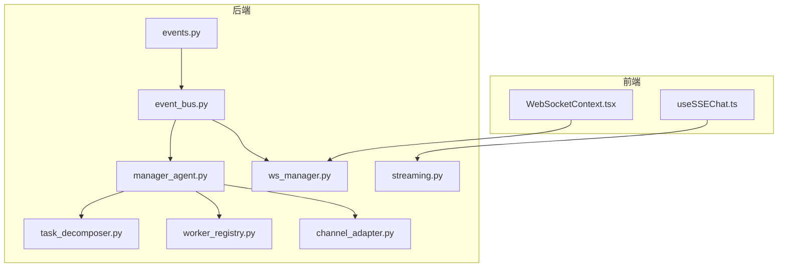
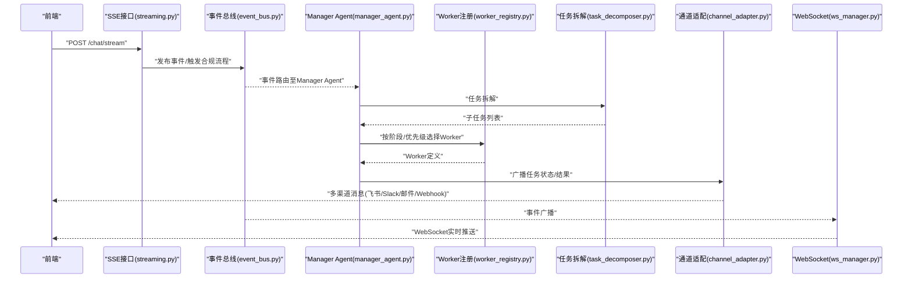
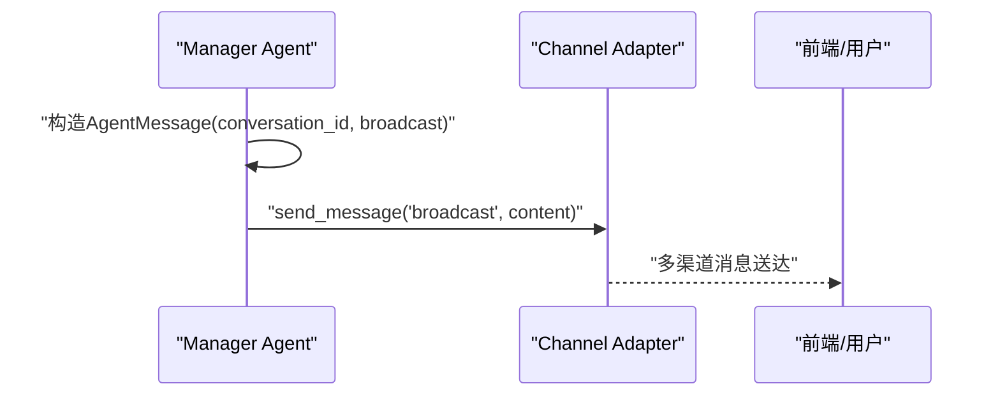
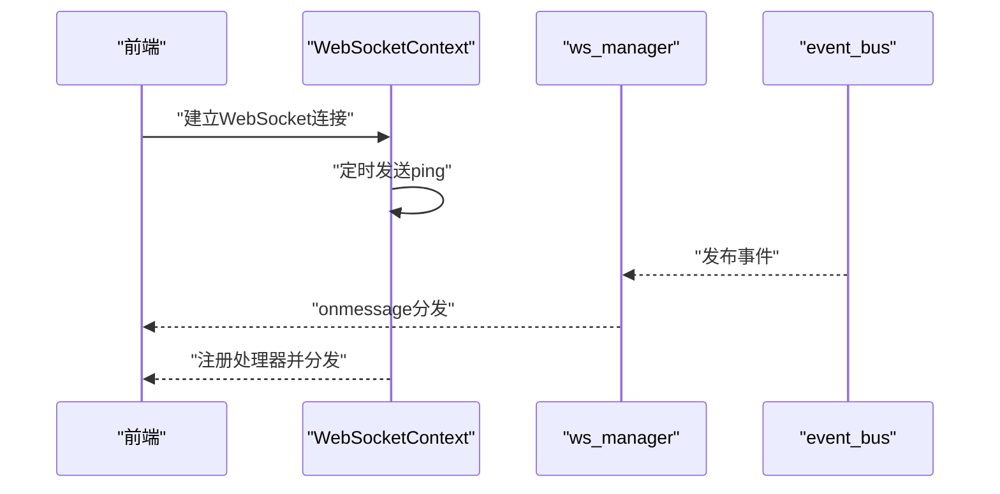
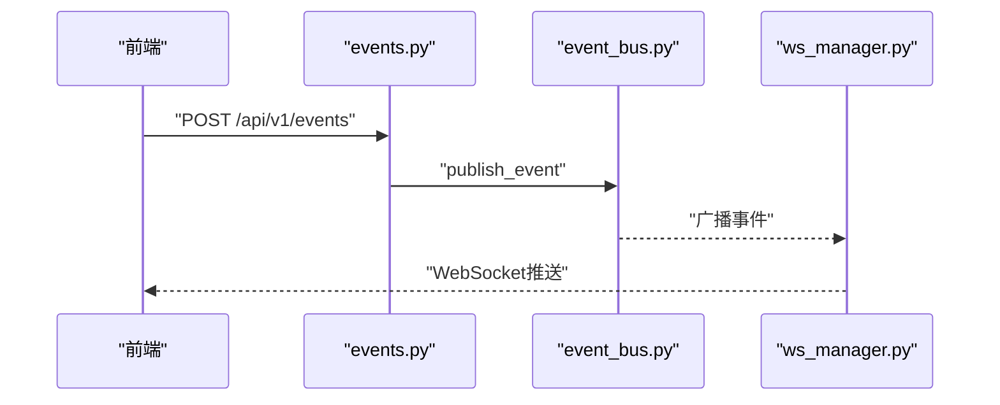
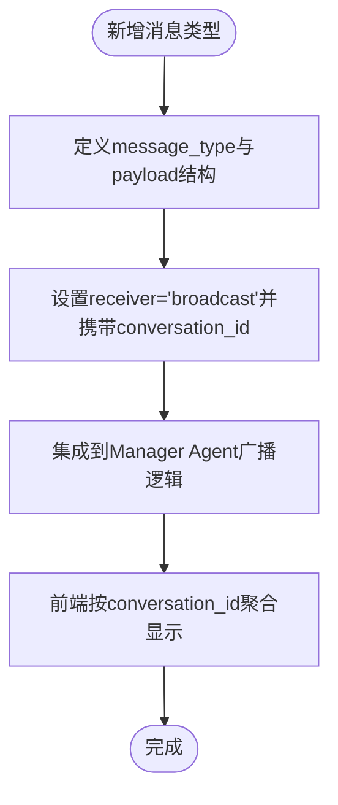
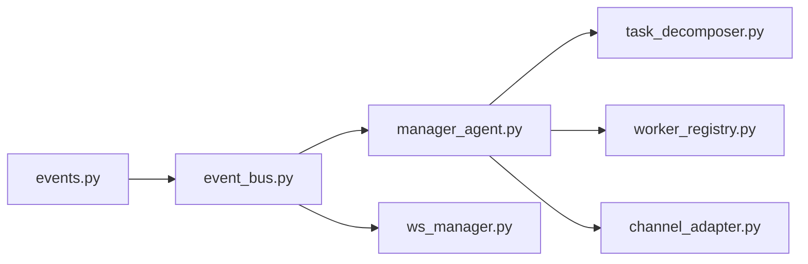

# 通信机制

<cite>
**本文引用的文件**
- [manager_agent.py](file://backend/app/core/manager_agent.py)
- [task_decomposer.py](file://backend/app/core/task_decomposer.py)
- [worker_registry.py](file://backend/app/core/worker_registry.py)
- [event_bus.py](file://backend/app/core/event_bus.py)
- [channel_adapter.py](file://backend/app/core/channel_adapter.py)
- [ws_manager.py](file://backend/app/services/ws_manager.py)
- [events.py](file://backend/app/api/events.py)
- [streaming.py](file://backend/app/api/streaming.py)
- [useSSEChat.ts](file://frontend/src/hooks/useSSEChat.ts)
- [WebSocketContext.tsx](file://frontend/src/context/WebSocketContext.tsx)
- [前后端api交互.md](file://前后端api交互.md)
</cite>

## 目录
1. [引言](#引言)
2. [项目结构](#项目结构)
3. [核心组件](#核心组件)
4. [架构总览](#架构总览)
5. [详细组件分析](#详细组件分析)
6. [依赖分析](#依赖分析)
7. [性能考虑](#性能考虑)
8. [故障排查指南](#故障排查指南)
9. [结论](#结论)
10. [附录](#附录)

## 引言
本文件面向避风港平台的Agent通信机制，系统化阐述Agent之间标准化消息格式与通信协议，解释AgentMessage数据结构的设计与用途；说明群聊式调度的实现与消息广播策略；梳理Agent间的异步通信与可靠性保障；给出用户干预机制与交互流程；并提供协议扩展与自定义消息类型的实践指南与调试技巧。

## 项目结构
围绕通信机制的关键模块分布如下：
- 后端核心
  - 任务编排与消息：manager_agent.py
  - 任务模板与拆解：task_decomposer.py
  - Worker注册与负载：worker_registry.py
  - 事件总线与事件API：event_bus.py、events.py
  - 通道适配与广播：channel_adapter.py
  - WebSocket推送：ws_manager.py
  - SSE流式对话：streaming.py
- 前端交互
  - SSE聊天钩子：useSSEChat.ts
  - WebSocket上下文：WebSocketContext.tsx
- 交互文档
  - 前后端API交互说明：前后端api交互.md

**图表来源**
- [manager_agent.py:1-39](file://backend/app/core/manager_agent.py#L1-L39)
- [task_decomposer.py:356-522](file://backend/app/core/task_decomposer.py#L356-L522)
- [worker_registry.py:1-46](file://backend/app/core/worker_registry.py#L1-L46)
- [event_bus.py:138-816](file://backend/app/core/event_bus.py#L138-L816)
- [channel_adapter.py:1-674](file://backend/app/core/channel_adapter.py#L1-L674)
- [ws_manager.py:38-68](file://backend/app/services/ws_manager.py#L38-L68)
- [events.py:1-38](file://backend/app/api/events.py#L1-L38)
- [streaming.py:182-215](file://backend/app/api/streaming.py#L182-L215)
- [useSSEChat.ts:110-155](file://frontend/src/hooks/useSSEChat.ts#L110-L155)
- [WebSocketContext.tsx:1-131](file://frontend/src/context/WebSocketContext.tsx#L1-L131)

**章节来源**
- [manager_agent.py:1-39](file://backend/app/core/manager_agent.py#L1-L39)
- [前后端api交互.md:365-678](file://前后端api交互.md#L365-L678)

## 核心组件
- AgentMessage：Agent间标准化消息载体，包含message_id、sender、receiver、message_type、payload、conversation_id等字段，用于在Agent编排与事件总线中传递状态与控制信息。
- Manager Agent：负责任务拆解、Worker分配、执行编排与消息记录，支持群聊式广播。
- TaskDecomposer：基于模板将高层任务拆解为子任务序列，支持事件驱动的模板映射。
- WorkerRegistry：配置驱动的Worker注册与查询，支持按业务阶段与优先级选择Worker。
- Event Bus：全局事件总线，支持事件发布、路由、订阅与广播，配合WebSocket推送。
- Channel Adapter：多渠道消息适配器，支持飞书、钉钉、Slack、邮件、Webhook等，提供广播能力。
- WebSocket Manager：统一管理用户连接，支持定向推送与全局广播。
- SSE Chat：前端SSE流式对话，后端分阶段事件推送，形成“思考—执行—反馈”的异步交互闭环。

**章节来源**
- [manager_agent.py:34-363](file://backend/app/core/manager_agent.py#L34-L363)
- [task_decomposer.py:356-522](file://backend/app/core/task_decomposer.py#L356-L522)
- [worker_registry.py:1-46](file://backend/app/core/worker_registry.py#L1-L46)
- [event_bus.py:138-816](file://backend/app/core/event_bus.py#L138-L816)
- [channel_adapter.py:1-674](file://backend/app/core/channel_adapter.py#L1-L674)
- [ws_manager.py:38-68](file://backend/app/services/ws_manager.py#L38-L68)
- [streaming.py:182-215](file://backend/app/api/streaming.py#L182-L215)
- [useSSEChat.ts:110-155](file://frontend/src/hooks/useSSEChat.ts#L110-L155)
- [WebSocketContext.tsx:1-131](file://frontend/src/context/WebSocketContext.tsx#L1-L131)

## 架构总览
下图展示从事件到消息广播与实时推送的整体路径，体现Agent编排、事件驱动与前端交互的协同：

**图表来源**
- [streaming.py:182-215](file://backend/app/api/streaming.py#L182-L215)
- [event_bus.py:138-816](file://backend/app/core/event_bus.py#L138-L816)
- [manager_agent.py:178-363](file://backend/app/core/manager_agent.py#L178-L363)
- [task_decomposer.py:356-522](file://backend/app/core/task_decomposer.py#L356-L522)
- [worker_registry.py:1-46](file://backend/app/core/worker_registry.py#L1-L46)
- [channel_adapter.py:104-674](file://backend/app/core/channel_adapter.py#L104-L674)
- [ws_manager.py:38-68](file://backend/app/services/ws_manager.py#L38-L68)

## 详细组件分析

### AgentMessage数据结构与字段设计
- 字段说明
  - message_id：消息唯一标识，便于去重与追踪
  - sender：发送方标识（如manager、worker_code、user）
  - receiver：接收方标识（如manager、worker_code、broadcast）
  - message_type：消息类型（如task_created、execution_started、execution_completed）
  - payload：消息载荷，承载具体业务数据（如任务组ID、子任务计数、分配的Worker集合）
  - conversation_id：会话/群聊标识，用于将相关消息聚合，支持群聊式调度与上下文延续
- 设计要点
  - 统一的消息载体，便于在Manager Agent内部记录与广播
  - 与事件总线结合，实现跨组件可见的状态传播
  - 与Worker注册与任务拆解配合，支撑任务编排的可视化与可观测

**章节来源**
- [manager_agent.py:34-363](file://backend/app/core/manager_agent.py#L34-L363)

### 群聊式调度与广播策略
- 群聊式调度
  - Manager Agent在任务创建、执行开始、执行完成等关键节点，构造AgentMessage并将receiver设为broadcast，以实现“群聊式”广播
  - conversation_id贯穿消息，确保同一任务组内的消息被正确聚合
- 广播实现
  - 任务层面：Manager Agent内部记录消息并广播
  - 事件层面：Event Bus将事件广播到订阅者，WebSocket Manager向所有已连接用户推送
  - 通知层面：Channel Adapter支持多渠道广播（飞书、钉钉、Slack、邮件、Webhook）

**图表来源**
- [manager_agent.py:209-222](file://backend/app/core/manager_agent.py#L209-L222)
- [manager_agent.py:308-314](file://backend/app/core/manager_agent.py#L308-L314)
- [manager_agent.py:358-363](file://backend/app/core/manager_agent.py#L358-L363)
- [channel_adapter.py:104-110](file://backend/app/core/channel_adapter.py#L104-L110)

**章节来源**
- [manager_agent.py:178-363](file://backend/app/core/manager_agent.py#L178-L363)
- [channel_adapter.py:104-674](file://backend/app/core/channel_adapter.py#L104-L674)

### 异步通信与可靠性保障
- 异步通信
  - SSE：前端通过SSE流式接收后端阶段性事件，实现“思考—执行—反馈”的渐进式输出
  - WebSocket：后端事件总线通过ws_manager广播到已连接用户，前端自动重连与心跳维持
- 可靠性保障
  - 心跳与自动重连：前端WebSocketContext定时发送ping并自动重连
  - 广播容错：Channel Adapter与ws_manager在发送失败时记录错误并清理无效连接
  - 事件幂等：事件总线记录最近事件，避免重复处理

**图表来源**
- [WebSocketContext.tsx:39-92](file://frontend/src/context/WebSocketContext.tsx#L39-L92)
- [ws_manager.py:38-68](file://backend/app/services/ws_manager.py#L38-L68)
- [event_bus.py:138-816](file://backend/app/core/event_bus.py#L138-L816)

**章节来源**
- [useSSEChat.ts:110-155](file://frontend/src/hooks/useSSEChat.ts#L110-L155)
- [WebSocketContext.tsx:1-131](file://frontend/src/context/WebSocketContext.tsx#L1-L131)
- [ws_manager.py:38-68](file://backend/app/services/ws_manager.py#L38-L68)
- [前后端api交互.md:365-399](file://前后端api交互.md#L365-L399)

### 用户干预机制与交互流程
- 用户与Agent的交互
  - SSE聊天：前端通过POST /chat/stream发起对话，后端逐步推送事件（如thinking、done），前端渲染
  - 事件API：后端提供事件发布接口，事件总线将事件广播，WebSocket推送至前端
  - 用户交互：合规流程中，后端可等待用户确认后再继续执行，实现人工干预
- 前后端交互生命周期
  - 前端WebSocketContext负责连接、心跳、自动重连与事件分发
  - 后端事件总线与ws_manager负责事件路由与广播

**图表来源**
- [events.py:26-38](file://backend/app/api/events.py#L26-L38)
- [event_bus.py:150-166](file://backend/app/core/event_bus.py#L150-L166)
- [ws_manager.py:38-68](file://backend/app/services/ws_manager.py#L38-L68)

**章节来源**
- [events.py:1-38](file://backend/app/api/events.py#L1-L38)
- [event_bus.py:138-816](file://backend/app/core/event_bus.py#L138-L816)
- [ws_manager.py:38-68](file://backend/app/services/ws_manager.py#L38-L68)
- [前后端api交互.md:645-676](file://前后端api交互.md#L645-L676)

### 通信协议扩展与自定义消息类型
- 扩展AgentMessage类型
  - 在Manager Agent中新增message_type与payload结构，确保receiver为broadcast以实现群聊式广播
  - 保持conversation_id一致，以便前端按会话聚合消息
- 扩展Worker与任务模板
  - 在Worker注册表中新增Worker定义，按业务阶段与优先级参与任务分配
  - 在任务拆解模板中新增模板键值与步骤，支持事件驱动的自动拆解
- 扩展通知渠道
  - 在Channel Adapter中新增适配器或复用现有适配器，实现广播到新渠道
- 扩展事件类型
  - 在事件总线中注册新事件类型，确保事件分类与严重级别合理
  - 在WebSocket层保持事件分发与前端处理器注册

**图表来源**
- [manager_agent.py:209-222](file://backend/app/core/manager_agent.py#L209-L222)
- [manager_agent.py:308-314](file://backend/app/core/manager_agent.py#L308-L314)
- [manager_agent.py:358-363](file://backend/app/core/manager_agent.py#L358-L363)

**章节来源**
- [manager_agent.py:178-363](file://backend/app/core/manager_agent.py#L178-L363)
- [task_decomposer.py:431-488](file://backend/app/core/task_decomposer.py#L431-L488)
- [worker_registry.py:840-964](file://backend/app/core/worker_registry.py#L840-L964)
- [channel_adapter.py:104-674](file://backend/app/core/channel_adapter.py#L104-L674)
- [event_bus.py:621-633](file://backend/app/core/event_bus.py#L621-L633)

## 依赖分析
- 组件耦合
  - Manager Agent依赖TaskDecomposer与WorkerRegistry进行任务拆解与Worker分配
  - 事件总线与WebSocket管理器共同支撑前端实时推送
  - Channel Adapter独立于Agent编排，提供多渠道广播能力
- 关键依赖链
  - 事件API → 事件总线 → Manager Agent → 任务拆解/Worker选择 → 广播
  - SSE → 事件总线 → WebSocket广播

**图表来源**
- [events.py:1-38](file://backend/app/api/events.py#L1-L38)
- [event_bus.py:138-816](file://backend/app/core/event_bus.py#L138-L816)
- [manager_agent.py:178-363](file://backend/app/core/manager_agent.py#L178-L363)
- [task_decomposer.py:356-522](file://backend/app/core/task_decomposer.py#L356-L522)
- [worker_registry.py:1-46](file://backend/app/core/worker_registry.py#L1-L46)
- [channel_adapter.py:1-674](file://backend/app/core/channel_adapter.py#L1-L674)
- [ws_manager.py:38-68](file://backend/app/services/ws_manager.py#L38-L68)

**章节来源**
- [events.py:1-38](file://backend/app/api/events.py#L1-L38)
- [event_bus.py:138-816](file://backend/app/core/event_bus.py#L138-L816)
- [manager_agent.py:178-363](file://backend/app/core/manager_agent.py#L178-L363)

## 性能考虑
- 广播与并发
  - 广播应避免阻塞主线程，采用异步发送与批量处理
  - 并行执行子任务时注意资源竞争与限流
- 心跳与重连
  - WebSocket心跳间隔与重连延迟需平衡网络波动与服务器压力
- 事件与消息日志
  - 事件总线与通道适配器均维护消息日志，建议限制日志规模并定期清理

## 故障排查指南
- WebSocket连接问题
  - 检查前端WebSocketContext的心跳与自动重连逻辑
  - 后端ws_manager记录发送失败的连接并清理
- SSE流式对话异常
  - 检查SSE事件类型与前端渲染逻辑，确认事件分发与中断控制
- 事件广播未达前端
  - 核实事件总线的事件分类与路由，确认WebSocket广播是否执行
- 通知渠道发送失败
  - 检查Channel Adapter配置与目标地址，关注错误日志

**章节来源**
- [WebSocketContext.tsx:39-92](file://frontend/src/context/WebSocketContext.tsx#L39-L92)
- [ws_manager.py:38-68](file://backend/app/services/ws_manager.py#L38-L68)
- [streaming.py:182-215](file://backend/app/api/streaming.py#L182-L215)
- [channel_adapter.py:104-674](file://backend/app/core/channel_adapter.py#L104-L674)

## 结论
避风港平台通过标准化的AgentMessage与事件总线实现了Agent间可靠的异步通信；Manager Agent结合任务拆解与Worker注册，提供群聊式调度与广播能力；前端通过SSE与WebSocket实现流畅的人机交互与实时推送。整体架构具备良好的扩展性，可通过新增消息类型、Worker定义、通知渠道与事件类型进一步增强平台能力。

## 附录
- 实际通信示例（路径指引）
  - 群聊式广播消息记录：[manager_agent.py:209-222](file://backend/app/core/manager_agent.py#L209-L222)
  - 执行开始广播：[manager_agent.py:308-314](file://backend/app/core/manager_agent.py#L308-L314)
  - 执行完成广播：[manager_agent.py:358-363](file://backend/app/core/manager_agent.py#L358-L363)
  - 事件API发布：[events.py:26-38](file://backend/app/api/events.py#L26-L38)
  - 事件总线发布流程：[event_bus.py:150-166](file://backend/app/core/event_bus.py#L150-L166)
  - WebSocket广播：[ws_manager.py:65-68](file://backend/app/services/ws_manager.py#L65-L68)
  - SSE聊天流式事件：[useSSEChat.ts:110-155](file://frontend/src/hooks/useSSEChat.ts#L110-L155)
  - WebSocket连接与心跳：[WebSocketContext.tsx:39-92](file://frontend/src/context/WebSocketContext.tsx#L39-L92)
  - 多渠道广播实现：[channel_adapter.py:104-110](file://backend/app/core/channel_adapter.py#L104-L110)