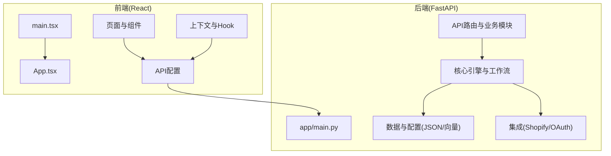
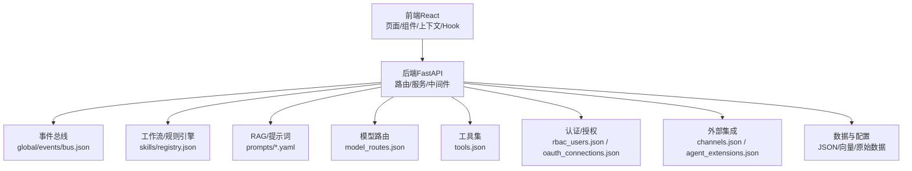
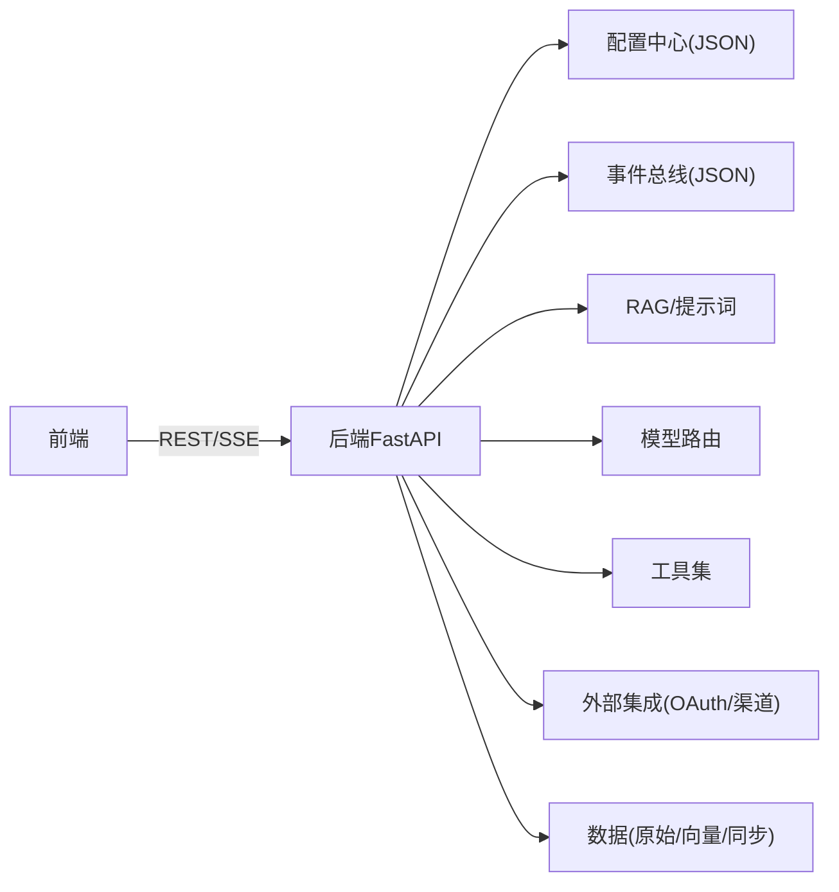

# 技术栈说明

<cite>
**本文引用的文件**
- [README.md](file://README.md)
- [后端api.md](file://后端api.md)
- [前后端api交互.md](file://前后端api交互.md)
- [避风港_20260524_开发文档.md](file://避风港_20260524_开发文档.md)
- [backend/app/main.py](file://backend/app/main.py)
- [backend/requirements.txt](file://backend/requirements.txt)
- [frontend/package.json](file://frontend/package.json)
- [frontend/vite.config.ts](file://frontend/vite.config.ts)
- [frontend/tsconfig.json](file://frontend/tsconfig.json)
- [backend/data/config/skills/registry.json](file://backend/data/config/skills/registry.json)
- [backend/data/config/model_routes.json](file://backend/data/config/model_routes.json)
- [backend/data/config/tools.json](file://backend/data/config/tools.json)
- [backend/data/config/rbac_users.json](file://backend/data/config/rbac_users.json)
- [backend/data/config/oauth_connections.json](file://backend/data/config/oauth_connections.json)
- [backend/data/config/channels.json](file://backend/data/config/channels.json)
- [backend/data/config/agent_extensions.json](file://backend/data/config/agent_extensions.json)
- [backend/data/config/events/README.md](file://backend/data/config/events/README.md)
- [backend/data/config/workers/README.md](file://backend/data/config/workers/README.md)
- [backend/data/prompts/chat_compliance.yaml](file://backend/data/prompts/chat_compliance.yaml)
- [backend/data/prompts/regulation_scan.yaml](file://backend/data/prompts/regulation_scan.yaml)
- [backend/data/prompts/risk_summary.yaml](file://backend/data/prompts/risk_summary.yaml)
- [backend/data/prompts/market_monitor.yaml](file://backend/data/prompts/market_monitor.yaml)
- [backend/data/prompts/impact_analysis.yaml](file://backend/data/prompts/impact_analysis.yaml)
- [backend/data/prompts/nlu_fallback.yaml](file://backend/data/prompts/nlu_fallback.yaml)
- [backend/data/raw/regulations/eu/_all.md](file://backend/data/raw/regulations/eu/_all.md)
- [backend/data/raw/hs_codes/_all.md](file://backend/data/raw/hs_codes/_all.md)
- [backend/data/raw/vat_rates/_all.md](file://backend/data/raw/vat_rates/_all.md)
- [backend/data/global/products_index.json](file://backend/data/global/products_index.json)
- [backend/data/global/metrics/custom_metrics.json](file://backend/data/global/metrics/custom_metrics.json)
- [backend/data/global/metrics/agg_metrics.json](file://backend/data/global/metrics/agg_metrics.json)
- [backend/data/global/memory/global_memory.json](file://backend/data/global/memory/global_memory.json)
- [backend/data/global/notifications/history.json](file://backend/data/global/notifications/history.json)
- [backend/data/global/events/bus.json](file://backend/data/global/events/bus.json)
- [backend/data/sync/jobs.json](file://backend/data/sync/jobs.json)
- [backend/data/sync/logs.json](file://backend/data/sync/logs.json)
- [backend/data/shopify/webhooks/unknown.jsonl](file://backend/data/shopify/webhooks/unknown.jsonl)
- [backend/scripts/fetch_regulations.py](file://backend/scripts/fetch_regulations.py)
- [backend/scripts/init_knowledge.py](file://backend/scripts/init_knowledge.py)
- [backend/scripts/migrate_storage.py](file://backend/scripts/migrate_storage.py)
- [backend/tests/conftest.py](file://backend/tests/conftest.py)
- [backend/tests/test_openapi_contract.py](file://backend/tests/test_openapi_contract.py)
- [backend/tests/测试规范.md](file://backend/tests/测试规范.md)
- [frontend/src/api/config.ts](file://frontend/src/api/config.ts)
- [frontend/src/context/AppStore.tsx](file://frontend/src/context/AppStore.tsx)
- [frontend/src/context/AuthContext.tsx](file://frontend/src/context/AuthContext.tsx)
- [frontend/src/context/WebSocketContext.tsx](file://frontend/src/context/WebSocketContext.tsx)
- [frontend/src/hooks/useSSEChat.ts](file://frontend/src/hooks/useSSEChat.ts)
- [frontend/src/pages/OverviewPage.tsx](file://frontend/src/pages/OverviewPage.tsx)
- [frontend/src/pages/AgentMonitorPage.tsx](file://frontend/src/pages/AgentMonitorPage.tsx)
- [frontend/src/pages/ProductListPage.tsx](file://frontend/src/pages/ProductListPage.tsx)
- [frontend/src/pages/KnowledgePage.tsx](file://frontend/src/pages/KnowledgePage.tsx)
- [frontend/src/pages/SystemCompliancePage.tsx](file://frontend/src/pages/SystemCompliancePage.tsx)
- [frontend/src/pages/RiskCenter.tsx](file://frontend/src/pages/RiskCenter.tsx)
- [frontend/src/components/Layout.tsx](file://frontend/src/components/Layout.tsx)
- [frontend/src/components/Sidebar.tsx](file://frontend/src/components/Sidebar.tsx)
- [frontend/src/components/StreamChat.tsx](file://frontend/src/components/StreamChat.tsx)
- [frontend/src/components/StreamMessageRenderer.tsx](file://frontend/src/components/StreamMessageRenderer.tsx)
- [frontend/src/components/ThinkingBlock.tsx](file://frontend/src/components/ThinkingBlock.tsx)
- [frontend/src/components/ExecutionResult.tsx](file://frontend/src/components/ExecutionResult.tsx)
- [frontend/src/components/PlanBlock.tsx](file://frontend/src/components/PlanBlock.tsx)
- [frontend/src/components/ProductCard.tsx](file://frontend/src/components/ProductCard.tsx)
- [frontend/src/components/AgentSelector.tsx](file://frontend/src/components/AgentSelector.tsx)
- [frontend/src/components/ToolPanel.tsx](file://frontend/src/components/ToolPanel.tsx)
- [frontend/src/components/SkillPanel.tsx](file://frontend/src/components/SkillPanel.tsx)
- [frontend/src/components/ChatInput.tsx](file://frontend/src/components/ChatInput.tsx)
- [frontend/src/components/NotificationCenter.tsx](file://frontend/src/components/NotificationCenter.tsx)
- [frontend/src/components/EventTimeline.tsx](file://frontend/src/components/EventTimeline.tsx)
- [frontend/src/components/DailyBrief.tsx](file://frontend/src/components/DailyBrief.tsx)
- [frontend/src/components/MetricsPage.tsx](file://frontend/src/components/MetricsPage.tsx)
- [frontend/src/components/MemoryTreePage.tsx](file://frontend/src/components/MemoryTreePage.tsx)
- [frontend/src/components/UserManagePage.tsx](file://frontend/src/components/UserManagePage.tsx)
- [frontend/src/components/IntegrationPage.tsx](file://frontend/src/components/IntegrationPage.tsx)
- [frontend/src/components/ComplianceCheckCard.tsx](file://frontend/src/components/ComplianceCheckCard.tsx)
- [frontend/src/components/ActionSuggestionCard.tsx](file://frontend/src/components/ActionSuggestionCard.tsx)
- [frontend/src/components/SkillEventBlock.tsx](file://frontend/src/components/SkillEventBlock.tsx)
- [frontend/src/components/ToastNotification.tsx](file://frontend/src/components/ToastNotification.tsx)
- [frontend/src/components/CLICommandInput.tsx](file://frontend/src/components/CLICommandInput.tsx)
- [frontend/src/components/CLICommandResult.tsx](file://frontend/src/components/CLICommandResult.tsx)
- [frontend/src/types/index.ts](file://frontend/src/types/index.ts)
- [frontend/src/main.tsx](file://frontend/src/main.tsx)
- [frontend/src/App.tsx](file://frontend/src/App.tsx)
</cite>

## 目录
1. [简介](#简介)
2. [项目结构](#项目结构)
3. [核心组件](#核心组件)
4. [架构总览](#架构总览)
5. [详细组件分析](#详细组件分析)
6. [依赖关系分析](#依赖关系分析)
7. [性能考虑](#性能考虑)
8. [故障排查指南](#故障排查指南)
9. [结论](#结论)
10. [附录](#附录)

## 简介
本技术栈说明面向避风港平台，系统性梳理后端与前端技术选型、AI/ML能力、开发工具链及版本兼容性与升级策略。平台围绕合规监管、风险控制、智能体工作流与知识检索展开，采用Python 3.13+、FastAPI、React、Claude Agent SDK等核心技术，结合事件驱动、RAG检索与多模型路由，实现高扩展、可演进的企业级智能合规平台。

## 项目结构
项目采用前后端分离架构：前端基于React生态（TypeScript/Vite），后端以FastAPI为核心，配合事件总线、工作流编排、RAG与规则引擎等模块化组件；数据层包含本地JSON配置、知识库与向量化存储，以及Shopify等外部系统集成。

图表来源
- [frontend/src/main.tsx:1-50](file://frontend/src/main.tsx#L1-L50)
- [frontend/src/App.tsx:1-50](file://frontend/src/App.tsx#L1-L50)
- [backend/app/main.py:1-100](file://backend/app/main.py#L1-L100)

章节来源
- [README.md:1-200](file://README.md#L1-L200)
- [前后端api交互.md:1-200](file://前后端api交互.md#L1-L200)
- [避风港_20260524_开发文档.md:1-200](file://避风港_20260524_开发文档.md#L1-L200)

## 核心组件
- 后端框架与运行时
  - Python 3.13+：提供高性能与现代化语法支持，便于异步并发与类型标注。
  - FastAPI：提供OpenAPI契约、自动文档、依赖注入与异步路由，支撑高并发API。
  - Uvicorn：ASGI服务器，承载异步请求处理。
- 数据与配置
  - JSON配置中心：集中管理技能注册表、模型路由、工具清单、RBAC用户、OAuth连接、渠道与代理扩展。
  - 全局指标与内存：聚合指标、自定义指标、全局内存、通知历史、事件总线。
  - 原始数据：法规、HS编码、增值税率等基础数据。
- AI与RAG
  - Prompt模板：合规对话、法规扫描、风险摘要、市场监控、影响分析、NLU回退等。
  - 外部集成：Claude Agent SDK（通过后端插件或工具调用）。
- 前端技术栈
  - React 18 + TypeScript：类型安全与组件化UI。
  - Vite：快速构建与热更新。
  - 路由与页面：按功能划分的页面与组件集合。
  - 上下文与Hook：认证、WebSocket、通知与应用状态管理。
- 开发与测试
  - Pytest：后端测试框架。
  - OpenAPI契约测试：确保接口一致性。
  - 前端包管理：npm/yarn生态。

章节来源
- [backend/requirements.txt:1-200](file://backend/requirements.txt#L1-L200)
- [backend/app/main.py:1-100](file://backend/app/main.py#L1-L100)
- [frontend/package.json:1-200](file://frontend/package.json#L1-L200)
- [frontend/vite.config.ts:1-100](file://frontend/vite.config.ts#L1-L100)
- [frontend/tsconfig.json:1-100](file://frontend/tsconfig.json#L1-L100)
- [backend/data/config/skills/registry.json:1-200](file://backend/data/config/skills/registry.json#L1-L200)
- [backend/data/config/model_routes.json:1-200](file://backend/data/config/model_routes.json#L1-L200)
- [backend/data/config/tools.json:1-200](file://backend/data/config/tools.json#L1-L200)
- [backend/data/config/rbac_users.json:1-200](file://backend/data/config/rbac_users.json#L1-L200)
- [backend/data/config/oauth_connections.json:1-200](file://backend/data/config/oauth_connections.json#L1-L200)
- [backend/data/config/channels.json:1-200](file://backend/data/config/channels.json#L1-L200)
- [backend/data/config/agent_extensions.json:1-200](file://backend/data/config/agent_extensions.json#L1-L200)
- [backend/data/prompts/chat_compliance.yaml:1-200](file://backend/data/prompts/chat_compliance.yaml#L1-L200)
- [backend/data/prompts/regulation_scan.yaml:1-200](file://backend/data/prompts/regulation_scan.yaml#L1-L200)
- [backend/data/prompts/risk_summary.yaml:1-200](file://backend/data/prompts/risk_summary.yaml#L1-L200)
- [backend/data/prompts/market_monitor.yaml:1-200](file://backend/data/prompts/market_monitor.yaml#L1-L200)
- [backend/data/prompts/impact_analysis.yaml:1-200](file://backend/data/prompts/impact_analysis.yaml#L1-L200)
- [backend/data/prompts/nlu_fallback.yaml:1-200](file://backend/data/prompts/nlu_fallback.yaml#L1-L200)
- [backend/data/raw/regulations/eu/_all.md:1-200](file://backend/data/raw/regulations/eu/_all.md#L1-L200)
- [backend/data/raw/hs_codes/_all.md:1-200](file://backend/data/raw/hs_codes/_all.md#L1-L200)
- [backend/data/raw/vat_rates/_all.md:1-200](file://backend/data/raw/vat_rates/_all.md#L1-L200)
- [backend/data/global/products_index.json:1-200](file://backend/data/global/products_index.json#L1-L200)
- [backend/data/global/metrics/custom_metrics.json:1-200](file://backend/data/global/metrics/custom_metrics.json#L1-L200)
- [backend/data/global/metrics/agg_metrics.json:1-200](file://backend/data/global/metrics/agg_metrics.json#L1-L200)
- [backend/data/global/memory/global_memory.json:1-200](file://backend/data/global/memory/global_memory.json#L1-L200)
- [backend/data/global/notifications/history.json:1-200](file://backend/data/global/notifications/history.json#L1-L200)
- [backend/data/global/events/bus.json:1-200](file://backend/data/global/events/bus.json#L1-L200)
- [backend/data/sync/jobs.json:1-200](file://backend/data/sync/jobs.json#L1-L200)
- [backend/data/sync/logs.json:1-200](file://backend/data/sync/logs.json#L1-L200)
- [backend/data/shopify/webhooks/unknown.jsonl:1-200](file://backend/data/shopify/webhooks/unknown.jsonl#L1-L200)

## 架构总览
平台采用“前端React + 后端FastAPI + 事件与工作流引擎 + RAG/规则引擎 + 多模型路由”的分层架构。前端通过REST与SSE与后端交互；后端通过事件总线与工作流编排各子系统；RAG与Prompt模板驱动智能体行为；配置中心统一管理模型、工具与权限。

图表来源
- [frontend/src/pages/OverviewPage.tsx:1-200](file://frontend/src/pages/OverviewPage.tsx#L1-L200)
- [frontend/src/components/Layout.tsx:1-200](file://frontend/src/components/Layout.tsx#L1-L200)
- [backend/app/main.py:1-100](file://backend/app/main.py#L1-L100)
- [backend/data/global/events/bus.json:1-200](file://backend/data/global/events/bus.json#L1-L200)
- [backend/data/config/skills/registry.json:1-200](file://backend/data/config/skills/registry.json#L1-L200)
- [backend/data/prompts/chat_compliance.yaml:1-200](file://backend/data/prompts/chat_compliance.yaml#L1-L200)
- [backend/data/config/model_routes.json:1-200](file://backend/data/config/model_routes.json#L1-L200)
- [backend/data/config/tools.json:1-200](file://backend/data/config/tools.json#L1-L200)
- [backend/data/config/rbac_users.json:1-200](file://backend/data/config/rbac_users.json#L1-L200)
- [backend/data/config/oauth_connections.json:1-200](file://backend/data/config/oauth_connections.json#L1-L200)
- [backend/data/config/channels.json:1-200](file://backend/data/config/channels.json#L1-L200)
- [backend/data/config/agent_extensions.json:1-200](file://backend/data/config/agent_extensions.json#L1-L200)

## 详细组件分析

### 后端框架与运行时
- FastAPI
  - 提供异步路由、依赖注入、Pydantic模型校验与OpenAPI文档。
  - 通过装饰器组织API模块，如认证、会话、事件、知识、RAG、工具等。
- 运行时与部署
  - 使用Uvicorn承载，支持多进程与异步I/O。
- 版本要求
  - Python 3.13+，确保类型系统与异步特性稳定。

章节来源
- [backend/app/main.py:1-100](file://backend/app/main.py#L1-L100)
- [后端api.md:1-200](file://后端api.md#L1-L200)
- [backend/requirements.txt:1-200](file://backend/requirements.txt#L1-L200)

### 数据与配置中心
- 技能注册表
  - 统一管理可用技能与行为边界，支持动态启用/禁用与版本化。
- 模型路由
  - 将不同任务路由至合适的大模型，支持成本与性能优化。
- 工具清单
  - 定义可用工具及其参数，保障安全与可控。
- RBAC与OAuth
  - 用户权限与第三方登录集成，确保访问控制与审计。
- 渠道与代理扩展
  - 支持多渠道接入与代理扩展机制，便于生态集成。
- 全局指标与内存
  - 聚合指标、自定义指标、全局内存、通知历史与事件总线，支撑可观测性与协作。

章节来源
- [backend/data/config/skills/registry.json:1-200](file://backend/data/config/skills/registry.json#L1-L200)
- [backend/data/config/model_routes.json:1-200](file://backend/data/config/model_routes.json#L1-L200)
- [backend/data/config/tools.json:1-200](file://backend/data/config/tools.json#L1-L200)
- [backend/data/config/rbac_users.json:1-200](file://backend/data/config/rbac_users.json#L1-L200)
- [backend/data/config/oauth_connections.json:1-200](file://backend/data/config/oauth_connections.json#L1-L200)
- [backend/data/config/channels.json:1-200](file://backend/data/config/channels.json#L1-L200)
- [backend/data/config/agent_extensions.json:1-200](file://backend/data/config/agent_extensions.json#L1-L200)
- [backend/data/global/metrics/custom_metrics.json:1-200](file://backend/data/global/metrics/custom_metrics.json#L1-L200)
- [backend/data/global/metrics/agg_metrics.json:1-200](file://backend/data/global/metrics/agg_metrics.json#L1-L200)
- [backend/data/global/memory/global_memory.json:1-200](file://backend/data/global/memory/global_memory.json#L1-L200)
- [backend/data/global/notifications/history.json:1-200](file://backend/data/global/notifications/history.json#L1-L200)
- [backend/data/global/events/bus.json:1-200](file://backend/data/global/events/bus.json#L1-L200)

### AI与RAG能力
- 提示词模板
  - 合规对话、法规扫描、风险摘要、市场监控、影响分析、NLU回退等，覆盖多场景对话与推理。
- 原始数据
  - 法规、HS编码、增值税率等，作为RAG与规则引擎输入。
- 智能体与工具
  - 通过Claude Agent SDK与内部工具集协同，实现复杂任务分解与执行。
- 产品索引与同步
  - 全局产品索引与同步作业/日志，保障知识与业务数据一致性。

章节来源
- [backend/data/prompts/chat_compliance.yaml:1-200](file://backend/data/prompts/chat_compliance.yaml#L1-L200)
- [backend/data/prompts/regulation_scan.yaml:1-200](file://backend/data/prompts/regulation_scan.yaml#L1-L200)
- [backend/data/prompts/risk_summary.yaml:1-200](file://backend/data/prompts/risk_summary.yaml#L1-L200)
- [backend/data/prompts/market_monitor.yaml:1-200](file://backend/data/prompts/market_monitor.yaml#L1-L200)
- [backend/data/prompts/impact_analysis.yaml:1-200](file://backend/data/prompts/impact_analysis.yaml#L1-L200)
- [backend/data/prompts/nlu_fallback.yaml:1-200](file://backend/data/prompts/nlu_fallback.yaml#L1-L200)
- [backend/data/raw/regulations/eu/_all.md:1-200](file://backend/data/raw/regulations/eu/_all.md#L1-L200)
- [backend/data/raw/hs_codes/_all.md:1-200](file://backend/data/raw/hs_codes/_all.md#L1-L200)
- [backend/data/raw/vat_rates/_all.md:1-200](file://backend/data/raw/vat_rates/_all.md#L1-L200)
- [backend/data/global/products_index.json:1-200](file://backend/data/global/products_index.json#L1-L200)
- [backend/data/sync/jobs.json:1-200](file://backend/data/sync/jobs.json#L1-L200)
- [backend/data/sync/logs.json:1-200](file://backend/data/sync/logs.json#L1-L200)

### 前端技术栈
- React 18 + TypeScript
  - 类型安全与函数式组件，提升可维护性与开发效率。
- Vite
  - 快速冷启动与热更新，优化开发体验。
- 页面与组件
  - 概览、智能体监控、产品列表、知识库、合规中心、风险中心、系统配置、用户管理等页面，配套布局、侧边栏、聊天、计划块、产品卡片、工具面板、技能面板等组件。
- 上下文与Hook
  - 认证、WebSocket、通知与应用状态管理，支撑实时交互与全局状态。
- API配置
  - 统一的API配置与类型定义，确保前后端契约一致。

章节来源
- [frontend/package.json:1-200](file://frontend/package.json#L1-L200)
- [frontend/vite.config.ts:1-100](file://frontend/vite.config.ts#L1-L100)
- [frontend/tsconfig.json:1-100](file://frontend/tsconfig.json#L1-L100)
- [frontend/src/pages/OverviewPage.tsx:1-200](file://frontend/src/pages/OverviewPage.tsx#L1-L200)
- [frontend/src/pages/AgentMonitorPage.tsx:1-200](file://frontend/src/pages/AgentMonitorPage.tsx#L1-L200)
- [frontend/src/pages/ProductListPage.tsx:1-200](file://frontend/src/pages/ProductListPage.tsx#L1-L200)
- [frontend/src/pages/KnowledgePage.tsx:1-200](file://frontend/src/pages/KnowledgePage.tsx#L1-L200)
- [frontend/src/pages/SystemCompliancePage.tsx:1-200](file://frontend/src/pages/SystemCompliancePage.tsx#L1-L200)
- [frontend/src/pages/RiskCenter.tsx:1-200](file://frontend/src/pages/RiskCenter.tsx#L1-L200)
- [frontend/src/components/Layout.tsx:1-200](file://frontend/src/components/Layout.tsx#L1-L200)
- [frontend/src/components/Sidebar.tsx:1-200](file://frontend/src/components/Sidebar.tsx#L1-L200)
- [frontend/src/components/StreamChat.tsx:1-200](file://frontend/src/components/StreamChat.tsx#L1-L200)
- [frontend/src/components/StreamMessageRenderer.tsx:1-200](file://frontend/src/components/StreamMessageRenderer.tsx#L1-L200)
- [frontend/src/components/ThinkingBlock.tsx:1-200](file://frontend/src/components/ThinkingBlock.tsx#L1-L200)
- [frontend/src/components/ExecutionResult.tsx:1-200](file://frontend/src/components/ExecutionResult.tsx#L1-L200)
- [frontend/src/components/PlanBlock.tsx:1-200](file://frontend/src/components/PlanBlock.tsx#L1-L200)
- [frontend/src/components/ProductCard.tsx:1-200](file://frontend/src/components/ProductCard.tsx#L1-L200)
- [frontend/src/components/AgentSelector.tsx:1-200](file://frontend/src/components/AgentSelector.tsx#L1-L200)
- [frontend/src/components/ToolPanel.tsx:1-200](file://frontend/src/components/ToolPanel.tsx#L1-L200)
- [frontend/src/components/SkillPanel.tsx:1-200](file://frontend/src/components/SkillPanel.tsx#L1-L200)
- [frontend/src/components/ChatInput.tsx:1-200](file://frontend/src/components/ChatInput.tsx#L1-L200)
- [frontend/src/components/NotificationCenter.tsx:1-200](file://frontend/src/components/NotificationCenter.tsx#L1-L200)
- [frontend/src/components/EventTimeline.tsx:1-200](file://frontend/src/components/EventTimeline.tsx#L1-L200)
- [frontend/src/components/DailyBrief.tsx:1-200](file://frontend/src/components/DailyBrief.tsx#L1-L200)
- [frontend/src/components/MetricsPage.tsx:1-200](file://frontend/src/components/MetricsPage.tsx#L1-L200)
- [frontend/src/components/MemoryTreePage.tsx:1-200](file://frontend/src/components/MemoryTreePage.tsx#L1-L200)
- [frontend/src/components/UserManagePage.tsx:1-200](file://frontend/src/components/UserManagePage.tsx#L1-L200)
- [frontend/src/components/IntegrationPage.tsx:1-200](file://frontend/src/components/IntegrationPage.tsx#L1-L200)
- [frontend/src/components/ComplianceCheckCard.tsx:1-200](file://frontend/src/components/ComplianceCheckCard.tsx#L1-L200)
- [frontend/src/components/ActionSuggestionCard.tsx:1-200](file://frontend/src/components/ActionSuggestionCard.tsx#L1-L200)
- [frontend/src/components/SkillEventBlock.tsx:1-200](file://frontend/src/components/SkillEventBlock.tsx#L1-L200)
- [frontend/src/components/ToastNotification.tsx:1-200](file://frontend/src/components/ToastNotification.tsx#L1-L200)
- [frontend/src/components/CLICommandInput.tsx:1-200](file://frontend/src/components/CLICommandInput.tsx#L1-L200)
- [frontend/src/components/CLICommandResult.tsx:1-200](file://frontend/src/components/CLICommandResult.tsx#L1-L200)
- [frontend/src/context/AppStore.tsx:1-200](file://frontend/src/context/AppStore.tsx#L1-L200)
- [frontend/src/context/AuthContext.tsx:1-200](file://frontend/src/context/AuthContext.tsx#L1-L200)
- [frontend/src/context/WebSocketContext.tsx:1-200](file://frontend/src/context/WebSocketContext.tsx#L1-L200)
- [frontend/src/hooks/useSSEChat.ts:1-200](file://frontend/src/hooks/useSSEChat.ts#L1-L200)
- [frontend/src/api/config.ts:1-200](file://frontend/src/api/config.ts#L1-L200)
- [frontend/src/types/index.ts:1-200](file://frontend/src/types/index.ts#L1-L200)

### 开发工具链与测试
- IDE与编辑器
  - VS Code（推荐）：TypeScript/Python扩展、Prettier、ESLint、Python LSP。
- 调试工具
  - Python：pdb/remote-debugging（建议使用IDE内置调试器）。
  - 前端：React DevTools、Vite Dev Server。
- 测试框架
  - 后端：Pytest，包含OpenAPI契约测试与综合流程测试。
  - 前端：React Testing Library（在现有工程中未发现显式配置，建议新增）。
- 代码质量
  - Python：flake8/black/isort（建议在CI中强制执行）。
  - 前端：ESLint/Prettier（Vite已内置ESLint配置）。

章节来源
- [backend/tests/conftest.py:1-200](file://backend/tests/conftest.py#L1-L200)
- [backend/tests/test_openapi_contract.py:1-200](file://backend/tests/test_openapi_contract.py#L1-L200)
- [backend/tests/测试规范.md:1-200](file://backend/tests/测试规范.md#L1-L200)
- [frontend/vite.config.ts:1-100](file://frontend/vite.config.ts#L1-L100)

### 版本兼容性与升级指南
- Python 3.13+
  - 升级建议：遵循官方发布说明，优先在隔离环境进行迁移与回归测试。
- FastAPI
  - 升级建议：关注异步与依赖注入变更，确保路由与中间件兼容。
- React/Vite
  - 升级建议：先升级Vite与React版本，再逐步升级依赖，确保TypeScript与ESLint配置兼容。
- Claude Agent SDK
  - 升级建议：关注SDK接口变更与模型路由调整，必要时更新工具与提示词。
- 数据与配置
  - 升级建议：对JSON配置与提示词进行版本化管理，保留迁移脚本与回滚策略。

章节来源
- [backend/requirements.txt:1-200](file://backend/requirements.txt#L1-L200)
- [frontend/package.json:1-200](file://frontend/package.json#L1-L200)
- [backend/data/config/skills/registry.json:1-200](file://backend/data/config/skills/registry.json#L1-L200)
- [backend/data/config/model_routes.json:1-200](file://backend/data/config/model_routes.json#L1-L200)
- [backend/data/prompts/chat_compliance.yaml:1-200](file://backend/data/prompts/chat_compliance.yaml#L1-L200)

## 依赖关系分析
后端通过配置中心与事件总线解耦各子系统，前端通过统一API配置与上下文管理与后端交互。RAG与规则引擎通过提示词模板与模型路由协同，形成闭环。

图表来源
- [frontend/src/api/config.ts:1-200](file://frontend/src/api/config.ts#L1-L200)
- [backend/app/main.py:1-100](file://backend/app/main.py#L1-L100)
- [backend/data/config/skills/registry.json:1-200](file://backend/data/config/skills/registry.json#L1-L200)
- [backend/data/global/events/bus.json:1-200](file://backend/data/global/events/bus.json#L1-L200)
- [backend/data/prompts/chat_compliance.yaml:1-200](file://backend/data/prompts/chat_compliance.yaml#L1-L200)
- [backend/data/config/model_routes.json:1-200](file://backend/data/config/model_routes.json#L1-L200)
- [backend/data/config/tools.json:1-200](file://backend/data/config/tools.json#L1-L200)
- [backend/data/config/oauth_connections.json:1-200](file://backend/data/config/oauth_connections.json#L1-L200)
- [backend/data/config/channels.json:1-200](file://backend/data/config/channels.json#L1-L200)
- [backend/data/sync/jobs.json:1-200](file://backend/data/sync/jobs.json#L1-L200)

## 性能考虑
- 异步与并发
  - 使用FastAPI异步路由与Uvicorn多进程，提升I/O密集型场景吞吐。
- 缓存与预热
  - 对热点提示词与模型响应进行缓存，降低重复计算开销。
- 数据分区与索引
  - 对产品索引与事件总线进行分区与索引优化，缩短查询延迟。
- 前端渲染
  - 使用React.memo与Suspense，减少重渲染；合理拆分路由与组件，启用懒加载。

## 故障排查指南
- 接口契约不匹配
  - 使用OpenAPI契约测试定位差异，确保前后端一致。
- 事件总线异常
  - 检查事件总线JSON文件完整性与格式，确认事件订阅与发布路径。
- 模型路由错误
  - 校验模型路由配置，确认任务类型与模型映射正确。
- 工具调用失败
  - 检查工具清单与参数校验，确认权限与依赖安装。
- OAuth与渠道集成
  - 校验OAuth连接配置与渠道参数，确保回调地址与密钥有效。
- 前端SSE连接
  - 检查WebSocket上下文与Hook实现，确认服务端SSE通道可用。

章节来源
- [backend/tests/test_openapi_contract.py:1-200](file://backend/tests/test_openapi_contract.py#L1-L200)
- [backend/data/global/events/bus.json:1-200](file://backend/data/global/events/bus.json#L1-L200)
- [backend/data/config/model_routes.json:1-200](file://backend/data/config/model_routes.json#L1-L200)
- [backend/data/config/tools.json:1-200](file://backend/data/config/tools.json#L1-L200)
- [backend/data/config/oauth_connections.json:1-200](file://backend/data/config/oauth_connections.json#L1-L200)
- [backend/data/config/channels.json:1-200](file://backend/data/config/channels.json#L1-L200)
- [frontend/src/context/WebSocketContext.tsx:1-200](file://frontend/src/context/WebSocketContext.tsx#L1-L200)
- [frontend/src/hooks/useSSEChat.ts:1-200](file://frontend/src/hooks/useSSEChat.ts#L1-L200)

## 结论
避风港平台的技术栈以Python 3.13+与FastAPI为基础，结合React前端生态与Claude Agent SDK，构建了可扩展、可观测、可演进的智能合规平台。通过配置中心、事件总线、RAG与多模型路由，平台实现了从规则到智能体的全链路能力闭环。建议持续完善前端测试与代码质量工具链，并制定严格的版本升级与回滚策略。

## 附录
- 关键文件索引
  - 后端入口与API：[backend/app/main.py:1-100](file://backend/app/main.py#L1-L100)
  - 后端依赖：[backend/requirements.txt:1-200](file://backend/requirements.txt#L1-L200)
  - 前端依赖与构建：[frontend/package.json:1-200](file://frontend/package.json#L1-L200)、[frontend/vite.config.ts:1-100](file://frontend/vite.config.ts#L1-L100)、[frontend/tsconfig.json:1-100](file://frontend/tsconfig.json#L1-L100)
  - 配置中心：[backend/data/config/skills/registry.json:1-200](file://backend/data/config/skills/registry.json#L1-L200)、[backend/data/config/model_routes.json:1-200](file://backend/data/config/model_routes.json#L1-L200)、[backend/data/config/tools.json:1-200](file://backend/data/config/tools.json#L1-L200)、[backend/data/config/rbac_users.json:1-200](file://backend/data/config/rbac_users.json#L1-L200)、[backend/data/config/oauth_connections.json:1-200](file://backend/data/config/oauth_connections.json#L1-L200)、[backend/data/config/channels.json:1-200](file://backend/data/config/channels.json#L1-L200)、[backend/data/config/agent_extensions.json:1-200](file://backend/data/config/agent_extensions.json#L1-L200)
  - 提示词与原始数据：[backend/data/prompts/chat_compliance.yaml:1-200](file://backend/data/prompts/chat_compliance.yaml#L1-L200)、[backend/data/prompts/regulation_scan.yaml:1-200](file://backend/data/prompts/regulation_scan.yaml#L1-L200)、[backend/data/prompts/risk_summary.yaml:1-200](file://backend/data/prompts/risk_summary.yaml#L1-L200)、[backend/data/prompts/market_monitor.yaml:1-200](file://backend/data/prompts/market_monitor.yaml#L1-L200)、[backend/data/prompts/impact_analysis.yaml:1-200](file://backend/data/prompts/impact_analysis.yaml#L1-L200)、[backend/data/prompts/nlu_fallback.yaml:1-200](file://backend/data/prompts/nlu_fallback.yaml#L1-L200)、[backend/data/raw/regulations/eu/_all.md:1-200](file://backend/data/raw/regulations/eu/_all.md#L1-L200)、[backend/data/raw/hs_codes/_all.md:1-200](file://backend/data/raw/hs_codes/_all.md#L1-L200)、[backend/data/raw/vat_rates/_all.md:1-200](file://backend/data/raw/vat_rates/_all.md#L1-L200)
  - 全局数据与同步：[backend/data/global/products_index.json:1-200](file://backend/data/global/products_index.json#L1-L200)、[backend/data/global/metrics/custom_metrics.json:1-200](file://backend/data/global/metrics/custom_metrics.json#L1-L200)、[backend/data/global/metrics/agg_metrics.json:1-200](file://backend/data/global/metrics/agg_metrics.json#L1-L200)、[backend/data/global/memory/global_memory.json:1-200](file://backend/data/global/memory/global_memory.json#L1-L200)、[backend/data/global/notifications/history.json:1-200](file://backend/data/global/notifications/history.json#L1-L200)、[backend/data/global/events/bus.json:1-200](file://backend/data/global/events/bus.json#L1-L200)、[backend/data/sync/jobs.json:1-200](file://backend/data/sync/jobs.json#L1-L200)、[backend/data/sync/logs.json:1-200](file://backend/data/sync/logs.json#L1-L200)
  - 外部集成：[backend/data/shopify/webhooks/unknown.jsonl:1-200](file://backend/data/shopify/webhooks/unknown.jsonl#L1-L200)
  - 脚本与测试：[backend/scripts/fetch_regulations.py:1-200](file://backend/scripts/fetch_regulations.py#L1-L200)、[backend/scripts/init_knowledge.py:1-200](file://backend/scripts/init_knowledge.py#L1-L200)、[backend/scripts/migrate_storage.py:1-200](file://backend/scripts/migrate_storage.py#L1-L200)、[backend/tests/conftest.py:1-200](file://backend/tests/conftest.py#L1-L200)、[backend/tests/test_openapi_contract.py:1-200](file://backend/tests/test_openapi_contract.py#L1-L200)、[backend/tests/测试规范.md:1-200](file://backend/tests/测试规范.md#L1-L200)
  - 前端页面与组件：[frontend/src/pages/OverviewPage.tsx:1-200](file://frontend/src/pages/OverviewPage.tsx#L1-L200)、[frontend/src/pages/AgentMonitorPage.tsx:1-200](file://frontend/src/pages/AgentMonitorPage.tsx#L1-L200)、[frontend/src/pages/ProductListPage.tsx:1-200](file://frontend/src/pages/ProductListPage.tsx#L1-L200)、[frontend/src/pages/KnowledgePage.tsx:1-200](file://frontend/src/pages/KnowledgePage.tsx#L1-L200)、[frontend/src/pages/SystemCompliancePage.tsx:1-200](file://frontend/src/pages/SystemCompliancePage.tsx#L1-L200)、[frontend/src/pages/RiskCenter.tsx:1-200](file://frontend/src/pages/RiskCenter.tsx#L1-L200)、[frontend/src/components/Layout.tsx:1-200](file://frontend/src/components/Layout.tsx#L1-L200)、[frontend/src/components/Sidebar.tsx:1-200](file://frontend/src/components/Sidebar.tsx#L1-L200)、[frontend/src/components/StreamChat.tsx:1-200](file://frontend/src/components/StreamChat.tsx#L1-L200)、[frontend/src/components/StreamMessageRenderer.tsx:1-200](file://frontend/src/components/StreamMessageRenderer.tsx#L1-L200)、[frontend/src/components/ThinkingBlock.tsx:1-200](file://frontend/src/components/ThinkingBlock.tsx#L1-L200)、[frontend/src/components/ExecutionResult.tsx:1-200](file://frontend/src/components/ExecutionResult.tsx#L1-L200)、[frontend/src/components/PlanBlock.tsx:1-200](file://frontend/src/components/PlanBlock.tsx#L1-L200)、[frontend/src/components/ProductCard.tsx:1-200](file://frontend/src/components/ProductCard.tsx#L1-L200)、[frontend/src/components/AgentSelector.tsx:1-200](file://frontend/src/components/AgentSelector.tsx#L1-L200)、[frontend/src/components/ToolPanel.tsx:1-200](file://frontend/src/components/ToolPanel.tsx#L1-L200)、[frontend/src/components/SkillPanel.tsx:1-200](file://frontend/src/components/SkillPanel.tsx#L1-L200)、[frontend/src/components/ChatInput.tsx:1-200](file://frontend/src/components/ChatInput.tsx#L1-L200)、[frontend/src/components/NotificationCenter.tsx:1-200](file://frontend/src/components/NotificationCenter.tsx#L1-L200)、[frontend/src/components/EventTimeline.tsx:1-200](file://frontend/src/components/EventTimeline.tsx#L1-L200)、[frontend/src/components/DailyBrief.tsx:1-200](file://frontend/src/components/DailyBrief.tsx#L1-L200)、[frontend/src/components/MetricsPage.tsx:1-200](file://frontend/src/components/MetricsPage.tsx#L1-L200)、[frontend/src/components/MemoryTreePage.tsx:1-200](file://frontend/src/components/MemoryTreePage.tsx#L1-L200)、[frontend/src/components/UserManagePage.tsx:1-200](file://frontend/src/components/UserManagePage.tsx#L1-L200)、[frontend/src/components/IntegrationPage.tsx:1-200](file://frontend/src/components/IntegrationPage.tsx#L1-L200)、[frontend/src/components/ComplianceCheckCard.tsx:1-200](file://frontend/src/components/ComplianceCheckCard.tsx#L1-L200)、[frontend/src/components/ActionSuggestionCard.tsx:1-200](file://frontend/src/components/ActionSuggestionCard.tsx#L1-L200)、[frontend/src/components/SkillEventBlock.tsx:1-200](file://frontend/src/components/SkillEventBlock.tsx#L1-L200)、[frontend/src/components/ToastNotification.tsx:1-200](file://frontend/src/components/ToastNotification.tsx#L1-L200)、[frontend/src/components/CLICommandInput.tsx:1-200](file://frontend/src/components/CLICommandInput.tsx#L1-L200)、[frontend/src/components/CLICommandResult.tsx:1-200](file://frontend/src/components/CLICommandResult.tsx#L1-L200)
  - 前端上下文与Hook：[frontend/src/context/AppStore.tsx:1-200](file://frontend/src/context/AppStore.tsx#L1-L200)、[frontend/src/context/AuthContext.tsx:1-200](file://frontend/src/context/AuthContext.tsx#L1-L200)、[frontend/src/context/WebSocketContext.tsx:1-200](file://frontend/src/context/WebSocketContext.tsx#L1-L200)、[frontend/src/hooks/useSSEChat.ts:1-200](file://frontend/src/hooks/useSSEChat.ts#L1-L200)
  - 前端入口与类型：[frontend/src/main.tsx:1-200](file://frontend/src/main.tsx#L1-L200)、[frontend/src/App.tsx:1-200](file://frontend/src/App.tsx#L1-L200)、[frontend/src/types/index.ts:1-200](file://frontend/src/types/index.ts#L1-L200)