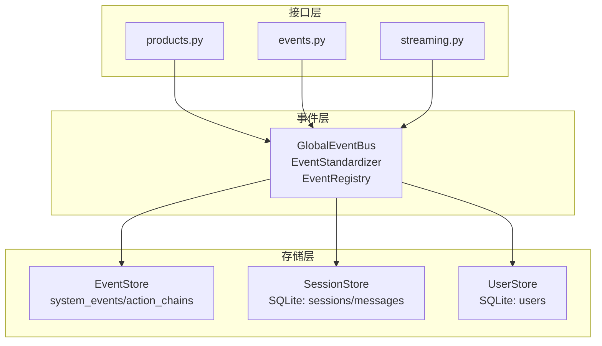
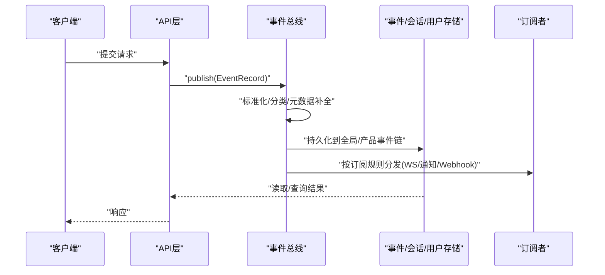
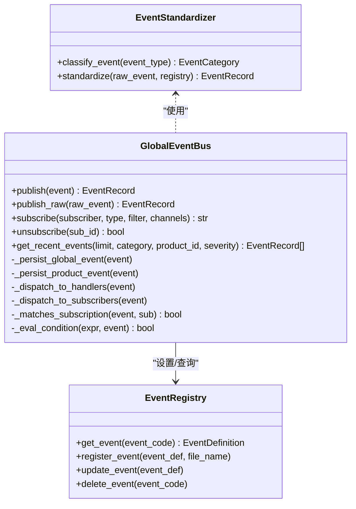
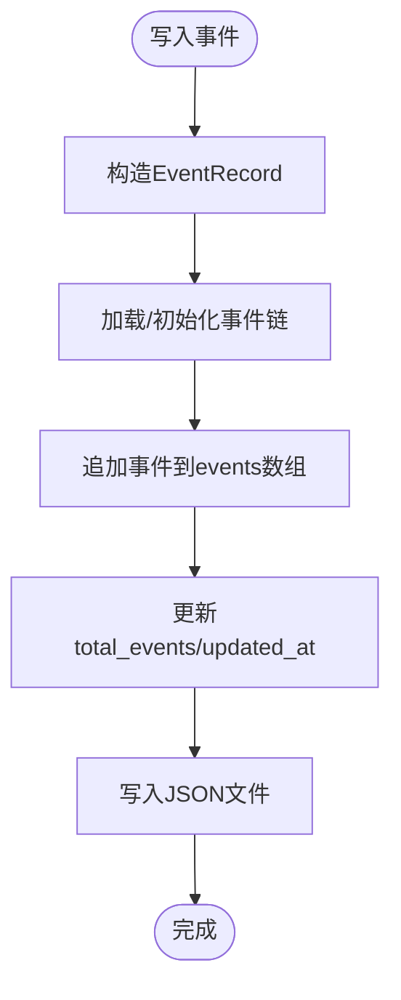
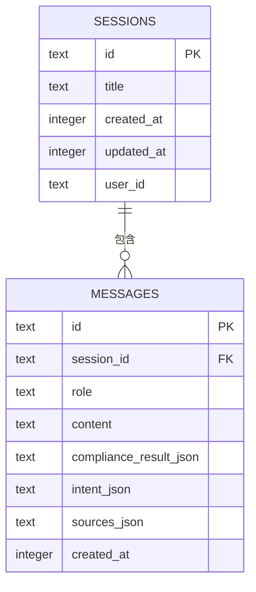
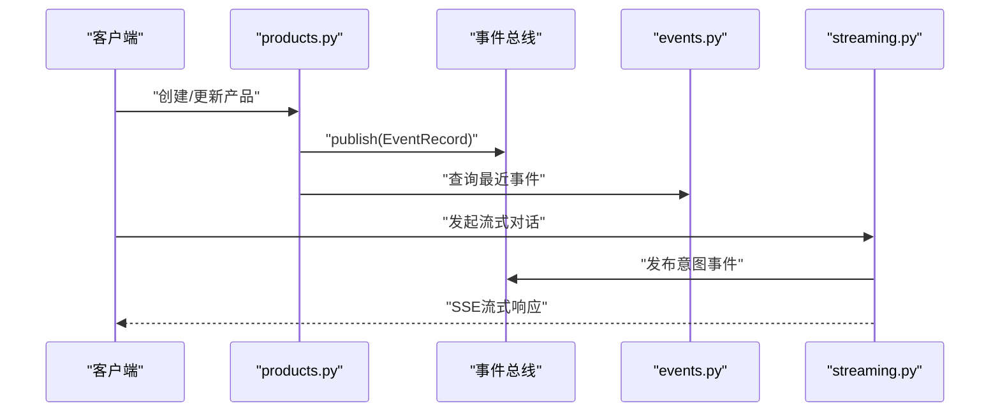
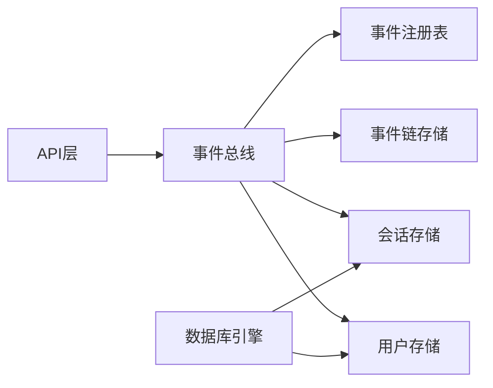

# 数据一致性保障

<cite>
**本文引用的文件**   
- [event_bus.py](file://backend/app/core/event_bus.py)
- [database.py](file://backend/app/models/database.py)
- [event_store.py](file://backend/app/storage/event_store.py)
- [session_store.py](file://backend/app/storage/session_store.py)
- [user_store.py](file://backend/app/storage/user_store.py)
- [products.py](file://backend/app/api/products.py)
- [events.py](file://backend/app/api/events.py)
- [streaming.py](file://backend/app/api/streaming.py)
</cite>

## 目录
1. [引言](#引言)
2. [项目结构](#项目结构)
3. [核心组件](#核心组件)
4. [架构总览](#架构总览)
5. [组件详解](#组件详解)
6. [依赖关系分析](#依赖关系分析)
7. [性能考量](#性能考量)
8. [故障排查指南](#故障排查指南)
9. [结论](#结论)
10. [附录](#附录)

## 引言
本文件面向避风港平台的数据一致性保障，系统性阐述在单体后端与本地文件/SQLite混合存储架构下，如何通过事件总线的异步发布、事件链的持久化、数据库事务与锁机制的使用，以及版本化与冲突检测策略，达成最终一致性目标。文档覆盖事务处理、并发控制、数据同步与复制、冲突检测与合并、以及测试与验证方法，帮助开发者与运维人员理解并优化数据一致性。

## 项目结构
围绕数据一致性，后端主要由三层构成：
- 事件层：全局事件总线与事件注册表，负责事件标准化、路由、持久化与分发。
- 存储层：事件链存储（JSON文件）、会话存储（SQLite）、用户存储（SQLite），分别承担系统事件审计、会话上下文与用户身份管理。
- 接口层：API模块通过事件总线发布事件，驱动后续处理与通知。

**图表来源**
- [event_bus.py:115-516](file://backend/app/core/event_bus.py#L115-L516)
- [event_store.py:59-221](file://backend/app/storage/event_store.py#L59-L221)
- [session_store.py:27-70](file://backend/app/storage/session_store.py#L27-L70)
- [user_store.py:22-33](file://backend/app/storage/user_store.py#L22-L33)
- [products.py:46-146](file://backend/app/api/products.py#L46-L146)
- [events.py:19-106](file://backend/app/api/events.py#L19-L106)
- [streaming.py:174-375](file://backend/app/api/streaming.py#L174-L375)

**章节来源**
- [event_bus.py:1-817](file://backend/app/core/event_bus.py#L1-L817)
- [event_store.py:1-269](file://backend/app/storage/event_store.py#L1-L269)
- [session_store.py:1-251](file://backend/app/storage/session_store.py#L1-L251)
- [user_store.py:1-133](file://backend/app/storage/user_store.py#L1-L133)
- [products.py:46-146](file://backend/app/api/products.py#L46-L146)
- [events.py:19-106](file://backend/app/api/events.py#L19-L106)
- [streaming.py:174-375](file://backend/app/api/streaming.py#L174-L375)

## 核心组件
- 全局事件总线：负责事件标准化、路由、持久化与订阅分发；支持产品级与全局事件隔离。
- 事件注册表：从配置文件加载事件定义，支持动态增删改与归档。
- 事件链存储：以JSON文件形式持久化系统事件与用户操作链，便于审计与回溯。
- 会话存储：基于SQLite的会话与消息持久化，支持外键约束与索引。
- 用户存储：基于SQLite的用户表，支持密码哈希与角色管理。
- 数据库引擎：异步SQLAlchemy引擎与会话工厂，提供事务与连接管理能力。

**章节来源**
- [event_bus.py:115-516](file://backend/app/core/event_bus.py#L115-L516)
- [event_store.py:59-221](file://backend/app/storage/event_store.py#L59-L221)
- [session_store.py:27-70](file://backend/app/storage/session_store.py#L27-L70)
- [user_store.py:22-33](file://backend/app/storage/user_store.py#L22-L33)
- [database.py:1-15](file://backend/app/models/database.py#L1-L15)

## 架构总览
事件总线作为数据一致性中枢，贯穿“发布—标准化—路由—持久化—分发—订阅”的闭环。系统通过事件链文件与SQLite表实现跨组件的数据共享与最终一致性。

**图表来源**
- [event_bus.py:150-187](file://backend/app/core/event_bus.py#L150-L187)
- [event_store.py:76-115](file://backend/app/storage/event_store.py#L76-L115)
- [events.py:28-51](file://backend/app/api/events.py#L28-L51)

**章节来源**
- [event_bus.py:115-516](file://backend/app/core/event_bus.py#L115-L516)
- [events.py:19-106](file://backend/app/api/events.py#L19-L106)

## 组件详解

### 事件总线与事件注册表
- 事件标准化：根据事件类型前缀自动分类，补充严重级别与数据源信息。
- 事件路由：全局事件写入总线文件，产品事件写入产品事件链，并维护最近事件内存缓存。
- 订阅分发：支持精准/批量/全局/条件四种订阅，按通道分发至WebSocket、通知引擎或Webhook。
- 注册表：从Markdown配置加载事件定义，支持动态注册、更新与归档。

**图表来源**
- [event_bus.py:44-113](file://backend/app/core/event_bus.py#L44-L113)
- [event_bus.py:115-516](file://backend/app/core/event_bus.py#L115-L516)

**章节来源**
- [event_bus.py:44-113](file://backend/app/core/event_bus.py#L44-L113)
- [event_bus.py:115-516](file://backend/app/core/event_bus.py#L115-L516)

### 事件链存储（EventStore）
- 系统事件链：记录全局系统事件，支持按类型/来源/严重度筛选与时间线展示。
- 用户操作链：记录用户行为链，便于决策回溯与审计。
- 迁移兼容：从旧目录迁移数据至新结构，保证历史数据可用。

**图表来源**
- [event_store.py:76-115](file://backend/app/storage/event_store.py#L76-L115)
- [event_store.py:198-220](file://backend/app/storage/event_store.py#L198-L220)

**章节来源**
- [event_store.py:59-221](file://backend/app/storage/event_store.py#L59-L221)

### 会话存储（SessionStore）
- 表结构：sessions与messages，外键约束确保会话删除级联清理消息。
- 并发控制：SQLite连接池与事务隔离，避免并发写入冲突。
- 索引优化：按更新时间倒序索引会话，按会话ID索引消息，提升查询效率。

**图表来源**
- [session_store.py:38-62](file://backend/app/storage/session_store.py#L38-L62)

**章节来源**
- [session_store.py:1-251](file://backend/app/storage/session_store.py#L1-L251)

### 用户存储（UserStore）
- 表结构：users，唯一用户名约束，bcrypt密码哈希。
- 初始化：空表时自动创建默认管理员账户，提示修改密码。

**章节来源**
- [user_store.py:22-33](file://backend/app/storage/user_store.py#L22-L33)
- [user_store.py:122-133](file://backend/app/storage/user_store.py#L122-L133)

### 数据库事务与锁机制
- 异步引擎：使用SQLAlchemy异步引擎与会话工厂，支持事务边界与连接复用。
- 事务语义：API层通过依赖注入获取会话，在单请求范围内执行多个数据库操作，保证原子性。
- 锁机制：SQLite在写入时采用行级锁与WAL模式（由连接参数控制），避免写竞争；并发读写通过事务隔离级别与提交/回滚控制一致性。

**章节来源**
- [database.py:1-15](file://backend/app/models/database.py#L1-L15)
- [session_store.py:74-84](file://backend/app/storage/session_store.py#L74-L84)
- [user_store.py:48-65](file://backend/app/storage/user_store.py#L48-L65)

### 版本控制与冲突检测
- 事件链版本：事件链对象包含更新时间戳与事件总数，便于判断数据新鲜度与完整性。
- 会话版本：会话表维护updated_at字段，配合索引实现高效版本查询。
- 冲突检测：事件链写入采用追加策略，不直接覆盖；若需更新，建议引入版本号字段并在写入前校验版本，防止并发覆盖。

**章节来源**
- [event_store.py:105-115](file://backend/app/storage/event_store.py#L105-L115)
- [event_store.py:146-158](file://backend/app/storage/event_store.py#L146-L158)
- [session_store.py:194-216](file://backend/app/storage/session_store.py#L194-L216)

### 分布式一致性与最终一致性
- 异步事件总线：事件发布与处理解耦，通过订阅分发实现最终一致性。
- 多通道分发：WebSocket、通知引擎、Webhook三种通道并行分发，增强可靠性。
- 事件归档：全局事件超过阈值进行归档，保证内存与IO开销可控。

**章节来源**
- [event_bus.py:150-187](file://backend/app/core/event_bus.py#L150-L187)
- [event_bus.py:392-444](file://backend/app/core/event_bus.py#L392-L444)
- [event_bus.py:294-331](file://backend/app/core/event_bus.py#L294-L331)

### 主从复制与一致性协议
- 当前实现：采用本地文件与SQLite存储，未见显式的主从复制或共识协议实现。
- 建议：若扩展至分布式部署，可引入基于Raft/ Paxos的共识组件或Kafka等消息中间件，结合幂等写入与事件溯源实现强一致或最终一致的多副本一致性。

**章节来源**
- [event_store.py:1-269](file://backend/app/storage/event_store.py#L1-L269)
- [session_store.py:1-251](file://backend/app/storage/session_store.py#L1-L251)

### API工作流与一致性
- 产品API：发布事件后查询最近事件，确保下游处理完成后再返回。
- 事件API：支持发布原始事件与查询事件，便于集成外部系统。
- 流式API：在意图识别与技能执行后发布事件，形成完整事件链。

**图表来源**
- [products.py:46-146](file://backend/app/api/products.py#L46-L146)
- [events.py:19-51](file://backend/app/api/events.py#L19-L51)
- [streaming.py:174-375](file://backend/app/api/streaming.py#L174-L375)

**章节来源**
- [products.py:46-146](file://backend/app/api/products.py#L46-L146)
- [events.py:19-106](file://backend/app/api/events.py#L19-L106)
- [streaming.py:174-375](file://backend/app/api/streaming.py#L174-L375)

## 依赖关系分析
- 事件总线依赖事件注册表进行事件定义标准化；事件链存储与会话/用户存储作为持久化后端。
- API层通过事件总线解耦业务逻辑与数据持久化，降低耦合度。
- 数据库层提供事务与连接管理，支撑会话与用户数据的一致性。

**图表来源**
- [event_bus.py:144-146](file://backend/app/core/event_bus.py#L144-L146)
- [event_store.py:62-64](file://backend/app/storage/event_store.py#L62-L64)
- [session_store.py:21-22](file://backend/app/storage/session_store.py#L21-L22)
- [user_store.py:15-16](file://backend/app/storage/user_store.py#L15-L16)
- [database.py:3-9](file://backend/app/models/database.py#L3-L9)

**章节来源**
- [event_bus.py:144-146](file://backend/app/core/event_bus.py#L144-L146)
- [event_store.py:62-64](file://backend/app/storage/event_store.py#L62-L64)
- [session_store.py:21-22](file://backend/app/storage/session_store.py#L21-L22)
- [user_store.py:15-16](file://backend/app/storage/user_store.py#L15-L16)
- [database.py:3-9](file://backend/app/models/database.py#L3-L9)

## 性能考量
- 事件持久化：全局事件写入采用追加与归档策略，限制内存与磁盘占用。
- 查询优化：会话存储建立索引，减少排序与过滤成本。
- 并发写入：SQLite在单实例下具备良好并发能力；建议在高并发场景引入连接池与限流。
- 异步处理：事件总线异步分发，避免阻塞主流程，提高吞吐。

[本节为通用指导，无需具体文件引用]

## 故障排查指南
- 事件未分发：检查事件类型是否匹配订阅过滤条件，确认订阅通道是否启用。
- 事件丢失：核查事件总线持久化文件是否存在，关注归档策略是否触发。
- 会话数据异常：确认事务是否正确提交，检查外键约束与索引是否存在。
- 用户数据冲突：用户名唯一约束冲突时抛出异常，需先查询再创建。
- 数据库连接问题：检查异步引擎URL与连接池配置，确保会话生命周期管理正确。

**章节来源**
- [event_bus.py:445-482](file://backend/app/core/event_bus.py#L445-L482)
- [event_store.py:198-220](file://backend/app/storage/event_store.py#L198-L220)
- [session_store.py:74-84](file://backend/app/storage/session_store.py#L74-L84)
- [user_store.py:48-65](file://backend/app/storage/user_store.py#L48-L65)
- [database.py:12-15](file://backend/app/models/database.py#L12-L15)

## 结论
避风港平台通过事件总线实现跨组件的最终一致性，结合事件链与SQLite存储，满足审计、回溯与实时通知需求。在单体架构下，事务与锁机制有效保障了数据一致性；未来若扩展至分布式，建议引入消息中间件与事件溯源，进一步强化一致性与可观测性。

[本节为总结，无需具体文件引用]

## 附录

### 数据一致性测试与验证方法
- 单元测试：针对事件发布、订阅匹配、事件链写入与读取进行断言。
- 集成测试：模拟多API并发写入，验证事件总线分发与存储一致性。
- 回归测试：覆盖事件归档、订阅条件表达式、会话索引与用户唯一约束。
- 压力测试：评估事件总线与存储在高并发下的延迟与吞吐表现。

[本节为通用指导，无需具体文件引用]