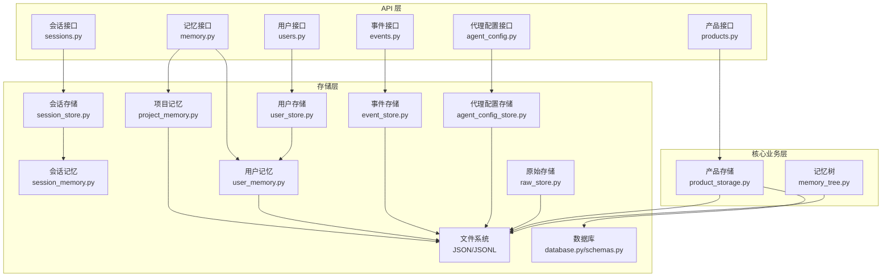
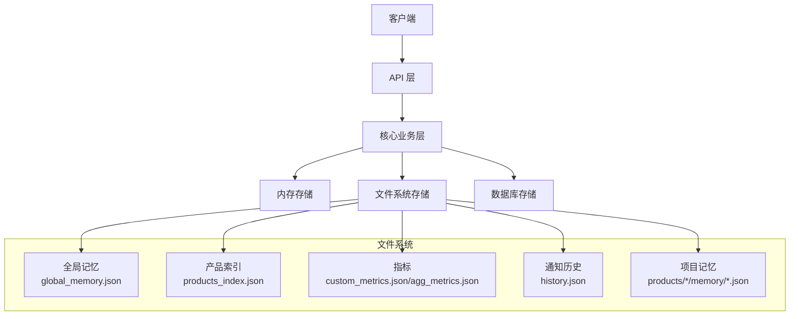
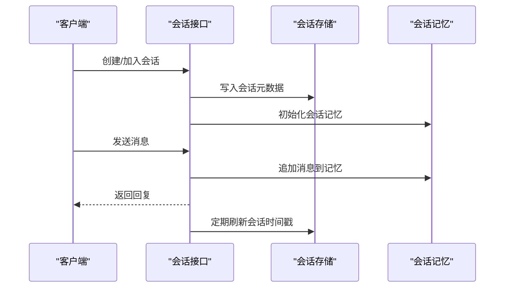
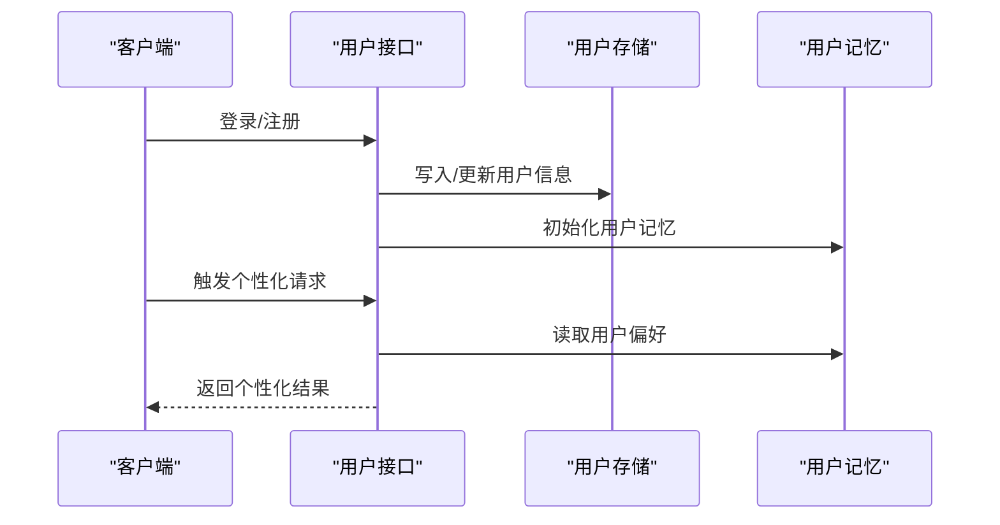
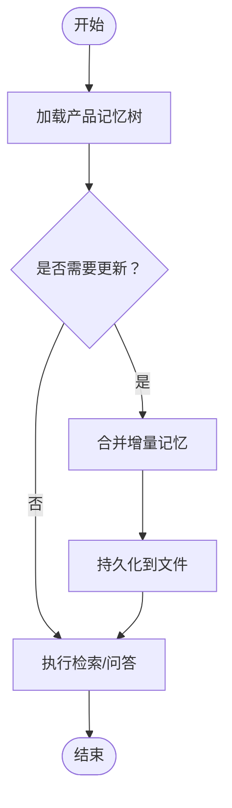
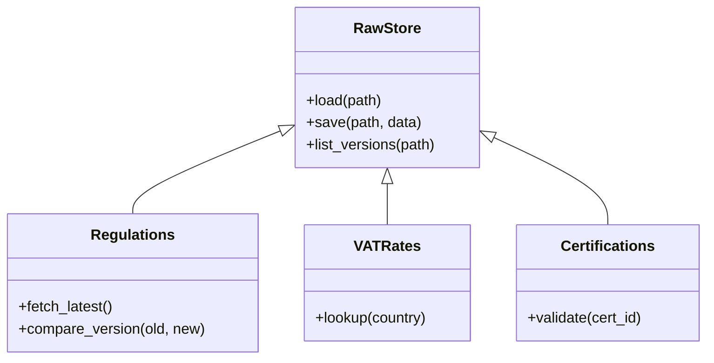
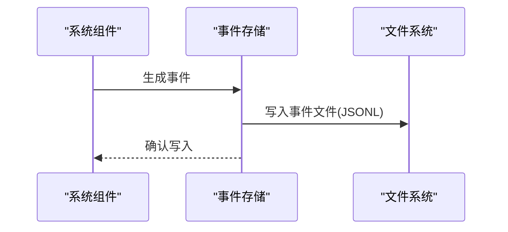
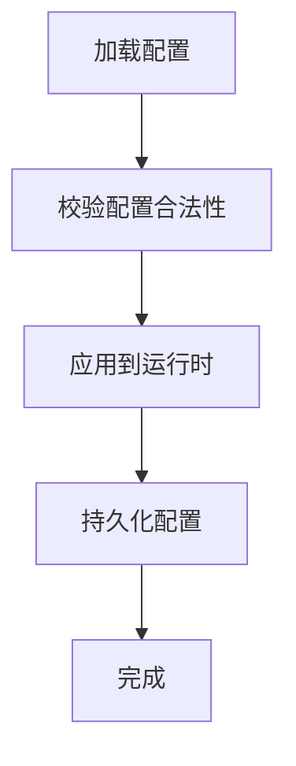
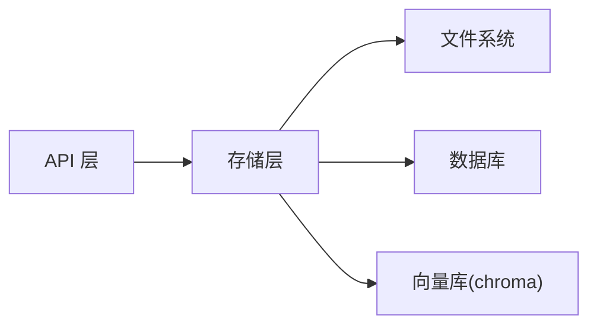

# 数据存储策略

<cite>
**本文引用的文件**
- [backend/app/storage/session_store.py](file://backend/app/storage/session_store.py)
- [backend/app/storage/session_memory.py](file://backend/app/storage/session_memory.py)
- [backend/app/storage/user_store.py](file://backend/app/storage/user_store.py)
- [backend/app/storage/user_memory.py](file://backend/app/storage/user_memory.py)
- [backend/app/storage/project_memory.py](file://backend/app/storage/project_memory.py)
- [backend/app/storage/raw_store.py](file://backend/app/storage/raw_store.py)
- [backend/app/storage/event_store.py](file://backend/app/storage/event_store.py)
- [backend/app/storage/agent_config_store.py](file://backend/app/storage/agent_config_store.py)
- [backend/app/storage/__init__.py](file://backend/app/storage/__init__.py)
- [backend/data/global/memory/global_memory.json](file://backend/data/global/memory/global_memory.json)
- [backend/data/products/*/memory/*.json](file://backend/data/products/*/memory/*.json)
- [backend/data/global/products_index.json](file://backend/data/global/products_index.json)
- [backend/data/global/metrics/custom_metrics.json](file://backend/data/global/metrics/custom_metrics.json)
- [backend/data/global/metrics/agg_metrics.json](file://backend/data/global/metrics/agg_metrics.json)
- [backend/data/global/notifications/history.json](file://backend/data/global/notifications/history.json)
- [backend/data/chroma](file://backend/data/chroma)
- [backend/scripts/migrate_storage.py](file://backend/scripts/migrate_storage.py)
- [backend/app/models/database.py](file://backend/app/models/database.py)
- [backend/app/models/schemas.py](file://backend/app/models/schemas.py)
- [backend/app/core/product_storage.py](file://backend/app/core/product_storage.py)
- [backend/app/core/memory_tree.py](file://backend/app/core/memory_tree.py)
- [backend/app/api/sessions.py](file://backend/app/api/sessions.py)
- [backend/app/api/users.py](file://backend/app/api/users.py)
- [backend/app/api/products.py](file://backend/app/api/products.py)
- [backend/app/api/memory.py](file://backend/app/api/memory.py)
- [backend/app/api/events.py](file://backend/app/api/events.py)
- [backend/app/api/agent_config.py](file://backend/app/api/agent_config.py)
- [backend/app/main.py](file://backend/app/main.py)
- [README.md](file://README.md)
</cite>

## 目录
1. [简介](#简介)
2. [项目结构](#项目结构)
3. [核心组件](#核心组件)
4. [架构总览](#架构总览)
5. [详细组件分析](#详细组件分析)
6. [依赖关系分析](#依赖关系分析)
7. [性能考虑](#性能考虑)
8. [故障排查指南](#故障排查指南)
9. [结论](#结论)
10. [附录](#附录)

## 简介
本文件面向避风港平台的数据存储策略，系统性阐述会话存储、用户存储、原始数据存储、项目记忆与用户记忆的实现与管理方式；解释内存存储、文件存储与数据库存储的分层使用场景；明确产品级与用户级数据隔离机制；给出持久化、备份、恢复与迁移方案；总结索引设计、查询优化与缓存策略；并提供配置与管理最佳实践。

## 项目结构
避风港平台采用“API 层 → 核心业务层 → 存储层”的分层架构。存储层包含：
- 文件存储：以 JSON/JSONL 为主的本地文件，覆盖全局记忆、产品记忆、事件、通知、指标等。
- 内存存储：基于内存的数据结构（如字典、列表）用于短期会话与中间态。
- 数据库存储：通过 ORM 定义模型与表结构，支持可选的持久化与查询能力。

图表来源
- [backend/app/api/sessions.py](file://backend/app/api/sessions.py)
- [backend/app/api/users.py](file://backend/app/api/users.py)
- [backend/app/api/products.py](file://backend/app/api/products.py)
- [backend/app/api/memory.py](file://backend/app/api/memory.py)
- [backend/app/api/events.py](file://backend/app/api/events.py)
- [backend/app/api/agent_config.py](file://backend/app/api/agent_config.py)
- [backend/app/core/product_storage.py](file://backend/app/core/product_storage.py)
- [backend/app/core/memory_tree.py](file://backend/app/core/memory_tree.py)
- [backend/app/storage/session_store.py](file://backend/app/storage/session_store.py)
- [backend/app/storage/session_memory.py](file://backend/app/storage/session_memory.py)
- [backend/app/storage/user_store.py](file://backend/app/storage/user_store.py)
- [backend/app/storage/user_memory.py](file://backend/app/storage/user_memory.py)
- [backend/app/storage/project_memory.py](file://backend/app/storage/project_memory.py)
- [backend/app/storage/raw_store.py](file://backend/app/storage/raw_store.py)
- [backend/app/storage/event_store.py](file://backend/app/storage/event_store.py)
- [backend/app/storage/agent_config_store.py](file://backend/app/storage/agent_config_store.py)
- [backend/app/models/database.py](file://backend/app/models/database.py)
- [backend/app/models/schemas.py](file://backend/app/models/schemas.py)

章节来源
- [backend/app/storage/__init__.py](file://backend/app/storage/__init__.py)
- [backend/app/main.py](file://backend/app/main.py)

## 核心组件
- 会话存储与记忆：负责短期会话状态与上下文记忆的临时与持久化管理。
- 用户存储与记忆：负责用户维度的状态与偏好记忆，支持跨会话延续。
- 项目记忆：面向产品维度的记忆树与增量更新，支撑知识检索与合规建议。
- 原始数据存储：面向法规、税号、认证等原始数据的结构化与版本化管理。
- 事件存储：记录系统事件与合规事件，支持审计与回放。
- 代理配置存储：管理代理扩展、技能注册、工作器绑定等配置。
- 文件系统存储：作为默认持久化介质，承载全局记忆、指标、通知、产品索引等。
- 数据库：定义模型与表结构，支持可选的结构化查询与持久化。

章节来源
- [backend/app/storage/session_store.py](file://backend/app/storage/session_store.py)
- [backend/app/storage/session_memory.py](file://backend/app/storage/session_memory.py)
- [backend/app/storage/user_store.py](file://backend/app/storage/user_store.py)
- [backend/app/storage/user_memory.py](file://backend/app/storage/user_memory.py)
- [backend/app/storage/project_memory.py](file://backend/app/storage/project_memory.py)
- [backend/app/storage/raw_store.py](file://backend/app/storage/raw_store.py)
- [backend/app/storage/event_store.py](file://backend/app/storage/event_store.py)
- [backend/app/storage/agent_config_store.py](file://backend/app/storage/agent_config_store.py)
- [backend/app/storage/__init__.py](file://backend/app/storage/__init__.py)

## 架构总览
存储架构遵循“文件为主、内存为辅、数据库可选”的分层策略：
- 文件存储：全局记忆、产品记忆、事件、通知、指标、配置等以 JSON/JSONL 形式落地，便于版本化与迁移。
- 内存存储：会话与中间态在内存中快速访问，降低 IO 开销。
- 数据库：通过 ORM 映射模型，支持结构化查询与可选持久化，适合需要强一致或复杂关联的场景。

图表来源
- [backend/data/global/memory/global_memory.json](file://backend/data/global/memory/global_memory.json)
- [backend/data/global/products_index.json](file://backend/data/global/products_index.json)
- [backend/data/global/metrics/custom_metrics.json](file://backend/data/global/metrics/custom_metrics.json)
- [backend/data/global/metrics/agg_metrics.json](file://backend/data/global/metrics/agg_metrics.json)
- [backend/data/global/notifications/history.json](file://backend/data/global/notifications/history.json)
- [backend/data/products/*/memory/*.json](file://backend/data/products/*/memory/*.json)

## 详细组件分析

### 会话存储与记忆
- 会话存储：负责会话元数据与上下文的短期持久化，通常结合内存缓存提升响应速度。
- 会话记忆：维护对话历史与上下文片段，支持按会话检索与清理。
- 使用场景：多轮对话、意图识别、上下文补全等。

图表来源
- [backend/app/api/sessions.py](file://backend/app/api/sessions.py)
- [backend/app/storage/session_store.py](file://backend/app/storage/session_store.py)
- [backend/app/storage/session_memory.py](file://backend/app/storage/session_memory.py)

章节来源
- [backend/app/storage/session_store.py](file://backend/app/storage/session_store.py)
- [backend/app/storage/session_memory.py](file://backend/app/storage/session_memory.py)

### 用户存储与记忆
- 用户存储：保存用户基本信息、权限与偏好设置，支持跨会话延续。
- 用户记忆：记录用户行为与偏好，用于个性化推荐与上下文记忆。
- 使用场景：个性化界面、合规提醒、风险偏好设置。

图表来源
- [backend/app/api/users.py](file://backend/app/api/users.py)
- [backend/app/storage/user_store.py](file://backend/app/storage/user_store.py)
- [backend/app/storage/user_memory.py](file://backend/app/storage/user_memory.py)

章节来源
- [backend/app/storage/user_store.py](file://backend/app/storage/user_store.py)
- [backend/app/storage/user_memory.py](file://backend/app/storage/user_memory.py)

### 项目记忆（产品级）
- 项目记忆：面向产品维度的记忆树，支持增量更新与检索，支撑知识问答与合规建议。
- 全局记忆：平台级记忆，供系统范围内的规则引擎与监控使用。
- 使用场景：产品知识检索、法规扫描、风险提示。

图表来源
- [backend/app/core/memory_tree.py](file://backend/app/core/memory_tree.py)
- [backend/app/storage/project_memory.py](file://backend/app/storage/project_memory.py)
- [backend/data/global/memory/global_memory.json](file://backend/data/global/memory/global_memory.json)

章节来源
- [backend/app/core/memory_tree.py](file://backend/app/core/memory_tree.py)
- [backend/app/storage/project_memory.py](file://backend/app/storage/project_memory.py)
- [backend/data/global/memory/global_memory.json](file://backend/data/global/memory/global_memory.json)

### 原始数据存储
- 原始数据：法规、税号、认证等结构化数据，以 JSON/JSONL 形式存储，便于版本化与检索。
- 使用场景：合规扫描、规则匹配、风险评估。

图表来源
- [backend/app/storage/raw_store.py](file://backend/app/storage/raw_store.py)
- [backend/data/raw/regulations/eu/*](file://backend/data/raw/regulations/eu/*)
- [backend/data/raw/vat_rates/*](file://backend/data/raw/vat_rates/*)
- [backend/data/raw/certifications/*](file://backend/data/raw/certifications/*)

章节来源
- [backend/app/storage/raw_store.py](file://backend/app/storage/raw_store.py)
- [backend/data/raw/regulations/eu/*](file://backend/data/raw/regulations/eu/*)
- [backend/data/raw/vat_rates/*](file://backend/data/raw/vat_rates/*)
- [backend/data/raw/certifications/*](file://backend/data/raw/certifications/*)

### 事件存储
- 事件存储：记录系统事件与合规事件，支持审计与回放。
- 使用场景：合规审计、异常检测、运营监控。

图表来源
- [backend/app/storage/event_store.py](file://backend/app/storage/event_store.py)
- [backend/app/api/events.py](file://backend/app/api/events.py)
- [backend/data/chroma](file://backend/data/chroma)

章节来源
- [backend/app/storage/event_store.py](file://backend/app/storage/event_store.py)
- [backend/app/api/events.py](file://backend/app/api/events.py)
- [backend/data/chroma](file://backend/data/chroma)

### 代理配置存储
- 代理配置存储：管理代理扩展、技能注册、工作器绑定等配置。
- 使用场景：动态扩展、技能编排、任务调度。

图表来源
- [backend/app/storage/agent_config_store.py](file://backend/app/storage/agent_config_store.py)
- [backend/app/api/agent_config.py](file://backend/app/api/agent_config.py)

章节来源
- [backend/app/storage/agent_config_store.py](file://backend/app/storage/agent_config_store.py)
- [backend/app/api/agent_config.py](file://backend/app/api/agent_config.py)

## 依赖关系分析
- 组件耦合：API 层仅依赖存储层接口，存储层内部通过文件系统与数据库协同，降低耦合度。
- 数据隔离：产品级与用户级数据分别由独立的存储模块管理，避免交叉污染。
- 外部依赖：Chroma 向量库用于向量化检索，与事件存储共同支撑记忆检索。

图表来源
- [backend/app/api/sessions.py](file://backend/app/api/sessions.py)
- [backend/app/api/users.py](file://backend/app/api/users.py)
- [backend/app/api/memory.py](file://backend/app/api/memory.py)
- [backend/app/storage/session_store.py](file://backend/app/storage/session_store.py)
- [backend/app/storage/user_store.py](file://backend/app/storage/user_store.py)
- [backend/app/storage/project_memory.py](file://backend/app/storage/project_memory.py)
- [backend/data/chroma](file://backend/data/chroma)

## 性能考虑
- 索引设计
  - 产品索引：以产品 ID 为键，建立快速映射，支持 O(1) 查找。
  - 事件索引：按时间戳与类型建立二级索引，支持高效范围查询。
- 查询优化
  - 记忆检索：优先使用向量相似度检索，结合关键词过滤，减少全量扫描。
  - 缓存策略：热点数据（如全局记忆、常用产品记忆）放入内存缓存，定期落盘。
- 缓存策略
  - LRU 缓存：对频繁访问的用户记忆与会话记忆进行缓存。
  - 分层缓存：内存缓存 + 文件缓存，确保重启后可快速恢复。
- I/O 优化
  - 批量写入：事件与日志采用批量写入，减少磁盘碎片。
  - 异步写入：非关键路径写入采用异步队列，保证主流程低延迟。

## 故障排查指南
- 会话丢失
  - 检查会话存储文件是否存在与权限是否正确。
  - 核对会话时间戳与过期策略。
- 记忆不一致
  - 对比内存缓存与文件存储的版本号，必要时强制同步。
  - 检查记忆树合并逻辑，避免重复或遗漏。
- 事件丢失
  - 核对事件存储目录与 JSONL 文件完整性。
  - 检查写入线程与异常处理逻辑。
- 配置不生效
  - 校验代理配置文件格式与权限。
  - 确认配置加载顺序与热更新机制。
- 数据迁移失败
  - 使用迁移脚本检查源与目标路径，核对权限与磁盘空间。
  - 备份旧数据后再执行迁移。

章节来源
- [backend/app/storage/session_store.py](file://backend/app/storage/session_store.py)
- [backend/app/storage/session_memory.py](file://backend/app/storage/session_memory.py)
- [backend/app/storage/user_store.py](file://backend/app/storage/user_store.py)
- [backend/app/storage/user_memory.py](file://backend/app/storage/user_memory.py)
- [backend/app/storage/project_memory.py](file://backend/app/storage/project_memory.py)
- [backend/app/storage/event_store.py](file://backend/app/storage/event_store.py)
- [backend/app/storage/agent_config_store.py](file://backend/app/storage/agent_config_store.py)
- [backend/scripts/migrate_storage.py](file://backend/scripts/migrate_storage.py)

## 结论
避风港平台采用“文件为主、内存为辅、数据库可选”的存储分层策略，结合产品级与用户级数据隔离机制，满足合规、检索与性能需求。通过索引设计、查询优化与缓存策略，平台在保证数据一致性的同时提升了响应速度。建议持续完善备份与迁移方案，并加强监控与告警，确保数据安全与可用性。

## 附录
- 数据隔离机制
  - 产品级隔离：每个产品拥有独立的记忆目录与索引，防止跨产品数据泄露。
  - 用户级隔离：用户数据与会话数据分离存储，严格控制访问权限。
- 持久化策略
  - 备份：定期导出全局记忆、产品记忆与事件到归档目录。
  - 恢复：通过迁移脚本将备份数据恢复至生产环境。
  - 迁移：统一使用迁移脚本，支持增量迁移与回滚。
- 最佳实践
  - 为关键文件设置只读权限，防止误删改。
  - 对大文件采用压缩与分片策略，降低 I/O 压力。
  - 定期清理过期会话与事件，释放磁盘空间。
  - 在数据库与文件系统之间保持一致性，避免脏读。