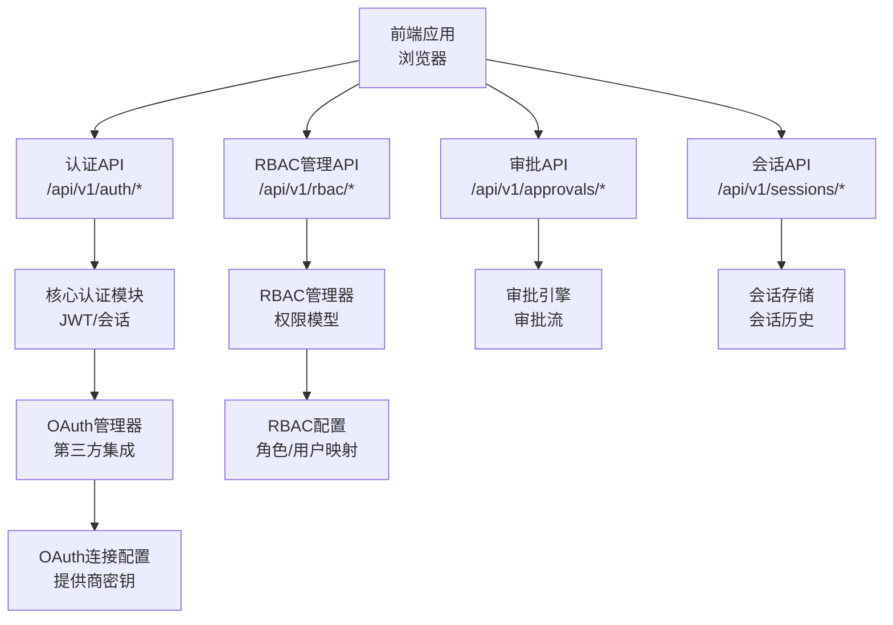
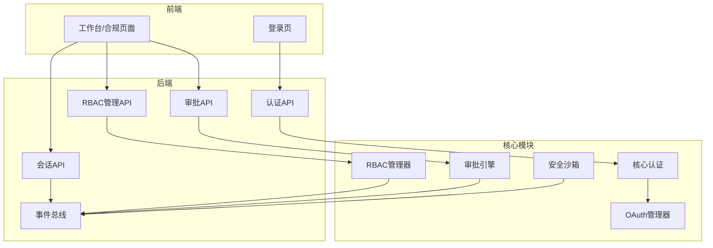
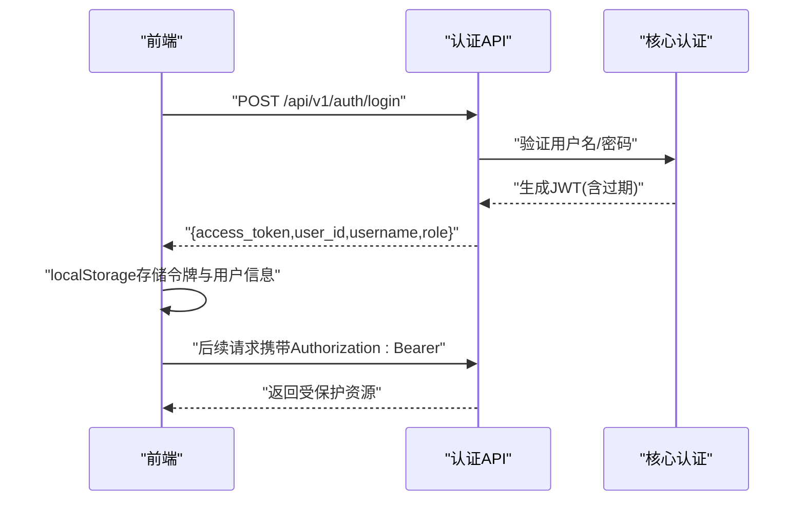
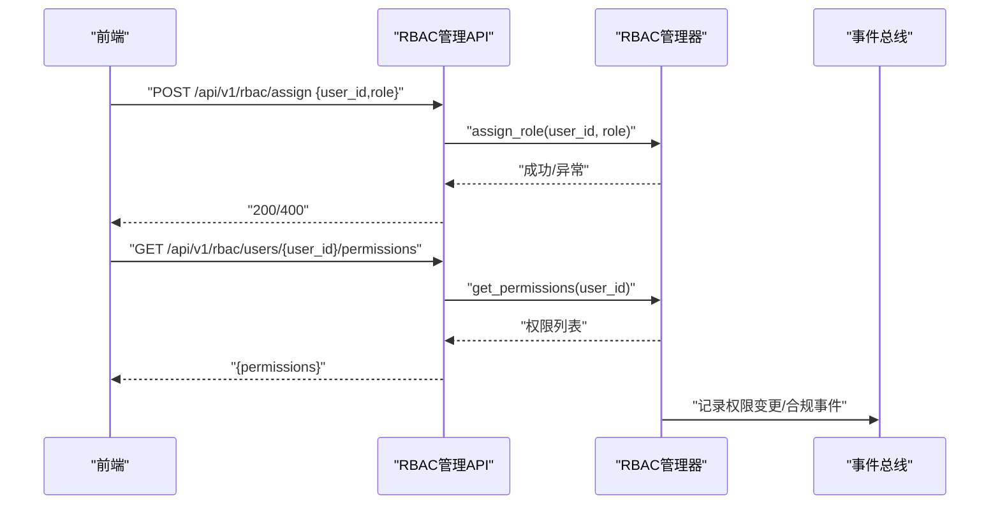
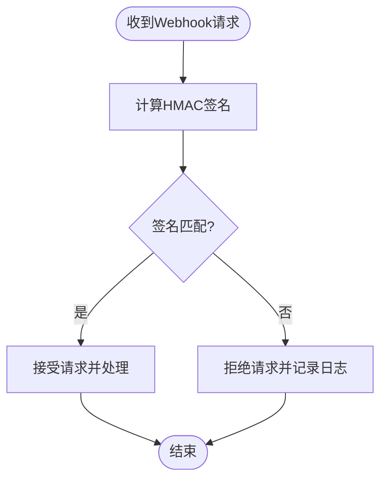
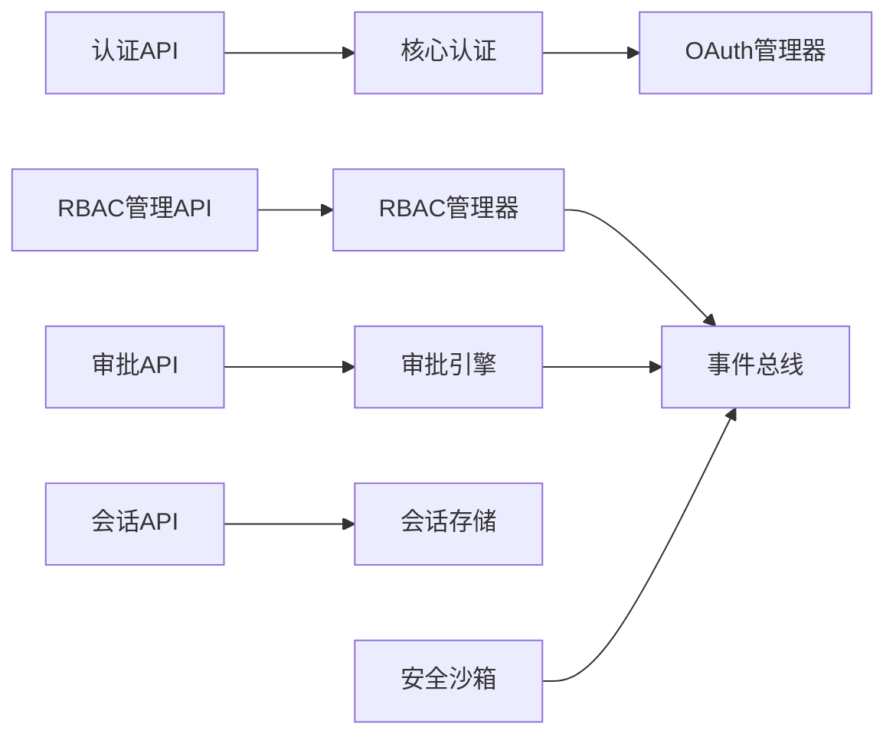

# 数据安全与隐私保护

<cite>
**本文引用的文件**
- [后端api.md](file://后端api.md)
- [前后端api交互.md](file://前后端api交互.md)
- [避风港_20260524_开发文档.md](file://避风港_20260524_开发文档.md)
- [backend/app/api/auth.py](file://backend/app/api/auth.py)
- [backend/app/api/admin.py](file://backend/app/api/admin.py)
- [backend/app/api/sessions.py](file://backend/app/api/sessions.py)
- [backend/app/core/auth.py](file://backend/app/core/auth.py)
- [backend/app/core/rbac.py](file://backend/app/core/rbac.py)
- [backend/app/core/oauth_manager.py](file://backend/app/core/oauth_manager.py)
- [backend/app/core/security_sandbox.py](file://backend/app/core/security_sandbox.py)
- [backend/app/services/shopify.py](file://backend/app/services/shopify.py)
- [backend/data/config/oauth_connections.json](file://backend/data/config/oauth_connections.json)
- [backend/data/config/rbac_users.json](file://backend/data/config/rbac_users.json)
- [backend/tests/test_all_phases.py](file://backend/tests/test_all_phases.py)
- [backend/tests/test_full_business_flow.py](file://backend/tests/test_full_business_flow.py)
- [backend/data/global/events/bus.json](file://backend/data/global/events/bus.json)
</cite>

## 目录
1. [引言](#引言)
2. [项目结构](#项目结构)
3. [核心组件](#核心组件)
4. [架构总览](#架构总览)
5. [详细组件分析](#详细组件分析)
6. [依赖关系分析](#依赖关系分析)
7. [性能考虑](#性能考虑)
8. [故障排查指南](#故障排查指南)
9. [结论](#结论)
10. [附录](#附录)

## 引言
本文件面向避风港平台的数据安全与隐私保护，系统性梳理平台在数据安全机制、访问控制、审计日志、身份认证与授权、传输安全、敏感数据保护、威胁防护以及应急响应与合规等方面的设计与实现现状，并给出优化建议与最佳实践。文档以代码库实际实现为依据，避免臆测，确保技术细节可追溯。

## 项目结构
避风港平台采用前后端分离架构，后端基于 FastAPI 提供 REST API，前端通过 Bearer Token 进行鉴权。安全相关能力主要分布在以下模块：
- 认证与会话：登录、JWT 令牌、当前用户信息、会话历史管理
- 授权与审计：RBAC 权限模型、审批流、操作审计
- 第三方集成：OAuth 管理、Webhook 验证
- 安全沙箱：工具调用与文件操作的安全检查
- 事件总线：系统事件与合规事件记录

图表来源
- [后端api.md](file://后端api.md)
- [backend/app/api/auth.py](file://backend/app/api/auth.py)
- [backend/app/api/admin.py](file://backend/app/api/admin.py)
- [backend/app/api/sessions.py](file://backend/app/api/sessions.py)
- [backend/app/core/auth.py](file://backend/app/core/auth.py)
- [backend/app/core/rbac.py](file://backend/app/core/rbac.py)
- [backend/app/core/oauth_manager.py](file://backend/app/core/oauth_manager.py)
- [backend/data/config/oauth_connections.json](file://backend/data/config/oauth_connections.json)
- [backend/data/config/rbac_users.json](file://backend/data/config/rbac_users.json)

章节来源
- [后端api.md](file://后端api.md)
- [前后端api交互.md](file://前后端api交互.md)

## 核心组件
- 认证与会话
  - 登录接口返回 JWT，前端将令牌存储于本地并随后续请求携带 Authorization: Bearer 头
  - 当前用户信息接口仅对已登录用户开放
  - 会话历史接口支持管理员查看全部会话，普通用户仅能查看自身会话，并限制查询范围
- 授权与审计
  - RBAC 管理接口支持角色分配、用户权限查询、权限检查
  - 审批路由提供审批请求、审批状态变更与统计
  - 事件总线记录合规检查、用户行为等事件，便于审计
- 第三方集成与安全
  - OAuth 管理器负责第三方登录与连接配置
  - Shopify Webhook 验证采用 HMAC 校验，防止伪造回调
  - 安全沙箱对工具调用与文件操作进行安全检查
- 传输安全
  - 开发文档明确要求 HTTPS 强制重定向与 Bearer Token API Key 认证作为基础安全治理

章节来源
- [后端api.md](file://后端api.md)
- [前后端api交互.md](file://前后端api交互.md)
- [backend/app/api/auth.py](file://backend/app/api/auth.py)
- [backend/app/api/admin.py](file://backend/app/api/admin.py)
- [backend/app/api/sessions.py](file://backend/app/api/sessions.py)
- [backend/app/core/auth.py](file://backend/app/core/auth.py)
- [backend/app/core/rbac.py](file://backend/app/core/rbac.py)
- [backend/app/core/oauth_manager.py](file://backend/app/core/oauth_manager.py)
- [backend/app/core/security_sandbox.py](file://backend/app/core/security_sandbox.py)
- [backend/app/services/shopify.py](file://backend/app/services/shopify.py)
- [backend/data/global/events/bus.json](file://backend/data/global/events/bus.json)
- [避风港_20260524_开发文档.md](file://避风港_20260524_开发文档.md)

## 架构总览
下图展示认证、授权与审计在系统中的交互关系，以及与事件总线的联动：

图表来源
- [后端api.md](file://后端api.md)
- [backend/app/api/auth.py](file://backend/app/api/auth.py)
- [backend/app/api/admin.py](file://backend/app/api/admin.py)
- [backend/app/api/sessions.py](file://backend/app/api/sessions.py)
- [backend/app/core/auth.py](file://backend/app/core/auth.py)
- [backend/app/core/rbac.py](file://backend/app/core/rbac.py)
- [backend/app/core/oauth_manager.py](file://backend/app/core/oauth_manager.py)
- [backend/app/core/security_sandbox.py](file://backend/app/core/security_sandbox.py)
- [backend/data/global/events/bus.json](file://backend/data/global/events/bus.json)

## 详细组件分析

### 认证与会话（JWT、Bearer Token）
- 登录流程
  - 前端向认证接口提交凭据，后端验证成功后签发 JWT（包含过期时间），并返回令牌与用户信息
  - 前端将令牌写入本地存储，并在后续请求头中携带 Authorization: Bearer
- 会话历史访问控制
  - 管理员可查看全部会话；普通用户仅能查看自身会话，且列表限制数量
  - 获取单个会话时，若非管理员且不属于该用户，将拒绝访问

图表来源
- [前后端api交互.md](file://前后端api交互.md)
- [后端api.md](file://后端api.md)
- [backend/app/api/auth.py](file://backend/app/api/auth.py)
- [backend/app/api/sessions.py](file://backend/app/api/sessions.py)

章节来源
- [前后端api交互.md](file://前后端api交互.md)
- [后端api.md](file://后端api.md)
- [backend/app/api/auth.py](file://backend/app/api/auth.py)
- [backend/app/api/sessions.py](file://backend/app/api/sessions.py)

### 授权与审计（RBAC、审批、事件总线）
- RBAC 权限模型
  - 支持角色分配、用户权限查询、权限检查
  - 提供用户详情与权限列表接口，便于审计与排障
- 审批流
  - 提供审批请求创建、审批通过/驳回、审批规则查询与统计
- 事件总线
  - 记录合规检查、用户行为等事件，包含严重程度与时间戳，支撑审计与溯源

图表来源
- [后端api.md](file://后端api.md)
- [backend/app/api/admin.py](file://backend/app/api/admin.py)
- [backend/app/core/rbac.py](file://backend/app/core/rbac.py)
- [backend/data/global/events/bus.json](file://backend/data/global/events/bus.json)

章节来源
- [后端api.md](file://后端api.md)
- [backend/app/api/admin.py](file://backend/app/api/admin.py)
- [backend/app/core/rbac.py](file://backend/app/core/rbac.py)
- [backend/tests/test_all_phases.py](file://backend/tests/test_all_phases.py)
- [backend/data/global/events/bus.json](file://backend/data/global/events/bus.json)

### 第三方集成与安全（OAuth、Webhook 验证、安全沙箱）
- OAuth 集成
  - OAuth 管理器负责第三方登录与连接配置，配置文件集中管理提供商密钥
- Shopify Webhook 验证
  - 使用 HMAC-SHA256 对回调体进行签名验证，支持十六进制与 Base64 两种编码格式校验
- 安全沙箱
  - 对工具调用与文件操作进行安全检查，阻断高风险操作

图表来源
- [backend/app/services/shopify.py](file://backend/app/services/shopify.py)

章节来源
- [backend/app/core/oauth_manager.py](file://backend/app/core/oauth_manager.py)
- [backend/data/config/oauth_connections.json](file://backend/data/config/oauth_connections.json)
- [backend/app/services/shopify.py](file://backend/app/services/shopify.py)
- [backend/app/core/security_sandbox.py](file://backend/app/core/security_sandbox.py)

### 数据传输安全（HTTPS、API 认证）
- HTTPS 强制重定向与 Bearer Token 认证已在开发文档中列为“基础安全治理 L1”的优先事项
- 前后端交互约定：所有受保护接口均需携带 Authorization: Bearer 令牌

章节来源
- [避风港_20260524_开发文档.md](file://避风港_20260524_开发文档.md)
- [前后端api交互.md](file://前后端api交互.md)

### 敏感数据保护（个人数据处理、最小化、保留期限）
- 会话历史接口对非管理员用户进行访问限制，符合数据最小化原则
- 事件总线记录事件但不包含敏感内容，便于审计与溯源
- 建议在生产环境引入数据脱敏策略（如对日志中的敏感字段进行掩码处理）

章节来源
- [backend/app/api/sessions.py](file://backend/app/api/sessions.py)
- [backend/data/global/events/bus.json](file://backend/data/global/events/bus.json)

### 威胁防护（SQL 注入、XSS、CSRF）
- SQL 注入防护
  - 使用 ORM/参数化查询（由框架与数据库层保障），避免直接拼接 SQL
- XSS 防护
  - 前端渲染应采用安全的模板/框架默认转义；后端输出 JSON/HTML 时注意上下文安全
- CSRF 防护
  - 前端请求统一携带 Authorization: Bearer，避免依赖 Cookie；后端对跨域请求进行 CORS 严格配置

章节来源
- [后端api.md](file://后端api.md)
- [前后端api交互.md](file://前后端api交互.md)

## 依赖关系分析
- 组件耦合
  - 认证模块与会话存储耦合度低，通过依赖注入获取当前用户
  - RBAC 管理器与审批引擎相互独立，事件总线作为观察者聚合审计信息
- 外部依赖
  - OAuth 连接配置集中管理，便于统一维护与轮换
  - Webhook 验证依赖提供商密钥，需定期轮换与安全存储

图表来源
- [backend/app/api/auth.py](file://backend/app/api/auth.py)
- [backend/app/api/admin.py](file://backend/app/api/admin.py)
- [backend/app/api/sessions.py](file://backend/app/api/sessions.py)
- [backend/app/core/auth.py](file://backend/app/core/auth.py)
- [backend/app/core/rbac.py](file://backend/app/core/rbac.py)
- [backend/app/core/oauth_manager.py](file://backend/app/core/oauth_manager.py)
- [backend/app/core/security_sandbox.py](file://backend/app/core/security_sandbox.py)
- [backend/data/global/events/bus.json](file://backend/data/global/events/bus.json)

章节来源
- [backend/app/api/auth.py](file://backend/app/api/auth.py)
- [backend/app/api/admin.py](file://backend/app/api/admin.py)
- [backend/app/api/sessions.py](file://backend/app/api/sessions.py)
- [backend/app/core/auth.py](file://backend/app/core/auth.py)
- [backend/app/core/rbac.py](file://backend/app/core/rbac.py)
- [backend/app/core/oauth_manager.py](file://backend/app/core/oauth_manager.py)
- [backend/app/core/security_sandbox.py](file://backend/app/core/security_sandbox.py)
- [backend/data/global/events/bus.json](file://backend/data/global/events/bus.json)

## 性能考虑
- 认证与授权
  - JWT 解析与权限检查应尽量本地化，减少远程调用
  - RBAC 查询与审批统计应缓存热点数据，降低数据库压力
- 事件总线
  - 事件写入应异步化，避免阻塞主业务链路
- 会话历史
  - 列表接口限制返回条数，分页查询，避免一次性加载大量数据

## 故障排查指南
- 认证失败
  - 检查前端是否正确设置 Authorization: Bearer 头
  - 核对令牌是否过期或被撤销
- RBAC 无权限
  - 使用权限检查接口验证用户对资源的操作权限
  - 核对 RBAC 配置文件中的角色与用户映射
- 审批异常
  - 查看审批统计与规则，定位审批流程瓶颈
- Webhook 不生效
  - 校验 HMAC 签名算法与密钥一致性
  - 检查回调地址与签名计算的原始请求体
- 会话访问受限
  - 确认当前用户角色与目标会话归属关系

章节来源
- [backend/tests/test_all_phases.py](file://backend/tests/test_all_phases.py)
- [backend/tests/test_full_business_flow.py](file://backend/tests/test_full_business_flow.py)
- [backend/app/api/sessions.py](file://backend/app/api/sessions.py)
- [backend/app/core/rbac.py](file://backend/app/core/rbac.py)
- [backend/app/services/shopify.py](file://backend/app/services/shopify.py)

## 结论
避风港平台在认证、授权与审计方面具备清晰的模块划分与接口设计，满足基础安全治理要求。建议在生产环境中进一步完善传输安全（HTTPS 强制）、数据脱敏、威胁防护与合规流程，持续提升系统的整体安全性与可审计性。

## 附录
- API 参考
  - 认证 API：登录、当前用户、修改密码等
  - RBAC API：角色定义、分配、用户权限查询、权限检查
  - 审批 API：审批列表、创建、审批通过/驳回、规则与统计
  - 会话 API：会话列表、详情、删除
- 配置参考
  - OAuth 连接配置：提供商密钥与连接状态
  - RBAC 用户配置：角色与用户映射

章节来源
- [后端api.md](file://后端api.md)
- [backend/data/config/oauth_connections.json](file://backend/data/config/oauth_connections.json)
- [backend/data/config/rbac_users.json](file://backend/data/config/rbac_users.json)