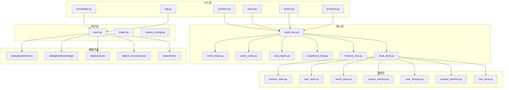
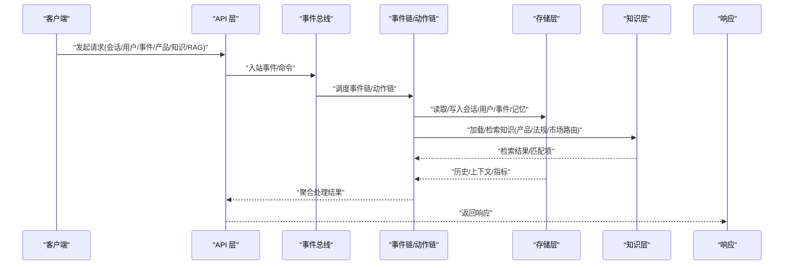
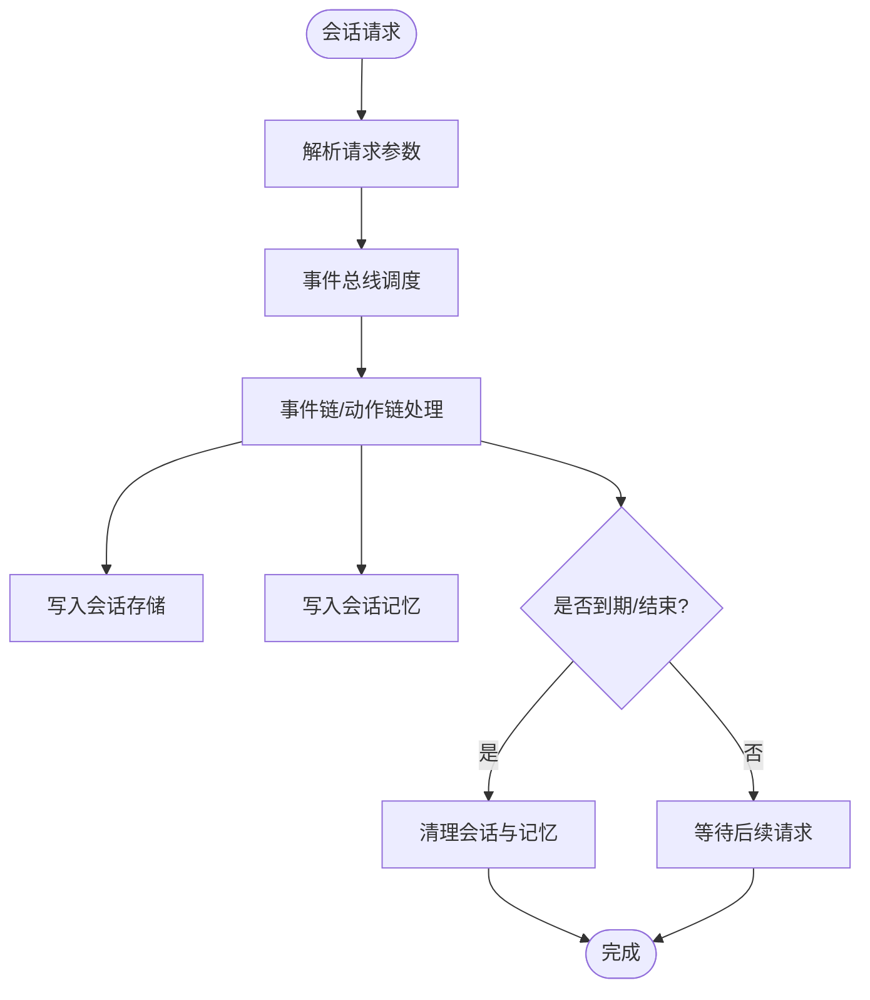
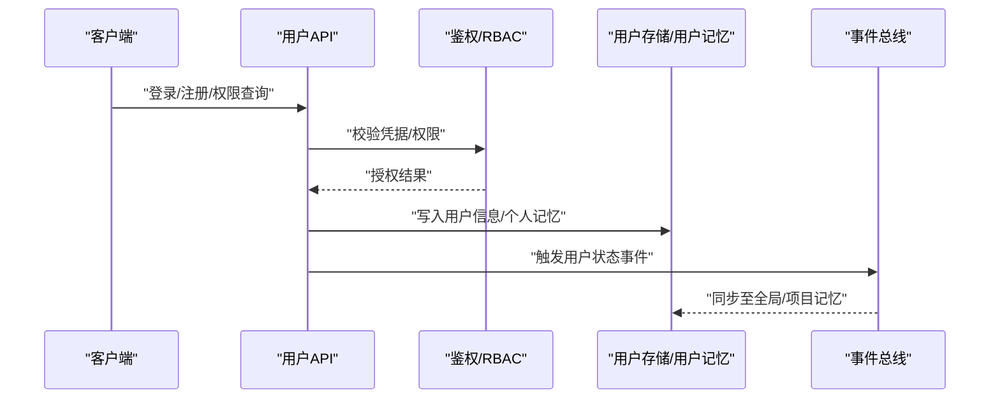
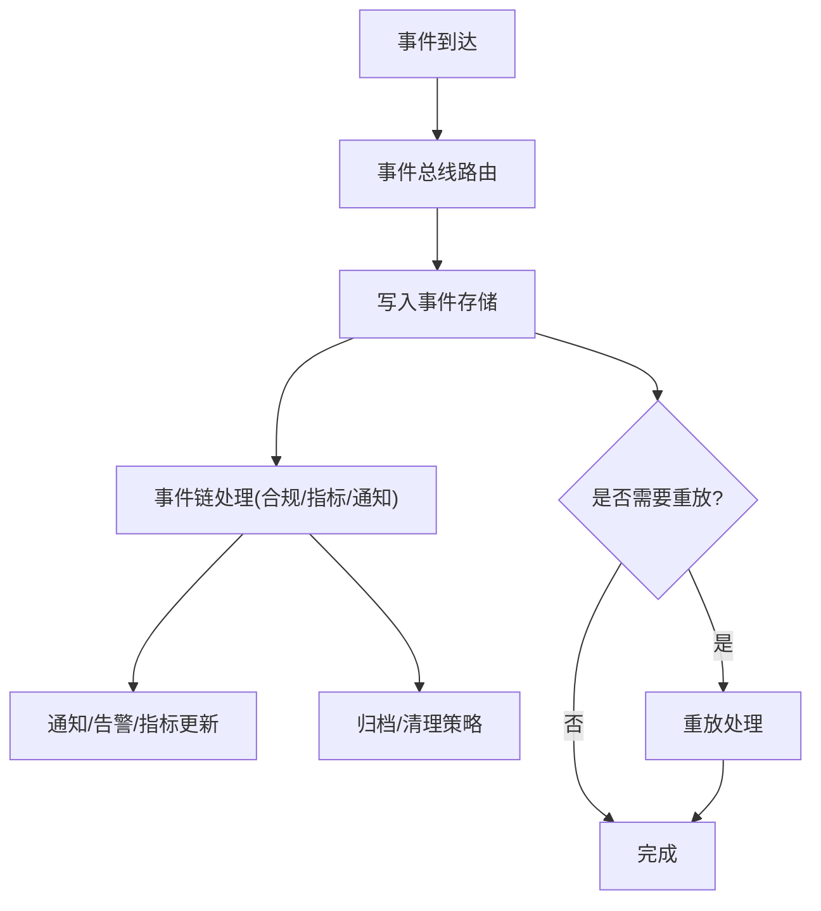
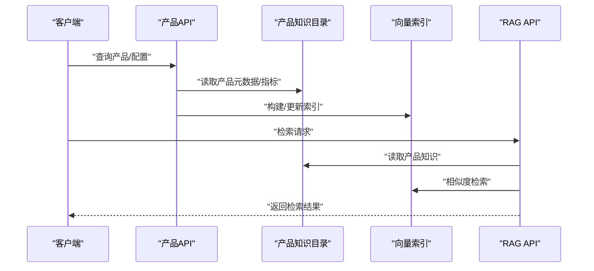
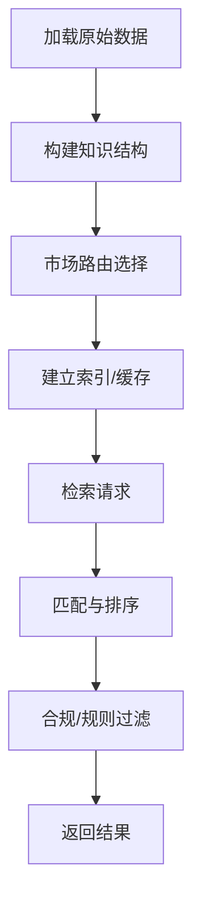
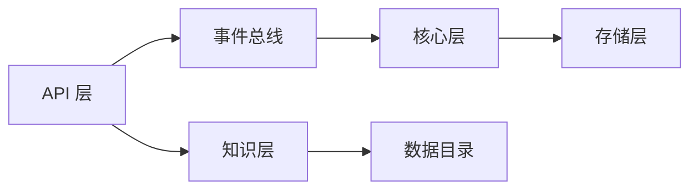

# 数据流设计

<cite>
**本文引用的文件**
- [backend/app/main.py](file://backend/app/main.py)
- [backend/app/models/database.py](file://backend/app/models/database.py)
- [backend/app/models/schemas.py](file://backend/app/models/schemas.py)
- [backend/app/storage/session_store.py](file://backend/app/storage/session_store.py)
- [backend/app/storage/user_store.py](file://backend/app/storage/user_store.py)
- [backend/app/storage/event_store.py](file://backend/app/storage/event_store.py)
- [backend/app/storage/project_memory.py](file://backend/app/storage/project_memory.py)
- [backend/app/storage/user_memory.py](file://backend/app/storage/user_memory.py)
- [backend/app/storage/session_memory.py](file://backend/app/storage/session_memory.py)
- [backend/app/storage/raw_store.py](file://backend/app/storage/raw_store.py)
- [backend/app/knowledge/store.py](file://backend/app/knowledge/store.py)
- [backend/app/knowledge/loader.py](file://backend/app/knowledge/loader.py)
- [backend/app/knowledge/market_routing.py](file://backend/app/knowledge/market_routing.py)
- [backend/app/api/knowledge.py](file://backend/app/api/knowledge.py)
- [backend/app/api/sessions.py](file://backend/app/api/sessions.py)
- [backend/app/api/users.py](file://backend/app/api/users.py)
- [backend/app/api/events.py](file://backend/app/api/events.py)
- [backend/app/api/products.py](file://backend/app/api/products.py)
- [backend/app/api/rag.py](file://backend/app/api/rag.py)
- [backend/app/core/local_store.py](file://backend/app/core/local_store.py)
- [backend/app/core/memory_tree.py](file://backend/app/core/memory_tree.py)
- [backend/app/core/rule_engine.py](file://backend/app/core/rule_engine.py)
- [backend/app/core/compliance_flow.py](file://backend/app/core/compliance_flow.py)
- [backend/app/core/event_bus.py](file://backend/app/core/event_bus.py)
- [backend/app/core/event_chain.py](file://backend/app/core/event_chain.py)
- [backend/app/core/action_chain.py](file://backend/app/core/action_chain.py)
- [backend/app/services/compliance.py](file://backend/app/services/compliance.py)
- [backend/data/global/memory/global_memory.json](file://backend/data/global/memory/global_memory.json)
- [backend/data/global/knowledge](file://backend/data/global/knowledge)
- [backend/data/products](file://backend/data/products)
- [backend/data/nl_store/products](file://backend/data/nl_store/products)
- [backend/data/chroma](file://backend/data/chroma)
- [backend/scripts/init_knowledge.py](file://backend/scripts/init_knowledge.py)
- [backend/scripts/migrate_storage.py](file://backend/scripts/migrate_storage.py)
- [backend/scripts/fetch_regulations.py](file://backend/scripts/fetch_regulations.py)
- [backend/requirements.txt](file://backend/requirements.txt)
</cite>

## 目录
1. [简介](#简介)
2. [项目结构](#项目结构)
3. [核心组件](#核心组件)
4. [架构总览](#架构总览)
5. [详细组件分析](#详细组件分析)
6. [依赖关系分析](#依赖关系分析)
7. [性能考虑](#性能考虑)
8. [故障排查指南](#故障排查指南)
9. [结论](#结论)
10. [附录](#附录)

## 简介
本设计文档聚焦避风港平台的数据流与处理流程，覆盖从用户请求进入、数据存储、知识检索到结果返回的完整链路。文档还阐述了会话数据、用户数据、产品数据与知识数据的存储策略，数据一致性保障（事务、并发与同步）、缓存与性能优化、安全与隐私保护，以及数据迁移、备份与灾难恢复的实施方案。

## 项目结构
后端采用分层架构：API 层负责对外接口与路由；核心层承载业务编排、规则引擎、事件总线与链式处理；存储层负责本地与持久化数据的读写；知识层负责法规与产品知识的加载与检索；服务层封装合规与外部系统对接。

**图表来源**
- [backend/app/api/sessions.py](file://backend/app/api/sessions.py)
- [backend/app/api/users.py](file://backend/app/api/users.py)
- [backend/app/api/events.py](file://backend/app/api/events.py)
- [backend/app/api/products.py](file://backend/app/api/products.py)
- [backend/app/api/knowledge.py](file://backend/app/api/knowledge.py)
- [backend/app/api/rag.py](file://backend/app/api/rag.py)
- [backend/app/core/event_bus.py](file://backend/app/core/event_bus.py)
- [backend/app/core/event_chain.py](file://backend/app/core/event_chain.py)
- [backend/app/core/action_chain.py](file://backend/app/core/action_chain.py)
- [backend/app/core/rule_engine.py](file://backend/app/core/rule_engine.py)
- [backend/app/core/compliance_flow.py](file://backend/app/core/compliance_flow.py)
- [backend/app/core/memory_tree.py](file://backend/app/core/memory_tree.py)
- [backend/app/core/local_store.py](file://backend/app/core/local_store.py)
- [backend/app/storage/session_store.py](file://backend/app/storage/session_store.py)
- [backend/app/storage/user_store.py](file://backend/app/storage/user_store.py)
- [backend/app/storage/event_store.py](file://backend/app/storage/event_store.py)
- [backend/app/storage/project_memory.py](file://backend/app/storage/project_memory.py)
- [backend/app/storage/user_memory.py](file://backend/app/storage/user_memory.py)
- [backend/app/storage/session_memory.py](file://backend/app/storage/session_memory.py)
- [backend/app/storage/raw_store.py](file://backend/app/storage/raw_store.py)
- [backend/app/knowledge/store.py](file://backend/app/knowledge/store.py)
- [backend/app/knowledge/loader.py](file://backend/app/knowledge/loader.py)
- [backend/app/knowledge/market_routing.py](file://backend/app/knowledge/market_routing.py)
- [backend/data/global/memory/global_memory.json](file://backend/data/global/memory/global_memory.json)
- [backend/data/global/knowledge](file://backend/data/global/knowledge)
- [backend/data/products](file://backend/data/products)
- [backend/data/nl_store/products](file://backend/data/nl_store/products)
- [backend/data/chroma](file://backend/data/chroma)

**章节来源**
- [backend/app/main.py](file://backend/app/main.py)
- [backend/app/models/database.py](file://backend/app/models/database.py)
- [backend/app/models/schemas.py](file://backend/app/models/schemas.py)

## 核心组件
- API 层：提供会话、用户、事件、产品、知识与 RAG 的对外接口，统一入口与参数校验。
- 核心层：事件总线驱动事件链与动作链，规则引擎与合规流程保障业务规则与合规检查，内存树与本地存储支撑全局与项目级记忆。
- 存储层：会话、用户、事件、项目/用户/会话记忆、原始数据等多类存储，支持本地 JSON 与向量化索引。
- 知识层：知识库加载、市场路由与检索，结合产品数据与法规数据形成可检索的知识图谱。

**章节来源**
- [backend/app/api/sessions.py](file://backend/app/api/sessions.py)
- [backend/app/api/users.py](file://backend/app/api/users.py)
- [backend/app/api/events.py](file://backend/app/api/events.py)
- [backend/app/api/products.py](file://backend/app/api/products.py)
- [backend/app/api/knowledge.py](file://backend/app/api/knowledge.py)
- [backend/app/api/rag.py](file://backend/app/api/rag.py)
- [backend/app/core/event_bus.py](file://backend/app/core/event_bus.py)
- [backend/app/core/event_chain.py](file://backend/app/core/event_chain.py)
- [backend/app/core/action_chain.py](file://backend/app/core/action_chain.py)
- [backend/app/core/rule_engine.py](file://backend/app/core/rule_engine.py)
- [backend/app/core/compliance_flow.py](file://backend/app/core/compliance_flow.py)
- [backend/app/core/memory_tree.py](file://backend/app/core/memory_tree.py)
- [backend/app/core/local_store.py](file://backend/app/core/local_store.py)
- [backend/app/storage/session_store.py](file://backend/app/storage/session_store.py)
- [backend/app/storage/user_store.py](file://backend/app/storage/user_store.py)
- [backend/app/storage/event_store.py](file://backend/app/storage/event_store.py)
- [backend/app/storage/project_memory.py](file://backend/app/storage/project_memory.py)
- [backend/app/storage/user_memory.py](file://backend/app/storage/user_memory.py)
- [backend/app/storage/session_memory.py](file://backend/app/storage/session_memory.py)
- [backend/app/storage/raw_store.py](file://backend/app/storage/raw_store.py)
- [backend/app/knowledge/store.py](file://backend/app/knowledge/store.py)
- [backend/app/knowledge/loader.py](file://backend/app/knowledge/loader.py)
- [backend/app/knowledge/market_routing.py](file://backend/app/knowledge/market_routing.py)

## 架构总览
下图展示从客户端请求到知识检索再到结果返回的端到端数据流：

**图表来源**
- [backend/app/api/sessions.py](file://backend/app/api/sessions.py)
- [backend/app/api/users.py](file://backend/app/api/users.py)
- [backend/app/api/events.py](file://backend/app/api/events.py)
- [backend/app/api/products.py](file://backend/app/api/products.py)
- [backend/app/api/knowledge.py](file://backend/app/api/knowledge.py)
- [backend/app/api/rag.py](file://backend/app/api/rag.py)
- [backend/app/core/event_bus.py](file://backend/app/core/event_bus.py)
- [backend/app/core/event_chain.py](file://backend/app/core/event_chain.py)
- [backend/app/core/action_chain.py](file://backend/app/core/action_chain.py)
- [backend/app/storage/session_store.py](file://backend/app/storage/session_store.py)
- [backend/app/storage/user_store.py](file://backend/app/storage/user_store.py)
- [backend/app/storage/event_store.py](file://backend/app/storage/event_store.py)
- [backend/app/knowledge/store.py](file://backend/app/knowledge/store.py)

## 详细组件分析

### 会话数据流（会话创建、上下文维护与清理）
- 入口：会话 API 接收创建与查询请求。
- 事件编排：事件总线接收请求，触发事件链或动作链以解析与路由。
- 存储：会话状态与上下文写入会话存储与会话记忆，支持按会话 ID 快速检索。
- 清理：基于生命周期策略与事件链触发清理任务，释放内存与磁盘占用。

**图表来源**
- [backend/app/api/sessions.py](file://backend/app/api/sessions.py)
- [backend/app/core/event_bus.py](file://backend/app/core/event_bus.py)
- [backend/app/core/event_chain.py](file://backend/app/core/event_chain.py)
- [backend/app/storage/session_store.py](file://backend/app/storage/session_store.py)
- [backend/app/storage/session_memory.py](file://backend/app/storage/session_memory.py)

**章节来源**
- [backend/app/api/sessions.py](file://backend/app/api/sessions.py)
- [backend/app/storage/session_store.py](file://backend/app/storage/session_store.py)
- [backend/app/storage/session_memory.py](file://backend/app/storage/session_memory.py)
- [backend/app/core/event_bus.py](file://backend/app/core/event_bus.py)
- [backend/app/core/event_chain.py](file://backend/app/core/event_chain.py)

### 用户数据流（注册、认证、权限与个人记忆）
- 入口：用户 API 处理注册、登录与权限查询。
- 认证：鉴权中间件与 RBAC 控制访问范围。
- 存储：用户信息写入用户存储，个人记忆写入用户记忆，支持按用户维度检索与隔离。
- 同步：事件链触发用户状态变更同步至全局与项目记忆。

**图表来源**
- [backend/app/api/users.py](file://backend/app/api/users.py)
- [backend/app/storage/user_store.py](file://backend/app/storage/user_store.py)
- [backend/app/storage/user_memory.py](file://backend/app/storage/user_memory.py)
- [backend/app/core/event_bus.py](file://backend/app/core/event_bus.py)

**章节来源**
- [backend/app/api/users.py](file://backend/app/api/users.py)
- [backend/app/storage/user_store.py](file://backend/app/storage/user_store.py)
- [backend/app/storage/user_memory.py](file://backend/app/storage/user_memory.py)
- [backend/app/core/event_bus.py](file://backend/app/core/event_bus.py)

### 事件数据流（事件捕获、路由与持久化）
- 入口：事件 API 接收系统事件与用户行为事件。
- 路由：事件总线根据事件类型与路由规则分发至相应处理器。
- 持久化：事件写入事件存储，并触发事件链进行进一步处理（如合规检查、指标统计）。
- 回放：事件存储支持回放与重试，确保处理幂等与一致性。

**图表来源**
- [backend/app/api/events.py](file://backend/app/api/events.py)
- [backend/app/core/event_bus.py](file://backend/app/core/event_bus.py)
- [backend/app/core/event_chain.py](file://backend/app/core/event_chain.py)
- [backend/app/storage/event_store.py](file://backend/app/storage/event_store.py)

**章节来源**
- [backend/app/api/events.py](file://backend/app/api/events.py)
- [backend/app/storage/event_store.py](file://backend/app/storage/event_store.py)
- [backend/app/core/event_bus.py](file://backend/app/core/event_bus.py)
- [backend/app/core/event_chain.py](file://backend/app/core/event_chain.py)

### 产品数据流（产品配置、知识索引与检索）
- 入口：产品 API 提供产品查询与配置。
- 索引：产品数据写入产品知识目录与向量索引（Chroma），支持多市场维度检索。
- 检索：RAG API 结合产品知识与用户输入生成检索候选，返回结构化结果。

**图表来源**
- [backend/app/api/products.py](file://backend/app/api/products.py)
- [backend/app/api/rag.py](file://backend/app/api/rag.py)
- [backend/data/products](file://backend/data/products)
- [backend/data/chroma](file://backend/data/chroma)

**章节来源**
- [backend/app/api/products.py](file://backend/app/api/products.py)
- [backend/app/api/rag.py](file://backend/app/api/rag.py)
- [backend/data/products](file://backend/data/products)
- [backend/data/chroma](file://backend/data/chroma)

### 知识数据流（法规、产品与市场路由）
- 加载：知识加载器从原始数据目录加载法规与产品数据，构建知识结构。
- 路由：市场路由根据目标市场选择对应知识集合。
- 检索：知识存储支持全文与向量检索，结合规则引擎与合规流程输出受控结果。

**图表来源**
- [backend/app/knowledge/loader.py](file://backend/app/knowledge/loader.py)
- [backend/app/knowledge/market_routing.py](file://backend/app/knowledge/market_routing.py)
- [backend/app/knowledge/store.py](file://backend/app/knowledge/store.py)
- [backend/data/raw/regulations](file://backend/data/raw/regulations)
- [backend/data/raw/certifications](file://backend/data/raw/certifications)
- [backend/data/raw/hs_codes](file://backend/data/raw/hs_codes)
- [backend/data/raw/vat_rates](file://backend/data/raw/vat_rates)

**章节来源**
- [backend/app/knowledge/loader.py](file://backend/app/knowledge/loader.py)
- [backend/app/knowledge/market_routing.py](file://backend/app/knowledge/market_routing.py)
- [backend/app/knowledge/store.py](file://backend/app/knowledge/store.py)
- [backend/data/raw/regulations](file://backend/data/raw/regulations)
- [backend/data/raw/certifications](file://backend/data/raw/certifications)
- [backend/data/raw/hs_codes](file://backend/data/raw/hs_codes)
- [backend/data/raw/vat_rates](file://backend/data/raw/vat_rates)

## 依赖关系分析
- 组件耦合：API 层通过事件总线与核心层解耦；存储层通过统一接口被核心层调用；知识层独立于业务逻辑但被 API 与核心层共同消费。
- 外部依赖：Chroma 向量数据库、本地 JSON 文件系统、脚本化初始化与迁移工具。
- 循环依赖：未见直接循环导入；事件链与动作链通过事件总线间接协作，避免强耦合。

**图表来源**
- [backend/app/api/knowledge.py](file://backend/app/api/knowledge.py)
- [backend/app/core/event_bus.py](file://backend/app/core/event_bus.py)
- [backend/app/core/local_store.py](file://backend/app/core/local_store.py)
- [backend/app/knowledge/store.py](file://backend/app/knowledge/store.py)
- [backend/data/global/memory/global_memory.json](file://backend/data/global/memory/global_memory.json)

**章节来源**
- [backend/app/api/knowledge.py](file://backend/app/api/knowledge.py)
- [backend/app/core/event_bus.py](file://backend/app/core/event_bus.py)
- [backend/app/core/local_store.py](file://backend/app/core/local_store.py)
- [backend/app/knowledge/store.py](file://backend/app/knowledge/store.py)

## 性能考虑
- 缓存策略
  - 内存缓存：全局与项目记忆、用户/会话记忆作为热点数据驻留，减少磁盘 IO。
  - 向量索引：Chroma 索引加速相似度检索；定期重建索引以平衡写入与查询性能。
  - 本地存储：JSON 文件快速读写，适合小规模配置与临时数据。
- 并发与事务
  - 事件总线与链式处理采用异步与幂等设计，避免阻塞。
  - 对关键写操作使用原子性与版本号控制，确保并发一致性。
- 索引优化
  - 产品与知识数据按市场/品类维度分区索引，降低查询范围。
  - 使用倒排与向量混合检索，提升召回与精度。
- I/O 优化
  - 批量写入与延迟刷新，合并频繁小写操作。
  - 读写分离：热数据驻内存，冷数据落盘或压缩存储。

[本节为通用性能建议，不直接分析具体文件]

## 故障排查指南
- 事件丢失/重复
  - 检查事件存储与事件链配置，确认事件 ID 唯一性与去重策略。
  - 使用事件总线的回放能力定位异常时间窗。
- 知识检索异常
  - 校验知识加载器与市场路由配置，确认索引完整性。
  - 检查 Chroma 连接与索引重建脚本执行情况。
- 会话/用户数据不一致
  - 核对会话与用户存储的写入路径，确认事件链同步是否成功。
  - 查看全局与项目记忆的最后更新时间戳。
- RAG 结果偏差
  - 审核检索候选数量与过滤规则，调整相似度阈值与排序权重。

**章节来源**
- [backend/app/storage/event_store.py](file://backend/app/storage/event_store.py)
- [backend/app/core/event_chain.py](file://backend/app/core/event_chain.py)
- [backend/app/knowledge/store.py](file://backend/app/knowledge/store.py)
- [backend/data/chroma](file://backend/data/chroma)
- [backend/app/storage/session_store.py](file://backend/app/storage/session_store.py)
- [backend/app/storage/user_store.py](file://backend/app/storage/user_store.py)
- [backend/data/global/memory/global_memory.json](file://backend/data/global/memory/global_memory.json)

## 结论
避风港平台通过“API-事件总线-链式处理-存储-知识”的分层架构实现了高内聚、低耦合的数据流。会话、用户、事件、产品与知识数据分别采用本地 JSON、向量索引与目录化组织，配合事件驱动与幂等处理，达成一致性的业务闭环。未来可在索引分片、增量更新与跨集群复制方面进一步增强可扩展性与可用性。

## 附录

### 数据一致性保障机制
- 事务与并发
  - 关键写操作采用原子提交与版本控制，避免竞态条件。
  - 事件链与动作链具备重试与幂等语义，确保最终一致。
- 数据同步
  - 事件总线负责跨模块同步，事件存储作为事实源。
  - 全局/项目/用户/会话记忆作为一致性视图，定期校验与修复。
- 规则与合规
  - 规则引擎与合规流程在检索与返回前进行过滤与校验。

**章节来源**
- [backend/app/core/event_bus.py](file://backend/app/core/event_bus.py)
- [backend/app/core/event_chain.py](file://backend/app/core/event_chain.py)
- [backend/app/core/action_chain.py](file://backend/app/core/action_chain.py)
- [backend/app/core/rule_engine.py](file://backend/app/core/rule_engine.py)
- [backend/app/core/compliance_flow.py](file://backend/app/core/compliance_flow.py)

### 数据缓存与性能优化
- 内存缓存：全局与项目记忆、用户/会话记忆优先驻留。
- 向量索引：Chroma 索引与本地 JSON 双通道，按场景切换。
- 索引优化：按市场/品类分区，混合检索，动态阈值与权重。
- I/O 优化：批量写入、延迟刷新、读写分离。

**章节来源**
- [backend/app/core/local_store.py](file://backend/app/core/local_store.py)
- [backend/app/storage/session_memory.py](file://backend/app/storage/session_memory.py)
- [backend/app/storage/user_memory.py](file://backend/app/storage/user_memory.py)
- [backend/data/chroma](file://backend/data/chroma)

### 数据安全与隐私保护
- 访问控制：RBAC 与鉴权中间件限制资源访问。
- 数据最小化：仅收集必要会话与用户数据，设置生命周期策略。
- 加密与脱敏：传输与静态数据加密，敏感字段脱敏存储。
- 审计日志：事件总线记录关键操作，支持追踪与回溯。

**章节来源**
- [backend/app/api/users.py](file://backend/app/api/users.py)
- [backend/app/core/event_bus.py](file://backend/app/core/event_bus.py)

### 数据迁移、备份与灾难恢复
- 迁移脚本：提供知识初始化与存储迁移脚本，支持版本升级。
- 备份策略：定期导出事件存储与知识索引，保留快照。
- 恢复流程：事件回放与索引重建，逐步恢复服务。

**章节来源**
- [backend/scripts/init_knowledge.py](file://backend/scripts/init_knowledge.py)
- [backend/scripts/migrate_storage.py](file://backend/scripts/migrate_storage.py)
- [backend/scripts/fetch_regulations.py](file://backend/scripts/fetch_regulations.py)