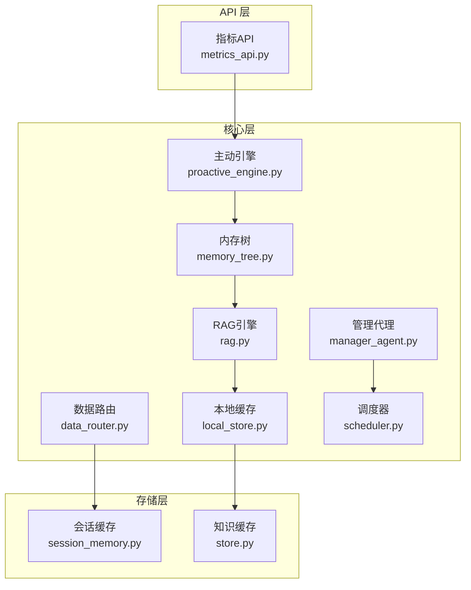
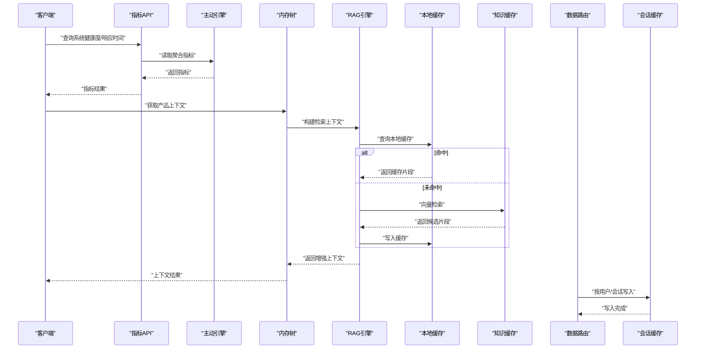
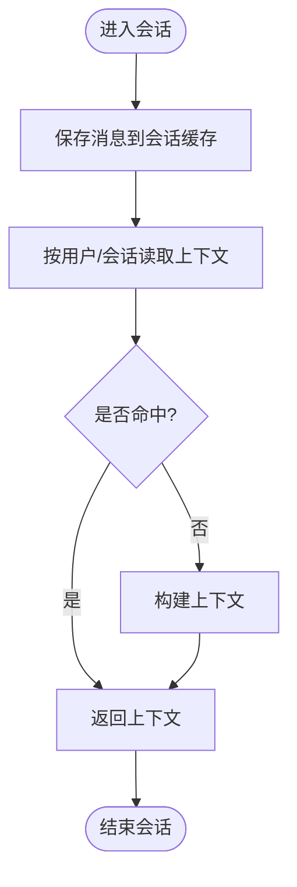
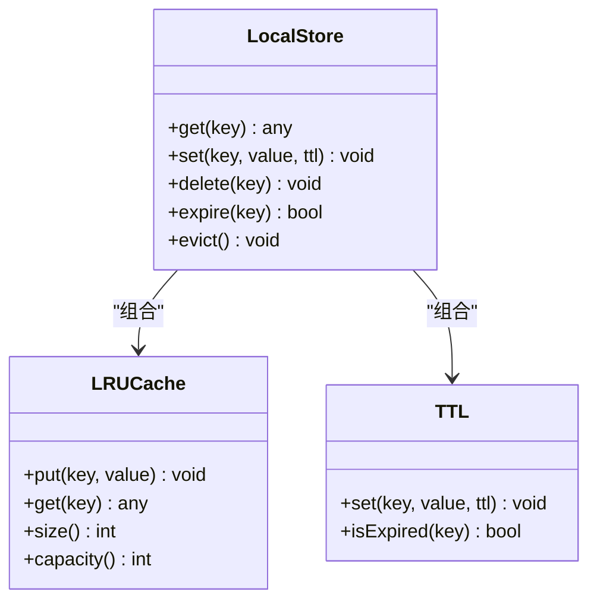
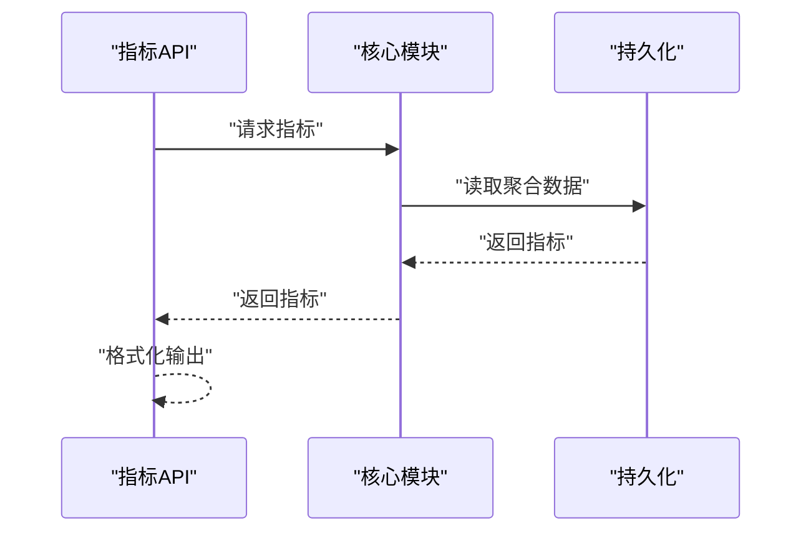
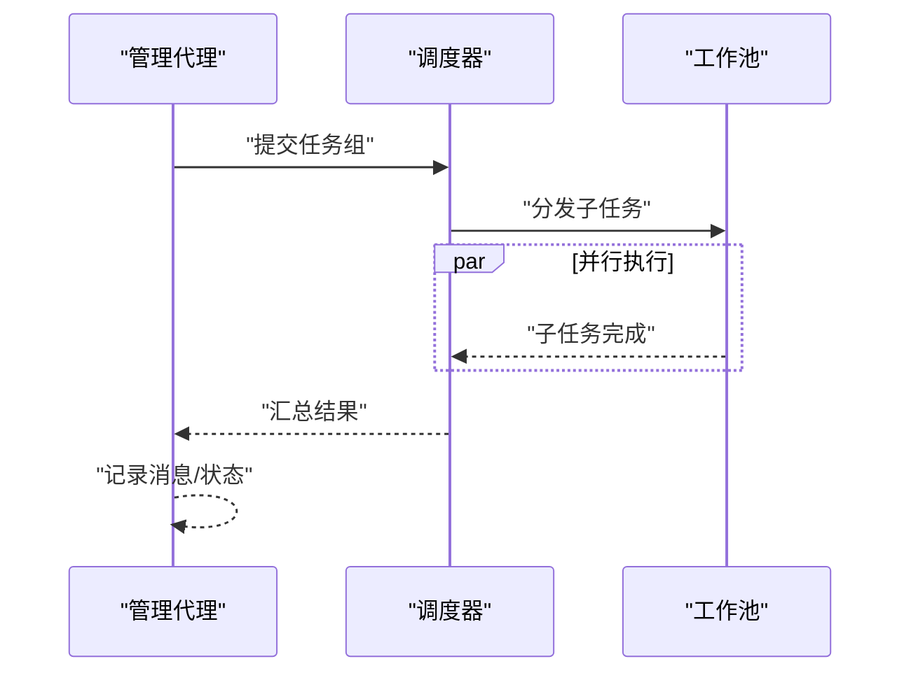
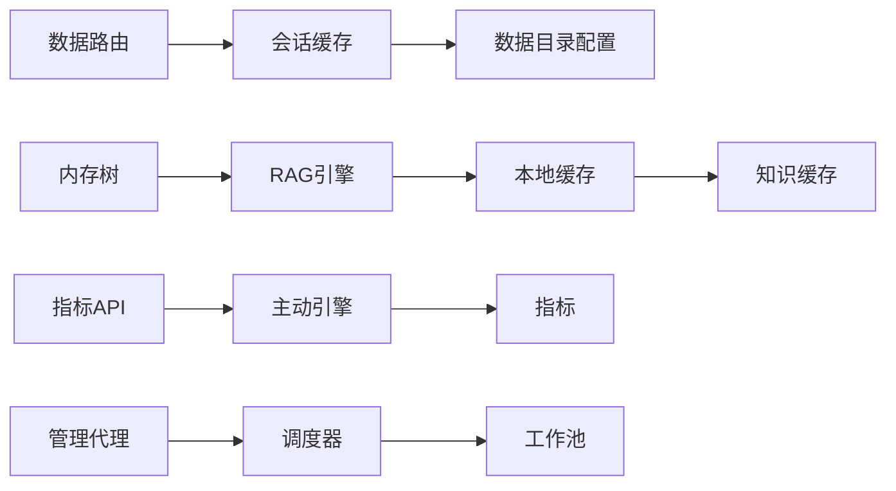

# 缓存策略与性能优化

<cite>
**本文引用的文件**
- [session_memory.py](file://backend/app/storage/session_memory.py)
- [memory_tree.py](file://backend/app/core/memory_tree.py)
- [store.py](file://backend/app/knowledge/store.py)
- [local_store.py](file://backend/app/core/local_store.py)
- [metrics.py](file://backend/app/core/metrics.py)
- [metrics_api.py](file://backend/app/api/metrics.py)
- [rag.py](file://backend/app/core/rag.py)
- [data_router.py](file://backend/app/core/data_router.py)
- [manager_agent.py](file://backend/app/core/manager_agent.py)
- [proactive_engine.py](file://backend/app/core/proactive_engine.py)
- [worker_registry.py](file://backend/app/core/worker_registry.py)
- [scheduler.py](file://backend/app/core/scheduler.py)
- [main.py](file://backend/app/main.py)
</cite>

## 目录
1. [引言](#引言)
2. [项目结构](#项目结构)
3. [核心组件](#核心组件)
4. [架构总览](#架构总览)
5. [详细组件分析](#详细组件分析)
6. [依赖关系分析](#依赖关系分析)
7. [性能考量](#性能考量)
8. [故障排查指南](#故障排查指南)
9. [结论](#结论)
10. [附录](#附录)

## 引言
本文件面向避风港平台的缓存策略与性能优化，系统性梳理内存缓存、会话缓存与知识缓存的设计与实现，阐明 LRU 缓存、TTL 过期与缓存失效策略，并给出性能监控、调优方法、大规模数据处理的批量化与异步化实践、缓存一致性维护（预热、穿透防护、雪崩预防）、性能测试与基准测试方法，以及常见问题的诊断与解决路径。

## 项目结构
平台后端采用分层架构：API 层负责对外接口与指标暴露；核心层承载业务编排、内存树、RAG、调度与工作流；存储层负责会话、用户、项目等多层级持久化；知识层负责向量检索与召回；监控层提供指标采集与聚合。

图表来源
- [metrics_api.py](file://backend/app/api/metrics.py)
- [memory_tree.py](file://backend/app/core/memory_tree.py)
- [rag.py](file://backend/app/core/rag.py)
- [local_store.py](file://backend/app/core/local_store.py)
- [data_router.py](file://backend/app/core/data_router.py)
- [proactive_engine.py](file://backend/app/core/proactive_engine.py)
- [manager_agent.py](file://backend/app/core/manager_agent.py)
- [scheduler.py](file://backend/app/core/scheduler.py)
- [session_memory.py](file://backend/app/storage/session_memory.py)
- [store.py](file://backend/app/knowledge/store.py)

章节来源
- [main.py](file://backend/app/main.py)

## 核心组件
- 会话缓存（SessionMemory）：按用户/会话隔离，不内置 TTL，由业务层控制生命周期，适合多轮对话上下文的短期缓存。
- 内存树（MemoryTree）：组织全局与产品级上下文，支持快速检索与增量更新，是 RAG 与规则引擎的上下文基础。
- 本地缓存（LocalStore）：面向高频读取的键值缓存，结合 LRU 与 TTL 策略，降低数据库与向量库压力。
- 知识缓存（Knowledge Store）：向量检索与语义召回的缓存层，支撑 RAG 的低延迟响应。
- 指标体系（Metrics/Metrics API）：提供系统健康度、响应时间、吞吐等关键指标，支撑性能监控与告警。
- 数据路由（DataRouter）：根据事件类型选择写入与读取的存储层，提升热点数据的就近访问效率。
- 主动引擎（Proactive Engine）：周期性聚合指标并持久化，形成全局视图，辅助容量规划与性能调优。
- 管理代理（Manager Agent）：并行执行子任务，结合异步与资源池管理，提高吞吐与稳定性。

章节来源
- [session_memory.py](file://backend/app/storage/session_memory.py)
- [memory_tree.py](file://backend/app/core/memory_tree.py)
- [local_store.py](file://backend/app/core/local_store.py)
- [store.py](file://backend/app/knowledge/store.py)
- [metrics.py](file://backend/app/core/metrics.py)
- [metrics_api.py](file://backend/app/api/metrics.py)
- [rag.py](file://backend/app/core/rag.py)
- [data_router.py](file://backend/app/core/data_router.py)
- [proactive_engine.py](file://backend/app/core/proactive_engine.py)
- [manager_agent.py](file://backend/app/core/manager_agent.py)

## 架构总览
下图展示缓存与性能优化相关的主干流程：会话缓存负责短期对话上下文；本地缓存与知识缓存共同支撑 RAG；指标体系与主动引擎提供可观测性；数据路由与管理代理保障高并发下的稳定性与一致性。

图表来源
- [metrics_api.py](file://backend/app/api/metrics.py)
- [proactive_engine.py](file://backend/app/core/proactive_engine.py)
- [memory_tree.py](file://backend/app/core/memory_tree.py)
- [rag.py](file://backend/app/core/rag.py)
- [local_store.py](file://backend/app/core/local_store.py)
- [store.py](file://backend/app/knowledge/store.py)
- [data_router.py](file://backend/app/core/data_router.py)
- [session_memory.py](file://backend/app/storage/session_memory.py)

## 详细组件分析

### 会话缓存（SessionMemory）
- 设计目标：维护多轮对话上下文，按用户/会话隔离，避免跨会话污染。
- 生命周期：不内置 TTL，由业务层决定何时清理，适合短期对话场景。
- 存储形态：以 JSON 文件按用户/会话目录组织，路径结构清晰，便于运维与审计。
- 性能特征：小文件随机读写，适合 SSD；大并发下需注意文件句柄与锁竞争。

图表来源
- [session_memory.py](file://backend/app/storage/session_memory.py)

章节来源
- [session_memory.py](file://backend/app/storage/session_memory.py)

### 内存树（MemoryTree）
- 设计目标：组织全局与产品级上下文，支持快速检索与增量更新。
- 关键能力：上下文分层、增量合并、快速查询，作为 RAG 与规则引擎的统一上下文源。
- 性能特征：内存结构，读写高效；需配合本地缓存与 TTL 控制内存占用。

章节来源
- [memory_tree.py](file://backend/app/core/memory_tree.py)

### 本地缓存（LocalStore）
- 设计目标：高频读取的键值缓存，结合 LRU 与 TTL，降低后端压力。
- 策略要点：
  - LRU：淘汰最久未使用的条目，保证热点常驻。
  - TTL：按键设置过期时间，避免陈旧数据影响一致性。
  - 失效策略：写放大时触发批量失效，或基于版本号的条件更新。
- 性能特征：内存命中率高，延迟低；需关注并发安全与内存峰值。

图表来源
- [local_store.py](file://backend/app/core/local_store.py)

章节来源
- [local_store.py](file://backend/app/core/local_store.py)

### 知识缓存（Knowledge Store）
- 设计目标：向量检索与语义召回的缓存层，支撑 RAG 的低延迟响应。
- 策略要点：
  - 片段缓存：对高价值候选片段建立缓存，减少重复向量检索。
  - 预热：启动时加载热门产品/法规片段，降低首屏延迟。
  - 失效：基于版本或时间戳的条件更新，避免脏读。
- 性能特征：向量相似度计算成本高，缓存命中可显著降低延迟。

章节来源
- [store.py](file://backend/app/knowledge/store.py)

### 指标体系与监控（Metrics/Metrics API）
- 指标维度：系统健康度、平均检查响应时间、风险产品占比、认证到期密度等。
- 刷新策略：实时/小时/日级别刷新，满足不同观测需求。
- 可视化与告警：通过 API 暴露指标，结合前端仪表盘与告警策略。

图表来源
- [metrics_api.py](file://backend/app/api/metrics.py)
- [metrics.py](file://backend/app/core/metrics.py)

章节来源
- [metrics.py](file://backend/app/core/metrics.py)
- [metrics_api.py](file://backend/app/api/metrics.py)

### 数据路由（DataRouter）
- 设计目标：根据事件类型自动选择写入与读取的存储层，提升热点数据的就近访问效率。
- 策略要点：热点感知与跨产品洞察，结合定时与事件触发，动态调整路由策略。

章节来源
- [data_router.py](file://backend/app/core/data_router.py)

### 主动引擎（Proactive Engine）
- 设计目标：周期性聚合指标并持久化，形成全局视图，辅助容量规划与性能调优。
- 关键流程：指标采集 → 聚合计算 → 持久化 → 告警触发。

章节来源
- [proactive_engine.py](file://backend/app/core/proactive_engine.py)

### 管理代理与并行执行（Manager Agent）
- 设计目标：并行执行子任务，结合异步与资源池管理，提高吞吐与稳定性。
- 关键流程：任务拆解 → 子任务并行执行 → 结果汇总 → 状态上报。

图表来源
- [manager_agent.py](file://backend/app/core/manager_agent.py)
- [scheduler.py](file://backend/app/core/scheduler.py)
- [worker_registry.py](file://backend/app/core/worker_registry.py)

章节来源
- [manager_agent.py](file://backend/app/core/manager_agent.py)
- [scheduler.py](file://backend/app/core/scheduler.py)
- [worker_registry.py](file://backend/app/core/worker_registry.py)

## 依赖关系分析
- 会话缓存依赖数据目录配置，按用户/会话隔离，避免跨会话污染。
- 内存树为 RAG 提供上下文，RAG 依赖本地缓存与知识缓存提升检索效率。
- 指标体系与主动引擎相互协作，前者提供原始指标，后者进行聚合与持久化。
- 数据路由与管理代理贯穿写入与执行链路，保障高并发下的稳定性与一致性。

图表来源
- [session_memory.py](file://backend/app/storage/session_memory.py)
- [memory_tree.py](file://backend/app/core/memory_tree.py)
- [rag.py](file://backend/app/core/rag.py)
- [local_store.py](file://backend/app/core/local_store.py)
- [store.py](file://backend/app/knowledge/store.py)
- [metrics_api.py](file://backend/app/api/metrics.py)
- [proactive_engine.py](file://backend/app/core/proactive_engine.py)
- [data_router.py](file://backend/app/core/data_router.py)
- [manager_agent.py](file://backend/app/core/manager_agent.py)
- [scheduler.py](file://backend/app/core/scheduler.py)

章节来源
- [session_memory.py](file://backend/app/storage/session_memory.py)
- [memory_tree.py](file://backend/app/core/memory_tree.py)
- [rag.py](file://backend/app/core/rag.py)
- [local_store.py](file://backend/app/core/local_store.py)
- [store.py](file://backend/app/knowledge/store.py)
- [metrics_api.py](file://backend/app/api/metrics.py)
- [proactive_engine.py](file://backend/app/core/proactive_engine.py)
- [data_router.py](file://backend/app/core/data_router.py)
- [manager_agent.py](file://backend/app/core/manager_agent.py)
- [scheduler.py](file://backend/app/core/scheduler.py)

## 性能考量
- 缓存命中率监控
  - 指标：本地缓存命中率、知识缓存命中率、会话缓存命中率。
  - 方法：通过指标 API 采集命中/未命中计数，计算命中率并设定阈值告警。
- 内存使用优化
  - LRU 与 TTL：结合 LRU 淘汰与 TTL 过期，控制内存峰值与陈旧数据。
  - 分层缓存：将短期会话与长期知识分离，分别设置不同的淘汰策略。
- 响应时间优化
  - 预热：启动时加载热门片段，降低首屏延迟。
  - 批量与异步：利用管理代理的并行执行与调度器的任务分发，提升吞吐。
- 大规模数据处理
  - 批量操作：对写入与更新采用批量提交，减少事务开销。
  - 异步处理：将非关键路径异步化，避免阻塞主线程。
  - 资源池管理：合理配置工作池大小与队列长度，防止过载。
- 缓存一致性
  - 缓存预热：启动或热点事件发生时，提前加载热门数据。
  - 缓存穿透防护：对空值设置短 TTL 或布隆过滤器（建议）。
  - 缓存雪崩预防：为 TTL 设置抖动，避免同时过期；限流与熔断保护下游。

## 故障排查指南
- 指标异常
  - 现象：平均检查响应时间升高、健康度下降。
  - 排查：检查主动引擎聚合是否成功、指标持久化是否失败、RAG 与本地缓存命中率是否骤降。
- 会话缓存问题
  - 现象：多轮对话上下文丢失或错乱。
  - 排查：确认用户/会话隔离路径是否正确、文件权限与磁盘空间、业务层清理逻辑是否误删。
- 缓存未命中
  - 现象：知识检索频繁，延迟高。
  - 排查：检查本地缓存容量与 TTL 设置、热点片段是否被及时写回、版本控制是否生效。
- 并发与吞吐
  - 现象：高峰期响应变慢或任务堆积。
  - 排查：查看管理代理并行度、调度器队列长度、工作池资源限制，必要时扩容或限流。

章节来源
- [metrics.py](file://backend/app/core/metrics.py)
- [proactive_engine.py](file://backend/app/core/proactive_engine.py)
- [session_memory.py](file://backend/app/storage/session_memory.py)
- [local_store.py](file://backend/app/core/local_store.py)
- [store.py](file://backend/app/knowledge/store.py)
- [manager_agent.py](file://backend/app/core/manager_agent.py)
- [scheduler.py](file://backend/app/core/scheduler.py)

## 结论
避风港平台通过“会话缓存 + 本地缓存 + 知识缓存”的分层设计，结合 LRU 与 TTL 策略，在保证一致性的同时显著降低了响应延迟。配合指标体系与主动引擎，实现了可观测与自动化调优。未来可在缓存穿透防护、雪崩预防与资源池弹性方面进一步完善，以应对更大规模的数据与并发挑战。

## 附录
- 性能测试与基准测试
  - 场景设计：多轮对话吞吐、RAG 检索延迟、指标聚合耗时、并发任务执行。
  - 工具建议：压测工具、APM 监控、日志分析。
  - 指标基线：命中率、P95/P99 延迟、错误率、资源利用率。
- 诊断清单
  - 缓存命中率是否达标？
  - 是否存在热点不均与内存峰值？
  - 指标采集与持久化是否稳定？
  - 并发执行是否出现阻塞或资源争用？