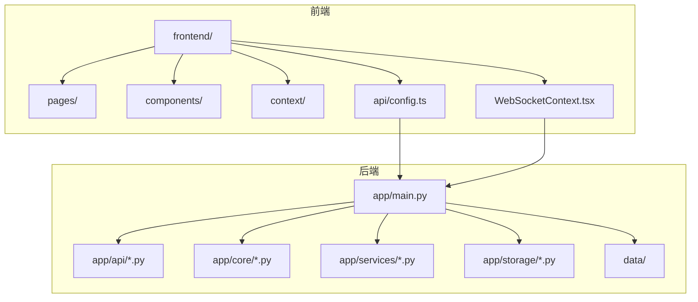
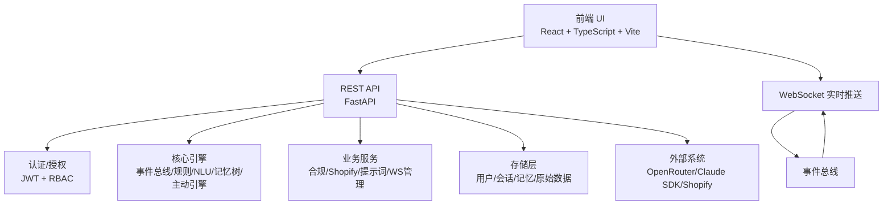
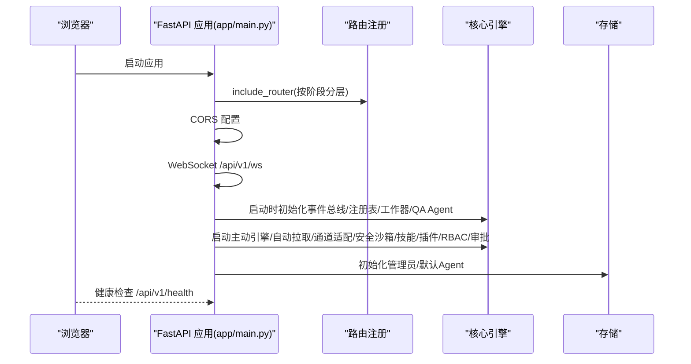
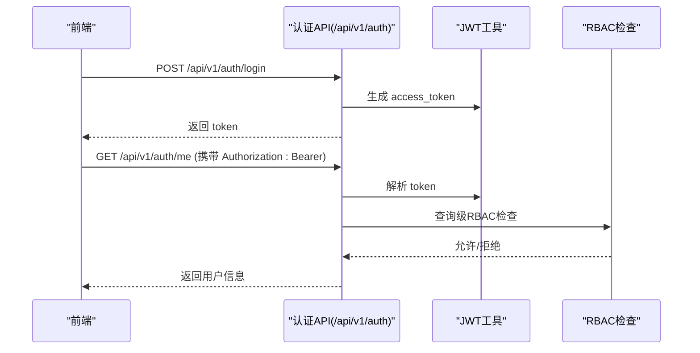
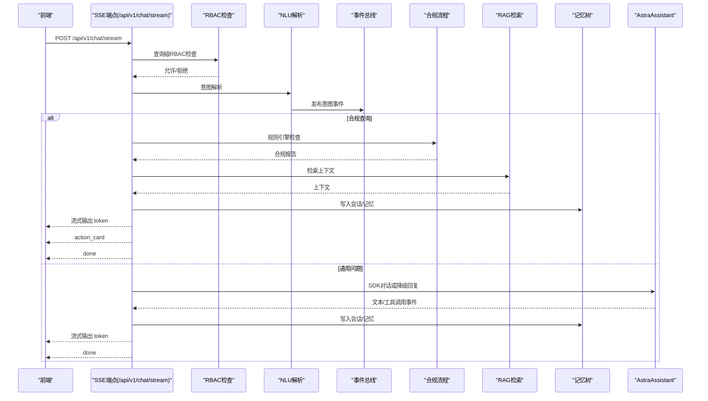
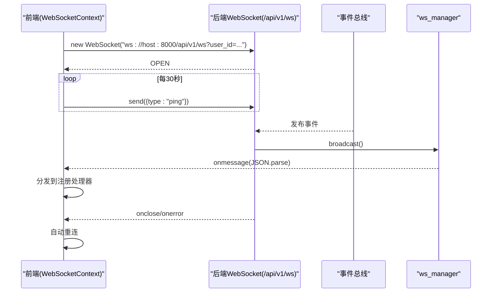
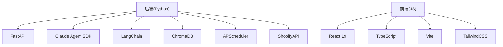

# 整体架构设计

<cite>
**本文引用的文件**
- [README.md](file://README.md)
- [backend/app/main.py](file://backend/app/main.py)
- [backend/app/api/streaming.py](file://backend/app/api/streaming.py)
- [backend/app/api/auth.py](file://backend/app/api/auth.py)
- [backend/app/core/auth.py](file://backend/app/core/auth.py)
- [backend/app/api/admin.py](file://backend/app/api/admin.py)
- [backend/app/api/plugins.py](file://backend/app/api/plugins.py)
- [backend/requirements.txt](file://backend/requirements.txt)
- [frontend/package.json](file://frontend/package.json)
- [frontend/src/api/config.ts](file://frontend/src/api/config.ts)
- [frontend/src/context/WebSocketContext.tsx](file://frontend/src/context/WebSocketContext.tsx)
- [前后端api交互.md](file://前后端api交互.md)
</cite>

## 目录
1. [引言](#引言)
2. [项目结构](#项目结构)
3. [核心组件](#核心组件)
4. [架构总览](#架构总览)
5. [详细组件分析](#详细组件分析)
6. [依赖关系分析](#依赖关系分析)
7. [性能考虑](#性能考虑)
8. [故障排查指南](#故障排查指南)
9. [结论](#结论)
10. [附录](#附录)

## 引言
避风港平台是一个面向中小出海企业的合规智能体平台，采用前后端分离架构，后端基于 Python 3.13+ 与 FastAPI，前端基于 React 18 + TypeScript，结合 Claude Agent SDK、事件总线、多 Agent 协同、规则引擎与 RAG 检索，覆盖产品出海全生命周期的合规需求。本文档系统化阐述分层架构、模块化设计、路由组织、中间件配置、系统边界与外部依赖、集成接口以及性能优化策略。

## 项目结构
- 后端（backend）
  - 应用入口与中间件：FastAPI 应用、CORS、路由注册、生命周期事件、WebSocket 端点
  - API 层：按领域划分的路由模块（认证、对话流式、产品、事件、Agent、技能、插件、知识库、管理等）
  - 核心引擎：事件总线、规则引擎、NLU、记忆树、主动引擎、OAuth 管理、安全沙箱、技能/插件注册表等
  - 服务层：业务服务（合规、Shopify 集成、提示词加载等）
  - 存储层：用户、会话、项目记忆、原始数据等分层存储
  - 数据与配置：运行时数据、配置文件、提示词模板、法规与 HS/VAT 数据
- 前端（frontend）
  - 页面与组件：13 个页面、22 个 UI 组件、布局与侧边栏、通知中心、聊天工作区等
  - 上下文：应用状态、认证上下文、通知上下文、WebSocket 上下文
  - API 客户端：统一的 API 客户端封装，集中处理鉴权头、错误处理与类型安全
  - 构建工具：Vite + TailwindCSS + TypeScript

图表来源
- [backend/app/main.py:1-215](file://backend/app/main.py#L1-L215)
- [frontend/src/api/config.ts:1-635](file://frontend/src/api/config.ts#L1-L635)
- [frontend/src/context/WebSocketContext.tsx:1-131](file://frontend/src/context/WebSocketContext.tsx#L1-L131)

章节来源
- [README.md:37-64](file://README.md#L37-L64)
- [backend/app/main.py:40-104](file://backend/app/main.py#L40-L104)
- [frontend/package.json:1-28](file://frontend/package.json#L1-L28)

## 核心组件
- 后端入口与中间件
  - FastAPI 应用实例、CORS 配置、路由注册（按阶段分层）、WebSocket 端点、启动/关闭生命周期
- API 层
  - 认证、对话流式（SSE）、产品、事件、Agent、技能、插件、知识库、管理（RBAC/审批/配置）、定时任务、模型配置等
- 核心引擎
  - 事件总线、规则引擎、NLU、记忆树、主动引擎、OAuth 管理、安全沙箱、技能/插件注册表、任务分解器、QA Agent、调度器等
- 服务层
  - 合规服务、Shopify 集成、提示词加载、WebSocket 管理器等
- 存储层
  - 用户、会话、项目/用户记忆、原始数据、事件与配置存储
- 前端
  - 页面与组件、上下文、API 客户端、WebSocket 上下文、类型定义

章节来源
- [backend/app/main.py:40-215](file://backend/app/main.py#L40-L215)
- [backend/app/api/streaming.py:1-744](file://backend/app/api/streaming.py#L1-L744)
- [backend/app/api/auth.py:1-108](file://backend/app/api/auth.py#L1-L108)
- [frontend/src/api/config.ts:1-635](file://frontend/src/api/config.ts#L1-L635)
- [frontend/src/context/WebSocketContext.tsx:1-131](file://frontend/src/context/WebSocketContext.tsx#L1-L131)

## 架构总览
避风港采用分层架构与事件驱动模式：
- 表现层（前端 React SPA）
  - 页面与组件负责用户交互；API 客户端统一发起 REST 请求；WebSocket 上下文负责实时推送
- 业务逻辑层（FastAPI 后端）
  - API 路由作为门面，依赖注入到核心引擎与服务层；认证中间件与依赖注入保障安全与上下文
- 数据访问层（存储与外部系统）
  - SQLite/ChromaDB 本地存储；Shopify API 集成；Claude Agent SDK 与模型路由
- 外部依赖与集成
  - OpenRouter 模型路由；Anthropic Claude Agent SDK；APScheduler 定时任务；事件总线与工作流

图表来源
- [backend/app/main.py:40-104](file://backend/app/main.py#L40-L104)
- [backend/app/api/streaming.py:171-266](file://backend/app/api/streaming.py#L171-L266)
- [frontend/src/context/WebSocketContext.tsx:31-125](file://frontend/src/context/WebSocketContext.tsx#L31-L125)

## 详细组件分析

### 后端入口与中间件（FastAPI）
- 应用实例与标题/描述/版本
- CORS 配置允许前端开发端口
- 路由注册（按阶段分层：原有路由、OS级智能体、Phase 2、Phase 3、Phase 3.5、定时任务、模型配置、Phase 4 管理）
- WebSocket 端点：/api/v1/ws，支持心跳与自动重连
- 生命周期：启动时预加载 SDK、启动调度器、初始化管理员与默认 Agent、初始化事件总线/注册表/工作器/QA Agent、主动引擎、OAuth/自动拉取/通道适配/安全沙箱/技能/插件/RBAC/审批/操作守卫；关闭时停止调度器与自动拉取引擎

图表来源
- [backend/app/main.py:40-104](file://backend/app/main.py#L40-L104)
- [backend/app/main.py:141-215](file://backend/app/main.py#L141-L215)

章节来源
- [backend/app/main.py:40-104](file://backend/app/main.py#L40-L104)
- [backend/app/main.py:141-215](file://backend/app/main.py#L141-L215)

### 认证与授权（JWT + RBAC）
- 认证
  - 登录/注册/当前用户/改密；JWT HS256；OAuth2 密码流；开发模式可跳过校验
- 授权
  - 依赖注入获取当前用户；管理员校验；查询级 RBAC：根据用户角色限制高危操作
- 与前端协作
  - 前端在请求头中携带 Bearer Token；后端解析并注入到依赖

图表来源
- [backend/app/api/auth.py:54-94](file://backend/app/api/auth.py#L54-L94)
- [backend/app/core/auth.py:28-74](file://backend/app/core/auth.py#L28-L74)
- [frontend/src/api/config.ts:12-30](file://frontend/src/api/config.ts#L12-L30)

章节来源
- [backend/app/api/auth.py:1-108](file://backend/app/api/auth.py#L1-L108)
- [backend/app/core/auth.py:1-74](file://backend/app/core/auth.py#L1-L74)
- [frontend/src/api/config.ts:12-30](file://frontend/src/api/config.ts#L12-L30)

### SSE 流式对话（Cowork 层入口）
- 端点：POST /api/v1/chat/stream（SSE）、GET/PUT /api/v1/chat/config（对话配置）
- 流程：RBAC 检查 → NLU 意图解析 → 事件总线发布 → 合规分支（规则引擎 → 技能推荐 → RAG 补充 → 记忆树写入 → 流式输出）/通用分支（AstraAssistant 对话 → 记忆树写入 → 流式输出）
- 事件协议：token/skill_start/skill_end/thinking/action_card/error/done
- Agent 管理：任务提交/进度/干预/Worker 状态/模板
- 主动引擎：心跳/洞察/简报/统计

图表来源
- [backend/app/api/streaming.py:171-266](file://backend/app/api/streaming.py#L171-L266)
- [backend/app/api/streaming.py:272-407](file://backend/app/api/streaming.py#L272-L407)
- [backend/app/api/streaming.py:413-509](file://backend/app/api/streaming.py#L413-L509)

章节来源
- [backend/app/api/streaming.py:1-744](file://backend/app/api/streaming.py#L1-L744)

### WebSocket 实时推送
- 端点：/api/v1/ws，前端通过 WebSocketContext.tsx 连接
- 生命周期：连接建立、心跳（每 30 秒 ping）、消息分发（按事件类型与通配符）、断线自动重连
- 后端通过 ws_manager 管理连接并广播事件

图表来源
- [backend/app/main.py:121-137](file://backend/app/main.py#L121-L137)
- [frontend/src/context/WebSocketContext.tsx:31-125](file://frontend/src/context/WebSocketContext.tsx#L31-L125)
- [前后端api交互.md:365-399](file://前后端api交互.md#L365-L399)

章节来源
- [backend/app/main.py:121-137](file://backend/app/main.py#L121-L137)
- [frontend/src/context/WebSocketContext.tsx:1-131](file://frontend/src/context/WebSocketContext.tsx#L1-131)
- [前后端api交互.md:365-399](file://前后端api交互.md#L365-L399)

### 管理与配置（RBAC/审批/功能开关/健康检查）
- RBAC：角色定义、分配、权限校验
- 审批：审批流程管理
- 功能开关：features.json 控制特性启停
- 健康检查：系统组件健康度检查
- 用户管理扩展：用户 CRUD 与角色管理

章节来源
- [backend/app/api/admin.py:1-240](file://backend/app/api/admin.py#L1-L240)

### 插件系统与安全
- 插件安装/卸载/启用/禁用/安全审计
- 安全沙箱：代码能力与执行隔离
- 技能注册与执行：技能推荐、模板与工具绑定

章节来源
- [backend/app/api/plugins.py:43-79](file://backend/app/api/plugins.py#L43-L79)
- [backend/app/core/security_sandbox.py](file://backend/app/core/security_sandbox.py)
- [backend/app/core/skill_registry.py](file://backend/app/core/skill_registry.py)

### 前端 API 客户端与类型安全
- 统一 API 客户端封装：request 函数、鉴权头、错误处理
- 类型定义：Agent/Skill/Tool/OAuth/模型配置/产品/流水线/风险/记忆/CLI/知识库/主动引擎/定时任务
- 页面与组件：按功能域组织，配合上下文共享状态

章节来源
- [frontend/src/api/config.ts:1-635](file://frontend/src/api/config.ts#L1-635)
- [frontend/package.json:11-26](file://frontend/package.json#L11-L26)

## 依赖关系分析
- 技术栈
  - 后端：Python 3.13+、FastAPI、Uvicorn、Pydantic/Settings、SQLAlchemy/asyncpg、ChromaDB、LangChain、pytest、APScheduler、Claude Agent SDK、ShopifyAPI、httpx、yaml
  - 前端：React 19、TypeScript、Vite、TailwindCSS、react-router-dom、react-markdown、zustand
- 外部依赖与集成
  - OpenRouter（多模型路由）
  - Anthropic Claude Agent SDK（会话管理、子代理、钩子、MCP 工具、技能、沙箱）
  - Shopify（OAuth + 产品同步）
  - ChromaDB（向量检索）
  - APScheduler（定时任务）

图表来源
- [backend/requirements.txt:1-27](file://backend/requirements.txt#L1-L27)
- [frontend/package.json:11-26](file://frontend/package.json#L11-L26)

章节来源
- [backend/requirements.txt:1-27](file://backend/requirements.txt#L1-L27)
- [frontend/package.json:1-28](file://frontend/package.json#L1-L28)

## 性能考虑
- SSE 流式输出
  - 按行流式输出，降低首字节延迟；合理控制输出频率，避免过度频繁的事件发送
- WebSocket 实时推送
  - 心跳间隔 30 秒，断线自动重连；消息分发采用事件类型与通配符，减少无谓处理
- 认证与授权
  - JWT HS256，避免远程校验；开发模式可跳过校验提升调试效率
- 存储与检索
  - SQLite 适合小规模数据；ChromaDB 用于向量检索；注意索引与查询优化
- 模型路由与并发
  - OpenRouter 多模型路由，结合 APScheduler 定时任务，避免峰值拥塞
- 前端渲染
  - 组件拆分与懒加载；TailwindCSS utility-first 提升样式开发效率

## 故障排查指南
- 认证失败
  - 检查前端是否正确携带 Authorization: Bearer；核对后端 JWT Secret 与算法；确认用户存在且未被禁用
- SSE 无法接收事件
  - 检查 /api/v1/chat/stream 是否返回正确的 SSE 头；确认前端事件流处理逻辑；查看后端日志
- WebSocket 断连
  - 检查心跳机制与自动重连；确认后端 ws_manager 连接状态；查看事件总线是否正常发布
- 定时任务异常
  - 检查 APScheduler 配置与任务绑定；查看任务执行日志与错误信息
- 插件/技能问题
  - 检查插件安装与启用状态；执行安全审计；确认工具与技能模板配置正确

章节来源
- [backend/app/api/auth.py:54-94](file://backend/app/api/auth.py#L54-L94)
- [backend/app/api/streaming.py:171-266](file://backend/app/api/streaming.py#L171-L266)
- [frontend/src/context/WebSocketContext.tsx:31-125](file://frontend/src/context/WebSocketContext.tsx#L31-L125)
- [backend/app/api/plugins.py:43-79](file://backend/app/api/plugins.py#L43-L79)

## 结论
避风港平台通过清晰的分层架构与事件驱动模式，实现了从前端交互到后端核心引擎与外部系统的高效协同。FastAPI 的路由组织与中间件配置保证了系统的可维护性与安全性；React 前端通过统一 API 客户端与 WebSocket 上下文提供了流畅的用户体验。技术栈选择兼顾了易用性与扩展性，结合 Claude Agent SDK、事件总线、规则引擎与 RAG 检索，满足中小出海企业对合规智能体的普惠需求。

## 附录
- 快速启动与访问
  - 后端：uvicorn 启动，端口 8001；Swagger UI：/docs
  - 前端：npm run dev，端口 5173
  - 默认账号：admin/admin123
- API 概览（示例）
  - 认证：/api/v1/auth
  - 对话：/api/v1/chat/stream
  - 产品：/api/v1/products
  - 事件：/api/v1/events
  - Shopify：/api/v1/shopify
  - Agent：/api/v1/agents
  - Skills：/api/v1/skills
  - 风险：/api/v1/risk
  - 知识库：/api/v1/knowledge
  - 记忆：/api/v1/memory
  - 调度：/api/v1/scheduler
  - 管理：/api/v1/admin

章节来源
- [README.md:68-133](file://README.md#L68-L133)