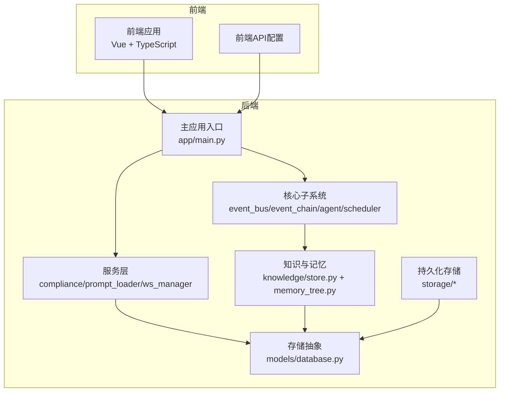
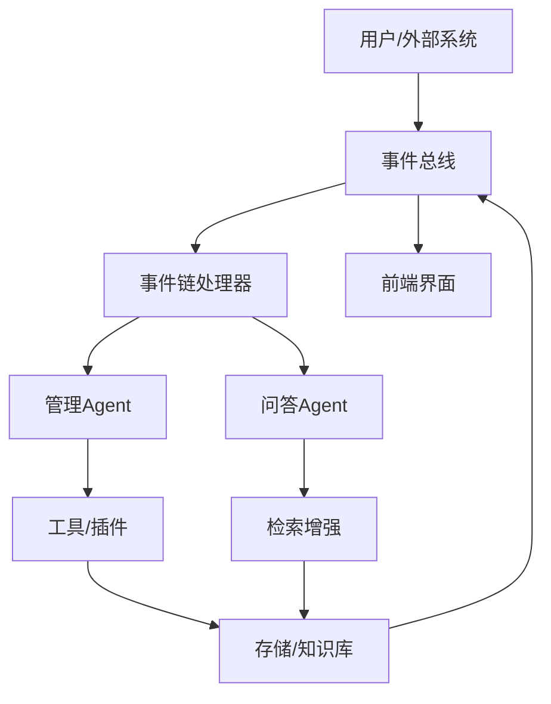
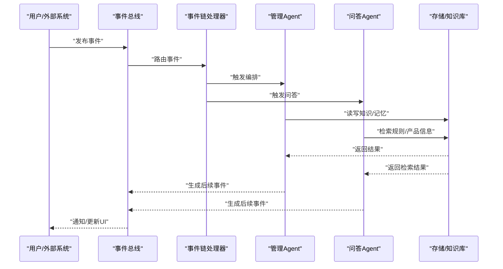
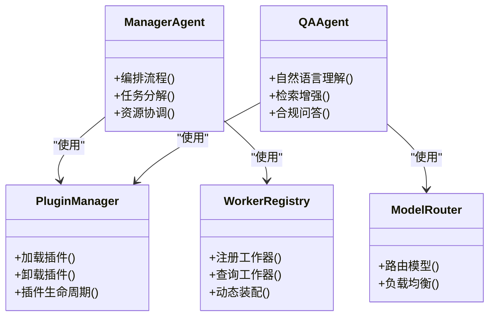
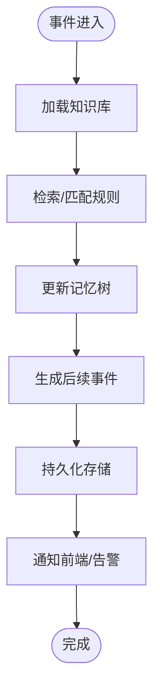
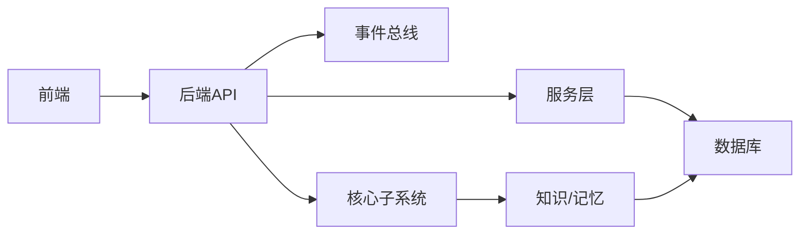

# 系统架构

<cite>
**本文引用的文件**
- [README.md](file://README.md)
- [main.py](file://backend/app/main.py)
- [event_bus.py](file://backend/app/core/event_bus.py)
- [event_chain.py](file://backend/app/core/event_chain.py)
- [action_chain.py](file://backend/app/core/action_chain.py)
- [manager_agent.py](file://backend/app/core/manager_agent.py)
- [qa_agent.py](file://backend/app/core/qa_agent.py)
- [worker_registry.py](file://backend/app/core/worker_registry.py)
- [scheduler.py](file://backend/app/core/scheduler.py)
- [notification_engine.py](file://backend/app/core/notification_engine.py)
- [security_sandbox.py](file://backend/app/core/security_sandbox.py)
- [plugin_manager.py](file://backend/app/core/plugin_manager.py)
- [model_router.py](file://backend/app/core/model_router.py)
- [knowledge.py](file://backend/app/knowledge/store.py)
- [memory_tree.py](file://backend/app/core/memory_tree.py)
- [metrics.py](file://backend/app/core/metrics.py)
- [requirements.txt](file://backend/requirements.txt)
- [package.json](file://frontend/package.json)
- [后端api.md](file://后端api.md)
- [前后端api交互.md](file://前后端api交互.md)
- [避风港_20260524_开发文档.md](file://避风港_20260524_开发文档.md)
</cite>

## 目录
1. [引言](#引言)
2. [项目结构](#项目结构)
3. [核心组件](#核心组件)
4. [架构总览](#架构总览)
5. [详细组件分析](#详细组件分析)
6. [依赖关系分析](#依赖关系分析)
7. [性能考虑](#性能考虑)
8. [故障排除指南](#故障排除指南)
9. [结论](#结论)
10. [附录](#附录)

## 引言
避风港平台是一个基于事件驱动架构（EDA）与多Agent协同的合规与智能工作流平台。其目标是通过事件总线、事件链与异步处理机制，实现跨产品、跨规则、跨系统的自动化合规检查与风险预警；同时通过多Agent协作（管理Agent、问答Agent等）完成复杂的业务编排与知识服务。

本架构文档聚焦于：
- 高层设计与系统边界
- 事件驱动架构的设计原理与实现
- 多Agent协同的组件交互与数据流
- 技术决策、权衡与约束
- 基础设施要求、可扩展性与部署拓扑
- 安全性、监控与灾难恢复
- 技术栈、第三方依赖与版本兼容性

## 项目结构
平台采用前后端分离架构，后端以Python FastAPI为核心，前端以TypeScript/Vue构建，核心模块围绕事件总线、事件链、Agent编排、知识存储与内存树展开，并通过插件化与调度器实现可扩展的异步处理。

图表来源
- [main.py](file://backend/app/main.py)
- [event_bus.py](file://backend/app/core/event_bus.py)
- [event_chain.py](file://backend/app/core/event_chain.py)
- [knowledge.py](file://backend/app/knowledge/store.py)
- [memory_tree.py](file://backend/app/core/memory_tree.py)

章节来源
- [README.md](file://README.md)
- [main.py](file://backend/app/main.py)

## 核心组件
- 事件总线（Event Bus）：负责事件的发布、订阅与路由，支持跨模块解耦与异步处理。
- 事件链（Event Chain）：定义事件在不同阶段的流转与转换，确保合规流程的可追踪与可审计。
- Agent体系：管理Agent负责全局编排，QA Agent负责问答与检索增强，两者协同完成复杂任务。
- 调度器（Scheduler）：统一管理定时任务与异步作业，保证系统负载均衡与资源利用效率。
- 插件与工作器（Plugin/Worker）：通过注册表与路由实现能力扩展与动态装配。
- 安全沙箱（Security Sandbox）：对工具调用与外部接口进行安全隔离与权限控制。
- 知识与记忆（Knowledge/Memory）：提供规则、产品与会话记忆的统一存储与检索。
- 通知引擎（Notification Engine）：统一处理告警、提醒与状态变更通知。

章节来源
- [event_bus.py](file://backend/app/core/event_bus.py)
- [event_chain.py](file://backend/app/core/event_chain.py)
- [manager_agent.py](file://backend/app/core/manager_agent.py)
- [qa_agent.py](file://backend/app/core/qa_agent.py)
- [scheduler.py](file://backend/app/core/scheduler.py)
- [worker_registry.py](file://backend/app/core/worker_registry.py)
- [security_sandbox.py](file://backend/app/core/security_sandbox.py)
- [knowledge.py](file://backend/app/knowledge/store.py)
- [memory_tree.py](file://backend/app/core/memory_tree.py)
- [notification_engine.py](file://backend/app/core/notification_engine.py)

## 架构总览
避风港平台采用事件驱动架构，以事件为中心组织业务流程。系统边界内包含：
- 事件产生源：用户操作、系统状态变化、外部Webhook、定时任务
- 事件总线：接收、分发与转发事件
- 事件链处理器：按预设规则转换与推进事件状态
- Agent编排器：根据事件内容选择合适的Agent与工具
- 存储与知识：持久化事件、产品、规则与会话记忆
- 前端界面：展示事件时间线、合规报告、风险中心与系统概览

图表来源
- [event_bus.py](file://backend/app/core/event_bus.py)
- [event_chain.py](file://backend/app/core/event_chain.py)
- [manager_agent.py](file://backend/app/core/manager_agent.py)
- [qa_agent.py](file://backend/app/core/qa_agent.py)
- [knowledge.py](file://backend/app/knowledge/store.py)

## 详细组件分析

### 事件驱动架构（EDA）
- 设计原理
  - 事件即事实：任何业务状态变化都以事件形式产生，避免直接调用导致紧耦合。
  - 解耦与异步：事件总线作为中介，支持发布/订阅模式与异步处理，提升系统弹性。
  - 可观测性：事件链记录每个环节的状态与参数，便于审计与回放。
- 关键实现
  - 事件总线：负责事件的注册、路由与分发，支持优先级与重试策略。
  - 事件链：定义事件在不同阶段的转换逻辑，确保合规流程的顺序与一致性。
  - 异步处理：结合调度器与工作器注册表，实现后台任务的并发与容错。

图表来源
- [event_bus.py](file://backend/app/core/event_bus.py)
- [event_chain.py](file://backend/app/core/event_chain.py)
- [manager_agent.py](file://backend/app/core/manager_agent.py)
- [qa_agent.py](file://backend/app/core/qa_agent.py)
- [knowledge.py](file://backend/app/knowledge/store.py)

章节来源
- [event_bus.py](file://backend/app/core/event_bus.py)
- [event_chain.py](file://backend/app/core/event_chain.py)

### 多Agent协同架构
- 组件交互
  - 管理Agent：负责全局流程编排、任务分解与资源协调，面向复杂业务场景。
  - 问答Agent：负责规则检索、产品合规查询与自然语言问答，面向高频交互场景。
  - 工具/插件：通过注册表动态加载，提供外部系统集成与计算能力。
- 数据流
  - 输入：事件或用户请求
  - 处理：Agent选择工具/插件，访问知识库与记忆树，生成中间结果
  - 输出：事件推进、状态更新、通知与前端反馈
- 集成模式
  - 插件化：通过插件管理器与工作器注册表实现能力扩展
  - 路由：模型路由与工具路由确保资源最优分配

图表来源
- [manager_agent.py](file://backend/app/core/manager_agent.py)
- [qa_agent.py](file://backend/app/core/qa_agent.py)
- [plugin_manager.py](file://backend/app/core/plugin_manager.py)
- [worker_registry.py](file://backend/app/core/worker_registry.py)
- [model_router.py](file://backend/app/core/model_router.py)

章节来源
- [manager_agent.py](file://backend/app/core/manager_agent.py)
- [qa_agent.py](file://backend/app/core/qa_agent.py)
- [plugin_manager.py](file://backend/app/core/plugin_manager.py)
- [worker_registry.py](file://backend/app/core/worker_registry.py)
- [model_router.py](file://backend/app/core/model_router.py)

### 知识与记忆系统
- 知识库（Knowledge Store）
  - 存储法规、产品信息、认证资料等结构化与半结构化数据
  - 支持检索增强（RAG）与向量索引加速
- 记忆树（Memory Tree）
  - 维护会话、产品与全局记忆，支持增量更新与版本管理
- 与事件链的集成
  - 事件链在推进过程中读写知识与记忆，形成闭环的数据驱动流程

图表来源
- [knowledge.py](file://backend/app/knowledge/store.py)
- [memory_tree.py](file://backend/app/core/memory_tree.py)

章节来源
- [knowledge.py](file://backend/app/knowledge/store.py)
- [memory_tree.py](file://backend/app/core/memory_tree.py)

### 安全性、监控与灾难恢复
- 安全性
  - 安全沙箱：对外部调用与工具执行进行隔离与权限控制
  - RBAC与鉴权：基于角色的访问控制与OAuth管理
- 监控
  - 指标采集：核心组件指标化，支持聚合与可视化
  - 事件可观测：事件链提供完整审计轨迹
- 灾难恢复
  - 存储持久化：事件、知识、记忆均具备持久化能力
  - 异步重试：事件总线与调度器支持失败重试与死信队列

章节来源
- [security_sandbox.py](file://backend/app/core/security_sandbox.py)
- [metrics.py](file://backend/app/core/metrics.py)

## 依赖关系分析
- 技术栈
  - 后端：Python FastAPI、事件驱动框架、数据库ORM、缓存与消息队列（依据需求文件）
  - 前端：Vue + TypeScript、WebSocket/SSE、UI组件库
- 第三方依赖与版本兼容性
  - 具体依赖项与版本号以后端requirements.txt与前端package.json为准
- 内聚与耦合
  - 核心子系统内聚高，通过事件总线与插件管理器降低模块间耦合
  - 存储抽象清晰，知识与记忆独立于业务逻辑

图表来源
- [main.py](file://backend/app/main.py)
- [requirements.txt](file://backend/requirements.txt)
- [package.json](file://frontend/package.json)

章节来源
- [requirements.txt](file://backend/requirements.txt)
- [package.json](file://frontend/package.json)

## 性能考虑
- 异步与并发
  - 使用事件总线与调度器实现异步处理，避免阻塞主线程
  - 工作器注册表支持水平扩展与动态扩容
- 资源优化
  - 模型路由与工具路由实现资源最优分配
  - 缓存与索引（知识库）减少重复计算与I/O
- 可扩展性
  - 插件化与注册表支持快速扩展新能力
  - 事件链可配置化，适应不同业务场景

## 故障排除指南
- 事件未被消费
  - 检查事件总线路由与订阅配置
  - 查看事件链是否正确生成后续事件
- Agent执行异常
  - 检查插件/工作器注册表与模型路由
  - 查看安全沙箱日志与权限配置
- 知识/记忆不一致
  - 校验持久化存储与版本管理
  - 检查事件链对知识/记忆的读写逻辑

章节来源
- [event_bus.py](file://backend/app/core/event_bus.py)
- [event_chain.py](file://backend/app/core/event_chain.py)
- [plugin_manager.py](file://backend/app/core/plugin_manager.py)
- [worker_registry.py](file://backend/app/core/worker_registry.py)
- [security_sandbox.py](file://backend/app/core/security_sandbox.py)

## 结论
避风港平台通过事件驱动架构与多Agent协同，实现了合规与智能工作流的高内聚、低耦合与强扩展性。事件总线与事件链确保了流程的可追踪与可审计，Agent编排与插件化机制提供了灵活的能力扩展，知识与记忆系统支撑了数据驱动的决策。结合安全沙箱、监控与持久化策略，平台在复杂业务场景下具备良好的稳定性与可维护性。

## 附录
- 系统上下文图与组件分解图已在前述章节中给出
- API交互与后端接口定义详见后端与前后端交互文档

章节来源
- [后端api.md](file://后端api.md)
- [前后端api交互.md](file://前后端api交互.md)
- [避风港_20260524_开发文档.md](file://避风港_20260524_开发文档.md)