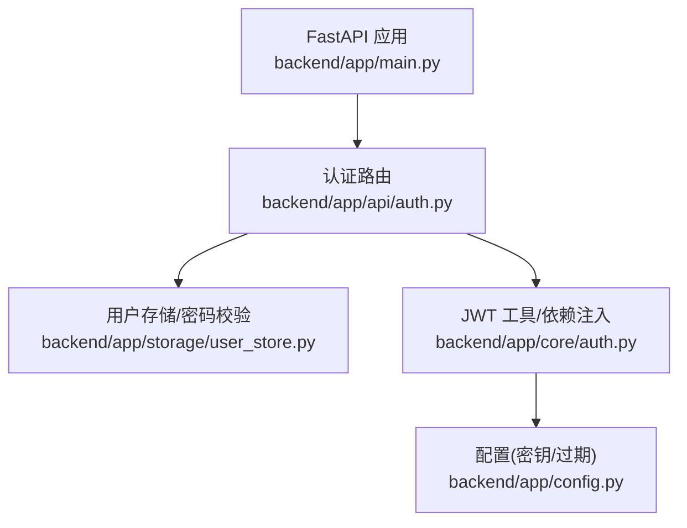
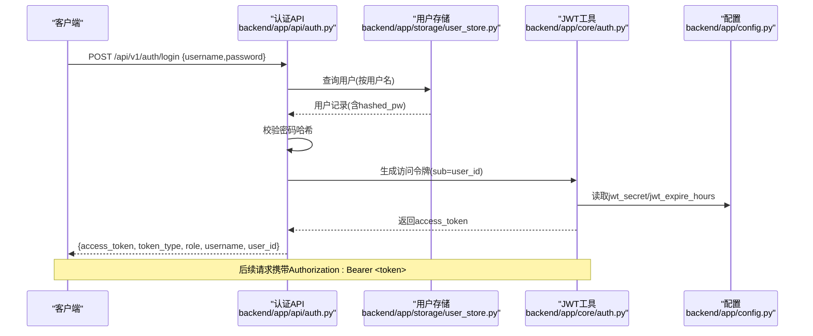
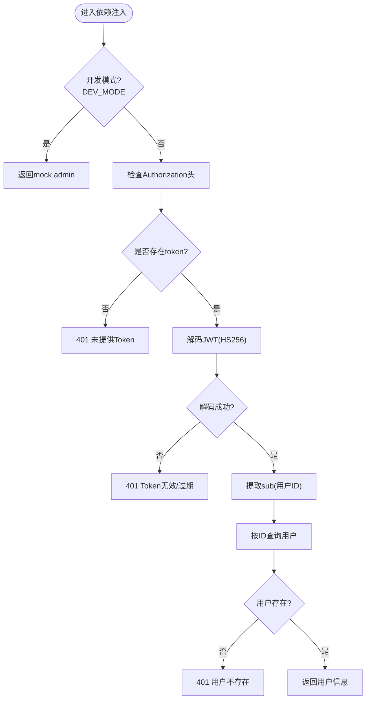
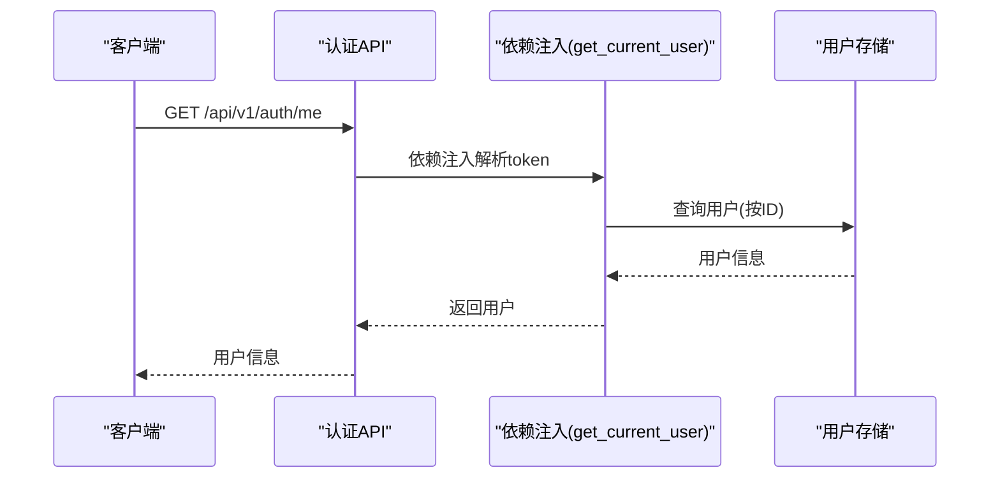
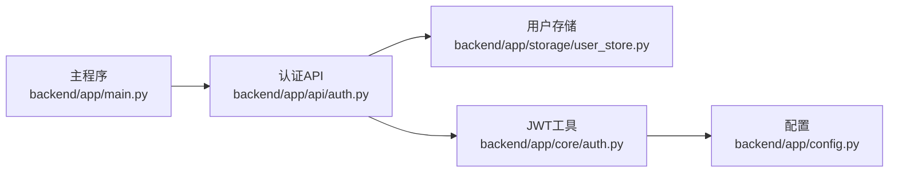

# JWT认证机制

<cite>
**本文引用的文件**
- [backend/app/api/auth.py](file://backend/app/api/auth.py)
- [backend/app/core/auth.py](file://backend/app/core/auth.py)
- [backend/app/storage/user_store.py](file://backend/app/storage/user_store.py)
- [backend/app/config.py](file://backend/app/config.py)
- [backend/app/main.py](file://backend/app/main.py)
</cite>

## 目录
1. [简介](#简介)
2. [项目结构](#项目结构)
3. [核心组件](#核心组件)
4. [架构总览](#架构总览)
5. [详细组件分析](#详细组件分析)
6. [依赖关系分析](#依赖关系分析)
7. [性能考量](#性能考量)
8. [故障排查指南](#故障排查指南)
9. [结论](#结论)
10. [附录](#附录)

## 简介
本文件系统性梳理避风港平台的JWT认证机制，覆盖令牌生成原理、签名算法、有效期管理、登录流程、依赖注入实现、API端点使用、错误处理与安全最佳实践，并给出常见问题的防护建议。平台采用HS256算法进行签名，令牌有效期由配置控制；登录时校验用户名与密码哈希，成功后签发包含用户标识的访问令牌；通过FastAPI依赖注入在路由层自动解析与校验令牌，实现用户身份识别与权限控制。

## 项目结构
围绕JWT认证的关键文件与职责如下：
- 后端入口与路由注册：[backend/app/main.py](file://backend/app/main.py)
- 认证API端点：[backend/app/api/auth.py](file://backend/app/api/auth.py)
- JWT工具与依赖注入：[backend/app/core/auth.py](file://backend/app/core/auth.py)
- 用户存储与密码哈希：[backend/app/storage/user_store.py](file://backend/app/storage/user_store.py)
- 配置与密钥、过期时间：[backend/app/config.py](file://backend/app/config.py)

图表来源
- [backend/app/main.py:59](file://backend/app/main.py#L59)
- [backend/app/api/auth.py:54](file://backend/app/api/auth.py#L54)
- [backend/app/core/auth.py:21](file://backend/app/core/auth.py#L21)
- [backend/app/storage/user_store.py:68](file://backend/app/storage/user_store.py#L68)
- [backend/app/config.py:157](file://backend/app/config.py#L157)

章节来源
- [backend/app/main.py:59](file://backend/app/main.py#L59)
- [backend/app/api/auth.py:54](file://backend/app/api/auth.py#L54)
- [backend/app/core/auth.py:21](file://backend/app/core/auth.py#L21)
- [backend/app/storage/user_store.py:68](file://backend/app/storage/user_store.py#L68)
- [backend/app/config.py:157](file://backend/app/config.py#L157)

## 核心组件
- JWT工具与依赖注入
  - 令牌生成：基于HS256算法，载荷包含exp（过期时间），过期时长来自配置。
  - 令牌解码：校验签名与过期，异常时返回401。
  - 依赖注入：OAuth2PasswordBearer自动从Authorization头提取Bearer令牌；在开发模式下可绕过校验。
  - 用户解析：从令牌提取sub（用户ID），查询用户信息，缺失或不存在时返回401。
  - 管理员校验：require_admin依赖get_current_user，非admin返回403。
- 认证API端点
  - 登录：校验用户名与密码哈希，成功后签发访问令牌。
  - 注册：仅管理员可用，校验角色合法性，创建用户。
  - 当前用户：依赖get_current_user返回用户信息。
  - 修改密码：校验旧密码与长度，成功后更新密码。
- 用户存储与密码哈希
  - bcrypt哈希与校验，SQLite users表结构，提供CRUD与初始化管理员。
- 配置
  - jwt_secret：JWT签名密钥。
  - jwt_expire_hours：令牌有效小时数。

章节来源
- [backend/app/core/auth.py:28](file://backend/app/core/auth.py#L28)
- [backend/app/core/auth.py:37](file://backend/app/core/auth.py#L37)
- [backend/app/core/auth.py:50](file://backend/app/core/auth.py#L50)
- [backend/app/core/auth.py:70](file://backend/app/core/auth.py#L70)
- [backend/app/api/auth.py:54](file://backend/app/api/auth.py#L54)
- [backend/app/api/auth.py:81](file://backend/app/api/auth.py#L81)
- [backend/app/api/auth.py:92](file://backend/app/api/auth.py#L92)
- [backend/app/api/auth.py:97](file://backend/app/api/auth.py#L97)
- [backend/app/storage/user_store.py:38](file://backend/app/storage/user_store.py#L38)
- [backend/app/storage/user_store.py:68](file://backend/app/storage/user_store.py#L68)
- [backend/app/config.py:157](file://backend/app/config.py#L157)

## 架构总览
下图展示登录与鉴权的端到端流程，包括FastAPI依赖注入与用户存储交互。

图表来源
- [backend/app/api/auth.py:54](file://backend/app/api/auth.py#L54)
- [backend/app/storage/user_store.py:68](file://backend/app/storage/user_store.py#L68)
- [backend/app/core/auth.py:28](file://backend/app/core/auth.py#L28)
- [backend/app/config.py:157](file://backend/app/config.py#L157)

## 详细组件分析

### JWT工具与依赖注入
- 令牌生成
  - 签名算法：HS256
  - 载荷扩展：添加exp（过期时间），默认使用配置的jwt_expire_hours
  - 返回字符串形式的JWT
- 令牌解码
  - 使用jwt_secret与HS256校验签名
  - 异常时抛出401，WWW-Authenticate: Bearer
- 依赖注入
  - OAuth2PasswordBearer(tokenUrl)：从Authorization头解析Bearer token
  - 开发模式：DEV_MODE=true时，oauth2_scheme自动错误关闭，get_current_user直接返回mock admin
- 用户解析与管理员校验
  - get_current_user：解析sub，查询用户，缺失或不存在返回401
  - require_admin：校验role=admin，否则403

图表来源
- [backend/app/core/auth.py:50](file://backend/app/core/auth.py#L50)
- [backend/app/core/auth.py:37](file://backend/app/core/auth.py#L37)

章节来源
- [backend/app/core/auth.py:21](file://backend/app/core/auth.py#L21)
- [backend/app/core/auth.py:28](file://backend/app/core/auth.py#L28)
- [backend/app/core/auth.py:37](file://backend/app/core/auth.py#L37)
- [backend/app/core/auth.py:50](file://backend/app/core/auth.py#L50)
- [backend/app/core/auth.py:70](file://backend/app/core/auth.py#L70)

### 认证API端点
- 登录
  - 路径：POST /api/v1/auth/login
  - 输入：用户名、密码
  - 流程：查询用户、校验密码哈希、签发令牌
  - 输出：access_token、token_type、role、username、user_id
- 登录表单兼容
  - 路径：POST /api/v1/auth/token
  - 兼容OAuth2PasswordRequestForm，便于Swagger UI测试
- 注册
  - 路径：POST /api/v1/auth/register
  - 依赖：require_admin
  - 输入：用户名、密码、角色
  - 校验：角色仅允许admin或user
  - 输出：用户信息（不含hashed_pw）
- 当前用户
  - 路径：GET /api/v1/auth/me
  - 依赖：get_current_user
  - 输出：用户信息（不含hashed_pw）
- 修改密码
  - 路径：PUT /api/v1/auth/me/password
  - 依赖：get_current_user
  - 输入：旧密码、新密码
  - 校验：旧密码正确、新密码长度>=6
  - 结果：{"ok": true, "message": "密码已修改"}

图表来源
- [backend/app/api/auth.py:92](file://backend/app/api/auth.py#L92)
- [backend/app/core/auth.py:50](file://backend/app/core/auth.py#L50)
- [backend/app/storage/user_store.py:78](file://backend/app/storage/user_store.py#L78)

章节来源
- [backend/app/api/auth.py:54](file://backend/app/api/auth.py#L54)
- [backend/app/api/auth.py:72](file://backend/app/api/auth.py#L72)
- [backend/app/api/auth.py:81](file://backend/app/api/auth.py#L81)
- [backend/app/api/auth.py:92](file://backend/app/api/auth.py#L92)
- [backend/app/api/auth.py:97](file://backend/app/api/auth.py#L97)

### 用户存储与密码哈希
- 表结构：users(id, username, hashed_pw, role, created_at)
- 密码处理：bcrypt哈希与校验
- 用户操作：创建、按用户名/ID查询、列出、删除、改角色、改密码
- 初始化：若表为空，自动创建默认admin/admin123

章节来源
- [backend/app/storage/user_store.py:22](file://backend/app/storage/user_store.py#L22)
- [backend/app/storage/user_store.py:38](file://backend/app/storage/user_store.py#L38)
- [backend/app/storage/user_store.py:48](file://backend/app/storage/user_store.py#L48)
- [backend/app/storage/user_store.py:68](file://backend/app/storage/user_store.py#L68)
- [backend/app/storage/user_store.py:78](file://backend/app/storage/user_store.py#L78)
- [backend/app/storage/user_store.py:122](file://backend/app/storage/user_store.py#L122)

### 配置与密钥管理
- jwt_secret：JWT签名密钥，生产环境必须替换
- jwt_expire_hours：令牌有效小时数，默认24小时
- 开发模式：DEV_MODE=true时，依赖注入自动跳过令牌校验，直接放行mock admin

章节来源
- [backend/app/config.py:157](file://backend/app/config.py#L157)
- [backend/app/core/auth.py:17](file://backend/app/core/auth.py#L17)
- [backend/app/core/auth.py:21](file://backend/app/core/auth.py#L21)

## 依赖关系分析
- 认证API依赖用户存储进行用户查询与密码校验
- JWT工具依赖配置读取密钥与过期时间
- FastAPI依赖注入依赖OAuth2PasswordBearer与配置的tokenUrl
- 主程序注册认证路由，使端点生效

图表来源
- [backend/app/api/auth.py:8](file://backend/app/api/auth.py#L8)
- [backend/app/core/auth.py:14](file://backend/app/core/auth.py#L14)
- [backend/app/config.py:157](file://backend/app/config.py#L157)
- [backend/app/main.py:59](file://backend/app/main.py#L59)

章节来源
- [backend/app/api/auth.py:8](file://backend/app/api/auth.py#L8)
- [backend/app/core/auth.py:14](file://backend/app/core/auth.py#L14)
- [backend/app/config.py:157](file://backend/app/config.py#L157)
- [backend/app/main.py:59](file://backend/app/main.py#L59)

## 性能考量
- 令牌生成与解码为轻量操作，性能瓶颈通常不在JWT本身
- 密码哈希使用bcrypt，成本因子较高，建议在高并发场景下关注用户查询与数据库连接池配置
- 依赖注入解析令牌为O(1)，无需额外缓存
- 建议将jwt_secret置于安全的环境变量或密钥管理服务，避免明文存储

## 故障排查指南
- 401 未提供Token
  - 现象：请求缺少Authorization头或Bearer token
  - 处理：在Authorization头中添加Bearer <token>
- 401 Token无效或已过期
  - 现象：令牌签名不合法或已超过有效期
  - 处理：重新登录获取新令牌
- 401 用户不存在
  - 现象：令牌中的sub指向的用户在数据库中不存在
  - 处理：检查用户是否被删除或ID是否正确
- 403 需要管理员权限
  - 现象：调用仅管理员可用的接口
  - 处理：使用管理员账户或调整角色
- 400 原密码不正确/新密码至少6位
  - 现象：修改密码时旧密码错误或新密码长度不足
  - 处理：提供正确的旧密码与符合长度要求的新密码
- 409 用户名已存在
  - 现象：注册时用户名冲突
  - 处理：更换用户名或联系管理员

章节来源
- [backend/app/core/auth.py:50](file://backend/app/core/auth.py#L50)
- [backend/app/core/auth.py:37](file://backend/app/core/auth.py#L37)
- [backend/app/api/auth.py:58](file://backend/app/api/auth.py#L58)
- [backend/app/api/auth.py:102](file://backend/app/api/auth.py#L102)
- [backend/app/api/auth.py:87](file://backend/app/api/auth.py#L87)

## 结论
避风港平台的JWT认证机制以HS256签名、可配置过期时间为核心，结合FastAPI依赖注入实现自动令牌解析与用户身份识别。登录流程严格校验用户名与密码哈希，注册与密码修改接口提供基础安全能力。建议在生产环境强化密钥管理、启用HTTPS、限制令牌刷新策略，并结合前端安全存储策略降低泄露风险。

## 附录

### API端点一览与使用示例
- 登录
  - 方法与路径：POST /api/v1/auth/login
  - 请求体：{username, password}
  - 成功响应：{access_token, token_type, role, username, user_id}
  - 示例：Authorization: Bearer <access_token>
- 登录表单（Swagger UI）
  - 方法与路径：POST /api/v1/auth/token
  - 表单字段：username, password
  - 成功响应：{access_token, token_type}
- 注册（仅管理员）
  - 方法与路径：POST /api/v1/auth/register
  - 请求体：{username, password, role}
  - 成功响应：用户信息（不含hashed_pw）
- 获取当前用户
  - 方法与路径：GET /api/v1/auth/me
  - 成功响应：用户信息（不含hashed_pw）
- 修改密码
  - 方法与路径：PUT /api/v1/auth/me/password
  - 请求体：{old_password, new_password}
  - 成功响应：{"ok": true, "message": "密码已修改"}

章节来源
- [backend/app/api/auth.py:54](file://backend/app/api/auth.py#L54)
- [backend/app/api/auth.py:72](file://backend/app/api/auth.py#L72)
- [backend/app/api/auth.py:81](file://backend/app/api/auth.py#L81)
- [backend/app/api/auth.py:92](file://backend/app/api/auth.py#L92)
- [backend/app/api/auth.py:97](file://backend/app/api/auth.py#L97)

### 令牌格式与解码示例
- 令牌结构
  - 头部：算法与类型（HS256）
  - 载荷：包含exp（过期时间）、sub（用户ID）等
  - 签名：基于jwt_secret与HS256生成
- 解码要点
  - 使用相同jwt_secret与HS256算法
  - 校验exp未过期
  - 提取sub作为用户ID进行后续鉴权

章节来源
- [backend/app/core/auth.py:28](file://backend/app/core/auth.py#L28)
- [backend/app/core/auth.py:37](file://backend/app/core/auth.py#L37)
- [backend/app/config.py:157](file://backend/app/config.py#L157)

### 安全最佳实践
- 密钥管理
  - 生产环境务必替换默认jwt_secret
  - 使用环境变量或密钥管理服务存储敏感配置
- 传输安全
  - 强制使用HTTPS，防止令牌在传输中被截获
- 令牌存储
  - 前端避免将令牌持久化至localStorage或Cookie（除非使用HttpOnly、Secure、SameSite）
  - 推荐短期令牌与安全存储策略配合
- 速率限制与防护
  - 对登录端点实施速率限制与防暴力破解策略
- 审计与监控
  - 记录认证事件与异常行为，定期审查

### 常见安全威胁与对策
- 令牌泄露
  - 防护：最小权限原则、缩短有效期、强制HTTPS、安全存储
- 暴力破解
  - 防护：登录失败次数限制、验证码、账户锁定策略
- 重放攻击
  - 防护：短有效期、一次性票据、服务端校验
- XSS/CSRF
  - 防护：同站策略、CSRF令牌、安全Cookie属性