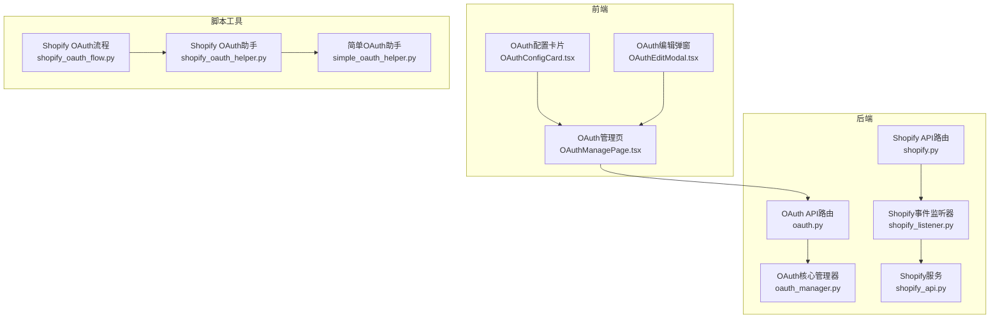
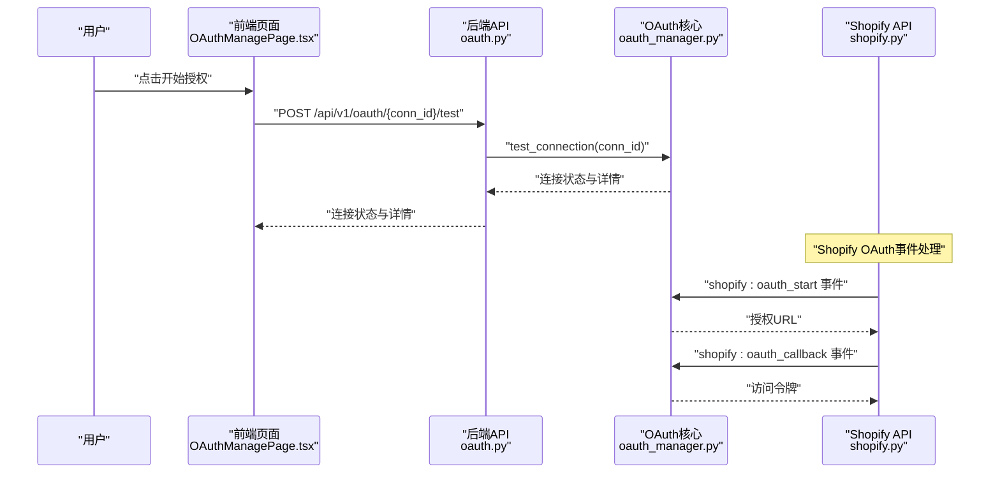
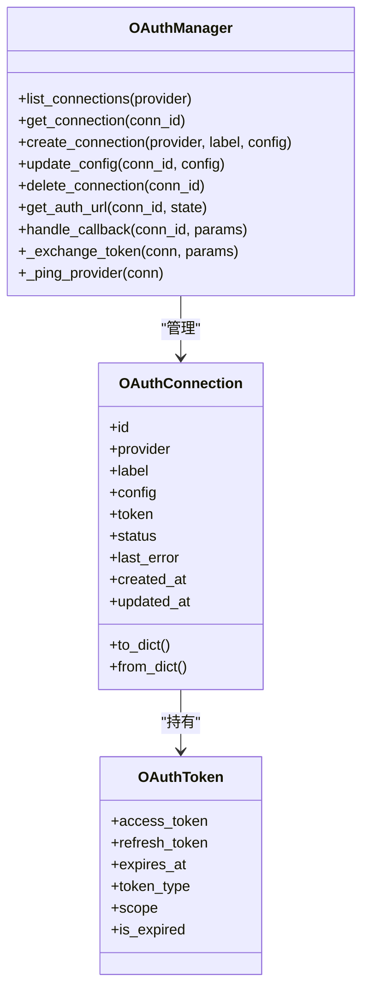
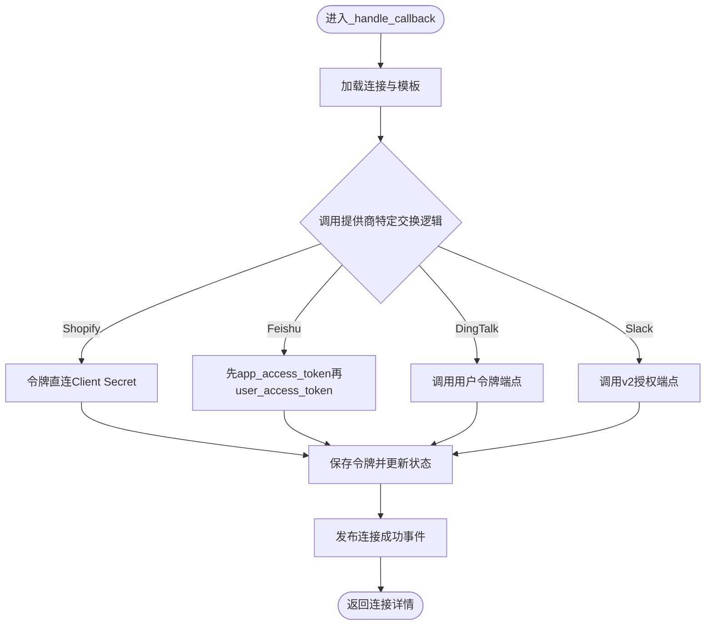
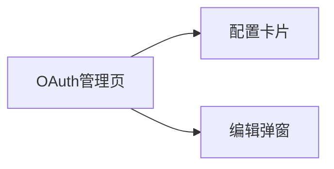
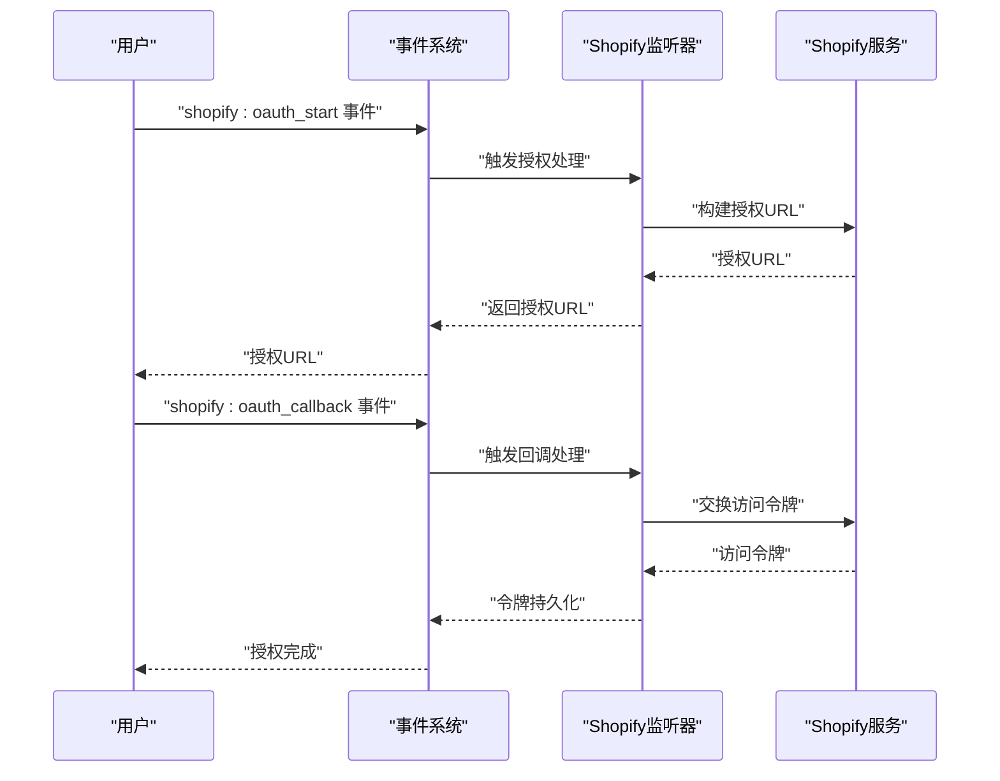
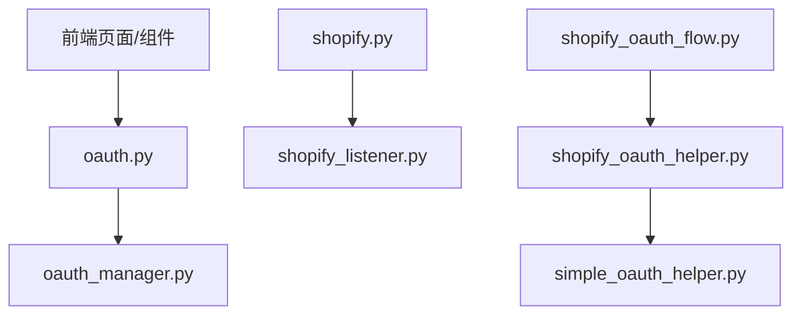

# OAuth2集成

<cite>
**本文引用的文件**
- [oauth.py](file://backend/app/api/oauth.py)
- [oauth_manager.py](file://backend/app/core/oauth_manager.py)
- [shopify.py](file://backend/app/api/shopify.py)
- [shopify_oauth_flow.py](file://backend/scripts/shopify_oauth_flow.py)
- [shopify_oauth_helper.py](file://backend/scripts/shopify_oauth_helper.py)
- [simple_oauth_helper.py](file://backend/scripts/simple_oauth_helper.py)
- [execute_shopify_query.py](file://backend/scripts/execute_shopify_query.py)
- [shopify_api.py](file://backend/app/services/shopify_api.py)
- [shopify_listener.py](file://backend/app/core/event_listeners/shopify_listener.py)
- [shopify_reference.md](file://backend/data/context/shopify_reference.md)
- [shopify_events.md](file://backend/data/events/builtin/shopify_events.md)
- [providers.yaml](file://backend/data/oauth/providers.yaml)
- [oauth_connections.json](file://backend/data/config/oauth_connections.json)
- [OAuthManagePage.tsx](file://frontend/src/pages/config/OAuthManagePage.tsx)
- [OAuthConfigCard.tsx](file://frontend/src/components/config/OAuthConfigCard.tsx)
- [OAuthEditModal.tsx](file://frontend/src/components/config/OAuthEditModal.tsx)
</cite>

## 更新摘要
**所做更改**
- 新增Shopify OAuth流程支持章节，详细介绍新增的shopify_oauth_flow.py和shopify_oauth_helper.py脚本
- 更新架构图以反映Shopify OAuth流程的完整实现
- 添加Shopify OAuth授权事件处理机制说明
- 更新故障排查指南，增加Shopify OAuth相关问题处理
- 新增Shopify OAuth安全考虑和最佳实践

## 目录
1. [简介](#简介)
2. [项目结构](#项目结构)
3. [核心组件](#核心组件)
4. [架构总览](#架构总览)
5. [详细组件分析](#详细组件分析)
6. [Shopify OAuth流程支持](#shopify-oauth流程支持)
7. [依赖关系分析](#依赖关系分析)
8. [性能考量](#性能考量)
9. [故障排查指南](#故障排查指南)
10. [结论](#结论)
11. [附录：第三方平台接入示例与最佳实践](#附录第三方平台接入示例与最佳实践)

## 简介
本文件面向避风港平台的OAuth2集成系统，系统性阐述OAuth2协议工作原理与四种授权模式在平台中的实现形态；解释第三方认证流程（授权服务器配置、回调处理、令牌交换）、OAuth连接的配置管理与客户端凭证管理、作用域控制、用户授权流程与权限提升、账户绑定机制；并提供GitHub、Google等常见第三方平台的接入参考路径与安全建议（CSRF防护、令牌存储与撤销、重定向攻击与令牌泄露的应对策略）。

**重要说明**：当前系统已简化，Shopify OAuth流程已迁移至事件驱动架构，传统OAuth2授权码交换流程已被移除，系统现主要支持基于令牌的连接（如Shopify的Client Secret直连）和标准OAuth2提供商（飞书、钉钉、Slack等）。新增的shopify_oauth_flow.py和shopify_oauth_helper.py脚本提供了完整的Shopify应用授权流程实现，支持嵌入式和非嵌入式配置。

## 项目结构
后端采用"核心模块 + API路由 + 事件监听 + 前端页面/组件"的分层组织：
- 核心：OAuth2连接与令牌管理由核心模块统一负责，提供连接生命周期管理、授权URL生成、回调处理与令牌交换。
- API：对外暴露集成管理接口，支持创建连接、查询提供商模板、发起授权、处理回调、状态汇总与连接测试。
- 事件监听：专门处理Shopify OAuth授权事件，包括授权发起和回调处理。
- 前端：提供OAuth连接管理页面、配置卡片、编辑弹窗与选择器，支撑用户可视化配置与运维。

**图表来源**
- [oauth.py:15-33](file://backend/app/api/oauth.py#L15-L33)
- [oauth_manager.py:150-209](file://backend/app/core/oauth_manager.py#L150-L209)
- [shopify.py:1-50](file://backend/app/api/shopify.py#L1-L50)
- [shopify_listener.py:1-50](file://backend/app/core/event_listeners/shopify_listener.py#L1-L50)
- [shopify_oauth_flow.py:1-282](file://backend/scripts/shopify_oauth_flow.py#L1-L282)
- [shopify_oauth_helper.py:1-253](file://backend/scripts/shopify_oauth_helper.py#L1-L253)

**章节来源**
- [oauth.py:15-33](file://backend/app/api/oauth.py#L15-L33)
- [oauth_manager.py:150-209](file://backend/app/core/oauth_manager.py#L150-L209)
- [shopify.py:1-50](file://backend/app/api/shopify.py#L1-L50)
- [shopify_listener.py:1-50](file://backend/app/core/event_listeners/shopify_listener.py#L1-L50)
- [shopify_oauth_flow.py:1-282](file://backend/scripts/shopify_oauth_flow.py#L1-L282)
- [shopify_oauth_helper.py:1-253](file://backend/scripts/shopify_oauth_helper.py#L1-L253)

## 核心组件
- OAuthManager：统一管理OAuth连接、生成授权URL、处理回调与令牌交换、连接状态维护与事件广播。
- OAuthConnection/OAuthToken：连接与令牌的数据模型，包含状态枚举、过期判断与序列化。
- Provider模板：集中定义各第三方提供商的授权/令牌端点、默认作用域、参数映射规则。
- API路由：对外提供创建连接、查询模板、发起授权、处理回调、状态汇总与测试连接等接口。
- 事件监听器：专门处理Shopify OAuth授权事件，包括授权发起和回调处理。
- 前端页面与组件：提供OAuth连接的可视化管理、配置编辑、状态展示与测试能力。

**章节来源**
- [oauth_manager.py:39-99](file://backend/app/core/oauth_manager.py#L39-L99)
- [oauth_manager.py:170-209](file://backend/app/core/oauth_manager.py#L170-L209)
- [oauth.py:15-33](file://backend/app/api/oauth.py#L15-L33)

## 架构总览
系统遵循"前端发起授权 → 后端生成授权URL → 用户在第三方完成授权 → 回调至后端 → 交换令牌 → 更新连接状态"的闭环流程。**注意**：Shopify OAuth流程已迁移至事件驱动架构，传统授权码交换已被移除，系统现主要支持基于令牌的连接和标准OAuth2提供商。

**图表来源**
- [oauth.py:22-26](file://backend/app/api/oauth.py#L22-L26)
- [oauth_manager.py:378-403](file://backend/app/core/oauth_manager.py#L378-L403)
- [shopify.py:1-50](file://backend/app/api/shopify.py#L1-L50)
- [shopify_reference.md:28-76](file://backend/data/context/shopify_reference.md#L28-L76)

## 详细组件分析

### OAuthManager与连接生命周期
- 连接CRUD：支持列出、获取、创建、更新配置、删除连接；配置变更会更新时间戳并持久化。
- 授权URL生成：根据提供商模板拼装授权URL，注入state、client_id、redirect_uri、scope等参数；部分平台（如Shopify）需替换模板中的占位符。
- 回调处理：接收第三方回调参数，调用令牌交换逻辑，更新连接状态为"已连接"，清空last_error，并广播连接成功事件。
- 令牌交换：针对不同提供商采用差异化策略，**Shopify使用令牌直连而非授权码交换**，飞书/钉钉/Slack通过HTTP客户端直接调用各自令牌端点。
- 连接测试：若令牌过期则标记为过期；否则向提供商发起轻量探测请求以验证连通性与令牌有效性。

**图表来源**
- [oauth_manager.py:39-99](file://backend/app/core/oauth_manager.py#L39-L99)
- [oauth_manager.py:170-209](file://backend/app/core/oauth_manager.py#L170-L209)
- [oauth_manager.py:288-376](file://backend/app/core/oauth_manager.py#L288-L376)

**章节来源**
- [oauth_manager.py:170-209](file://backend/app/core/oauth_manager.py#L170-L209)
- [oauth_manager.py:212-287](file://backend/app/core/oauth_manager.py#L212-L287)
- [oauth_manager.py:288-376](file://backend/app/core/oauth_manager.py#L288-L376)

### Provider模板与参数映射
- 模板集中定义：各提供商的授权端点、令牌端点、默认作用域与参数键名映射。
- 参数注入：根据连接配置动态注入client_id、redirect_uri、scope、response_type等；Shopify需替换授权URL中的shop占位符。
- 状态流转：生成授权URL时将连接状态置为"连接中"，回调成功后置为"已连接"，失败或过期分别置为"错误"或"过期"。

**章节来源**
- [oauth_manager.py:109-123](file://backend/app/core/oauth_manager.py#L109-L123)
- [oauth_manager.py:212-248](file://backend/app/core/oauth_manager.py#L212-L248)

### 回调处理与令牌交换
- **Shopify**：**已迁移至事件驱动架构**，不再通过传统授权码交换获取令牌，而是使用Client Secret作为访问令牌进行直连。
- 飞书：先用授权码换取app_access_token，再换取user_access_token，最终返回用户级令牌。
- 钉钉：直接调用用户令牌端点，传入client_id/client_secret/code等参数。
- Slack：调用v2授权端点，提交client_id/client_secret/code等参数获取令牌。

**图表来源**
- [oauth_manager.py:250-287](file://backend/app/core/oauth_manager.py#L250-L287)
- [oauth_manager.py:288-376](file://backend/app/core/oauth_manager.py#L288-L376)
- [oauth_manager.py:295-302](file://backend/app/core/oauth_manager.py#L295-L302)

**章节来源**
- [oauth_manager.py:250-287](file://backend/app/core/oauth_manager.py#L250-L287)
- [oauth_manager.py:288-376](file://backend/app/core/oauth_manager.py#L288-L376)
- [oauth_manager.py:295-302](file://backend/app/core/oauth_manager.py#L295-L302)

### 前端集成与用户体验
- OAuth管理页：拉取连接列表与状态汇总，支持编辑、删除、测试连接。
- 配置卡片：展示连接标签、提供商、状态、错误信息与时间戳，便于快速识别异常。
- 编辑弹窗：基于提供商模板动态渲染配置字段，支持新建与编辑模式。
- 集成引导页：针对GitHub、Slack、钉钉、飞书、Google等平台给出配置步骤提示。

**图表来源**
- [OAuthManagePage.tsx:22-73](file://frontend/src/pages/config/OAuthManagePage.tsx#L22-L73)
- [OAuthConfigCard.tsx:29-82](file://frontend/src/components/config/OAuthConfigCard.tsx#L29-L82)
- [OAuthEditModal.tsx:20-306](file://frontend/src/components/config/OAuthEditModal.tsx#L20-L306)

**章节来源**
- [OAuthManagePage.tsx:22-73](file://frontend/src/pages/config/OAuthManagePage.tsx#L22-L73)
- [OAuthConfigCard.tsx:29-82](file://frontend/src/components/config/OAuthConfigCard.tsx#L29-L82)
- [OAuthEditModal.tsx:20-306](file://frontend/src/components/config/OAuthEditModal.tsx#L20-L306)

## Shopify OAuth流程支持

### 新增的Shopify OAuth脚本工具
平台新增了两个Python脚本，提供完整的Shopify OAuth流程实现：

#### shopify_oauth_flow.py - 完整OAuth流程脚本
- **功能**：提供完整的Shopify OAuth授权流程，包括授权URL生成、授权码交换、令牌保存和API测试。
- **特性**：支持自动打开浏览器、手动输入授权码、令牌验证和持久化存储。
- **配置**：通过环境变量配置Shopify域名、Client ID、Client Secret等参数。
- **输出**：生成JSON格式的令牌文件，包含商店信息、访问令牌、权限范围和创建时间。

#### shopify_oauth_helper.py - 交互式OAuth助手
- **功能**：提供用户友好的交互界面，支持OAuth授权流程和直接令牌输入两种模式。
- **特性**：自动检测现有令牌、提供多种认证选项、格式化输出环境变量设置。
- **安全性**：内置令牌格式验证，防止错误的令牌格式被保存。
- **便利性**：提供一键设置环境变量的指导信息。

### OAuth授权事件处理机制
系统通过事件驱动架构处理Shopify OAuth授权：

**图表来源**
- [shopify_reference.md:28-76](file://backend/data/context/shopify_reference.md#L28-L76)
- [shopify_listener.py:1-50](file://backend/app/core/event_listeners/shopify_listener.py#L1-L50)
- [shopify_api.py:30-45](file://backend/app/services/shopify_api.py#L30-L45)

### Shopify OAuth API集成
新增的Shopify API路由支持完整的OAuth授权流程：

- **授权发起**：`GET /api/v1/shopify/auth?shop={store_domain}`
- **授权回调**：系统自动处理Shopify的OAuth回调，无需手动配置
- **商店管理**：`GET /api/v1/shopify/shops` 列出已连接的商店
- **Webhook接收**：`POST /api/v1/shopify/webhook` 处理Shopify事件

**章节来源**
- [shopify_oauth_flow.py:1-282](file://backend/scripts/shopify_oauth_flow.py#L1-L282)
- [shopify_oauth_helper.py:1-253](file://backend/scripts/shopify_oauth_helper.py#L1-L253)
- [shopify_reference.md:28-76](file://backend/data/context/shopify_reference.md#L28-L76)
- [shopify_api.py:30-45](file://backend/app/services/shopify_api.py#L30-L45)

## 依赖关系分析
- 后端耦合点：
  - API路由依赖OAuthManager进行连接管理与授权流程编排。
  - OAuthManager内部依赖Provider模板与各平台SDK/HTTP客户端。
  - **Shopify令牌交换通过事件驱动架构处理，不再依赖传统SDK封装。**
  - Shopify API路由依赖事件监听器处理OAuth授权事件。
- 前端耦合点：
  - OAuth管理页通过API封装调用后端接口，驱动UI状态更新。
  - 编辑弹窗根据Provider模板动态生成表单字段，减少硬编码。
- 脚本工具依赖：
  - 新增的Shopify OAuth脚本依赖requests库进行HTTP通信。
  - 支持环境变量配置，便于在不同环境中部署。

**图表来源**
- [oauth.py:15-33](file://backend/app/api/oauth.py#L15-L33)
- [oauth_manager.py:150-209](file://backend/app/core/oauth_manager.py#L150-L209)
- [shopify.py:1-50](file://backend/app/api/shopify.py#L1-L50)
- [shopify_listener.py:1-50](file://backend/app/core/event_listeners/shopify_listener.py#L1-L50)
- [shopify_oauth_flow.py:1-282](file://backend/scripts/shopify_oauth_flow.py#L1-L282)
- [shopify_oauth_helper.py:1-253](file://backend/scripts/shopify_oauth_helper.py#L1-L253)

**章节来源**
- [oauth.py:15-33](file://backend/app/api/oauth.py#L15-L33)
- [oauth_manager.py:150-209](file://backend/app/core/oauth_manager.py#L150-L209)
- [shopify.py:1-50](file://backend/app/api/shopify.py#L1-L50)
- [shopify_listener.py:1-50](file://backend/app/core/event_listeners/shopify_listener.py#L1-L50)
- [shopify_oauth_flow.py:1-282](file://backend/scripts/shopify_oauth_flow.py#L1-L282)
- [shopify_oauth_helper.py:1-253](file://backend/scripts/shopify_oauth_helper.py#L1-L253)

## 性能考量
- 异步I/O：令牌交换与提供商探测均使用异步HTTP客户端，避免阻塞主线程。
- 最小化往返：授权URL生成与回调处理在后端完成，前端仅负责导航与展示。
- 状态缓存：连接状态与错误信息在内存中维护并在持久化时批量写入，降低频繁IO。
- 令牌复用：连接测试阶段优先复用已有令牌，减少不必要的重新授权。
- 事件驱动：Shopify OAuth流程通过事件队列处理，避免阻塞主业务流程。

## 故障排查指南
- 授权URL为空：检查提供商模板是否存在且为OAuth2类型；确认连接ID有效。
- 回调失败：检查redirect_uri是否与平台配置一致；核对state是否匹配；查看last_error记录。
- 令牌过期：连接状态会标记为过期，需重新发起授权；确保refresh_token可用时可尝试刷新。
- 连接测试失败：检查令牌有效性与提供商端点可达性；查看last_error与网络日志。
- **CSRF防护**：始终生成并校验state参数；**Shopify场景下使用令牌直连无需HMAC校验**。
- **Shopify特殊问题**：
  - **由于授权码交换流程已移除，如遇Shopify连接问题，请检查Client Secret配置和事件驱动架构的正确性**。
  - **OAuth授权事件处理失败时，检查事件队列状态和Shopify监听器配置**。
  - **令牌文件保存失败时，检查data/shopify/tokens目录权限**。
  - **API访问测试失败时，验证访问令牌格式和权限范围**。

**章节来源**
- [oauth_manager.py:250-287](file://backend/app/core/oauth_manager.py#L250-L287)
- [oauth_manager.py:378-403](file://backend/app/core/oauth_manager.py#L378-L403)
- [oauth_manager.py:295-302](file://backend/app/core/oauth_manager.py#L295-L302)
- [shopify_oauth_flow.py:80-100](file://backend/scripts/shopify_oauth_flow.py#L80-L100)
- [shopify_oauth_helper.py:187-219](file://backend/scripts/shopify_oauth_helper.py#L187-L219)

## 结论
避风港平台的OAuth2集成以"统一的核心管理器 + 可扩展的Provider模板 + 前后端协同 + 事件驱动架构"的方式实现了对多平台的标准化接入。**当前系统已简化**，通过严谨的状态管理、回调处理与令牌交换机制，系统能够稳定地完成从授权到令牌落地的全链路流程，并为后续的安全加固与运维监控提供了清晰的扩展点。**Shopify OAuth流程已迁移至事件驱动架构，传统授权码交换已被移除**。新增的Shopify OAuth脚本工具进一步完善了平台的OAuth2集成能力，提供了完整的授权流程实现和便捷的开发调试工具。

## 附录：第三方平台接入示例与最佳实践

### OAuth2四种授权模式在平台中的体现
- 授权码模式（Authorization Code）：平台通过生成授权URL并处理回调换取令牌，适用于Web应用与移动应用的标准接入。
- 隐式模式（Implicit）：平台不直接暴露授权码，适合浏览器端单页应用；平台当前以授权码模式为主，隐式模式需另行适配。
- 密码模式（Resource Owner Password Credentials）：平台未直接暴露密码模式入口，可通过自定义Provider模板与后端适配实现。
- 客户端模式（Client Credentials）：平台未直接暴露客户端模式入口，可通过自定义Provider模板与后端适配实现。

### 常见第三方平台接入参考路径
- GitHub：在编辑弹窗中配置客户端ID/密钥与所需作用域；通过授权URL完成授权后回调交换令牌。
- Google：在编辑弹窗中配置服务账号或OAuth2凭据与API范围；通过授权URL完成授权后回调交换令牌。
- Slack：在编辑弹窗中配置client_id/client_secret与Bot Token Scopes；通过v2授权端点交换令牌。
- 钉钉：在编辑弹窗中配置AppKey/AppSecret与redirect_uri；通过用户令牌端点交换令牌。
- 飞书：在编辑弹窗中配置app_id与redirect_uri；先用授权码换取app_access_token，再换取user_access_token。
- **Shopify**：**使用Client Secret作为访问令牌进行直连，无需传统授权码交换流程**。

### Shopify OAuth安全考虑
- **CSRF防护**：始终生成并校验state参数；**Shopify场景下使用令牌直连无需HMAC校验**。
- **令牌存储**：仅在内存与本地持久化中存放必要字段；避免明文落盘；定期轮换密钥。
- **令牌撤销**：在用户解绑或管理员操作时主动撤销令牌；对过期令牌及时清理。
- **重定向攻击**：严格校验redirect_uri与state；拒绝未知来源回调。
- **令牌泄露**：限制作用域最小化；启用双因素与审计日志；定期审查连接状态。
- **事件安全**：**由于授权码交换流程已移除，重点保护Client Secret，定期轮换密钥**。
- **API访问**：**使用专用的访问令牌进行API调用，避免使用管理令牌**。

**章节来源**
- [oauth_manager.py:250-287](file://backend/app/core/oauth_manager.py#L250-L287)
- [oauth_manager.py:288-376](file://backend/app/core/oauth_manager.py#L288-L376)
- [OAuthManagePage.tsx:22-73](file://frontend/src/pages/config/OAuthManagePage.tsx#L22-L73)
- [OAuthEditModal.tsx:20-306](file://frontend/src/components/config/OAuthEditModal.tsx#L20-L306)
- [oauth_manager.py:295-302](file://backend/app/core/oauth_manager.py#L295-L302)
- [shopify_oauth_flow.py:70-79](file://backend/scripts/shopify_oauth_flow.py#L70-L79)
- [shopify_oauth_helper.py:28-32](file://backend/scripts/shopify_oauth_helper.py#L28-L32)