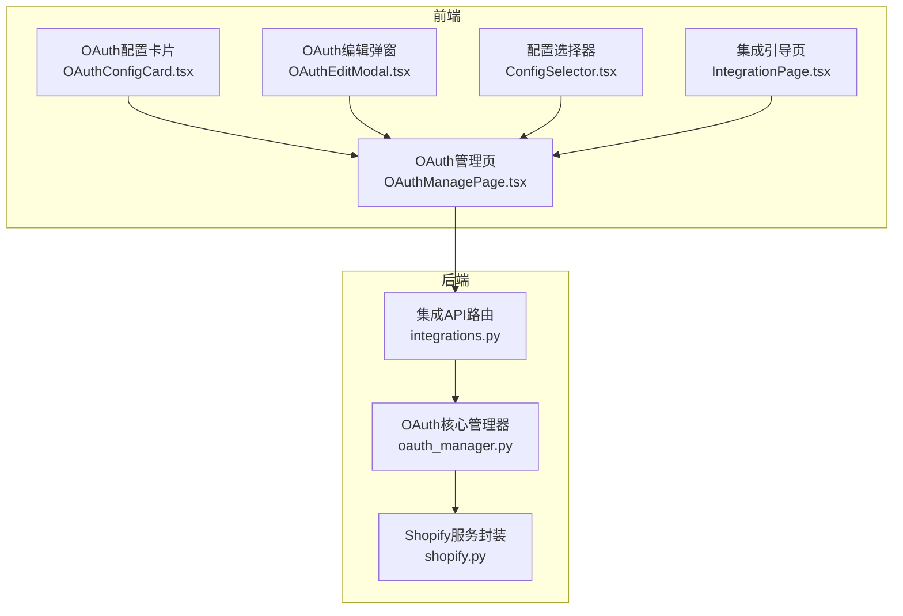
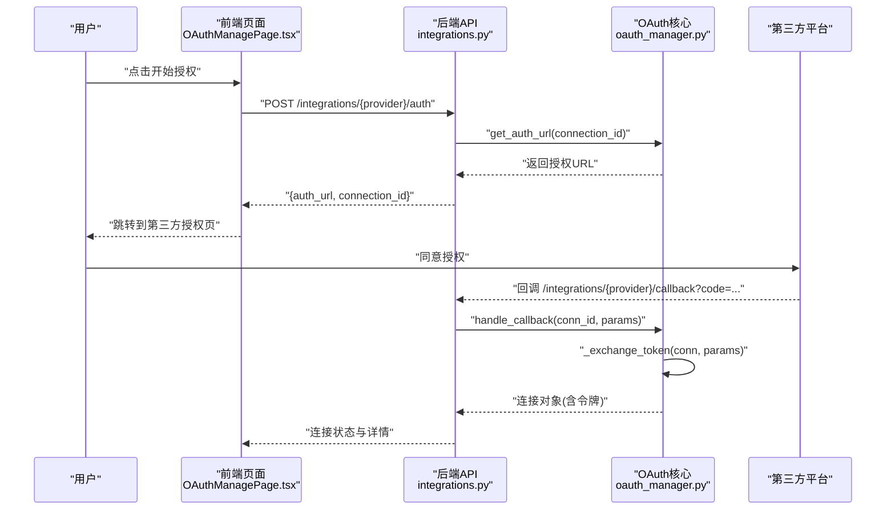
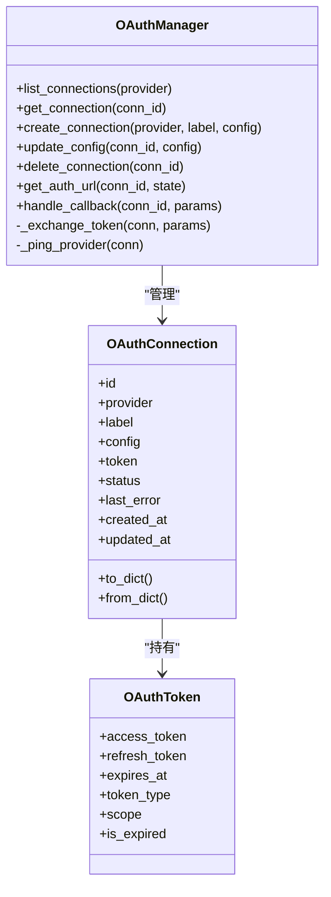
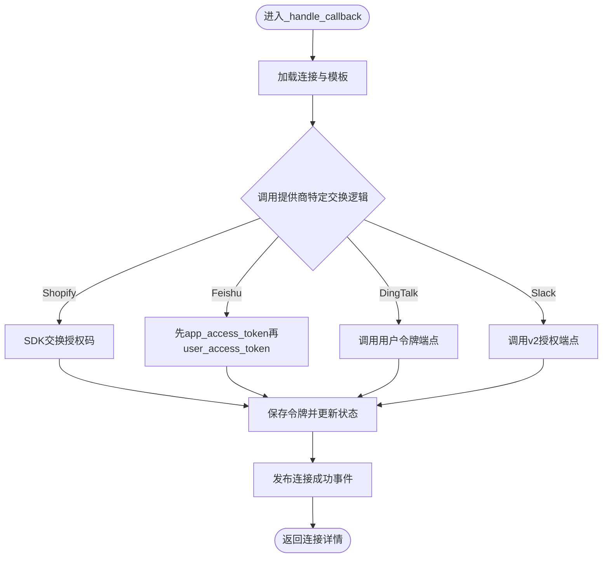
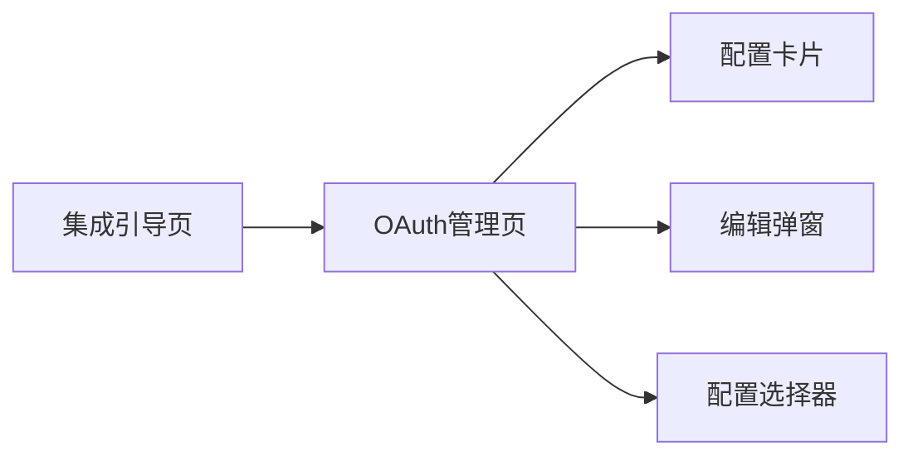
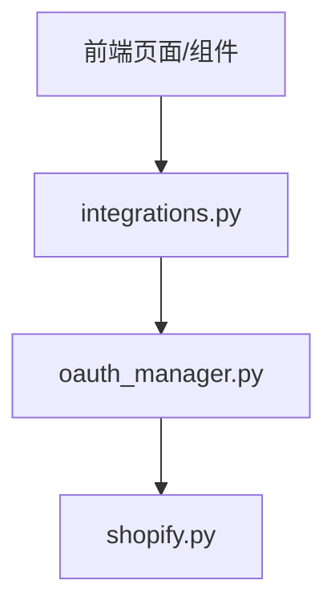

# OAuth2集成

<cite>
**本文引用的文件**
- [oauth_manager.py](file://backend/app/core/oauth_manager.py)
- [integrations.py](file://backend/app/api/integrations.py)
- [shopify.py](file://backend/app/services/shopify.py)
- [OAuthManagePage.tsx](file://frontend/src/pages/config/OAuthManagePage.tsx)
- [IntegrationPage.tsx](file://frontend/src/pages/IntegrationPage.tsx)
- [OAuthConfigCard.tsx](file://frontend/src/components/config/OAuthConfigCard.tsx)
- [OAuthEditModal.tsx](file://frontend/src/components/config/OAuthEditModal.tsx)
- [ConfigSelector.tsx](file://frontend/src/components/config/ConfigSelector.tsx)
</cite>

## 目录
1. [简介](#简介)
2. [项目结构](#项目结构)
3. [核心组件](#核心组件)
4. [架构总览](#架构总览)
5. [详细组件分析](#详细组件分析)
6. [依赖关系分析](#依赖关系分析)
7. [性能考量](#性能考量)
8. [故障排查指南](#故障排查指南)
9. [结论](#结论)
10. [附录：第三方平台接入示例与最佳实践](#附录第三方平台接入示例与最佳实践)

## 简介
本文件面向避风港平台的OAuth2集成系统，系统性阐述OAuth2协议工作原理与四种授权模式在平台中的实现形态；解释第三方认证流程（授权服务器配置、回调处理、令牌交换）、OAuth连接的配置管理与客户端凭证管理、作用域控制、用户授权流程与权限提升、账户绑定机制；并提供GitHub、Google等常见第三方平台的接入参考路径与安全建议（CSRF防护、令牌存储与撤销、重定向攻击与令牌泄露的应对策略）。

## 项目结构
后端采用“核心模块 + API路由 + 前端页面/组件”的分层组织：
- 核心：OAuth2连接与令牌管理由核心模块统一负责，提供连接生命周期管理、授权URL生成、回调处理与令牌交换。
- API：对外暴露集成管理接口，支持创建连接、查询提供商模板、发起授权、处理回调、状态汇总与连接测试。
- 前端：提供OAuth连接管理页面、配置卡片、编辑弹窗与选择器，支撑用户可视化配置与运维。

图表来源
- [integrations.py:40-75](file://backend/app/api/integrations.py#L40-L75)
- [oauth_manager.py:207-264](file://backend/app/core/oauth_manager.py#L207-L264)
- [shopify.py:149-180](file://backend/app/services/shopify.py#L149-L180)
- [OAuthManagePage.tsx:22-73](file://frontend/src/pages/config/OAuthManagePage.tsx#L22-L73)
- [IntegrationPage.tsx:78-138](file://frontend/src/pages/IntegrationPage.tsx#L78-L138)

章节来源
- [integrations.py:40-75](file://backend/app/api/integrations.py#L40-L75)
- [oauth_manager.py:207-264](file://backend/app/core/oauth_manager.py#L207-L264)
- [OAuthManagePage.tsx:22-73](file://frontend/src/pages/config/OAuthManagePage.tsx#L22-L73)

## 核心组件
- OAuthManager：统一管理OAuth连接、生成授权URL、处理回调与令牌交换、连接状态维护与事件广播。
- OAuthConnection/OAuthToken：连接与令牌的数据模型，包含状态枚举、过期判断与序列化。
- Provider模板：集中定义各第三方提供商的授权/令牌端点、默认作用域、参数映射规则。
- API路由：对外提供创建连接、查询模板、发起授权、处理回调、状态汇总与测试连接等接口。
- 前端页面与组件：提供OAuth连接的可视化管理、配置编辑、状态展示与测试能力。

章节来源
- [oauth_manager.py:36-92](file://backend/app/core/oauth_manager.py#L36-L92)
- [oauth_manager.py:100-139](file://backend/app/core/oauth_manager.py#L100-L139)
- [integrations.py:40-75](file://backend/app/api/integrations.py#L40-L75)

## 架构总览
系统遵循“前端发起授权 → 后端生成授权URL → 用户在第三方完成授权 → 回调至后端 → 交换令牌 → 更新连接状态”的闭环流程。Shopify使用其官方SDK进行授权码交换与HMAC校验，其他平台通过HTTP客户端直接调用第三方令牌端点。

图表来源
- [integrations.py:60-75](file://backend/app/api/integrations.py#L60-L75)
- [oauth_manager.py:267-342](file://backend/app/core/oauth_manager.py#L267-L342)

## 详细组件分析

### OAuthManager与连接生命周期
- 连接CRUD：支持列出、获取、创建、更新配置、删除连接；配置变更会更新时间戳并持久化。
- 授权URL生成：根据提供商模板拼装授权URL，注入state、client_id、redirect_uri、scope等参数；部分平台（如Shopify）需替换模板中的占位符。
- 回调处理：接收第三方回调参数，调用令牌交换逻辑，更新连接状态为“已连接”，清空last_error，并广播连接成功事件。
- 令牌交换：针对不同提供商采用差异化策略，Shopify使用SDK交换，飞书/钉钉/Slack通过HTTP POST调用各自令牌端点。
- 连接测试：若令牌过期则标记为过期；否则向提供商发起轻量探测请求以验证连通性与令牌有效性。

图表来源
- [oauth_manager.py:36-92](file://backend/app/core/oauth_manager.py#L36-L92)
- [oauth_manager.py:207-264](file://backend/app/core/oauth_manager.py#L207-L264)
- [oauth_manager.py:343-461](file://backend/app/core/oauth_manager.py#L343-L461)

章节来源
- [oauth_manager.py:207-264](file://backend/app/core/oauth_manager.py#L207-L264)
- [oauth_manager.py:267-342](file://backend/app/core/oauth_manager.py#L267-L342)
- [oauth_manager.py:343-461](file://backend/app/core/oauth_manager.py#L343-L461)

### Provider模板与参数映射
- 模板集中定义：各提供商的授权端点、令牌端点、默认作用域与参数键名映射。
- 参数注入：根据连接配置动态注入client_id、redirect_uri、scope、response_type等；Shopify需替换授权URL中的shop占位符。
- 状态流转：生成授权URL时将连接状态置为“连接中”，回调成功后置为“已连接”，失败或过期分别置为“错误”或“过期”。

章节来源
- [oauth_manager.py:100-139](file://backend/app/core/oauth_manager.py#L100-L139)
- [oauth_manager.py:267-303](file://backend/app/core/oauth_manager.py#L267-L303)

### 回调处理与令牌交换
- Shopify：使用官方SDK进行授权码交换与HMAC校验，返回包含长期令牌与作用域的对象。
- 飞书：先用授权码换取app_access_token，再换取user_access_token，最终返回用户级令牌。
- 钉钉：直接调用用户令牌端点，传入client_id/client_secret/code等参数。
- Slack：调用v2授权端点，提交client_id/client_secret/code等参数获取令牌。

图表来源
- [oauth_manager.py:305-342](file://backend/app/core/oauth_manager.py#L305-L342)
- [oauth_manager.py:343-461](file://backend/app/core/oauth_manager.py#L343-L461)
- [shopify.py:167-180](file://backend/app/services/shopify.py#L167-L180)

章节来源
- [oauth_manager.py:305-342](file://backend/app/core/oauth_manager.py#L305-L342)
- [oauth_manager.py:343-461](file://backend/app/core/oauth_manager.py#L343-L461)
- [shopify.py:167-180](file://backend/app/services/shopify.py#L167-L180)

### 前端集成与用户体验
- OAuth管理页：拉取连接列表与状态汇总，支持编辑、删除、测试连接。
- 配置卡片：展示连接标签、提供商、状态、错误信息与时间戳，便于快速识别异常。
- 编辑弹窗：基于提供商模板动态渲染配置字段，支持新建与编辑模式。
- 配置选择器：在更高层配置中勾选OAuth连接，联动到OAuth管理页。
- 集成引导页：针对GitHub、Slack、钉钉、飞书、Google等平台给出配置步骤提示。

图表来源
- [OAuthManagePage.tsx:22-73](file://frontend/src/pages/config/OAuthManagePage.tsx#L22-L73)
- [OAuthConfigCard.tsx:35-82](file://frontend/src/components/config/OAuthConfigCard.tsx#L35-L82)
- [OAuthEditModal.tsx:37-74](file://frontend/src/components/config/OAuthEditModal.tsx#L37-L74)
- [ConfigSelector.tsx:90-112](file://frontend/src/components/config/ConfigSelector.tsx#L90-L112)
- [IntegrationPage.tsx:78-138](file://frontend/src/pages/IntegrationPage.tsx#L78-L138)

章节来源
- [OAuthManagePage.tsx:22-73](file://frontend/src/pages/config/OAuthManagePage.tsx#L22-L73)
- [OAuthConfigCard.tsx:35-82](file://frontend/src/components/config/OAuthConfigCard.tsx#L35-L82)
- [OAuthEditModal.tsx:37-74](file://frontend/src/components/config/OAuthEditModal.tsx#L37-L74)
- [ConfigSelector.tsx:90-112](file://frontend/src/components/config/ConfigSelector.tsx#L90-L112)
- [IntegrationPage.tsx:78-138](file://frontend/src/pages/IntegrationPage.tsx#L78-L138)

## 依赖关系分析
- 后端耦合点：
  - API路由依赖OAuthManager进行连接管理与授权流程编排。
  - OAuthManager内部依赖Provider模板与各平台SDK/HTTP客户端。
  - Shopify令牌交换通过shopify.py提供的SDK封装。
- 前端耦合点：
  - OAuth管理页通过API封装调用后端接口，驱动UI状态更新。
  - 编辑弹窗根据Provider模板动态生成表单字段，减少硬编码。

图表来源
- [integrations.py:40-75](file://backend/app/api/integrations.py#L40-L75)
- [oauth_manager.py:207-264](file://backend/app/core/oauth_manager.py#L207-L264)
- [shopify.py:149-180](file://backend/app/services/shopify.py#L149-L180)
- [OAuthManagePage.tsx:22-73](file://frontend/src/pages/config/OAuthManagePage.tsx#L22-L73)

章节来源
- [integrations.py:40-75](file://backend/app/api/integrations.py#L40-L75)
- [oauth_manager.py:207-264](file://backend/app/core/oauth_manager.py#L207-L264)
- [shopify.py:149-180](file://backend/app/services/shopify.py#L149-L180)
- [OAuthManagePage.tsx:22-73](file://frontend/src/pages/config/OAuthManagePage.tsx#L22-L73)

## 性能考量
- 异步I/O：令牌交换与提供商探测均使用异步HTTP客户端，避免阻塞主线程。
- 最小化往返：授权URL生成与回调处理在后端完成，前端仅负责导航与展示。
- 状态缓存：连接状态与错误信息在内存中维护并在持久化时批量写入，降低频繁IO。
- 令牌复用：连接测试阶段优先复用已有令牌，减少不必要的重新授权。

## 故障排查指南
- 授权URL为空：检查提供商模板是否存在且为OAuth2类型；确认连接ID有效。
- 回调失败：检查redirect_uri是否与平台配置一致；核对state是否匹配；查看last_error记录。
- 令牌过期：连接状态会标记为过期，需重新发起授权；确保refresh_token可用时可尝试刷新。
- 连接测试失败：检查令牌有效性与提供商端点可达性；查看last_error与网络日志。
- CSRF防护：确保state参数随机且在回调时严格校验；Shopify场景下SDK会自动校验HMAC。

章节来源
- [oauth_manager.py:267-342](file://backend/app/core/oauth_manager.py#L267-L342)
- [oauth_manager.py:441-461](file://backend/app/core/oauth_manager.py#L441-L461)
- [shopify.py:167-180](file://backend/app/services/shopify.py#L167-L180)

## 结论
避风港平台的OAuth2集成以“统一的核心管理器 + 可扩展的Provider模板 + 前后端协同”的方式实现了对多平台的标准化接入。通过严谨的状态管理、回调处理与令牌交换机制，系统能够稳定地完成从授权到令牌落地的全链路流程，并为后续的安全加固与运维监控提供了清晰的扩展点。

## 附录：第三方平台接入示例与最佳实践

### OAuth2四种授权模式在平台中的体现
- 授权码模式（Authorization Code）：平台通过生成授权URL并处理回调换取令牌，适用于Web应用与移动应用的标准接入。
- 隐式模式（Implicit）：平台不直接暴露授权码，适合浏览器端单页应用；平台当前以授权码模式为主，隐式模式需另行适配。
- 密码模式（Resource Owner Password Credentials）：平台未直接暴露密码模式入口，可通过自定义Provider模板与后端适配实现。
- 客户端模式（Client Credentials）：平台未直接暴露客户端模式入口，可通过自定义Provider模板与后端适配实现。

### 常见第三方平台接入参考路径
- GitHub：在编辑弹窗中配置客户端ID/密钥与所需作用域；通过授权URL完成授权后回调交换令牌。
- Google：在编辑弹窗中配置服务账号或OAuth2凭据与API范围；通过授权URL完成授权后回调交换令牌。
- Slack：在编辑弹窗中配置client_id/client_secret与Bot Token Scopes；通过v2授权端点交换令牌。
- 钉钉：在编辑弹窗中配置AppKey/AppSecret与redirect_uri；通过用户令牌端点交换令牌。
- 飞书：在编辑弹窗中配置app_id与redirect_uri；先用授权码换取app_access_token，再换取user_access_token。
- Shopify：使用官方SDK进行授权码交换与HMAC校验，返回长期令牌与作用域。

### 安全建议
- CSRF防护：始终生成并校验state参数；Shopify场景下利用SDK的HMAC校验。
- 令牌存储：仅在内存与本地持久化中存放必要字段；避免明文落盘；定期轮换密钥。
- 令牌撤销：在用户解绑或管理员操作时主动撤销令牌；对过期令牌及时清理。
- 重定向攻击：严格校验redirect_uri与state；拒绝未知来源回调。
- 令牌泄露：限制作用域最小化；启用双因素与审计日志；定期审查连接状态。

章节来源
- [oauth_manager.py:267-342](file://backend/app/core/oauth_manager.py#L267-L342)
- [oauth_manager.py:343-461](file://backend/app/core/oauth_manager.py#L343-L461)
- [IntegrationPage.tsx:78-138](file://frontend/src/pages/IntegrationPage.tsx#L78-L138)
- [OAuthEditModal.tsx:37-74](file://frontend/src/components/config/OAuthEditModal.tsx#L37-L74)
- [shopify.py:149-180](file://backend/app/services/shopify.py#L149-L180)