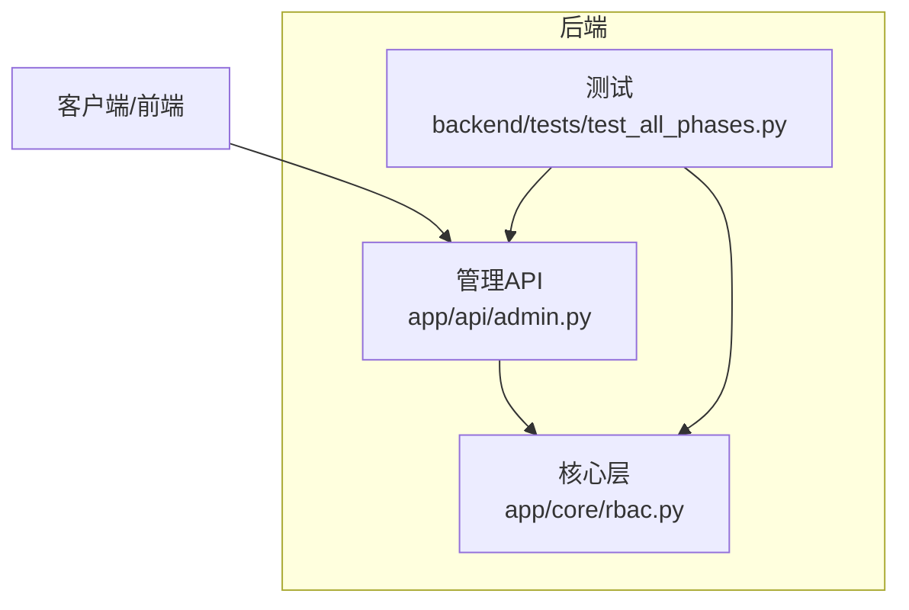
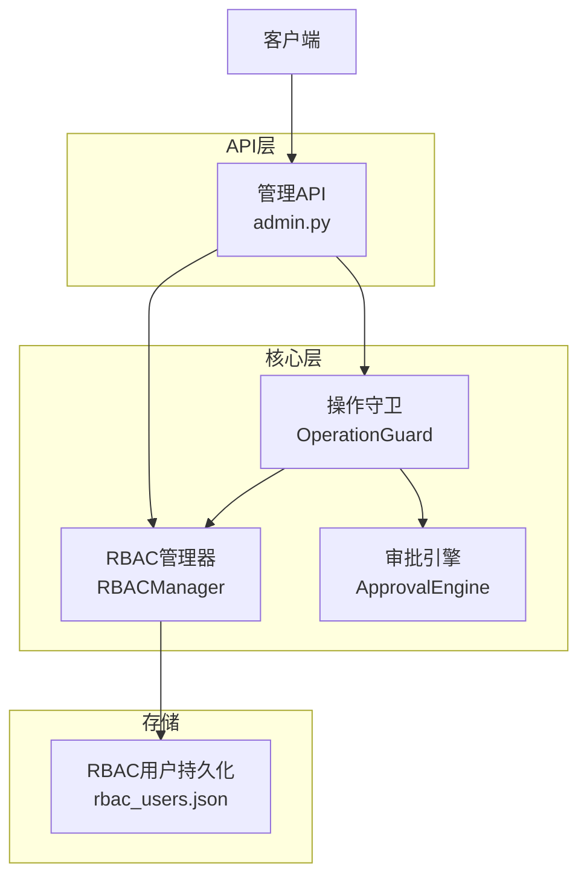
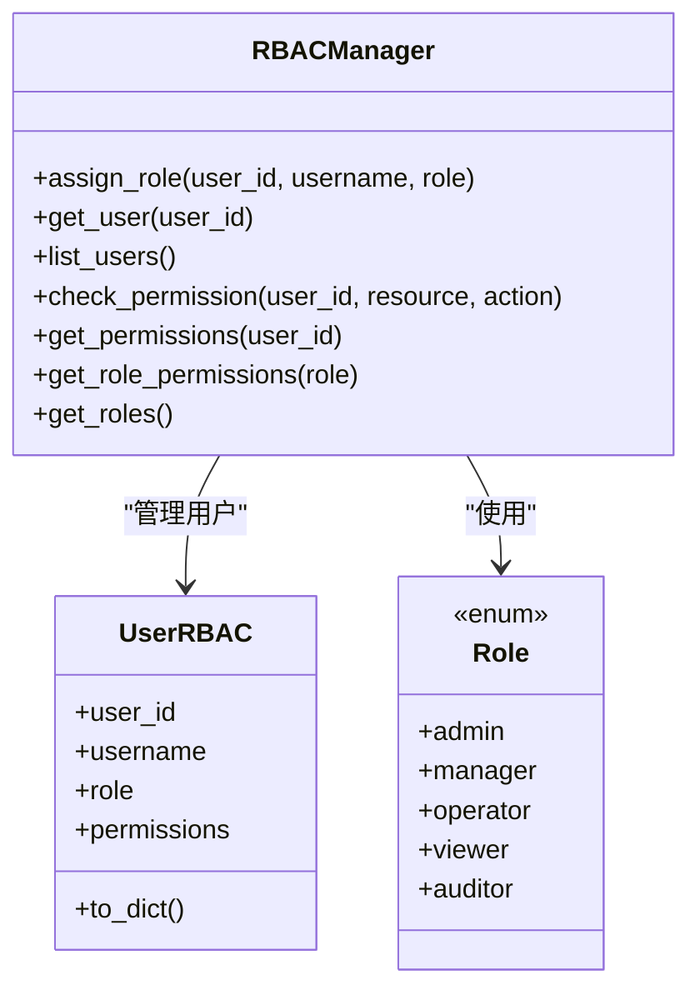
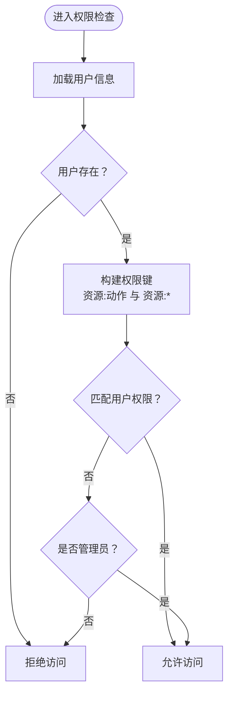
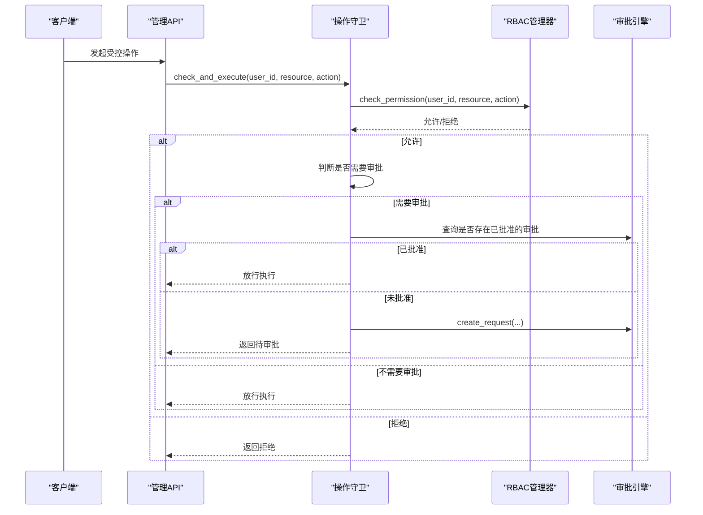
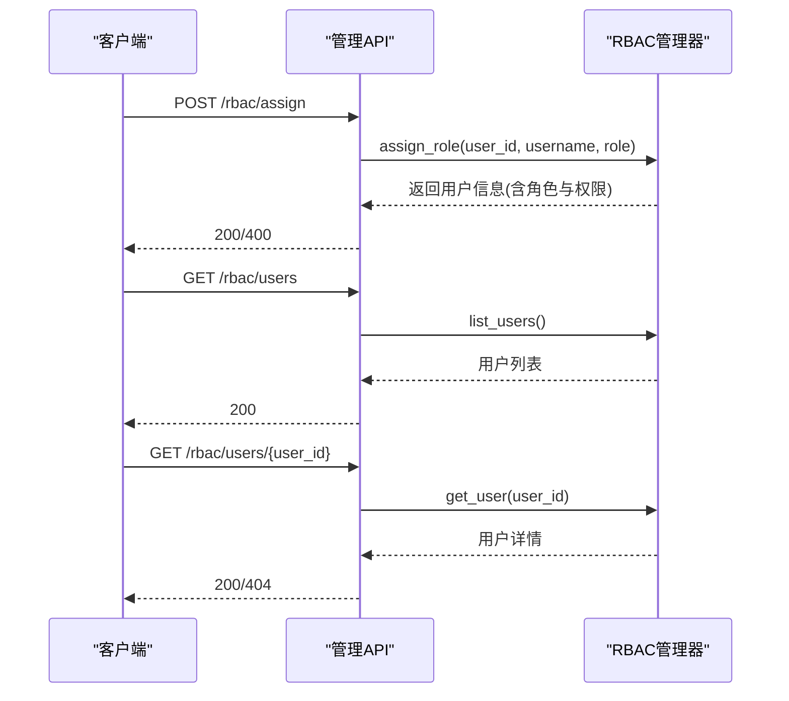
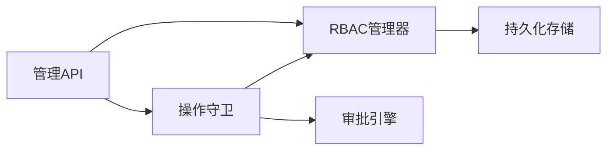

# RBAC权限管理

<cite>
**本文引用的文件**
- [rbac.py](file://backend/app/core/rbac.py)
- [admin.py](file://backend/app/api/admin.py)
- [test_all_phases.py](file://backend/tests/test_all_phases.py)
</cite>

## 目录
1. [简介](#简介)
2. [项目结构](#项目结构)
3. [核心组件](#核心组件)
4. [架构总览](#架构总览)
5. [详细组件分析](#详细组件分析)
6. [依赖分析](#依赖分析)
7. [性能考虑](#性能考虑)
8. [故障排查指南](#故障排查指南)
9. [结论](#结论)
10. [附录](#附录)

## 简介
本文件面向避风港平台的RBAC权限管理系统，系统性阐述基于角色的访问控制模型，包括角色定义、权限分配与继承关系；角色层次结构（管理员、普通用户等）及其权限范围；权限检查机制（细粒度权限控制与资源访问限制）；用户角色管理、批量权限分配与权限审计能力；权限缓存策略、性能优化与并发控制；以及权限配置示例与最佳实践（最小权限原则、权限分离等），并提供针对越权访问等安全问题的解决方案。

## 项目结构
RBAC相关代码集中在后端模块中，核心实现位于核心层，API入口位于管理接口层，测试覆盖了关键流程。

图表来源
- [rbac.py:1-500](file://backend/app/core/rbac.py#L1-L500)
- [admin.py:1-120](file://backend/app/api/admin.py#L1-L120)
- [test_all_phases.py:960-990](file://backend/tests/test_all_phases.py#L960-L990)

章节来源
- [rbac.py:1-500](file://backend/app/core/rbac.py#L1-L500)
- [admin.py:1-120](file://backend/app/api/admin.py#L1-L120)
- [test_all_phases.py:960-990](file://backend/tests/test_all_phases.py#L960-L990)

## 核心组件
- 角色枚举与权限映射：定义角色类型及角色到权限集合的映射，支持按角色批量赋权。
- 用户实体与RBAC管理器：维护用户角色与权限，提供分配、查询、列表、权限检查等能力，并持久化到本地配置文件。
- 操作守卫：在执行业务操作前进行权限检查与审批需求判定，必要时创建审批请求。
- 审批引擎：记录审批请求状态，支持统计与查询。
- 管理API：对外暴露角色分配、用户列表、用户详情、权限查询、权限检查等接口。
- 测试用例：覆盖角色分配、用户列表、权限查询、权限检查等关键路径。

章节来源
- [rbac.py:1-500](file://backend/app/core/rbac.py#L1-L500)
- [admin.py:1-120](file://backend/app/api/admin.py#L1-L120)
- [test_all_phases.py:960-990](file://backend/tests/test_all_phases.py#L960-L990)

## 架构总览
RBAC系统采用“管理器-守卫-引擎”协作模式：管理器负责角色与权限数据，守卫在执行前进行权限与审批校验，引擎负责审批生命周期管理。API层作为统一入口，测试层保障关键流程正确性。

图表来源
- [rbac.py:180-258](file://backend/app/core/rbac.py#L180-L258)
- [rbac.py:256-479](file://backend/app/core/rbac.py#L256-L479)
- [admin.py:39-76](file://backend/app/api/admin.py#L39-L76)

## 详细组件分析

### 角色与权限模型
- 角色枚举：系统定义多种角色，如管理员、经理、操作员、观察者、审计员等，每种角色对应一组预置权限。
- 权限映射：通过角色到权限集合的映射表，实现角色到权限的批量绑定。
- 用户实体：每个用户绑定一个角色，并持有该角色对应的权限集合。

图表来源
- [rbac.py:30-40](file://backend/app/core/rbac.py#L30-L40)
- [rbac.py:186-250](file://backend/app/core/rbac.py#L186-L250)

章节来源
- [rbac.py:30-40](file://backend/app/core/rbac.py#L30-L40)
- [rbac.py:186-250](file://backend/app/core/rbac.py#L186-L250)

### 权限检查机制
- 资源与动作：权限以“资源:动作”的形式表达，支持精确匹配与通配符匹配（资源:*）。
- 检查流程：先匹配用户具体权限，再检查管理员角色的全量放行，最终返回允许或拒绝。
- 细粒度控制：通过资源域与动作组合实现对特定资源的精细化控制。

图表来源
- [rbac.py:210-229](file://backend/app/core/rbac.py#L210-L229)

章节来源
- [rbac.py:210-229](file://backend/app/core/rbac.py#L210-L229)

### 操作守卫与审批流程
- 守卫职责：在执行业务操作前，先进行权限检查；若操作需要审批，则检查是否存在已批准的审批，否则创建审批请求。
- 审批状态：支持查询审批统计（总数、待审、已批准、已拒绝、已取消）。
- 与API协作：管理API调用守卫，确保每次受控操作均经过权限与审批双重校验。

图表来源
- [rbac.py:256-310](file://backend/app/core/rbac.py#L256-L310)
- [rbac.py:310-452](file://backend/app/core/rbac.py#L310-L452)

章节来源
- [rbac.py:256-310](file://backend/app/core/rbac.py#L256-L310)
- [rbac.py:310-452](file://backend/app/core/rbac.py#L310-L452)

### 用户角色管理与批量权限分配
- 分配角色：根据用户ID与用户名分配指定角色，系统自动加载该角色的权限集合并持久化。
- 查询与列表：支持按用户ID查询详情、列出所有用户及其角色与权限。
- 批量权限：通过角色到权限映射实现批量赋权，减少重复配置成本。
- 权限审计：提供用户权限列表查询，便于审计与合规核对。

图表来源
- [admin.py:39-76](file://backend/app/api/admin.py#L39-L76)
- [rbac.py:186-208](file://backend/app/core/rbac.py#L186-L208)

章节来源
- [admin.py:39-76](file://backend/app/api/admin.py#L39-L76)
- [rbac.py:186-208](file://backend/app/core/rbac.py#L186-L208)

### 权限配置示例与角色定义模板
- 角色定义模板（示例字段）
  - 角色标识：字符串，唯一标识角色
  - 描述：角色职责与权限范围说明
  - 权限集合：资源:动作 的列表
- 示例流程
  - 新建角色：在角色映射中新增条目，定义权限集合
  - 分配角色：调用分配接口，将用户绑定到角色
  - 校验权限：调用权限检查接口，验证资源与动作
  - 审计导出：拉取用户权限列表，形成审计报告

章节来源
- [rbac.py:39-120](file://backend/app/core/rbac.py#L39-L120)
- [rbac.py:236-250](file://backend/app/core/rbac.py#L236-L250)
- [admin.py:39-76](file://backend/app/api/admin.py#L39-L76)

### 最佳实践
- 最小权限原则：仅授予完成任务所需的最小权限集合
- 权限分离：敏感操作（如删除、修改配置）与只读权限分离
- 审批流程：高风险操作必须走审批通道，避免直接执行
- 定期审计：导出用户权限清单，定期复核与清理
- 变更治理：角色与权限变更需经审批与记录

## 依赖分析
- 组件耦合
  - 管理API依赖RBAC管理器与操作守卫
  - 操作守卫依赖RBAC管理器与审批引擎
  - RBAC管理器依赖持久化存储（本地JSON文件）
- 外部依赖
  - 无外部服务依赖，权限数据本地持久化
- 潜在循环依赖
  - 当前模块间为单向依赖，无循环

图表来源
- [admin.py:39-76](file://backend/app/api/admin.py#L39-L76)
- [rbac.py:256-479](file://backend/app/core/rbac.py#L256-L479)

章节来源
- [admin.py:39-76](file://backend/app/api/admin.py#L39-L76)
- [rbac.py:256-479](file://backend/app/core/rbac.py#L256-L479)

## 性能考虑
- 缓存策略
  - 内存缓存：RBAC管理器在内存中维护用户与权限，避免频繁IO
  - 持久化：写入操作后落盘，保证重启后状态恢复
- 并发控制
  - 单例管理器：全局共享同一实例，避免多实例竞争
  - 建议：在高并发场景下，可在守卫层增加轻量级锁或队列，防止审批请求风暴
- 性能优化
  - 权限检查：O(n)遍历用户权限，n通常较小；可考虑哈希索引进一步优化
  - 批量操作：通过角色映射一次性赋权，降低重复配置开销

## 故障排查指南
- 常见问题
  - 400 错误：角色无效或参数不合法
  - 404 错误：用户不存在
  - 403 拒绝：权限不足或未满足审批条件
- 排查步骤
  - 确认角色与权限映射是否正确
  - 使用权限查询接口核对用户当前权限
  - 检查审批状态，确认是否存在待审或已拒绝的请求
  - 查看持久化文件是否被意外修改或删除
- 测试验证
  - 使用测试用例覆盖角色分配、用户列表、权限查询与检查等路径

章节来源
- [admin.py:39-76](file://backend/app/api/admin.py#L39-L76)
- [test_all_phases.py:965-989](file://backend/tests/test_all_phases.py#L965-L989)

## 结论
避风港平台的RBAC系统以角色为中心，结合细粒度权限与审批流程，实现了可控、可观测、可审计的权限管理体系。通过最小权限原则、权限分离与定期审计等最佳实践，可有效降低越权与滥用风险。建议在高并发场景下引入更严格的并发控制与缓存优化，持续完善权限治理流程。

## 附录
- 关键接口（摘要）
  - POST /rbac/assign：分配角色
  - GET /rbac/users：用户RBAC列表
  - GET /rbac/users/{user_id}：用户权限详情
  - GET /rbac/users/{user_id}/permissions：用户权限列表
  - POST /rbac/check：权限检查
- 测试用例（摘要）
  - 角色分配与权限检查路径覆盖
  - 用户列表与详情查询路径覆盖

章节来源
- [admin.py:39-76](file://backend/app/api/admin.py#L39-L76)
- [test_all_phases.py:965-989](file://backend/tests/test_all_phases.py#L965-L989)