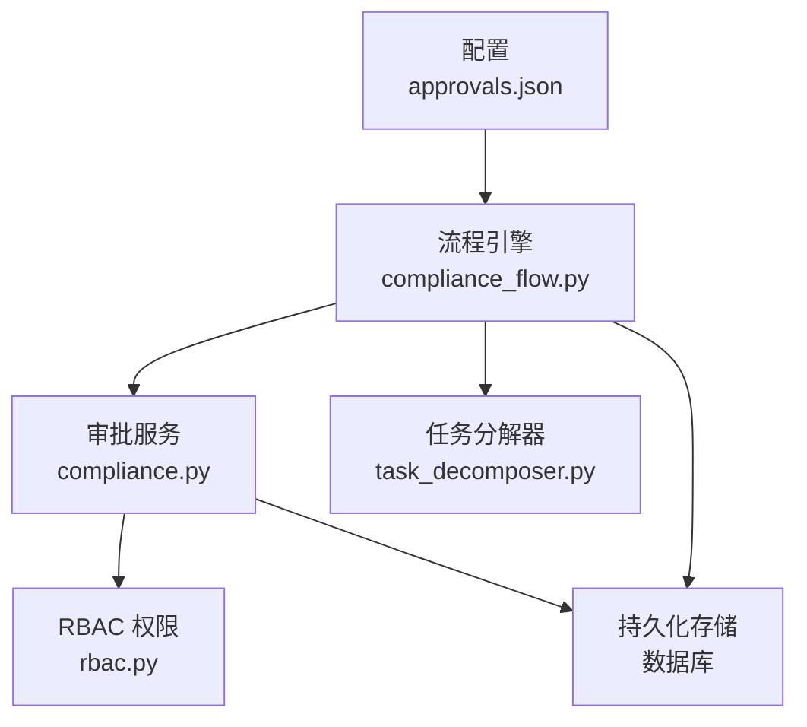
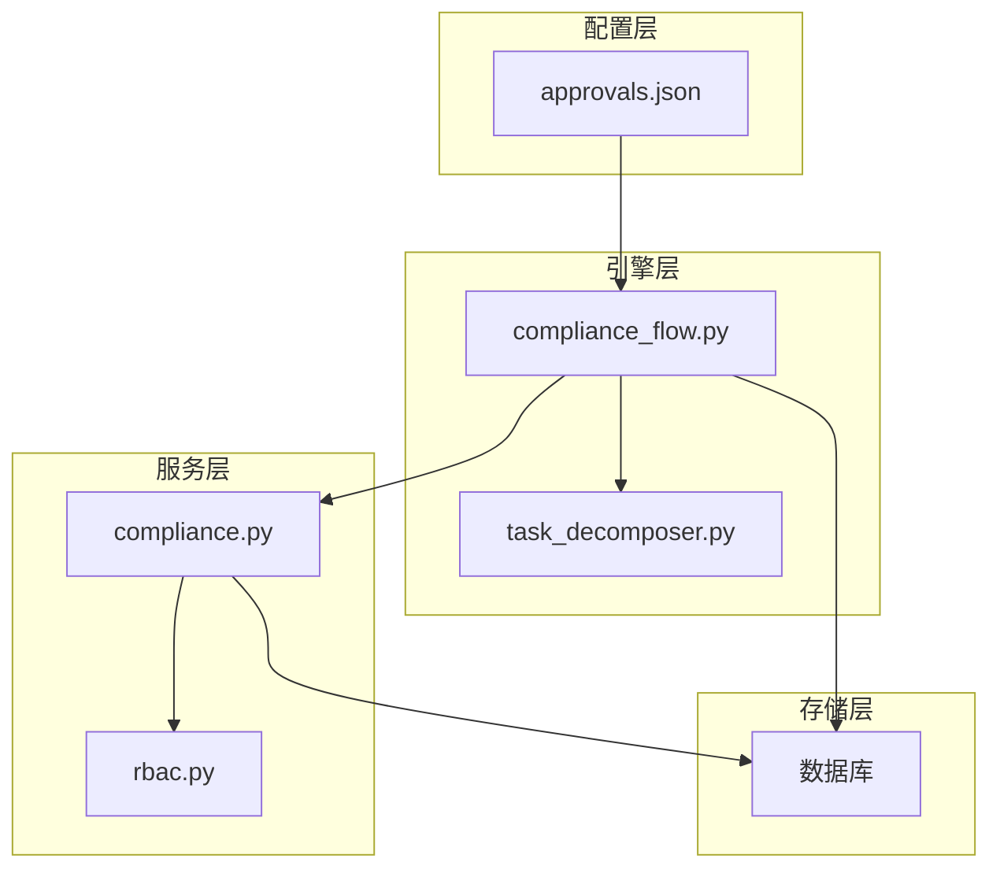
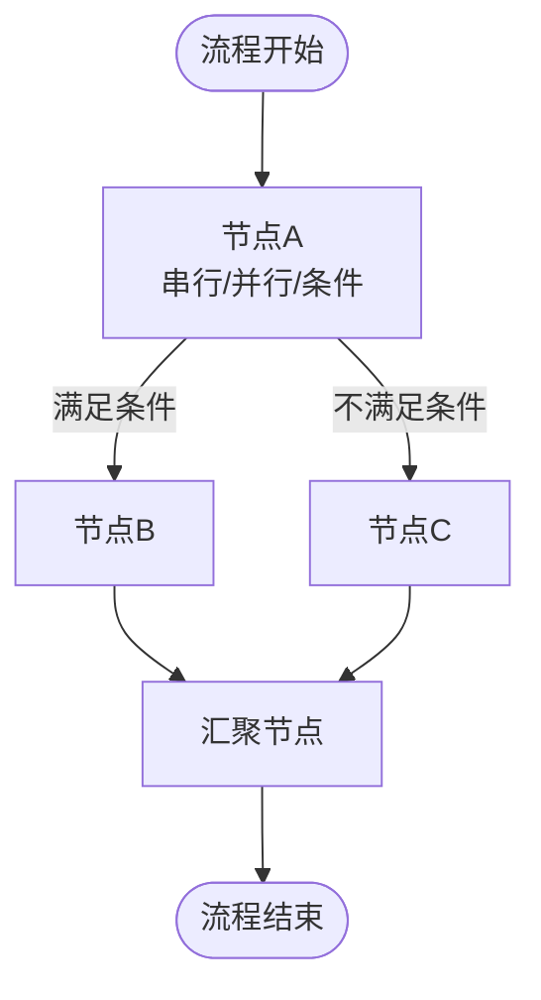
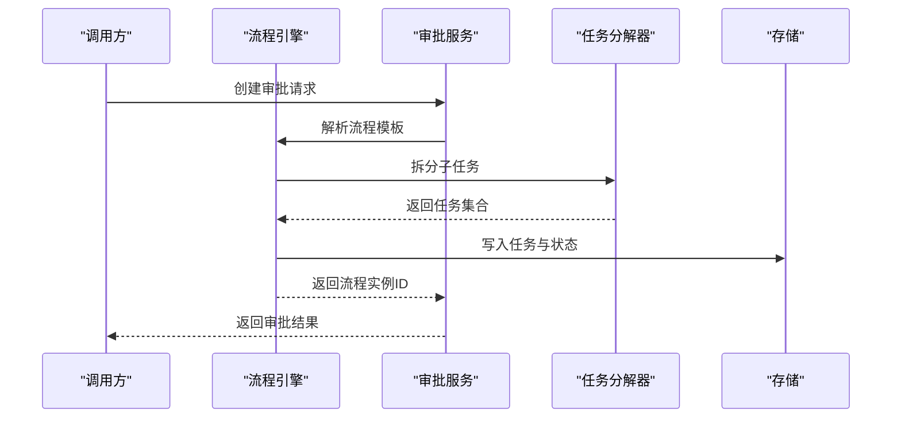
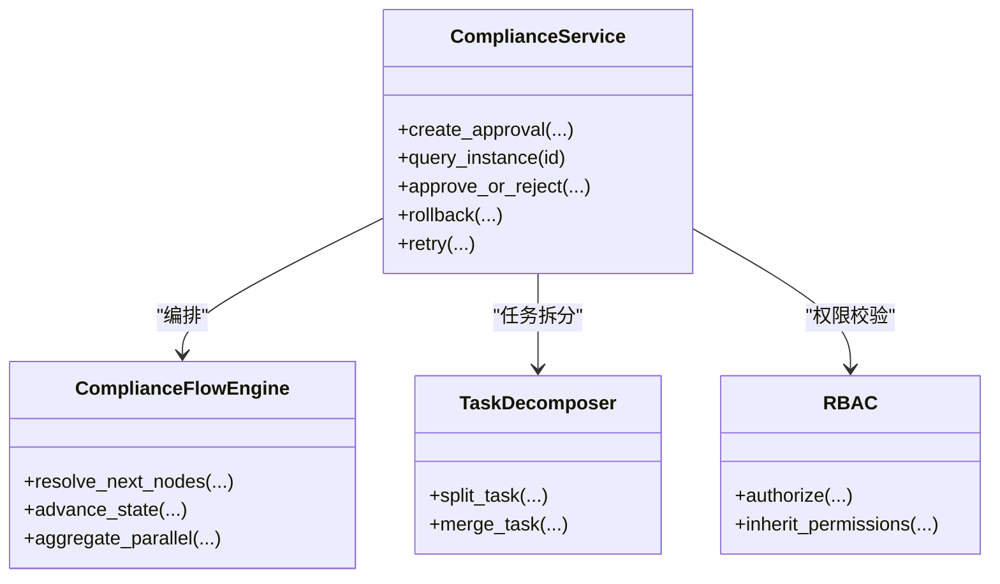
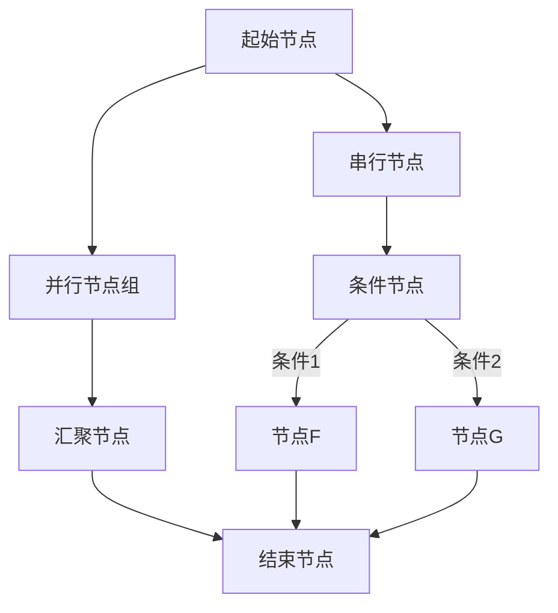
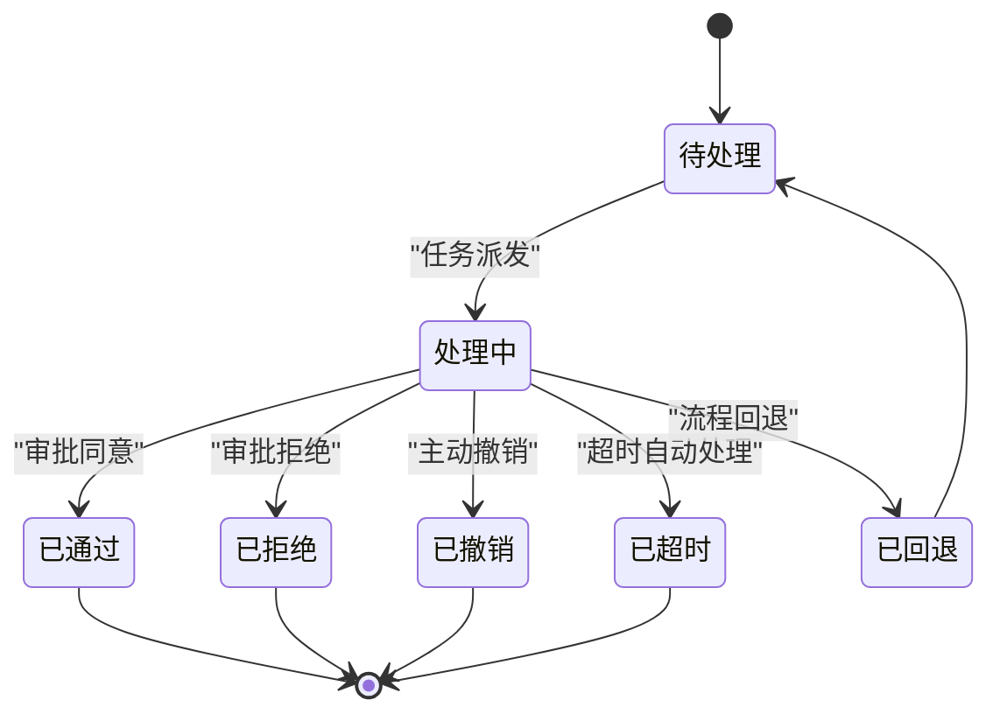
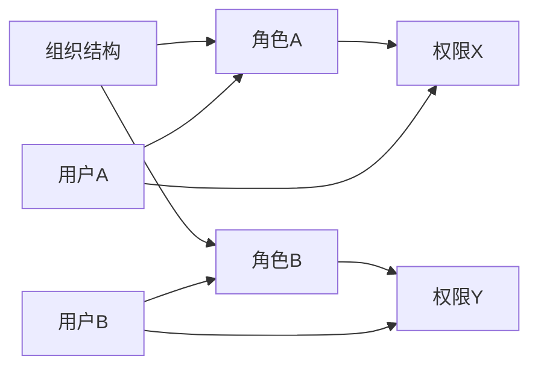
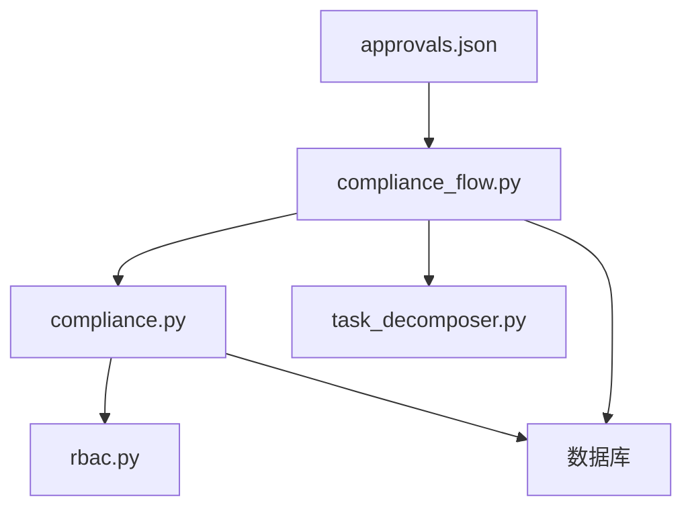

# 审批流程

<cite>
**本文档引用的文件**
- [approvals.json](file://backend/data/config/approvals.json)
- [compliance_flow.py](file://backend/app/core/compliance_flow.py)
- [compliance.py](file://backend/app/services/compliance.py)
- [task_decomposer.py](file://backend/app/core/task_decomposer.py)
- [rbac.py](file://backend/app/core/rbac.py)
</cite>

## 目录
1. [简介](#简介)
2. [项目结构](#项目结构)
3. [核心组件](#核心组件)
4. [架构总览](#架构总览)
5. [详细组件分析](#详细组件分析)
6. [依赖关系分析](#依赖关系分析)
7. [性能考虑](#性能考虑)
8. [故障排查指南](#故障排查指南)
9. [结论](#结论)
10. [附录](#附录)

## 简介
本文件面向避风港平台的审批流程系统，系统性梳理工作流引擎的设计与实现，覆盖流程定义、节点配置、流转规则、审批任务的创建与跟踪、多级审批（串行、并行、条件）、状态管理、超时与提醒机制、权限继承与例外处理、批量与自动审批优化策略，以及常见流程问题的诊断与修复建议。文档以代码级分析为基础，辅以可视化图表，帮助读者从零理解并高效使用该系统。

## 项目结构
审批流程相关的关键位置集中在后端数据配置与核心模块中：
- 数据配置：backend/data/config/approvals.json 提供审批流程的配置入口
- 核心引擎：backend/app/core/compliance_flow.py 实现合规与审批流程的编排
- 服务层：backend/app/services/compliance.py 提供审批服务接口与业务逻辑
- 任务分解：backend/app/core/task_decomposer.py 将复杂审批拆分为可执行子任务
- 权限控制：backend/app/core/rbac.py 提供基于角色的访问控制与权限继承

**图表来源**
- [approvals.json](file://backend/data/config/approvals.json)
- [compliance_flow.py](file://backend/app/core/compliance_flow.py)
- [compliance.py](file://backend/app/services/compliance.py)
- [task_decomposer.py](file://backend/app/core/task_decomposer.py)
- [rbac.py](file://backend/app/core/rbac.py)

**章节来源**
- [approvals.json](file://backend/data/config/approvals.json)
- [compliance_flow.py](file://backend/app/core/compliance_flow.py)
- [compliance.py](file://backend/app/services/compliance.py)
- [task_decomposer.py](file://backend/app/core/task_decomposer.py)
- [rbac.py](file://backend/app/core/rbac.py)

## 核心组件
- 流程定义与配置：通过 approvals.json 维护审批流程模板、节点类型、路由条件与默认策略
- 流程引擎：在 compliance_flow.py 中实现流程解析、节点调度、状态推进与异常处理
- 服务层：compliance.py 对外暴露审批创建、查询、处理、回退等接口，并协调引擎与存储
- 任务分解：task_decomposer.py 将多级审批任务拆解为原子任务，支持并行与条件分支
- 权限控制：rbac.py 提供角色、资源与权限矩阵，支撑审批人选择与操作校验

**章节来源**
- [approvals.json](file://backend/data/config/approvals.json)
- [compliance_flow.py](file://backend/app/core/compliance_flow.py)
- [compliance.py](file://backend/app/services/compliance.py)
- [task_decomposer.py](file://backend/app/core/task_decomposer.py)
- [rbac.py](file://backend/app/core/rbac.py)

## 架构总览
审批系统采用“配置驱动 + 引擎编排 + 服务接口”的分层架构：
- 配置层：以 JSON 描述流程拓扑、节点属性与路由规则
- 引擎层：解析配置，按规则推进状态机，触发任务与通知
- 服务层：封装业务语义，提供审批生命周期管理
- 存储层：持久化流程实例、任务、日志与状态
- 权限层：基于 RBAC 的审批人匹配与操作授权

**图表来源**
- [approvals.json](file://backend/data/config/approvals.json)
- [compliance_flow.py](file://backend/app/core/compliance_flow.py)
- [task_decomposer.py](file://backend/app/core/task_decomposer.py)
- [compliance.py](file://backend/app/services/compliance.py)
- [rbac.py](file://backend/app/core/rbac.py)

## 详细组件分析

### 流程定义与节点配置（approvals.json）
- 流程模板：以流程 ID 为键，包含节点列表、初始节点、结束节点与全局策略
- 节点类型：串行节点、并行节点、条件节点、汇聚节点、回调节点等
- 路由规则：每个节点可配置条件表达式或权重，决定下一节点集合
- 默认策略：超时时间、重试次数、通知模板、权限继承范围

**图表来源**
- [approvals.json](file://backend/data/config/approvals.json)

**章节来源**
- [approvals.json](file://backend/data/config/approvals.json)

### 流程引擎（compliance_flow.py）
- 状态机推进：根据当前节点类型与路由规则，计算下一节点集合，推进流程实例状态
- 任务生成：为每个待执行节点生成审批任务，记录任务上下文与超时信息
- 并行聚合：对并行节点进行聚合判断，等待所有子任务完成或满足收敛条件
- 条件分支：在条件节点根据表达式动态选择下一跳
- 异常处理：捕获节点执行异常，记录错误日志，触发回滚或重试策略

**图表来源**
- [compliance_flow.py](file://backend/app/core/compliance_flow.py)
- [task_decomposer.py](file://backend/app/core/task_decomposer.py)
- [compliance.py](file://backend/app/services/compliance.py)

**章节来源**
- [compliance_flow.py](file://backend/app/core/compliance_flow.py)
- [task_decomposer.py](file://backend/app/core/task_decomposer.py)

### 审批服务（compliance.py）
- 生命周期接口：创建、查询、处理、回退、终止、重试
- 任务派发：依据节点配置与权限矩阵，选择合适的审批人
- 状态同步：将引擎推进结果同步至存储，保证一致性
- 通知集成：对接通知引擎，发送审批提醒与结果通知

**图表来源**
- [compliance.py](file://backend/app/services/compliance.py)
- [compliance_flow.py](file://backend/app/core/compliance_flow.py)
- [task_decomposer.py](file://backend/app/core/task_decomposer.py)
- [rbac.py](file://backend/app/core/rbac.py)

**章节来源**
- [compliance.py](file://backend/app/services/compliance.py)
- [compliance_flow.py](file://backend/app/core/compliance_flow.py)
- [rbac.py](file://backend/app/core/rbac.py)

### 多级审批实现
- 串行审批：节点顺序执行，上一节点完成后推进到下一节点
- 并行审批：同一层级多个子任务并行执行，通过汇聚节点统一收敛
- 条件审批：根据表达式动态选择下一节点集合，支持多路分支与权重

**图表来源**
- [compliance_flow.py](file://backend/app/core/compliance_flow.py)
- [task_decomposer.py](file://backend/app/core/task_decomposer.py)

**章节来源**
- [compliance_flow.py](file://backend/app/core/compliance_flow.py)
- [task_decomposer.py](file://backend/app/core/task_decomposer.py)

### 审批状态管理、超时与提醒
- 状态模型：待处理、处理中、已通过、已拒绝、已撤销、已超时、已回退
- 超时策略：节点级超时时间与全局超时时间，超时后自动推进或终止
- 提醒机制：定时任务扫描即将超时的任务，触发通知与升级策略

**图表来源**
- [compliance_flow.py](file://backend/app/core/compliance_flow.py)
- [compliance.py](file://backend/app/services/compliance.py)

**章节来源**
- [compliance_flow.py](file://backend/app/core/compliance_flow.py)
- [compliance.py](file://backend/app/services/compliance.py)

### 权限继承与例外处理
- 权限继承：基于组织层级的角色继承，审批人优先选择直接负责人，否则向上级递归
- 例外处理：当无可用审批人时，触发升级策略（如管理员代审、邮件通知、转交）
- RBAC 集成：严格的资源与操作授权校验，防止越权操作

**图表来源**
- [rbac.py](file://backend/app/core/rbac.py)

**章节来源**
- [rbac.py](file://backend/app/core/rbac.py)

### 审批效率优化
- 批量处理：合并同类任务、批量派发与批量处理，减少重复开销
- 自动审批：对低风险场景启用自动审批，提升吞吐量
- 任务预热：提前识别并预派发后续节点，缩短响应时间
- 缓存策略：缓存常用配置与权限矩阵，降低查询延迟

**章节来源**
- [compliance_flow.py](file://backend/app/core/compliance_flow.py)
- [compliance.py](file://backend/app/services/compliance.py)
- [task_decomposer.py](file://backend/app/core/task_decomposer.py)

### 审批瓶颈与循环问题治理
- 瓶颈定位：通过任务队列长度、平均处理时长、超时率等指标识别瓶颈节点
- 循环审批：检测并阻止无限循环路径，必要时引入“最大深度”与“环路检测”
- 死锁预防：并行节点必须有明确的汇聚与收敛条件，避免阻塞

**章节来源**
- [compliance_flow.py](file://backend/app/core/compliance_flow.py)
- [task_decomposer.py](file://backend/app/core/task_decomposer.py)

## 依赖关系分析
- 配置依赖：approvals.json 是流程引擎的唯一输入，任何变更需经严格校验
- 引擎耦合：compliance_flow.py 与 task_decomposer.py 协作完成任务拆分与聚合
- 服务边界：compliance.py 作为门面，隔离外部调用与内部实现细节
- 权限约束：rbac.py 为所有审批操作提供授权保障

**图表来源**
- [approvals.json](file://backend/data/config/approvals.json)
- [compliance_flow.py](file://backend/app/core/compliance_flow.py)
- [compliance.py](file://backend/app/services/compliance.py)
- [task_decomposer.py](file://backend/app/core/task_decomposer.py)
- [rbac.py](file://backend/app/core/rbac.py)

**章节来源**
- [approvals.json](file://backend/data/config/approvals.json)
- [compliance_flow.py](file://backend/app/core/compliance_flow.py)
- [compliance.py](file://backend/app/services/compliance.py)
- [task_decomposer.py](file://backend/app/core/task_decomposer.py)
- [rbac.py](file://backend/app/core/rbac.py)

## 性能考虑
- 配置校验：在加载 approvals.json 时进行语法与语义校验，避免运行期错误
- 异步处理：将耗时操作（如通知、外部回调）异步化，降低主流程阻塞
- 分页与限流：对外接口增加分页与限流，防止突发流量冲击
- 监控与告警：埋点关键指标（吞吐、延迟、失败率、超时率），建立告警机制

## 故障排查指南
- 流程卡死：检查是否存在未收敛的并行节点或缺失的汇聚节点
- 审批人为空：核对 RBAC 角色映射与继承链，确认是否有可用候选人
- 超时误判：核查节点超时配置与系统时钟，确保计时准确
- 重复审批：检查幂等键与去重策略，避免并发导致的重复派发
- 回滚异常：确认回滚路径是否可达，必要时手动干预恢复

**章节来源**
- [compliance_flow.py](file://backend/app/core/compliance_flow.py)
- [compliance.py](file://backend/app/services/compliance.py)
- [rbac.py](file://backend/app/core/rbac.py)

## 结论
避风港平台的审批流程系统以配置驱动为核心，结合流程引擎、任务分解与 RBAC 权限体系，实现了从简单到复杂的多级审批能力。通过超时与提醒机制、权限继承与例外处理，系统在可靠性与可维护性方面具备良好基础。建议在生产环境中进一步完善监控与自动化运维，持续优化批量与自动审批策略，以应对高并发与多样化业务场景。

## 附录
- 审批流程配置示例（参考路径）
  - [流程模板示例](file://backend/data/config/approvals.json)
- 自定义流程设计要点
  - 明确节点类型与路由条件
  - 设定超时与重试策略
  - 设计并行与汇聚的收敛条件
  - 预留权限继承与例外处理路径