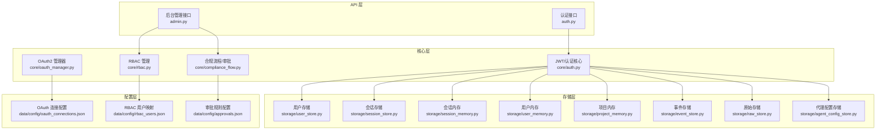
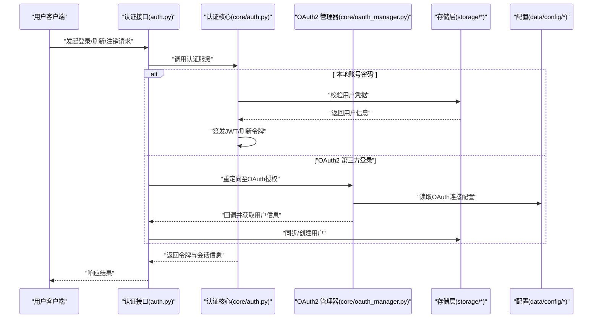
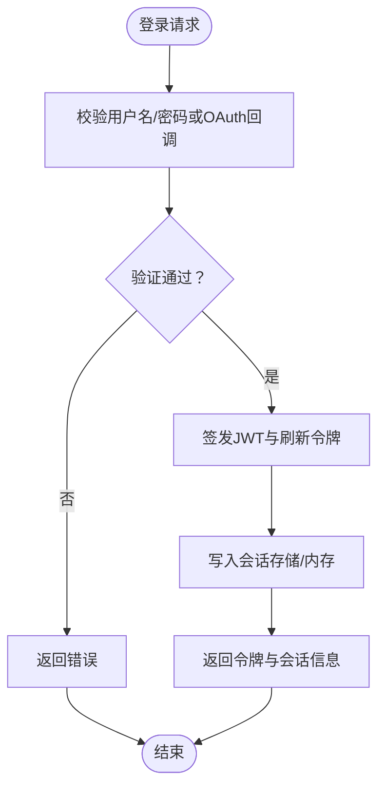
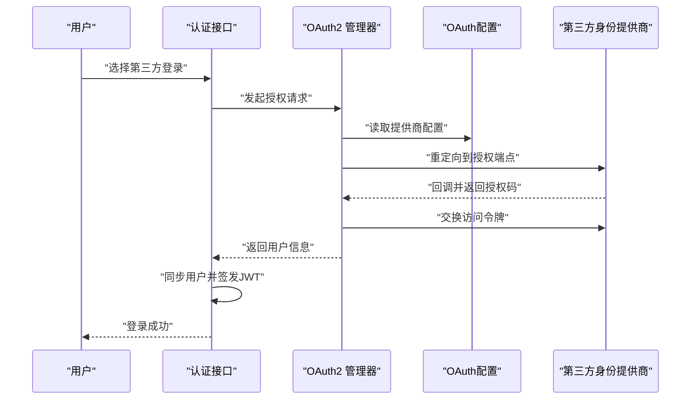
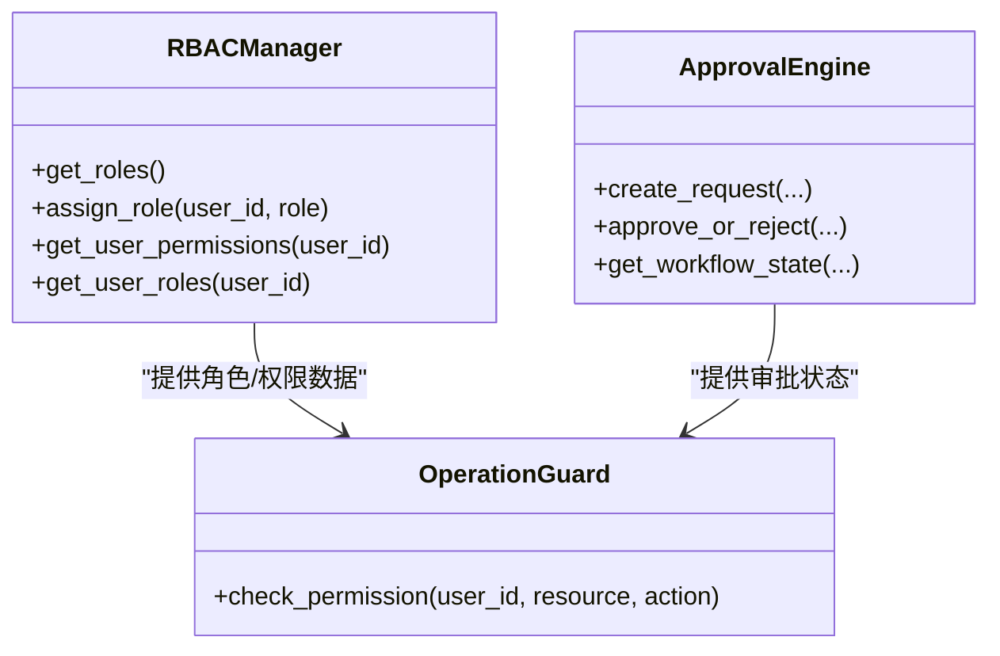
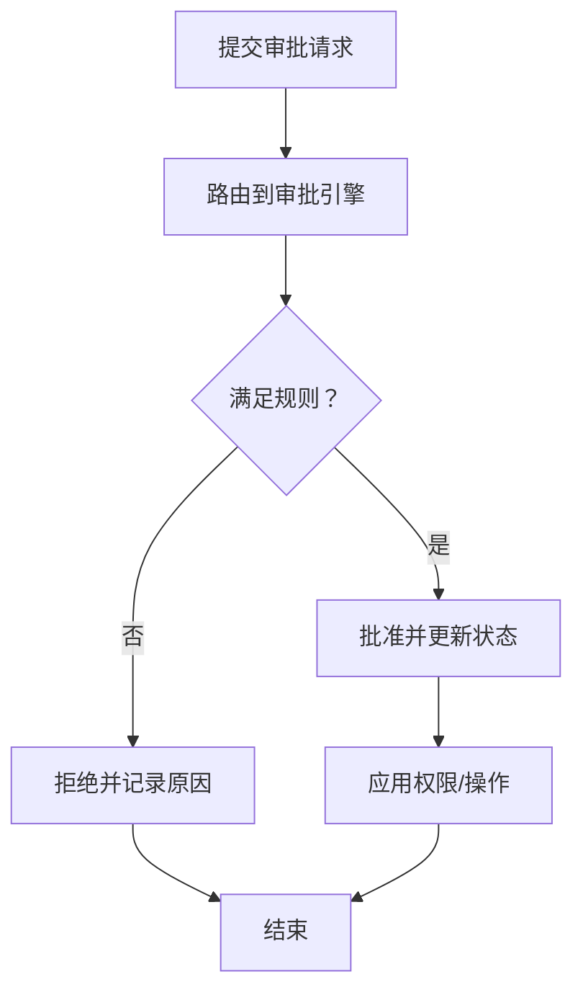
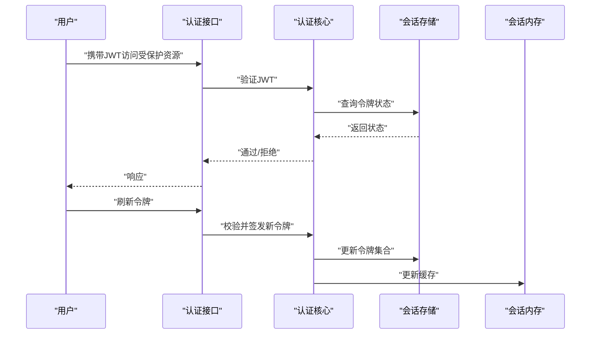
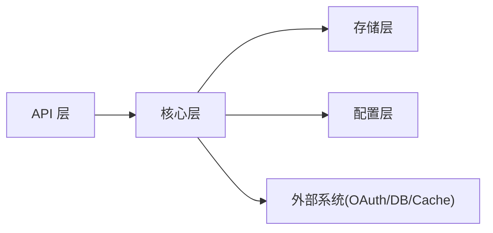

# 认证与授权

<cite>
**本文引用的文件**
- [backend/app/api/auth.py](file://backend/app/api/auth.py)
- [backend/app/core/auth.py](file://backend/app/core/auth.py)
- [backend/app/api/admin.py](file://backend/app/api/admin.py)
- [backend/app/core/rbac.py](file://backend/app/core/rbac.py)
- [backend/app/core/oauth_manager.py](file://backend/app/core/oauth_manager.py)
- [backend/data/config/oauth_connections.json](file://backend/data/config/oauth_connections.json)
- [backend/data/config/rbac_users.json](file://backend/data/config/rbac_users.json)
- [backend/data/config/approvals.json](file://backend/data/config/approvals.json)
- [backend/app/core/compliance_flow.py](file://backend/app/core/compliance_flow.py)
- [backend/app/models/schemas.py](file://backend/app/models/schemas.py)
- [backend/app/models/database.py](file://backend/app/models/database.py)
- [backend/app/storage/user_store.py](file://backend/app/storage/user_store.py)
- [backend/app/storage/session_store.py](file://backend/app/storage/session_store.py)
- [backend/app/storage/session_memory.py](file://backend/app/storage/session_memory.py)
- [backend/app/storage/user_memory.py](file://backend/app/storage/user_memory.py)
- [backend/app/storage/project_memory.py](file://backend/app/storage/project_memory.py)
- [backend/app/storage/event_store.py](file://backend/app/storage/event_store.py)
- [backend/app/storage/raw_store.py](file://backend/app/storage/raw_store.py)
- [backend/app/storage/agent_config_store.py](file://backend/app/storage/agent_config_store.py)
- [backend/app/storage/session_store.py](file://backend/app/storage/session_store.py)
- [backend/app/storage/user_store.py](file://backend/app/storage/user_store.py)
- [backend/app/storage/user_memory.py](file://backend/app/storage/user_memory.py)
- [backend/app/storage/project_memory.py](file://backend/app/storage/project_memory.py)
- [backend/app/storage/event_store.py](file://backend/app/storage/event_store.py)
- [backend/app/storage/raw_store.py](file://backend/app/storage/raw_store.py)
- [backend/app/storage/agent_config_store.py](file://backend/app/storage/agent_config_store.py)
- [backend/app/storage/session_memory.py](file://backend/app/storage/session_memory.py)
- [backend/app/storage/session_store.py](file://backend/app/storage/session_store.py)
- [backend/app/storage/user_store.py](file://backend/app/storage/user_store.py)
- [backend/app/storage/user_memory.py](file://backend/app/storage/user_memory.py)
- [backend/app/storage/project_memory.py](file://backend/app/storage/project_memory.py)
- [backend/app/storage/event_store.py](file://backend/app/storage/event_store.py)
- [backend/app/storage/raw_store.py](file://backend/app/storage/raw_store.py)
- [backend/app/storage/agent_config_store.py](file://backend/app/storage/agent_config_store.py)
- [backend/app/storage/session_memory.py](file://backend/app/storage/session_memory.py)
- [backend/app/storage/session_store.py](file://backend/app/storage/session_store.py)
- [backend/app/storage/user_store.py](file://backend/app/storage/user_store.py)
- [backend/app/storage/user_memory.py](file://backend/app/storage/user_memory.py)
- [backend/app/storage/project_memory.py](file://backend/app/storage/project_memory.py)
- [backend/app/storage/event_store.py](file://backend/app/storage/event_store.py)
- [backend/app/storage/raw_store.py](file://backend/app/storage/raw_store.py)
- [backend/app/storage/agent_config_store.py](file://backend/app/storage/agent_config_store.py)
- [backend/app/storage/session_memory.py](file://backend/app/storage/session_memory.py)
- [backend/app/storage/session_store.py](file://backend/app/storage/session_store.py)
- [backend/app/storage/user_store.py](file://backend/app/storage/user_store.py)
- [backend/app/storage/user_memory.py](file://backend/app/storage/user_memory.py)
- [backend/app/storage/project_memory.py](file://backend/app/storage/project_memory.py)
- [backend/app/storage/event_store.py](file://backend/app/storage/event_store.py)
- [backend/app/storage/raw_store.py](file://backend/app/storage/raw_store.py)
- [backend/app/storage/agent_config_store.py](file://backend/app/storage/agent_config_store.py)
- [backend/app/storage/session_memory.py](file://backend/app/storage/session_memory.py)
- [backend/app/storage/session_store.py](file://backend/app/storage/session_store.py)
- [backend/app/storage/user_store.py](file://backend/app/storage/user_store.py)
- [backend/app/storage/user_memory.py](file://backend/app/storage/user_memory.py)
- [backend/app/storage/project_memory.py](file://backend/app/storage/project_memory.py)
- [backend/app/storage/event_store.py](file://backend/app/storage/event_store.py)
- [backend/app/storage/raw_store.py](file://backend/app/storage/raw_store.py)
- [backend/app/storage/agent_config_store.py](file://backend/app/storage/agent_config_store.py)
- [backend/app/storage/session_memory.py](file://backend/app/storage/session_memory.py)
- [backend/app/storage/session_store.py](file://backend/app/storage/session_store.py)
- [backend/app/storage/user_store.py](file://backend/app/storage/user_store.py)
- [backend/app/storage/user_memory.py](file://backend/app/storage/user_memory.py)
- [backend/app/storage/project_memory.py](file://backend/app/storage/project_memory.py)
- [backend/app/storage/event_store.py](file://backend/app/storage/event_store.py)
- [backend/app/storage/raw_store.py](file://backend/app/storage/raw_store.py)
- [backend/app/storage/agent_config_store.py](file://backend/app/storage/agent_config_store.py)
- [backend/app/storage/session_memory.py](file://backend/app/storage/session_memory.py)
- [backend/app/storage/session_store.py](file://backend/app/storage/session_store.py)
- [backend/app/storage/user_store.py](file://backend/app/storage/user_store.py)
- [backend/app/storage/user_memory.py](file://backend/app/storage/user_memory.py)
- [backend/app/storage/project_memory.py](file://backend/app/storage/project_memory.py)
- [backend/app/storage/event_store.py](file://backend/app/storage/event_store.py)
- [backend/app/storage/raw_store.py](file://backend/app/storage/raw......)
</cite>

## 目录
1. [简介](#简介)
2. [项目结构](#项目结构)
3. [核心组件](#核心组件)
4. [架构总览](#架构总览)
5. [详细组件分析](#详细组件分析)
6. [依赖关系分析](#依赖关系分析)
7. [性能考量](#性能考量)
8. [故障排查指南](#故障排查指南)
9. [结论](#结论)
10. [附录](#附录)

## 简介
本文件面向避风港平台的认证与授权体系，覆盖以下主题：
- JWT认证机制：令牌生成、验证与刷新流程
- OAuth2集成：配置方法、第三方登录流程与安全要点
- RBAC权限管理：角色定义、权限分配与访问控制策略
- 审批流程：工作流设计、状态跟踪与合规控制
- 安全最佳实践：令牌管理、会话处理与常见风险防护
- 配置示例与集成指南：基于数据配置文件的实际落地

## 项目结构
后端采用分层架构，认证与授权相关的关键模块分布如下：
- API层：对外暴露认证、RBAC、审批等接口
- 核心层：JWT、OAuth2、RBAC、审批引擎、合规流程等核心逻辑
- 存储层：用户、会话、内存、事件等持久化与缓存
- 配置层：OAuth连接、RBAC用户映射、审批规则等静态配置

图表来源
- [backend/app/api/auth.py](file://backend/app/api/auth.py)
- [backend/app/api/admin.py](file://backend/app/api/admin.py)
- [backend/app/core/auth.py](file://backend/app/core/auth.py)
- [backend/app/core/oauth_manager.py](file://backend/app/core/oauth_manager.py)
- [backend/app/core/rbac.py](file://backend/app/core/rbac.py)
- [backend/app/core/compliance_flow.py](file://backend/app/core/compliance_flow.py)
- [backend/app/storage/user_store.py](file://backend/app/storage/user_store.py)
- [backend/app/storage/session_store.py](file://backend/app/storage/session_store.py)
- [backend/app/storage/session_memory.py](file://backend/app/storage/session_memory.py)
- [backend/app/storage/user_memory.py](file://backend/app/storage/user_memory.py)
- [backend/app/storage/project_memory.py](file://backend/app/storage/project_memory.py)
- [backend/app/storage/event_store.py](file://backend/app/storage/event_store.py)
- [backend/app/storage/raw_store.py](file://backend/app/storage/raw_store.py)
- [backend/app/storage/agent_config_store.py](file://backend/app/storage/agent_config_store.py)
- [backend/data/config/oauth_connections.json](file://backend/data/config/oauth_connections.json)
- [backend/data/config/rbac_users.json](file://backend/data/config/rbac_users.json)
- [backend/data/config/approvals.json](file://backend/data/config/approvals.json)

章节来源
- [backend/app/api/auth.py](file://backend/app/api/auth.py)
- [backend/app/api/admin.py](file://backend/app/api/admin.py)
- [backend/app/core/auth.py](file://backend/app/core/auth.py)
- [backend/app/core/oauth_manager.py](file://backend/app/core/oauth_manager.py)
- [backend/app/core/rbac.py](file://backend/app/core/rbac.py)
- [backend/app/core/compliance_flow.py](file://backend/app/core/compliance_flow.py)
- [backend/app/storage/user_store.py](file://backend/app/storage/user_store.py)
- [backend/app/storage/session_store.py](file://backend/app/storage/session_store.py)
- [backend/app/storage/session_memory.py](file://backend/app/storage/session_memory.py)
- [backend/app/storage/user_memory.py](file://backend/app/storage/user_memory.py)
- [backend/app/storage/project_memory.py](file://backend/app/storage/project_memory.py)
- [backend/app/storage/event_store.py](file://backend/app/storage/event_store.py)
- [backend/app/storage/raw_store.py](file://backend/app/storage/raw_store.py)
- [backend/app/storage/agent_config_store.py](file://backend/app/storage/agent_config_store.py)
- [backend/data/config/oauth_connections.json](file://backend/data/config/oauth_connections.json)
- [backend/data/config/rbac_users.json](file://backend/data/config/rbac_users.json)
- [backend/data/config/approvals.json](file://backend/data/config/approvals.json)

## 核心组件
- 认证与会话管理：负责用户登录、JWT签发与校验、会话存储与清理
- OAuth2集成：对接第三方平台，统一登录入口与用户信息同步
- RBAC权限管理：角色-权限模型、用户角色分配、权限判定
- 审批与合规流程：工作流编排、状态流转、审计与追踪
- 存储与内存：用户、会话、事件、项目等多维度数据持久化与缓存

章节来源
- [backend/app/core/auth.py](file://backend/app/core/auth.py)
- [backend/app/core/oauth_manager.py](file://backend/app/core/oauth_manager.py)
- [backend/app/core/rbac.py](file://backend/app/core/rbac.py)
- [backend/app/core/compliance_flow.py](file://backend/app/core/compliance_flow.py)
- [backend/app/storage/user_store.py](file://backend/app/storage/user_store.py)
- [backend/app/storage/session_store.py](file://backend/app/storage/session_store.py)
- [backend/app/storage/session_memory.py](file://backend/app/storage/session_memory.py)
- [backend/app/storage/user_memory.py](file://backend/app/storage/user_memory.py)
- [backend/app/storage/project_memory.py](file://backend/app/storage/project_memory.py)
- [backend/app/storage/event_store.py](file://backend/app/storage/event_store.py)
- [backend/app/storage/raw_store.py](file://backend/app/storage/raw_store.py)
- [backend/app/storage/agent_config_store.py](file://backend/app/storage/agent_config_store.py)

## 架构总览
认证与授权的整体交互流程如下：

图表来源
- [backend/app/api/auth.py](file://backend/app/api/auth.py)
- [backend/app/core/auth.py](file://backend/app/core/auth.py)
- [backend/app/core/oauth_manager.py](file://backend/app/core/oauth_manager.py)
- [backend/app/storage/user_store.py](file://backend/app/storage/user_store.py)
- [backend/data/config/oauth_connections.json](file://backend/data/config/oauth_connections.json)

## 详细组件分析

### JWT认证机制
- 令牌生成：登录成功后由认证核心生成JWT，包含用户标识、角色与过期时间等声明
- 令牌验证：请求携带JWT，认证中间件解析并校验签名与有效期，注入当前用户上下文
- 刷新策略：支持刷新令牌轮换，降低泄露风险；会话存储记录活跃令牌集合
- 会话处理：会话存储与内存缓存结合，保障并发场景下的状态一致性

图表来源
- [backend/app/core/auth.py](file://backend/app/core/auth.py)
- [backend/app/storage/session_store.py](file://backend/app/storage/session_store.py)
- [backend/app/storage/session_memory.py](file://backend/app/storage/session_memory.py)

章节来源
- [backend/app/core/auth.py](file://backend/app/core/auth.py)
- [backend/app/storage/session_store.py](file://backend/app/storage/session_store.py)
- [backend/app/storage/session_memory.py](file://backend/app/storage/session_memory.py)

### OAuth2集成
- 配置方法：在OAuth连接配置中定义提供商参数（如客户端ID/密钥、授权/令牌端点、回调地址）
- 授权流程：重定向至第三方授权页，回调后换取访问令牌并拉取用户信息
- 用户同步：根据第三方用户标识在系统内创建或更新用户记录
- 安全考虑：严格校验回调URL、CSRF防护、令牌加密存储、最小权限授权

图表来源
- [backend/app/core/oauth_manager.py](file://backend/app/core/oauth_manager.py)
- [backend/data/config/oauth_connections.json](file://backend/data/config/oauth_connections.json)
- [backend/app/storage/user_store.py](file://backend/app/storage/user_store.py)

章节来源
- [backend/app/core/oauth_manager.py](file://backend/app/core/oauth_manager.py)
- [backend/data/config/oauth_connections.json](file://backend/data/config/oauth_connections.json)
- [backend/app/storage/user_store.py](file://backend/app/storage/user_store.py)

### RBAC权限管理
- 角色定义：系统内置角色（如管理员、查看者、审计员、操作员），可通过配置文件扩展
- 权限分配：将角色授予用户，支持批量与单个分配
- 访问控制：基于角色与资源权限进行细粒度控制，支持动态权限查询
- 管理接口：提供角色列表、用户角色分配、用户权限详情等REST接口

图表来源
- [backend/app/core/rbac.py](file://backend/app/core/rbac.py)
- [backend/app/api/admin.py](file://backend/app/api/admin.py)
- [backend/data/config/rbac_users.json](file://backend/data/config/rbac_users.json)

章节来源
- [backend/app/core/rbac.py](file://backend/app/core/rbac.py)
- [backend/app/api/admin.py](file://backend/app/api/admin.py)
- [backend/data/config/rbac_users.json](file://backend/data/config/rbac_users.json)

### 审批流程与合规
- 工作流设计：基于配置定义审批节点、路由条件与决策规则
- 状态跟踪：记录审批请求的生命周期状态（待审/已批准/已拒绝/已取消）
- 合规控制：与RBAC联动，在关键操作前强制审批，确保最小权限与可追溯性
- 数据持久化：审批请求与历史记录存储于事件与原始存储中

图表来源
- [backend/app/core/compliance_flow.py](file://backend/app/core/compliance_flow.py)
- [backend/data/config/approvals.json](file://backend/data/config/approvals.json)
- [backend/app/storage/event_store.py](file://backend/app/storage/event_store.py)
- [backend/app/storage/raw_store.py](file://backend/app/storage/raw_store.py)

章节来源
- [backend/app/core/compliance_flow.py](file://backend/app/core/compliance_flow.py)
- [backend/data/config/approvals.json](file://backend/data/config/approvals.json)
- [backend/app/storage/event_store.py](file://backend/app/storage/event_store.py)
- [backend/app/storage/raw_store.py](file://backend/app/storage/raw_store.py)

### 会话与令牌管理
- 令牌生命周期：签发、刷新、吊销与自动过期
- 会话存储：记录活跃令牌集合，支持并发校验与快速吊销
- 内存缓存：热点用户与会话信息缓存，降低数据库压力
- 安全策略：短令牌有效期、刷新令牌轮换、防重放攻击

图表来源
- [backend/app/core/auth.py](file://backend/app/core/auth.py)
- [backend/app/storage/session_store.py](file://backend/app/storage/session_store.py)
- [backend/app/storage/session_memory.py](file://backend/app/storage/session_memory.py)

章节来源
- [backend/app/core/auth.py](file://backend/app/core/auth.py)
- [backend/app/storage/session_store.py](file://backend/app/storage/session_store.py)
- [backend/app/storage/session_memory.py](file://backend/app/storage/session_memory.py)

## 依赖关系分析
- 组件耦合：认证核心依赖存储层与配置层；RBAC与审批引擎通过管理器提供统一接口；API层仅依赖核心服务
- 外部依赖：OAuth2提供商、数据库、缓存与事件存储
- 可能的循环依赖：当前结构以“API → 核心 → 存储/配置”单向依赖为主，未见明显循环

图表来源
- [backend/app/api/auth.py](file://backend/app/api/auth.py)
- [backend/app/core/auth.py](file://backend/app/core/auth.py)
- [backend/app/core/oauth_manager.py](file://backend/app/core/oauth_manager.py)
- [backend/app/core/rbac.py](file://backend/app/core/rbac.py)
- [backend/app/core/compliance_flow.py](file://backend/app/core/compliance_flow.py)
- [backend/app/storage/user_store.py](file://backend/app/storage/user_store.py)
- [backend/data/config/oauth_connections.json](file://backend/data/config/oauth_connections.json)

章节来源
- [backend/app/api/auth.py](file://backend/app/api/auth.py)
- [backend/app/core/auth.py](file://backend/app/core/auth.py)
- [backend/app/core/oauth_manager.py](file://backend/app/core/oauth_manager.py)
- [backend/app/core/rbac.py](file://backend/app/core/rbac.py)
- [backend/app/core/compliance_flow.py](file://backend/app/core/compliance_flow.py)
- [backend/app/storage/user_store.py](file://backend/app/storage/user_store.py)
- [backend/data/config/oauth_connections.json](file://backend/data/config/oauth_connections.json)

## 性能考量
- 缓存策略：会话内存与用户内存缓存热点数据，减少数据库查询
- 并发控制：会话存储采用原子操作维护令牌集合，避免竞态
- 负载均衡：令牌验证可在多实例间共享，建议使用集中式缓存或数据库
- 日志与监控：对认证失败、令牌吊销、OAuth回调异常进行告警

## 故障排查指南
- 登录失败
  - 检查用户名/密码或OAuth回调是否正确
  - 查看认证核心日志与存储层错误
- 令牌无效
  - 核对JWT签名算法与密钥配置
  - 确认会话存储中的令牌状态与过期时间
- OAuth回调异常
  - 校验回调URL与提供商配置
  - 检查CSRF与重放防护设置
- RBAC权限异常
  - 确认角色分配与权限映射配置
  - 使用管理接口查询用户权限详情
- 审批流程卡住
  - 检查审批规则与工作流配置
  - 查看事件存储中的历史记录

章节来源
- [backend/app/core/auth.py](file://backend/app/core/auth.py)
- [backend/app/core/oauth_manager.py](file://backend/app/core/oauth_manager.py)
- [backend/app/core/rbac.py](file://backend/app/core/rbac.py)
- [backend/app/core/compliance_flow.py](file://backend/app/core/compliance_flow.py)
- [backend/app/storage/session_store.py](file://backend/app/storage/session_store.py)
- [backend/app/storage/event_store.py](file://backend/app/storage/event_store.py)

## 结论
避风港平台的认证与授权体系以JWT为核心，结合OAuth2、RBAC与审批流程，形成完整的安全闭环。通过配置驱动与模块化设计，系统具备良好的可扩展性与可运维性。建议在生产环境中强化令牌安全策略、完善监控告警，并持续优化权限模型与审批规则。

## 附录

### 配置示例与集成指南
- OAuth连接配置
  - 在OAuth连接配置中添加提供商参数，确保回调URL与密钥安全存储
  - 参考路径：[oauth_connections.json](file://backend/data/config/oauth_connections.json)
- RBAC用户映射
  - 将用户与角色进行绑定，支持批量导入与动态调整
  - 参考路径：[rbac_users.json](file://backend/data/config/rbac_users.json)
- 审批规则配置
  - 定义审批节点、路由条件与决策规则，确保合规要求可追溯
  - 参考路径：[approvals.json](file://backend/data/config/approvals.json)

章节来源
- [backend/data/config/oauth_connections.json](file://backend/data/config/oauth_connections.json)
- [backend/data/config/rbac_users.json](file://backend/data/config/rbac_users.json)
- [backend/data/config/approvals.json](file://backend/data/config/approvals.json)