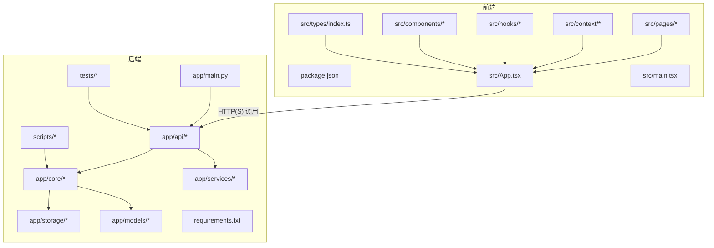
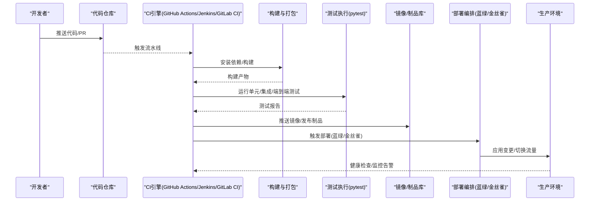
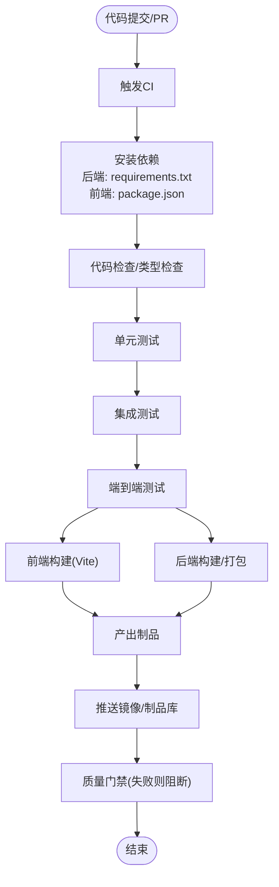
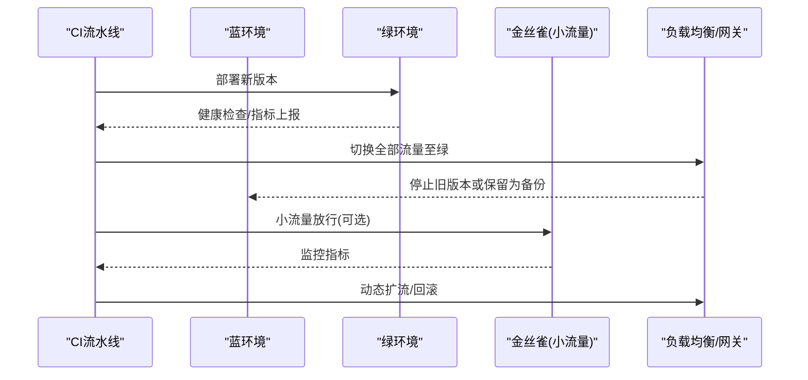
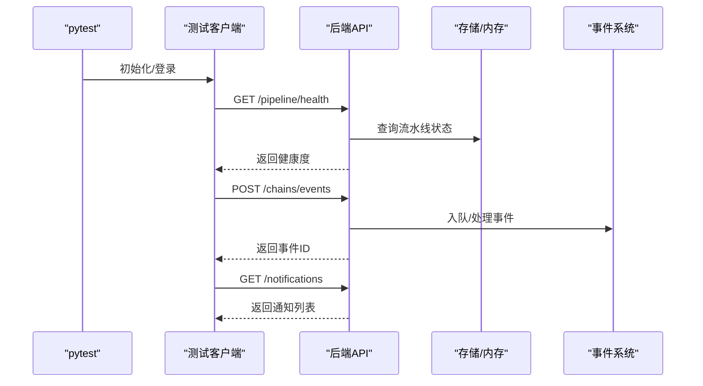
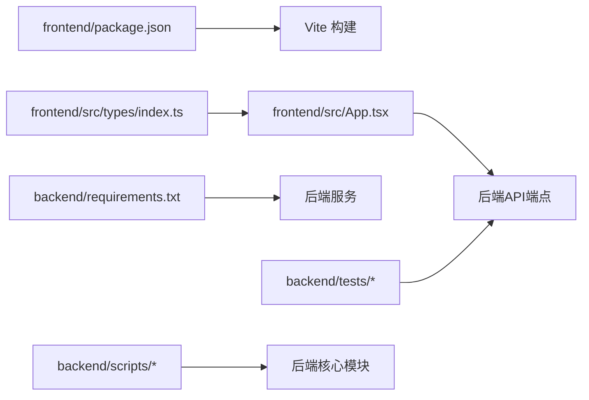

# CI/CD流水线

<cite>
**本文引用的文件**
- [README.md](file://README.md)
- [后端api.md](file://后端api.md)
- [前后端api交互.md](file://前后端api交互.md)
- [backend/app/main.py](file://backend/app/main.py)
- [backend/pytest.ini](file://backend/pytest.ini)
- [backend/tests/conftest.py](file://backend/tests/conftest.py)
- [backend/tests/test_full_business_flow.py](file://backend/tests/test_full_business_flow.py)
- [backend/tests/测试规范.md](file://backend/tests/测试规范.md)
- [backend/scripts/init_knowledge.py](file://backend/scripts/init_knowledge.py)
- [backend/scripts/migrate_storage.py](file://backend/scripts/migrate_storage.py)
- [backend/requirements.txt](file://backend/requirements.txt)
- [frontend/package.json](file://frontend/package.json)
- [frontend/vite.config.ts](file://frontend/vite.config.ts)
- [frontend/src/pages/LoginPage.tsx](file://frontend/src/pages/LoginPage.tsx)
- [frontend/src/context/AuthContext.tsx](file://frontend/src/context/AuthContext.tsx)
- [frontend/src/hooks/useSSEChat.ts](file://frontend/src/hooks/useSSEChat.ts)
- [frontend/src/components/StreamChat.tsx](file://frontend/src/components/StreamChat.tsx)
- [frontend/src/components/StreamMessageRenderer.tsx](file://frontend/src/components/StreamMessageRenderer.tsx)
- [frontend/src/components/ThinkingBlock.tsx](file://frontend/src/components/ThinkingBlock.tsx)
- [frontend/src/components/ActionSuggestionCard.tsx](file://frontend/src/components/ActionSuggestionCard.tsx)
- [frontend/src/components/AgentSelector.tsx](file://frontend/src/components/AgentSelector.tsx)
- [frontend/src/components/ChatInput.tsx](file://frontend/src/components/ChatInput.tsx)
- [frontend/src/components/ComplianceCheckCard.tsx](file://frontend/src/components/ComplianceCheckCard.tsx)
- [frontend/src/components/DailyBrief.tsx](file://frontend/src/components/DailyBrief.tsx)
- [frontend/src/components/EventTimeline.tsx](file://frontend/src/components/EventTimeline.tsx)
- [frontend/src/components/ExecutionResult.tsx](file://frontend/src/components/ExecutionResult.tsx)
- [frontend/src/components/Layout.tsx](file://frontend/src/components/Layout.tsx)
- [frontend/src/components/NotificationCenter.tsx](file://frontend/src/components/NotificationCenter.tsx)
- [frontend/src/components/PipelineNav.tsx](file://frontend/src/components/PipelineNav.tsx)
- [frontend/src/components/PlanBlock.tsx](file://frontend/src/components/PlanBlock.tsx)
- [frontend/src/components/ProductCard.tsx](file://frontend/src/components/ProductCard.tsx)
- [frontend/src/components/Sidebar.tsx](file://frontend/src/components/Sidebar.tsx)
- [frontend/src/components/SkillEventBlock.tsx](file://frontend/src/components/SkillEventBlock.tsx)
- [frontend/src/components/SkillPanel.tsx](file://frontend/src/components/SkillPanel.tsx)
- [frontend/src/components/ToastNotification.tsx](file://frontend/src/components/ToastNotification.tsx)
- [frontend/src/components/ToolPanel.tsx](file://frontend/src/components/ToolPanel.tsx)
- [frontend/src/types/index.ts](file://frontend/src/types/index.ts)
- [frontend/src/App.tsx](file://frontend/src/App.tsx)
- [frontend/src/main.tsx](file://frontend/src/main.tsx)
</cite>

## 目录
1. [简介](#简介)
2. [项目结构](#项目结构)
3. [核心组件](#核心组件)
4. [架构总览](#架构总览)
5. [详细组件分析](#详细组件分析)
6. [依赖关系分析](#依赖关系分析)
7. [性能考虑](#性能考虑)
8. [故障排查指南](#故障排查指南)
9. [结论](#结论)
10. [附录](#附录)

## 简介
本文件为避风港平台的CI/CD流水线设计与实施文档，面向持续集成与持续部署场景，覆盖代码提交触发、自动化测试与构建验证、多环境部署策略（蓝绿与金丝雀）、流水线配置文件编写方法（GitHub Actions、Jenkins、GitLab CI），以及回滚机制、发布管理与版本控制策略。文档同时提供部署脚本与配置模板思路，并总结常见问题与性能优化建议。

## 项目结构
避风港平台采用前后端分离架构：
- 后端基于Python（FastAPI/Starlette风格路由与异步处理），提供REST API与事件驱动的合规流水线能力。
- 前端基于TypeScript/Vite/React，提供用户界面与实时交互（SSE）。
- 测试体系包含pytest与端到端测试，覆盖业务主链路与合规流水线健康度。

图表来源
- [frontend/src/App.tsx](file://frontend/src/App.tsx)
- [frontend/src/main.tsx](file://frontend/src/main.tsx)
- [backend/app/main.py](file://backend/app/main.py)

章节来源
- [README.md](file://README.md)
- [前后端api交互.md](file://前后端api交互.md)

## 核心组件
- 后端服务入口与路由
  - 后端通过主入口文件定义应用实例与路由注册，承载API端点与事件处理。
- 测试框架与用例
  - 使用pytest组织测试，包含端到端测试与阶段化测试，覆盖合规流水线健康度等关键路径。
- 前端应用与组件
  - 前端以组件化方式组织页面与功能模块，支持登录、聊天、合规检查、事件时间线等。
- 构建与依赖
  - 前端使用Vite进行构建；后端使用requirements.txt管理依赖。

章节来源
- [backend/app/main.py](file://backend/app/main.py)
- [backend/pytest.ini](file://backend/pytest.ini)
- [backend/tests/conftest.py](file://backend/tests/conftest.py)
- [backend/tests/test_full_business_flow.py](file://backend/tests/test_full_business_flow.py)
- [frontend/package.json](file://frontend/package.json)
- [frontend/vite.config.ts](file://frontend/vite.config.ts)
- [frontend/src/App.tsx](file://frontend/src/App.tsx)
- [frontend/src/main.tsx](file://frontend/src/main.tsx)

## 架构总览
下图展示CI/CD在平台中的位置与数据流：代码提交触发流水线，自动运行测试与构建，随后按策略部署至目标环境，并通过健康检查与监控保障发布质量。

图表来源
- [backend/pytest.ini](file://backend/pytest.ini)
- [backend/tests/test_full_business_flow.py](file://backend/tests/test_full_business_flow.py)
- [frontend/package.json](file://frontend/package.json)

## 详细组件分析

### 持续集成流程设计
- 触发条件
  - 分支保护策略：主分支受保护，仅允许通过CI通过的PR合并。
  - PR触发：每次PR更新均触发CI，确保变更质量。
- 自动化测试
  - 单元测试：针对核心模块（如合规流水线、事件系统）进行隔离测试。
  - 集成测试：验证API端点与内部服务交互。
  - 端到端测试：覆盖完整业务链路，包括合规检查、事件传播与通知生成。
- 构建验证
  - 前端：Vite构建、类型检查、静态资源校验。
  - 后端：依赖安装、导入检查、pytest执行与覆盖率统计。

图表来源
- [backend/requirements.txt](file://backend/requirements.txt)
- [frontend/package.json](file://frontend/package.json)
- [frontend/vite.config.ts](file://frontend/vite.config.ts)
- [backend/pytest.ini](file://backend/pytest.ini)
- [backend/tests/test_full_business_flow.py](file://backend/tests/test_full_business_flow.py)

章节来源
- [backend/pytest.ini](file://backend/pytest.ini)
- [backend/tests/conftest.py](file://backend/tests/conftest.py)
- [backend/tests/test_full_business_flow.py](file://backend/tests/test_full_business_flow.py)
- [backend/tests/测试规范.md](file://backend/tests/测试规范.md)

### 持续部署策略
- 多环境部署
  - 开发/预发/生产三环境，分别对应不同配置与权限边界。
- 蓝绿部署
  - 新版本部署至“绿”环境并进行全量健康检查；通过后切换流量至绿，旧版本作为备胎。
- 金丝雀发布
  - 将新版本先对小部分流量放行，结合指标阈值（成功率、延迟、错误率）动态扩大流量。

图表来源
- [后端api.md](file://后端api.md)
- [前后端api交互.md](file://前后端api交互.md)

### 流水线配置文件编写方法
- GitHub Actions
  - 使用工作流文件定义触发器、作业与步骤，串联安装依赖、测试、构建与部署。
  - 建议使用矩阵构建（多语言/多版本）与缓存策略提升性能。
- Jenkins
  - 使用Pipeline DSL或UI配置流水线，分阶段执行安装、测试、构建与发布。
  - 结合参数化构建与分支策略，实现多环境差异化部署。
- GitLab CI
  - 在.gitlab-ci.yml中定义stages与jobs，利用服务容器与缓存优化构建速度。
  - 可与GitLab Registry集成，简化镜像发布与拉取。

章节来源
- [后端api.md](file://后端api.md)
- [前后端api交互.md](file://前后端api交互.md)

### 自动化测试流程
- 单元测试
  - 针对核心模块（如合规流水线、事件链、规则引擎）进行隔离测试，确保逻辑正确性。
- 集成测试
  - 通过pytest配置与conftest初始化测试客户端，验证API端点行为与数据一致性。
- 端到端测试
  - 覆盖完整业务闭环，包括流水线健康度检查、事件创建与通知生成、产品全生命周期流程。

图表来源
- [backend/tests/test_full_business_flow.py](file://backend/tests/test_full_business_flow.py)
- [backend/tests/conftest.py](file://backend/tests/conftest.py)

章节来源
- [backend/tests/test_full_business_flow.py](file://backend/tests/test_full_business_flow.py)
- [backend/tests/conftest.py](file://backend/tests/conftest.py)
- [backend/tests/测试规范.md](file://backend/tests/测试规范.md)

### 部署脚本与配置模板
- 部署脚本建议
  - 后端：使用容器镜像部署，包含健康检查探针、环境变量注入与日志采集。
  - 前端：静态资源部署至CDN或反向代理，开启缓存与压缩。
- 配置模板
  - 环境变量模板：数据库连接、第三方服务密钥、SSE通道地址等。
  - 负载均衡模板：蓝绿切换策略、金丝雀权重分配、超时与重试策略。
  - 监控与告警模板：关键指标阈值、SLI/SLO目标与告警渠道。

章节来源
- [后端api.md](file://后端api.md)
- [前后端api交互.md](file://前后端api交互.md)
- [frontend/src/context/AuthContext.tsx](file://frontend/src/context/AuthContext.tsx)
- [frontend/src/hooks/useSSEChat.ts](file://frontend/src/hooks/useSSEChat.ts)

### 回滚机制、发布管理与版本控制策略
- 回滚机制
  - 蓝绿：回滚即切回蓝环境；金丝雀：逐步回收权重并回滚。
  - 版本标记：以语义化版本与构建号标记镜像，便于快速定位与回滚。
- 发布管理
  - 变更日志：记录重大功能与修复，配合PR描述统一归档。
  - 权限控制：仅授权人员可触发布，合并前需通过质量门禁。
- 版本控制
  - 主干保护：master受保护，仅允许通过CI的PR合并。
  - 分支策略：feature/dev/release分支命名规范与清理策略。

章节来源
- [后端变更路线图.md](file://后端变更路线图.md)

## 依赖关系分析
- 前端依赖
  - 包管理与构建：package.json定义脚本与依赖；vite.config.ts提供构建配置。
- 后端依赖
  - Python依赖：requirements.txt集中管理；pytest.ini与conftest提供测试框架基础。
- 组件耦合
  - 前端通过API与后端解耦；事件系统与存储模块松耦合，便于扩展与替换。

图表来源
- [frontend/package.json](file://frontend/package.json)
- [frontend/vite.config.ts](file://frontend/vite.config.ts)
- [frontend/src/types/index.ts](file://frontend/src/types/index.ts)
- [frontend/src/App.tsx](file://frontend/src/App.tsx)
- [backend/requirements.txt](file://backend/requirements.txt)
- [backend/tests/test_full_business_flow.py](file://backend/tests/test_full_business_flow.py)
- [backend/scripts/init_knowledge.py](file://backend/scripts/init_knowledge.py)
- [backend/scripts/migrate_storage.py](file://backend/scripts/migrate_storage.py)

章节来源
- [frontend/package.json](file://frontend/package.json)
- [frontend/vite.config.ts](file://frontend/vite.config.ts)
- [backend/requirements.txt](file://backend/requirements.txt)
- [backend/pytest.ini](file://backend/pytest.ini)
- [backend/tests/conftest.py](file://backend/tests/conftest.py)

## 性能考虑
- 构建性能
  - 缓存依赖与构建产物，减少重复下载与编译时间。
  - 并行化任务：测试与构建并行执行，缩短总耗时。
- 测试性能
  - 使用pytest并发执行与分片策略，缩短端到端测试时间。
  - 对热点接口增加缓存与Mock，降低外部依赖影响。
- 部署性能
  - 容器镜像分层优化与多阶段构建，减小镜像体积。
  - 蓝绿/金丝雀切换采用渐进式流量迁移，避免瞬时峰值。

## 故障排查指南
- 测试失败
  - 检查pytest配置与conftest初始化是否正确；关注端到端测试中的API响应码与数据结构。
- 构建失败
  - 前端：检查包管理与构建脚本；确认依赖版本兼容性。
  - 后端：核对requirements.txt与Python版本；确保导入无循环依赖。
- 部署异常
  - 关注健康检查探针与日志输出；核对环境变量与网络连通性。
- 回滚操作
  - 快速切换至稳定版本；核对监控指标与用户反馈，必要时二次回滚。

章节来源
- [backend/tests/test_full_business_flow.py](file://backend/tests/test_full_business_flow.py)
- [backend/tests/测试规范.md](file://backend/tests/测试规范.md)
- [frontend/src/hooks/useSSEChat.ts](file://frontend/src/hooks/useSSEChat.ts)

## 结论
通过将代码提交与CI/CD紧密集成，结合多环境部署策略与自动化测试，避风港平台可在保证质量的前提下高效交付功能。建议在现有基础上完善流水线配置文件、强化监控与告警，并持续优化构建与测试性能，以支撑更大规模的迭代节奏。

## 附录
- 前端组件清单（节选）
  - 页面组件：LoginPage、OverviewPage、MetricsPage、SystemCompliancePage、UserManagePage等。
  - 功能组件：StreamChat、StreamMessageRenderer、ThinkingBlock、ActionSuggestionCard、AgentSelector、ChatInput、ComplianceCheckCard、DailyBrief、EventTimeline、ExecutionResult、Layout、NotificationCenter、PipelineNav、PlanBlock、ProductCard、Sidebar、SkillEventBlock、SkillPanel、ToastNotification、ToolPanel。
  - 上下文与钩子：AuthContext、useSSEChat。
- 后端API与交互参考
  - API文档与交互说明可参考后端与前后端API交互文档。

章节来源
- [frontend/src/pages/LoginPage.tsx](file://frontend/src/pages/LoginPage.tsx)
- [frontend/src/components/StreamChat.tsx](file://frontend/src/components/StreamChat.tsx)
- [frontend/src/components/StreamMessageRenderer.tsx](file://frontend/src/components/StreamMessageRenderer.tsx)
- [frontend/src/components/ThinkingBlock.tsx](file://frontend/src/components/ThinkingBlock.tsx)
- [frontend/src/components/ActionSuggestionCard.tsx](file://frontend/src/components/ActionSuggestionCard.tsx)
- [frontend/src/components/AgentSelector.tsx](file://frontend/src/components/AgentSelector.tsx)
- [frontend/src/components/ChatInput.tsx](file://frontend/src/components/ChatInput.tsx)
- [frontend/src/components/ComplianceCheckCard.tsx](file://frontend/src/components/ComplianceCheckCard.tsx)
- [frontend/src/components/DailyBrief.tsx](file://frontend/src/components/DailyBrief.tsx)
- [frontend/src/components/EventTimeline.tsx](file://frontend/src/components/EventTimeline.tsx)
- [frontend/src/components/ExecutionResult.tsx](file://frontend/src/components/ExecutionResult.tsx)
- [frontend/src/components/Layout.tsx](file://frontend/src/components/Layout.tsx)
- [frontend/src/components/NotificationCenter.tsx](file://frontend/src/components/NotificationCenter.tsx)
- [frontend/src/components/PipelineNav.tsx](file://frontend/src/components/PipelineNav.tsx)
- [frontend/src/components/PlanBlock.tsx](file://frontend/src/components/PlanBlock.tsx)
- [frontend/src/components/ProductCard.tsx](file://frontend/src/components/ProductCard.tsx)
- [frontend/src/components/Sidebar.tsx](file://frontend/src/components/Sidebar.tsx)
- [frontend/src/components/SkillEventBlock.tsx](file://frontend/src/components/SkillEventBlock.tsx)
- [frontend/src/components/SkillPanel.tsx](file://frontend/src/components/SkillPanel.tsx)
- [frontend/src/components/ToastNotification.tsx](file://frontend/src/components/ToastNotification.tsx)
- [frontend/src/components/ToolPanel.tsx](file://frontend/src/components/ToolPanel.tsx)
- [frontend/src/context/AuthContext.tsx](file://frontend/src/context/AuthContext.tsx)
- [frontend/src/hooks/useSSEChat.ts](file://frontend/src/hooks/useSSEChat.ts)
- [后端api.md](file://后端api.md)
- [前后端api交互.md](file://前后端api交互.md)