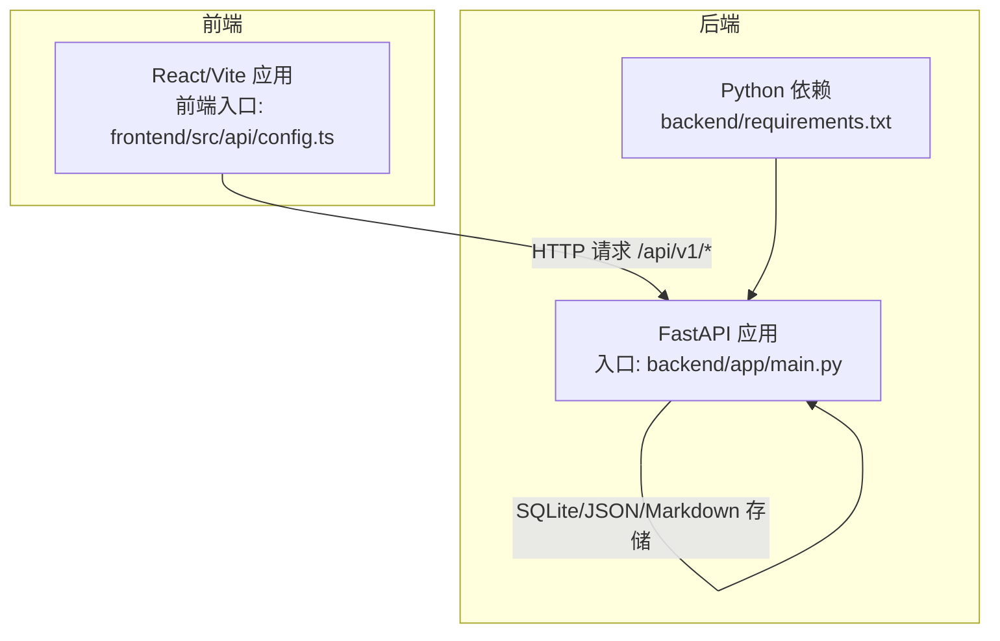
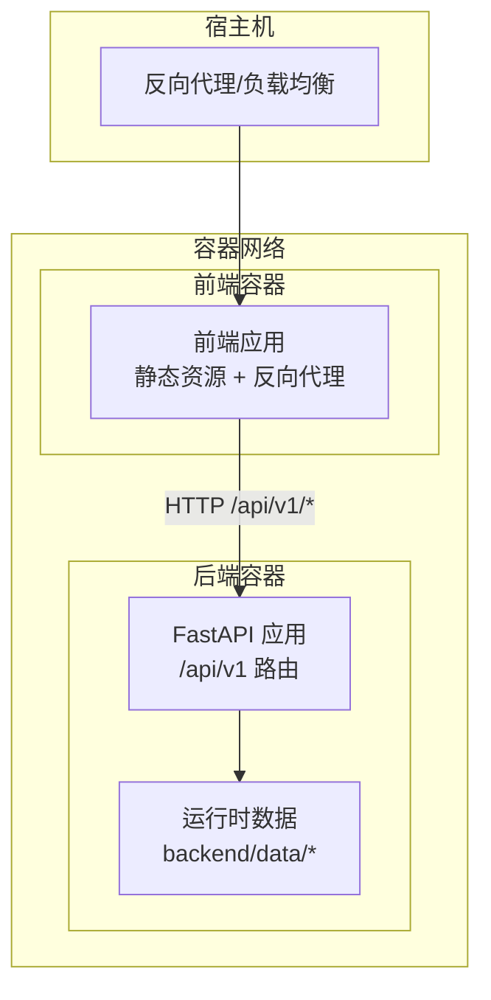
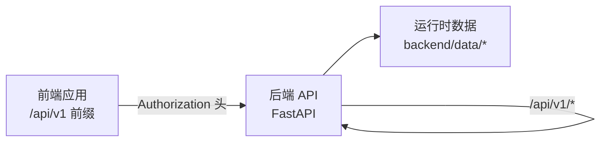

# 容器化部署

<cite>
**本文引用的文件**   
- [README.md](file://README.md)
- [后端API文档](file://后端api.md)
- [前端API文档](file://前端api.md)
- [前后端API交互](file://前后端api交互.md)
- [后端入口 main.py](file://backend/app/main.py)
- [后端依赖 requirements.txt](file://backend/requirements.txt)
- [前端入口 config.ts](file://frontend/src/api/config.ts)
- [_check_agents.py](file://backend/tests/archived/_check_agents.py)
</cite>

## 目录
1. [简介](#简介)
2. [项目结构](#项目结构)
3. [核心组件](#核心组件)
4. [架构总览](#架构总览)
5. [详细组件分析](#详细组件分析)
6. [依赖关系分析](#依赖关系分析)
7. [性能考虑](#性能考虑)
8. [故障排除指南](#故障排除指南)
9. [结论](#结论)
10. [附录](#附录)

## 简介
本文件面向“避风港平台”的容器化部署，目标是提供从 Docker 镜像构建、运行时配置、容器编排到运维保障的完整指南。由于仓库中未包含现成的 Dockerfile 或 Kubernetes 清单，本文将基于现有后端与前端代码结构，给出可落地的容器化最佳实践与部署建议，帮助团队以安全、高效、可观测的方式上线系统。

## 项目结构
- 后端采用 Python + FastAPI，入口为 backend/app/main.py，提供 27 个 API 模块；依赖在 backend/requirements.txt 中声明。
- 前端为 React/Vite 应用，统一通过 /api/v1 前缀访问后端接口，前端配置位于 frontend/src/api/config.ts。
- README.md 提供了快速启动流程与默认端口信息，便于容器化时确定监听地址与端口映射策略。

**图表来源**
- [后端入口 main.py](file://backend/app/main.py)
- [后端依赖 requirements.txt](file://backend/requirements.txt)
- [前端入口 config.ts](file://frontend/src/api/config.ts)

**章节来源**
- [README.md](file://README.md)
- [后端入口 main.py](file://backend/app/main.py)
- [后端依赖 requirements.txt](file://backend/requirements.txt)
- [前端入口 config.ts](file://frontend/src/api/config.ts)

## 核心组件
- 后端服务（FastAPI）
  - 入口：backend/app/main.py
  - 默认监听：0.0.0.0:8001（来自 README 的快速启动说明）
  - 依赖：backend/requirements.txt
- 前端应用（React/Vite）
  - 接口前缀：/api/v1
  - 认证头：Authorization: Bearer <token>（来自前端配置）
- 数据与知识库
  - 运行时数据与知识库位于 backend/data 下（如配置、产品、提示词等），需在容器中持久化或按需挂载

**章节来源**
- [README.md](file://README.md)
- [后端入口 main.py](file://backend/app/main.py)
- [后端依赖 requirements.txt](file://backend/requirements.txt)
- [前端入口 config.ts](file://frontend/src/api/config.ts)

## 架构总览
下图展示了容器化后的典型拓扑：前端容器对外暴露静态资源与反向代理能力，后端容器承载 API 服务与数据存储；两者通过网络互通，必要时共享卷以持久化数据。

[此图为概念性架构示意，不直接映射具体源码文件]

## 详细组件分析

### 后端容器镜像构建（多阶段构建建议）
- 基础镜像选择
  - 构建阶段：使用官方 Python 基础镜像，启用缓存优化 pip 安装流程
  - 运行阶段：使用更精简的基础镜像（如 distroless/static 或 alpine），仅包含运行时所需组件
- 依赖安装
  - 将 requirements.txt 放置于构建上下文根部，分层缓存以提升重复构建速度
  - 使用只读根文件系统与非 root 用户运行，降低权限风险
- 应用打包
  - 将 backend/app 与 backend/data 中的静态资源打包进镜像；对敏感配置使用环境变量注入
- 多阶段构建要点
  - 第一阶段：安装构建依赖与编译产物（如有）
  - 第二阶段：仅复制运行时必需文件，最小化攻击面
- 安全配置
  - 设置只读文件系统、禁用 shell、限制进程数与内存
  - 使用非 root 用户运行，避免特权提升
- 镜像优化
  - 合理分层，减少层数；清理构建缓存；压缩层大小

[本节为通用最佳实践说明，不直接分析具体文件]

### 前端容器镜像构建（多阶段构建建议）
- 基础镜像选择
  - 构建阶段：官方 Node 基础镜像，安装依赖并构建生产包
  - 运行阶段：轻量 Nginx 或静态文件服务器镜像，仅承载构建产物
- 依赖安装
  - 使用 .npmrc 缓存策略，减少重复下载
- 应用打包
  - 构建后将 dist/ 或 build/ 目录作为静态站点根目录
- 多阶段构建要点
  - 第一阶段：安装依赖、构建
  - 第二阶段：仅复制构建产物与最小化运行时
- 安全配置
  - 静态文件服务器只读、禁用 shell、非 root 运行
- 镜像优化
  - 移除 dev 依赖、压缩静态资源、启用 Gzip/Brotli

[本节为通用最佳实践说明，不直接分析具体文件]

### 容器运行时配置
- 端口映射
  - 后端：容器内 8001 -> 宿主机 8001（或自定义端口）
  - 前端：容器内 80 -> 宿主机 80（或 443）+ 反向代理至后端 /api/v1
- 卷挂载
  - 后端：backend/data（含配置、产品、提示词、知识库等）持久化到宿主机
  - 日志：可挂载到集中日志采集路径
- 环境变量
  - 后端：OPENROUTER_API_KEY、DATABASE_URL、MODEL_ROUTE 等
  - 前端：API_BASE_URL（指向后端 /api/v1）、站点标题、主题色等

[本节为通用最佳实践说明，不直接分析具体文件]

### 容器编排方案
- docker-compose
  - 前端服务：反向代理 + 静态站点
  - 后端服务：FastAPI 应用
  - 共享网络：前端通过 /api/v1 代理到后端
  - 持久卷：挂载 backend/data 到宿主机
- Kubernetes
  - Deployment + Service：后端 API
  - Deployment + Service：前端静态站点
  - ConfigMap：注入环境变量（如 API 基础地址）
  - Secret：注入敏感配置（如 API 密钥）
  - PersistentVolumeClaim：挂载 backend/data
  - Ingress：暴露域名与 TLS

[本节为通用最佳实践说明，不直接分析具体文件]

### 完整部署示例与命令行操作指南
- 本地开发（单机）
  - 后端：uvicorn app.main:app --host 0.0.0.0 --port 8001 --reload
  - 前端：Vite 开发服务器（默认端口）
  - 生产：使用 docker build 构建镜像，docker run 指定端口映射与卷挂载
- docker-compose
  - 使用 compose 文件定义前端与后端服务，网络与卷
  - docker compose up -d 启动
- Kubernetes
  - kubectl apply -f k8s/backend-deployment.yaml
  - kubectl apply -f k8s/frontend-deployment.yaml
  - kubectl apply -f k8s/ingress.yaml

[本节为通用最佳实践说明，不直接分析具体文件]

### 容器安全配置
- 最小权限
  - 非 root 用户运行，禁用 shell
- 只读文件系统
  - 仅允许写入必要的卷挂载目录
- 网络隔离
  - 仅暴露必要端口；后端与前端通过内部网络通信
- 镜像扫描
  - 构建后进行漏洞扫描，修复高危漏洞
- 证书与密钥
  - 使用 Secret 管理密钥；TLS 由 Ingress 或反向代理处理

[本节为通用最佳实践说明，不直接分析具体文件]

### 资源限制与健康检查
- 资源限制
  - CPU/内存 requests/limits 合理设置，避免资源争抢
- 健康检查
  - HTTP GET /health（若后端提供）或 TCP socket 检查
  - Liveness/Readiness 探针结合使用，确保滚动升级期间流量不中断

[本节为通用最佳实践说明，不直接分析具体文件]

## 依赖关系分析
- 前端与后端通过 /api/v1 前缀通信，前端负责认证头注入，后端提供 REST API
- 后端依赖 Python 环境与第三方库，运行时依赖 SQLite/JSON/Markdown 等数据文件
- 前后端均需通过环境变量注入敏感配置

**图表来源**
- [前端入口 config.ts](file://frontend/src/api/config.ts)
- [后端入口 main.py](file://backend/app/main.py)

**章节来源**
- [前后端API交互](file://前后端api交互.md)
- [后端入口 main.py](file://backend/app/main.py)
- [前端入口 config.ts](file://frontend/src/api/config.ts)

## 性能考虑
- 镜像层优化：合并安装与清理步骤，减少层数
- 缓存策略：利用 pip/npm 缓存，分层复用
- 运行时优化：启用 Gzip/Brotli 压缩；CDN 加速静态资源
- 资源分配：根据并发请求量设置 CPU/内存 limits
- 数据持久化：将热点数据与日志分离，避免 IO 抖动

[本节提供一般性指导，不直接分析具体文件]

## 故障排除指南
- 启动失败
  - 检查端口占用与防火墙策略（默认 8001）
  - 查看容器日志，定位依赖缺失或环境变量错误
- 认证失败
  - 确认前端是否正确注入 Authorization 头
  - 检查后端是否正确解析 Bearer Token
- 数据不可见
  - 确认卷挂载路径与权限
  - 检查 backend/data 是否存在且可读写
- 数据库连接问题
  - 若使用 SQLite，请确认文件路径与权限
  - 如需外部数据库，检查连接字符串与网络连通性

**章节来源**
- [_check_agents.py](file://backend/tests/archived/_check_agents.py)

## 结论
通过多阶段构建、最小化运行时镜像、严格的权限控制与合理的资源限制，避风港平台可在容器环境中实现安全、稳定、可扩展的交付。配合 docker-compose/Kubernetes 的编排能力，可进一步提升部署效率与运维体验。

## 附录
- 快速启动参考
  - 后端默认端口：8001
  - 前端 API 前缀：/api/v1
  - 前端认证头：Authorization: Bearer <token>

**章节来源**
- [README.md](file://README.md)
- [前端入口 config.ts](file://frontend/src/api/config.ts)