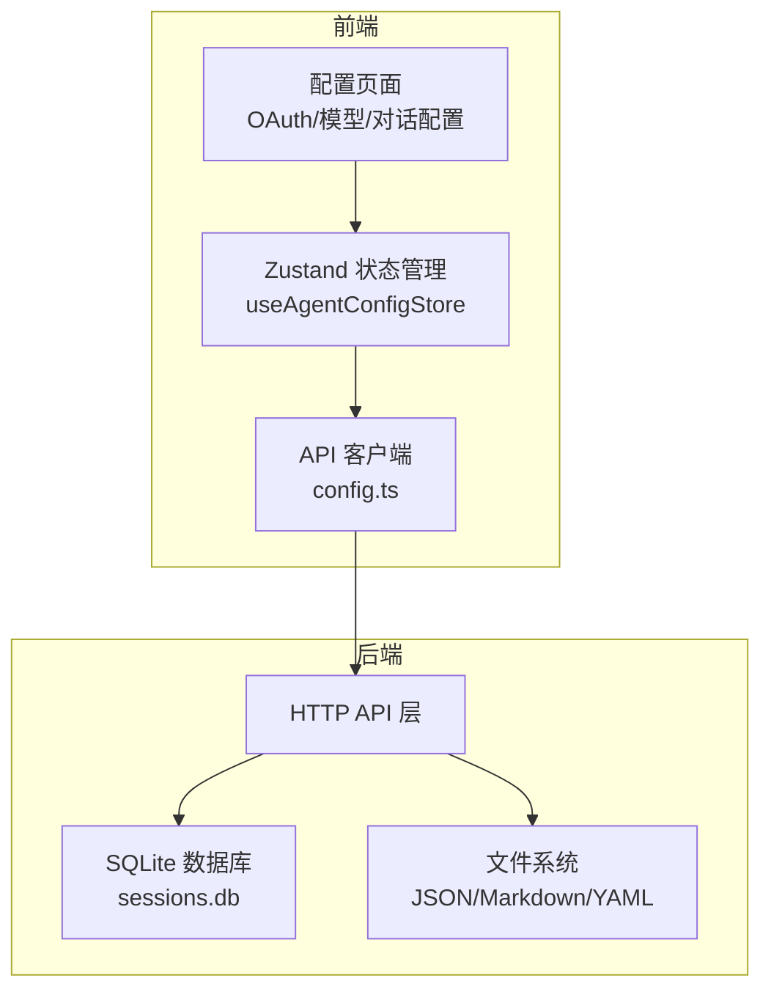
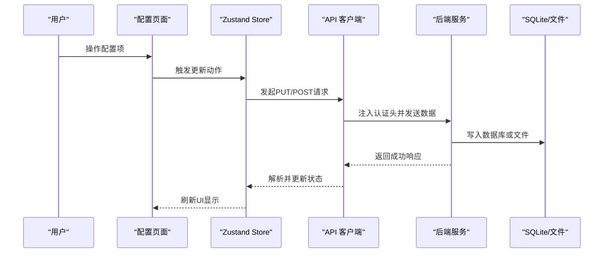
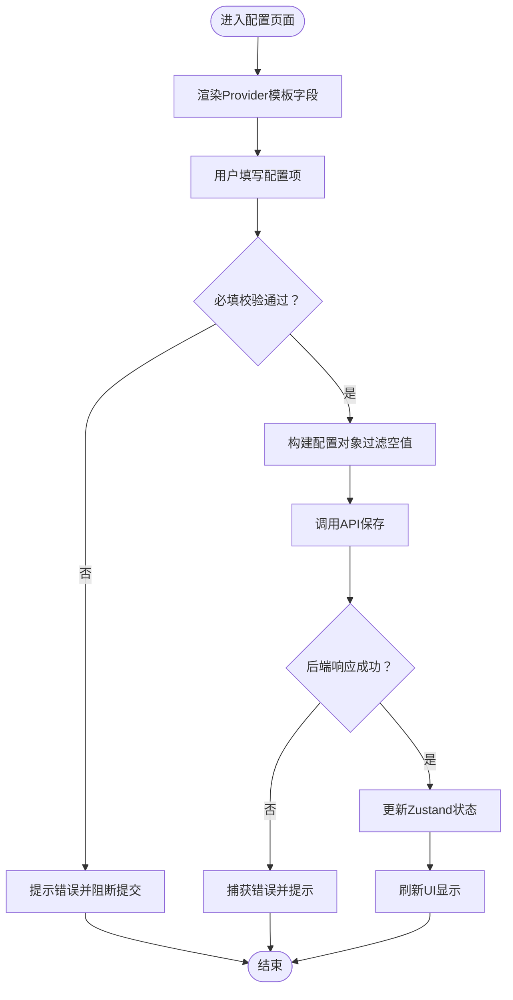
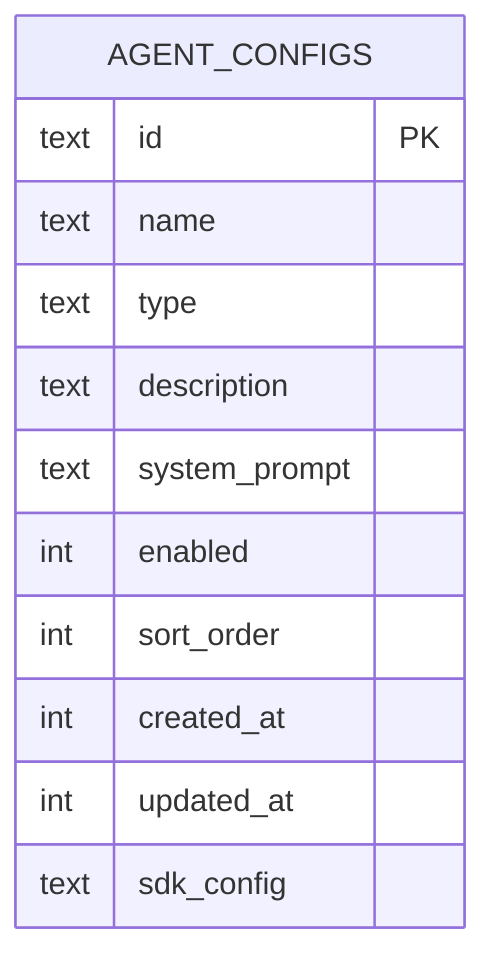
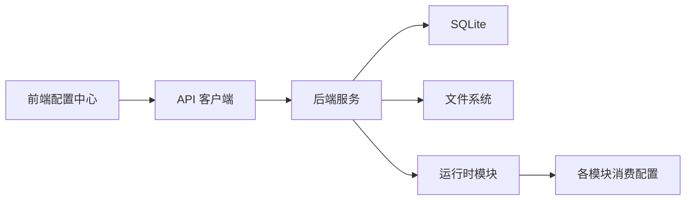

# 环境配置管理

<cite>
**本文引用的文件**
- [前后端api交互.md](file://前后端api交互.md)
- [AppStore.tsx](file://frontend/src/context/AppStore.tsx)
- [config.ts](file://frontend/src/api/config.ts)
- [OAuthEditModal.tsx](file://frontend/src/components/config/OAuthEditModal.tsx)
- [ModelEditModal.tsx](file://frontend/src/components/config/ModelEditModal.tsx)
- [IntegrationPage.tsx](file://frontend/src/pages/IntegrationPage.tsx)
- [agent_config_store.py](file://backend/app/storage/agent_config_store.py)
- [_check_agents.py](file://backend/tests/archived/_check_agents.py)
- [chat_compliance.yaml](file://backend/data/prompts/chat_compliance.yaml)
- [apikey.txt](file://apikey.txt)
</cite>

## 目录
1. [引言](#引言)
2. [项目结构](#项目结构)
3. [核心组件](#核心组件)
4. [架构总览](#架构总览)
5. [详细组件分析](#详细组件分析)
6. [依赖关系分析](#依赖关系分析)
7. [性能考量](#性能考量)
8. [故障排查指南](#故障排查指南)
9. [结论](#结论)
10. [附录](#附录)

## 引言
本文件面向避风港平台的环境配置管理，系统化阐述多环境配置策略（开发、测试、生产）、环境变量与敏感信息保护、配置文件组织（YAML、JSON、.env）、配置热更新与验证流程、部署模板与示例、配置审计与变更管理、以及配置冲突与兼容性问题的解决方案。文档以仓库现有实现为依据，结合前端配置中心与后端存储层的交互，给出可落地的实践建议。

## 项目结构
避风港平台的配置管理横跨前端与后端：
- 前端通过配置中心页面与API客户端进行配置读写，支持OAuth、模型路由、对话配置等维度。
- 后端通过SQLite、JSON与Markdown文件持久化配置，并在运行时被各模块消费。
- 文档化的三层配置架构与生效链路提供了清晰的配置生命周期视图。

图表来源
- [前后端api交互.md](file://前后端api交互.md)
- [AppStore.tsx](file://frontend/src/context/AppStore.tsx)
- [config.ts](file://frontend/src/api/config.ts)

章节来源
- [前后端api交互.md](file://前后端api交互.md)
- [AppStore.tsx](file://frontend/src/context/AppStore.tsx)
- [config.ts](file://frontend/src/api/config.ts)

## 核心组件
- 前端配置中心
  - OAuth编辑弹窗：动态渲染Provider配置字段，对敏感字段进行遮蔽与提示。
  - 模型编辑弹窗：支持选择Provider、模型名、API Key环境变量与Base URL。
  - 集成页面：提供第三方服务配置的引导提示模板。
  - Zustand状态：统一加载/更新对话配置，触发后端持久化与生效。
  - API客户端：统一封装请求头注入与错误处理。
- 后端存储与持久化
  - Agent配置存储：SQLite表结构与默认配置初始化。
  - 测试脚本：验证数据库与表结构存在性，辅助本地调试。
- 配置文件与提示
  - YAML提示词：合规检查、影响分析、市场监控等提示词资源。
  - API Key文件：示例密钥文件，用于演示环境变量与密钥管理。

章节来源
- [OAuthEditModal.tsx](file://frontend/src/components/config/OAuthEditModal.tsx)
- [ModelEditModal.tsx](file://frontend/src/components/config/ModelEditModal.tsx)
- [IntegrationPage.tsx](file://frontend/src/pages/IntegrationPage.tsx)
- [AppStore.tsx](file://frontend/src/context/AppStore.tsx)
- [config.ts](file://frontend/src/api/config.ts)
- [agent_config_store.py](file://backend/app/storage/agent_config_store.py)
- [_check_agents.py](file://backend/tests/archived/_check_agents.py)
- [chat_compliance.yaml](file://backend/data/prompts/chat_compliance.yaml)
- [apikey.txt](file://apikey.txt)

## 架构总览
下图展示配置从页面到后端持久化与运行时消费的全链路，体现“页面交互层—API层—持久化层”的三层架构与配置生效对照表。

图表来源
- [前后端api交互.md](file://前后端api交互.md)
- [AppStore.tsx](file://frontend/src/context/AppStore.tsx)
- [config.ts](file://frontend/src/api/config.ts)

章节来源
- [前后端api交互.md](file://前后端api交互.md)

## 详细组件分析

### 前端配置中心与交互
- OAuth编辑弹窗
  - 动态字段生成：根据Provider模板渲染配置字段，自动识别敏感字段并以密码输入框呈现。
  - 保存流程：过滤空值，构建配置对象并提交至后端；对必填项进行前端校验。
- 模型编辑弹窗
  - 支持选择Provider、模型名、API Key环境变量与Base URL，便于后端按环境变量解析真实密钥。
- 集成页面
  - 提供第三方服务（如Shopify、飞书）的配置引导模板，降低接入门槛。
- Zustand状态管理
  - 统一加载/更新对话配置，确保UI与后端状态一致。
- API客户端
  - 自动从localStorage读取token并注入Authorization头，统一封装错误处理。

图表来源
- [OAuthEditModal.tsx](file://frontend/src/components/config/OAuthEditModal.tsx)
- [ModelEditModal.tsx](file://frontend/src/components/config/ModelEditModal.tsx)
- [AppStore.tsx](file://frontend/src/context/AppStore.tsx)
- [config.ts](file://frontend/src/api/config.ts)

章节来源
- [OAuthEditModal.tsx](file://frontend/src/components/config/OAuthEditModal.tsx)
- [ModelEditModal.tsx](file://frontend/src/components/config/ModelEditModal.tsx)
- [IntegrationPage.tsx](file://frontend/src/pages/IntegrationPage.tsx)
- [AppStore.tsx](file://frontend/src/context/AppStore.tsx)
- [config.ts](file://frontend/src/api/config.ts)

### 后端存储与持久化
- Agent配置存储
  - 表结构：包含主键id、名称、类型、描述、系统提示词、启用状态、排序、时间戳与SDK配置JSON字段。
  - 兼容性：自动迁移添加sdk_config列，避免旧版本不兼容。
  - 默认配置：提供初始化默认Agent配置的入口。
- 测试脚本
  - 检查数据库与表是否存在，便于本地快速验证配置存储是否就绪。

图表来源
- [agent_config_store.py](file://backend/app/storage/agent_config_store.py)

章节来源
- [agent_config_store.py](file://backend/app/storage/agent_config_store.py)
- [_check_agents.py](file://backend/tests/archived/_check_agents.py)

### 配置文件组织与提示
- YAML提示词
  - 合规检查、影响分析、市场监控、NLU回退、风险摘要等提示词资源，便于在不同场景下复用与迭代。
- API Key文件
  - 示例密钥文件，用于演示如何在不同环境中通过环境变量注入真实密钥，避免将明文密钥提交到版本库。

章节来源
- [chat_compliance.yaml](file://backend/data/prompts/chat_compliance.yaml)
- [apikey.txt](file://apikey.txt)

## 依赖关系分析
- 前端依赖
  - Zustand：集中管理对话配置状态，驱动UI更新。
  - API客户端：封装fetch请求、认证头注入与错误处理。
  - 组件：OAuth/模型/集成页面组件负责配置收集与校验。
- 后端依赖
  - SQLite：持久化Agent配置等结构化数据。
  - 文件系统：JSON/Markdown/YAML等非结构化配置资源。
- 配置生效对照
  - 不同配置项的写入位置、消费模块、生效时机与验证方式在文档中有明确映射，便于定位问题与优化性能。

图表来源
- [前后端api交互.md](file://前后端api交互.md)
- [AppStore.tsx](file://frontend/src/context/AppStore.tsx)
- [config.ts](file://frontend/src/api/config.ts)

章节来源
- [前后端api交互.md](file://前后端api交互.md)

## 性能考量
- 前端
  - 使用Zustand减少全局状态抖动，仅在必要时触发重渲染。
  - API请求统一错误处理，避免异常传播导致UI卡顿。
- 后端
  - SQLite适合小中型配置体量；当配置规模增长时，可考虑引入缓存层或索引优化。
  - 文件系统配置读取应避免频繁I/O，可在进程内缓存热点配置。

## 故障排查指南
- 数据库与表结构
  - 使用测试脚本检查数据库文件与表是否存在，确认agent_configs表可用后再进行配置读写。
- 认证与网络
  - 确认localStorage中存在token且未过期；检查API客户端是否正确注入Authorization头。
- 配置生效
  - 参考配置生效对照表，核对配置项的写入位置与消费模块，确认是否满足即时生效条件。
- 敏感信息
  - 前端对敏感字段进行遮蔽；后端应避免将敏感信息写入日志或返回给前端。

章节来源
- [_check_agents.py](file://backend/tests/archived/_check_agents.py)
- [config.ts](file://frontend/src/api/config.ts)
- [前后端api交互.md](file://前后端api交互.md)

## 结论
避风港平台的配置管理以“前端配置中心+后端持久化”为核心，配合文档化的三层架构与配置生效对照表，实现了从页面到数据库/文件的闭环。通过敏感字段遮蔽、环境变量注入与统一API封装，提升了安全性与可维护性。后续可在配置规模扩大时引入缓存与版本化管理，进一步增强性能与可观测性。

## 附录

### 多环境配置策略
- 开发环境
  - 使用本地SQLite与本地文件，便于快速迭代；敏感信息通过环境变量注入。
- 测试环境
  - 使用独立数据库与文件隔离；开启更严格的配置校验与日志记录。
- 生产环境
  - 使用只读文件系统与受控数据库访问；严格限制配置写入权限与审计日志。

### 环境变量与敏感信息保护
- 前端
  - 对敏感字段采用密码输入框；避免在UI中暴露原始值。
- 后端
  - 通过环境变量读取真实密钥；避免将敏感信息写入日志或返回给前端。
- 示例参考
  - API Key文件用于演示环境变量注入流程。

章节来源
- [OAuthEditModal.tsx](file://frontend/src/components/config/OAuthEditModal.tsx)
- [apikey.txt](file://apikey.txt)

### 配置文件组织
- YAML：提示词资源，便于版本控制与多人协作。
- JSON：结构化配置（如Agent、工具、模型路由），便于机器读取与自动化。
- Markdown：事件与工作器等规则类配置，便于人类阅读与评审。
- .env：环境变量文件，建议仅存放变量名与占位符，实际值由部署环境注入。

章节来源
- [chat_compliance.yaml](file://backend/data/prompts/chat_compliance.yaml)

### 配置热更新与验证流程
- 热更新
  - 对于即时生效的配置（如OAuth、事件、Worker、定时任务、对话配置），前端更新后立即写入后端，运行时模块感知变化并应用。
- 验证
  - 前端进行必填校验；后端进行格式与范围校验；通过配置生效对照表核对写入位置与消费模块。

章节来源
- [前后端api交互.md](file://前后端api交互.md)

### 部署环境配置模板与示例
- 建议模板
  - 开发：本地SQLite + 本地文件 + .env占位符。
  - 测试：独立数据库 + 受控文件 + CI注入的环境变量。
  - 生产：只读文件系统 + 受控数据库 + KMS/密钥管理服务注入的密钥。
- 示例参考
  - API Key文件展示了如何通过环境变量注入真实密钥。

章节来源
- [apikey.txt](file://apikey.txt)

### 配置审计、变更管理与版本控制
- 审计
  - 记录配置变更的时间、操作者、变更内容与影响范围。
- 变更管理
  - 对高风险配置（如生产密钥、路由规则）实施审批与灰度发布。
- 版本控制
  - 将非敏感配置纳入版本库；敏感配置通过环境变量或密钥管理服务注入。

### 配置冲突与兼容性问题
- 冲突
  - 当同一配置项在多个层级出现时，遵循“后端优先、文件覆盖、数据库最终”的原则。
- 兼容性
  - 后端存储层提供自动迁移（如新增列），前端保持向后兼容的字段渲染逻辑。