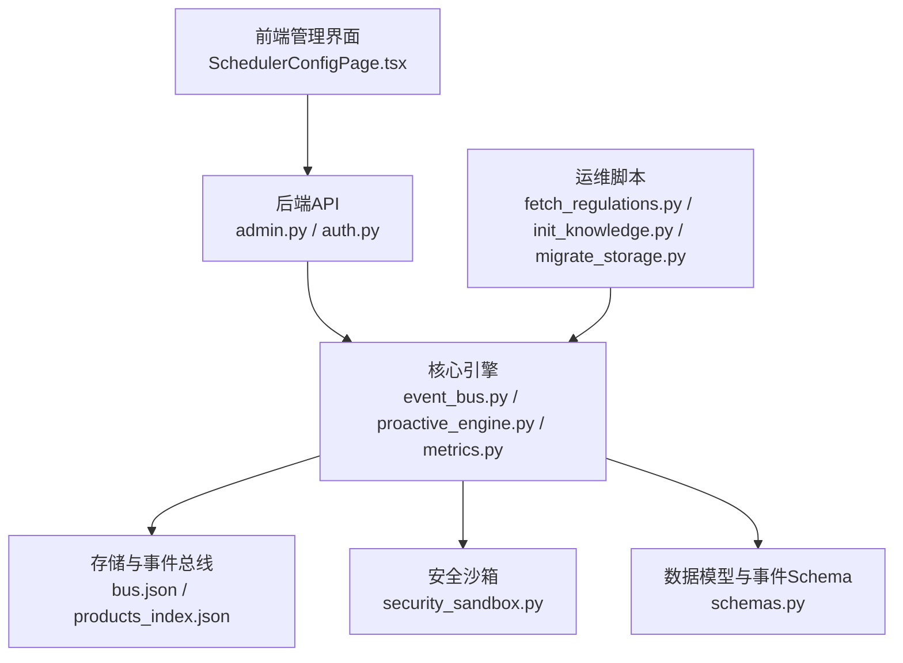
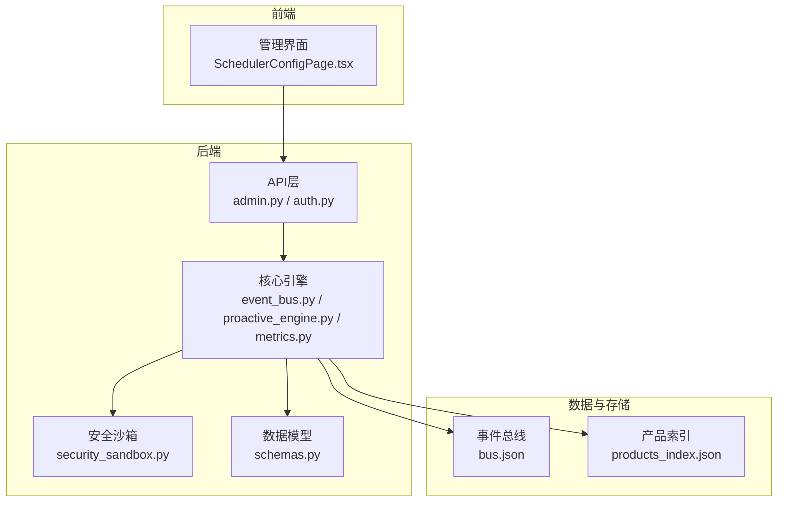
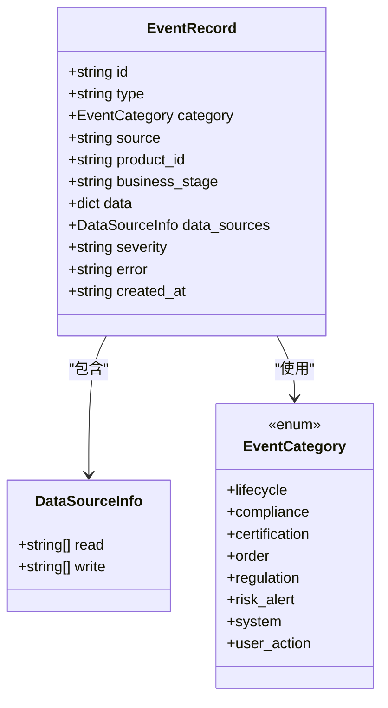
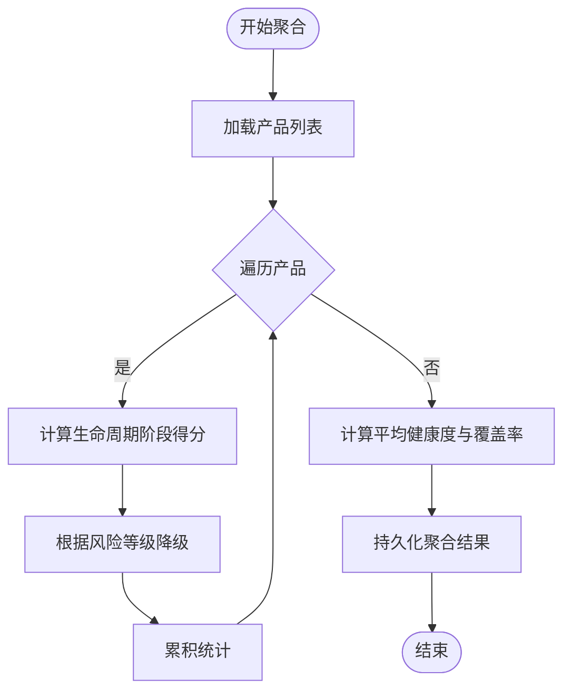
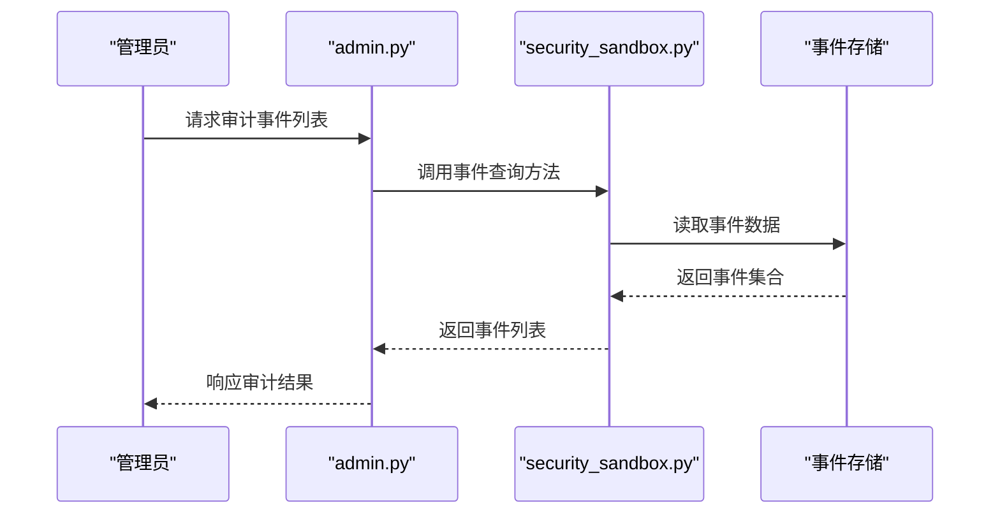
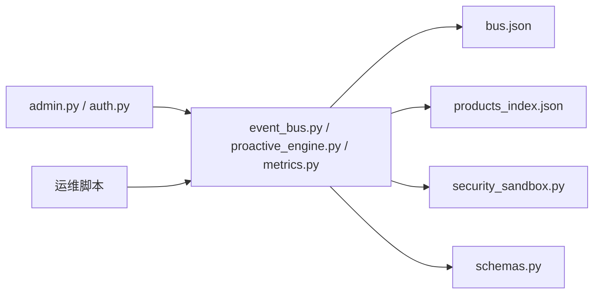

# 生产环境最佳实践

<cite>
**本文引用的文件**
- [backend/app/main.py](file://backend/app/main.py)
- [backend/app/api/admin.py](file://backend/app/api/admin.py)
- [backend/app/api/auth.py](file://backend/app/api/auth.py)
- [backend/app/core/auth.py](file://backend/app/core/auth.py)
- [backend/app/core/security_sandbox.py](file://backend/app/core/security_sandbox.py)
- [backend/app/core/event_bus.py](file://backend/app/core/event_bus.py)
- [backend/app/core/proactive_engine.py](file://backend/app/core/proactive_engine.py)
- [backend/app/core/metrics.py](file://backend/app/core/metrics.py)
- [backend/app/models/schemas.py](file://backend/app/models/schemas.py)
- [backend/data/global/events/bus.json](file://backend/data/global/events/bus.json)
- [backend/data/global/products_index.json](file://backend/data/global/products_index.json)
- [backend/data/config/events/user_action_events.md](file://backend/data/config/events/user_action_events.md)
- [后端变更路线图.md](file://后端变更路线图.md)
- [frontend/src/pages/config/SchedulerConfigPage.tsx](file://frontend/src/pages/config/SchedulerConfigPage.tsx)
- [backend/scripts/fetch_regulations.py](file://backend/scripts/fetch_regulations.py)
- [backend/scripts/init_knowledge.py](file://backend/scripts/init_knowledge.py)
- [backend/scripts/migrate_storage.py](file://backend/scripts/migrate_storage.py)
- [backend/tests/test_all_phases.py](file://backend/tests/test_all_phases.py)
- [backend/tests/test_phase1.py](file://backend/tests/test_phase1.py)
- [backend/tests/test_comprehensive_flow.py](file://backend/tests/test_comprehensive_flow.py)
</cite>

## 目录
1. [引言](#引言)
2. [项目结构](#项目结构)
3. [核心组件](#核心组件)
4. [架构总览](#架构总览)
5. [详细组件分析](#详细组件分析)
6. [依赖关系分析](#依赖关系分析)
7. [性能考虑](#性能考虑)
8. [故障排查指南](#故障排查指南)
9. [结论](#结论)
10. [附录](#附录)

## 引言
本文件面向避风港平台生产环境，提供安全配置、性能优化、高可用设计、容量规划与扩缩容、运维手册与应急响应、合规与审计、常见问题与瓶颈定位、以及运维工具与自动化脚本等系统性最佳实践。内容以仓库现有代码与配置为依据，结合事件驱动架构与指标体系，形成可落地的生产指导。

## 项目结构
- 后端采用事件驱动与多层存储架构，围绕“事件-工作流-指标-合规”闭环组织功能模块。
- 前端提供可视化配置与监控页面，支撑管理员与运营人员进行系统治理。
- 数据层包含全局事件总线、产品索引、事件配置与知识库初始化脚本等。

图表来源
- [frontend/src/pages/config/SchedulerConfigPage.tsx:524-551](file://frontend/src/pages/config/SchedulerConfigPage.tsx#L524-L551)
- [backend/app/api/admin.py:358-390](file://backend/app/api/admin.py#L358-L390)
- [backend/app/api/auth.py](file://backend/app/api/auth.py)
- [backend/app/core/event_bus.py:633-654](file://backend/app/core/event_bus.py#L633-L654)
- [backend/app/core/proactive_engine.py:730-804](file://backend/app/core/proactive_engine.py#L730-L804)
- [backend/app/core/metrics.py:200-240](file://backend/app/core/metrics.py#L200-L240)
- [backend/data/global/events/bus.json:2539-2946](file://backend/data/global/events/bus.json#L2539-L2946)
- [backend/data/global/products_index.json:44-87](file://backend/data/global/products_index.json#L44-L87)
- [backend/app/models/schemas.py:2400-2450](file://backend/app/models/schemas.py#L2400-L2450)
- [backend/scripts/fetch_regulations.py](file://backend/scripts/fetch_regulations.py)
- [backend/scripts/init_knowledge.py](file://backend/scripts/init_knowledge.py)
- [backend/scripts/migrate_storage.py](file://backend/scripts/migrate_storage.py)

章节来源
- [frontend/src/pages/config/SchedulerConfigPage.tsx:524-551](file://frontend/src/pages/config/SchedulerConfigPage.tsx#L524-L551)
- [backend/app/api/admin.py:358-390](file://backend/app/api/admin.py#L358-L390)
- [backend/app/core/event_bus.py:633-654](file://backend/app/core/event_bus.py#L633-L654)
- [backend/app/core/proactive_engine.py:730-804](file://backend/app/core/proactive_engine.py#L730-L804)
- [backend/app/core/metrics.py:200-240](file://backend/app/core/metrics.py#L200-L240)
- [backend/data/global/events/bus.json:2539-2946](file://backend/data/global/events/bus.json#L2539-L2946)
- [backend/data/global/products_index.json:44-87](file://backend/data/global/products_index.json#L44-L87)
- [backend/app/models/schemas.py:2400-2450](file://backend/app/models/schemas.py#L2400-L2450)
- [backend/scripts/fetch_regulations.py](file://backend/scripts/fetch_regulations.py)
- [backend/scripts/init_knowledge.py](file://backend/scripts/init_knowledge.py)
- [backend/scripts/migrate_storage.py](file://backend/scripts/migrate_storage.py)

## 核心组件
- 事件总线与事件定义：统一事件类型、分类、严重级别与通知策略，支持按业务阶段与系统健康度联动。
- 主动引擎与指标聚合：按产品维度与全局维度聚合健康度、风险比率、证书到期分布等关键指标。
- 安全沙箱与审计：提供事件查询接口与审计能力，支撑合规与风控。
- 数据模型与事件Schema：标准化事件结构与数据血缘字段，便于追踪与治理。
- 前端配置页：展示产品生命周期、合规状态、健康度等关键指标，辅助运营决策。

章节来源
- [backend/app/core/event_bus.py:633-654](file://backend/app/core/event_bus.py#L633-L654)
- [backend/app/core/proactive_engine.py:730-804](file://backend/app/core/proactive_engine.py#L730-L804)
- [backend/app/core/metrics.py:200-240](file://backend/app/core/metrics.py#L200-L240)
- [backend/app/core/security_sandbox.py](file://backend/app/core/security_sandbox.py)
- [backend/app/models/schemas.py:2400-2450](file://backend/app/models/schemas.py#L2400-L2450)
- [frontend/src/pages/config/SchedulerConfigPage.tsx:524-551](file://frontend/src/pages/config/SchedulerConfigPage.tsx#L524-L551)

## 架构总览
避风港平台采用事件驱动架构，后端API作为入口，核心引擎负责事件编排、指标聚合与主动治理，存储层承载事件总线与产品索引，安全沙箱提供审计与风控能力，前端提供可视化配置与监控。

图表来源
- [frontend/src/pages/config/SchedulerConfigPage.tsx:524-551](file://frontend/src/pages/config/SchedulerConfigPage.tsx#L524-L551)
- [backend/app/api/admin.py:358-390](file://backend/app/api/admin.py#L358-L390)
- [backend/app/api/auth.py](file://backend/app/api/auth.py)
- [backend/app/core/event_bus.py:633-654](file://backend/app/core/event_bus.py#L633-L654)
- [backend/app/core/proactive_engine.py:730-804](file://backend/app/core/proactive_engine.py#L730-L804)
- [backend/app/core/metrics.py:200-240](file://backend/app/core/metrics.py#L200-L240)
- [backend/app/core/security_sandbox.py](file://backend/app/core/security_sandbox.py)
- [backend/app/models/schemas.py:2400-2450](file://backend/app/models/schemas.py#L2400-L2450)
- [backend/data/global/events/bus.json:2539-2946](file://backend/data/global/events/bus.json#L2539-L2946)
- [backend/data/global/products_index.json:44-87](file://backend/data/global/products_index.json#L44-L87)

## 详细组件分析

### 事件总线与事件定义
- 统一事件类型与分类：涵盖生命周期、合规、认证、订单、法规、风险预警、系统、用户行为等八类事件。
- 事件严重级别与通知策略：支持低/中/高/严重级别，并内置默认通知策略。
- 事件Schema与数据血缘：事件记录包含标准化字段与数据血缘信息，便于追踪读写来源。

图表来源
- [backend/app/models/schemas.py:2400-2450](file://backend/app/models/schemas.py#L2400-L2450)

章节来源
- [backend/app/core/event_bus.py:633-654](file://backend/app/core/event_bus.py#L633-L654)
- [backend/app/models/schemas.py:2400-2450](file://backend/app/models/schemas.py#L2400-L2450)

### 主动引擎与指标聚合
- 全局健康度与风险指标：统计总产品数、市场覆盖、平均健康度、高风险产品比例、证书到期分布等。
- 产品级健康度：基于生命周期阶段与风险等级综合评分，支持趋势分析与阈值告警。
- 指标持久化：聚合结果写入全局指标文件，供前端与API消费。

图表来源
- [backend/app/core/proactive_engine.py:730-804](file://backend/app/core/proactive_engine.py#L730-L804)

章节来源
- [backend/app/core/proactive_engine.py:730-804](file://backend/app/core/proactive_engine.py#L730-L804)
- [backend/app/core/metrics.py:200-240](file://backend/app/core/metrics.py#L200-L240)

### 安全沙箱与审计
- 审计事件查询：提供事件查询接口，支持分页与过滤，便于合规审计与问题追溯。
- 事件类型扩展：事件配置文件支持新增事件类型与管理，配合QAAgent实现自助管理。

图表来源
- [backend/app/api/admin.py:386-390](file://backend/app/api/admin.py#L386-L390)
- [backend/app/core/security_sandbox.py](file://backend/app/core/security_sandbox.py)
- [backend/data/global/events/bus.json:2539-2946](file://backend/data/global/events/bus.json#L2539-L2946)

章节来源
- [backend/app/api/admin.py:386-390](file://backend/app/api/admin.py#L386-L390)
- [backend/data/global/events/bus.json:2539-2946](file://backend/data/global/events/bus.json#L2539-L2946)
- [backend/data/config/events/user_action_events.md:24-32](file://backend/data/config/events/user_action_events.md#L24-L32)

### 数据模型与事件Schema
- 事件记录标准化：包含事件ID、类型、分类、来源、关联产品、业务阶段、数据载荷、数据血缘、严重级别、错误信息与创建时间。
- 数据血缘字段：明确读取与写入的数据源层级，支撑数据治理与溯源。

章节来源
- [backend/app/models/schemas.py:2400-2450](file://backend/app/models/schemas.py#L2400-L2450)

### 前端配置与监控
- 生命周期与合规状态展示：在调度配置页展示目标市场、生命周期、合规状态与健康度等关键指标。
- 运营决策支持：通过可视化界面快速定位异常产品与风险事件。

章节来源
- [frontend/src/pages/config/SchedulerConfigPage.tsx:524-551](file://frontend/src/pages/config/SchedulerConfigPage.tsx#L524-L551)

## 依赖关系分析
- 组件耦合：API层依赖核心引擎；核心引擎依赖事件总线、指标模块与安全沙箱；数据模型为事件与指标提供结构化约束。
- 外部依赖：事件配置文件与知识库脚本支撑系统初始化与动态配置。
- 潜在环路：当前结构以事件驱动为核心，避免直接循环依赖；建议保持API→Core→Store的单向依赖。

图表来源
- [backend/app/api/admin.py:358-390](file://backend/app/api/admin.py#L358-L390)
- [backend/app/api/auth.py](file://backend/app/api/auth.py)
- [backend/app/core/event_bus.py:633-654](file://backend/app/core/event_bus.py#L633-L654)
- [backend/app/core/proactive_engine.py:730-804](file://backend/app/core/proactive_engine.py#L730-L804)
- [backend/app/core/metrics.py:200-240](file://backend/app/core/metrics.py#L200-L240)
- [backend/app/core/security_sandbox.py](file://backend/app/core/security_sandbox.py)
- [backend/app/models/schemas.py:2400-2450](file://backend/app/models/schemas.py#L2400-L2450)
- [backend/data/global/events/bus.json:2539-2946](file://backend/data/global/events/bus.json#L2539-L2946)
- [backend/data/global/products_index.json:44-87](file://backend/data/global/products_index.json#L44-L87)
- [backend/scripts/fetch_regulations.py](file://backend/scripts/fetch_regulations.py)
- [backend/scripts/init_knowledge.py](file://backend/scripts/init_knowledge.py)
- [backend/scripts/migrate_storage.py](file://backend/scripts/migrate_storage.py)

## 性能考虑
- 事件处理性能
  - 事件批处理与异步路由：利用事件总线的异步特性，将高并发事件分流至不同存储层级，降低热点写入压力。
  - 事件Schema规范化：通过标准化事件结构减少解析成本，提升吞吐。
- 指标聚合性能
  - 分层聚合：先产品级再全局聚合，避免全量扫描；定期持久化聚合结果，减少实时计算开销。
  - 指标阈值与趋势：通过阈值与趋势判断减少无效告警风暴。
- 存储与I/O
  - 事件与产品索引分离：事件总线与产品索引分别存储，降低锁竞争与IO争用。
  - 文件系统优化：事件与指标文件采用追加写与定期轮转策略，避免大文件随机写。
- 缓存策略
  - 指标缓存：将高频读取的聚合指标缓存于内存或本地磁盘，设置合理TTL。
  - 会话与鉴权缓存：对鉴权令牌与会话信息进行短期缓存，降低鉴权延迟。
- 网络与负载均衡
  - 前端静态资源与后端API分离部署，使用CDN与反向代理；后端服务无状态化，配合LB实现水平扩展。
- 数据库优化
  - 事件与指标采用文件存储为主，数据库仅用于强一致场景；对频繁查询字段建立索引，避免全表扫描。
- 并发与限流
  - 对外API设置速率限制与熔断保护，防止雪崩效应；对内部事件处理设置队列长度与背压策略。

## 故障排查指南
- 审计与事件查询
  - 使用审计接口查询近期事件，定位异常事件类型与来源；结合事件Schema核对数据血缘，确认读写链路是否符合预期。
- 指标异常
  - 若健康度下降，优先检查高风险产品数量与证书到期分布；结合生命周期阶段评分与风险等级进行根因分析。
- 事件总线异常
  - 检查事件总线文件完整性与写入权限；确认事件类型定义与通知策略配置正确。
- 权限与鉴权
  - 核验鉴权中间件与RBAC配置；确保管理员与运营角色具备相应权限。
- 自动化脚本
  - 使用知识库初始化脚本与法规抓取脚本恢复或更新基础数据；迁移脚本用于版本升级时的数据迁移。

章节来源
- [backend/app/api/admin.py:386-390](file://backend/app/api/admin.py#L386-L390)
- [backend/app/core/proactive_engine.py:730-804](file://backend/app/core/proactive_engine.py#L730-L804)
- [backend/data/global/events/bus.json:2539-2946](file://backend/data/global/events/bus.json#L2539-L2946)
- [backend/scripts/init_knowledge.py](file://backend/scripts/init_knowledge.py)
- [backend/scripts/fetch_regulations.py](file://backend/scripts/fetch_regulations.py)
- [backend/scripts/migrate_storage.py](file://backend/scripts/migrate_storage.py)

## 结论
避风港平台以事件驱动为核心，结合指标聚合与主动治理，构建了可扩展、可观测、可审计的生产系统。通过标准化事件Schema、分层存储与异步处理、完善的审计与合规能力，能够满足高并发与复杂业务场景下的生产需求。建议在生产环境中持续完善事件配置与通知策略，强化缓存与限流机制，并定期演练故障转移与灾难恢复流程。

## 附录

### 安全配置最佳实践
- 网络安全
  - 使用HTTPS与TLS 1.3；限制入站访问白名单；启用WAF与DDoS防护；前后端分离部署，后端仅暴露必要端口。
- 数据加密
  - 敏感配置与密钥使用密钥管理服务；传输层与静态数据均启用加密；定期轮换密钥与证书。
- 访问控制
  - RBAC最小权限原则；强制多因素认证；审计所有管理员操作；定期审查权限与会话状态。

章节来源
- [backend/app/api/auth.py](file://backend/app/api/auth.py)
- [backend/app/core/auth.py](file://backend/app/core/auth.py)
- [backend/data/config/events/user_action_events.md:24-32](file://backend/data/config/events/user_action_events.md#L24-L32)

### 高可用性设计
- 集群部署
  - 无状态后端服务横向扩展；共享存储用于事件与指标文件；使用容器编排与健康检查。
- 故障转移
  - 多副本部署与自动故障检测；事件与指标文件支持主从复制或对象存储备份。
- 灾难恢复
  - 定期备份事件总线与产品索引；制定RTO/RPO目标；演练跨区域恢复流程。

章节来源
- [后端变更路线图.md:1599-1612](file://后端变更路线图.md#L1599-L1612)
- [backend/data/global/events/bus.json:2539-2946](file://backend/data/global/events/bus.json#L2539-L2946)
- [backend/data/global/products_index.json:44-87](file://backend/data/global/products_index.json#L44-L87)

### 容量规划与扩缩容策略
- 容量评估
  - 基于事件吞吐量与指标聚合频率评估CPU与I/O；评估事件文件大小与增长速率确定存储容量。
- 扩缩容
  - 依据事件积压与响应时间动态扩缩；对高风险时段增加后端实例；对热点产品启用专用存储分片。

章节来源
- [backend/app/core/event_bus.py:633-654](file://backend/app/core/event_bus.py#L633-L654)
- [backend/app/core/proactive_engine.py:730-804](file://backend/app/core/proactive_engine.py#L730-L804)

### 运维手册与应急响应
- 日常运维
  - 监控事件总线与指标文件状态；定期巡检鉴权与RBAC配置；执行知识库与法规数据更新。
- 应急响应
  - 快速定位事件异常与指标异常；回滚配置变更；启用备用存储与灾备节点；发布安全补丁与热修复。

章节来源
- [backend/scripts/init_knowledge.py](file://backend/scripts/init_knowledge.py)
- [backend/scripts/fetch_regulations.py](file://backend/scripts/fetch_regulations.py)
- [backend/app/api/admin.py:386-390](file://backend/app/api/admin.py#L386-L390)

### 合规性要求与审计日志
- 合规要求
  - 事件类型与通知策略需覆盖法规、风险预警、系统与用户行为等八类事件；事件Schema包含数据血缘字段，满足数据治理要求。
- 审计日志
  - 提供审计事件查询接口；事件配置文件支持新增与管理；QAAgent可协助生成合规简报与分析报告。

章节来源
- [backend/app/models/schemas.py:2400-2450](file://backend/app/models/schemas.py#L2400-L2450)
- [backend/data/config/events/user_action_events.md:24-32](file://backend/data/config/events/user_action_events.md#L24-L32)
- [backend/app/api/admin.py:386-390](file://backend/app/api/admin.py#L386-L390)

### 常见问题与性能瓶颈
- 事件积压
  - 检查事件总线文件写入性能与存储空间；优化事件类型与通知策略；引入异步处理与限流。
- 指标聚合延迟
  - 调整聚合周期与缓存策略；减少不必要的全量扫描；优化存储布局。
- 权限与鉴权失败
  - 核验鉴权中间件与RBAC配置；检查会话与令牌有效期；清理过期会话。

章节来源
- [backend/app/core/event_bus.py:633-654](file://backend/app/core/event_bus.py#L633-L654)
- [backend/app/core/proactive_engine.py:730-804](file://backend/app/core/proactive_engine.py#L730-L804)
- [backend/app/core/auth.py](file://backend/app/core/auth.py)

### 运维工具与自动化脚本
- 知识库初始化：用于首次部署或重置知识库。
- 法规抓取：定时拉取最新法规并更新知识库。
- 存储迁移：用于版本升级或存储结构变更时的数据迁移。

章节来源
- [backend/scripts/init_knowledge.py](file://backend/scripts/init_knowledge.py)
- [backend/scripts/fetch_regulations.py](file://backend/scripts/fetch_regulations.py)
- [backend/scripts/migrate_storage.py](file://backend/scripts/migrate_storage.py)

### 测试与验证参考
- 产品管理全流程测试：覆盖创建、查询、详情获取与隔离存储初始化。
- 指标隔离与聚合测试：验证产品级指标独立性与全局指标聚合准确性。
- 全流程阶段测试：验证从产品到合规六阶段流水线的关键路径。

章节来源
- [backend/tests/test_all_phases.py:201-229](file://backend/tests/test_all_phases.py#L201-L229)
- [backend/tests/test_phase1.py:116-148](file://backend/tests/test_phase1.py#L116-L148)
- [backend/tests/test_comprehensive_flow.py:516-918](file://backend/tests/test_comprehensive_flow.py#L516-L918)