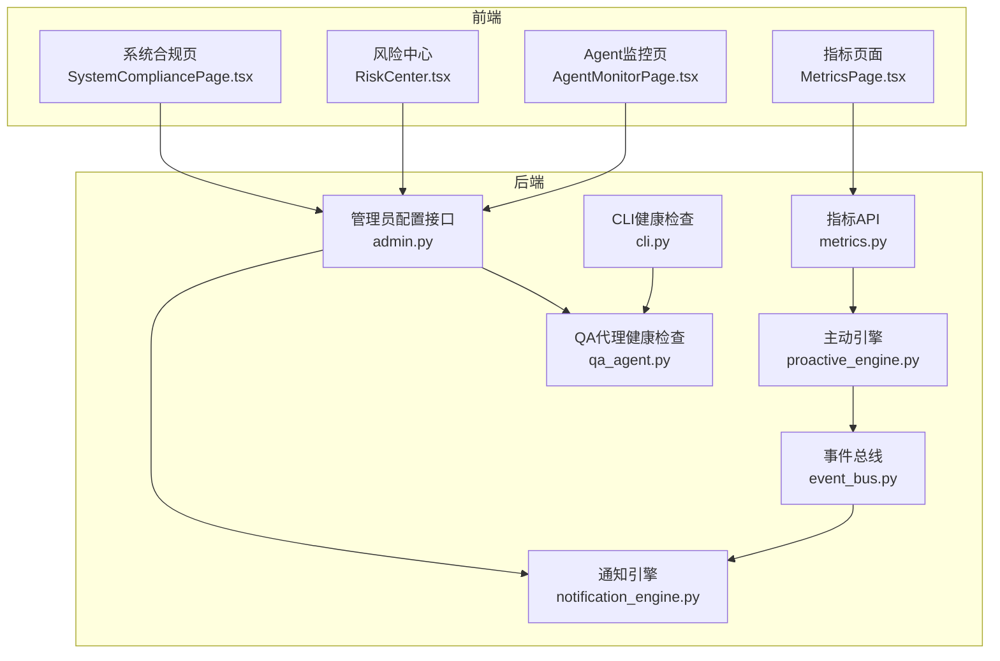
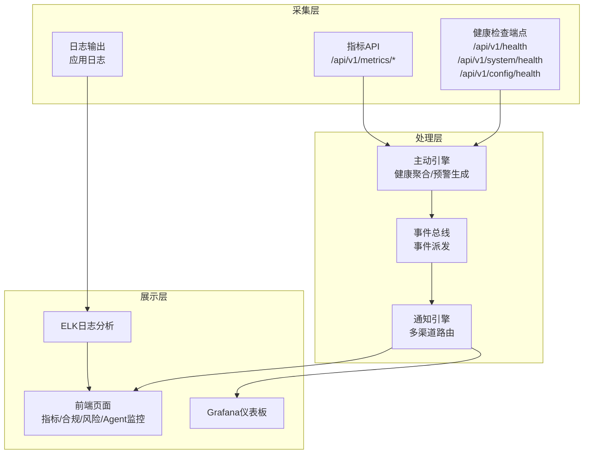
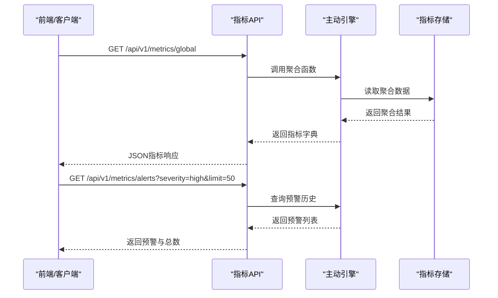
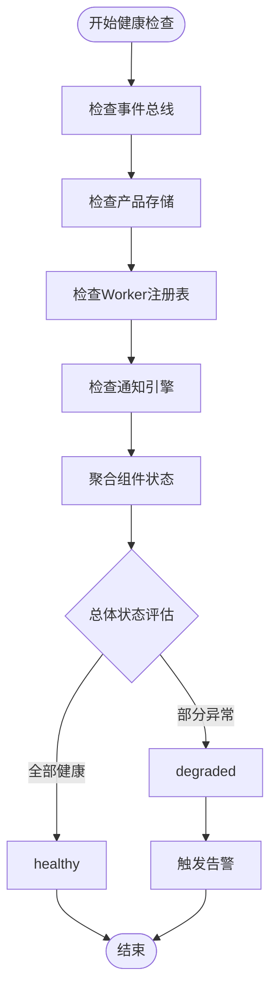
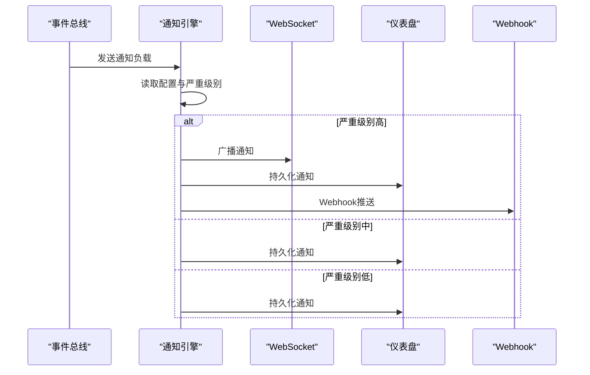
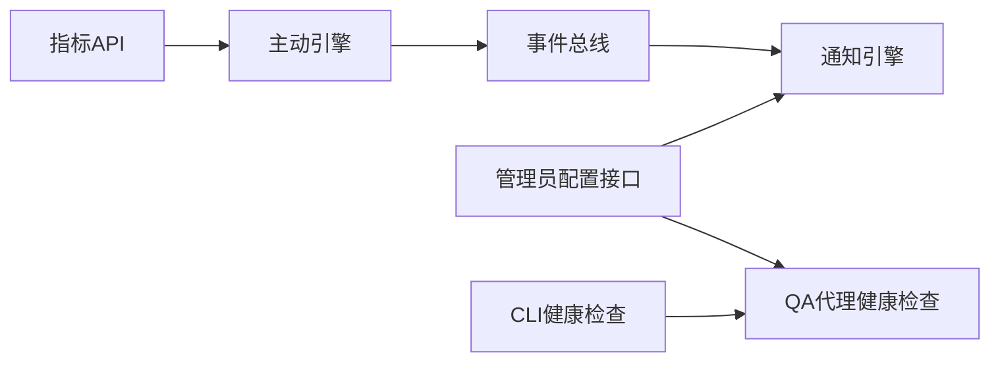

# 监控与告警

<cite>
**本文引用的文件**
- [后端API文档](file://后端api.md)
- [指标API](file://backend/app/api/metrics.py)
- [主动引擎](file://backend/app/core/proactive_engine.py)
- [事件总线](file://backend/app/core/event_bus.py)
- [通知引擎](file://backend/app/core/notification_engine.py)
- [QA代理健康检查](file://backend/app/core/qa_agent.py)
- [管理员配置接口](file://backend/app/api/admin.py)
- [CLI健康检查](file://backend/app/api/cli.py)
- [后端变更路线图](file://后端变更路线图.md)
- [前端指标页面](file://frontend/src/pages/MetricsPage.tsx)
- [前端系统合规页](file://frontend/src/pages/SystemCompliancePage.tsx)
- [前端风险中心](file://frontend/src/pages/RiskCenter.tsx)
- [前端Agent监控页](file://frontend/src/pages/AgentMonitorPage.tsx)
</cite>

## 目录
1. [简介](#简介)
2. [项目结构](#项目结构)
3. [核心组件](#核心组件)
4. [架构总览](#架构总览)
5. [详细组件分析](#详细组件分析)
6. [依赖关系分析](#依赖关系分析)
7. [性能考虑](#性能考虑)
8. [故障排查指南](#故障排查指南)
9. [结论](#结论)
10. [附录](#附录)

## 简介
本文件面向避风港平台的监控与告警体系，目标是建立一套覆盖性能指标、业务指标与健康检查指标的统一监控方案，并结合Prometheus、Grafana与ELK Stack实现可观测性闭环。文档将阐述监控指标设计、告警规则配置方法、实时仪表板构建、告警处理流程与响应机制，以及日志收集、分析与可视化的实践，同时提出解决监控盲点与告警噪音的策略。

## 项目结构
避风港平台采用前后端分离架构，后端基于FastAPI提供REST API，前端使用React+TypeScript构建可视化界面。监控与告警能力主要由后端模块提供，前端负责展示与交互。

**图表来源**
- [指标API:1-139](file://backend/app/api/metrics.py#L1-L139)
- [管理员配置接口:224-256](file://backend/app/api/admin.py#L224-L256)
- [CLI健康检查:95-96](file://backend/app/api/cli.py#L95-L96)
- [主动引擎:538-573](file://backend/app/core/proactive_engine.py#L538-L573)
- [事件总线:412-439](file://backend/app/core/event_bus.py#L412-L439)
- [通知引擎:1-252](file://backend/app/core/notification_engine.py#L1-L252)
- [QA代理健康检查:322-351](file://backend/app/core/qa_agent.py#L322-L351)
- [前端指标页面](file://frontend/src/pages/MetricsPage.tsx)
- [前端系统合规页](file://frontend/src/pages/SystemCompliancePage.tsx)
- [前端风险中心](file://frontend/src/pages/RiskCenter.tsx)
- [前端Agent监控页](file://frontend/src/pages/AgentMonitorPage.tsx)

**章节来源**
- [后端API文档:784-793](file://后端api.md#L784-L793)
- [指标API:1-139](file://backend/app/api/metrics.py#L1-L139)
- [管理员配置接口:224-256](file://backend/app/api/admin.py#L224-L256)
- [CLI健康检查:95-96](file://backend/app/api/cli.py#L95-L96)
- [主动引擎:538-573](file://backend/app/core/proactive_engine.py#L538-L573)
- [事件总线:412-439](file://backend/app/core/event_bus.py#L412-L439)
- [通知引擎:1-252](file://backend/app/core/notification_engine.py#L1-L252)
- [QA代理健康检查:322-351](file://backend/app/core/qa_agent.py#L322-L351)

## 核心组件
- 指标API：提供产品级、全局级、自定义指标查询与预警历史接口，支持内置模板与跨产品聚合洞察。
- 主动引擎：负责系统健康状态聚合、组件可用性检查与预警生成。
- 事件总线：统一派发事件，支持WebSocket、通知引擎与Webhook等通道。
- 通知引擎：多渠道通知（仪表盘、WebSocket、邮件、Webhook），按严重级别路由，具备静默时段与历史记录。
- 健康检查接口：基础健康端点、系统详细健康检查与配置健康检查，用于系统状态评估。
- 前端监控页面：指标展示、趋势分析与告警列表可视化。

**章节来源**
- [指标API:1-139](file://backend/app/api/metrics.py#L1-L139)
- [主动引擎:538-573](file://backend/app/core/proactive_engine.py#L538-L573)
- [事件总线:412-439](file://backend/app/core/event_bus.py#L412-L439)
- [通知引擎:1-252](file://backend/app/core/notification_engine.py#L1-L252)
- [后端API文档:784-793](file://后端api.md#L784-L793)

## 架构总览
监控与告警架构分为三层：采集层、处理层与展示层。采集层通过后端指标API与健康检查端点收集系统与业务指标；处理层由主动引擎与事件总线进行聚合、预警与分发；展示层由前端页面与外部工具（Grafana、ELK）呈现。

**图表来源**
- [后端API文档:784-793](file://后端api.md#L784-L793)
- [指标API:1-139](file://backend/app/api/metrics.py#L1-L139)
- [主动引擎:538-573](file://backend/app/core/proactive_engine.py#L538-L573)
- [事件总线:412-439](file://backend/app/core/event_bus.py#L412-L439)
- [通知引擎:1-252](file://backend/app/core/notification_engine.py#L1-L252)
- [前端指标页面](file://frontend/src/pages/MetricsPage.tsx)
- [前端系统合规页](file://frontend/src/pages/SystemCompliancePage.tsx)
- [前端风险中心](file://frontend/src/pages/RiskCenter.tsx)
- [前端Agent监控页](file://frontend/src/pages/AgentMonitorPage.tsx)

## 详细组件分析

### 指标API与指标设计
- 指标类型
  - 性能指标：系统响应时间、吞吐量、错误率、资源利用率等。
  - 业务指标：合规检查通过率、产品上架成功率、风险事件数量等。
  - 健康检查指标：组件可用性、服务版本、心跳状态等。
- 关键端点
  - 产品指标：按产品维度聚合与查询。
  - 全局指标：系统整体健康与性能聚合。
  - 预警历史：按严重级别过滤与分页查询。
  - 自定义指标：创建、更新、删除与查询。
  - 内置模板：提供标准化指标模板。
  - 跨产品洞察：异常检测与趋势分析。
- 数据来源
  - 主动引擎负责聚合与计算，指标数据持久化于全局目录。

**图表来源**
- [指标API:90-134](file://backend/app/api/metrics.py#L90-L134)
- [主动引擎:538-573](file://backend/app/core/proactive_engine.py#L538-L573)

**章节来源**
- [指标API:1-139](file://backend/app/api/metrics.py#L1-L139)

### 健康检查与系统状态
- 健康端点
  - 基础健康：返回服务状态与版本信息。
  - 系统健康：QAAgent诊断与组件状态。
  - 配置健康：核心组件健康检查汇总。
- 状态聚合
  - 主动引擎定期检查事件总线、产品存储、Worker注册表、通知引擎等关键组件。
  - QA代理对产品存储、事件注册表、Worker注册表进行健康检查，并根据异常调整总体状态。

**图表来源**
- [主动引擎:538-573](file://backend/app/core/proactive_engine.py#L538-L573)
- [QA代理健康检查:322-351](file://backend/app/core/qa_agent.py#L322-L351)
- [后端API文档:784-793](file://后端api.md#L784-L793)

**章节来源**
- [后端API文档:784-793](file://后端api.md#L784-L793)
- [管理员配置接口:224-256](file://backend/app/api/admin.py#L224-L256)
- [CLI健康检查:95-96](file://backend/app/api/cli.py#L95-L96)
- [主动引擎:538-573](file://backend/app/core/proactive_engine.py#L538-L573)
- [QA代理健康检查:322-351](file://backend/app/core/qa_agent.py#L322-L351)

### 通知引擎与告警分发
- 通知渠道
  - 仪表盘：持久化通知历史，支持标记已读/未读。
  - WebSocket：实时广播通知。
  - 邮件：SMTP集成预留（Listmonk等）。
  - Webhook：外部系统集成。
- 严重级别路由
  - 不同严重级别自动选择通知渠道组合，支持静默时段延迟发送。
- 历史与状态管理
  - 通知历史持久化，支持查询与状态维护。

**图表来源**
- [事件总线:412-439](file://backend/app/core/event_bus.py#L412-L439)
- [通知引擎:1-252](file://backend/app/core/notification_engine.py#L1-L252)

**章节来源**
- [事件总线:412-439](file://backend/app/core/event_bus.py#L412-L439)
- [通知引擎:1-252](file://backend/app/core/notification_engine.py#L1-L252)

### 告警规则配置与阈值设定
- 告警级别
  - critical（严重）、high（高）、medium（中）、low（低）。
- 阈值设置建议
  - 性能：P95响应时间超过阈值、错误率异常升高、CPU/内存使用率持续高位。
  - 业务：合规检查失败率上升、风险事件数量激增、产品上架失败增多。
  - 健康：组件不可用、心跳超时、存储写入失败。
- 通知渠道
  - 严重级别高及以上：仪表盘+WebSocket+邮件+Webhook。
  - 中级别：仪表盘+WebSocket。
  - 低级别：仪表盘。
- 静默时段
  - 非紧急通知在业务低峰期延迟发送，减少干扰。

**章节来源**
- [通知引擎:69-79](file://backend/app/core/notification_engine.py#L69-L79)

### 实时监控仪表板构建
- 指标展示
  - 关键指标：系统健康、产品合规率、风险事件数、请求成功率。
  - 趋势分析：近1小时/1天/7天趋势，同比/环比对比。
- 前端页面
  - 指标页面、系统合规页、风险中心、Agent监控页提供可视化与交互。
- 外部工具
  - Grafana：基于Prometheus数据源构建仪表板。
  - ELK：日志收集、过滤与可视化分析。

**章节来源**
- [前端指标页面](file://frontend/src/pages/MetricsPage.tsx)
- [前端系统合规页](file://frontend/src/pages/SystemCompliancePage.tsx)
- [前端风险中心](file://frontend/src/pages/RiskCenter.tsx)
- [前端Agent监控页](file://frontend/src/pages/AgentMonitorPage.tsx)

### 告警处理流程与响应机制
- 触发条件
  - 指标阈值越界或健康检查异常。
- 分发路径
  - 事件总线 → 通知引擎 → 多渠道推送。
- 响应机制
  - 仪表盘与WebSocket即时提醒。
  - 邮件与Webhook联动外部系统。
  - 历史记录便于回溯与复盘。

**章节来源**
- [后端变更路线图:1599-1614](file://后端变更路线图.md#L1599-L1614)
- [事件总线:412-439](file://backend/app/core/event_bus.py#L412-L439)
- [通知引擎:1-252](file://backend/app/core/notification_engine.py#L1-L252)

### 日志收集、分析与可视化
- 收集
  - 应用日志输出至标准输出/文件，供ELK采集。
- 分析
  - 使用Logstash/Fluentd解析，Kibana进行检索与分析。
- 可视化
  - Kibana仪表板展示日志趋势、错误分布与Top N异常。

**章节来源**
- [通知引擎:16-18](file://backend/app/core/notification_engine.py#L16-L18)

## 依赖关系分析
- 组件耦合
  - 指标API依赖主动引擎进行聚合；主动引擎依赖事件总线与各组件状态。
  - 事件总线依赖通知引擎进行多渠道分发。
  - 健康检查端点依赖QA代理与主动引擎。
- 外部依赖
  - Prometheus：抓取指标。
  - Grafana：展示指标。
  - ELK：日志分析。
- 循环依赖
  - 当前设计避免直接循环依赖，通过接口与工厂函数解耦。

**图表来源**
- [指标API:1-139](file://backend/app/api/metrics.py#L1-L139)
- [主动引擎:538-573](file://backend/app/core/proactive_engine.py#L538-L573)
- [事件总线:412-439](file://backend/app/core/event_bus.py#L412-L439)
- [通知引擎:1-252](file://backend/app/core/notification_engine.py#L1-L252)
- [管理员配置接口:224-256](file://backend/app/api/admin.py#L224-L256)
- [CLI健康检查:95-96](file://backend/app/api/cli.py#L95-L96)
- [QA代理健康检查:322-351](file://backend/app/core/qa_agent.py#L322-L351)

**章节来源**
- [指标API:1-139](file://backend/app/api/metrics.py#L1-L139)
- [主动引擎:538-573](file://backend/app/core/proactive_engine.py#L538-L573)
- [事件总线:412-439](file://backend/app/core/event_bus.py#L412-L439)
- [通知引擎:1-252](file://backend/app/core/notification_engine.py#L1-L252)
- [管理员配置接口:224-256](file://backend/app/api/admin.py#L224-L256)
- [CLI健康检查:95-96](file://backend/app/api/cli.py#L95-L96)
- [QA代理健康检查:322-351](file://backend/app/core/qa_agent.py#L322-L351)

## 性能考虑
- 指标聚合
  - 使用批量读取与缓存策略，降低I/O压力。
- 通知分发
  - 异步发送与队列化，避免阻塞主流程。
- 健康检查
  - 定期采样与指数退避，防止雪崩效应。
- 可视化
  - 前端懒加载与分页展示，减少一次性渲染压力。

## 故障排查指南
- 健康检查异常
  - 检查事件总线、产品存储、Worker注册表与通知引擎状态。
  - 查看管理员健康端点返回的组件状态与摘要。
- 通知未送达
  - 核对通知配置中的渠道启用状态与凭据。
  - 检查WebSocket连接与Webhook地址有效性。
- 指标缺失或延迟
  - 确认主动引擎是否正常运行与指标文件是否可读。
  - 检查前端请求参数与分页限制。

**章节来源**
- [管理员配置接口:224-256](file://backend/app/api/admin.py#L224-L256)
- [通知引擎:61-79](file://backend/app/core/notification_engine.py#L61-L79)
- [指标API:100-108](file://backend/app/api/metrics.py#L100-L108)

## 结论
避风港平台已具备完善的监控与告警基础：指标API、主动引擎、事件总线与通知引擎协同工作，配合健康检查端点与前端可视化页面，形成可观测性闭环。结合Prometheus、Grafana与ELK Stack，可进一步提升指标与日志的可视化能力。通过合理的阈值设定、告警级别与通知渠道策略，以及静默时段与历史记录管理，能够有效降低告警噪音并提高响应效率。

## 附录
- 建议的监控指标清单
  - 性能：请求延迟、错误率、吞吐量、资源使用率。
  - 业务：合规通过率、风险事件数、产品上架成功率。
  - 健康：组件可用性、服务版本、心跳状态。
- 告警规则模板
  - 基于阈值与趋势的规则，结合严重级别与静默时段。
- 仪表板建议
  - 关键指标卡片、趋势折线图、告警热力图与日志Top N。