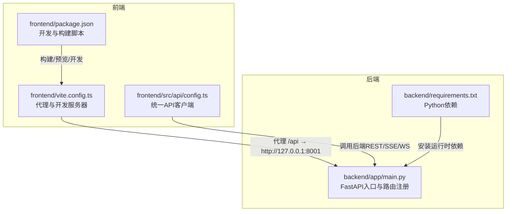
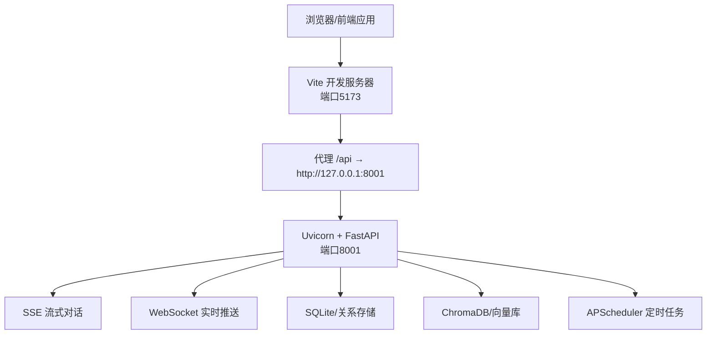
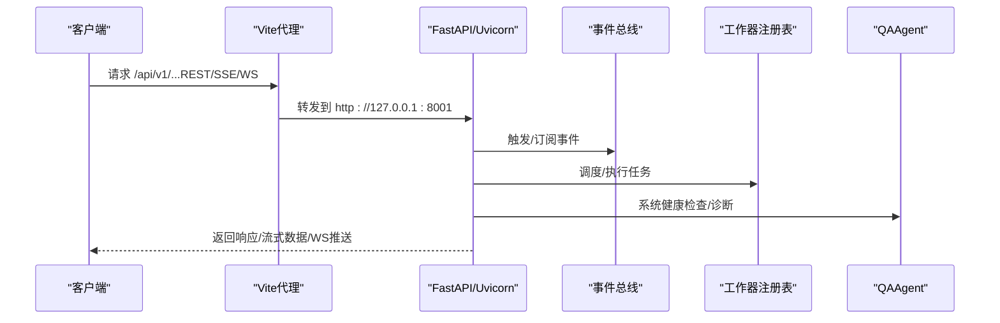
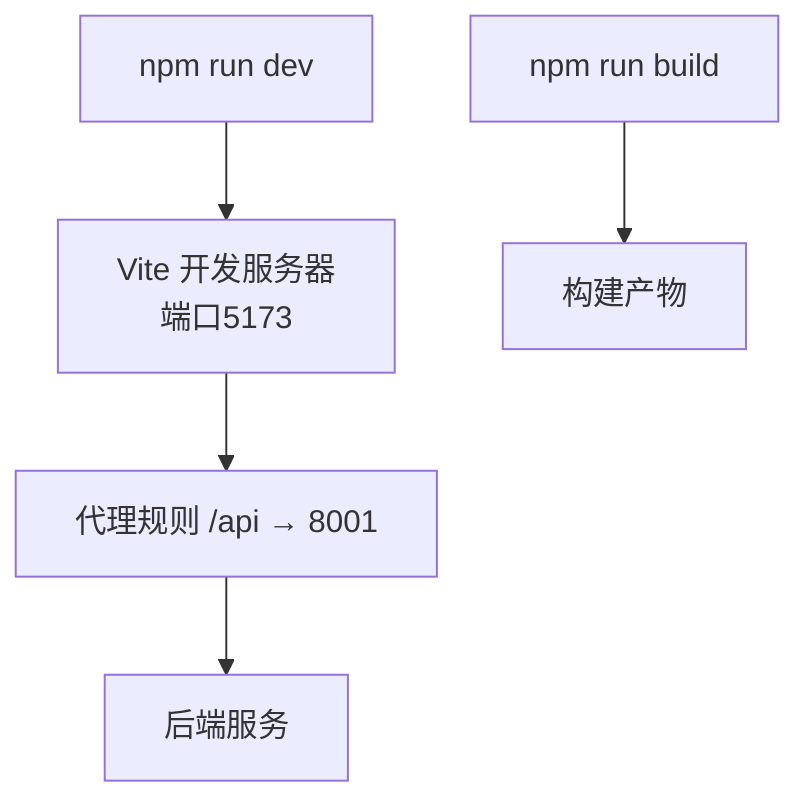
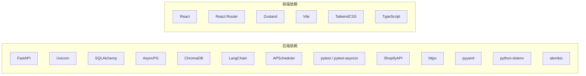

# 部署与运维

<cite>
**本文引用的文件**
- [README.md](file://README.md)
- [backend/app/main.py](file://backend/app/main.py)
- [backend/requirements.txt](file://backend/requirements.txt)
- [frontend/package.json](file://frontend/package.json)
- [frontend/vite.config.ts](file://frontend/vite.config.ts)
- [frontend/src/api/config.ts](file://frontend/src/api/config.ts)
- [backend/app/config.py](file://backend/app/config.py)
- [backend/data/config/events/README.md](file://backend/data/config/events/README.md)
- [backend/data/config/workers/README.md](file://backend/data/config/workers/README.md)
- [backend/data/regulations.md](file://backend/data/regulations.md)
- [后端api.md](file://后端api.md)
- [前后端api交互.md](file://前后端api交互.md)
- [前端api.md](file://前端api.md)
</cite>

## 目录
1. [引言](#引言)
2. [项目结构](#项目结构)
3. [核心组件](#核心组件)
4. [架构总览](#架构总览)
5. [详细组件分析](#详细组件分析)
6. [依赖关系分析](#依赖关系分析)
7. [性能考虑](#性能考虑)
8. [故障排除指南](#故障排除指南)
9. [结论](#结论)
10. [附录](#附录)

## 引言
本文件面向避风港平台的部署与运维团队，提供从开发到生产的完整部署方案。内容涵盖容器化与编排、CI/CD设计思路、环境配置管理、监控告警、安全与性能优化、常见问题排查以及运维手册。文档以仓库现有实现为基础，结合后端FastAPI、前端React/Vite、数据库与向量库的实际技术栈进行说明。

## 项目结构
- 后端采用Python 3.13 + FastAPI，提供约200+ REST端点，支持SSE流式对话、WebSocket实时推送、定时任务与多阶段路由扩展。
- 前端采用React 18 + TypeScript + Vite + TailwindCSS，开发服务器默认端口5173，并通过代理转发/api到后端8001端口。
- 存储与知识库：SQLite关系存储、ChromaDB向量数据库；运行时数据与配置位于backend/data目录。
- 依赖管理：后端requirements.txt集中声明；前端package.json定义构建与开发脚本。

图表来源
- [frontend/package.json:1-28](file://frontend/package.json#L1-L28)
- [frontend/vite.config.ts:1-16](file://frontend/vite.config.ts#L1-L16)
- [frontend/src/api/config.ts](file://frontend/src/api/config.ts)
- [backend/app/main.py:1-215](file://backend/app/main.py#L1-L215)
- [backend/requirements.txt:1-27](file://backend/requirements.txt#L1-L27)

章节来源
- [README.md:37-64](file://README.md#L37-L64)
- [frontend/package.json:1-28](file://frontend/package.json#L1-L28)
- [frontend/vite.config.ts:1-16](file://frontend/vite.config.ts#L1-L16)
- [backend/app/main.py:1-215](file://backend/app/main.py#L1-L215)
- [backend/requirements.txt:1-27](file://backend/requirements.txt#L1-L27)

## 核心组件
- 后端服务（FastAPI）
  - 提供健康检查、系统健康检查、WebSocket实时通道、SSE流式对话端点。
  - 注册多阶段路由模块，覆盖认证、产品、事件、知识库、调度、管理等。
  - 启动时初始化调度器、事件总线、QAAgent、技能/插件/安全沙箱等核心组件。
- 前端应用（React + Vite）
  - 开发服务器默认5173端口，通过代理将/api前缀转发至后端8001端口。
  - 统一API客户端封装，便于跨页面调用后端接口。
- 运行时依赖
  - 后端依赖包括FastAPI、Uvicorn、Pydantic Settings、SQLAlchemy、AsyncPG、ChromaDB、LangChain、APScheduler、pytest等。
  - 前端依赖包括React、React Router、TailwindCSS、Vite等。

章节来源
- [backend/app/main.py:106-137](file://backend/app/main.py#L106-L137)
- [backend/app/main.py:141-215](file://backend/app/main.py#L141-L215)
- [backend/requirements.txt:1-27](file://backend/requirements.txt#L1-L27)
- [frontend/package.json:1-28](file://frontend/package.json#L1-L28)
- [frontend/vite.config.ts:7-15](file://frontend/vite.config.ts#L7-L15)

## 架构总览
下图展示从浏览器到后端服务的整体交互路径，包括REST、SSE与WebSocket三种通信方式。

图表来源
- [frontend/vite.config.ts:7-15](file://frontend/vite.config.ts#L7-L15)
- [backend/app/main.py:106-137](file://backend/app/main.py#L106-L137)
- [backend/requirements.txt:1-27](file://backend/requirements.txt#L1-L27)

## 详细组件分析

### 后端服务（FastAPI）
- 路由与端点
  - 健康检查与系统健康检查端点，便于容器探针与运维巡检。
  - WebSocket端点用于实时消息推送。
  - SSE端点用于流式AI对话。
  - 多阶段路由模块覆盖认证、产品、事件、知识库、调度、管理等。
- 生命周期
  - startup事件中初始化调度器、事件总线、QAAgent、技能/插件/安全沙箱、RBAC与审批流程等。
  - shutdown事件中停止调度器与自动拉取引擎。
- 环境变量与SDK
  - 从配置模块读取设置并注入到os.environ，确保SDK（如Claude Agent SDK）可用。

图表来源
- [backend/app/main.py:141-215](file://backend/app/main.py#L141-L215)
- [backend/app/main.py:106-137](file://backend/app/main.py#L106-L137)

章节来源
- [backend/app/main.py:1-215](file://backend/app/main.py#L1-L215)

### 前端应用（React + Vite）
- 开发与构建
  - 开发服务器端口5173，通过代理将/api转发至后端8001。
  - 构建产物由Vite生成，TypeScript类型检查在开发时启用。
- API客户端
  - 统一的API客户端集中于frontend/src/api/config.ts，便于跨页面调用与维护。

图表来源
- [frontend/package.json:6-9](file://frontend/package.json#L6-L9)
- [frontend/vite.config.ts:7-15](file://frontend/vite.config.ts#L7-L15)

章节来源
- [frontend/package.json:1-28](file://frontend/package.json#L1-L28)
- [frontend/vite.config.ts:1-16](file://frontend/vite.config.ts#L1-L16)
- [frontend/src/api/config.ts](file://frontend/src/api/config.ts)

### 配置与环境变量
- 环境变量模板与示例
  - 参考README中的.env示例，包含OpenRouter API密钥、JWT密钥、Shopify密钥与密文等。
- 配置加载
  - 后端通过配置模块读取设置，并在必要时写入os.environ，确保SDK可用。
- 运行时配置
  - 事件与工作器的全局配置位于backend/data/config/events与backend/data/config/workers，README提供了用途说明。

章节来源
- [README.md:164-173](file://README.md#L164-L173)
- [backend/app/main.py:12-18](file://backend/app/main.py#L12-L18)
- [backend/data/config/events/README.md](file://backend/data/config/events/README.md)
- [backend/data/config/workers/README.md](file://backend/data/config/workers/README.md)

### 数据与知识库
- 数据组织
  - 运行时数据与配置位于backend/data，包括事件链、全局指标、通知历史、产品索引、产品记忆与指标、知识库等。
- 法规与增值税率
  - backend/data/regulations.md提供法规概览，backend/data/vat_rates.json提供增值税率数据，支撑合规扫描与风险评估。

章节来源
- [backend/data/regulations.md](file://backend/data/regulations.md)
- [README.md:37-64](file://README.md#L37-L64)

## 依赖关系分析
- 后端依赖
  - Web框架与ASGI：FastAPI + Uvicorn
  - ORM与数据库：SQLAlchemy + AsyncPG
  - 向量库：ChromaDB + LangChain
  - 调度：APScheduler
  - 测试：pytest + pytest-asyncio
  - 其他：ShopifyAPI、httpx、pyyaml、python-dotenv、alembic等
- 前端依赖
  - React生态：React、React Router、Zustand
  - 构建与样式：Vite、TailwindCSS、@tailwindcss/vite、TypeScript

图表来源
- [backend/requirements.txt:1-27](file://backend/requirements.txt#L1-L27)
- [frontend/package.json:11-26](file://frontend/package.json#L11-L26)

章节来源
- [backend/requirements.txt:1-27](file://backend/requirements.txt#L1-L27)
- [frontend/package.json:1-28](file://frontend/package.json#L1-L28)

## 性能考虑
- 启动与预热
  - 后端在startup事件中预加载Claude Agent SDK并初始化多个核心组件，有助于减少首次请求延迟。
- 并发与事件循环
  - Windows环境下显式设置事件循环策略，避免子进程创建异常导致的阻塞或错误。
- SSE与WebSocket
  - SSE用于流式对话，WebSocket用于实时推送，建议在高并发场景下配合限流与连接池策略。
- 数据库与向量库
  - SQLite适合开发与小规模生产；若需高并发，建议迁移到PostgreSQL并配合连接池与索引优化。
- 调度与定时任务
  - APScheduler适用于轻量调度；生产环境建议使用更可靠的分布式调度方案（如Celery + Redis/RabbitMQ）。

章节来源
- [backend/app/main.py:7-10](file://backend/app/main.py#L7-L10)
- [backend/app/main.py:141-215](file://backend/app/main.py#L141-L215)
- [backend/requirements.txt:23-24](file://backend/requirements.txt#L23-L24)

## 故障排除指南
- 启动失败（Windows）
  - 现象：子进程创建报错或事件循环异常。
  - 处理：确保已设置WindowsProactorEventLoopPolicy，已在后端入口中自动处理。
- 端口冲突
  - 现象：5173（前端）或8001（后端）被占用。
  - 处理：修改Vite开发服务器端口或后端监听端口，或释放对应端口。
- CORS错误
  - 现象：前端跨域访问后端API失败。
  - 处理：确认CORS允许的origins包含前端地址，已在后端入口中配置。
- 环境变量未生效
  - 现象：SDK无法读取密钥或配置异常。
  - 处理：确保从配置模块读取并写入os.environ，已在后端入口中处理。
- SSE/WS连接问题
  - 现象：流式对话或实时推送断连。
  - 处理：检查代理规则、网络连通性与后端日志；确认WebSocket端点与SSE端点可用。

章节来源
- [backend/app/main.py:7-10](file://backend/app/main.py#L7-L10)
- [backend/app/main.py:46-52](file://backend/app/main.py#L46-L52)
- [backend/app/main.py:121-137](file://backend/app/main.py#L121-L137)
- [frontend/vite.config.ts:7-15](file://frontend/vite.config.ts#L7-L15)

## 结论
本方案基于仓库现有实现，提供了从开发到生产的部署与运维蓝图：明确的前后端交互边界、清晰的路由与生命周期管理、完善的健康检查与实时通信能力。建议在生产环境中进一步完善容器化与编排、CI/CD流水线、监控告警与安全加固，以满足高可用与可扩展需求。

## 附录

### A. 快速部署与本地验证
- 后端
  - 安装依赖、复制并编辑环境变量文件、启动服务（默认8001端口）。
- 前端
  - 安装依赖、启动开发服务器（默认5173端口），通过代理访问后端API。
- 访问
  - 前端页面、后端API、Swagger文档与默认账号信息详见README。

章节来源
- [README.md:68-110](file://README.md#L68-L110)

### B. API概览与交互要点
- 主要模块与端点分组
  - 认证、对话（SSE）、产品、事件、Shopify、Agent、Skills、风险、知识库、记忆、调度、管理等。
- 交互文档
  - 后端API文档与交互说明分别见后端api.md、前后端api交互.md、前端api.md。

章节来源
- [README.md:113-132](file://README.md#L113-L132)
- [后端api.md](file://后端api.md)
- [前后端api交互.md](file://前后端api交互.md)
- [前端api.md](file://前端api.md)

### C. 生产环境部署最佳实践（建议）
- 容器化与编排
  - 使用Docker分别构建后端与前端镜像，通过Compose或Kubernetes编排，设置健康检查与资源限制。
- CI/CD流水线
  - 建议包含代码质量检查、单元测试、构建镜像、推送镜像、滚动更新与回滚策略。
- 环境配置管理
  - 使用Secrets管理敏感变量，区分开发/测试/生产环境，采用配置中心或Kubernetes ConfigMap/Secret。
- 监控与告警
  - 部署Prometheus/Grafana与Alertmanager，建立关键指标（CPU/内存/请求延迟/错误率/队列长度）与日志聚合。
- 安全加固
  - 强制HTTPS、最小权限原则、定期轮换密钥、输入校验与输出编码、WAF与入侵检测。
- 性能调优
  - 数据库连接池、缓存（Redis）、异步I/O、CDN与静态资源优化、负载均衡与水平扩展。

[本节为通用实践建议，不直接分析具体文件，故无“章节来源”]